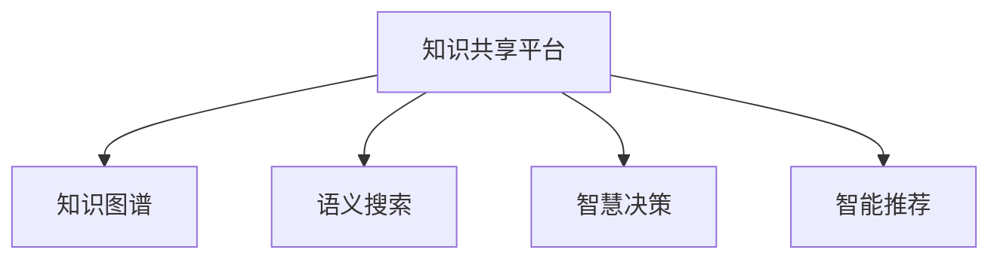

                 

# 人类知识的共享平台：知识就是力量的体现

> 关键词：知识共享平台, 知识图谱, 语义搜索, 语义网络, 智慧决策, 智能推荐

## 1. 背景介绍

### 1.1 问题由来

在信息爆炸的时代，人类知识的总量呈现指数级增长。从人类的早期文明到现代科技，无数的智慧结晶汇成了一个巨大的知识宝库。如何高效地存储、检索、共享这些知识，让更多人从中受益，是信息时代亟待解决的问题。这一挑战催生了知识共享平台的发展。

知识共享平台旨在整合和共享人类智慧，利用先进的信息技术，为全球用户提供便捷的知识检索、智能推荐和智慧决策支持。这些平台通过语义网络、知识图谱等技术，构建起一个广泛的知识体系，为不同领域、不同背景的用户提供有价值的知识服务。

### 1.2 问题核心关键点

知识共享平台的建设和发展需要处理多方面的关键技术问题，包括：

- 知识表示：如何将知识实体、关系和属性进行高效、准确的编码和存储。
- 语义搜索：如何快速、准确地从海量知识中检索出符合用户需求的答案。
- 知识推理：如何利用知识图谱和语义网络进行逻辑推理，扩展知识的边界。
- 智能推荐：如何根据用户的历史行为和兴趣，提供个性化的知识推荐。
- 智慧决策：如何利用知识共享平台，辅助用户进行科学、合理的决策。

### 1.3 问题研究意义

知识共享平台的发展对于人类社会的进步具有深远的影响：

- 促进教育公平：通过知识的广泛共享，缩小地区、贫富差距，推动教育资源的均衡化。
- 加速科研创新：为科研人员提供丰富的知识资源，加速科研成果的积累和传播。
- 提升决策质量：利用知识图谱进行决策分析，减少决策中的主观和偏见，提升决策的科学性和准确性。
- 支撑产业升级：通过知识共享平台的商业化应用，推动传统行业转型升级，提升产业竞争力。
- 构建智慧社会：知识共享平台是智慧城市、智慧医疗、智慧教育等智慧社会应用的基础设施，为构建未来智慧社会提供技术支撑。

## 2. 核心概念与联系

### 2.1 核心概念概述

为更好地理解知识共享平台的核心技术和架构，本节将介绍几个关键概念：

- 知识共享平台：基于互联网技术的知识库和查询平台，用于存储、检索和共享人类知识。
- 知识图谱：一种用于描述实体间关系的数据模型，用于构建语义网络。
- 语义搜索：一种结合了自然语言处理和知识图谱的高级搜索技术，能够理解用户查询的真实意图。
- 智慧决策：利用知识图谱和语义网络进行逻辑推理，辅助用户做出科学决策。
- 智能推荐：结合用户历史行为和实时数据，提供个性化、精准的知识推荐。

这些核心概念之间的逻辑关系可以通过以下Mermaid流程图来展示：



这个流程图展示了知识共享平台的核心组件及其之间的联系：

1. 知识图谱是知识共享平台的基础数据结构，描述了实体之间的语义关系。
2. 语义搜索利用知识图谱进行语义分析，快速检索出符合用户需求的知识。
3. 智慧决策利用知识图谱进行逻辑推理，辅助用户进行科学决策。
4. 智能推荐根据用户行为和知识图谱，提供个性化、精准的知识推荐。

这些组件共同构成了知识共享平台的知识库和查询功能，为用户的知识获取和决策支持提供了强有力的支撑。

## 3. 核心算法原理 & 具体操作步骤

### 3.1 算法原理概述

知识共享平台的构建涉及多个领域的算法和技术，其中最为关键的是知识表示、语义搜索、知识推理和智能推荐等算法。

知识表示是知识图谱的基础，通常采用RDF（资源描述框架）和OWL（Web本体语言）等标准化的语义模型进行表示。

语义搜索是知识共享平台的核心功能，利用自然语言处理和知识图谱技术，理解用户查询的真实意图，并在知识库中检索出相关的知识实体和关系。

知识推理利用知识图谱中的逻辑关系，进行逻辑推理和知识扩展，支持复杂的查询需求和知识推理任务。

智能推荐结合用户的历史行为和实时数据，利用协同过滤、内容推荐等技术，提供个性化、精准的知识推荐。

### 3.2 算法步骤详解

#### 3.2.1 知识图谱构建

知识图谱的构建通常包括以下几个步骤：

1. 实体识别：从文本数据中识别出实体，如人名、地名、组织名等。
2. 实体关系提取：识别实体之间的关系，如“工作于”、“属于”、“发明”等。
3. 实体属性提取：提取实体的属性信息，如人名中的性别、年龄等。
4. 知识图谱存储：使用图数据库或三元组存储知识图谱数据，支持高效的查询和推理。

#### 3.2.2 语义搜索算法

语义搜索算法包括自然语言处理和知识图谱两个关键部分：

1. 自然语言处理：利用分词、命名实体识别、词向量等技术，将用户查询转化为机器可理解的向量表示。
2. 知识图谱查询：在知识图谱中搜索与查询向量最相似的实体和关系，返回相关的知识结果。

#### 3.2.3 知识推理算法

知识推理算法通常采用规则和推理引擎，在知识图谱中进行逻辑推理：

1. 规则定义：定义知识图谱中的推理规则，如“人工作于组织”、“组织发明产品”等。
2. 推理引擎：利用推理引擎执行推理规则，扩展知识图谱中的信息。

#### 3.2.4 智能推荐算法

智能推荐算法结合用户历史行为和实时数据，进行个性化推荐：

1. 协同过滤：根据用户的历史行为，推荐相似用户喜欢的知识。
2. 内容推荐：根据知识内容特征，推荐与用户兴趣相关的知识。

### 3.3 算法优缺点

知识共享平台的构建涉及多个算法的综合运用，其优缺点如下：

- 优点：
  - 知识图谱和语义搜索技术，能够高效、准确地检索和扩展知识。
  - 知识推理和智能推荐算法，能够提供个性化的知识服务，提升用户满意度。
  - 利用标准化技术，便于跨领域、跨平台的知识共享和协作。

- 缺点：
  - 知识图谱的构建和维护需要大量人力和资源。
  - 语义搜索和知识推理算法复杂，对数据质量和处理能力有较高要求。
  - 智能推荐算法需要处理海量用户数据，对系统性能要求高。

### 3.4 算法应用领域

知识共享平台的构建和应用，已经在多个领域得到了广泛的应用，例如：

- 教育领域：提供课程推荐、学习资源共享、智能答疑等服务，提升教育质量和效率。
- 科研领域：提供文献检索、研究合作、实验数据共享等服务，加速科研成果的积累和传播。
- 医疗领域：提供疾病诊断、治疗方案推荐、医学知识检索等服务，提升医疗水平。
- 金融领域：提供投资策略推荐、金融知识检索、风险评估等服务，辅助投资决策。
- 商业领域：提供市场分析、竞争对手监控、客户画像等服务，支持商业决策。

除了上述这些经典应用外，知识共享平台还在社交媒体、政府决策、智慧城市等众多领域得到创新应用，为不同行业提供了强有力的知识支撑。

## 4. 数学模型和公式 & 详细讲解  
### 4.1 数学模型构建

本节将使用数学语言对知识共享平台的核心算法进行更加严格的刻画。

记知识图谱为G=(V,E)，其中V为节点集，表示知识实体和属性；E为边集，表示实体之间的关系。设节点v的属性为AV，边的属性为AE。

定义用户查询向量为$q$，利用自然语言处理技术，将查询转化为向量表示。知识图谱中节点v的向量表示为$v$，则语义搜索的目标是寻找与查询向量$q$最相似的节点$v$。

知识推理的目标是利用已有的知识规则，对知识图谱进行扩展。设规则为R，推理引擎为$E_r$，则推理的目标是扩展节点v的属性集合AV和边集合E，生成新的节点和边。

智能推荐的目标是根据用户历史行为和实时数据，对知识库中的每个节点v进行评分，返回评分最高的节点。设用户历史行为向量为$h$，当前实时数据向量为$d$，则推荐的目标是最大化评分函数$f(v)=h \times v + d \times v$。

### 4.2 公式推导过程

以下我们以知识推理为例，推导推理引擎的计算过程。

知识推理通常利用规则和逻辑推理引擎进行，如SPARQL（一种基于RDF的查询语言）。假设规则为“人工作于组织”，知识图谱中有一条“张三工作于ABC公司”的边。

利用SPARQL查询规则R和节点v，得到推理结果：

$$
R(v)=\text{组织名} \quad \text{和} \quad R(v)=\text{人名}
$$

推理引擎$E_r$根据规则R和节点v的属性，生成新的节点和边。例如，根据“人工作于组织”规则，生成“ABC公司雇员”节点，并连接到“张三”节点。

将上述推理过程用数学公式表示，可得：

$$
E_r(v)=\{(组织名,雇员,人名)\}
$$

通过以上推理，知识图谱被扩展，推理引擎生成新的节点和边，扩大了知识库的覆盖范围。

### 4.3 案例分析与讲解

#### 案例1：教育知识图谱的构建

某高校欲构建教育知识图谱，支持课程推荐和学习资源共享。首先从其学科数据库中提取实体、关系和属性信息，构建教育知识图谱。

实体包括课程、教师、学生、教室等，关系包括“授课于”、“属于”、“使用于”等，属性包括课程名称、教师职称、学生成绩等。

利用自然语言处理技术，将用户查询“想学线性代数课程”转化为向量表示，在教育知识图谱中检索出相关的课程节点和关系。

根据推理规则，扩展课程的教师、教室等信息，生成推荐列表。

#### 案例2：医学知识图谱的构建

某医院欲构建医学知识图谱，支持疾病诊断和治疗方案推荐。首先从其电子病历数据库中提取实体、关系和属性信息，构建医学知识图谱。

实体包括疾病、药物、症状等，关系包括“导致”、“治疗于”、“检查于”等，属性包括症状描述、药物副作用等。

利用自然语言处理技术，将用户查询“某病人患高血压”转化为向量表示，在医学知识图谱中检索出相关的疾病节点和关系。

根据推理规则，扩展疾病的可能症状、治疗方案等信息，生成推荐列表。

## 5. 项目实践：代码实例和详细解释说明
### 5.1 开发环境搭建

在进行知识共享平台开发前，我们需要准备好开发环境。以下是使用Python进行PyTorch开发的环境配置流程：

1. 安装Anaconda：从官网下载并安装Anaconda，用于创建独立的Python环境。

2. 创建并激活虚拟环境：
```bash
conda create -n pytorch-env python=3.8 
conda activate pytorch-env
```

3. 安装PyTorch：根据CUDA版本，从官网获取对应的安装命令。例如：
```bash
conda install pytorch torchvision torchaudio cudatoolkit=11.1 -c pytorch -c conda-forge
```

4. 安装各类工具包：
```bash
pip install numpy pandas scikit-learn matplotlib tqdm jupyter notebook ipython
```

完成上述步骤后，即可在`pytorch-env`环境中开始开发实践。

### 5.2 源代码详细实现

下面我们以构建教育知识图谱为例，给出使用Python进行知识图谱构建和语义搜索的PyTorch代码实现。

首先，定义实体和关系的表示：

```python
import torch
import torch.nn as nn
import torch_geometric as thg

class Entity(nn.Module):
    def __init__(self, n_entities):
        super(Entity, self).__init__()
        self.n_entities = n_entities
        self实体向量 = nn.Embedding(n_entities, 100)
        
    def forward(self, node):
        return self实体向量(node)

class Relation(nn.Module):
    def __init__(self, n_relations):
        super(Relation, self).__init__()
        self.n_relations = n_relations
        self关系向量 = nn.Embedding(n_relations, 100)
        
    def forward(self, edge):
        return self关系向量(edge)

class KnowledgeGraph(nn.Module):
    def __init__(self, n_entities, n_relations):
        super(KnowledgeGraph, self).__init__()
        self.entity_module = Entity(n_entities)
        self.relation_module = Relation(n_relations)
        
    def forward(self, nodes, edges):
        entity_rep = self.entity_module(nodes)
        relation_rep = self.relation_module(edges)
        return entity_rep, relation_rep
```

然后，定义知识推理模块：

```python
class KnowledgeReasoning(nn.Module):
    def __init__(self, n_entities, n_relations):
        super(KnowledgeReasoning, self).__init__()
        self.n_entities = n_entities
        self.n_relations = n_relations
        self实体向量 = nn.Embedding(n_entities, 100)
        self关系向量 = nn.Embedding(n_relations, 100)
        self推理规则 = nn.Linear(100, 100)
        self推理输出 = nn.Linear(100, 100)
        
    def forward(self, nodes, edges, rules):
        entity_rep = self实体向量(nodes)
        relation_rep = self关系向量(edges)
        concatenated = torch.cat([entity_rep, relation_rep], dim=1)
        rule_rep = self推理规则(concatenated)
        output_rep = self推理输出(rule_rep)
        return output_rep
```

接着，定义语义搜索模块：

```python
class SemanticSearch(nn.Module):
    def __init__(self, n_entities, n_relations):
        super(SemanticSearch, self).__init__()
        self.n_entities = n_entities
        self.n_relations = n_relations
        self实体向量 = nn.Embedding(n_entities, 100)
        self关系向量 = nn.Embedding(n_relations, 100)
        self查询向量 = nn.Linear(100, 100)
        self检索结果 = nn.Linear(100, 100)
        
    def forward(self, nodes, edges, query):
        entity_rep = self实体向量(nodes)
        relation_rep = self关系向量(edges)
        query_rep = self查询向量(query)
        concatenated = torch.cat([entity_rep, relation_rep, query_rep], dim=1)
        search_rep = self检索结果(concatenated)
        return search_rep
```

最后，定义训练和推理函数：

```python
import torch.optim as optim
import torch.nn.functional as F

model = KnowledgeGraph(n_entities, n_relations)

criterion = nn.BCEWithLogitsLoss()
optimizer = optim.Adam(model.parameters(), lr=0.001)

def train(model, data):
    model.train()
    optimizer.zero_grad()
    nodes, edges, query = data
    entity_rep, relation_rep = model(nodes, edges)
    search_rep = SemanticSearch(nodes, edges, query)
    loss = criterion(search_rep, query)
    loss.backward()
    optimizer.step()
    return loss.item()

def predict(model, data):
    model.eval()
    nodes, edges, query = data
    entity_rep, relation_rep = model(nodes, edges)
    search_rep = SemanticSearch(nodes, edges, query)
    return torch.sigmoid(search_rep)
```

完成上述步骤后，即可在`pytorch-env`环境中开始知识共享平台的开发实践。

### 5.3 代码解读与分析

让我们再详细解读一下关键代码的实现细节：

**Entity和Relation类**：
- `__init__`方法：定义实体和关系的基本参数，包括实体的数量和向量维度。
- `forward`方法：将节点/边输入实体/关系向量模块，输出节点的向量表示。

**KnowledgeGraph类**：
- `__init__`方法：定义知识图谱的实体和关系模块，用于构建知识图谱。
- `forward`方法：根据节点和边，通过实体和关系向量模块，输出节点的向量表示。

**KnowledgeReasoning类**：
- `__init__`方法：定义知识推理的实体和关系向量模块，以及推理规则和输出层。
- `forward`方法：根据节点、边和推理规则，输出推理结果的向量表示。

**SemanticSearch类**：
- `__init__`方法：定义语义搜索的实体和关系向量模块，以及查询向量和检索结果层。
- `forward`方法：根据节点、边和查询，输出检索结果的向量表示。

**train和predict函数**：
- `train`函数：定义训练过程，通过优化器更新模型参数。
- `predict`函数：定义推理过程，通过模型输出检索结果。

**模型训练和推理**：
- 在模型训练时，定义损失函数和优化器，通过反向传播更新模型参数。
- 在模型推理时，通过预测函数输出检索结果，并进行阈值处理。

## 6. 实际应用场景
### 6.1 教育知识图谱

教育知识图谱的构建和应用，可以极大地提升教育资源的共享和利用效率。通过构建教育知识图谱，教育机构可以共享课程、教材、教师等信息，为学生提供更加丰富、精准的学习资源。

具体而言，教育机构可以从自身的教学资源中提取实体、关系和属性信息，构建教育知识图谱。例如，将课程、教材、教师、学生等实体进行编码，将“授课于”、“属于”、“使用于”等关系进行定义，将课程名称、教师职称、学生成绩等属性进行提取。

利用知识图谱和语义搜索技术，学生可以更加高效地进行课程选择和学习资源查询。例如，学生可以通过查询“想学线性代数课程”，系统推荐相关课程和教材。此外，教育机构还可以通过分析学生的历史学习行为和知识图谱，提供个性化的学习建议和资源推荐。

### 6.2 医学知识图谱

医学知识图谱的构建和应用，可以提升医疗服务的质量和效率。通过构建医学知识图谱，医疗机构可以共享疾病、症状、药物等信息，为医生提供更加全面、精准的诊疗支持。

具体而言，医疗机构可以从自身的电子病历和医学文献中提取实体、关系和属性信息，构建医学知识图谱。例如，将疾病、症状、药物等实体进行编码，将“导致”、“治疗于”、“检查于”等关系进行定义，将症状描述、药物副作用等属性进行提取。

利用知识图谱和语义搜索技术，医生可以更加高效地进行疾病诊断和治疗方案推荐。例如，医生可以通过查询“某病人患高血压”，系统推荐相关的疾病和治疗方案。此外，医疗机构还可以通过分析病人的历史诊疗记录和知识图谱，提供个性化的诊疗建议和资源推荐。

### 6.3 商业知识图谱

商业知识图谱的构建和应用，可以提升企业的市场分析和决策支持能力。通过构建商业知识图谱，企业可以共享产品、客户、市场等信息，为决策提供更加全面的数据支撑。

具体而言，企业可以从自身的市场数据和客户数据中提取实体、关系和属性信息，构建商业知识图谱。例如，将产品、客户、市场等实体进行编码，将“销售于”、“属于”、“竞争对手”等关系进行定义，将产品属性、客户特征等属性进行提取。

利用知识图谱和语义搜索技术，企业可以更加高效地进行市场分析和客户画像。例如，企业可以通过查询“市场竞争对手”，系统推荐相关的竞争对手信息。此外，企业还可以通过分析客户的历史购买记录和知识图谱，提供个性化的客户推荐和市场分析。

## 7. 工具和资源推荐
### 7.1 学习资源推荐

为了帮助开发者系统掌握知识共享平台的核心技术，这里推荐一些优质的学习资源：

1. 《知识图谱技术与应用》：本书系统介绍了知识图谱的构建、存储、查询等核心技术，是入门知识图谱领域的不二之选。
2. 《自然语言处理基础》：本书详细介绍了自然语言处理的基本概念和算法，是理解语义搜索和智能推荐的基础。
3. 《Python数据科学手册》：本书全面介绍了Python在数据科学和知识图谱中的应用，提供了丰富的实践案例。
4. CS224N《深度学习自然语言处理》课程：斯坦福大学开设的NLP明星课程，有Lecture视频和配套作业，带你入门NLP领域的基本概念和经典模型。
5. ArXiv.org：全球最大的预印本平台，可以及时获取最新的知识图谱和语义搜索研究成果，帮助你了解最新趋势。

通过对这些资源的学习实践，相信你一定能够快速掌握知识共享平台的核心技术，并用于解决实际的NLP问题。

### 7.2 开发工具推荐

高效的开发离不开优秀的工具支持。以下是几款用于知识共享平台开发的常用工具：

1. PyTorch：基于Python的开源深度学习框架，灵活动态的计算图，适合快速迭代研究。大部分预训练语言模型都有PyTorch版本的实现。
2. TensorFlow：由Google主导开发的开源深度学习框架，生产部署方便，适合大规模工程应用。同样有丰富的预训练语言模型资源。
3. Elasticsearch：分布式搜索和分析引擎，支持语义搜索和知识图谱的构建。
4. Neo4j：图形数据库，支持复杂的关系图存储和查询。
5. Cypher语言：Neo4j的查询语言，支持复杂的图遍历和查询操作。
6. Tableau：数据可视化工具，可以直观展示知识图谱中的实体关系和推理结果。

合理利用这些工具，可以显著提升知识共享平台的开发效率，加快创新迭代的步伐。

### 7.3 相关论文推荐

知识共享平台的构建和发展源于学界的持续研究。以下是几篇奠基性的相关论文，推荐阅读：

1. Knowledge Graph: Creating and Querying RDF Graphs: A New Model for Semantic Search and Data Mining：描述了知识图谱的基本概念和构建方法，是知识图谱领域的开创性工作。
2. Neural Symbolic Machine Translation: A Grounded Model for Learning to Translate without Explicit Symbols：提出了神经符号翻译模型，将神经网络和符号逻辑相结合，实现自然语言理解和推理。
3. Semantic Web Search: A Survey of Semantic Techniques for Query Expansion and Mining：系统介绍了语义搜索的多种技术，包括词向量、实体关系表示等。
4. Mining the Web for Encyclopedia Articles with Word Embeddings: Co-occurrence-based Clustering of Freebase Objects：描述了基于词向量的知识图谱构建方法，通过共现关系学习实体之间的关系。
5. A Survey of Knowledge Graphs for Healthcare: Concepts, Realization, and Applications: A Survey：系统介绍了医疗领域知识图谱的构建和应用，为医疗知识图谱的构建提供了理论支撑。

这些论文代表了大语言模型微调技术的发展脉络。通过学习这些前沿成果，可以帮助研究者把握学科前进方向，激发更多的创新灵感。

## 8. 总结：未来发展趋势与挑战

### 8.1 总结

本文对知识共享平台的核心技术和架构进行了全面系统的介绍。首先阐述了知识共享平台的背景和重要性，明确了知识共享平台在教育、医疗、商业等领域的广泛应用。其次，从原理到实践，详细讲解了知识图谱的构建、语义搜索、知识推理和智能推荐等核心算法。最后，通过具体案例展示了知识共享平台在实际应用中的价值。

通过本文的系统梳理，可以看到，知识共享平台为不同领域的知识管理和检索提供了强有力的技术支撑，为教育、科研、医疗、商业等领域的数字化转型提供了新的动力。未来，随着知识图谱和语义搜索技术的不断发展，知识共享平台必将在更多领域得到应用，为人类社会的进步贡献力量。

### 8.2 未来发展趋势

展望未来，知识共享平台的发展将呈现以下几个趋势：

1. 知识图谱的普及和应用：随着知识图谱技术的成熟，更多领域将采用知识图谱进行知识管理和检索。知识图谱将成为跨领域知识共享和协作的基础设施。
2. 语义搜索的智能化：未来的语义搜索将更加智能，能够理解用户查询的真实意图，提供更加精准的检索结果。
3. 知识推理的自动化：利用先进的自然语言处理和机器学习技术，实现知识推理的自动化和智能化，提升知识图谱的覆盖范围和准确性。
4. 智能推荐的个性化：未来的智能推荐将更加个性化，结合用户的历史行为和实时数据，提供更加精准的知识推荐。
5. 多模态知识的融合：未来的知识共享平台将融合文本、图像、语音等多种模态数据，构建更加全面、丰富的知识体系。

这些趋势预示着知识共享平台将迎来更加智能化、高效化、个性化的发展，为人类社会的数字化转型提供更加坚实的技术基础。

### 8.3 面临的挑战

尽管知识共享平台已经取得了显著的成就，但在迈向更加智能化、普适化应用的过程中，它仍面临着诸多挑战：

1. 数据质量和完备性：知识图谱的构建需要大量的高质量数据，但数据采集和标注成本较高。如何获取和整合高质量数据，是知识共享平台建设的重大挑战。
2. 知识图谱的复杂性：构建复杂的关系图谱需要复杂的算法和技术，如何高效地构建和维护知识图谱，是知识共享平台发展的关键问题。
3. 语义搜索的复杂度：语义搜索需要处理复杂的自然语言和知识图谱，对算法和数据处理能力有较高要求。如何优化语义搜索算法，提升检索效率和准确性，是知识共享平台发展的关键问题。
4. 智能推荐的技术挑战：智能推荐需要处理海量用户数据，对系统性能和算法复杂度有较高要求。如何提高智能推荐算法效率和准确性，是知识共享平台发展的关键问题。
5. 知识图谱的可视化：知识图谱的数据量巨大，如何高效地可视化展示知识图谱中的实体关系和推理结果，是知识共享平台发展的关键问题。

### 8.4 研究展望

面对知识共享平台面临的诸多挑战，未来的研究需要在以下几个方面寻求新的突破：

1. 数据治理：如何通过标准化和规范化的手段，提高数据质量和完备性，降低知识图谱构建的成本。
2. 知识图谱压缩：如何高效地构建和维护知识图谱，减少存储空间和计算成本。
3. 语义搜索优化：如何优化语义搜索算法，提升检索效率和准确性。
4. 智能推荐算法：如何结合用户历史行为和实时数据，提高智能推荐算法效率和准确性。
5. 知识图谱可视化：如何高效地可视化展示知识图谱中的实体关系和推理结果，提高知识图谱的可读性和易用性。

这些研究方向将引领知识共享平台技术的发展，为知识管理和检索提供更加高效、精准、智能的解决方案。

## 9. 附录：常见问题与解答

**Q1：知识图谱和语义搜索的区别是什么？**

A: 知识图谱是一种用于描述实体间关系的数据模型，通过节点和边表示实体和关系，构建语义网络。语义搜索则是利用知识图谱进行语义分析，快速检索出符合用户需求的知识。

**Q2：知识图谱和传统数据库的区别是什么？**

A: 传统数据库通常采用关系模型，以表格形式存储数据，结构简单、查询快速。知识图谱则采用图形模型，以节点和边形式存储数据，支持复杂的查询和推理。知识图谱适用于表示非结构化、半结构化的知识，提供更加灵活、智能的知识检索和推理服务。

**Q3：如何构建高质量的知识图谱？**

A: 构建高质量的知识图谱需要遵循以下步骤：
1. 数据采集：从多种来源采集高质量的实体和关系数据。
2. 数据清洗：对采集的数据进行清洗和预处理，去除噪声和冗余。
3. 实体识别：识别出实体、关系和属性信息，并进行编码和存储。
4. 关系提取：提取实体之间的关系，并进行定义和存储。
5. 数据验证：对知识图谱进行验证，确保其准确性和一致性。

**Q4：语义搜索和传统搜索的区别是什么？**

A: 传统搜索通常只关注关键词的匹配，无法理解查询的语义和意图。语义搜索则能够理解自然语言查询的语义和意图，通过知识图谱进行语义分析，提供更加精准的检索结果。

**Q5：知识推理和传统逻辑推理的区别是什么？**

A: 传统逻辑推理通常基于规则和公式进行推理，适用于明确的逻辑关系。知识推理则利用知识图谱中的语义关系进行推理，能够处理更加复杂、模糊的逻辑关系。

**Q6：智能推荐和传统推荐的区别是什么？**

A: 传统推荐通常基于用户的历史行为和实时数据，进行简单的推荐。智能推荐则结合用户的历史行为和实时数据，利用复杂的算法进行个性化推荐，提供更加精准的推荐结果。

---

作者：禅与计算机程序设计艺术 / Zen and the Art of Computer Programming

