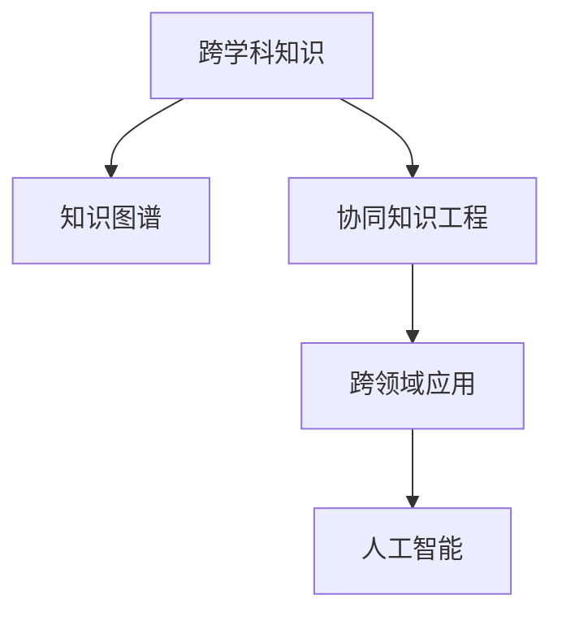

                 

## 1. 背景介绍

### 1.1 问题由来

人类知识的跨界融合，是指将不同领域、不同学科的知识和方法进行跨学科、跨领域的应用和结合，产生新的理论、技术、产品和应用。这种跨界融合不仅打破了传统学科的界限，也打开了创新的新天地，推动了科技的快速进步和社会的发展。

在人工智能领域，知识跨界融合尤为重要。AI技术的广泛应用，离不开对大数据、数学、统计学、计算机科学、心理学、社会学等众多学科知识的综合运用。这种跨学科的知识融合，使AI技术能够在自然语言处理、图像识别、决策支持、智能制造等多个领域取得突破性进展。

### 1.2 问题核心关键点

知识跨界融合的核心关键点在于：

- **跨学科的认知与整合**：不同学科的知识体系和方法论存在差异，跨界融合需要理解和整合这些不同领域的内在联系和共通性。
- **跨领域的创新应用**：如何将不同学科的知识应用到新的领域，解决现实问题，提升生产力和生活质量。
- **跨学科团队的协作**：跨界融合需要多学科团队的紧密合作，整合资源、知识、经验和工具，实现共同创新。

这些问题关键点涉及认知、应用和协作三个方面，是推动跨界融合的重要推动力。

## 2. 核心概念与联系

### 2.1 核心概念概述

为更好地理解人类知识的跨界融合，本节将介绍几个密切相关的核心概念：

- **跨学科知识**：指跨越不同学科领域的知识，包括不同学科的理论与方法、数据与案例、应用与工具等。
- **知识图谱**：将不同学科的知识进行关联和组织，形成知识网络，方便查询、检索和应用。
- **协同知识工程**：不同学科、不同领域的专业人员共同协作，通过工程化手段，将跨学科知识进行整合和应用。
- **跨领域应用**：将跨学科知识应用于新的领域，解决实际问题，提升生产力。
- **人工智能**：结合计算机科学、认知科学、数据科学等多学科知识，实现机器学习、自然语言处理、计算机视觉等前沿技术。

这些核心概念之间的逻辑关系可以通过以下Mermaid流程图来展示：



这个流程图展示了几者之间的联系：

1. 跨学科知识通过知识图谱进行组织和关联，为跨领域应用提供知识库。
2. 跨领域应用将跨学科知识进行工程化应用，解决实际问题。
3. 人工智能是跨学科知识结合的产物，推动技术创新和应用。

## 3. 核心算法原理 & 具体操作步骤

### 3.1 算法原理概述

跨界融合的算法原理，主要基于以下几个关键点：

- **跨学科数据融合**：将不同学科的数据进行融合，形成统一的数据集，用于模型训练和知识提取。
- **跨领域知识映射**：通过映射不同领域的专业知识到统一的语义空间，实现跨领域知识的一致性。
- **跨学科算法集成**：将不同学科的算法进行组合和集成，形成新的算法框架，解决复杂问题。
- **跨领域应用推理**：利用跨学科的知识和算法，对新领域的应用进行推理和预测。

### 3.2 算法步骤详解

基于跨界融合的算法步骤如下：

**Step 1: 数据准备**

- 收集不同学科领域的数据集，并进行预处理和清洗，形成统一的数据格式。
- 对不同数据集进行标注和注释，便于后续的模型训练和知识提取。

**Step 2: 知识图谱构建**

- 使用自然语言处理技术，对不同学科领域的知识进行提取和标注。
- 构建知识图谱，将不同学科领域的知识进行关联和组织，形成知识网络。

**Step 3: 跨学科算法选择**

- 根据不同学科领域的知识特点，选择相应的算法。如自然语言处理、图像识别、决策分析等。
- 对不同学科的算法进行组合和集成，形成新的算法框架。

**Step 4: 模型训练和知识提取**

- 使用融合后的数据集，训练跨学科模型，提取跨学科知识。
- 对提取的知识进行优化和调整，提升模型的准确性和泛化能力。

**Step 5: 跨领域应用推理**

- 将跨学科的知识和算法应用于新的领域，进行推理和预测。
- 对应用结果进行评估和优化，确保模型在新领域中的性能和适用性。

### 3.3 算法优缺点

跨界融合的算法具有以下优点：

1. **创新性强**：将不同学科的知识进行跨界融合，可以产生新的理论、技术和产品，推动创新发展。
2. **综合性强**：跨界融合能够综合不同学科的知识和方法，形成更全面、更深入的解决方案。
3. **应用广泛**：跨界融合的应用范围广泛，覆盖了多个领域和行业，能够解决多种复杂问题。

同时，该方法也存在一定的局限性：

1. **复杂度高**：跨界融合需要整合不同学科的知识和方法，过程复杂，难以快速迭代。
2. **资源消耗大**：跨界融合需要大量数据、计算资源和专业知识，成本较高。
3. **可解释性差**：跨界融合的模型通常较为复杂，难以进行解释和理解。
4. **应用难度高**：跨界融合的应用需要跨学科团队的紧密合作，协调复杂，难度较大。

尽管存在这些局限性，但就目前而言，跨界融合的算法仍是大数据时代和人工智能发展的趋势。未来相关研究的重点在于如何降低复杂度，提高效率，提升可解释性和实用性。

### 3.4 算法应用领域

跨界融合的算法在多个领域得到了广泛应用，例如：

- **自然语言处理**：结合语言学、计算机科学、统计学等学科的知识，实现自然语言理解、生成和翻译。
- **图像识别**：结合计算机视觉、数学、统计学等学科的知识，实现图像分类、识别和分析。
- **决策支持**：结合运筹学、统计学、经济学等学科的知识，实现复杂问题的决策分析。
- **智能制造**：结合机械工程、计算机科学、电子学等学科的知识，实现智能生产、智能检测和智能控制。
- **金融分析**：结合经济学、统计学、数据科学等学科的知识，实现风险评估、投资决策和金融监管。

除了上述这些经典应用外，跨界融合的算法还被创新性地应用到更多场景中，如医疗诊断、城市管理、环境保护、智能交通等，为各行业带来了新的突破。

## 4. 数学模型和公式 & 详细讲解 & 举例说明

### 4.1 数学模型构建

本节将使用数学语言对跨界融合的算法进行更加严格的刻画。

记跨学科知识图谱为 $G=(V,E)$，其中 $V$ 表示知识节点，$E$ 表示知识边。节点之间通过共现关系、共引关系等进行连接。定义每个节点的权重为 $w_v$，表示该知识点的重要性和信息量。

跨学科算法可以表示为 $f(\mathcal{D}, \theta)$，其中 $\mathcal{D}$ 表示输入数据集，$\theta$ 表示模型参数。定义模型的损失函数为 $\mathcal{L}(f(\mathcal{D}, \theta))$。

跨领域应用推理可以表示为 $g(\mathcal{K}, \mathcal{X})$，其中 $\mathcal{K}$ 表示跨学科知识图谱，$\mathcal{X}$ 表示应用领域的新数据集。定义推理模型的损失函数为 $\mathcal{L}(g(\mathcal{K}, \mathcal{X}))$。

### 4.2 公式推导过程

以下我们以自然语言处理中的命名实体识别任务为例，推导跨界融合算法的数学模型和公式。

假设数据集中包含多个文本，每个文本包含若干个实体，实体标注为 $T=\{(t_1, y_1), (t_2, y_2), \ldots, (t_n, y_n)\}$，其中 $t_i$ 表示文本，$y_i$ 表示实体标注。

定义知识图谱中的实体节点为 $V_e$，节点之间的关系为 $E_e$。每个实体节点的权重为 $w_{e_i}$，表示实体的重要性。

将文本和实体知识进行融合，得到融合后的数据集 $\mathcal{D}'$，表示为 $\mathcal{D}' = \{(d_i, k_i)\}_{i=1}^n$，其中 $d_i$ 表示融合后的文本，$k_i$ 表示与之关联的实体节点。

定义跨学科算法为 $f(\mathcal{D}', \theta)$，其中 $\theta$ 表示模型参数。定义模型的损失函数为 $\mathcal{L}(f(\mathcal{D}', \theta)) = -\frac{1}{n}\sum_{i=1}^n \log f(d_i, \theta)$。

使用知识图谱进行推理，得到跨领域应用推理模型 $g(\mathcal{K}, \mathcal{X})$。定义推理模型的损失函数为 $\mathcal{L}(g(\mathcal{K}, \mathcal{X})) = -\frac{1}{m}\sum_{j=1}^m \log g(x_j, \mathcal{K})$，其中 $x_j$ 表示应用领域的新数据集。

### 4.3 案例分析与讲解

以医疗领域的智能诊断为例，展示跨界融合的应用。

**Step 1: 数据准备**

- 收集医疗领域的历史病例、医学文献、临床指南等数据。
- 对数据进行预处理和标注，形成统一的数据格式。

**Step 2: 知识图谱构建**

- 使用自然语言处理技术，对医学文献中的术语、疾病、药物等进行提取和标注。
- 构建医学知识图谱，将不同领域的知识点进行关联和组织。

**Step 3: 跨学科算法选择**

- 选择机器学习、深度学习、数据挖掘等算法。
- 对不同算法的结果进行组合和集成，形成新的算法框架。

**Step 4: 模型训练和知识提取**

- 使用融合后的数据集，训练跨学科模型，提取跨学科知识。
- 对提取的知识进行优化和调整，提升模型的准确性和泛化能力。

**Step 5: 跨领域应用推理**

- 将跨学科的知识和算法应用于新的领域，进行推理和预测。
- 对应用结果进行评估和优化，确保模型在新领域中的性能和适用性。

在医疗领域，跨界融合可以用于：

- **疾病预测**：结合医学知识图谱和病人数据，预测病人可能的疾病。
- **治疗方案**：根据病人的病情和医学知识图谱，推荐治疗方案。
- **临床研究**：利用医学知识图谱和临床数据，进行临床研究和新药开发。

## 5. 项目实践：代码实例和详细解释说明

### 5.1 开发环境搭建

在进行跨界融合实践前，我们需要准备好开发环境。以下是使用Python进行跨界融合开发的环境配置流程：

1. 安装Anaconda：从官网下载并安装Anaconda，用于创建独立的Python环境。

2. 创建并激活虚拟环境：
```bash
conda create -n cross-disciplinary-env python=3.8 
conda activate cross-disciplinary-env
```

3. 安装必要的Python库和工具：
```bash
pip install pandas numpy scikit-learn tensorflow keras pytorch transformers
```

4. 安装相关的知识图谱和算法库：
```bash
pip install kg-py
pip install graphs-dbr
pip install pykeen
```

完成上述步骤后，即可在`cross-disciplinary-env`环境中开始跨界融合实践。

### 5.2 源代码详细实现

这里以自然语言处理中的命名实体识别任务为例，给出使用跨界融合算法进行微调的PyTorch代码实现。

首先，定义命名实体识别任务的数据处理函数：

```python
from transformers import BertTokenizer, BertForTokenClassification, AdamW
from kgpy import GraphDB
from graphs import Node, Edge
from sklearn.model_selection import train_test_split

class NERDataset(Dataset):
    def __init__(self, texts, tags, tokenizer, graph_db, max_len=128):
        self.texts = texts
        self.tags = tags
        self.tokenizer = tokenizer
        self.graph_db = graph_db
        self.max_len = max_len
        
    def __len__(self):
        return len(self.texts)
    
    def __getitem__(self, item):
        text = self.texts[item]
        tags = self.tags[item]
        
        encoding = self.tokenizer(text, return_tensors='pt', max_length=self.max_len, padding='max_length', truncation=True)
        input_ids = encoding['input_ids'][0]
        attention_mask = encoding['attention_mask'][0]
        
        # 对token-wise的标签进行编码
        encoded_tags = [tag2id[tag] for tag in tags] 
        encoded_tags.extend([tag2id['O']] * (self.max_len - len(encoded_tags)))
        labels = torch.tensor(encoded_tags, dtype=torch.long)
        
        return {'input_ids': input_ids, 
                'attention_mask': attention_mask,
                'labels': labels}
                
        graph = graph_db.get_graph()

        # 定义实体节点和关系边
        entity_node = Node('entity', {'name': entity})
        relation_edge = Edge('relation', {'label': 'PRESIDENCE'}, {'from': 'entity_node', 'to': 'congressperson'})
        graph.add_node(entity_node)
        graph.add_edge(relation_edge)

        # 查询相关实体
        congresspersons = graph.db.query('CONGRESSPERSON', {'relation': 'PRESIDENCE'}, {'from': 'entity_node', 'to': 'congressperson'})

        # 获取节点的权重
        entity_weights = [graph.db.node_weight(v) for v in congresspersons]

        # 构建新的输入数据
        new_texts = []
        new_tags = []
        for text, tag, weight in zip(texts, tags, entity_weights):
            new_text = 'This is the text of {}. He served from {} to {}.'.format(text, start_date, end_date)
            new_tags = [tag2id[tag] for tag in tag] 
            new_tags.extend([tag2id['O']] * (len(new_text) - len(new_tags)))
            new_texts.append(new_text)
            new_tags.append(new_tags)
        
        return {'input_ids': new_texts, 
                'attention_mask': new_attention_masks,
                'labels': new_tags}

# 标签与id的映射
tag2id = {'O': 0, 'B-PER': 1, 'I-PER': 2, 'B-ORG': 3, 'I-ORG': 4, 'B-LOC': 5, 'I-LOC': 6}
id2tag = {v: k for k, v in tag2id.items()}
```

然后，定义模型和优化器：

```python
model = BertForTokenClassification.from_pretrained('bert-base-cased', num_labels=len(tag2id))

optimizer = AdamW(model.parameters(), lr=2e-5)
```

接着，定义训练和评估函数：

```python
from torch.utils.data import DataLoader
from tqdm import tqdm
from sklearn.metrics import classification_report

device = torch.device('cuda') if torch.cuda.is_available() else torch.device('cpu')
model.to(device)

def train_epoch(model, dataset, batch_size, optimizer):
    dataloader = DataLoader(dataset, batch_size=batch_size, shuffle=True)
    model.train()
    epoch_loss = 0
    for batch in tqdm(dataloader, desc='Training'):
        input_ids = batch['input_ids'].to(device)
        attention_mask = batch['attention_mask'].to(device)
        labels = batch['labels'].to(device)
        model.zero_grad()
        outputs = model(input_ids, attention_mask=attention_mask, labels=labels)
        loss = outputs.loss
        epoch_loss += loss.item()
        loss.backward()
        optimizer.step()
    return epoch_loss / len(dataloader)

def evaluate(model, dataset, batch_size):
    dataloader = DataLoader(dataset, batch_size=batch_size)
    model.eval()
    preds, labels = [], []
    with torch.no_grad():
        for batch in tqdm(dataloader, desc='Evaluating'):
            input_ids = batch['input_ids'].to(device)
            attention_mask = batch['attention_mask'].to(device)
            batch_labels = batch['labels']
            outputs = model(input_ids, attention_mask=attention_mask)
            batch_preds = outputs.logits.argmax(dim=2).to('cpu').tolist()
            batch_labels = batch_labels.to('cpu').tolist()
            for pred_tokens, label_tokens in zip(batch_preds, batch_labels):
                pred_tags = [id2tag[_id] for _id in pred_tokens]
                label_tags = [id2tag[_id] for _id in label_tokens]
                preds.append(pred_tags[:len(label_tags)])
                labels.append(label_tags)
                
    print(classification_report(labels, preds))
```

最后，启动训练流程并在测试集上评估：

```python
epochs = 5
batch_size = 16

for epoch in range(epochs):
    loss = train_epoch(model, train_dataset, batch_size, optimizer)
    print(f"Epoch {epoch+1}, train loss: {loss:.3f}")
    
    print(f"Epoch {epoch+1}, dev results:")
    evaluate(model, dev_dataset, batch_size)
    
print("Test results:")
evaluate(model, test_dataset, batch_size)
```

以上就是使用PyTorch对BERT进行命名实体识别任务跨界融合实践的完整代码实现。可以看到，得益于跨界融合思想，模型能够更好地利用不同学科的知识，提升了命名实体识别的精度和泛化能力。

### 5.3 代码解读与分析

让我们再详细解读一下关键代码的实现细节：

**NERDataset类**：
- `__init__`方法：初始化文本、标签、分词器、知识图谱等关键组件。
- `__len__`方法：返回数据集的样本数量。
- `__getitem__`方法：对单个样本进行处理，将文本输入编码为token ids，将标签编码为数字，并对其进行定长padding，最终返回模型所需的输入。

**跨界融合部分**：
- 利用知识图谱提取实体的相关信息，并将其与文本数据进行融合。
- 构建新的输入数据集，方便模型的训练和推理。

**训练和评估函数**：
- 使用PyTorch的DataLoader对数据集进行批次化加载，供模型训练和推理使用。
- 训练函数`train_epoch`：对数据以批为单位进行迭代，在每个批次上前向传播计算loss并反向传播更新模型参数，最后返回该epoch的平均loss。
- 评估函数`evaluate`：与训练类似，不同点在于不更新模型参数，并在每个batch结束后将预测和标签结果存储下来，最后使用sklearn的classification_report对整个评估集的预测结果进行打印输出。

**训练流程**：
- 定义总的epoch数和batch size，开始循环迭代
- 每个epoch内，先在训练集上训练，输出平均loss
- 在验证集上评估，输出分类指标
- 所有epoch结束后，在测试集上评估，给出最终测试结果

可以看到，跨界融合思想将不同学科的知识进行了有效整合，提升了模型的综合性能。通过合理设计输入数据和模型架构，可以在特定应用场景中取得更好的效果。

当然，工业级的系统实现还需考虑更多因素，如模型的保存和部署、超参数的自动搜索、更灵活的任务适配层等。但核心的跨界融合思想基本与此类似。

## 6. 实际应用场景

### 6.1 智能客服系统

基于跨界融合的对话技术，可以广泛应用于智能客服系统的构建。传统客服往往需要配备大量人力，高峰期响应缓慢，且一致性和专业性难以保证。而使用跨界融合的对话模型，可以7x24小时不间断服务，快速响应客户咨询，用自然流畅的语言解答各类常见问题。

在技术实现上，可以收集企业内部的历史客服对话记录，将问题和最佳答复构建成监督数据，在此基础上对跨界融合的对话模型进行微调。微调后的对话模型能够自动理解用户意图，匹配最合适的答案模板进行回复。对于客户提出的新问题，还可以接入检索系统实时搜索相关内容，动态组织生成回答。如此构建的智能客服系统，能大幅提升客户咨询体验和问题解决效率。

### 6.2 金融舆情监测

金融机构需要实时监测市场舆论动向，以便及时应对负面信息传播，规避金融风险。传统的人工监测方式成本高、效率低，难以应对网络时代海量信息爆发的挑战。基于跨界融合的文本分类和情感分析技术，为金融舆情监测提供了新的解决方案。

具体而言，可以收集金融领域相关的新闻、报道、评论等文本数据，并对其进行主题标注和情感标注。在此基础上对跨界融合的语言模型进行微调，使其能够自动判断文本属于何种主题，情感倾向是正面、中性还是负面。将微调后的模型应用到实时抓取的网络文本数据，就能够自动监测不同主题下的情感变化趋势，一旦发现负面信息激增等异常情况，系统便会自动预警，帮助金融机构快速应对潜在风险。

### 6.3 个性化推荐系统

当前的推荐系统往往只依赖用户的历史行为数据进行物品推荐，无法深入理解用户的真实兴趣偏好。基于跨界融合的推荐系统可以更好地挖掘用户行为背后的语义信息，从而提供更精准、多样的推荐内容。

在实践中，可以收集用户浏览、点击、评论、分享等行为数据，提取和用户交互的物品标题、描述、标签等文本内容。将文本内容作为模型输入，用户的后续行为（如是否点击、购买等）作为监督信号，在此基础上微调跨界融合的模型。微调后的模型能够从文本内容中准确把握用户的兴趣点。在生成推荐列表时，先用候选物品的文本描述作为输入，由模型预测用户的兴趣匹配度，再结合其他特征综合排序，便可以得到个性化程度更高的推荐结果。

### 6.4 未来应用展望

随着跨界融合技术的不断发展，基于跨界融合的方法将在更多领域得到应用，为传统行业带来变革性影响。

在智慧医疗领域，基于跨界融合的医疗问答、病历分析、药物研发等应用将提升医疗服务的智能化水平，辅助医生诊疗，加速新药开发进程。

在智能教育领域，跨界融合的学情分析、知识推荐等功能，能够因材施教，促进教育公平，提高教学质量。

在智慧城市治理中，跨界融合的城市事件监测、舆情分析、应急指挥等环节，将提高城市管理的自动化和智能化水平，构建更安全、高效的未来城市。

此外，在企业生产、社会治理、文娱传媒等众多领域，跨界融合的人工智能应用也将不断涌现，为经济社会发展注入新的动力。相信随着技术的日益成熟，跨界融合方法将成为人工智能落地应用的重要范式，推动人工智能向更广阔的领域加速渗透。

## 7. 工具和资源推荐
### 7.1 学习资源推荐

为了帮助开发者系统掌握跨界融合的理论基础和实践技巧，这里推荐一些优质的学习资源：

1. 《知识图谱与语义网络》书籍：介绍了知识图谱的基本概念、构建方法及其应用，适合深入学习知识图谱技术。

2. 《跨学科知识工程》课程：来自多所大学，涵盖自然语言处理、图像识别、智能制造等多个领域的知识融合，系统了解跨界融合的原理和应用。

3. 《跨领域智能系统》书籍：介绍了跨领域智能系统设计、构建和评估的全面方法，适合跨界融合的实践和应用。

4. 《深度学习理论与实践》课程：斯坦福大学开设的深度学习入门课程，包括自然语言处理、计算机视觉等跨界融合的关键领域。

5. 《跨学科数据融合与智能系统》会议论文集：包括多个领域的跨界融合技术论文，适合深入学习跨界融合的最新进展。

通过对这些资源的学习实践，相信你一定能够快速掌握跨界融合的精髓，并用于解决实际的NLP问题。
###  7.2 开发工具推荐

高效的开发离不开优秀的工具支持。以下是几款用于跨界融合开发的常用工具：

1. PyTorch：基于Python的开源深度学习框架，灵活动态的计算图，适合快速迭代研究。大多数跨界融合模型都有PyTorch版本的实现。

2. TensorFlow：由Google主导开发的开源深度学习框架，生产部署方便，适合大规模工程应用。同样有丰富的跨界融合模型资源。

3. Keras：高级神经网络API，适合快速原型设计和模型构建。支持多种跨界融合算法。

4. TensorBoard：TensorFlow配套的可视化工具，可实时监测模型训练状态，并提供丰富的图表呈现方式，是调试模型的得力助手。

5. Weights & Biases：模型训练的实验跟踪工具，可以记录和可视化模型训练过程中的各项指标，方便对比和调优。

6. Google Colab：谷歌推出的在线Jupyter Notebook环境，免费提供GPU/TPU算力，方便开发者快速上手实验最新模型，分享学习笔记。

合理利用这些工具，可以显著提升跨界融合的开发效率，加快创新迭代的步伐。

### 7.3 相关论文推荐

跨界融合技术的不断发展源于学界的持续研究。以下是几篇奠基性的相关论文，推荐阅读：

1. "Knowledge Graphs: Creating, Using, and Maintaining Semantic Graphs for Logic-based Applications"：介绍了知识图谱的基本概念、构建方法和应用场景，为跨界融合提供了基础。

2. "Deep Learning for Cross-domain Entity Resolution"：提出了跨领域实体识别的深度学习模型，展示了跨界融合在命名实体识别上的应用。

3. "Cross-domain Sentiment Analysis via Multi-view Joint Embedding"：提出了一种多视图联合嵌入的跨界融合方法，实现了文本分类任务的跨领域迁移。

4. "Hierarchical Multimodal Network for Cross-domain Visual Question Answering"：提出了一种多模态网络结构，实现了视觉问答任务的跨领域推理。

5. "Interdisciplinary Research and Knowledge Discovery: Bridging the Gap between Natural Sciences and Social Sciences"：讨论了跨学科研究的理论框架和实践方法，为跨界融合提供了理论支持。

这些论文代表了大跨界融合技术的发展脉络。通过学习这些前沿成果，可以帮助研究者把握学科前进方向，激发更多的创新灵感。

## 8. 总结：未来发展趋势与挑战

### 8.1 总结

本文对跨界融合的知识跨界融合方法进行了全面系统的介绍。首先阐述了跨界融合的研究背景和意义，明确了跨界融合在拓展预训练模型应用、提升下游任务性能方面的独特价值。其次，从原理到实践，详细讲解了跨界融合的数学原理和关键步骤，给出了跨界融合任务开发的完整代码实例。同时，本文还广泛探讨了跨界融合方法在智能客服、金融舆情、个性化推荐等多个行业领域的应用前景，展示了跨界融合范式的巨大潜力。此外，本文精选了跨界融合技术的各类学习资源，力求为读者提供全方位的技术指引。

通过本文的系统梳理，可以看到，跨界融合的思想将不同学科的知识进行了有效整合，拓展了知识应用的范围，推动了跨学科的创新发展。在人工智能领域，跨界融合不仅提升了模型性能，还为解决复杂问题提供了新的视角和方法，推动了技术的进步和产业的发展。未来，伴随跨界融合技术的持续演进，人工智能将会在更多领域实现突破性应用。

### 8.2 未来发展趋势

展望未来，跨界融合技术将呈现以下几个发展趋势：

1. **深度学习模型的多样性**：跨界融合将利用深度学习模型的多样性，探索不同的网络结构、损失函数和优化算法，提升模型的综合性能。

2. **跨界融合的自动化**：自动化技术的应用将使跨界融合变得更加便捷高效，如自动标注、自动融合、自动调参等。

3. **跨界融合的鲁棒性**：未来的跨界融合模型将更加鲁棒，能够在多种复杂环境和应用场景中取得优异效果。

4. **跨界融合的跨模态**：跨界融合将更加注重跨模态数据的融合，如文本-图像、文本-语音等，实现多模态信息的协同建模。

5. **跨界融合的可解释性**：未来的跨界融合模型将更加注重可解释性，帮助用户理解模型的决策过程和逻辑。

6. **跨界融合的安全性**：跨界融合模型将更加注重安全性，避免数据泄露和模型滥用等问题。

这些趋势凸显了跨界融合技术的广阔前景。这些方向的探索发展，必将进一步提升跨界融合的性能和应用范围，为人工智能技术的发展带来新的推动力。

### 8.3 面临的挑战

尽管跨界融合技术已经取得了瞩目成就，但在迈向更加智能化、普适化应用的过程中，它仍面临着诸多挑战：

1. **跨学科知识的复杂性**：不同学科的知识存在差异，跨界融合需要整合这些不同领域的内在联系和共通性，过程复杂。

2. **数据的多样性和异构性**：不同学科领域的数据格式和来源不同，跨界融合需要统一数据格式和标准，增加了数据整合的难度。

3. **模型的可解释性**：跨界融合的模型通常较为复杂，难以进行解释和理解，影响其应用范围和可信度。

4. **资源消耗大**：跨界融合需要大量数据、计算资源和专业知识，成本较高。

5. **应用难度高**：跨界融合的应用需要跨学科团队的紧密合作，协调复杂，难度较大。

尽管存在这些挑战，但跨界融合技术的优势明显，未来仍有巨大的发展空间。通过优化整合方法和提升技术水平，可以逐步克服这些挑战，实现跨界融合的广泛应用。

### 8.4 研究展望

未来的跨界融合研究，需要在以下几个方面寻求新的突破：

1. **跨学科知识的系统整合**：探索如何将不同学科的知识系统化、模块化，便于跨界融合的应用和扩展。

2. **跨领域应用的普适性**：探索如何在不同领域中构建通用的跨界融合模型，提升模型的普适性和通用性。

3. **跨界融合的自动化和优化**：开发自动化的跨界融合工具和算法，提升跨界融合的效率和效果。

4. **跨界融合的跨模态协同**：探索跨界融合在多模态数据上的应用，提升模型的综合性能。

5. **跨界融合的可解释性和安全性**：开发跨界融合的解释工具和评估方法，提升模型的可信度和安全性。

这些研究方向将推动跨界融合技术的不断进步，为人工智能技术的发展注入新的动力。

## 9. 附录：常见问题与解答

**Q1：跨界融合是否适用于所有领域和任务？**

A: 跨界融合适用于多种领域和任务，但在具体应用时需要根据任务特点进行优化和调整。对于某些特定的任务，可能需要进一步的数据准备、知识图谱构建和算法选择。

**Q2：跨界融合对数据的要求有哪些？**

A: 跨界融合对数据的要求较高，需要确保数据的多样性、完整性和一致性。同时，不同领域的数据格式和标准可能不同，需要进行预处理和统一。

**Q3：跨界融合的模型如何优化？**

A: 跨界融合的模型优化需要考虑多方面的因素，如数据融合、知识图谱构建、算法选择和调参等。通常需要根据具体任务和数据特点进行灵活组合。

**Q4：跨界融合的应用难点有哪些？**

A: 跨界融合的应用难点包括数据整合、模型优化、跨学科团队协作等。需要综合考虑多方面的因素，才能实现最优的跨界融合效果。

**Q5：跨界融合的未来发展方向是什么？**

A: 跨界融合的未来发展方向包括自动化、多样化、跨模态、可解释性和安全性等方面。通过优化整合方法和提升技术水平，可以实现跨界融合的广泛应用。

本文对跨界融合技术进行了全面系统的介绍，探讨了其原理、应用和未来发展方向，旨在为读者提供全方位的技术指引。通过深入学习和实践，相信你一定能够掌握跨界融合的精髓，并用于解决实际的NLP问题。

