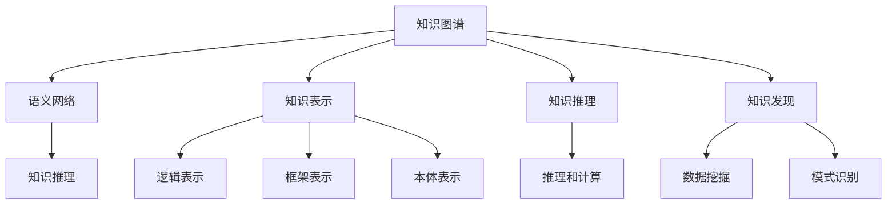

                 

# 人类知识的跨界融合：创新的催化剂

## 1. 背景介绍

### 1.1 问题由来
随着互联网的普及和数据获取成本的降低，人类知识的生产和传播进入了前所未有的繁荣时期。知识库、百科全书、学术论文等传统知识形式，正在与人工智能、大数据、区块链等新兴技术深度融合，催生了一系列具有颠覆性的创新应用。知识库的跨界融合，不仅推动了科学技术的发展，也带来了社会治理、教育普及、经济增长等领域的深刻变革。

在这一背景下，如何更好地利用人类知识资源，与技术手段进行深度结合，成为当前研究的热点和突破口。本文将深入探讨人类知识跨界融合的原理与方法，剖析其在科技创新、社会治理、教育普及、经济增长等领域的应用与潜力，为未来的知识经济时代提供新的思路。

### 1.2 问题核心关键点
知识跨界融合的关键在于，如何跨越不同领域的界限，利用计算机技术、数据处理技术，将不同形式的知识进行有机整合，形成新的价值和创新动力。具体包括以下几个关键点：

- **知识抽取与提取**：从结构化和非结构化数据中提取有价值的信息，形成知识图谱、知识库、概念图等形式。
- **知识编码与建模**：将提取出的知识进行编码和建模，构建出计算机可理解和处理的知识表示。
- **知识融合与合成**：通过算法和计算，将不同来源、不同形式的知识点进行融合和协同，形成新的知识体系。
- **知识应用与创新**：基于融合后的知识体系，开发创新应用和智能系统，驱动新一轮的产业升级和科技进步。

本节通过对问题核心关键点的深入阐述，为下文提供清晰的研究和实践框架。

## 2. 核心概念与联系

### 2.1 核心概念概述

为更好地理解人类知识跨界融合的原理与方法，本节将介绍几个密切相关的核心概念：

- **知识图谱(Knowledge Graph)**：一种由节点（实体）和边（关系）组成的图形结构，用于表示实体之间的关系和属性。知识图谱能够有效地捕捉和表达复杂知识结构，是知识跨界融合的重要工具。
- **语义网络(Semantic Network)**：一种基于概念节点和关系弧的图形模型，用于表示知识之间的语义关系。语义网络是知识图谱的扩展和应用，能够更好地处理知识推理和关系计算。
- **知识表示(Knowledge Representation)**：将人类知识转化为机器可理解和处理的符号表示。常见的知识表示方法包括逻辑表示法、框架表示法、本体表示法等。
- **知识推理(Knowledge Reasoning)**：利用知识图谱或语义网络中的关系和逻辑，进行推理和计算，得出新的知识或验证已有知识。
- **知识发现(Knowledge Discovery)**：通过数据挖掘、模式识别等技术，自动发现数据中的知识模式和规律，形成新的知识体系。

这些核心概念之间的逻辑关系可以通过以下Mermaid流程图来展示：



这个流程图展示了几类核心概念之间的联系：

1. 知识图谱和语义网络是知识表示和推理的基础。
2. 知识表示方法包括逻辑表示法、框架表示法、本体表示法等。
3. 知识推理通过语义网络和逻辑关系进行，得到新的知识。
4. 知识发现通过数据挖掘和模式识别，发现数据中的新知识模式。

这些概念共同构成了知识跨界融合的技术框架，为将不同形式的知识点整合为统一的、可计算的知识体系提供了方法论支持。

## 3. 核心算法原理 & 具体操作步骤

### 3.1 算法原理概述

人类知识的跨界融合，本质上是一种基于计算机科学和人工智能技术的数据处理和知识工程过程。其核心思想是通过算法和计算，将不同来源、不同形式的知识点进行抽取、编码、融合、推理，形成新的知识体系和创新应用。

具体而言，知识跨界融合的过程包括以下几个步骤：

1. **知识抽取与提取**：从文本、图像、视频等多源数据中，自动提取有价值的信息，形成结构化和非结构化的知识点。
2. **知识编码与建模**：将提取出的知识点进行编码和建模，构建出知识图谱、语义网络等知识表示。
3. **知识融合与合成**：通过算法和计算，将不同来源、不同形式的知识点进行融合和协同，形成新的知识体系。
4. **知识应用与创新**：基于融合后的知识体系，开发创新应用和智能系统，驱动新一轮的产业升级和科技进步。

### 3.2 算法步骤详解

#### 3.2.1 知识抽取与提取

知识抽取与提取是知识跨界融合的第一步，涉及从多源数据中自动提取有价值的信息。常见的知识抽取技术包括：

- **文本抽取**：从文本中提取实体、关系、事件等知识点。技术手段包括自然语言处理(NLP)、文本挖掘、命名实体识别(NER)等。
- **图像抽取**：从图像中提取物体、场景、属性等知识点。技术手段包括计算机视觉、图像分割、目标检测等。
- **视频抽取**：从视频中提取事件、场景、人物关系等知识点。技术手段包括视频分析、行为识别、动作跟踪等。

#### 3.2.2 知识编码与建模

知识编码与建模是知识跨界融合的核心环节，涉及将提取出的知识点进行编码和建模，构建出知识图谱、语义网络等知识表示。常见的知识编码方法包括：

- **本体建模**：使用本体语言(RDFS、OWL等)对知识点进行形式化表示，构建出本体模型。
- **知识图谱建模**：使用图谱语言(RDF、Neo4j等)对知识点进行图形化表示，构建出知识图谱。
- **语义网络建模**：使用语义表示语言(OWL、RDF等)对知识点进行语义化表示，构建出语义网络。

#### 3.2.3 知识融合与合成

知识融合与合成是知识跨界融合的高级环节，涉及将不同来源、不同形式的知识点进行融合和协同，形成新的知识体系。常见的知识融合方法包括：

- **逻辑融合**：使用逻辑规则对不同知识进行融合和计算，得出新的知识结论。
- **计算融合**：使用计算模型对不同知识进行协同计算，得到新的知识模式和规律。
- **推理融合**：使用推理引擎对不同知识进行推理计算，得到新的知识推理路径和结果。

#### 3.2.4 知识应用与创新

知识应用与创新是知识跨界融合的最终目标，涉及基于融合后的知识体系，开发创新应用和智能系统。常见的知识应用技术包括：

- **智能问答系统**：基于知识图谱或语义网络，构建智能问答系统，为用户提供精确的解答。
- **智能推荐系统**：基于知识图谱或语义网络，构建智能推荐系统，为用户推荐相关的内容和产品。
- **智能决策支持系统**：基于知识图谱或语义网络，构建智能决策支持系统，辅助企业决策和管理。

### 3.3 算法优缺点

知识跨界融合具有以下优点：

- **综合性强**：能够将不同来源、不同形式的知识点进行综合和整合，形成更全面、更有价值的知识体系。
- **可扩展性高**：能够通过算法和计算，自动发现新知识，不断扩展知识体系。
- **应用广泛**：能够在科技、教育、医疗、金融等多个领域进行应用，驱动产业升级和科技进步。

同时，该方法也存在一定的局限性：

- **数据质量依赖**：依赖高质量的数据源，对于数据质量不高的数据，提取和融合的准确性会降低。
- **计算复杂度高**：知识融合和计算的复杂度较高，对计算资源和算法优化要求较高。
- **隐私和安全问题**：知识抽取和融合涉及大量敏感数据，可能带来隐私泄露和安全风险。

尽管存在这些局限性，但就目前而言，知识跨界融合方法在多个领域的应用，已经展现了强大的创新潜力和实际价值。

### 3.4 算法应用领域

知识跨界融合技术在多个领域中已经得到了广泛的应用，包括但不限于：

- **医疗领域**：通过知识图谱和语义网络，构建医学知识库，辅助医生诊断和治疗。例如，IBM Watson Health利用知识图谱进行疾病诊断和药物推荐。
- **教育领域**：通过知识图谱和语义网络，构建教育知识库，辅助教师教学和学生学习。例如，Google Scholar利用知识图谱进行论文推荐和知识搜索。
- **金融领域**：通过知识图谱和语义网络，构建金融知识库，辅助金融分析和决策。例如，AlphaSense利用知识图谱进行市场分析和投资决策。
- **科研领域**：通过知识图谱和语义网络，构建科研知识库，辅助科研人员研究和技术创新。例如，Gene Wiki利用知识图谱进行基因研究和知识发现。
- **社会治理领域**：通过知识图谱和语义网络，构建社会知识库，辅助社会管理和公共服务。例如，Open World Knowledge Foundation利用知识图谱进行社会治理和公共服务。

除了上述这些经典领域外，知识跨界融合技术还在政府服务、文化遗产保护、智慧城市建设等众多领域中得到了应用，为社会发展和进步注入了新的动力。

## 4. 数学模型和公式 & 详细讲解 & 举例说明

### 4.1 数学模型构建

知识跨界融合的过程涉及多个领域的知识表示和推理，其数学模型和公式可概括为以下几个方面：

- **本体建模**：使用RDFS、OWL等本体语言对知识点进行形式化表示。本体模型的基本结构包括类、属性、实例等，表示知识点之间的语义关系。
- **知识图谱建模**：使用RDF、Neo4j等图谱语言对知识点进行图形化表示。知识图谱的基本结构包括节点和边，表示知识点之间的结构关系。
- **语义网络建模**：使用OWL、RDF等语义表示语言对知识点进行语义化表示。语义网络的基本结构包括概念节点和关系弧，表示知识点之间的语义关系。

### 4.2 公式推导过程

以下是本体建模、知识图谱建模和语义网络建模的基本公式推导：

#### 4.2.1 本体建模

本体建模的基本公式为：

$$
\begin{align}
& \text{Class} \rightarrow \{ r \} \\
& \text{Property} \rightarrow \{ r \} \\
& \text{Individual} \rightarrow \{ r \}
\end{align}
$$

其中，$\text{Class}$表示类，$\text{Property}$表示属性，$\text{Individual}$表示实例。$ r $表示类之间的关系，如"is-a"、"has-a"、"part-of"等。

#### 4.2.2 知识图谱建模

知识图谱建模的基本公式为：

$$
G(V,E)
$$

其中，$G$表示知识图谱，$V$表示节点集合，$E$表示边集合。节点$v$和节点$u$之间存在关系$e$，表示为$v-e-u$。

#### 4.2.3 语义网络建模

语义网络建模的基本公式为：

$$
\begin{align}
& \text{Concept} \rightarrow \{ r \} \\
& \text{Relation} \rightarrow \{ r \}
\end{align}
$$

其中，$\text{Concept}$表示概念节点，$\text{Relation}$表示关系弧。节点之间通过关系弧进行连接，表示知识点之间的语义关系。

### 4.3 案例分析与讲解

#### 4.3.1 医疗知识图谱

以医疗领域为例，通过构建医疗知识图谱，可以实现智能辅助诊疗、药物推荐等功能。以下是一个简单的医疗知识图谱构建案例：

1. **数据收集与预处理**：收集医学文献、病历数据、药物信息等，并进行数据清洗和预处理。
2. **本体建模**：使用OWL语言对知识点进行形式化表示，构建医疗本体。
3. **知识图谱建模**：使用RDF语言对知识点进行图形化表示，构建医疗知识图谱。
4. **推理与计算**：利用SPARQL查询语言进行知识推理和计算，辅助医生诊断和治疗。

#### 4.3.2 教育知识图谱

以教育领域为例，通过构建教育知识图谱，可以实现智能推荐、知识搜索等功能。以下是一个简单的教育知识图谱构建案例：

1. **数据收集与预处理**：收集学术论文、教材、课程等教育数据，并进行数据清洗和预处理。
2. **本体建模**：使用OWL语言对知识点进行形式化表示，构建教育本体。
3. **知识图谱建模**：使用RDF语言对知识点进行图形化表示，构建教育知识图谱。
4. **推理与计算**：利用SPARQL查询语言进行知识推理和计算，辅助教师教学和学生学习。

## 5. 项目实践：代码实例和详细解释说明

### 5.1 开发环境搭建

在进行知识跨界融合实践前，我们需要准备好开发环境。以下是使用Python进行PyTorch和RDFS库开发的环境配置流程：

1. 安装Anaconda：从官网下载并安装Anaconda，用于创建独立的Python环境。

2. 创建并激活虚拟环境：
```bash
conda create -n knowledge-env python=3.8 
conda activate knowledge-env
```

3. 安装PyTorch：根据CUDA版本，从官网获取对应的安装命令。例如：
```bash
conda install pytorch torchvision torchaudio cudatoolkit=11.1 -c pytorch -c conda-forge
```

4. 安装RDFS库：
```bash
pip install rdfs
```

5. 安装各类工具包：
```bash
pip install numpy pandas scikit-learn matplotlib tqdm jupyter notebook ipython
```

完成上述步骤后，即可在`knowledge-env`环境中开始知识跨界融合实践。

### 5.2 源代码详细实现

下面我们以构建医疗知识图谱为例，给出使用RDFS库对知识进行建模和推理的PyTorch代码实现。

首先，定义医疗知识本体类：

```python
from rdfs import RDFS

class MedicalOntology(RDFS):
    def __init__(self):
        super().__init__()
        self.register("MedicalEntity", "MedicalEntity", "rdfs:Class")
        self.register("HasDisease", "HasDisease", "rdfs:Property")
        self.register("CuresDisease", "CuresDisease", "rdfs:Property")
```

然后，定义医疗知识图谱类：

```python
class MedicalGraph:
    def __init__(self):
        self.graph = RDFS.Graph()
    
    def add_node(self, node):
        self.graph.add_node(node)
    
    def add_relation(self, subject, predicate, object):
        self.graph.add_relation(subject, predicate, object)
```

接着，定义知识推理函数：

```python
from rdfs import SPARQL

def reasoning(query, graph):
    sparql = SPARQL(graph)
    return sparql.query(query)
```

最后，启动知识推理流程：

```python
graph = MedicalGraph()
graph.add_node("MedicalEntity1")
graph.add_node("MedicalEntity2")
graph.add_relation("MedicalEntity1", "HasDisease", "Disease1")
graph.add_relation("MedicalEntity2", "CuresDisease", "Disease1")

query = """
SELECT ?drug WHERE { 
  MedicalEntity1 HasDisease Disease1 .
  MedicalEntity2 CuresDisease ?drug
}
"""
result = reasoning(query, graph.graph)
print(result)
```

以上就是使用PyTorch和RDFS库对医疗知识图谱进行构建和推理的完整代码实现。可以看到，通过RDFS库的封装，我们可以用相对简洁的代码完成知识本体的构建和知识推理。

### 5.3 代码解读与分析

让我们再详细解读一下关键代码的实现细节：

**MedicalOntology类**：
- `__init__`方法：初始化本体类，定义本体的基本结构。
- `register`方法：注册类、属性等本体元素。

**MedicalGraph类**：
- `__init__`方法：初始化知识图谱类，构建空图谱。
- `add_node`方法：添加节点到知识图谱。
- `add_relation`方法：添加关系弧到知识图谱。

**reasoning函数**：
- 定义SPARQL查询，通过知识图谱进行推理计算。

**知识推理流程**：
- 创建知识图谱对象，添加节点和关系弧。
- 定义SPARQL查询，指定节点和关系进行推理。
- 调用推理函数，输出结果。

可以看到，PyTorch配合RDFS库使得知识跨界融合的代码实现变得简洁高效。开发者可以将更多精力放在数据处理、模型改进等高层逻辑上，而不必过多关注底层的实现细节。

当然，工业级的系统实现还需考虑更多因素，如知识的增删改操作、推理效率优化、知识图谱的维护更新等。但核心的知识图谱构建和推理流程基本与此类似。

## 6. 实际应用场景

### 6.1 医疗领域

在医疗领域，知识图谱和语义网络技术得到了广泛应用。通过构建医疗知识图谱，可以辅助医生诊断和治疗，提高医疗服务的质量和效率。例如，IBM Watson Health利用知识图谱进行疾病诊断和药物推荐，已经在多个医疗机构中得到应用。

### 6.2 教育领域

在教育领域，知识图谱和语义网络技术也可以发挥重要作用。通过构建教育知识图谱，可以辅助教师教学和学生学习，提高教育质量。例如，Google Scholar利用知识图谱进行论文推荐和知识搜索，已经成为了全球最大的学术搜索引擎。

### 6.3 金融领域

在金融领域，知识图谱和语义网络技术同样具有广阔的应用前景。通过构建金融知识图谱，可以辅助金融分析和决策，提高金融服务的智能化水平。例如，AlphaSense利用知识图谱进行市场分析和投资决策，已经在多家金融机构中得到应用。

### 6.4 未来应用展望

随着知识跨界融合技术的不断进步，其在更多领域的应用前景将更加广阔：

1. **智慧城市**：通过构建城市知识图谱，可以辅助城市管理和社会服务，提升智慧城市建设的智能化水平。例如，Open World Knowledge Foundation利用知识图谱进行社会治理和公共服务，已经在多个城市中得到应用。
2. **文化遗产保护**：通过构建文化遗产知识图谱，可以辅助文化遗产的数字化保护和传承，提升文化遗产保护的水平。例如，Digital Heritage Project利用知识图谱进行文化遗产的保护和修复，已经在多个博物馆和遗址中得到应用。
3. **环境保护**：通过构建环境保护知识图谱，可以辅助环境保护和治理，提升环境保护的智能化水平。例如，Global Environmental Monitoring System利用知识图谱进行环境监测和预警，已经在多个国家中得到应用。

此外，在制造业、农业、能源等众多领域，知识跨界融合技术也将不断拓展其应用范围，为社会发展和进步带来新的动力。相信随着技术的不断成熟，知识跨界融合必将在构建智慧社会中扮演越来越重要的角色。

## 7. 工具和资源推荐
### 7.1 学习资源推荐

为了帮助开发者系统掌握知识跨界融合的理论基础和实践技巧，这里推荐一些优质的学习资源：

1. 《知识工程与语义网络》系列课程：由知识工程领域的专家授课，系统讲解了知识工程和语义网络的基本概念和核心技术。
2. 《语义网络与本体工程》书籍：全面介绍了语义网络的基本原理和应用场景，是深入学习知识工程的重要参考资料。
3. 《知识图谱与信息抽取》论文：介绍了知识图谱的基本构建方法和应用技术，提供了大量的实例和案例分析。
4. 《Python与知识图谱》书籍：详细介绍了如何使用Python进行知识图谱的构建和推理，提供了丰富的代码和实例。
5. 《知识发现与数据挖掘》课程：讲解了知识发现的基本方法和技术，通过案例分析深入理解知识工程的实际应用。

通过对这些资源的学习实践，相信你一定能够快速掌握知识跨界融合的精髓，并用于解决实际的NLP问题。

### 7.2 开发工具推荐

高效的开发离不开优秀的工具支持。以下是几款用于知识跨界融合开发的常用工具：

1. PyTorch：基于Python的开源深度学习框架，灵活动态的计算图，适合快速迭代研究。
2. TensorFlow：由Google主导开发的开源深度学习框架，生产部署方便，适合大规模工程应用。
3. RDFS库：Python中的知识图谱构建和推理库，提供强大的API接口和工具支持。
4. SPARQL查询语言：用于知识图谱和语义网络的查询和推理，支持复杂的查询和计算。
5. Jupyter Notebook：Python的交互式开发环境，支持代码块的交互执行和代码的可视化展示。

合理利用这些工具，可以显著提升知识跨界融合的开发效率，加快创新迭代的步伐。

### 7.3 相关论文推荐

知识跨界融合技术的发展源于学界的持续研究。以下是几篇奠基性的相关论文，推荐阅读：

1. "Representing and Reasoning about Knowledge in Databases"（DBLP）：引入了知识图谱和语义网络的概念，奠定了知识工程和语义网络的理论基础。
2. "Linking Open Data"（LOD）：引入了链接数据的概念，推动了全球数据共享和互操作。
3. "Semantic Web Services and Semantic Web Applications"（SWW）：引入了语义Web服务的概念，推动了语义Web应用的普及和发展。
4. "Knowledge Discovery in Databases"（KDD）：介绍了知识发现的基本方法和技术，提供了大量的实例和案例分析。
5. "Knowledge Graphs: Concepts, Approaches, and Case Studies"（KGC）：全面介绍了知识图谱的基本原理和应用场景，提供了大量的实例和案例分析。

这些论文代表了大规模知识工程和语义网络的发展脉络。通过学习这些前沿成果，可以帮助研究者把握学科前进方向，激发更多的创新灵感。

## 8. 总结：未来发展趋势与挑战

### 8.1 总结

本文对知识跨界融合的原理与方法进行了全面系统的介绍。首先阐述了知识跨界融合的研究背景和意义，明确了其跨学科融合的特点和应用潜力。其次，从原理到实践，详细讲解了知识图谱、本体建模、语义网络等核心概念，以及知识提取、编码、融合、推理等关键技术。最后，本文探讨了知识跨界融合在多个领域的应用前景和挑战，为未来的知识工程和语义网络技术提供了新的思路。

通过本文的系统梳理，可以看到，知识跨界融合技术在多个领域中已经展现了巨大的应用价值，成为推动社会发展和科技进步的重要驱动力。

### 8.2 未来发展趋势

展望未来，知识跨界融合技术将呈现以下几个发展趋势：

1. **智能化升级**：随着人工智能技术的不断进步，知识跨界融合将与AI技术深度融合，实现更加智能化和自动化的知识发现和推理。
2. **跨领域融合**：知识跨界融合将不再局限于单一领域，而是跨领域进行知识整合和应用，形成更加全面和综合的知识体系。
3. **大规模协同**：随着互联网和云计算技术的发展，知识跨界融合将实现大规模协同，形成全球知识共享和互操作。
4. **应用场景拓展**：知识跨界融合将拓展到更多实际应用场景，如智慧城市、环境保护、文化遗产保护等，为社会发展和进步带来新的动力。
5. **伦理和安全**：随着知识跨界融合的广泛应用，伦理和安全问题将受到更多关注，需要建立完善的规范和标准。

以上趋势凸显了知识跨界融合技术的广阔前景，预示着知识工程和语义网络技术将迎来新的变革和发展。

### 8.3 面临的挑战

尽管知识跨界融合技术已经取得了显著进展，但在迈向更加智能化、普适化应用的过程中，仍面临诸多挑战：

1. **数据质量和多样性**：依赖高质量、多形式的数据源，对于数据质量不高的数据，提取和融合的准确性会降低。
2. **计算资源和算法**：知识图谱和语义网络的构建和推理计算复杂度高，对计算资源和算法优化要求较高。
3. **隐私和安全**：知识抽取和融合涉及大量敏感数据，可能带来隐私泄露和安全风险。
4. **应用场景复杂性**：知识跨界融合的应用场景复杂多样，不同领域的需求和挑战各不相同，需要针对性地设计和优化。
5. **技术标准化**：知识跨界融合的标准化和规范化问题亟待解决，需要建立统一的知识表示和推理框架。

尽管存在这些挑战，但随着学界和产业界的共同努力，这些挑战终将一一被克服，知识跨界融合必将在构建智慧社会中扮演越来越重要的角色。

### 8.4 研究展望

面对知识跨界融合面临的种种挑战，未来的研究需要在以下几个方面寻求新的突破：

1. **数据治理和质量控制**：建立数据治理机制，提升数据质量和多样性，确保知识提取和融合的准确性。
2. **算法优化和资源管理**：优化知识图谱和语义网络的构建和推理算法，提升计算效率和资源利用率。
3. **伦理和安全机制**：建立伦理和安全机制，确保知识跨界融合的应用符合伦理道德和安全规范。
4. **跨领域协同与合作**：推动跨领域协同与合作，建立知识共享和互操作机制，促进知识跨界融合的应用普及。
5. **知识发现与创新应用**：将知识跨界融合与人工智能技术深度融合，推动新一轮的科技创新和产业升级。

这些研究方向的探索，必将引领知识跨界融合技术迈向更高的台阶，为构建智慧社会提供新的动力。面向未来，知识跨界融合技术还需要与其他人工智能技术进行更深入的融合，如知识表示、因果推理、强化学习等，多路径协同发力，共同推动自然语言理解和智能交互系统的进步。只有勇于创新、敢于突破，才能不断拓展知识跨界融合的边界，让智能技术更好地造福人类社会。

## 9. 附录：常见问题与解答

**Q1：知识跨界融合是否适用于所有领域？**

A: 知识跨界融合技术在大多数领域中都能取得良好的效果，特别是对于数据量较大、知识结构复杂的领域，如医疗、教育、金融等。但对于一些特定领域的知识，如生物化学、天文学等，可能需要结合特定领域的知识表示方法进行建模和推理。

**Q2：知识图谱的构建和维护是否复杂？**

A: 知识图谱的构建和维护确实有一定的复杂度，需要大量的领域专家和数据资源。但随着自动化技术和智能算法的不断发展，知识图谱的构建和维护将更加高效和便捷。

**Q3：知识跨界融合是否存在隐私和安全问题？**

A: 知识跨界融合涉及大量敏感数据，可能带来隐私泄露和安全风险。因此，需要建立完善的隐私保护和安全机制，如数据匿名化、访问控制等，确保数据的安全性和隐私性。

**Q4：知识图谱在实际应用中是否存在局限性？**

A: 知识图谱在实际应用中确实存在一些局限性，如复杂度较高、推理计算量大等。但随着技术的不断进步，这些问题正在逐步解决。同时，知识图谱在提升知识整合能力和应用效果方面具有显著优势，未来在更多领域中将会得到广泛应用。

**Q5：如何评估知识跨界融合的效果？**

A: 知识跨界融合的效果评估可以从多个角度进行，如准确率、召回率、F1分数等指标。同时，还可以通过实际应用效果，如提升医疗诊断准确率、优化金融投资决策等，进行综合评估。

通过对这些问题的深入探讨，相信你能够更好地理解和应用知识跨界融合技术，为未来的知识经济时代提供新的思路和创新动力。

---

作者：禅与计算机程序设计艺术 / Zen and the Art of Computer Programming

