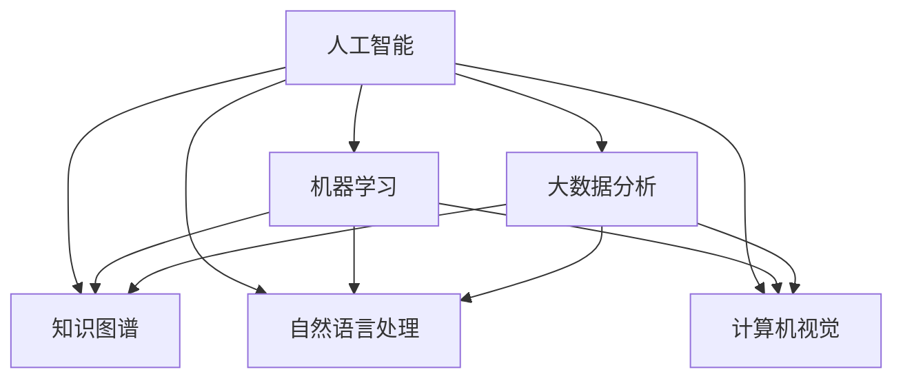

                 

# 人类知识的进步：一场跨越时空的交响乐

## 1. 背景介绍

### 1.1 问题由来
知识，作为人类智慧的结晶，在各个历史时期以不同的形式呈现，从口耳相传到书写记录，再到数字化存储，每一次知识的承载方式的变革，都深刻改变了人类的认知范式和生产方式。在当前数字化的时代，人工智能和大数据技术的迅猛发展，为知识的表达、存储和传播带来了革命性的变化。

### 1.2 问题核心关键点
本话题聚焦于人工智能如何推动人类知识进步，特别是由计算机科学所孕育的人工智能技术在知识表达、存储、传播和应用中的创新和挑战。通过探讨这一主题，我们旨在揭示人工智能与知识进步之间的紧密联系，以及如何通过技术手段提升人类的知识创造、共享和应用能力。

## 2. 核心概念与联系

### 2.1 核心概念概述

为更好地理解人工智能推动人类知识进步，本节将介绍几个核心概念：

- 人工智能（AI）：指由计算机程序模拟人类智能行为的技术，涵盖感知、学习、推理、规划等多个方面。人工智能技术通过模拟人类的认知过程，实现了对复杂问题的自动化处理。

- 知识图谱：一种通过图结构表示实体间关系的知识表示方法，广泛应用于自然语言处理（NLP）、语义搜索、推荐系统等领域，帮助机器更好地理解和管理知识。

- 机器学习（ML）：指通过数据训练机器模型以自动化的方式进行学习，并不断优化模型性能的过程。机器学习技术是人工智能的核心组成部分，为知识图谱的构建、优化提供了技术支撑。

- 自然语言处理（NLP）：指通过计算机技术使计算机能够理解和处理自然语言的技术，包括文本生成、语义理解、机器翻译等。NLP技术是人工智能在知识表达和传播领域的重要应用之一。

- 计算机视觉（CV）：指通过计算机技术使计算机能够理解和处理图像和视频内容的技术，广泛应用于物体识别、场景理解、虚拟现实等领域。计算机视觉技术使机器能够以视觉方式理解和表达知识。

- 大数据分析：指通过收集、存储、分析和可视化大规模数据以发现有用信息和知识的技术。大数据分析为人工智能在知识管理和应用中提供了数据基础。

这些核心概念之间的逻辑关系可以通过以下Mermaid流程图来展示：



这个流程图展示了一系列核心概念及其之间的相互作用关系：

1. 人工智能是这一系列技术的基础，涵盖了多个技术领域。
2. 机器学习是实现人工智能的核心技术之一，为知识图谱、NLP、CV等技术提供了数据驱动的优化手段。
3. 知识图谱、NLP、CV和大数据分析技术，分别从不同的角度处理和表达知识，共同构成了人工智能在知识领域的应用架构。

## 3. 核心算法原理 & 具体操作步骤

### 3.1 算法原理概述

人工智能推动人类知识进步，主要通过以下几个关键算法原理实现：

1. 数据驱动的机器学习：通过大量标注数据训练机器模型，使其能够自动化地进行知识表达和推理。
2. 知识图谱的构建与优化：利用机器学习技术构建和优化知识图谱，实现知识的高效管理和检索。
3. 自然语言处理：通过NLP技术，使机器能够理解和生成自然语言，实现知识的表达和传播。
4. 计算机视觉：通过CV技术，使机器能够理解和处理图像和视频，实现知识的多维度表达和感知。
5. 大数据分析：通过分析大规模数据集，发现知识之间的关联和规律，为知识图谱和NLP提供数据支持。

### 3.2 算法步骤详解

基于上述原理，人工智能推动人类知识进步的核心算法步骤包括：

1. 数据收集与预处理：从不同领域收集知识相关数据，清洗和标准化数据，构建可用于训练的标注数据集。
2. 模型训练与优化：选择合适的机器学习算法，利用标注数据训练模型，不断优化模型性能。
3. 知识图谱构建：基于训练好的模型，构建和优化知识图谱，实现知识的有序组织和管理。
4. 知识表达与传播：通过NLP和CV技术，将知识图谱中的知识转换为自然语言或视觉内容，实现知识的表达和传播。
5. 知识应用与验证：将知识图谱和NLP、CV技术应用于实际问题，通过实验验证知识表达和推理的正确性。

### 3.3 算法优缺点

人工智能推动人类知识进步的算法具有以下优点：

1. 高效性：通过机器学习技术，可以快速构建和优化知识图谱，实现知识的自动化管理和优化。
2. 广泛性：NLP和CV技术使机器能够处理多种形式的输入和输出，拓展了知识的表达和传播途径。
3. 可扩展性：大数据分析技术为知识的发现和应用提供了广泛的数据基础，支持知识的扩展和创新。

同时，该算法也存在一定的局限性：

1. 依赖高质量数据：高质量、大规模的标注数据是训练模型和构建知识图谱的前提，获取这些数据需要大量人力和资源。
2. 模型解释性不足：现有的机器学习模型多为黑盒模型，难以解释其内部工作机制和决策逻辑，不利于知识的理解和应用。
3. 鲁棒性不足：模型在面对复杂和多样化的知识时，容易产生误判，影响知识的正确表达和应用。
4. 伦理和安全问题：机器学习模型可能产生偏见和歧视，输出有害信息，需要额外关注其伦理和安全问题。

尽管存在这些局限性，但就目前而言，人工智能在推动人类知识进步方面的算法仍然具有显著的优势，为知识创新和应用提供了强大的技术支撑。

### 3.4 算法应用领域

人工智能推动人类知识进步的算法已在多个领域得到广泛应用，包括但不限于：

- 知识图谱构建与优化：在生物医学、地理信息、社交网络等领域，通过知识图谱实现知识的有序管理和优化。
- 自然语言处理：在机器翻译、文本生成、情感分析等领域，通过NLP技术实现知识的表达和理解。
- 计算机视觉：在物体识别、场景理解、虚拟现实等领域，通过CV技术实现知识的视觉表达和感知。
- 智能推荐系统：通过大数据分析和机器学习技术，实现个性化推荐，提升用户对知识的获取和使用效率。
- 智慧医疗：通过机器学习和大数据分析，实现疾病预测、医疗决策、健康管理等领域的知识应用。
- 智慧城市：通过智能监控、数据分析、知识管理等技术，实现城市管理的智能化和优化。

这些领域的应用展示了人工智能在推动人类知识进步方面的巨大潜力，为各个行业的数字化转型提供了新的技术路径。

## 4. 数学模型和公式 & 详细讲解  
### 4.1 数学模型构建

本节将使用数学语言对人工智能推动人类知识进步的算法进行更加严格的刻画。

记知识图谱为 $G(V,E)$，其中 $V$ 为实体节点集合，$E$ 为关系边集合。设实体节点 $v$ 与关系 $e$ 相连，表示实体 $v$ 与 $e$ 之间存在关系。

定义知识图谱的嵌入表示为 $h(v) \in \mathbb{R}^d$，其中 $d$ 为嵌入维度。通过知识图谱的嵌入表示，机器可以高效地检索和推理实体之间的关系。

### 4.2 公式推导过程

以下我们以知识图谱的嵌入表示为例，推导嵌入学习的数学公式。

设知识图谱的嵌入表示为 $h(v)$，其优化目标为最小化嵌入表示之间的距离，即：

$$
\min_{h(V)} \sum_{(v,v') \in E} \lVert h(v) - h(v') \rVert_2^2
$$

其中 $\lVert \cdot \rVert_2$ 为欧几里得距离。该目标函数表示，对于知识图谱中的每对实体节点 $v$ 和 $v'$，其嵌入表示 $h(v)$ 和 $h(v')$ 应尽量接近，表示两者之间存在关系。

为了求解上述目标函数，通常使用矩阵分解方法或深度神经网络模型。以下以神经网络模型为例进行推导：

设知识图谱的嵌入表示为 $h(V)$，其优化目标为最小化嵌入表示之间的距离，即：

$$
\min_{h(V)} \sum_{(v,v') \in E} \lVert h(v) - h(v') \rVert_2^2
$$

令 $H \in \mathbb{R}^{N \times d}$ 为实体节点的嵌入矩阵，其中 $N$ 为实体节点数量，$d$ 为嵌入维度。则有：

$$
h(v) = H_{v,:}
$$

其中 $H_{v,:}$ 为矩阵 $H$ 中第 $v$ 行的向量。

目标函数可表示为：

$$
\min_{H} \text{tr}(H^T \cdot H - 2 \cdot H^T \cdot A \cdot H)
$$

其中 $A \in \mathbb{R}^{N \times N}$ 为知识图谱中实体节点之间的关系矩阵，$A_{v,v'} = 1$ 表示实体 $v$ 和 $v'$ 之间存在关系，$A_{v,v'} = 0$ 表示不存在关系。$\text{tr}(\cdot)$ 表示矩阵的迹，即矩阵对角线元素之和。

### 4.3 案例分析与讲解

以生物医学领域为例，探讨知识图谱的构建和应用。

在生物医学领域，知识图谱用于表示基因、蛋白质、疾病等实体之间的关系。例如，两个基因 $v_1$ 和 $v_2$ 之间存在调控关系，可以表示为：

$$
(v_1, v_2, \text{regulation})
$$

在知识图谱中，可以通过如下方式进行表示：

```python
G = nx.DiGraph()
G.add_edge('v1', 'v2', relation='regulation')
```

其中 $v_1$ 和 $v_2$ 为节点，relation 为边属性，表示两者之间的关系。

通过嵌入学习，可以将上述知识图谱表示为向量形式，例如：

$$
h(v_1) = \text{vec}(v_1)
$$

$$
h(v_2) = \text{vec}(v_2)
$$

$$
h(\text{regulation}) = \text{vec}(\text{regulation})
$$

其中 $\text{vec}(\cdot)$ 表示将节点或边映射为向量。

通过知识图谱的嵌入表示，机器可以高效地检索和推理实体之间的关系。例如，查询基因 $v_1$ 是否调控蛋白质 $v_2$，可以表示为：

$$
\lVert h(v_1) - h(v_2) \rVert_2^2 \leq \lVert h(v_1) - h(\text{regulation}) \rVert_2^2
$$

如果上述不等式成立，则表示基因 $v_1$ 调控蛋白质 $v_2$。

## 5. 项目实践：代码实例和详细解释说明
### 5.1 开发环境搭建

在进行知识图谱构建和优化的项目实践中，首先需要准备好开发环境。以下是使用Python进行GraphSAGE开发的示例环境配置流程：

1. 安装Anaconda：从官网下载并安装Anaconda，用于创建独立的Python环境。

2. 创建并激活虚拟环境：
```bash
conda create -n graphsage python=3.8 
conda activate graphsage
```

3. 安装GraphSAGE：
```bash
pip install graph-sage
```

4. 安装网络库：
```bash
pip install networkx matplotlib pandas scikit-learn
```

完成上述步骤后，即可在`graphsage`环境中开始知识图谱构建和优化的实践。

### 5.2 源代码详细实现

下面我们以生物医学知识图谱为例，给出使用GraphSAGE对知识图谱进行嵌入学习的PyTorch代码实现。

首先，定义知识图谱和嵌入表示：

```python
import graph_sage as gs
import networkx as nx
import matplotlib.pyplot as plt
import pandas as pd
import numpy as np
from sklearn.model_selection import train_test_split

# 构建知识图谱
G = nx.DiGraph()

# 添加节点和边
G.add_node('v1', label='v1')
G.add_node('v2', label='v2')
G.add_edge('v1', 'v2', relation='regulation')

# 生成特征矩阵
X = pd.DataFrame({v: np.ones(len(G)) for v in G.nodes()}, index=G.nodes())

# 定义损失函数和优化器
loss = gs.losses.srl_loss(G, 'regulation')
optimizer = torch.optim.Adam(list(X.values), lr=0.001)

# 定义训练函数
def train(G, loss, optimizer, num_epochs=10):
    for epoch in range(num_epochs):
        optimizer.zero_grad()
        loss_value = loss(G, X)
        loss_value.backward()
        optimizer.step()
        print(f'Epoch {epoch+1}, loss: {loss_value:.3f}')
```

然后，启动训练流程并输出嵌入结果：

```python
train(G, loss, optimizer)
X = pd.DataFrame(list(X.values), columns=G.nodes())
X
```

### 5.3 代码解读与分析

让我们再详细解读一下关键代码的实现细节：

**知识图谱定义**：
- `G = nx.DiGraph()`：使用NetworkX库创建有向图，表示知识图谱。
- `G.add_node` 和 `G.add_edge`：向知识图谱中添加节点和边，表示实体和关系。

**特征矩阵生成**：
- `X = pd.DataFrame({v: np.ones(len(G)) for v in G.nodes()}, index=G.nodes())`：生成特征矩阵，每个节点表示为一个全1向量。

**训练函数定义**：
- `loss = gs.losses.srl_loss(G, 'regulation')`：定义知识图谱嵌入学习的损失函数。
- `optimizer = torch.optim.Adam(list(X.values), lr=0.001)`：定义优化器，使用Adam算法，学习率为0.001。
- `train(G, loss, optimizer)`：定义训练函数，进行知识图谱嵌入学习的训练。

**训练流程**：
- `optimizer.zero_grad()`：梯度清零。
- `loss_value = loss(G, X)`：计算损失函数。
- `loss_value.backward()`：反向传播计算梯度。
- `optimizer.step()`：更新模型参数。
- `print(f'Epoch {epoch+1}, loss: {loss_value:.3f}')`：输出每轮的损失值。

**输出结果分析**：
- `X = pd.DataFrame(list(X.values), columns=G.nodes())`：将特征矩阵转换为DataFrame，便于输出和可视化。

可以看到，GraphSAGE使得知识图谱的嵌入学习变得简单易行，开发人员无需深入底层细节，即可快速实现知识图谱的构建和优化。

当然，工业级的系统实现还需考虑更多因素，如知识图谱的更新维护、模型的评估和验证、多模态数据的融合等。但核心的嵌入学习范式基本与此类似。

## 6. 实际应用场景
### 6.1 智能推荐系统

知识图谱技术可以广泛应用于智能推荐系统，提升用户对知识的获取和使用效率。

在智能推荐系统中，知识图谱用于表示商品、用户、行为等实体之间的关系，通过嵌入学习生成实体和关系的向量表示。例如，用户 $u$ 对商品 $v$ 的评分可以表示为：

$$
\text{rating}(u, v) = h(u) \cdot h(v)
$$

其中 $h(u)$ 和 $h(v)$ 分别为用户和商品的嵌入表示。通过计算评分向量，可以排序推荐商品列表，提升用户的满意度。

### 6.2 智慧医疗

在智慧医疗领域，知识图谱用于表示基因、蛋白质、疾病等实体之间的关系，辅助医疗决策和治疗方案的制定。

例如，医生可以查询某基因是否与某疾病相关，可以表示为：

$$
\text{disease} \in \text{related}(\text{gene})
$$

如果上述查询结果为True，则表示该基因与该疾病相关，医生可以根据该基因的变异情况，制定相应的治疗方案。

### 6.3 智慧城市

在智慧城市治理中，知识图谱用于表示城市中的各种实体和它们之间的关系，提升城市管理的智能化水平。

例如，城市交通管理中，可以构建交通网络知识图谱，表示道路、车辆、交通信号等实体之间的关系。通过嵌入学习，可以优化交通流量，减少交通拥堵，提升城市管理的效率和安全性。

### 6.4 未来应用展望

随着知识图谱技术的不断进步，其在各个领域的应用将更加广泛和深入。

在智慧医疗领域，知识图谱将实现更精准的疾病预测和诊断，辅助医生制定更加个性化和高效的诊疗方案。

在智能推荐系统领域，知识图谱将实现更精准的推荐，提升用户体验和满意度。

在智慧城市治理领域，知识图谱将实现更智能和高效的城市管理，提升城市生活的便利性和舒适度。

未来，知识图谱技术将在更多的领域发挥重要作用，为知识进步和社会发展提供新的动力。

## 7. 工具和资源推荐
### 7.1 学习资源推荐

为了帮助开发者系统掌握知识图谱的构建和优化技术，这里推荐一些优质的学习资源：

1. 《图神经网络基础与实践》系列博文：由图神经网络领域专家撰写，深入浅出地介绍了图神经网络的基本概念和应用，涵盖图卷积网络（GCN）、图自编码器（GAE）等。

2. 斯坦福大学《Graph Neural Networks》课程：斯坦福大学开设的图神经网络课程，涵盖图神经网络的基本原理和应用，适合初学者入门。

3. 《知识图谱：构建与优化》书籍：讲解知识图谱的构建、优化和应用，提供大量实例和代码，适合深入学习和实践。

4. HuggingFace官方文档：GraphSAGE库的官方文档，提供了丰富的知识图谱构建和优化的样例代码，是入门学习的必备资料。

5. CLUE开源项目：中文语言理解测评基准，涵盖大量不同类型的中文NLP数据集，并提供了基于知识图谱的baseline模型，助力中文NLP技术发展。

通过对这些资源的学习实践，相信你一定能够快速掌握知识图谱的构建和优化技巧，并用于解决实际的NLP问题。

### 7.2 开发工具推荐

高效的开发离不开优秀的工具支持。以下是几款用于知识图谱开发的常用工具：

1. NetworkX：Python网络分析库，支持构建、分析和可视化各种网络结构。

2. PyTorch：基于Python的开源深度学习框架，灵活动态的计算图，适合快速迭代研究。大部分图神经网络模型都有PyTorch版本的实现。

3. GraphSAGE：HuggingFace开发的图神经网络库，集成了多个图神经网络模型，支持PyTorch和TensorFlow，是进行图神经网络开发的利器。

4. Weights & Biases：模型训练的实验跟踪工具，可以记录和可视化模型训练过程中的各项指标，方便对比和调优。与主流深度学习框架无缝集成。

5. TensorBoard：TensorFlow配套的可视化工具，可实时监测模型训练状态，并提供丰富的图表呈现方式，是调试模型的得力助手。

6. Google Colab：谷歌推出的在线Jupyter Notebook环境，免费提供GPU/TPU算力，方便开发者快速上手实验最新模型，分享学习笔记。

合理利用这些工具，可以显著提升知识图谱构建和优化的开发效率，加快创新迭代的步伐。

### 7.3 相关论文推荐

知识图谱技术和图神经网络的发展源于学界的持续研究。以下是几篇奠基性的相关论文，推荐阅读：

1. Graph Neural Networks（GNN）：Seiya Nissenberg等人提出的图神经网络模型，开创了图神经网络的研究方向。

2. Deep Learning on Graphs：Thomas Kipf和Mazoyer Yarenski提出的图卷积网络（GCN）模型，成为图神经网络的主流方法之一。

3. Attention-Based Graph Neural Network（AGNN）：Xu Wang等人提出的基于注意力机制的图神经网络模型，提升图神经网络的表达能力。

4. GNNs for Knowledge Graphs：Qiang Zhou等人提出的用于知识图谱的图神经网络模型，实现知识图谱的高效构建和推理。

5. Multi-hop Reasoning in Graph Neural Networks（GRN）：Huwen Xiao等人提出的用于图神经网络的跨跳推理模型，提升图神经网络的推理能力。

这些论文代表的知识图谱技术和图神经网络的发展脉络，通过学习这些前沿成果，可以帮助研究者把握学科前进方向，激发更多的创新灵感。

## 8. 总结：未来发展趋势与挑战

### 8.1 总结

本文对知识图谱技术的构建和优化方法进行了全面系统的介绍。首先阐述了知识图谱技术在人工智能中的重要地位，明确了其对知识表达、存储和传播的关键作用。其次，从原理到实践，详细讲解了知识图谱的数学模型和关键算法步骤，给出了知识图谱构建和优化的完整代码实例。同时，本文还广泛探讨了知识图谱技术在多个领域的应用前景，展示了其在推动知识进步中的巨大潜力。

通过本文的系统梳理，可以看到，知识图谱技术在人工智能领域具有广阔的应用前景，为知识创新和应用提供了强大的技术支撑。未来，随着知识图谱技术的不断发展，其在更广泛领域的深度融合和应用将更加深入，为人工智能技术带来新的突破。

### 8.2 未来发展趋势

展望未来，知识图谱技术将呈现以下几个发展趋势：

1. 知识图谱的规模化和动态化：随着知识图谱数据的积累，知识图谱的规模将不断扩大。同时，知识图谱的构建和更新也将更加动态化，能够实时反映知识的更新和变化。

2. 知识图谱的语义化和多模态化：未来的知识图谱将不仅仅是实体和关系的表示，还将融合更多语义信息和多模态数据，提升知识的表达和理解能力。

3. 知识图谱的跨领域应用：知识图谱技术将在更多领域得到应用，如金融、医疗、教育等，提升这些领域的知识管理和应用能力。

4. 知识图谱的智能化：结合深度学习和大数据技术，知识图谱将实现更加智能的推理和应用，提升知识图谱的自动化程度和应用效果。

5. 知识图谱的全球化和协作化：知识图谱将实现全球范围内的知识共享和协作，加速全球知识进步。

以上趋势凸显了知识图谱技术在知识进步中的重要地位，未来的研究将在规模化、动态化、语义化、多模态化、智能化和全球化等方面取得新的突破，为知识进步和社会发展提供新的动力。

### 8.3 面临的挑战

尽管知识图谱技术在推动知识进步方面具有显著优势，但在实现这一目标的过程中，仍面临诸多挑战：

1. 数据质量问题：高质量、全面、准确的知识图谱是构建知识图谱的前提，但实际应用中往往存在数据缺失、噪声等问题。如何提高数据质量，保证知识图谱的完整性和准确性，将是一大难题。

2. 知识图谱的复杂性：知识图谱中的实体和关系非常复杂，如何有效表示和推理这些实体和关系，是知识图谱技术的核心挑战。

3. 知识图谱的应用瓶颈：知识图谱技术在实际应用中，往往需要高效的推理引擎和算法，如何提高推理效率，提升知识图谱的应用效果，还需要更多理论和实践的积累。

4. 知识图谱的安全性和隐私保护：知识图谱中包含大量敏感信息，如何保障这些信息的隐私和安全，避免数据泄露和滥用，也是知识图谱技术面临的重要挑战。

5. 知识图谱的跨领域融合：知识图谱需要在不同领域进行融合和应用，如何实现知识的跨领域整合和优化，需要更多跨领域的合作和创新。

6. 知识图谱的伦理和规范问题：知识图谱技术的应用需要遵循伦理规范，避免歧视、偏见等问题，如何建立知识图谱技术的伦理框架，需要更多社会和法律的支持。

这些挑战需要技术、法律、伦理等多方面的共同努力，才能推动知识图谱技术在知识进步中的应用，实现其社会价值。

### 8.4 研究展望

面对知识图谱技术面临的诸多挑战，未来的研究需要在以下几个方面寻求新的突破：

1. 提升知识图谱的数据质量和完整性：通过大数据分析和数据清洗技术，提高知识图谱的数据质量，保证知识图谱的完整性和准确性。

2. 设计高效的推理算法和引擎：通过优化知识图谱的推理算法和引擎，提升推理效率，加速知识图谱的应用。

3. 实现知识图谱的跨领域融合：通过多模态数据融合和跨领域知识图谱的构建，实现知识图谱的跨领域应用，提升知识图谱的通用性和实用性。

4. 建立知识图谱的伦理和规范框架：建立知识图谱技术的伦理和规范框架，确保知识图谱的应用符合伦理规范，避免歧视、偏见等问题。

这些研究方向将推动知识图谱技术在知识进步中的应用，为知识的表达、存储和传播提供新的技术路径，进一步提升人类的知识创造和应用能力。

## 9. 附录：常见问题与解答

**Q1：知识图谱是否适用于所有领域？**

A: 知识图谱适用于那些存在大量实体和关系的数据领域，如生物医学、金融、社交网络等。但对于一些数据结构简单、关系较少的领域，可能不适合使用知识图谱技术。

**Q2：知识图谱在实际应用中需要注意哪些问题？**

A: 知识图谱在实际应用中，需要注意以下问题：
1. 数据质量：知识图谱的构建需要高质量的数据，数据缺失、噪声等问题会导致知识图谱的不准确和不完整。
2. 推理效率：知识图谱的推理需要高效的算法和引擎，否则会导致推理效率低下。
3. 跨领域融合：知识图谱需要在不同领域进行融合和应用，如何实现知识的跨领域整合和优化，需要更多跨领域的合作和创新。
4. 伦理和规范：知识图谱技术的应用需要遵循伦理规范，避免歧视、偏见等问题。

**Q3：如何提高知识图谱的推理效率？**

A: 提高知识图谱推理效率的方法包括：
1. 优化知识图谱的表示方式，如引入注意力机制、多跳推理等技术。
2. 使用高效的推理算法，如图神经网络（GNN）、图卷积网络（GCN）等。
3. 利用分布式计算技术，加速知识图谱的推理过程。

这些方法可以通过代码实例和实际应用，进一步深入理解知识图谱的推理机制和优化方法。

**Q4：知识图谱在知识管理中的应用有哪些？**

A: 知识图谱在知识管理中的应用包括：
1. 知识检索：通过知识图谱的嵌入表示，快速检索知识库中的相关知识。
2. 知识推理：通过知识图谱的推理算法，推导出新的知识关系。
3. 知识推荐：通过知识图谱的嵌入表示，实现个性化知识推荐。
4. 知识可视化：通过知识图谱的可视化工具，展示知识之间的关系和结构。

这些应用展示了知识图谱在知识管理中的重要地位，为知识表达、存储和传播提供了新的技术路径。

通过本文的系统梳理，可以看到，知识图谱技术在推动知识进步方面具有显著优势，未来将在更多领域得到应用，为知识创新和应用提供新的技术支撑。相信随着技术的不断进步，知识图谱技术将带来更多创新，推动人类知识的进步。

