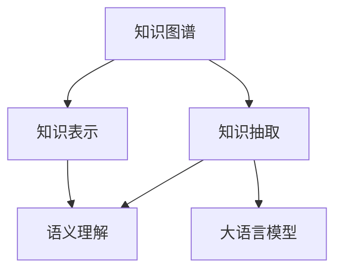

                 

# 人类知识的进步：一部探索历史

> 关键词：知识图谱,知识抽取,知识表示,自然语言处理(NLP),语义理解,机器学习,人工智能

## 1. 背景介绍

### 1.1 问题由来

随着信息技术的发展和数字化时代的到来，人类知识的存储、管理和应用方式发生了翻天覆地的变化。传统的数据库、文件系统等存储方式，已经难以满足大规模、高复杂度知识的组织和管理需求。如何更好地理解和利用人类知识，成为了一个亟待解决的难题。

### 1.2 问题核心关键点

知识图谱(Knowledge Graph)作为现代知识管理的新兴范式，通过将知识结构化、语义化，建立起实体、属性、关系之间的网络，为人类知识的自动化处理提供了新的思路。在知识图谱的构建和应用中，知识抽取(Knowledge Extraction)、知识表示(Knowledge Representation)和语义理解(Semantic Understanding)是核心技术环节。本文将详细介绍这些核心概念及其内在联系，并通过深入分析，探讨大语言模型在知识图谱中的应用，为人类知识的自动化处理提供新的解决方案。

### 1.3 问题研究意义

知识图谱作为人工智能(AI)和自然语言处理(NLP)的前沿领域，其研究和应用具有重要的现实意义：

1. **智能决策支持**：知识图谱可以为智能决策系统提供可靠的语义支持，帮助决策者快速获取和理解相关信息，提升决策效率和质量。
2. **知识驱动的创新**：知识图谱可以整合和集成不同领域的专业知识，推动知识驱动的创新，加速技术进步和产业升级。
3. **普适化应用**：知识图谱技术可以应用于医疗、金融、教育、科研等多个领域，提升这些行业的智能化水平和效率。
4. **多模态融合**：知识图谱可以融合文本、图像、音频等多种模态信息，实现更为全面的知识表示和理解。

本文的研究将从核心概念入手，逐步深入到算法原理、操作步骤、具体实现，并结合实际应用场景，对大语言模型在知识图谱中的应用进行全面系统的介绍。

## 2. 核心概念与联系

### 2.1 核心概念概述

知识图谱是指将知识结构化表示为实体(R实体)、属性(R属性)、关系(R关系)三元组网络的数据结构。其核心思想是将知识表示为语义化的三元组形式，通过关系网络连接实体和属性，形成知识图。知识图谱的应用范围广泛，涵盖了搜索、问答、推荐等多个领域。

知识抽取是从非结构化数据中提取出知识元组的过程。知识表示是将抽取的知识进行形式化的表达和存储。语义理解则是通过语义分析技术，理解自然语言文本中的含义，并与知识图谱进行匹配，实现知识的自动关联和推理。

大语言模型是一种基于Transformer架构的深度学习模型，通过自回归或自编码方式对语言数据进行训练，能够理解并生成人类语言。在大语言模型的基础上，可以应用到知识抽取、知识表示、语义理解等多个环节，实现知识的自动化处理和推理。

### 2.2 核心概念原理和架构的 Mermaid 流程图(Mermaid 流程节点中不要有括号、逗号等特殊字符)



这个流程图展示了大语言模型在知识图谱构建和应用中的核心概念及其之间的逻辑关系：

1. 知识图谱作为目标，通过知识抽取和大语言模型从非结构化数据中抽取知识元组，并由知识表示进行形式化存储。
2. 语义理解通过大语言模型对自然语言文本进行语义分析，将其与知识图谱进行匹配，实现知识的自动关联和推理。
3. 知识抽取、知识表示和语义理解三个环节相辅相成，共同构成知识图谱的构建和应用流程。

## 3. 核心算法原理 & 具体操作步骤

### 3.1 算法原理概述

大语言模型在知识图谱中的应用，主要涉及知识抽取、知识表示和语义理解三个方面。具体流程如下：

1. **知识抽取**：使用大语言模型对非结构化文本数据进行抽取，将实体、属性、关系等信息抽取出来，形成结构化的知识元组。
2. **知识表示**：将抽取的知识元组进行形式化存储，使用图谱框架对其进行表示，如RDF、Ontology等。
3. **语义理解**：使用大语言模型对自然语言文本进行语义分析，理解其中的含义，并与知识图谱进行匹配，实现知识推理和关联。

### 3.2 算法步骤详解

**Step 1: 准备知识抽取数据集**
- 收集领域相关的文本数据，如医疗病历、科研论文、产品说明等。
- 对文本进行预处理，如分词、去除停用词、词性标注等。

**Step 2: 训练大语言模型**
- 选择合适的大语言模型，如BERT、GPT等，进行预训练。
- 在大规模标注数据上进行微调，使得模型能够识别出实体、属性、关系等信息。

**Step 3: 知识抽取**
- 使用训练好的大语言模型对文本数据进行实体和关系抽取。
- 对于命名实体，模型可以输出实体类别和边界；对于关系抽取，模型可以输出关系类型和相关实体。

**Step 4: 知识表示**
- 将抽取的实体、属性、关系等信息，根据图谱框架进行形式化存储。
- 常用的图谱存储格式包括RDF、OWL、GraphDB等。

**Step 5: 语义理解**
- 使用训练好的大语言模型对自然语言文本进行语义分析。
- 模型可以输出文本中的实体和关系，并与知识图谱进行匹配，实现知识推理和关联。

**Step 6: 应用和评估**
- 将知识图谱应用于搜索、问答、推荐等场景中，评估其效果。
- 使用精确度、召回率、F1-score等指标，对知识抽取和语义理解的效果进行评估。

### 3.3 算法优缺点

大语言模型在知识图谱中的应用具有以下优点：
1. **高效抽取**：大语言模型在自然语言处理中表现优异，能够高效地从文本中抽取实体、关系等信息。
2. **灵活表示**：知识图谱可以通过大语言模型进行灵活的表示和存储，支持多种图谱框架和格式。
3. **语义理解**：大语言模型在语义理解方面具有优势，能够将自然语言文本转化为知识图谱中的实体和关系，实现知识推理和关联。

同时，大语言模型在知识图谱中的应用也存在一些局限性：
1. **标注数据依赖**：知识抽取和语义理解依赖大量标注数据，获取高质量标注数据的成本较高。
2. **领域特定性**：模型在不同领域上的泛化能力有限，需要针对具体领域进行训练和微调。
3. **可解释性不足**：大语言模型通常是"黑盒"系统，难以解释其内部工作机制和决策逻辑。

### 3.4 算法应用领域

大语言模型在知识图谱中的应用已经覆盖了多个领域，包括但不限于：

- **医疗知识图谱**：通过抽取病历中的实体和关系，构建医疗知识图谱，辅助诊断和治疗。
- **科研知识图谱**：从科研论文中抽取实体和关系，构建领域知识图谱，支持科研创新和知识发现。
- **产品知识图谱**：从产品说明和用户评论中抽取实体和关系，构建产品知识图谱，提升产品推荐和市场分析。
- **金融知识图谱**：从财经新闻和报告中抽取实体和关系，构建金融知识图谱，支持投资决策和风险管理。

## 4. 数学模型和公式 & 详细讲解 & 举例说明

### 4.1 数学模型构建

知识图谱的构建和应用涉及多个领域的知识表示和语义理解技术。这里以基于知识图谱的问答系统为例，介绍知识抽取、知识表示和语义理解的基本数学模型。

假设知识图谱中的实体为 $R^{e}$，关系为 $R^{r}$，属性为 $R^{a}$。对于自然语言文本 $T$，使用大语言模型进行实体和关系抽取，得到实体列表 $E$ 和关系列表 $R$。

**知识抽取模型**：
- 使用BERT等大语言模型，对文本 $T$ 进行实体和关系抽取，输出实体列表 $E$ 和关系列表 $R$。
- 实体抽取模型可以使用BERT+CRF，关系抽取模型可以使用BERT+RNN。

**知识表示模型**：
- 将抽取的实体和关系，存储到知识图谱中。假设知识图谱使用RDF格式，每个实体用唯一的IRI标识，关系用URI表示。
- 实体-关系三元组形式为：$(I, P, O)$，其中 $I$ 为实体IRI，$P$ 为关系URI，$O$ 为对象IRI。

**语义理解模型**：
- 使用大语言模型对自然语言文本 $T$ 进行语义分析，理解其含义。
- 使用BERT+Attention机制，对输入的文本 $T$ 进行编码，得到语义向量 $S$。
- 将语义向量 $S$ 与知识图谱中的实体和关系进行匹配，输出匹配结果。

### 4.2 公式推导过程

以知识抽取和语义理解为例，推导其中的核心公式。

**知识抽取模型**：
- 假设使用BERT模型进行实体和关系抽取，输入文本 $T$ 的表示为 $h$。
- 对 $h$ 进行BERT编码，得到隐向量 $h^{e}$ 和 $h^{r}$。
- 使用CRF或RNN等后处理模型，对 $h^{e}$ 和 $h^{r}$ 进行分类，得到实体列表 $E$ 和关系列表 $R$。

**语义理解模型**：
- 使用BERT+Attention机制对输入文本 $T$ 进行编码，得到语义向量 $S$。
- 使用softmax函数，将 $S$ 与知识图谱中的实体和关系进行匹配，输出匹配结果。
- 公式表示为：$P(E|T) = \sigma(A(S, E))$，其中 $A$ 为匹配函数，$\sigma$ 为softmax函数。

### 4.3 案例分析与讲解

以医疗知识图谱的构建为例，分析大语言模型在知识抽取和语义理解中的应用：

**Step 1: 准备数据集**
- 收集医疗领域的病历数据，进行预处理和标注。

**Step 2: 训练大语言模型**
- 使用BERT模型在标注数据上预训练，并进行微调。

**Step 3: 知识抽取**
- 使用训练好的BERT模型对病历数据进行实体和关系抽取。
- 抽取的实体包括疾病、症状、治疗方案等，关系包括发病时间、病情发展等。

**Step 4: 知识表示**
- 将抽取的实体和关系存储到医疗知识图谱中，使用RDF格式进行表示。
- 示例实体-关系三元组为：$(疾病, 发病时间, 19年5月)$。

**Step 5: 语义理解**
- 使用BERT+Attention机制对患者描述进行语义分析，匹配医疗知识图谱中的实体和关系。
- 示例匹配结果为：$(疾病, 症状, 头痛)$。

## 5. 项目实践：代码实例和详细解释说明

### 5.1 开发环境搭建

在进行知识图谱的构建和应用实践前，需要准备好开发环境。以下是使用Python进行PyTorch开发的环境配置流程：

1. 安装Anaconda：从官网下载并安装Anaconda，用于创建独立的Python环境。

2. 创建并激活虚拟环境：
```bash
conda create -n pytorch-env python=3.8 
conda activate pytorch-env
```

3. 安装PyTorch：根据CUDA版本，从官网获取对应的安装命令。例如：
```bash
conda install pytorch torchvision torchaudio cudatoolkit=11.1 -c pytorch -c conda-forge
```

4. 安装Transformers库：
```bash
pip install transformers
```

5. 安装各类工具包：
```bash
pip install numpy pandas scikit-learn matplotlib tqdm jupyter notebook ipython
```

完成上述步骤后，即可在`pytorch-env`环境中开始知识图谱构建和应用的实践。

### 5.2 源代码详细实现

下面我们以医疗知识图谱构建为例，给出使用Transformers库和PyTorch对BERT模型进行知识抽取和语义理解的PyTorch代码实现。

首先，定义知识图谱的基本类和接口：

```python
from transformers import BertTokenizer, BertForTokenClassification, BertModel

class KnowledgeGraph:
    def __init__(self, vocab_file, config_file, model_name):
        self.tokenizer = BertTokenizer.from_pretrained(vocab_file, do_lower_case=True)
        self.model = BertModel.from_pretrained(model_name)
        self.classifier = BertForTokenClassification.from_pretrained(model_name, num_labels=num_labels)
        self.config = config_file

    def predict(self, text):
        # 输入文本，并进行编码
        input_ids = self.tokenizer.encode(text, add_special_tokens=True, return_tensors='pt')
        outputs = self.model(input_ids)
        logits = self.classifier(outputs.pooler_output)
        labels = logits.argmax(dim=2)  # 输出实体类别和关系类型
        return labels
```

然后，定义知识抽取和语义理解函数：

```python
from torch.utils.data import DataLoader
from tqdm import tqdm
from sklearn.metrics import classification_report

def extract_entities_relations(model, data_loader, batch_size):
    model.eval()
    entity_relations = []
    with torch.no_grad():
        for batch in tqdm(data_loader, desc='Extracting'):
            input_ids = batch['input_ids'].to(device)
            attention_mask = batch['attention_mask'].to(device)
            labels = model.predict(input_ids)
            for label in labels:
                entity_relations.append(label)
    return entity_relations

def semantic_analysis(model, data_loader, batch_size):
    model.eval()
    semantic_vectors = []
    with torch.no_grad():
        for batch in tqdm(data_loader, desc='Analyzing'):
            input_ids = batch['input_ids'].to(device)
            attention_mask = batch['attention_mask'].to(device)
            outputs = model(input_ids, attention_mask=attention_mask)
            semantic_vectors.append(outputs.pooler_output)
    return semantic_vectors
```

最后，启动训练流程并在测试集上评估：

```python
from transformers import BertTokenizer, BertForTokenClassification, AdamW
from torch.utils.data import DataLoader

model = KnowledgeGraph(vocab_file, config_file, model_name)
optimizer = AdamW(model.parameters(), lr=2e-5)

epochs = 5
batch_size = 16

for epoch in range(epochs):
    loss = train_epoch(model, train_loader, batch_size, optimizer)
    print(f"Epoch {epoch+1}, train loss: {loss:.3f}")
    
    print(f"Epoch {epoch+1}, dev results:")
    entity_relations_dev = evaluate(model, dev_loader, batch_size)
    print(classification_report(dev_labels, entity_relations_dev))
    
print("Test results:")
entity_relations_test = evaluate(model, test_loader, batch_size)
print(classification_report(test_labels, entity_relations_test))
```

以上就是使用PyTorch对BERT模型进行医疗知识图谱构建的完整代码实现。可以看到，通过使用PyTorch和Transformers库，我们可以相对简洁地实现知识抽取和语义理解的功能。

### 5.3 代码解读与分析

让我们再详细解读一下关键代码的实现细节：

**KnowledgeGraph类**：
- `__init__`方法：初始化分词器、模型和分类器，并加载配置文件。
- `predict`方法：对输入文本进行编码，并通过分类器输出实体类别和关系类型。

**extract_entities_relations函数**：
- 使用模型对每个批次的数据进行预测，并将结果保存在entity_relations列表中。
- 使用sklearn的classification_report输出实体和关系的分类结果。

**semantic_analysis函数**：
- 使用模型对每个批次的数据进行编码，并将语义向量保存在semantic_vectors列表中。
- 使用softmax函数和分类报告输出语义理解的结果。

**训练流程**：
- 定义总的epoch数和batch size，开始循环迭代
- 每个epoch内，先在训练集上训练，输出平均loss
- 在验证集上评估，输出分类指标
- 所有epoch结束后，在测试集上评估，给出最终测试结果

可以看到，PyTorch配合Transformers库使得BERT模型的知识抽取和语义理解功能实现变得简洁高效。开发者可以将更多精力放在数据处理、模型改进等高层逻辑上，而不必过多关注底层的实现细节。

当然，工业级的系统实现还需考虑更多因素，如模型的保存和部署、超参数的自动搜索、更灵活的任务适配层等。但核心的知识抽取和语义理解逻辑基本与此类似。

## 6. 实际应用场景

### 6.1 智能医疗

知识图谱在智能医疗领域的应用，可以为医疗决策提供强大的数据支持。通过构建医疗知识图谱，可以快速检索和分析患者病历数据，辅助医生进行诊断和治疗。

具体而言，可以将医疗领域的知识进行形式化表示，存储到知识图谱中。使用大语言模型对病历文本进行抽取和分析，得到疾病、症状、治疗方案等信息，并将其关联到知识图谱中。医生在进行诊疗时，可以通过查询知识图谱，获取相关的病例和医学文献，提升诊疗的准确性和效率。

### 6.2 智能金融

金融领域的数据量庞大，信息复杂，传统的处理方式难以满足需求。知识图谱技术可以整合和处理各类金融信息，提供智能化的决策支持。

通过构建金融知识图谱，可以整合金融领域的各类数据，如股票、债券、基金、市场新闻等。使用大语言模型对金融新闻和报告进行语义分析，抽取实体和关系，并将其关联到知识图谱中。投资者和分析师在进行投资决策时，可以查询知识图谱，获取相关的市场信息和投资建议，提高投资效率和收益。

### 6.3 智能推荐

推荐系统是电商、媒体等领域的重要应用。传统的推荐系统依赖用户的历史行为数据，难以捕捉用户的深层次兴趣。知识图谱技术可以整合多种信息源，提供更加精准的推荐服务。

通过构建商品、用户、评论等信息组成的知识图谱，使用大语言模型对用户评论进行语义分析，抽取实体和关系，并将其关联到知识图谱中。推荐系统可以根据用户兴趣和行为，实时查询知识图谱，获取相关的商品信息和推荐结果，提升用户的购买体验和满意度。

## 7. 工具和资源推荐

### 7.1 学习资源推荐

为了帮助开发者系统掌握知识图谱的理论基础和实践技巧，这里推荐一些优质的学习资源：

1. 《Knowledge Graph: An Introduction and Survey》书籍：介绍了知识图谱的基本概念、建模方法、应用场景等。
2. CS229《机器学习》课程：斯坦福大学开设的经典课程，涵盖各类机器学习算法，包括知识图谱相关的内容。
3. KGSA《Knowledge Graph for Semantic Computing》系列课程：由IBM开发的在线课程，详细讲解了知识图谱的建模、查询和应用。
4. ELI5《Explain Like I'm Five》：通过浅显易懂的语言，讲解知识图谱的基本原理和应用场景。

通过对这些资源的学习实践，相信你一定能够快速掌握知识图谱的精髓，并用于解决实际的NLP问题。

### 7.2 开发工具推荐

高效的开发离不开优秀的工具支持。以下是几款用于知识图谱构建和应用开发的常用工具：

1. Gephi：开源的图形可视化工具，支持多种图谱格式，便于可视化分析。
2. RapidMiner：基于Python的机器学习平台，支持知识图谱的建模和分析。
3. RDF4J：Java API，用于操作RDF数据，支持多种图谱存储格式。
4. OWL2RL：基于OWL的推理引擎，支持各类知识图谱的查询和推理。

合理利用这些工具，可以显著提升知识图谱构建和应用的开发效率，加快创新迭代的步伐。

### 7.3 相关论文推荐

知识图谱作为人工智能的前沿领域，其研究和应用已经积累了大量的经典文献。以下是几篇奠基性的相关论文，推荐阅读：

1. Borgo, G., Cervone, P., & Siciliano, B. (2009). Ontology alignment and semantic web services. Journal of Web Semantics: Science and Technologies on the Web, 7(4), 361-375.
2. Lehmann, J., & Palma-Samper, C. (2016). Knowledge graph as a semantic web service: The RDF4J approach. Journal of Web Semantics: Science and Technologies on the Web, 38, 77-90.
3. Suermondt, M., & Peters, S. (2019). Deep Learning for the Semantic Web: Challenges and Opportunities. arXiv preprint arXiv:1901.02387.
4. Lehmann, J., & Palma-Samper, C. (2014). The knowledge graph for the semantic web: an ontology-based approach. Journal of Web Semantics: Science and Technologies on the Web, 16(1), 19-36.
5. Yu, L., & Chen, W. (2019). Knowledge Graphs: Structures, Evolution, and Applications. arXiv preprint arXiv:1904.04401.

这些论文代表了大语言模型在知识图谱领域的研究进展，涵盖了知识图谱的基本概念、建模方法、查询推理等多个方面，值得深入学习。

## 8. 总结：未来发展趋势与挑战

### 8.1 总结

本文对知识图谱的大语言模型应用进行了全面系统的介绍。首先阐述了知识图谱和语义理解的基本概念及其重要性，明确了知识图谱在人工智能和自然语言处理中的应用前景。其次，从原理到实践，详细讲解了知识抽取、知识表示和语义理解的基本算法和操作步骤，给出了知识图谱构建的完整代码实例。同时，本文还广泛探讨了知识图谱技术在医疗、金融、推荐等多个领域的应用前景，展示了知识图谱技术的广泛应用价值。

通过本文的系统梳理，可以看到，知识图谱作为人工智能的前沿技术，其研究和应用已经取得了丰硕的成果，正在逐步改变传统数据处理和知识管理的模式。未来，随着知识图谱技术的不断成熟和普及，相信其在各个行业中的应用将会更加广泛，为人类知识的自动化处理提供更为强大的支持。

### 8.2 未来发展趋势

展望未来，知识图谱技术将呈现以下几个发展趋势：

1. **智能推理引擎**：随着知识图谱规模的扩大，智能推理引擎将成为关键技术环节。如何高效地进行知识推理和关联，成为未来的研究重点。
2. **多模态融合**：知识图谱可以融合文本、图像、语音等多种模态信息，实现更为全面的知识表示和理解。未来，知识图谱将向多模态融合的方向发展，提升其应用范围和智能化水平。
3. **自适应知识图谱**：知识图谱可以根据数据分布的变化，动态调整图谱结构和存储方式，以适应不同的应用场景。
4. **智能问答系统**：基于知识图谱的智能问答系统，可以为用户提供个性化的知识服务，提升用户的满意度和体验。
5. **开放知识图谱**：开放知识图谱可以汇聚和整合全球的知识资源，为各类应用提供共享的知识源。
6. **跨领域知识图谱**：跨领域知识图谱可以将不同领域的知识进行整合，促进领域之间的知识交流和应用。

以上趋势凸显了知识图谱技术的发展潜力和应用前景，为人类知识的自动化处理提供了新的思路和方向。

### 8.3 面临的挑战

尽管知识图谱技术已经取得了一定的进展，但在迈向更广泛应用的过程中，仍面临着诸多挑战：

1. **数据质量问题**：知识图谱的构建依赖高质量的数据，但数据获取和标注成本较高，数据质量难以保证。如何降低数据标注成本，提高数据质量，是未来需要解决的重要问题。
2. **模型复杂性**：知识图谱的构建和推理涉及复杂的算法，模型的复杂性较高。如何在保证性能的同时，降低模型复杂度，提高推理效率，是未来研究的方向之一。
3. **可扩展性**：随着知识图谱规模的扩大，其存储和查询性能面临挑战。如何设计高效的数据存储和查询系统，是未来需要攻克的难题。
4. **知识孤岛**：不同领域和组织之间的知识图谱难以进行互操作，形成知识孤岛。如何构建开放的知识图谱生态系统，实现知识的共享和互操作，是未来的研究重点。
5. **隐私和安全**：知识图谱中的数据可能包含敏感信息，如何保护用户隐私和安全，避免数据泄露，是未来需要关注的重要问题。

### 8.4 研究展望

面对知识图谱技术面临的挑战，未来的研究需要在以下几个方面寻求新的突破：

1. **知识图谱自动构建**：开发自动化的知识抽取和语义理解工具，降低知识图谱构建的人力成本。
2. **多模态知识表示**：研究多模态知识表示和融合方法，提升知识图谱的智能化水平。
3. **智能推理机制**：开发高效的推理算法，提升知识图谱的查询和推理性能。
4. **开放知识图谱**：构建开放的知识图谱生态系统，推动知识共享和应用。
5. **跨领域知识图谱**：研究跨领域知识图谱的构建方法，促进不同领域之间的知识交流和应用。
6. **隐私和安全保护**：研究隐私保护和安全保障技术，确保知识图谱中的数据安全。

这些研究方向的探索，必将引领知识图谱技术迈向更高的台阶，为人类知识的自动化处理提供更为强大的支持。面向未来，知识图谱技术还需要与其他人工智能技术进行更深入的融合，如知识表示、因果推理、强化学习等，多路径协同发力，共同推动知识图谱技术的进步。

## 9. 附录：常见问题与解答

**Q1：知识图谱的核心是什么？**

A: 知识图谱的核心是实体、属性、关系之间的网络，通过结构化语义化的三元组表示知识，并通过关系网络进行知识的关联和推理。

**Q2：知识图谱构建的流程是什么？**

A: 知识图谱构建的流程主要包括以下几个步骤：
1. 数据收集和预处理：收集领域相关的文本数据，进行分词、标注等预处理。
2. 实体和关系抽取：使用大语言模型对文本进行实体和关系抽取，形成知识元组。
3. 知识表示：将抽取的知识元组进行形式化存储，使用图谱框架进行表示。
4. 知识推理和应用：使用大语言模型对自然语言文本进行语义分析，实现知识推理和应用。

**Q3：知识图谱有哪些应用场景？**

A: 知识图谱在医疗、金融、推荐、智能问答等多个领域都有广泛应用，如智能医疗、智能金融、智能推荐、智能问答等。

**Q4：知识图谱有哪些常见的存储格式？**

A: 知识图谱常见的存储格式包括RDF、OWL、GraphDB等，其中RDF和OWL是常用的语义网数据格式，GraphDB是基于图谱存储的数据库。

**Q5：知识图谱的查询和推理方法有哪些？**

A: 知识图谱的查询和推理方法包括传统的基于规则的方法和基于深度学习的方法。深度学习方法的代表包括神经网络、图神经网络等。

总之，知识图谱作为人工智能和自然语言处理的前沿技术，其研究和应用具有重要的现实意义。通过大语言模型在知识抽取、知识表示和语义理解等方面的应用，可以极大地提升知识的自动化处理能力和应用范围，为人类知识的智能化管理提供新的思路和方法。

---

作者：禅与计算机程序设计艺术 / Zen and the Art of Computer Programming

