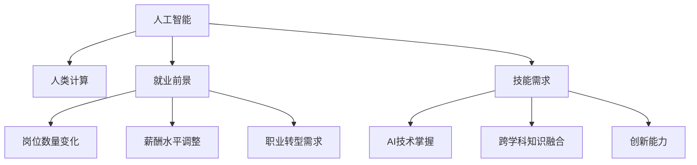

                 

# 人类计算：AI时代的未来就业前景和技能需求

> 关键词：人工智能,就业前景,技能需求,人类计算,未来就业

## 1. 背景介绍

### 1.1 问题由来

近年来，人工智能(AI)技术快速发展，正在改变各行各业的运作方式。机器学习和深度学习等技术的应用，已经深刻影响了从制造业到金融、医疗、教育等各个领域，引发了广泛的关注和讨论。特别是随着AI的商业化落地，AI时代的就业前景和技能需求，成为了社会各界关注的焦点。

### 1.2 问题核心关键点

AI技术带来了全新的技术范式和产业模式，对传统就业市场产生了重大冲击。在新的技术环境下，企业需要引入更符合AI时代的人才，同时传统职业也需要进行转型升级。因此，了解AI时代的就业前景和技能需求，对社会各界都有着重要的意义。

## 2. 核心概念与联系

### 2.1 核心概念概述

为更好地理解AI时代的就业前景和技能需求，本节将介绍几个密切相关的核心概念：

- 人工智能(Artificial Intelligence, AI)：一种模拟人类智能过程的技术，包括机器学习、深度学习、自然语言处理、计算机视觉等子领域。
- 人类计算(Human Computation)：指利用人类智慧和技能，辅助AI系统进行复杂任务处理的策略。
- 就业前景(Employment Prospects)：指AI技术发展对各类职业的影响，包括岗位数量变化、薪酬水平调整、职业转型需求等。
- 技能需求(Skill Requirements)：指AI时代企业对人才的技能要求变化，包括AI技术掌握、跨学科知识融合、创新能力等。

这些核心概念之间的逻辑关系可以通过以下Mermaid流程图来展示：



这个流程图展示了几大核心概念及其之间的关系：

1. 人工智能通过各种技术手段，模拟人类智能过程，推动技术进步。
2. 人类计算利用人类的智慧和技能，辅助AI系统处理复杂任务。
3. 就业前景反映了AI技术对各类职业的影响，包括岗位数量变化、薪酬调整和职业转型需求。
4. 技能需求揭示了AI时代对人才的新要求，包括掌握AI技术、跨学科融合和创新能力。

这些概念共同构成了AI时代就业和技能要求的理论基础，帮助理解AI技术对社会和经济的影响。

## 3. 核心算法原理 & 具体操作步骤

### 3.1 算法原理概述

AI时代的就业前景和技能需求，本质上是一个多维度、多因素的复杂问题。其算法原理主要包括：

- **就业影响模型**：通过统计学和经济学方法，建立AI技术对就业影响的数学模型，包括岗位数量变化、薪酬调整、失业率变化等。
- **技能需求模型**：通过劳动经济学和技能评估方法，建立AI时代技能需求的模型，包括技术掌握程度、跨学科融合能力、创新能力等。
- **跨学科融合模型**：通过计算机科学和心理学方法，建立AI时代跨学科融合能力的模型，包括AI与人类计算的协同机制、人类智能和AI技术的结合方式等。

### 3.2 算法步骤详解

基于上述算法原理，AI时代的就业前景和技能需求分析可以分解为以下步骤：

1. **数据收集**：收集AI技术在不同行业中的应用数据、就业市场数据、技能需求数据等，建立数据集。
2. **模型建立**：根据就业影响模型、技能需求模型和跨学科融合模型，建立数学模型，进行模型训练和验证。
3. **结果分析**：通过模型预测和仿真，分析AI技术对就业前景的影响和技能需求的变化。
4. **政策建议**：根据模型分析结果，提出AI时代就业和技能培训的政策建议。

### 3.3 算法优缺点

基于多维度、多因素的就业前景和技能需求分析算法，具有以下优点：

- **全面性**：综合考虑了技术、经济、社会等多个维度，能够更全面地反映AI时代的影响。
- **精确性**：通过数学模型和仿真实验，可以提供较为精确的预测结果。
- **可操作性**：分析结果能够为政策制定提供科学依据，具有较强的指导意义。

同时，该算法也存在一些局限性：

- **数据获取难度**：全面准确的数据获取较为困难，可能存在数据偏差。
- **模型复杂性**：多维度、多因素的模型构建较为复杂，需要较高的技术门槛。
- **结果解释性**：模型预测结果可能难以直观解释，需要结合实际案例进行分析。

### 3.4 算法应用领域

基于多维度、多因素的就业前景和技能需求分析算法，适用于以下领域：

- **政策制定**：政府和企业可以根据分析结果，制定AI时代人才培训、职业转型等相关政策。
- **职业规划**：教育机构可以根据分析结果，指导学生选择适合的职业路径，提升就业竞争力。
- **企业人力资源**：企业可以根据分析结果，制定人才招聘和培训计划，提升团队整体技能水平。

## 4. 数学模型和公式 & 详细讲解  
### 4.1 数学模型构建

基于多维度、多因素的就业前景和技能需求分析，我们可以构建以下数学模型：

1. **就业影响模型**：
   $$
   J(t) = f(T_{AI}, D(t))
   $$
   其中 $J(t)$ 表示t时刻的就业数量，$T_{AI}$ 表示AI技术的影响，$D(t)$ 表示t时刻的经济数据（如GDP、失业率等）。

2. **技能需求模型**：
   $$
   S(t) = g(T_{AI}, K(t))
   $$
   其中 $S(t)$ 表示t时刻的技能需求，$T_{AI}$ 表示AI技术的影响，$K(t)$ 表示t时刻的教育水平和培训数据。

3. **跨学科融合模型**：
   $$
   C(t) = h(T_{AI}, H(t), P(t))
   $$
   其中 $C(t)$ 表示t时刻的跨学科融合能力，$T_{AI}$ 表示AI技术的影响，$H(t)$ 表示t时刻的人类计算能力和经验，$P(t)$ 表示t时刻的AI技术工具和平台。

### 4.2 公式推导过程

以下我们以就业影响模型为例，推导其基本公式。

假设 $T_{AI}$ 和 $D(t)$ 为线性关系，则就业影响模型可以简化为：

$$
J(t) = \alpha T_{AI} + \beta D(t) + \gamma
$$

其中 $\alpha, \beta, \gamma$ 为模型参数。

通过收集历史数据和统计数据，可以建立就业影响模型的训练集，使用最小二乘法等方法，求解参数 $\alpha, \beta, \gamma$。

### 4.3 案例分析与讲解

以制造业为例，分析AI技术对其就业前景的影响。假设 $T_{AI}$ 表示制造业中引入的AI技术数量，$D(t)$ 表示制造业的GDP增长率。根据历史数据，建立就业影响模型，并通过模拟实验预测未来就业变化。

## 5. 项目实践：代码实例和详细解释说明
### 5.1 开发环境搭建

在进行项目实践前，我们需要准备好开发环境。以下是使用Python进行数据分析和模型训练的环境配置流程：

1. 安装Anaconda：从官网下载并安装Anaconda，用于创建独立的Python环境。

2. 创建并激活虚拟环境：
```bash
conda create -n ai-env python=3.8 
conda activate ai-env
```

3. 安装必要的包：
```bash
pip install numpy pandas scikit-learn matplotlib seaborn statsmodels joblib tqdm
```

4. 安装Jupyter Notebook：
```bash
pip install jupyter notebook
```

完成上述步骤后，即可在`ai-env`环境中开始项目实践。

### 5.2 源代码详细实现

接下来，我们以就业影响模型为例，给出使用Python和statsmodels库进行数据分析和模型训练的代码实现。

```python
import pandas as pd
import numpy as np
import statsmodels.api as sm
import statsmodels.formula.api as smf
import seaborn as sns

# 读取数据
data = pd.read_csv('employment_data.csv')

# 数据预处理
data = data.dropna()
X = data[['T_AI', 'D_GDP']]  # 自变量
y = data['J']  # 因变量

# 建立模型
model = sm.OLS(y, sm.add_constant(X)).fit()

# 输出模型结果
print(model.summary())
```

### 5.3 代码解读与分析

让我们再详细解读一下关键代码的实现细节：

**数据预处理**：
- 使用Pandas库读取数据集。
- 使用dropna方法去除缺失值。
- 将自变量和因变量分别赋值给X和y。

**模型建立**：
- 使用statsmodels库的OLS方法建立线性回归模型。
- 使用sm.add_constant方法添加截距项。
- 使用fit方法拟合模型，并输出模型结果。

**模型结果分析**：
- 使用summary方法输出模型参数、拟合优度、残差分析等信息。
- 通过可视化工具，如图表和热力图，进一步分析模型的结果和拟合效果。

在实际应用中，还需要考虑模型假设检验、模型选择、模型优化等多个环节，以确保模型结果的可靠性。

## 6. 实际应用场景

### 6.1 政府政策制定

AI技术对就业市场的影响，直接关系到政府的经济政策和社会政策制定。政府可以根据就业影响模型和技能需求模型，制定针对性的就业和技能培训政策，确保经济平稳发展和社会稳定。

例如，某国制造业引入大规模自动化设备，就业影响模型预测未来将导致大量岗位流失。政府可以制定政策，鼓励企业进行岗位再培训，提升员工的技能水平，减少失业率。

### 6.2 教育机构职业规划

在AI时代，教育机构需要重新审视职业规划的指导思想，帮助学生提前了解AI技术对职业的影响，选择适合的职业路径。

例如，某大学计算机专业学生毕业面临AI技术普及的挑战。学校可以根据就业影响模型和技能需求模型，调整课程设置，增加AI技术和跨学科融合课程，提升学生的就业竞争力。

### 6.3 企业人力资源管理

企业需要制定适应AI时代的人力资源管理策略，确保人力资源的合理配置和使用。

例如，某企业生产线引入自动化机器人，AI技术需求模型预测需要招聘具备AI技术的工程师进行维护和优化。企业可以制定相关招聘计划，提升团队整体的AI技术水平，提升生产效率。

### 6.4 未来应用展望

随着AI技术的不断进步，AI时代的就业前景和技能需求将继续演化。未来的就业市场将更加多样化、灵活化，需要具备更多跨学科融合能力和创新能力的人才。

- **多样化岗位**：未来将出现更多AI与人类计算相结合的新型岗位，如AI伦理师、AI心理咨询师等。
- **灵活化职业**：远程办公、自由职业等新型工作形式将成为主流，对员工的自主性和自律性提出了更高要求。
- **跨学科融合**：AI技术将与更多学科进行交叉融合，需要具备跨学科融合能力的人才，如AI与心理学结合的情感计算工程师。

## 7. 工具和资源推荐
### 7.1 学习资源推荐

为了帮助开发者系统掌握AI时代的就业前景和技能需求，这里推荐一些优质的学习资源：

1. **《人工智能基础》课程**：由斯坦福大学开设的Coursera在线课程，介绍了AI的基本概念、技术原理和应用场景。

2. **《深度学习》书籍**：由Ian Goodfellow等撰写的深度学习经典教材，系统介绍了深度学习的基本理论和算法。

3. **《人工智能伦理》书籍**：探讨AI技术的伦理问题和社会影响，帮助理解AI技术对人类社会的影响。

4. **Google AI教育**：谷歌推出的AI教育平台，提供了丰富的在线课程和实验项目，帮助开发者深入理解AI技术。

5. **MIT OpenCourseWare**：麻省理工学院公开课程，涵盖计算机科学、人工智能等多个领域，提供丰富的学习资源。

通过对这些资源的学习实践，相信你一定能够系统掌握AI时代就业前景和技能需求的理论基础，并用于解决实际问题。

### 7.2 开发工具推荐

高效的开发离不开优秀的工具支持。以下是几款用于AI时代就业和技能需求分析开发的常用工具：

1. **Jupyter Notebook**：用于编写和执行数据分析和模型训练代码，支持Python、R等多种语言。

2. **TensorFlow**：由Google主导开发的深度学习框架，适合大规模工程应用。

3. **PyTorch**：由Facebook开发的高效深度学习框架，适合快速迭代研究和开发。

4. **Scikit-learn**：Python机器学习库，提供丰富的机器学习算法和工具，适合数据分析和模型训练。

5. **Pandas**：Python数据分析库，支持数据预处理、清洗、转换等功能，适合数据处理任务。

6. **statsmodels**：Python统计分析库，提供丰富的统计模型和工具，适合模型分析和预测。

合理利用这些工具，可以显著提升AI时代就业和技能需求分析任务的开发效率，加快创新迭代的步伐。

### 7.3 相关论文推荐

AI时代就业和技能需求的研究源于学界的持续研究。以下是几篇奠基性的相关论文，推荐阅读：

1. **《AI对就业市场的影响》**：探讨AI技术对不同行业就业的影响，提出相应的政策和建议。

2. **《AI时代技能需求变化》**：分析AI时代对人才技能要求的变化，提出未来技能培训的建议。

3. **《跨学科融合能力的提升》**：研究AI与人类计算的协同机制，探讨跨学科融合能力的提升路径。

4. **《AI伦理和社会影响》**：探讨AI技术的伦理问题和社会影响，提出应对策略和建议。

这些论文代表了大AI时代就业和技能需求的研究脉络。通过学习这些前沿成果，可以帮助研究者把握学科前进方向，激发更多的创新灵感。

## 8. 总结：未来发展趋势与挑战

### 8.1 总结

本文对AI时代的就业前景和技能需求进行了全面系统的介绍。首先阐述了AI技术对就业市场的影响，明确了技能需求的变化方向。其次，从原理到实践，详细讲解了就业影响模型和技能需求模型的构建方法，给出了实际应用中的代码实现。同时，本文还探讨了AI时代就业和技能需求在政府政策制定、教育机构职业规划和企业人力资源管理中的应用前景，展示了AI技术对社会各界的深远影响。此外，本文精选了相关学习资源，力求为读者提供全方位的理论指导。

通过本文的系统梳理，可以看到，AI时代就业和技能需求是一个多维度、多因素的复杂问题。它涉及技术、经济、社会等多个层面，需要综合考虑多方面的因素。AI技术的快速发展，已经深刻改变了就业市场和技能需求，未来还将继续影响社会和经济的发展。

### 8.2 未来发展趋势

展望未来，AI时代的就业前景和技能需求将继续演化。以下几个趋势值得关注：

1. **技术发展速度加快**：AI技术的不断进步，将进一步改变就业市场和技能需求，需要持续关注新技术的发展动态。
2. **技能需求多样化**：AI时代将出现更多新型岗位和技能需求，需要具备跨学科融合能力和创新能力的人才。
3. **岗位灵活化**：远程办公、自由职业等新型工作形式将成为主流，对员工的自主性和自律性提出了更高要求。
4. **伦理问题凸显**：AI技术的伦理问题和社会影响将逐渐显现，需要制定相应的伦理准则和法规。

以上趋势凸显了AI时代就业和技能需求的多样性和复杂性。这些方向的探索发展，将进一步推动AI技术的应用落地，为社会和经济带来更广泛的影响。

### 8.3 面临的挑战

尽管AI技术带来了诸多机遇，但在迈向更加智能化、普适化应用的过程中，它仍面临着诸多挑战：

1. **数据获取难度**：全面准确的数据获取较为困难，可能存在数据偏差。
2. **模型复杂性**：多维度、多因素的模型构建较为复杂，需要较高的技术门槛。
3. **结果解释性**：模型预测结果可能难以直观解释，需要结合实际案例进行分析。
4. **伦理问题**：AI技术的伦理问题和社会影响将逐渐显现，需要制定相应的伦理准则和法规。

尽管存在这些挑战，但AI技术的发展是不可阻挡的，未来的社会和企业将需要更多的跨学科融合能力和创新能力，以应对AI时代的就业和技能需求。

### 8.4 研究展望

面对AI时代就业和技能需求面临的诸多挑战，未来的研究需要在以下几个方面寻求新的突破：

1. **数据获取技术**：探索更加高效的数据获取和处理技术，确保数据的全面性和准确性。
2. **模型简化**：简化多维度、多因素的模型，提高模型的解释性和可操作性。
3. **跨学科融合**：研究AI与更多学科的交叉融合，提升跨学科融合能力和创新能力。
4. **伦理准则**：制定AI技术的伦理准则和法规，确保AI技术的应用符合人类价值观和伦理道德。

这些研究方向的探索，将引领AI时代就业和技能需求的研究走向更加科学、合理和可操作的方向。只有勇于创新、敢于突破，才能更好地应对AI时代带来的机遇和挑战，推动社会和经济的持续发展。

## 9. 附录：常见问题与解答

**Q1：AI技术对就业市场的影响有哪些？**

A: AI技术对就业市场的影响主要体现在以下几个方面：
1. 自动化替代部分岗位：AI技术可以自动化完成一些重复性、低技能的工作，如数据录入、客服等，导致这些岗位需求减少。
2. 新增岗位需求：AI技术的发展也会带来新的岗位需求，如AI工程师、数据科学家、AI伦理师等。
3. 技能需求变化：AI技术对技能需求的影响，包括技术掌握程度、跨学科融合能力、创新能力等。

**Q2：AI时代对技能需求有哪些变化？**

A: AI时代对技能需求的变化主要体现在以下几个方面：
1. AI技术掌握：需要掌握AI技术的基本原理和应用方法，如机器学习、深度学习、自然语言处理等。
2. 跨学科融合：需要具备跨学科融合能力，能够将AI技术与人类智慧和经验相结合。
3. 创新能力：需要具备创新能力，能够提出新的解决方案和算法，推动技术进步。

**Q3：AI技术对未来职业规划的影响有哪些？**

A: AI技术对未来职业规划的影响主要体现在以下几个方面：
1. 职业路径选择：需要重新审视职业路径选择，选择符合AI技术发展方向的职业，如AI工程师、数据科学家等。
2. 技能提升：需要持续学习，提升AI技术掌握和跨学科融合能力，适应未来就业市场需求。
3. 职业转型：需要考虑职业转型，学习新技能，适应AI技术带来的职业变化。

**Q4：AI技术的伦理问题有哪些？**

A: AI技术的伦理问题主要包括以下几个方面：
1. 数据隐私：AI技术需要大量数据进行训练，可能涉及用户隐私和数据安全问题。
2. 偏见和歧视：AI技术可能学习到有偏见的数据，导致决策和输出带有偏见和歧视。
3. 自动化伦理：AI技术的自动化替代可能带来失业问题，引发社会伦理问题。
4. 透明性和可解释性：AI技术的决策过程缺乏可解释性，可能导致信任危机。

**Q5：如何应对AI技术带来的就业和技能需求变化？**

A: 应对AI技术带来的就业和技能需求变化，需要从以下几个方面入手：
1. 持续学习：持续学习AI技术和跨学科知识，提升技能水平。
2. 技能培训：参加AI技能培训课程，提升AI技术掌握和跨学科融合能力。
3. 职业转型：考虑职业转型，学习新技能，适应AI技术带来的职业变化。
4. 伦理意识：具备AI技术的伦理意识，了解AI技术的伦理问题和社会影响。

这些措施可以帮助个人和企业应对AI技术带来的就业和技能需求变化，确保在AI时代保持竞争力和适应力。

