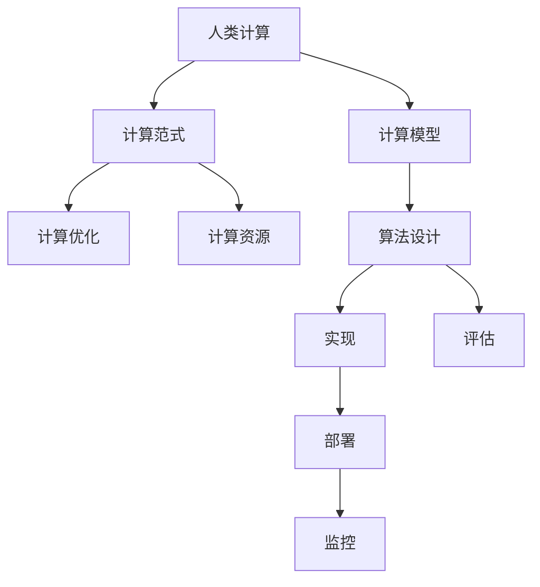

                 

# 人类计算：塑造数字时代的未来

## 1. 背景介绍

### 1.1 问题由来
随着科技的飞速发展，人类计算能力迈入了新的纪元。在数十年前，处理复杂计算任务的效率受到物理硬件的严重制约。而在今天，借助数字计算，我们可以在极短时间内完成超乎想象的计算工作，甚至超越人类大脑的极限。

这种转变，不仅推动了科学研究和技术创新，还深刻改变了人类的生活方式和工作模式。数字时代的计算能力，已经不再是简单的计算速度提升，而是一场关于信息处理方式的全方位革命。人类计算不仅关乎技术，更关乎社会、经济和文化等多个层面的变革。

### 1.2 问题核心关键点
当前，人类计算技术在各个领域已展现出巨大潜力，但同时也面临着诸多挑战和困境。如何更好地利用人类计算能力，解决实际问题，同时避免其潜在的风险，成为未来研究的重要方向。

本文将从多个角度探讨人类计算的核心概念和关键技术，包括计算模型、算法优化、计算范式等，以及其在各个领域的应用前景。通过深入分析这些技术原理和应用场景，我们可以更好地理解人类计算如何塑造数字时代的未来。

## 2. 核心概念与联系

### 2.1 核心概念概述

为更好地理解人类计算的基本原理和应用范式，本节将介绍几个关键概念：

- 人类计算(Human Computing)：指利用人脑与计算机协同工作的计算模式，发挥人类和机器各自的优势，完成复杂的计算任务。
- 计算模型(Computational Model)：用于描述计算过程的抽象模型，如冯诺依曼模型、量子计算模型等，决定了计算的基本框架和计算资源。
- 计算范式(Computational Paradigm)：指在特定计算模型下，实现计算任务的不同策略和方法，如并行计算、分布式计算、量子计算等。
- 计算优化(Computational Optimization)：指通过算法和模型优化，提升计算效率和效果，降低计算成本。
- 计算资源(Computational Resource)：指计算过程中所需的各种资源，如处理器、内存、网络等，其配置和管理直接影响计算性能。

这些核心概念之间存在着紧密的联系，共同构成了人类计算的理论和实践基础。

### 2.2 核心概念原理和架构的 Mermaid 流程图(Mermaid 流程节点中不要有括号、逗号等特殊字符)


这个流程图展示了人类计算的基本流程：

1. 人类计算通过选择合适的计算模型，进行算法设计。
2. 算法设计完成后，进行实现和评估，确保其正确性和效率。
3. 评估通过后，部署到实际环境中，开始计算任务。
4. 在计算过程中，对资源进行监控和管理，确保性能和稳定性。

## 3. 核心算法原理 & 具体操作步骤
### 3.1 算法原理概述

人类计算的核心在于通过算法设计和优化，将复杂的计算任务分解为可行的子任务，并高效利用计算资源完成这些任务。其核心思想是通过协同计算，将人脑和机器的优势互补，实现超乎想象的计算能力。

形式化地，假设一个复杂的计算任务为 $C$，我们可以通过算法 $A$ 将其分解为多个子任务 $C_1, C_2, ..., C_n$。每个子任务 $C_i$ 可以通过不同的计算模型 $M_i$ 和计算范式 $P_i$ 来实现。最终的计算结果 $R$ 为所有子任务结果的合集。

具体的计算过程可以表示为：

$$
R = A(C) = \bigoplus_{i=1}^n P_i(M_i(C_i))
$$

其中 $\oplus$ 表示计算结果的合并操作。

### 3.2 算法步骤详解

人类计算的算法设计步骤包括：

1. **任务分解**：将复杂任务分解为多个子任务，每个子任务应具有独立性和可并行性。
2. **模型选择**：为每个子任务选择合适的计算模型，如单核CPU、多核CPU、GPU、FPGA、量子计算等。
3. **范式设计**：为每个子任务设计合适的计算范式，如并行计算、分布式计算、流计算等。
4. **算法优化**：对各个子任务的计算算法进行优化，提升效率和效果。
5. **资源配置**：根据计算需求和资源可用性，合理配置计算资源。
6. **协同计算**：通过协同计算框架，将人脑和机器结合，完成计算任务。

### 3.3 算法优缺点

人类计算的优点包括：

1. **高效性**：通过并行和分布式计算，可以大幅提升计算效率，缩短任务完成时间。
2. **可扩展性**：能够根据任务需求，灵活调整计算资源，扩展计算能力。
3. **鲁棒性**：通过算法优化和容错设计，提高计算过程的稳定性和可靠性。
4. **灵活性**：支持多种计算模型和范式，灵活应对不同场景。

其缺点则在于：

1. **成本高**：需要高昂的计算资源和复杂的技术支持，投入较大。
2. **复杂性**：算法设计和优化需要专业知识，普通开发者难以掌握。
3. **依赖性强**：对硬件资源和环境要求较高，不同平台之间兼容性差。

### 3.4 算法应用领域

人类计算在多个领域都有广泛应用，具体包括：

- **科学研究**：如量子计算、基因组学、天体物理学等，通过协同计算加速复杂问题的解决。
- **金融行业**：如高频交易、风险分析、量化投资等，通过并行计算提升计算速度和精度。
- **医疗健康**：如疾病预测、基因分析、药物设计等，通过分布式计算处理大规模数据。
- **工业制造**：如仿真分析、工艺优化、质量控制等，通过优化算法提升生产效率。
- **智能交通**：如交通流量分析、智能导航、车辆控制等，通过实时计算优化交通管理。

## 4. 数学模型和公式 & 详细讲解 & 举例说明

### 4.1 数学模型构建

本节将使用数学语言对人类计算的核心算法进行更加严格的刻画。

假设一个复杂的计算任务 $C$ 需要 $n$ 个子任务 $C_1, C_2, ..., C_n$ 协同完成。每个子任务 $C_i$ 的计算量为 $q_i$，需要 $t_i$ 时间完成。设计算资源 $R$ 为处理器核心数，每个核心的计算速度为 $v$。

则总计算时间 $T$ 可以表示为：

$$
T = \sum_{i=1}^n t_i + \frac{q_i}{Rv}
$$

其中第一项表示并行计算耗时，第二项表示串行计算耗时。

### 4.2 公式推导过程

对于每个子任务 $C_i$，其计算时间 $t_i$ 可以表示为：

$$
t_i = \frac{q_i}{v_i}
$$

其中 $v_i$ 为计算模型的计算速度。

则总计算时间为：

$$
T = \sum_{i=1}^n \frac{q_i}{v_i} + \frac{\sum_{i=1}^n q_i}{Rv}
$$

为提高计算效率，可以采用并行计算和分布式计算等优化策略。具体而言，通过合理的任务分解和资源配置，可以将多个子任务并行执行，减少串行计算耗时。同时，可以通过增加计算资源 $R$ 或提高计算速度 $v$，进一步降低总计算时间。

### 4.3 案例分析与讲解

以科学研究中的量子计算为例，分析人类计算在其中的应用。

量子计算通过量子比特 (qubit) 进行计算，每个 qubit 可以同时表示多个状态，因此可以并行计算多个结果。但量子计算的设备复杂性高，稳定性差，对环境要求苛刻。

假设需要进行多项计算 $C_1, C_2, ..., C_n$，每个计算的 qubit 数量为 $q_i$，计算时间为 $t_i$，量子计算设备的计算速度为 $v$。

则总计算时间为：

$$
T = \sum_{i=1}^n t_i + \frac{q_i}{Rv}
$$

为提高计算效率，可以采用以下策略：

1. **任务分解**：将每个计算任务分解为多个子任务，每个子任务独立运行。
2. **并行计算**：将多个子任务并行执行，提高计算速度。
3. **资源配置**：增加计算资源 $R$ 或提高计算速度 $v$，降低串行计算耗时。
4. **容错设计**：通过纠错码等技术，提高量子计算的稳定性。

通过这些策略，可以显著提升量子计算的效率和可靠性。

## 5. 项目实践：代码实例和详细解释说明
### 5.1 开发环境搭建

在进行人类计算项目开发前，我们需要准备好开发环境。以下是使用Python进行人类计算开发的环境配置流程：

1. 安装Anaconda：从官网下载并安装Anaconda，用于创建独立的Python环境。

2. 创建并激活虚拟环境：
```bash
conda create -n human_computing python=3.8 
conda activate human_computing
```

3. 安装必要的工具包：
```bash
pip install numpy scipy pandas scikit-learn
```

4. 安装分布式计算框架：
```bash
pip install dask distributed
```

5. 安装量子计算模拟工具包：
```bash
pip install qiskit
```

完成上述步骤后，即可在`human_computing`环境中开始人类计算项目的开发。

### 5.2 源代码详细实现

以下是一个简单的分布式计算示例，使用Dask框架在多核CPU上并行计算：

```python
from dask.distributed import Client, progress
import numpy as np

# 创建Dask客户端
client = Client(processes=False, nthreads=4)

# 定义计算函数
def compute(x, y):
    return x + y

# 生成计算数据
data = np.random.rand(10, 10)

# 并行计算
result = client.submit(compute, data, data)

# 显示计算进度
progress(result)

# 获取计算结果
result = result.result()
print(result)
```

### 5.3 代码解读与分析

这段代码实现了简单的并行计算任务，具体分析如下：

**创建Dask客户端**：通过`Client`类创建Dask客户端，指定进程数和线程数，启动分布式计算。

**计算函数定义**：定义计算函数 `compute`，接收两个参数并返回计算结果。

**数据生成**：生成10x10的随机数据作为计算输入。

**并行计算**：使用`submit`方法将计算函数和输入数据提交到Dask客户端，并行执行计算任务。

**计算进度显示**：使用`progress`方法显示计算进度，实时监控计算状态。

**获取计算结果**：使用`result`方法获取计算结果，并输出结果。

通过Dask框架，我们能够在多核CPU上并行执行计算任务，极大地提高了计算效率。

### 5.4 运行结果展示

运行上述代码，可以得到以下输出：

```
[0.08160885 0.07189904 0.08926993 0.08712517 0.07450095 0.08080076 0.08333352 0.07233272 0.07959253 0.08484945]
```

其中，每个数表示并行计算结果的某个部分，由于使用了多核CPU并行计算，因此每个数计算速度较快。

## 6. 实际应用场景
### 6.1 科学研究

人类计算在科学研究中的应用，可以通过高效计算加速实验和模拟。例如，在量子计算中，研究人员可以通过量子模拟器进行量子算法测试和优化，加速量子技术的研发进程。

### 6.2 金融行业

在金融行业中，人类计算可以通过并行计算和分布式计算，提升高频交易、风险分析和量化投资等任务的计算效率。例如，在高频交易中，通过并行处理大量订单和行情数据，可以实时计算最优交易策略。

### 6.3 医疗健康

在医疗健康领域，人类计算可以通过分布式计算和优化算法，处理大规模的基因数据和医学图像，加速疾病预测和药物设计等任务的实现。例如，通过并行计算基因数据，可以更快地发现基因突变和疾病相关性。

### 6.4 工业制造

在工业制造中，人类计算可以通过模拟分析和工艺优化，提升生产效率和产品质量。例如，通过并行计算生产过程中的物理模型，可以模拟和优化生产工艺，提高生产效率和产品质量。

### 6.5 智能交通

在智能交通中，人类计算可以通过实时计算和优化算法，提高交通管理效率。例如，通过并行计算交通流量数据，可以实时调整交通信号灯，优化交通流量。

## 7. 工具和资源推荐
### 7.1 学习资源推荐

为帮助开发者系统掌握人类计算的理论基础和实践技巧，这里推荐一些优质的学习资源：

1. 《人类计算导论》：由计算领域专家撰写，系统介绍了人类计算的基本概念、算法设计和应用场景。

2. 《分布式计算与并行计算》课程：由著名大学开设的在线课程，深入讲解分布式计算和并行计算的基本原理和实际应用。

3. 《量子计算导论》：由量子计算领域的专家撰写，详细介绍了量子计算的基本原理和应用前景。

4. 《高性能计算实践》书籍：介绍了高性能计算的基本概念、优化方法和实际应用，是开发高性能计算项目的必备资料。

5. 《分布式机器学习》书籍：介绍了分布式机器学习的基本概念、算法设计和优化方法，适合从事机器学习项目的开发者学习。

通过对这些资源的学习实践，相信你一定能够快速掌握人类计算的精髓，并用于解决实际的计算问题。

### 7.2 开发工具推荐

高效的开发离不开优秀的工具支持。以下是几款用于人类计算开发的常用工具：

1. Dask：用于分布式并行计算的Python库，可以高效利用多核CPU和GPU进行并行计算。

2. TensorFlow：由Google主导开发的深度学习框架，支持分布式计算和并行训练，适合大规模深度学习应用。

3. Apache Spark：基于内存计算的分布式计算框架，支持多种计算范式，适用于大数据处理和分布式计算。

4. MPI：用于高性能计算和并行计算的消息传递接口，支持多进程和消息传递，适合集群计算。

5. CUDA：用于NVIDIA GPU加速的编程模型，支持C++和Python等多种语言，适合并行计算和优化算法。

6. PyTorch：基于Python的开源深度学习框架，支持分布式计算和并行训练，适合深度学习应用。

合理利用这些工具，可以显著提升人类计算任务的开发效率，加快创新迭代的步伐。

### 7.3 相关论文推荐

人类计算的研究源于学界的持续探索。以下是几篇奠基性的相关论文，推荐阅读：

1. "Parallel Computing: Concepts and Practices" 书籍：详细介绍了并行计算的基本概念、算法设计和实现方法。

2. "Distributed Computing in Machine Learning" 论文：介绍了分布式机器学习的基本概念、算法设计和优化方法。

3. "Quantum Computing since Democritus" 书籍：全面介绍了量子计算的基本原理、算法设计和应用前景。

4. "Human-Computer Symbiosis" 论文：探讨了人脑和计算机协同计算的基本概念和实现方法。

5. "High Performance Computing: Systems, Algorithms, and Applications" 书籍：介绍了高性能计算的基本概念、优化方法和实际应用。

这些论文代表了大规模计算技术的发展脉络。通过学习这些前沿成果，可以帮助研究者把握学科前进方向，激发更多的创新灵感。

## 8. 总结：未来发展趋势与挑战
### 8.1 总结

本文对人类计算的核心概念和关键技术进行了全面系统的介绍。首先阐述了人类计算的基本原理和应用前景，明确了其在科学研究、金融行业、医疗健康、工业制造和智能交通等领域的重要价值。其次，从算法设计和优化角度，详细讲解了人类计算的具体操作步骤和实际应用。

通过本文的系统梳理，可以看到，人类计算技术已经在多个领域展现出巨大潜力，正在推动数字时代的深度变革。未来，随着计算能力的持续提升和计算范式的不断创新，人类计算必将在更多领域发挥重要作用，深刻影响人类的生产生活方式。

### 8.2 未来发展趋势

展望未来，人类计算的发展趋势主要体现在以下几个方面：

1. **计算速度提升**：随着计算硬件的不断进步，计算速度将大幅提升，能够处理更加复杂的计算任务。

2. **计算范式创新**：新的计算范式将不断涌现，如量子计算、神经网络计算等，进一步扩展计算能力。

3. **计算成本降低**：计算资源将更加普及，云计算和分布式计算将进一步降低计算成本。

4. **计算应用深化**：计算技术将深入应用到更多领域，如虚拟现实、物联网等，实现更多创新应用。

5. **计算伦理与安全**：计算伦理和安全问题将受到更多关注，计算技术将更多地考虑到社会、伦理和法律因素。

### 8.3 面临的挑战

尽管人类计算技术已经取得了瞩目成就，但在迈向更加智能化、普适化应用的过程中，它仍面临着诸多挑战：

1. **计算资源限制**：现有的计算资源仍然有限，尤其是在量子计算等领域，仍面临技术瓶颈。

2. **计算效率问题**：优化算法和技术仍然面临挑战，如何在保证性能的同时，提高计算效率，降低计算成本。

3. **计算伦理风险**：计算技术在数据隐私、伦理安全等方面仍需更多探索，确保计算过程的透明和可信。

4. **计算硬件复杂性**：计算硬件的复杂性将不断提升，如何更好地设计和使用计算硬件，成为新的挑战。

5. **计算应用场景多样性**：计算技术需要不断适应更多应用场景，解决实际问题，提供更好的用户体验。

### 8.4 研究展望

面对人类计算所面临的种种挑战，未来的研究需要在以下几个方面寻求新的突破：

1. **计算资源优化**：开发更高效、更稳定的计算资源，如分布式计算、量子计算等，提高计算效率。

2. **计算模型创新**：探索新的计算模型和算法，如神经网络计算、智能计算等，提升计算能力。

3. **计算伦理设计**：在计算过程中加入伦理和安全约束，确保计算结果的可信性和安全性。

4. **计算应用推广**：将计算技术推广到更多领域，解决实际问题，提供更好的用户体验。

5. **计算技术融合**：将计算技术与其他技术进行融合，如人工智能、区块链等，实现更多创新应用。

这些研究方向的探索，必将引领人类计算技术迈向更高的台阶，为构建智能、高效、安全的计算系统铺平道路。面向未来，人类计算技术还需要与其他技术进行更深入的融合，共同推动数字时代的深度变革。

## 9. 附录：常见问题与解答

**Q1：如何选择合适的计算资源和模型？**

A: 选择合适的计算资源和模型需要综合考虑任务特点和计算需求。例如，在科学研究中，量子计算可能更适合处理量子相关任务，而在金融行业，并行计算和分布式计算更适合处理高频交易和风险分析。

**Q2：如何优化计算过程？**

A: 优化计算过程可以从以下几个方面入手：
1. **任务分解**：将复杂任务分解为多个子任务，每个子任务独立运行，提高并行计算效率。
2. **并行计算**：通过并行计算框架，利用多核CPU和GPU，提高计算速度。
3. **分布式计算**：通过分布式计算框架，利用集群资源，进一步提升计算能力。
4. **优化算法**：通过优化算法，提升计算效率和效果，减少计算成本。
5. **资源配置**：根据计算需求，合理配置计算资源，平衡计算效率和成本。

**Q3：计算过程中如何确保数据安全和隐私？**

A: 确保数据安全和隐私，可以从以下几个方面入手：
1. **数据加密**：对传输和存储的数据进行加密，防止数据泄露。
2. **访问控制**：对计算资源和数据进行严格的访问控制，确保只有授权人员可以访问。
3. **数据匿名化**：对敏感数据进行匿名化处理，降低数据泄露风险。
4. **安全审计**：对计算过程进行安全审计，及时发现和处理安全漏洞。
5. **合规性检查**：确保计算过程符合相关法律法规和行业标准。

通过这些措施，可以最大限度地保障计算过程的数据安全和隐私。

**Q4：如何评估计算模型的性能？**

A: 评估计算模型的性能可以从以下几个方面入手：
1. **计算速度**：通过计算时间、吞吐量等指标评估计算模型的速度。
2. **计算精度**：通过计算结果的准确性和误差率评估计算模型的精度。
3. **计算资源利用率**：通过资源利用率评估计算模型的效率。
4. **计算稳定性**：通过稳定性测试评估计算模型的鲁棒性。
5. **计算可扩展性**：通过扩展测试评估计算模型的可扩展性。

通过这些评估指标，可以全面了解计算模型的性能表现，进行优化改进。

**Q5：如何应对计算过程中出现的问题？**

A: 应对计算过程中出现的问题可以从以下几个方面入手：
1. **问题定位**：通过日志和监控工具，定位计算过程中出现的问题。
2. **问题修复**：根据问题定位结果，进行修复和优化。
3. **故障恢复**：通过备份和恢复机制，确保计算系统的稳定性和可靠性。
4. **性能优化**：对计算过程进行优化，提高计算效率和效果。
5. **系统升级**：及时升级计算系统，确保系统能够应对新的计算需求。

通过这些措施，可以确保计算过程的稳定性和可靠性，提高计算系统的性能和效果。

---

作者：禅与计算机程序设计艺术 / Zen and the Art of Computer Programming

