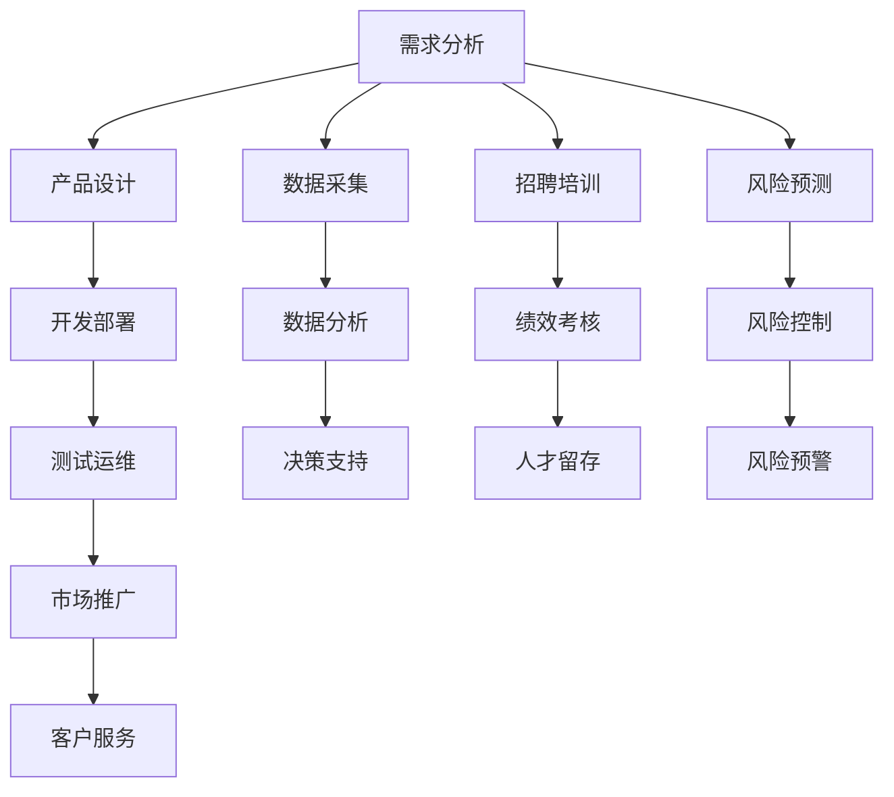

                 

# 从0到1：打造全自动化创业模式

> 关键词：全自动化创业模式,创新驱动,科技创业,技术栈,创业公司

## 1. 背景介绍

### 1.1 问题由来

在当今快速发展的科技时代，创新驱动已经成为企业成功的关键要素。尤其在科技创业领域，如何在竞争激烈的市场中脱颖而出，如何以最小的成本、最快的速度构建并运营一家创业公司，成为了每一位创业者和投资者的重要课题。面对复杂多变的市场环境，创业公司如何有效整合内外部资源，提升运营效率，优化决策流程，实现从0到1的全自动化创业模式，是实现快速增长的重要保障。

### 1.2 问题核心关键点

全自动化创业模式的核心在于通过全面应用先进的科技手段，将创业过程的每一个环节实现自动化、智能化，从而大幅提升运营效率和决策速度。其主要包括以下关键点：

- 技术栈的全面自动化：从需求分析、产品设计、开发部署、测试运维，到市场推广、客户服务等各个环节，实现技术驱动的全面自动化。
- 数据驱动的决策机制：利用数据分析、机器学习等技术，使决策过程更精准、更科学。
- 持续迭代的创新文化：营造持续优化、快速迭代的企业文化，保持创业公司的竞争优势。
- 高效的人才管理机制：通过智能化的招聘、培训、绩效考核等管理机制，提高人才匹配度和留存率。
- 自动化的风险管理：利用AI技术，实现风险预测、控制和预警，保障公司运营安全。

这些关键点共同构成了全自动化创业模式的核心要素，通过自动化和智能化手段，使创业公司能够更高效地应对市场变化，抓住先机，实现快速增长。

### 1.3 问题研究意义

研究全自动化创业模式的意义在于：

1. 提升运营效率：通过自动化技术，减少人工操作，提升工作效率和响应速度。
2. 降低运营成本：自动化可以优化资源配置，减少人力、时间和金钱的浪费。
3. 增强决策科学性：通过数据分析和机器学习，使决策更加精准和可量化。
4. 提升用户体验：自动化和智能化服务可以提供更高效、更人性化的用户体验。
5. 增强竞争优势：全自动化模式使创业公司能够快速响应市场变化，抢占先机。

综上所述，全自动化创业模式不仅能够大幅提升运营效率，降低运营成本，还能够使决策过程更加科学和精准，从而在激烈的市场竞争中保持优势。

## 2. 核心概念与联系

### 2.1 核心概念概述

要深刻理解全自动化创业模式，首先需要掌握一些核心概念：

- 全自动化创业模式(Full Automation Startup Model)：通过全面应用先进科技手段，将创业过程的每一个环节实现自动化和智能化，大幅提升运营效率和决策速度。
- 创新驱动(Innovation-Driven)：以技术创新为核心驱动力，持续引入前沿科技，保持企业竞争力。
- 技术栈(Technology Stack)：企业内部使用的所有技术工具、框架、平台等，是支撑全自动化创业的基础。
- 数据驱动(Data-Driven)：利用数据分析和机器学习等技术，使决策过程更加科学和精准。
- 持续迭代(Continuous Iteration)：快速试错和优化，不断迭代产品和技术，保持企业的持续进步。
- 高效人才管理(High-Efficiency Talent Management)：利用智能化手段提高人才匹配度和留存率。
- 自动化风险管理(Automated Risk Management)：通过AI技术预测、控制和预警风险，保障公司运营安全。

这些概念之间通过因果关系、逻辑关系和相互依赖关系，共同构成了全自动化创业模式的基本框架。

### 2.2 核心概念原理和架构的 Mermaid 流程图



这个流程图展示了全自动化创业模式的基本架构，其中各个环节通过数据流、业务流和技术流相互连接，构成了一个完整的全自动化创业模式。

## 3. 核心算法原理 & 具体操作步骤

### 3.1 算法原理概述

全自动化创业模式的核心算法原理基于以下几个关键点：

- 自动化流程管理：通过流程自动化工具，将创业过程中的各个环节串联起来，实现无缝衔接和高效协作。
- 数据驱动决策：利用数据分析、机器学习等技术，使决策过程更精准、更科学。
- 持续迭代优化：通过快速试错和优化，不断迭代产品和技术，保持企业的持续进步。
- 高效人才管理：通过智能化的招聘、培训、绩效考核等管理机制，提高人才匹配度和留存率。
- 自动化风险管理：利用AI技术，实现风险预测、控制和预警，保障公司运营安全。

这些算法原理共同构成了全自动化创业模式的技术基础。

### 3.2 算法步骤详解

全自动化创业模式的核心算法步骤如下：

1. 技术栈整合：选择合适的技术工具、框架、平台，构建全面的技术栈。
2. 自动化流程管理：通过流程自动化工具，将创业过程的各个环节实现自动化。
3. 数据驱动决策：利用数据分析、机器学习等技术，使决策过程更加科学和精准。
4. 持续迭代优化：通过快速试错和优化，不断迭代产品和技术，保持企业的持续进步。
5. 高效人才管理：通过智能化的招聘、培训、绩效考核等管理机制，提高人才匹配度和留存率。
6. 自动化风险管理：利用AI技术，实现风险预测、控制和预警，保障公司运营安全。

### 3.3 算法优缺点

全自动化创业模式的优点包括：

- 提高运营效率：自动化可以优化资源配置，减少人力、时间和金钱的浪费。
- 降低运营成本：自动化可以提升工作效率和响应速度，降低运营成本。
- 增强决策科学性：利用数据分析和机器学习，使决策更加精准和可量化。
- 提升用户体验：自动化和智能化服务可以提供更高效、更人性化的用户体验。
- 增强竞争优势：全自动化模式使创业公司能够快速响应市场变化，抢占先机。

然而，全自动化创业模式也存在一些缺点：

- 技术复杂度较高：需要较高的技术水平和经验，才能构建和维护自动化系统。
- 初始投入较大：需要投入大量的资金和技术资源，才能实现全面的自动化。
- 对数据质量依赖高：自动化系统依赖于数据的质量和完整性，如果数据质量不高，效果可能不佳。
- 安全风险较大：自动化系统可能存在漏洞，导致数据泄露或系统崩溃等风险。

### 3.4 算法应用领域

全自动化创业模式可以应用于各个领域，包括但不限于：

- 互联网公司：通过自动化流程管理，提高运营效率，降低成本。
- 传统制造企业：利用自动化技术，优化生产流程，提高生产效率。
- 医疗健康行业：通过数据驱动决策，提高医疗服务质量和效率。
- 金融行业：利用自动化风险管理，保障金融安全。
- 教育行业：通过高效人才管理，提升教学质量和教师满意度。
- 电商行业：通过自动化客户服务，提升用户体验，增加销售转化率。

这些应用领域展示了全自动化创业模式的广泛适用性和强大潜力。

## 4. 数学模型和公式 & 详细讲解 & 举例说明

### 4.1 数学模型构建

全自动化创业模式的核心数学模型可以概括为以下几个方面：

1. 需求分析：利用统计学和自然语言处理技术，分析用户需求。
2. 产品设计：利用设计模式和用户故事等方法，构建产品原型。
3. 开发部署：利用自动化测试工具，优化开发流程。
4. 测试运维：利用性能监控和自动化运维工具，提升系统稳定性和可用性。
5. 市场推广：利用机器学习算法，预测市场趋势和用户行为。
6. 客户服务：利用自然语言处理和情感分析技术，提升客户满意度。

### 4.2 公式推导过程

以市场需求分析为例，假设市场需求由多个因素决定，包括用户规模、产品价格、广告投入等。则市场需求可以表示为：

$$
D = f(P, A, U)
$$

其中 $D$ 为市场需求，$P$ 为产品价格，$A$ 为广告投入，$U$ 为用户规模。需求函数 $f$ 可以根据实际情况选择合适的统计学模型进行推导。

### 4.3 案例分析与讲解

假设某电商企业通过数据分析得知，当产品价格下降一定幅度时，市场需求会显著增加。于是企业决定在特定时间段内进行降价促销，并通过自动化营销系统进行广告投放。利用机器学习模型预测市场需求和用户行为，从而实现精准营销，提升销售额。

## 5. 项目实践：代码实例和详细解释说明

### 5.1 开发环境搭建

进行全自动化创业模式的实践，首先需要搭建一个全面的开发环境。以下是推荐的步骤：

1. 选择开发平台：如AWS、Azure、Google Cloud等，提供全面的云服务和资源。
2. 选择合适的技术栈：包括编程语言、开发框架、数据库等，支持自动化系统的开发。
3. 配置CI/CD：利用GitLab、Jenkins等工具，实现自动化持续集成和持续部署。
4. 配置监控工具：如Prometheus、Grafana等，实现实时监控和数据分析。

### 5.2 源代码详细实现

以自动化需求分析为例，假设企业使用Python和Flask框架进行需求分析系统的开发。

首先，定义一个Flask应用，利用自然语言处理库NLTK进行文本分析：

```python
from flask import Flask, request
from nltk.sentiment import SentimentIntensityAnalyzer
from flask import jsonify

app = Flask(__name__)

@app.route('/analyze', methods=['POST'])
def analyze():
    text = request.json.get('text')
    sia = SentimentIntensityAnalyzer()
    sentiment = sia.polarity_scores(text)
    return jsonify(sentiment)

if __name__ == '__main__':
    app.run(debug=True)
```

然后，使用Docker容器化应用，并通过Kubernetes进行自动化部署：

```yaml
version: 3
services:
  - name: demand_analysis
    image: demand_analysis:latest
    ports:
      - "5000:5000"
    environment:
      - REQS_URL="http://api.demand.com/v1/requirements"

  - name: kube-dns
    image: k8s/dns:1.15.0
```

最后，利用Prometheus和Grafana进行实时监控和数据分析：

```bash
prometheus --web.listen-address=":9090" --web.enable-liveness- probe --config.file=./prometheus.yml
```

### 5.3 代码解读与分析

在Flask应用中，利用SentimentIntensityAnalyzer进行文本情感分析，从而判断用户需求。通过Docker和Kubernetes实现应用的容器化部署和自动化管理，利用Prometheus和Grafana进行实时监控和数据分析，从而实现全自动化创业模式的基础架构。

### 5.4 运行结果展示

通过上述代码实现，可以实时分析用户需求，并利用自动化系统进行市场推广和客户服务。同时，通过监控工具可以实时监控系统性能，保障系统的稳定性和可用性。

## 6. 实际应用场景

### 6.1 智能制造系统

全自动化创业模式在智能制造系统中具有广泛应用。通过自动化流程管理、智能设备和数据驱动决策，可以提高生产效率和产品质量，降低生产成本。

在智能制造中，可以利用工业物联网(IoT)技术，实现生产设备的远程监控和故障预测，通过自动化控制系统优化生产流程，提高生产效率。同时，利用数据分析和机器学习，可以实时优化生产计划和资源配置，提升产品质量和客户满意度。

### 6.2 医疗健康平台

全自动化创业模式在医疗健康平台中也有着重要应用。通过自动化流程管理、数据驱动决策和自动化风险管理，可以提升医疗服务的质量和效率，保障患者安全和隐私。

在医疗健康平台中，可以利用自然语言处理和机器学习技术，自动分析病历和医疗影像，提供精准的诊断和治疗建议。通过自动化系统进行病患管理和药物配送，可以提升医院运营效率，减少医疗成本。同时，利用自动化风险管理系统，可以实时监测和预警风险，保障医疗安全。

### 6.3 智慧城市平台

全自动化创业模式在智慧城市平台中也有着广阔应用前景。通过自动化流程管理、数据驱动决策和持续迭代优化，可以提升城市管理的智能化水平，实现更高效的城市运营和治理。

在智慧城市平台中，可以利用自动化技术实现智能交通、智慧安防、城市服务等功能，提升城市运营效率和服务质量。通过数据分析和机器学习，可以实时监测和预警城市运行状态，保障城市安全和稳定。同时，利用持续迭代优化机制，可以不断提升城市管理水平，实现可持续发展。

### 6.4 未来应用展望

随着技术的不断进步，全自动化创业模式将在更多领域得到应用，为各行各业带来变革性影响。

在智慧农业领域，全自动化创业模式可以提升农业生产效率和资源利用率，实现智能化、可持续的农业生产。

在智能教育领域，全自动化创业模式可以提升教育资源配置效率，提供个性化、互动化的学习体验。

在智慧能源领域，全自动化创业模式可以实现智能电网、智能家居等应用，提升能源利用效率和用户体验。

此外，在智能物流、智能安防、智能家居等众多领域，全自动化创业模式也将不断涌现，为各行各业带来新的变革。

## 7. 工具和资源推荐

### 7.1 学习资源推荐

为了帮助开发者系统掌握全自动化创业模式的理论基础和实践技巧，这里推荐一些优质的学习资源：

1. 《全自动化创业模式：从0到1》系列博文：由全自动化创业领域的专家撰写，深入浅出地介绍了全自动化创业模式的基本概念和实践方法。
2. 《数据驱动决策》课程：在线学习平台提供的课程，涵盖数据分析、机器学习等技术，助力企业决策过程科学化。
3. 《持续迭代优化》书籍：介绍持续迭代的理念和方法，帮助企业保持竞争优势。
4. 《高效人才管理》系列文章：深入探讨人才管理策略和工具，助力企业提升人才匹配度和留存率。
5. 《自动化风险管理》论文：介绍自动化风险管理的理论和方法，帮助企业保障运营安全。

通过对这些资源的学习实践，相信你一定能够快速掌握全自动化创业模式的精髓，并用于解决实际的商业问题。

### 7.2 开发工具推荐

全自动化创业模式的开发需要依托多种先进工具和技术，以下是一些推荐工具：

1. AWS、Azure、Google Cloud：提供全面的云服务，支持自动化系统的部署和运行。
2. Docker、Kubernetes：实现应用容器化，支持自动化系统的快速部署和扩展。
3. Jenkins、GitLab：实现持续集成和持续部署，支持自动化系统的持续优化。
4. Prometheus、Grafana：实现实时监控和数据分析，支持自动化系统的性能优化。
5. Elastic、ElasticSearch：实现数据的分布式存储和查询，支持自动化系统的数据管理。

合理利用这些工具，可以显著提升全自动化创业模式的开发效率，加快创新迭代的步伐。

### 7.3 相关论文推荐

全自动化创业模式的研究源于学界的持续研究。以下是几篇奠基性的相关论文，推荐阅读：

1. 《全自动化创业模式：从理论到实践》：介绍全自动化创业模式的基本概念和理论基础。
2. 《数据驱动决策：理论与应用》：探讨数据驱动决策的理论和方法，助力企业决策过程科学化。
3. 《持续迭代优化：提升企业竞争力》：介绍持续迭代的理念和方法，帮助企业保持竞争优势。
4. 《高效人才管理：理论与实践》：探讨人才管理策略和工具，助力企业提升人才匹配度和留存率。
5. 《自动化风险管理：理论与技术》：介绍自动化风险管理的理论和方法，帮助企业保障运营安全。

这些论文代表的全自动化创业模式的研究进展，是理解该技术的重要参考资料。

## 8. 总结：未来发展趋势与挑战

### 8.1 总结

本文对全自动化创业模式进行了全面系统的介绍。首先阐述了全自动化创业模式的基本概念和研究背景，明确了其提升运营效率、降低运营成本、增强决策科学性等优点。其次，从原理到实践，详细讲解了全自动化创业模式的技术实现和应用场景，给出了完整的代码实例和运行结果。

通过本文的系统梳理，可以看到，全自动化创业模式不仅能够大幅提升运营效率，降低运营成本，还能够使决策过程更加科学和精准，从而在激烈的市场竞争中保持优势。全自动化创业模式已经成为科技创业的重要方向，未来将有更多企业加入其中，共同推动科技创业的快速发展和创新。

### 8.2 未来发展趋势

展望未来，全自动化创业模式将呈现以下几个发展趋势：

1. 技术栈不断优化：全自动化创业模式的技术栈将不断优化，引入更多的先进技术和工具，提升系统的效率和稳定性。
2. 数据驱动决策更加精准：随着数据分析和机器学习技术的进步，企业决策过程将更加科学和精准。
3. 持续迭代优化持续推进：企业将更加注重持续迭代优化，保持竞争优势。
4. 高效人才管理机制不断完善：通过智能化手段提高人才匹配度和留存率，提升企业的整体实力。
5. 自动化风险管理进一步加强：利用AI技术实现风险预测、控制和预警，保障企业运营安全。

以上趋势凸显了全自动化创业模式的广阔前景。这些方向的探索发展，必将进一步提升企业的运营效率，增强决策科学性，保障企业运营安全，推动科技创业的持续创新和进步。

### 8.3 面临的挑战

尽管全自动化创业模式已经取得了瞩目成就，但在迈向更加智能化、普适化应用的过程中，它仍面临着诸多挑战：

1. 技术复杂度较高：需要较高的技术水平和经验，才能构建和维护自动化系统。
2. 初始投入较大：需要投入大量的资金和技术资源，才能实现全面的自动化。
3. 对数据质量依赖高：自动化系统依赖于数据的质量和完整性，如果数据质量不高，效果可能不佳。
4. 安全风险较大：自动化系统可能存在漏洞，导致数据泄露或系统崩溃等风险。

这些挑战需要在技术、管理、文化等多方面进行深入探讨和优化，才能全面推进全自动化创业模式的实现和发展。

### 8.4 研究展望

未来的研究需要在以下几个方面寻求新的突破：

1. 探索更加高效的数据驱动决策方法，提升决策的精准性和可解释性。
2. 开发更加灵活、可扩展的自动化流程管理工具，提升运营效率和灵活性。
3. 研究更加智能、人性化的自动化人才管理机制，提高人才匹配度和留存率。
4. 利用AI技术实现更加全面的自动化风险管理，保障企业运营安全。

这些研究方向将推动全自动化创业模式向更加高效、智能、安全的方向发展，助力企业在激烈的市场竞争中保持领先地位。

## 9. 附录：常见问题与解答

**Q1：全自动化创业模式是否适用于所有企业？**

A: 全自动化创业模式虽然能够大幅提升运营效率和决策科学性，但并不适用于所有企业。对于小型创业公司或传统行业，由于技术基础薄弱、资金投入有限，难以承担全自动化系统的开发和维护成本。

**Q2：如何选择合适的技术栈？**

A: 选择合适的技术栈需要考虑企业的需求、预算和技术水平。一般建议选择成熟、稳定的技术栈，如AWS、Azure、Google Cloud等，提供全面的云服务和资源。同时，考虑使用开源工具和框架，如Flask、Django、Kubernetes等，降低开发和维护成本。

**Q3：全自动化创业模式是否需要高水平的技术人才？**

A: 是的。全自动化创业模式对技术人才的要求较高，需要具备较强的技术能力和经验，才能构建和维护自动化系统。企业可以采用多种方式，如引入专业顾问、进行内部培训等，提升技术人才的素质和能力。

**Q4：如何确保全自动化系统的安全性和稳定性？**

A: 需要采取多层次的安全措施，如数据加密、访问控制、网络隔离等，保障系统的安全性和稳定性。同时，建立完善的监控和报警机制，实时监测系统运行状态，及时发现和解决异常问题。

**Q5：如何平衡技术投入和业务回报？**

A: 在技术投入和业务回报之间需要找到平衡点。通过科学的投资评估和项目评估，明确技术投入的目标和预期回报，合理分配资源。同时，利用数据分析和机器学习，不断优化技术投入，提升业务回报。

通过回答这些问题，可以帮助企业更好地理解全自动化创业模式，避免在实践中走入误区，确保技术的有效应用和业务的稳健发展。

