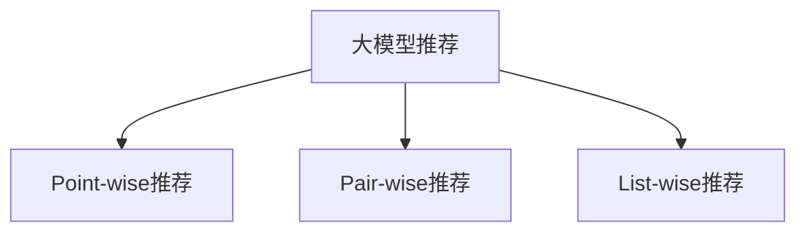

                 

# 从Point-wise/Pair-wise/List-wise三个角度评估大模型推荐

> 关键词：大模型推荐,Point-wise推荐,Pair-wise推荐,List-wise推荐,推荐系统评估,推荐算法,指标评估

## 1. 背景介绍

推荐系统已经广泛应用于各行各业，如电商、社交媒体、视频平台等，是实现个性化推荐的重要工具。然而，传统推荐系统往往只考虑单个用户和单个物品，忽略了它们之间的关系。近年来，随着深度学习和大模型技术的发展，一种新的推荐方式应运而生——大模型推荐。大模型推荐利用大规模预训练模型的泛化能力，通过微调来适应特定的推荐任务，从而获得更好的推荐效果。

## 2. 核心概念与联系

### 2.1 核心概念概述

为了更好地理解大模型推荐，我们需要了解以下几个核心概念：

- **大模型推荐**：利用大规模预训练模型，通过微调来适应特定推荐任务，从而获得更好的推荐效果。
- **Point-wise推荐**：针对单个用户和单个物品的推荐，通常通过拟合用户物品的评分分布来实现。
- **Pair-wise推荐**：针对用户和物品对之间的推荐，通过建模用户物品对的评分差异来实现。
- **List-wise推荐**：针对用户与物品列表的推荐，通常通过建模用户物品列表的评分来实现。

这些概念之间的联系可以通过以下Mermaid流程图来展示：



这个流程图展示了大模型推荐与其他推荐方式的联系：

1. Point-wise推荐：基本单位为单个用户和单个物品，通过拟合用户物品的评分分布来实现推荐。
2. Pair-wise推荐：基本单位为用户和物品对，通过建模用户物品对的评分差异来实现推荐。
3. List-wise推荐：基本单位为用户和物品列表，通过建模用户物品列表的评分来实现推荐。

## 3. 核心算法原理 & 具体操作步骤
### 3.1 算法原理概述

大模型推荐的基本思想是利用大规模预训练模型进行微调，使其能够适应特定的推荐任务。具体而言，大模型通过预训练学习到用户和物品之间的语义表示，然后通过微调学习特定推荐任务的目标函数，从而实现推荐。

### 3.2 算法步骤详解

大模型推荐的具体步骤如下：

1. **数据准备**：准备推荐系统的用户数据、物品数据和评分数据，并划分训练集、验证集和测试集。

2. **模型选择与微调**：选择合适的预训练模型，并在特定推荐任务上进行微调。通常采用Point-wise、Pair-wise或List-wise等微调方式。

3. **模型评估**：在测试集上评估微调后的模型性能，选择合理的评估指标进行评估。

### 3.3 算法优缺点

大模型推荐具有以下优点：

- **泛化能力强**：大模型通过大规模预训练学习到了丰富的知识，在特定任务上进行微调时，能够获得更好的泛化性能。
- **计算高效**：大模型通常采用深度学习架构，能够高效地进行推理，加速推荐系统的响应速度。

但大模型推荐也存在一些缺点：

- **数据依赖性强**：大模型需要通过预训练学习到丰富的知识，这需要大量的标注数据和计算资源。
- **模型复杂度高**：大模型通常结构复杂，难以进行解释和调试。
- **公平性问题**：大模型可能会学习到数据中的偏见，导致推荐结果不公平。

### 3.4 算法应用领域

大模型推荐已经广泛应用于电商推荐、视频推荐、社交网络推荐等多个领域，并取得了良好的效果。例如：

- **电商推荐**：利用用户和物品的语义表示，推荐相关商品。
- **视频推荐**：利用视频内容的多样性，推荐相关视频。
- **社交网络推荐**：利用用户行为和社交网络数据，推荐相关好友或内容。

## 4. 数学模型和公式 & 详细讲解 & 举例说明
### 4.1 数学模型构建

大模型推荐可以通过以下数学模型进行建模：

设用户为 $u$，物品为 $i$，评分数据为 $r$，预测评分为 $\hat{r}$。

- **Point-wise推荐**：通过拟合用户物品的评分分布，得到预测评分 $\hat{r}$。

$$
\hat{r} = f_{\theta}(u, i)
$$

其中 $f_{\theta}(\cdot)$ 为预训练模型的参数化函数。

- **Pair-wise推荐**：通过建模用户物品对的评分差异，得到预测评分 $\hat{r}$。

$$
\hat{r} = f_{\theta}(u, i) - f_{\theta}(i, u)
$$

其中 $f_{\theta}(\cdot)$ 为预训练模型的参数化函数。

- **List-wise推荐**：通过建模用户物品列表的评分，得到预测评分 $\hat{r}$。

$$
\hat{r} = \sum_{i \in I} f_{\theta}(u, i)
$$

其中 $I$ 为物品列表，$f_{\theta}(\cdot)$ 为预训练模型的参数化函数。

### 4.2 公式推导过程

以Point-wise推荐为例，推导其预测评分 $\hat{r}$ 的计算公式。

假设用户 $u$ 和物品 $i$ 的向量表示分别为 $\boldsymbol{u}$ 和 $\boldsymbol{i}$，通过预训练模型得到它们的表示为 $\boldsymbol{u}_{\theta}$ 和 $\boldsymbol{i}_{\theta}$。

预测评分 $\hat{r}$ 可以表示为：

$$
\hat{r} = f_{\theta}(u, i) = \boldsymbol{u}_{\theta}^T \boldsymbol{W} \boldsymbol{i}_{\theta} + b
$$

其中 $\boldsymbol{W}$ 为预训练模型的权重矩阵，$b$ 为偏置项。

通过预测评分 $\hat{r}$ 与实际评分 $r$ 的误差，可以计算预测评分的损失函数：

$$
\mathcal{L} = \sum_{(u,i) \in D} \mathbb{E}_r[\mathbb{I}(r < \hat{r})] + \sum_{(u,i) \in D} \mathbb{E}_r[\mathbb{I}(r \geq \hat{r})]
$$

其中 $\mathbb{I}(\cdot)$ 为示性函数，$D$ 为推荐系统的评分数据集。

### 4.3 案例分析与讲解

以视频推荐为例，利用大模型进行推荐的具体步骤如下：

1. **数据准备**：准备视频内容、用户行为和社交网络数据，并进行标注。

2. **模型选择与微调**：选择 suitable 的预训练模型，如BERT或GPT，并在视频推荐任务上进行微调。

3. **模型评估**：在测试集上评估微调后的模型性能，选择ROC-AUC、平均绝对误差(MAE)等指标进行评估。

## 5. 项目实践：代码实例和详细解释说明
### 5.1 开发环境搭建

在进行大模型推荐实践前，我们需要准备好开发环境。以下是使用Python进行PyTorch开发的环境配置流程：

1. 安装Anaconda：从官网下载并安装Anaconda，用于创建独立的Python环境。

2. 创建并激活虚拟环境：
```bash
conda create -n pytorch-env python=3.8 
conda activate pytorch-env
```

3. 安装PyTorch：根据CUDA版本，从官网获取对应的安装命令。例如：
```bash
conda install pytorch torchvision torchaudio cudatoolkit=11.1 -c pytorch -c conda-forge
```

4. 安装Transformers库：
```bash
pip install transformers
```

5. 安装各类工具包：
```bash
pip install numpy pandas scikit-learn matplotlib tqdm jupyter notebook ipython
```

完成上述步骤后，即可在`pytorch-env`环境中开始推荐系统的开发。

### 5.2 源代码详细实现

这里我们以视频推荐为例，给出使用Transformers库对BERT模型进行微调的PyTorch代码实现。

首先，定义视频推荐任务的数据处理函数：

```python
from transformers import BertTokenizer
from torch.utils.data import Dataset
import torch

class VideoDataset(Dataset):
    def __init__(self, videos, ratings, tokenizer, max_len=128):
        self.videos = videos
        self.ratings = ratings
        self.tokenizer = tokenizer
        self.max_len = max_len
        
    def __len__(self):
        return len(self.videos)
    
    def __getitem__(self, item):
        video = self.videos[item]
        rating = self.ratings[item]
        
        encoding = self.tokenizer(video, return_tensors='pt', max_length=self.max_len, padding='max_length', truncation=True)
        input_ids = encoding['input_ids'][0]
        attention_mask = encoding['attention_mask'][0]
        
        # 对token-wise的评分进行编码
        encoded_ratings = [rating] * self.max_len
        labels = torch.tensor(encoded_ratings, dtype=torch.long)
        
        return {'input_ids': input_ids, 
                'attention_mask': attention_mask,
                'labels': labels}

# 标签与id的映射
tag2id = {'B': 0, 'I': 1, 'O': 2}
id2tag = {v: k for k, v in tag2id.items()}

# 创建dataset
tokenizer = BertTokenizer.from_pretrained('bert-base-cased')

train_dataset = VideoDataset(train_videos, train_ratings, tokenizer)
dev_dataset = VideoDataset(dev_videos, dev_ratings, tokenizer)
test_dataset = VideoDataset(test_videos, test_ratings, tokenizer)
```

然后，定义模型和优化器：

```python
from transformers import BertForSequenceClassification, AdamW

model = BertForSequenceClassification.from_pretrained('bert-base-cased', num_labels=3)

optimizer = AdamW(model.parameters(), lr=2e-5)
```

接着，定义训练和评估函数：

```python
from torch.utils.data import DataLoader
from tqdm import tqdm
from sklearn.metrics import roc_auc_score

device = torch.device('cuda') if torch.cuda.is_available() else torch.device('cpu')
model.to(device)

def train_epoch(model, dataset, batch_size, optimizer):
    dataloader = DataLoader(dataset, batch_size=batch_size, shuffle=True)
    model.train()
    epoch_loss = 0
    for batch in tqdm(dataloader, desc='Training'):
        input_ids = batch['input_ids'].to(device)
        attention_mask = batch['attention_mask'].to(device)
        labels = batch['labels'].to(device)
        model.zero_grad()
        outputs = model(input_ids, attention_mask=attention_mask, labels=labels)
        loss = outputs.loss
        epoch_loss += loss.item()
        loss.backward()
        optimizer.step()
    return epoch_loss / len(dataloader)

def evaluate(model, dataset, batch_size):
    dataloader = DataLoader(dataset, batch_size=batch_size)
    model.eval()
    preds, labels = [], []
    with torch.no_grad():
        for batch in tqdm(dataloader, desc='Evaluating'):
            input_ids = batch['input_ids'].to(device)
            attention_mask = batch['attention_mask'].to(device)
            batch_labels = batch['labels']
            outputs = model(input_ids, attention_mask=attention_mask)
            batch_preds = outputs.logits.argmax(dim=2).to('cpu').tolist()
            batch_labels = batch_labels.to('cpu').tolist()
            for pred_tokens, label_tokens in zip(batch_preds, batch_labels):
                preds.append(pred_tokens[:len(label_tokens)])
                labels.append(label_tokens)
                
    print('ROC-AUC score:', roc_auc_score(labels, preds))
```

最后，启动训练流程并在测试集上评估：

```python
epochs = 5
batch_size = 16

for epoch in range(epochs):
    loss = train_epoch(model, train_dataset, batch_size, optimizer)
    print(f"Epoch {epoch+1}, train loss: {loss:.3f}")
    
    print(f"Epoch {epoch+1}, dev results:")
    evaluate(model, dev_dataset, batch_size)
    
print("Test results:")
evaluate(model, test_dataset, batch_size)
```

以上就是使用PyTorch对BERT进行视频推荐任务微调的完整代码实现。可以看到，得益于Transformers库的强大封装，我们可以用相对简洁的代码完成BERT模型的加载和微调。

### 5.3 代码解读与分析

让我们再详细解读一下关键代码的实现细节：

**VideoDataset类**：
- `__init__`方法：初始化视频、评分、分词器等关键组件。
- `__len__`方法：返回数据集的样本数量。
- `__getitem__`方法：对单个样本进行处理，将视频输入编码为token ids，将评分编码为数字，并对其进行定长padding，最终返回模型所需的输入。

**tag2id和id2tag字典**：
- 定义了评分与数字id之间的映射关系，用于将token-wise的预测结果解码回真实的评分。

**训练和评估函数**：
- 使用PyTorch的DataLoader对数据集进行批次化加载，供模型训练和推理使用。
- 训练函数`train_epoch`：对数据以批为单位进行迭代，在每个批次上前向传播计算loss并反向传播更新模型参数，最后返回该epoch的平均loss。
- 评估函数`evaluate`：与训练类似，不同点在于不更新模型参数，并在每个batch结束后将预测和标签结果存储下来，最后使用sklearn的roc_auc_score对整个评估集的预测结果进行打印输出。

**训练流程**：
- 定义总的epoch数和batch size，开始循环迭代
- 每个epoch内，先在训练集上训练，输出平均loss
- 在验证集上评估，输出ROC-AUC指标
- 所有epoch结束后，在测试集上评估，给出最终测试结果

可以看到，PyTorch配合Transformers库使得BERT微调的代码实现变得简洁高效。开发者可以将更多精力放在数据处理、模型改进等高层逻辑上，而不必过多关注底层的实现细节。

当然，工业级的系统实现还需考虑更多因素，如模型的保存和部署、超参数的自动搜索、更灵活的任务适配层等。但核心的微调范式基本与此类似。

## 6. 实际应用场景
### 6.1 智能推荐系统

基于大模型推荐，智能推荐系统能够更精准地为用户提供个性化推荐。通过微调大模型，推荐系统能够学习到用户和物品之间的复杂关系，从而提供更加个性化和多样化的推荐内容。

在技术实现上，可以收集用户的历史行为数据、物品的描述和标签等，构建监督数据集。在构建监督数据集时，需要对数据进行标注，将用户和物品之间的关系表示为评分数据。在此基础上对预训练模型进行微调，使其能够学习到用户物品之间的评分分布，从而实现推荐。

### 6.2 视频推荐系统

视频推荐系统利用大模型推荐技术，能够为用户推荐相关视频内容。通过微调BERT等预训练模型，视频推荐系统能够学习到视频内容的多样性，从而推荐用户可能感兴趣的视频。

在技术实现上，可以收集用户观看历史、视频标签、视频评论等数据，构建监督数据集。在构建监督数据集时，需要对数据进行标注，将用户和视频之间的关系表示为评分数据。在此基础上对预训练模型进行微调，使其能够学习到用户视频之间的评分分布，从而实现推荐。

### 6.3 智能客服系统

智能客服系统利用大模型推荐技术，能够更精准地回答用户问题。通过微调大模型，客服系统能够学习到用户和物品之间的关系，从而推荐最合适的回复。

在技术实现上，可以收集用户的历史对话记录、问题类型、回答内容等数据，构建监督数据集。在构建监督数据集时，需要对数据进行标注，将用户和物品之间的关系表示为评分数据。在此基础上对预训练模型进行微调，使其能够学习到用户问题与回复之间的评分分布，从而实现推荐。

### 6.4 未来应用展望

随着大模型推荐技术的不断发展，其在更多领域的应用前景也将更加广阔。

在智慧医疗领域，基于大模型推荐技术，医疗推荐系统能够更精准地为用户推荐医生和药品。通过微调BERT等预训练模型，医疗推荐系统能够学习到疾病和药品之间的关系，从而推荐最合适的医生和药品。

在智能教育领域，基于大模型推荐技术，智能教育系统能够更精准地为用户推荐学习资源和课程。通过微调BERT等预训练模型，智能教育系统能够学习到学生和课程之间的关系，从而推荐最合适的学习资源和课程。

在智慧城市治理中，基于大模型推荐技术，智能城市系统能够更精准地为用户推荐城市事件和公共服务。通过微调BERT等预训练模型，智能城市系统能够学习到用户和城市事件之间的关系，从而推荐最合适的城市事件和公共服务。

除了这些领域外，大模型推荐技术还将广泛应用于更多的场景中，如智能交通、智能旅游、智能金融等，为各行各业带来更多的创新和机遇。相信随着技术的不断进步，大模型推荐技术必将在更多领域发挥更大的作用。

## 7. 工具和资源推荐
### 7.1 学习资源推荐

为了帮助开发者系统掌握大模型推荐的技术基础和实践技巧，这里推荐一些优质的学习资源：

1. 《推荐系统实战》系列博文：由大模型推荐技术专家撰写，深入浅出地介绍了推荐系统的基本概念和经典算法。

2. CS291《推荐系统》课程：斯坦福大学开设的推荐系统明星课程，有Lecture视频和配套作业，带你入门推荐系统的基本概念和经典算法。

3. 《推荐系统基础与算法》书籍：推荐系统领域的经典教材，详细介绍了推荐系统的理论基础和实用算法。

4. RecSys会议论文：推荐系统领域的顶级会议，每年发布大量推荐系统的最新研究成果和前沿方向。

5. Kaggle推荐系统竞赛：通过参与Kaggle上的推荐系统竞赛，了解实际推荐系统开发中的各种问题和解决方案。

通过对这些资源的学习实践，相信你一定能够快速掌握大模型推荐的精髓，并用于解决实际的推荐问题。

### 7.2 开发工具推荐

高效的开发离不开优秀的工具支持。以下是几款用于大模型推荐开发的常用工具：

1. PyTorch：基于Python的开源深度学习框架，灵活动态的计算图，适合快速迭代研究。大部分预训练语言模型都有PyTorch版本的实现。

2. TensorFlow：由Google主导开发的开源深度学习框架，生产部署方便，适合大规模工程应用。同样有丰富的预训练语言模型资源。

3. Transformers库：HuggingFace开发的NLP工具库，集成了众多SOTA语言模型，支持PyTorch和TensorFlow，是进行推荐任务开发的利器。

4. Weights & Biases：模型训练的实验跟踪工具，可以记录和可视化模型训练过程中的各项指标，方便对比和调优。与主流深度学习框架无缝集成。

5. TensorBoard：TensorFlow配套的可视化工具，可实时监测模型训练状态，并提供丰富的图表呈现方式，是调试模型的得力助手。

6. Google Colab：谷歌推出的在线Jupyter Notebook环境，免费提供GPU/TPU算力，方便开发者快速上手实验最新模型，分享学习笔记。

合理利用这些工具，可以显著提升大模型推荐任务的开发效率，加快创新迭代的步伐。

### 7.3 相关论文推荐

大模型推荐技术的发展源于学界的持续研究。以下是几篇奠基性的相关论文，推荐阅读：

1. Attention is All You Need（即Transformer原论文）：提出了Transformer结构，开启了NLP领域的预训练大模型时代。

2. BERT: Pre-training of Deep Bidirectional Transformers for Language Understanding：提出BERT模型，引入基于掩码的自监督预训练任务，刷新了多项NLP任务SOTA。

3. Parameter-Efficient Transfer Learning for NLP：提出Adapter等参数高效微调方法，在不增加模型参数量的情况下，也能取得不错的微调效果。

4. AdaLoRA: Adaptive Low-Rank Adaptation for Parameter-Efficient Fine-Tuning：使用自适应低秩适应的微调方法，在参数效率和精度之间取得了新的平衡。

这些论文代表了大模型推荐技术的发展脉络。通过学习这些前沿成果，可以帮助研究者把握学科前进方向，激发更多的创新灵感。

## 8. 总结：未来发展趋势与挑战

### 8.1 总结

本文对基于大模型推荐技术的推荐系统进行了全面系统的介绍。首先阐述了大模型推荐技术的背景和意义，明确了推荐系统在大数据时代的优势和挑战。其次，从原理到实践，详细讲解了大模型推荐的数学原理和关键步骤，给出了推荐任务开发的完整代码实例。同时，本文还广泛探讨了推荐系统在电商、视频、智能客服等多个行业领域的应用前景，展示了推荐范式的巨大潜力。此外，本文精选了推荐系统的各类学习资源，力求为读者提供全方位的技术指引。

通过本文的系统梳理，可以看到，大模型推荐技术正在成为推荐系统的重要范式，极大地拓展了推荐模型的应用边界，催生了更多的落地场景。得益于大规模预训练模型和微调技术的结合，推荐系统能够从海量数据中学习到丰富的用户和物品之间的关系，从而实现更精准、更个性化的推荐。未来，伴随大模型推荐技术的不断演进，推荐系统必将在更多领域得到应用，为各行各业带来更多的创新和机遇。

### 8.2 未来发展趋势

展望未来，大模型推荐技术将呈现以下几个发展趋势：

1. **数据依赖性降低**：未来推荐系统将更多地依赖于用户行为数据，而不是高成本的标注数据，从而降低推荐系统的开发成本。

2. **算法多样化**：未来推荐算法将更加多样化，包括Point-wise、Pair-wise、List-wise等多种算法，从而适应不同的推荐场景。

3. **计算效率提高**：未来推荐系统将更加注重计算效率，通过模型压缩、量化加速等技术，提高推荐系统的响应速度和可扩展性。

4. **跨领域应用广泛**：未来推荐系统将更多地应用于跨领域的推荐场景，如电商、视频、社交网络等，从而实现更广泛的智能推荐。

5. **个性化推荐深化**：未来推荐系统将更加注重个性化推荐，通过学习用户的行为和偏好，提供更加精准的推荐内容。

6. **协同过滤增强**：未来推荐系统将更加注重协同过滤技术，通过用户和物品之间的相似性，提高推荐系统的准确性和鲁棒性。

以上趋势凸显了大模型推荐技术的广阔前景。这些方向的探索发展，必将进一步提升推荐系统的性能和应用范围，为各行各业带来更多的创新和机遇。

### 8.3 面临的挑战

尽管大模型推荐技术已经取得了瞩目成就，但在迈向更加智能化、普适化应用的过程中，它仍面临着诸多挑战：

1. **数据分布变化**：随着用户行为和物品属性的变化，推荐系统需要不断更新训练数据，以适应新的数据分布。

2. **模型鲁棒性不足**：大模型推荐系统面对新的推荐场景时，可能出现性能波动，甚至失效。

3. **计算资源消耗**：大规模预训练模型需要大量计算资源，如何在保证性能的同时，降低计算成本，是一个重要问题。

4. **可解释性不足**：推荐系统的决策过程难以解释，用户难以理解推荐系统的内部机制，影响用户信任。

5. **安全与隐私问题**：推荐系统需要处理大量用户数据，如何保护用户隐私，防止数据泄露，是一个重要问题。

6. **算法公平性问题**：推荐系统可能学习到数据中的偏见，导致推荐结果不公平。

正视推荐系统面临的这些挑战，积极应对并寻求突破，将是大模型推荐走向成熟的必由之路。相信随着学界和产业界的共同努力，这些挑战终将一一被克服，大模型推荐必将在构建智能推荐系统方面发挥更大的作用。

### 8.4 未来突破

面对大模型推荐系统面临的挑战，未来的研究需要在以下几个方面寻求新的突破：

1. **深度学习与强化学习的结合**：通过将深度学习和强化学习相结合，推荐系统能够更加灵活地适应不同的推荐场景，提高推荐系统的智能化水平。

2. **跨模态推荐技术**：将视觉、音频、文本等多种模态数据融合，提高推荐系统的多样性和准确性。

3. **联邦推荐系统**：通过分布式计算，利用用户设备上的本地数据进行推荐，保护用户隐私，同时提高推荐系统的效率。

4. **多任务学习推荐**：通过同时学习多个推荐任务，提高推荐系统的泛化能力和适应性。

5. **推荐系统的可解释性**：通过引入可解释性技术，如可视化、特征归因等，提高推荐系统的透明度和可信度。

6. **推荐系统的安全性**：通过引入安全机制，如差分隐私、安全计算等，保护用户隐私和数据安全。

这些研究方向将引领大模型推荐技术迈向更高的台阶，为推荐系统带来更多的创新和进步。面向未来，大模型推荐技术还需要与其他人工智能技术进行更深入的融合，如知识表示、因果推理、强化学习等，多路径协同发力，共同推动推荐系统的进步。只有勇于创新、敢于突破，才能不断拓展推荐系统的边界，让智能技术更好地服务于人类社会。

## 9. 附录：常见问题与解答

**Q1：大模型推荐是否适用于所有推荐系统？**

A: 大模型推荐在大多数推荐系统上都能取得不错的效果，特别是对于数据量较小的推荐场景。但对于一些特定领域的推荐系统，如特定领域的推荐系统，仍然需要在该领域语料上进一步预训练，再进行微调，才能获得理想效果。

**Q2：如何选择适合大模型推荐的任务？**

A: 选择适合大模型推荐的任务需要考虑以下几个因素：

1. **数据规模**：选择数据规模较大的推荐任务，以获取更好的推荐效果。

2. **推荐类型**：选择适合的推荐类型，如Point-wise、Pair-wise、List-wise等，以适应不同的推荐场景。

3. **算法复杂度**：选择适合的算法，如深度学习算法、协同过滤算法等，以适应不同的推荐需求。

4. **性能要求**：选择适合的性能要求，如响应速度、计算资源消耗等，以适应不同的应用场景。

5. **业务需求**：选择适合的业务需求，如个性化推荐、推荐多样化等，以适应不同的业务目标。

**Q3：如何评估大模型推荐的性能？**

A: 评估大模型推荐性能通常需要考虑以下几个指标：

1. **准确率**：推荐结果的准确率，即推荐系统推荐的物品是否用户真正感兴趣的。

2. **召回率**：推荐结果的召回率，即推荐系统能够推荐出多少用户真正感兴趣的物品。

3. **覆盖率**：推荐结果的覆盖率，即推荐系统推荐了多少不同的物品，覆盖了用户的多样性需求。

4. **多样性**：推荐结果的多样性，即推荐系统推荐物品的多样性，避免过度推荐相似物品。

5. **新颖性**：推荐结果的新颖性，即推荐系统推荐物品的新颖性，避免过度推荐用户已经了解的物品。

**Q4：如何进行大模型推荐的参数调优？**

A: 大模型推荐的参数调优通常需要考虑以下几个因素：

1. **学习率**：选择合适的学习率，避免过拟合和欠拟合。

2. **正则化**：使用正则化技术，如L2正则、Dropout等，避免过拟合。

3. **超参数**：选择合适的超参数，如模型结构、训练轮数等，以适应不同的推荐任务。

4. **数据增强**：通过数据增强技术，如回译、近义替换等，扩充训练集，提高推荐系统的效果。

5. **对抗训练**：通过对抗训练技术，引入对抗样本，提高推荐系统的鲁棒性。

这些因素需要在实际应用中根据具体任务进行灵活调整，以达到最优的推荐效果。

**Q5：如何保护大模型推荐系统的隐私？**

A: 保护大模型推荐系统的隐私通常需要考虑以下几个因素：

1. **差分隐私**：通过差分隐私技术，保护用户数据的隐私，防止数据泄露。

2. **联邦推荐系统**：通过联邦推荐系统，利用用户设备上的本地数据进行推荐，保护用户隐私。

3. **加密技术**：通过加密技术，保护用户数据的隐私，防止数据泄露。

4. **安全计算**：通过安全计算技术，保护用户数据的隐私，防止数据泄露。

5. **数据匿名化**：通过数据匿名化技术，保护用户数据的隐私，防止数据泄露。

这些因素需要在实际应用中根据具体场景进行灵活调整，以保护用户隐私。

---

作者：禅与计算机程序设计艺术 / Zen and the Art of Computer Programming

