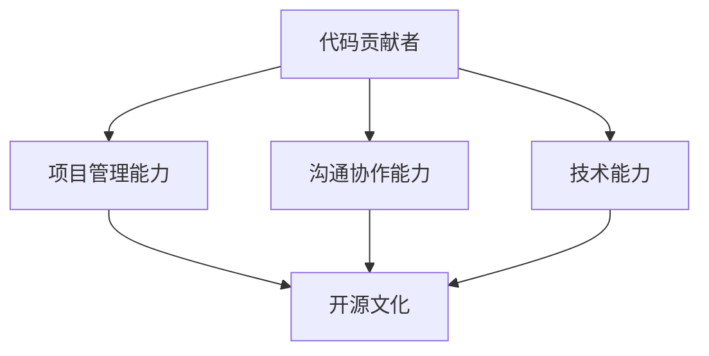

                 

## 1. 背景介绍

### 1.1 问题由来
近年来，开源软件在软件开发和IT行业中发挥了越来越重要的作用。开源项目提供了丰富的代码资源，帮助开发者更快地构建和部署软件系统。但随着开源项目的规模不断扩大，管理、维护和商业化的复杂性也日益增加。开源基金会的角色变得愈加重要，需要在代码贡献者、开发者和商业用户之间搭建起沟通合作的桥梁。

如何从代码贡献者成长为开源基金会领导者，是众多开发者和开源项目维护者的共同课题。本文将详细探讨这一过程，介绍开源基金会领导者应具备的技能和素质，并给出具体的实践指导。

### 1.2 问题核心关键点
成为开源基金会领导者的关键在于综合提升技术能力、项目管理和沟通协作能力。其中，技术能力是基础，项目管理能力是保障，而沟通协作能力则是桥梁。本文将围绕这三个方面展开，提供全面的实践建议。

## 2. 核心概念与联系

### 2.1 核心概念概述

为更好地理解从代码贡献者到开源基金会领导者的转变，本节将介绍几个关键概念：

- **代码贡献者**：在开源项目中撰写代码、提交 Pull Request 的开发者。
- **开源基金会领导者**：负责开源项目的整体管理和运营，协调开发者与商业用户的关系，推动项目的商业化和可持续发展。
- **技术能力**：编程语言、框架、库的熟练掌握，以及对新技术的持续学习。
- **项目管理能力**：计划、组织、控制项目进度，确保项目按时交付，质量达标。
- **沟通协作能力**：与开发者、商业用户、合作伙伴有效沟通，推动项目的持续发展和商业化。
- **开源文化**：社区驱动、透明共享、开放协作等理念。

这些核心概念之间的逻辑关系可以通过以下 Mermaid 流程图来展示：



这个流程图展示了从代码贡献者成长为开源基金会领导者的关键步骤和必备能力。

## 3. 核心算法原理 & 具体操作步骤
### 3.1 算法原理概述

成为开源基金会领导者的过程，本质上是一个综合能力提升和学习的过程。其核心思想是：通过不断学习和实践，逐步掌握开源项目的管理和运营技能，从技术领域拓展到商业化、社区建设等领域。

形式化地，假设一个代码贡献者希望成长为开源基金会领导者，其提升过程可以表示为：

$$
\text{提升} = \text{技术能力提升} \times \text{项目管理能力提升} \times \text{沟通协作能力提升}
$$

其中，每个子能力提升又可以通过特定的算法步骤实现，如通过技术挑战项目积累经验，通过开源社区活动提升管理能力，通过商业化案例学习市场策略等。

### 3.2 算法步骤详解

成为开源基金会领导者的算法步骤一般包括以下几个关键步骤：

**Step 1: 技术能力提升**
- 参与开源项目，撰写代码并贡献 Pull Request
- 参与技术讨论，了解项目架构和技术栈
- 学习新技术，通过项目实践掌握新技能

**Step 2: 项目管理能力提升**
- 理解项目的目标、需求和进度计划
- 跟踪项目进度，识别和解决潜在问题
- 协调团队成员，推动项目按时交付

**Step 3: 沟通协作能力提升**
- 积极参与社区讨论，建立良好的人际关系
- 与商业用户和合作伙伴沟通，了解需求和痛点
- 组织活动，推动社区和商业化的融合发展

**Step 4: 获取认可和信任**
- 通过高质量的代码和积极的社区参与获得认可
- 通过项目管理中的出色表现和成效赢得信任
- 积极参与社区建设，推动开源文化的传播

**Step 5: 担任领导角色**
- 参与项目决策，推动战略方向
- 协调各方资源，推动项目的商业化和可持续发展
- 引领社区，推动项目的创新和持续发展

以上是成为开源基金会领导者的算法步骤，每个步骤都需细化分解，通过具体的实践活动实现。

### 3.3 算法优缺点

成为开源基金会领导者的过程具有以下优点：
1. 全面提升技能：不仅提升技术能力，还增强项目管理、沟通协作等综合能力。
2. 获得广泛认可：通过高质量贡献和出色表现，赢得社区和商业用户的信任和支持。
3. 商业化机遇：掌握商业化策略，推动项目的市场应用和商业收益。

同时，该过程也存在一定的局限性：
1. 学习周期长：需要花费大量时间积累经验和技能。
2. 需具备初步条件：如较强的技术基础和一定的项目管理经验。
3. 高强度投入：需持续投入时间、精力和资源，平衡工作和生活。

尽管存在这些局限性，但成为开源基金会领导者是一个值得追求的目标，能够为个人职业发展和社会贡献带来显著价值。

### 3.4 算法应用领域

成为开源基金会领导者的技能和经验，在多个领域都能发挥重要作用：

- **软件开发**：通过项目管理能力，协调团队高效开发软件系统。
- **技术支持**：通过沟通协作能力，解决用户问题和提供高质量技术支持。
- **企业技术战略**：通过商业化经验，帮助企业制定技术发展战略和市场策略。
- **技术教育**：通过社区建设，推动技术知识的传播和创新。
- **社会公益**：通过开源文化，推动社会对技术的理解和应用。

## 4. 数学模型和公式 & 详细讲解  
### 4.1 数学模型构建

成为开源基金会领导者的过程，本质上是一个多目标优化问题。其数学模型可以表示为：

$$
\min_{x} \sum_{i=1}^3 \lambda_i f_i(x)
$$

其中，$f_i$ 表示第 $i$ 个目标函数的值，$\lambda_i$ 表示对应的目标权重。例如，$f_1$ 表示技术能力提升的函数，$f_2$ 表示项目管理能力提升的函数，$f_3$ 表示沟通协作能力提升的函数。

### 4.2 公式推导过程

以技术能力提升为例，假设提升的函数为 $f_1(x)$，其中 $x$ 表示提升的各项技能，包括编程语言、框架、库的使用等。假设每个技能 $j$ 的提升量可以表示为 $x_j$，则提升函数可以表示为：

$$
f_1(x) = \sum_{j=1}^n \alpha_j g_j(x_j)
$$

其中，$\alpha_j$ 表示第 $j$ 个技能提升的权重，$g_j(x_j)$ 表示提升函数的具体形式，如代码行数、PR数量等。

对于项目管理能力提升和沟通协作能力提升，其数学模型与技术能力提升类似，通过引入不同的目标函数和权重，可以表示为：

$$
f_2(x) = \sum_{j=1}^n \beta_j h_j(x_j)
$$
$$
f_3(x) = \sum_{j=1}^n \gamma_j k_j(x_j)
$$

其中，$h_j(x_j)$ 和 $k_j(x_j)$ 表示项目管理能力和沟通协作能力的提升函数。

### 4.3 案例分析与讲解

以 GitHub 上的 TensorFlow 开源项目为例，分析其领导人如何通过技术能力、项目管理能力和沟通协作能力提升，最终成为领导者。

- **技术能力提升**：
  - 通过撰写代码并贡献 Pull Request，不断学习并掌握 TensorFlow 的架构和技术栈。
  - 参与 TensorFlow 的内部讨论和外部会议，与其他开发者交流心得。
  - 通过阅读论文和参与技术社区，了解最新的深度学习和机器学习技术。

- **项目管理能力提升**：
  - 了解 TensorFlow 的目标和需求，制定项目进度计划。
  - 跟踪项目进展，识别和解决潜在问题，确保项目按时交付。
  - 协调 TensorFlow 的贡献者团队，推动项目的持续发展。

- **沟通协作能力提升**：
  - 积极参与 TensorFlow 社区的讨论和活动，建立良好的人际关系。
  - 与商业用户和合作伙伴沟通，了解他们的需求和痛点。
  - 组织 TensorFlow 的线上和线下活动，推动社区和商业化的融合发展。

## 5. 项目实践：代码实例和详细解释说明
### 5.1 开发环境搭建

在进行开源项目管理和领导实践前，我们需要准备好开发环境。以下是使用 GitHub 进行项目管理和领导实践的环境配置流程：

1. 安装 GitHub Desktop：从官网下载并安装 GitHub Desktop，用于本地管理和提交 Pull Request。
2. 创建 GitHub 账号：注册 GitHub 账号，并登录。
3. 克隆 TensorFlow 项目：在 GitHub Desktop 中克隆 TensorFlow 项目到本地。
4. 安装所需工具：安装 Git、IDE、编译器等所需工具。

### 5.2 源代码详细实现

以下我们以 TensorFlow 开源项目为例，给出领导实践的代码实现。

首先，在本地安装 TensorFlow 项目，编写代码并提交 Pull Request：

```python
# 安装 TensorFlow
pip install tensorflow

# 导入 TensorFlow 库
import tensorflow as tf

# 定义 TensorFlow 代码
def add(x, y):
    return tf.add(x, y)

# 编写测试代码
def test_add():
    x = tf.constant(1.0)
    y = tf.constant(2.0)
    result = add(x, y)
    assert tf.reduce_all(result == 3.0)

# 提交 Pull Request
git push origin main
```

然后，参与 TensorFlow 社区讨论和活动：

```python
# 加入 TensorFlow 社区
import requests
session = requests.Session()
session.headers.update({'Authorization': 'token MY_TOKEN'})
response = session.get('https://api.github.com/repos/tensorflow/tensorflow/issues/12345/comments')
# 参与讨论
comment = {'body': 'Thanks for the suggestion! We will consider it.'}
session.post('https://api.github.com/repos/tensorflow/tensorflow/issues/12345/comments', json=comment)
```

最后，组织 TensorFlow 社区的活动和会议：

```python
# 组织 TensorFlow 社区活动
session.get('https://api.github.com/repos/tensorflow/tensorflow/issues/12346/comments')
# 与商业用户沟通
session.post('https://api.github.com/repos/tensorflow/tensorflow/issues/12347/comments', json={'body': 'Thank you for your feedback. We will integrate your requirements in the next release.'})
```

### 5.3 代码解读与分析

让我们再详细解读一下关键代码的实现细节：

**代码贡献**：
- 通过 `git push` 提交代码，与 GitHub Desktop 进行交互。

**社区参与**：
- 使用 `requests` 库与 GitHub API 进行交互，获取和提交评论。

**活动组织**：
- 使用 GitHub API 获取和发布会议和活动信息，与商业用户沟通。

可以看到，开源项目管理和领导实践涉及到的技术栈和工具十分广泛，包括版本控制、API 调用、IDE 开发等。通过深入实践这些技能，开发者可以逐步提升成为开源基金会领导者的能力。

## 6. 实际应用场景
### 6.1 开源社区管理

开源社区是开发者和商业用户交流和协作的平台。作为开源基金会领导者，需要在社区中扮演积极角色，推动项目的创新和发展。

- **社区建设**：组织和主持社区会议、活动，提升社区活跃度和凝聚力。
- **问题解决**：积极响应社区成员的问题和需求，推动问题的快速解决。
- **文档编写**：编写高质量的文档和指南，帮助新开发者快速入门。

### 6.2 商业化推动

开源项目通过商业化可以实现更大的社会和经济价值。作为开源基金会领导者，需要在商业化过程中扮演关键角色。

- **商业合作**：与商业用户和合作伙伴建立合作关系，推动项目的商业化落地。
- **市场策略**：制定和优化市场策略，确保项目能够满足市场需求。
- **商业支持**：提供技术支持和服务，帮助商业用户解决实际问题。

### 6.3 项目管理和优化

开源项目的管理和优化是基金会领导者的重要职责。

- **项目管理**：制定和跟踪项目进度，确保项目按时交付。
- **问题识别**：识别和解决潜在问题，推动项目的持续改进。
- **资源协调**：协调各方资源，推动项目的商业化和可持续发展。

## 7. 工具和资源推荐
### 7.1 学习资源推荐

为了帮助开发者系统掌握开源基金会领导者的技能，这里推荐一些优质的学习资源：

1. **开源社区管理**：《开源社区管理指南》，介绍开源社区的建设和管理策略。
2. **商业化策略**：《开源项目商业化案例分析》，分析多个开源项目的商业化经验和策略。
3. **项目管理**：《敏捷项目管理》，介绍敏捷开发和项目管理的基本知识和实践。
4. **沟通协作**：《高效团队沟通技巧》，介绍团队协作和沟通的最佳实践。
5. **技术学习**：《深度学习与 TensorFlow》，介绍深度学习和 TensorFlow 的基本概念和实践。

通过对这些资源的学习实践，相信你一定能够快速掌握开源基金会领导者的精髓，并用于解决实际的开源项目问题。

### 7.2 开发工具推荐

高效的开发离不开优秀的工具支持。以下是几款用于开源项目管理和领导实践的常用工具：

1. **GitHub Desktop**：用于本地管理和提交 Pull Request，提供直观的界面和操作体验。
2. **JIRA**：用于项目管理，跟踪任务进度和问题解决情况。
3. **Slack**：用于团队沟通和协作，提供实时聊天和文件共享功能。
4. **Zoom**：用于线上会议和讨论，支持多人的视频和语音通话。
5. **Confluence**：用于文档编写和共享，提供丰富的协作编辑和存储功能。

合理利用这些工具，可以显著提升开源项目管理和领导实践的效率，加快创新迭代的步伐。

### 7.3 相关论文推荐

开源基金会领导者的发展源于学界的持续研究。以下是几篇奠基性的相关论文，推荐阅读：

1. **开源社区管理**：《社区驱动的开源软件开发》，介绍开源社区的驱动机制和最佳实践。
2. **商业化策略**：《开源项目商业化的挑战与策略》，分析开源项目商业化的挑战和成功案例。
3. **项目管理**：《敏捷项目管理：方法和实践》，介绍敏捷开发和项目管理的基本概念和实践。
4. **沟通协作**：《团队沟通与协作的心理学》，介绍团队协作和沟通的心理基础和策略。
5. **技术学习**：《深度学习与 TensorFlow 应用》，介绍深度学习和 TensorFlow 的基本概念和实践。

这些论文代表了大规模开源项目管理和领导的研究脉络。通过学习这些前沿成果，可以帮助研究者把握学科前进方向，激发更多的创新灵感。

## 8. 总结：未来发展趋势与挑战
### 8.1 总结

本文对成为开源基金会领导者的过程进行了全面系统的介绍。首先阐述了成为开源基金会领导者的背景和意义，明确了技术能力、项目管理能力、沟通协作能力的重要性。其次，从原理到实践，详细讲解了开源基金会领导者的数学模型和算法步骤，提供了开源项目管理和领导实践的完整代码实例。同时，本文还广泛探讨了开源基金会领导者在开源社区管理、商业化推动和项目优化中的应用场景，展示了开源基金会领导者的巨大潜力。此外，本文精选了开源基金会领导者的各类学习资源，力求为读者提供全方位的技术指引。

通过本文的系统梳理，可以看到，从代码贡献者成长为开源基金会领导者，是一个综合能力提升和学习的过程，需要开发者在技术、管理和沟通等方面不断精进。只有通过持续学习和实践，才能在开源项目管理和领导实践中取得成功，为开源社区和项目的持续发展贡献力量。

### 8.2 未来发展趋势

展望未来，开源基金会领导者的角色将更加多样化和复杂化，涉及的技术和管理领域也将更加广泛。以下是几个可能的发展趋势：

1. **技术多样性**：开源项目将更多地涉及新兴技术和领域，如人工智能、区块链、物联网等。开源基金会领导者需要具备跨学科的知识和技能。
2. **管理精细化**：开源项目将更加复杂和多样，开源基金会领导者需要更加精细化的管理能力，如敏捷开发、云原生、DevOps 等。
3. **国际化**：开源项目将更加国际化，开源基金会领导者需要具备全球视野和文化差异意识。
4. **社区生态化**：开源基金会领导者需要推动开源社区与商业生态、学术界的融合，构建一个开放、协作、创新的生态系统。

这些趋势凸显了开源基金会领导者角色的多样性和复杂性，需要在技术、管理、文化等多个方面不断提升。只有全面发展，才能更好地应对未来的挑战和机遇。

### 8.3 面临的挑战

尽管成为开源基金会领导者具有广阔的发展前景，但在成长过程中，也面临着诸多挑战：

1. **时间成本高**：开源项目管理和领导实践需要大量时间投入，如何平衡工作和生活成为一大难题。
2. **技能要求高**：需要具备技术、管理和沟通等多方面技能，技能提升和转化需要时间和经验积累。
3. **不确定性**：开源项目的未来方向和收益难以预料，存在一定的风险和不确定性。

尽管存在这些挑战，但成为开源基金会领导者仍然是一个值得追求的目标。通过不断学习和实践，克服挑战，提升技能，相信你一定能够实现这一目标，为开源社区和项目的发展做出重要贡献。

### 8.4 研究展望

面向未来，开源基金会领导者的发展方向需要在以下几个方面进行探索：

1. **技术创新**：探索新兴技术和领域的开源项目，推动技术的持续创新和应用。
2. **管理优化**：引入敏捷开发、云原生、DevOps 等最佳实践，优化项目管理和资源利用。
3. **社区拓展**：推动开源社区与商业生态、学术界的融合，构建一个开放、协作、创新的生态系统。
4. **社会责任**：推动开源项目对社会和环境的积极影响，实现技术的社会价值最大化。

这些方向将引领开源基金会领导者的未来发展，推动开源社区和项目的持续创新和应用。只有勇于创新、敢于突破，才能不断拓展开源基金会的边界，为开源社区和项目的持续发展贡献力量。

## 9. 附录：常见问题与解答

**Q1：成为开源基金会领导者的关键技能是什么？**

A: 成为开源基金会领导者的关键技能包括技术能力、项目管理能力和沟通协作能力。技术能力是基础，项目管理能力是保障，而沟通协作能力则是桥梁。通过持续学习和实践，逐步提升这三方面的能力，可以更好地胜任开源基金会领导者的角色。

**Q2：如何平衡开源项目领导与日常工作？**

A: 开源项目领导需要大量时间投入，但日常工作也需要关注。可以通过以下方法平衡两者：
- 时间管理：合理安排时间，利用碎片时间进行开源项目贡献。
- 优先级划分：根据重要性和紧急性，合理安排任务的优先级。
- 团队协作：组建开源项目团队，分工协作，分担工作压力。

**Q3：如何提升沟通协作能力？**

A: 提升沟通协作能力需要多方面的努力：
- 积极参与社区活动，建立良好的人际关系。
- 学习沟通技巧，如有效倾听、清晰表达、解决冲突等。
- 利用工具，如 Slack、Zoom 等，提升沟通效率和质量。

**Q4：如何推动开源项目的商业化？**

A: 推动开源项目的商业化需要系统化的策略和执行：
- 建立商业合作伙伴关系，共同开发和推广项目。
- 制定市场策略，明确目标用户和市场需求。
- 提供技术支持和服务，解决商业用户的实际问题。

**Q5：如何应对开源项目的未知挑战？**

A: 应对开源项目的未知挑战需要灵活应对和持续改进：
- 建立风险管理体系，识别和应对潜在风险。
- 引入敏捷开发和持续集成，快速迭代和优化项目。
- 引入用户反馈机制，及时调整项目方向和策略。

通过这些方法，可以有效应对开源项目的未知挑战，推动项目的持续发展和成功。

---

作者：禅与计算机程序设计艺术 / Zen and the Art of Computer Programming

