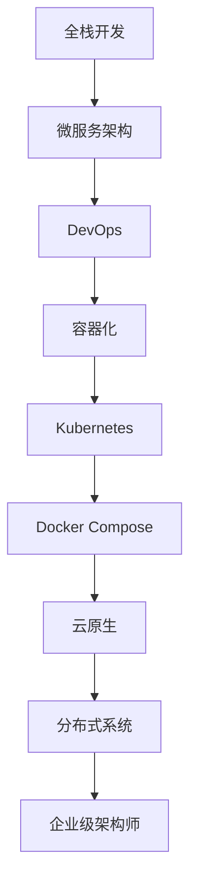

                 

# 从全栈开发到企业级架构师的进阶之路

## 1. 背景介绍

随着技术的发展，软件工程师的角色也在不断演进。从早期的只关注前后端某个方向，到后来的全栈开发，再到如今的企业级架构师，每一阶段都对应着不同的技能需求和发展路径。本文将带领读者一步步探索从全栈开发到企业级架构师所需要掌握的关键知识和技能。

## 2. 核心概念与联系

### 2.1 核心概念概述

- **全栈开发(Full-stack Development)**：指能够独立完成前后端所有开发任务，从数据库设计、前端渲染、后端API开发、应用部署等环节一应俱全的开发人员。

- **微服务架构(Microservices Architecture)**：一种基于服务的架构风格，将应用拆分为多个小型、松耦合的服务，通过网络通信实现协同工作。

- **DevOps（开发运维）**：结合开发和运维流程，持续集成、持续交付和持续监控，以实现软件交付效率和质量的提升。

- **容器化(Containerization)**：通过Docker等容器技术，将应用和依赖打包为可移植、一致性的运行环境，提升应用的稳定性和可移植性。

- **Kubernetes(K8s)**：一个开源的容器编排系统，可以实现应用的自动化部署、扩展和管理。

- **Docker Compose**：基于Docker的容器编排工具，可以一次性启动多个Docker容器，方便应用编排和管理。

- **云原生(Cloud Native)**：利用云平台的服务和资源，构建高度可伸缩、弹性、可靠的应用架构。

- **分布式系统(Distributed System)**：由多个互连的计算节点组成，通过网络通信和协同工作，实现高性能和高可用的计算系统。

这些核心概念构成了现代软件开发的基础架构，贯穿了从全栈开发到企业级架构师的全过程。理解这些概念及其联系，有助于在技术演进中不断提升自身能力。

### 2.2 核心概念原理和架构的 Mermaid 流程图



## 3. 核心算法原理 & 具体操作步骤

### 3.1 算法原理概述

企业级架构师需要具备一定的算法思维，能够理解和优化系统的核心算法，提升系统的性能和效率。以下是一些核心的算法原理和操作步骤：

- **负载均衡算法**：通过算法分配请求到多个服务实例上，提升系统吞吐量。

- **缓存算法**：如LRU、LFU等，通过缓存热门数据，减少数据库访问压力，提升响应速度。

- **分布式一致性算法**：如Paxos、Raft等，保证分布式系统中的数据一致性和可靠性。

- **机器学习算法**：如回归、分类、聚类等，用于分析和预测系统行为，优化资源配置。

### 3.2 算法步骤详解

以**负载均衡算法**为例，其核心步骤包括：

1. **负载均衡器选择**：选择合适的负载均衡算法，如轮询、加权轮询、最少连接等。
2. **请求分派**：将请求分派到合适的服务实例上。
3. **状态维护**：实时监测服务实例状态，根据状态进行动态调整。
4. **数据统计**：收集负载均衡器的统计数据，进行性能分析和优化。

### 3.3 算法优缺点

- **优点**：提高系统可用性和扩展性，提升性能和资源利用率。
- **缺点**：算法复杂度高，实现和维护难度大，需要根据具体场景进行调优。

### 3.4 算法应用领域

负载均衡算法广泛应用于Web服务、API网关、分布式缓存等领域，是企业级应用系统不可或缺的核心技术。

## 4. 数学模型和公式 & 详细讲解 & 举例说明

### 4.1 数学模型构建

以**缓存算法**为例，其数学模型可以表示为：

$$
C = \alpha \times D - \beta \times L
$$

其中，$C$表示缓存容量，$D$表示热门数据占比，$L$表示缓存失效率，$\alpha$和$\beta$为模型参数。

### 4.2 公式推导过程

通过模型推导，可以得出：

- 当$D$较大时，$C$主要受$D$影响，应该增加缓存容量。
- 当$L$较大时，$C$受$L$影响较大，需要调整缓存策略。

### 4.3 案例分析与讲解

假设$D=80\%$，$L=5\%$，$\alpha=0.7$，$\beta=0.1$。计算得$C=50$，表示应配置50%的缓存容量以应对热点数据。

## 5. 项目实践：代码实例和详细解释说明

### 5.1 开发环境搭建

以下是使用Java和Spring Boot构建微服务系统的环境搭建流程：

1. 安装Java JDK：从官网下载并安装Java JDK。
2. 安装Maven：下载并安装Maven，用于项目构建和依赖管理。
3. 创建Spring Boot项目：
```bash
mvn archetype:generate -DgroupId=com.example -DartifactId=my-service -DarchetypeArtifactId=maven-archetype-quickstart -DinteractiveMode=false
```
4. 配置Spring Boot应用：
```java
@SpringBootApplication
public class MyServiceApplication {
    public static void main(String[] args) {
        SpringApplication.run(MyServiceApplication.class, args);
    }
}
```

### 5.2 源代码详细实现

以下是使用Spring Boot实现负载均衡的例子：

```java
@RestController
public class MyServiceController {
    @Autowired
    private MyServiceService myServiceService;

    @GetMapping("/hello")
    public String hello() {
        return myServiceService.hello();
    }
}

@Service
public class MyServiceService {
    private final RestTemplate restTemplate;

    @Autowired
    public MyServiceService(RestTemplate restTemplate) {
        this.restTemplate = restTemplate;
    }

    public String hello() {
        String result = restTemplate.getForObject("http://my-service:8080/hello", String.class);
        return result;
    }
}

```

### 5.3 代码解读与分析

1. **依赖注入**：通过Spring Boot的依赖注入机制，将服务实例注入控制器。
2. **RestTemplate**：使用RestTemplate进行远程调用，实现服务间通信。
3. **MyServiceService**：定义服务逻辑，通过RestTemplate调用远程服务。
4. **负载均衡**：通过将请求转发到远程服务，实现负载均衡。

### 5.4 运行结果展示

运行上述代码，即可实现负载均衡功能的微服务系统。

## 6. 实际应用场景

### 6.1 企业级应用

微服务架构在企业级应用中广泛应用，如电商平台的订单服务、用户服务、商品服务、物流服务等。每个服务通过RESTful接口进行通信，实现高效、独立的开发和部署。

### 6.2 云环境部署

微服务系统可以部署在云平台，如AWS、阿里云、腾讯云等。通过容器化技术，将应用打包为Docker镜像，部署到云服务器上，实现快速部署和弹性扩展。

### 6.3 数据驱动决策

在企业级应用中，可以借助机器学习算法，对用户行为数据进行分析，优化推荐系统、广告投放、供应链管理等业务场景。通过数据驱动决策，提升系统效率和用户满意度。

### 6.4 未来应用展望

未来，微服务架构将进一步普及，更多传统应用将采用微服务化改造。同时，随着云原生技术的成熟，微服务系统将变得更加稳定、高效、可扩展。

## 7. 工具和资源推荐

### 7.1 学习资源推荐

- **Spring Boot官方文档**：详细介绍Spring Boot的各个模块和功能。
- **Docker官方文档**：详细讲解Docker的安装、使用和最佳实践。
- **Kubernetes官方文档**：介绍Kubernetes的安装、部署和管理。
- **《微服务架构：原理与实践》**：讲解微服务架构的原理、设计模式和最佳实践。
- **《云原生思维：构建可扩展的云原生应用》**：介绍云原生架构的基础概念和设计方法。

### 7.2 开发工具推荐

- **IntelliJ IDEA**：优秀的Java开发工具，支持Spring Boot开发和调试。
- **Postman**：API测试工具，方便测试微服务系统的接口。
- **Docker Desktop**：Docker桌面版，方便开发者进行本地开发和测试。
- **Jenkins**：持续集成工具，用于自动化构建和部署微服务系统。

### 7.3 相关论文推荐

- **Microservices: A Service-Centric Architecture for Cloud Computing**：介绍微服务架构的基本概念和设计原则。
- **Cloud Native: A Primer**：介绍云原生架构的基本概念和设计方法。
- **Load Balancing Algorithms for Distributed Systems**：详细介绍负载均衡算法的设计和实现。

## 8. 总结：未来发展趋势与挑战

### 8.1 研究成果总结

本文介绍了从全栈开发到企业级架构师所需要掌握的核心概念、算法原理和实践技巧，对企业级应用系统进行了深入剖析。

### 8.2 未来发展趋势

- **云原生化**：更多传统应用将采用云原生架构，提升系统的可扩展性和弹性。
- **微服务化**：微服务架构将成为企业级应用的主流架构，提升系统开发和部署效率。
- **容器化**：容器化技术将进一步普及，提升应用的部署和运维效率。

### 8.3 面临的挑战

- **复杂度提升**：随着系统规模的增大，系统设计和维护的复杂度也随之增加。
- **性能优化**：需要不断优化系统性能，提升系统的吞吐量和响应速度。
- **安全性保障**：需要采取多种措施保障系统安全，防范各种攻击和异常情况。

### 8.4 研究展望

- **系统架构优化**：研究更高效、稳定、可扩展的系统架构设计方法。
- **性能优化算法**：探索更高效的性能优化算法，提升系统性能。
- **安全性保障技术**：研究新的安全技术，保障系统安全稳定。

## 9. 附录：常见问题与解答

**Q1：什么是微服务架构？**

A: 微服务架构是一种基于服务的架构风格，将应用拆分为多个小型、松耦合的服务，通过网络通信实现协同工作。

**Q2：如何实现负载均衡算法？**

A: 通过选择合适的负载均衡算法，如轮询、加权轮询、最少连接等，将请求分派到合适的服务实例上。

**Q3：微服务架构有哪些优缺点？**

A: 优点包括提升系统可扩展性和开发效率，缺点包括系统复杂度高，维护成本高。

**Q4：如何进行负载均衡算法的优化？**

A: 根据具体场景选择合适的算法，调整负载均衡器的参数，实时监测系统状态进行动态调整。

**Q5：企业级架构师需要掌握哪些核心技能？**

A: 需要掌握微服务架构、DevOps、容器化、云原生等核心技术，具备系统设计、优化和运维能力。

---

作者：禅与计算机程序设计艺术 / Zen and the Art of Computer Programming

