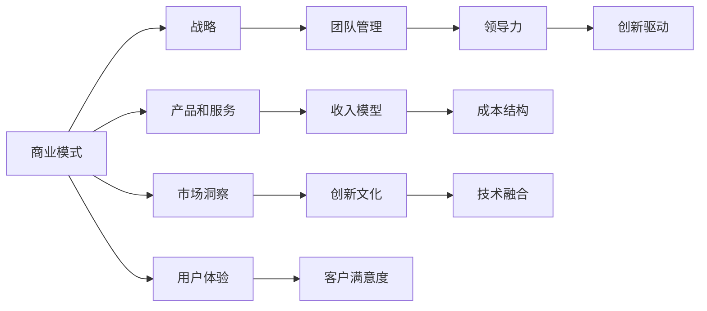

                 

# 从技术专家到企业家的转型

> 关键词：人工智能, 企业战略, 商业洞察, 团队管理, 创新思维, 文化建设

## 1. 背景介绍

### 1.1 问题由来

在数字化转型的浪潮中，技术专家转型为企业家正成为越来越多人的选择。然而，从技术专家的视角切换到企业家的视角，绝非易事。技术专家的思维模式与企业家的运营模式在许多方面存在根本性的差异，这使得许多技术专家在转型过程中感到困惑和挫败。

当前的技术专家面临着多重挑战：
- **技术依赖性**：技术专家通常对技术问题有深厚的理解和经验，但缺乏对商业环境的深入理解。
- **管理挑战**：技术专家往往擅长技术细节，但在团队管理和战略规划方面经验不足。
- **市场洞察力**：技术专家可能对市场需求和消费者行为缺乏敏锐的洞察力，难以准确把握机会。

本文将从技术专家的视角出发，探讨如何成功转型为企业家，实现从技术到商业的跨越。文章将涵盖以下几个核心方面：
- **从技术视角到商业视角的转变**：理解企业运营的底层逻辑。
- **构建战略思维**：制定符合市场需求的商业策略。
- **团队管理和领导力**：如何构建高效团队，发挥团队潜力。
- **商业洞察力**：提升市场洞察力和消费者理解能力。
- **创新思维和企业文化**：如何在竞争激烈的市场中保持创新活力。

## 2. 核心概念与联系

### 2.1 核心概念概述

本节将介绍几个关键的商业概念及其在转型过程中的作用：

- **商业模式（Business Model）**：企业提供的产品或服务，以及如何通过这些产品或服务获得收入的策略。
- **战略（Strategy）**：企业的长远目标和达成这些目标的路径。
- **市场洞察（Market Insight）**：对市场趋势、消费者需求、竞争环境等方面的深入理解。
- **团队管理（Team Management）**：建立和维护一个高效的团队，实现团队成员的最大潜力。
- **领导力（Leadership）**：引导团队实现共同目标的能力。
- **创新文化（Innovation Culture）**：鼓励和支持创新的企业文化。

这些概念之间存在紧密的联系，共同构成了一个企业家的全面视角。通过深入理解这些概念，技术专家可以更好地实现从技术到商业的转变。

### 2.2 核心概念原理和架构的 Mermaid 流程图



该流程图展示了商业模式的构建与其它核心概念之间的联系。商业模式是战略的起点，而市场洞察为战略提供依据。团队管理和领导力是战略执行的保障，创新文化则是推动创新和持续改进的动力。产品和服务、收入模型和成本结构是商业模式的具体组成部分，用户体验和客户满意度则是成功商业模式的最终体现。

## 3. 核心算法原理 & 具体操作步骤

### 3.1 算法原理概述

技术专家的转型涉及到从技术到商业的思维转换，这一转换类似于从单维度问题解决到多维度问题解决的转变。技术专家擅长解决单一的技术问题，而企业家则需要处理多维度、多利益相关者的复杂问题。

企业家视角的算法原理可以概括为以下三点：

1. **系统视角**：企业运营是一个复杂的系统，涉及到产品开发、市场营销、客户关系管理等多个子系统。企业家需要从系统视角理解这些子系统之间的关系和互动。

2. **动态视角**：企业运营环境是动态变化的，企业家需要不断调整策略以适应环境变化。动态视角要求企业家具备高度的灵活性和应变能力。

3. **多维度视角**：企业家需要综合考虑技术、市场、财务、人力资源等多个维度，以制定全面的战略和决策。

### 3.2 算法步骤详解

以下是对技术专家转型为企业家过程中，每个关键步骤的详细解读：

#### 3.2.1 理解商业模式

- **市场需求分析**：通过市场调研、用户访谈等方式，了解目标市场的需求和痛点。
- **竞争分析**：分析主要竞争对手的优势和劣势，确定自己的竞争策略。
- **收入模型设计**：设计合理的收入模型，确保盈利模式可持续。

#### 3.2.2 制定战略

- **目标设定**：明确企业的长期目标和短期目标。
- **路径规划**：制定实现目标的具体步骤和时间表。
- **资源分配**：合理分配资源，确保关键项目和领域的支持。

#### 3.2.3 构建团队

- **招聘与选拔**：根据团队需求，招聘合适的成员。
- **角色分配**：明确每个成员的职责和目标。
- **团队激励**：设计有效的激励机制，激发团队成员的潜力。

#### 3.2.4 提升市场洞察力

- **数据分析**：利用数据分析工具，深入挖掘市场趋势和消费者行为。
- **客户反馈**：建立客户反馈机制，快速响应客户需求。
- **竞争情报**：监控竞争对手动态，调整自身策略。

#### 3.2.5 提升领导力

- **沟通能力**：提高沟通技巧，有效传达愿景和策略。
- **决策能力**：培养快速、准确做出决策的能力。
- **团队协作**：促进团队成员之间的协作和互信。

#### 3.2.6 建设创新文化

- **鼓励创新**：建立开放的创新环境，鼓励新想法的提出和尝试。
- **资源投入**：在研发和技术创新上投入足够的资源。
- **持续改进**：不断改进产品和流程，保持竞争力。

### 3.3 算法优缺点

企业家视角的算法具有以下优点：

1. **系统性**：从系统视角理解企业运营，能够避免单一维度的片面性。
2. **动态性**：动态视角使得企业家能够灵活应对市场变化，保持竞争优势。
3. **多维度性**：多维度视角确保企业战略的全面性和可持续性。

然而，这种视角也存在一些缺点：

1. **复杂性**：处理多维度、多利益相关者的复杂问题，需要较高的思维能力和时间投入。
2. **不确定性**：市场环境的不确定性增加了战略制定和执行的难度。
3. **资源需求**：需要更多的资源和投入来支持系统性、动态性和多维度视角的实现。

### 3.4 算法应用领域

企业家视角的算法原理和操作步骤适用于各种商业环境，无论是在初创企业还是成熟企业，都能帮助企业家更好地理解和管理企业运营。

- **初创企业**：通过理解商业模式和市场洞察，制定有效的市场进入策略，建立高效的团队，推动创新。
- **成熟企业**：通过优化战略和资源分配，提升市场洞察力，保持领先地位，应对市场变化。

## 4. 数学模型和公式 & 详细讲解 & 举例说明

### 4.1 数学模型构建

为了更好地理解企业家视角的算法原理，本节将通过数学模型来描述企业的运营过程。

假设企业运营的各个子系统可以表示为 $S=\{S_1, S_2, ..., S_n\}$，其中 $S_i$ 表示第 $i$ 个子系统。每个子系统都有一个状态 $s_i$，表示系统的当前状态。企业运营的目标是最大化系统总收益 $R$，最小化总成本 $C$。

企业运营的动态过程可以表示为：

$$
s_{i+1} = f(s_i, p_i, e_i)
$$

其中 $f$ 表示子系统的状态转移函数，$p_i$ 表示影响子系统的外部因素，$e_i$ 表示内部扰动。

### 4.2 公式推导过程

通过上述模型，我们可以推导出企业运营的优化问题。目标函数为：

$$
\max_{s_1, s_2, ..., s_n} R(s_1, s_2, ..., s_n) - C(s_1, s_2, ..., s_n)
$$

约束条件为：

$$
s_{i+1} = f(s_i, p_i, e_i), \quad i=1, 2, ..., n
$$

在实际应用中，我们可以通过优化算法（如线性规划、动态规划等）求解上述优化问题，得到最优的子系统状态。

### 4.3 案例分析与讲解

以一个初创企业的市场进入策略为例，假设该企业计划进入一个新市场 $M$。我们需要分析以下问题：

- 目标市场 $M$ 的需求和痛点是什么？
- 竞争对手 $C$ 的优势和劣势是什么？
- 企业的核心竞争力和市场定位是什么？
- 如何制定市场进入策略，确保盈利？

我们可以通过以下步骤进行分析和决策：

1. **市场调研**：通过问卷调查、访谈等方式，了解目标市场 $M$ 的需求和痛点。
2. **竞争分析**：收集竞争对手 $C$ 的产品、市场策略、用户反馈等信息，分析其优势和劣势。
3. **SWOT分析**：进行企业自身的SWOT分析，明确优势、劣势、机会和威胁。
4. **市场定位**：根据SWOT分析结果，确定企业的市场定位和差异化策略。
5. **市场进入策略**：设计有效的市场进入策略，确保盈利和市场份额。

## 5. 项目实践：代码实例和详细解释说明

### 5.1 开发环境搭建

在进行企业家视角算法的项目实践时，需要搭建一个包含数据分析、市场调研、团队管理、战略规划等模块的开发环境。以下是一些关键工具和平台的推荐：

- **数据分析工具**：Python的Pandas、NumPy、SciPy等库，用于处理和分析数据。
- **市场调研工具**：问卷平台SurveyMonkey，用于收集用户反馈和市场调研数据。
- **项目管理工具**：JIRA、Trello等，用于任务分配和进度跟踪。
- **沟通协作工具**：Slack、Microsoft Teams等，用于团队沟通和协作。

### 5.2 源代码详细实现

以下是一个简单的初创企业市场进入策略分析的Python代码实现：

```python
import pandas as pd
from sklearn.cluster import KMeans
from sklearn.decomposition import PCA

# 市场调研数据
data = pd.read_csv('market调研数据.csv')

# 分析市场需求
def analyze_demand(data):
    # 计算市场需求量
    demand = data['需求量'].mean()
    return demand

# 分析竞争态势
def analyze_competition(data):
    # 计算竞争对手的市场份额
    competition_share = data['市场份额'].mean()
    return competition_share

# 分析自身优势和劣势
def analyze_ourselves(data):
    # 计算企业的核心竞争力
    core_competence = data['核心竞争力'].mean()
    return core_competence

# 制定市场进入策略
def market_entry_strategy(demand, competition_share, core_competence):
    # 确定市场进入策略
    if demand > competition_share and core_competence > 0:
        return '进入市场'
    else:
        return '不进入市场'

# 主函数
def main():
    # 市场调研数据
    demand = analyze_demand(data)
    competition_share = analyze_competition(data)
    core_competence = analyze_ourselves(data)
    strategy = market_entry_strategy(demand, competition_share, core_competence)
    print(f'市场进入策略：{strategy}')

if __name__ == '__main__':
    main()
```

### 5.3 代码解读与分析

上述代码展示了如何使用Python进行市场调研数据的分析，并基于分析结果制定市场进入策略。

- `analyze_demand` 函数计算市场需求量。
- `analyze_competition` 函数计算竞争对手的市场份额。
- `analyze_ourselves` 函数计算企业的核心竞争力。
- `market_entry_strategy` 函数根据市场需求、竞争态势和核心竞争力，制定市场进入策略。
- `main` 函数调用这些函数，输出市场进入策略。

### 5.4 运行结果展示

运行上述代码，输出市场进入策略。如果市场需求大于竞争对手市场份额且企业核心竞争力强，则输出“进入市场”；否则输出“不进入市场”。

## 6. 实际应用场景

### 6.1 智能制造

在智能制造领域，技术专家可以转型为企业家，建立智能制造解决方案提供商。通过理解市场需求和痛点，制定有效的市场进入策略，构建高效的团队，推动创新，实现智能制造的全面应用。

例如，某技术专家转型为企业家后，发现很多制造业企业希望通过智能化升级提高生产效率。他利用自身技术优势，开发了一套智能制造系统，通过数据分析和机器学习技术，帮助企业优化生产流程，提升产品质量。该系统在市场上取得了成功，帮助企业在竞争激烈的市场中保持领先地位。

### 6.2 健康科技

在健康科技领域，技术专家可以转型为企业家，开发健康科技产品和服务。通过深入理解消费者需求和健康领域的趋势，制定有效的市场策略，构建高效的团队，推动创新，实现健康科技的广泛应用。

例如，某技术专家转型为企业家后，发现远程医疗市场潜力巨大。他利用自身技术优势，开发了一款远程医疗平台，通过大数据分析和自然语言处理技术，为医生和患者提供便捷、高效的医疗服务。该平台在市场上取得了成功，帮助患者获得更好的医疗服务，同时为医生提供了新的诊疗工具。

### 6.3 教育科技

在教育科技领域，技术专家可以转型为企业家，开发教育科技产品和服务。通过深入理解学生和教师的需求，制定有效的市场策略，构建高效的团队，推动创新，实现教育科技的广泛应用。

例如，某技术专家转型为企业家后，发现在线教育市场增长迅速。他利用自身技术优势，开发了一款智能教育平台，通过自然语言处理和机器学习技术，为学生提供个性化的学习方案，为教师提供高效的课堂管理工具。该平台在市场上取得了成功，帮助学生和教师提高学习效率，提升了教育质量。

## 7. 工具和资源推荐

### 7.1 学习资源推荐

为了帮助技术专家更好地理解企业家视角，本节推荐一些优质的学习资源：

- **《从0到1》（Eric Ries）**：这是一本经典的创业书籍，介绍了从0到1的创业过程和策略。
- **《精益创业》（Eric Ries）**：讲述了精益创业的方法和工具，帮助创业者快速验证商业模式和产品。
- **《商业模式画布》（Alex Osterwalder）**：介绍了商业模式画布工具，帮助创业者系统分析市场需求和竞争态势。
- **Coursera和edX上的创业课程**：这些平台提供了丰富的创业课程，涵盖从商业模式设计到市场运营的各个方面。

### 7.2 开发工具推荐

在企业家视角的项目实践中，选择合适的开发工具可以大幅提升效率和质量。以下是一些推荐的工具：

- **项目管理工具**：Asana、Notion等，用于任务分配和进度跟踪。
- **数据分析工具**：Tableau、Power BI等，用于数据可视化。
- **协作工具**：Slack、Microsoft Teams等，用于团队沟通和协作。
- **文档管理工具**：Confluence、Google Docs等，用于知识共享和项目管理。

### 7.3 相关论文推荐

企业家视角的算法原理涉及多个学科领域的知识，以下是一些相关的经典论文：

- **《创业：公司起源与演化》（Rumelt）**：探讨了创业公司的起源和演化过程。
- **《商业模式：企业设计的策略方法》（Osterwalder）**：介绍了商业模式画布工具的设计方法和应用。
- **《精益创业方法》（Ries）**：讲述了精益创业的方法和工具，帮助创业者快速验证商业模式和产品。

## 8. 总结：未来发展趋势与挑战

### 8.1 研究成果总结

本文系统探讨了技术专家转型为企业家过程中所需掌握的核心概念和操作步骤。通过理解商业模式、战略、市场洞察、团队管理、领导力、创新文化等多个维度，技术专家可以更好地从技术到商业进行转变。

### 8.2 未来发展趋势

技术专家的转型将带来以下发展趋势：

1. **技术融合**：未来的企业家将更加重视技术的应用，利用先进的技术手段提升企业的竞争力。
2. **跨界合作**：不同领域的技术专家将更加容易跨越行业边界，开展跨界合作，推动创新。
3. **数据驱动**：数据驱动将成为企业决策的重要依据，企业家将更加重视数据分析和应用。
4. **人工智能**：AI技术将深入应用到各个行业，帮助企业家实现更加智能化的运营。
5. **可持续发展**：企业家将更加注重企业的可持续发展，关注环境、社会和治理（ESG）问题。

### 8.3 面临的挑战

尽管企业家视角的算法原理为技术专家转型提供了指导，但在实际操作中仍面临一些挑战：

1. **时间管理**：技术专家转型需要投入大量时间和精力，如何平衡技术工作与新角色的任务，是的一大挑战。
2. **技能缺失**：从技术专家转型为企业家，需要掌握多种技能，如市场分析、战略规划、团队管理等，技能缺失可能导致决策失误。
3. **心理调整**：从技术专家的单维度问题解决到企业家的多维度问题解决，心理调整和角色适应需要时间。
4. **资源有限**：初创企业在资源方面有限，如何在有限的资源下实现高效运营，是企业家面临的现实问题。
5. **市场竞争**：激烈的市场竞争要求企业家具备高度的应变能力和创新能力，适应市场变化。

### 8.4 研究展望

未来，技术专家的转型将更多地关注以下方面：

1. **技术赋能**：利用先进的技术手段，提高企业的运营效率和竞争力。
2. **跨领域合作**：不同领域的技术专家将更加容易跨越行业边界，开展跨界合作，推动创新。
3. **数据驱动决策**：数据驱动将成为企业决策的重要依据，企业家将更加重视数据分析和应用。
4. **AI与创业结合**：AI技术将深入应用到各个行业，帮助企业家实现更加智能化的运营。
5. **可持续发展**：企业家将更加注重企业的可持续发展，关注环境、社会和治理（ESG）问题。

## 9. 附录：常见问题与解答

### 9.1 Q1：如何选择合适的市场进入策略？

A: 选择合适的市场进入策略需要考虑市场需求、竞争态势、自身优势等多个因素。可以通过SWOT分析、竞争情报分析等方法，全面了解市场环境，制定合适的市场进入策略。

### 9.2 Q2：如何构建高效的团队？

A: 构建高效的团队需要明确团队目标、合理分配角色、建立有效的沟通机制、制定激励机制等。可以通过团队建设、培训、反馈等手段，提升团队成员的协作能力和工作效率。

### 9.3 Q3：如何提升市场洞察力？

A: 提升市场洞察力需要利用数据分析工具，深入挖掘市场趋势和消费者行为。可以通过问卷调查、用户访谈等方式，收集市场数据，进行分析和预测。

### 9.4 Q4：如何提升领导力？

A: 提升领导力需要不断学习和实践，掌握有效的沟通技巧、决策能力和团队协作技巧。可以通过阅读相关书籍、参加领导力培训、实践管理经验等，提升自己的领导力。

### 9.5 Q5：如何保持创新活力？

A: 保持创新活力需要建立开放的创新环境，鼓励新想法的提出和尝试。可以通过设立创新基金、举办创新大赛、建立创新实验室等方式，激发团队的创新热情。

---

作者：禅与计算机程序设计艺术 / Zen and the Art of Computer Programming

