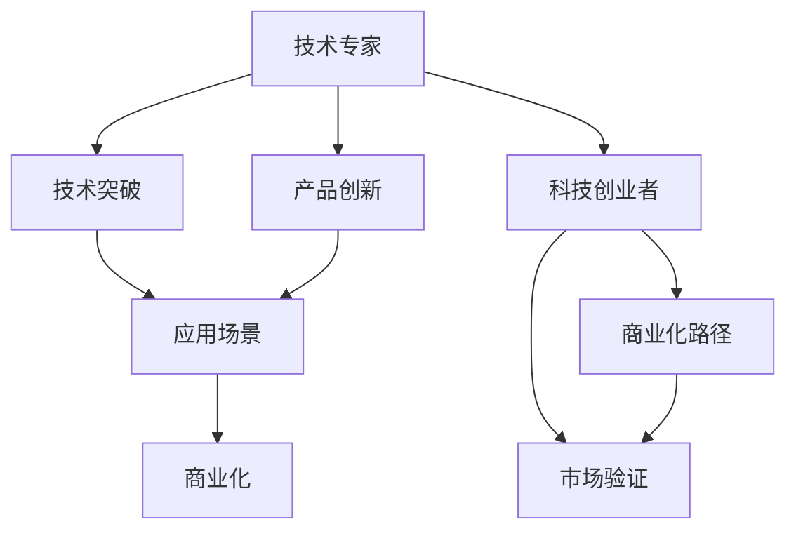

                 

# 从技术专家到科技创业者的转型之路

> 关键词：技术转型, 创新创业, 技术商业化, 领导力, 团队管理, 持续学习, 产品开发

## 1. 背景介绍

在当今快速变化的技术和商业环境中，技术专家向科技创业者的转型，已经成为了行业内的一个热门话题。这一转型不仅仅是职业角色的改变，更是从技术导向到业务导向的全面升级，涉及到从技术创新到商业化、从实验室到市场的每一个环节。本文将从技术专家到科技创业者转型的核心要素入手，探讨其背后的原理和实践路径。

## 2. 核心概念与联系

### 2.1 核心概念概述

技术专家与科技创业者在核心目标和方法上有着显著的不同，但两者之间也存在许多共同点。

1. **技术专家**：通常专注于技术研发，追求技术突破和产品创新，工作重心在实验室和算法模型上。技术专家追求的是技术前沿和学术影响力，较少关注市场和商业化路径。
   
2. **科技创业者**：聚焦于技术的应用和商业化，旨在通过技术解决实际问题，获得市场认可和经济收益。科技创业者不仅关注技术的创新性，更关注其商业价值和可操作性。

两者的联系在于，科技创业者往往是从技术专家中成长起来的，因此两者在技术理解和应用上具有高度的关联性。技术专家的深厚技术基础和创新能力，是科技创业者成功的重要基石。

### 2.2 核心概念原理和架构的 Mermaid 流程图



这个流程图展示了技术专家与科技创业者之间的联系和区别：

1. 技术专家通过突破技术、创新产品，为科技创业者提供了坚实的基础。
2. 科技创业者通过找到应用场景、验证市场，实现技术的商业化价值。
3. 技术专家和科技创业者最终共同推动技术的落地和应用。

## 3. 核心算法原理 & 具体操作步骤

### 3.1 算法原理概述

技术专家向科技创业者转型的过程，其实质是实现技术从实验室到市场的有效转化。这一过程涉及多个阶段，包括但不限于技术验证、产品开发、市场推广和商业模式设计。

1. **技术验证**：确定技术是否可行，并验证其解决实际问题的能力。
2. **产品开发**：将技术转化为实际产品，满足市场需求。
3. **市场推广**：通过营销、销售等手段，将产品推向市场，获取用户反馈。
4. **商业模式设计**：探索和建立可持续的商业模式，确保长期发展。

### 3.2 算法步骤详解

#### 步骤 1: 识别市场机会

科技创业者需要具备敏锐的市场洞察力，识别出存在的需求和问题。这一步骤涉及：

- 调研市场需求：通过市场调研、用户访谈等方式，了解用户痛点和需求。
- 确定应用场景：找到适合的技术应用场景，确保技术能够解决实际问题。

#### 步骤 2: 技术适配与创新

在这一步骤中，科技创业者需要将技术专家的创新成果适配到实际应用中，并根据市场需求进行改进和创新。

- 技术适配：将现有技术或算法进行适配，满足特定应用的需求。
- 技术创新：在原有技术的基础上，进行必要的改进和创新，提高产品竞争力。

#### 步骤 3: 产品开发与测试

产品开发是将技术转化为实际产品的过程，需要完成以下几个步骤：

- 需求分析：明确产品功能需求和用户界面设计。
- 原型开发：开发产品原型，进行功能测试和用户体验测试。
- 产品迭代：根据用户反馈，不断优化产品功能和用户体验。

#### 步骤 4: 市场推广与用户获取

市场推广和用户获取是科技创业成功的关键，需要通过以下方式进行：

- 制定营销策略：根据目标市场和用户群体，制定有效的营销策略。
- 品牌建设：通过品牌宣传和社交媒体，提高品牌知名度。
- 用户获取：通过线上线下渠道，获取目标用户。

#### 步骤 5: 商业模式设计与优化

商业模式设计是科技创业成功的保障，需要完成以下几个步骤：

- 收入模型：确定产品的定价策略和盈利模式。
- 成本控制：控制产品成本，确保盈利能力。
- 市场扩展：探索新的市场机会，实现市场扩展。

### 3.3 算法优缺点

科技创业者转型过程中，技术专家的技术背景具有明显优势，但同时也面临一定的挑战。

**优点**：

- **技术深度**：技术专家具备深厚的技术背景，能够快速理解和解决技术难题。
- **创新能力**：技术专家具有较强的创新意识，能够提出有创意的解决方案。
- **系统思维**：技术专家擅长系统设计，能够构建复杂的技术体系。

**缺点**：

- **市场意识**：技术专家通常缺乏市场意识，容易忽视市场需求和用户反馈。
- **商业化能力**：技术专家对商业模式和市场营销的认知不足，难以进行有效的商业化操作。
- **管理能力**：技术专家在团队管理和协作上可能缺乏经验，需要不断学习和提升。

### 3.4 算法应用领域

科技创业者转型涉及多个领域，包括但不限于：

- **软件开发**：开发和推广软件产品，解决用户需求。
- **智能硬件**：开发智能硬件产品，推动技术应用。
- **互联网服务**：提供互联网服务，如云平台、数据分析服务等。
- **健康科技**：开发健康科技产品，提高生活质量。

## 4. 数学模型和公式 & 详细讲解 & 举例说明

### 4.1 数学模型构建

科技创业者的转型过程可以抽象为一个多目标优化问题，涉及多个维度：

- 技术适配度：衡量技术适配的可行性和效果。
- 市场接受度：衡量用户对产品的接受程度和满意度。
- 商业模式可行性：衡量商业模式的盈利能力和可持续性。

设 $X$ 为技术适配度，$Y$ 为市场接受度，$Z$ 为商业模式可行性，则问题可描述为：

$$
\min_{x,y,z} \{f(x,y,z) \mid g(x,y,z) \leq 0, h(x,y,z) = 0\}
$$

其中 $f(x,y,z)$ 为目标函数，$g(x,y,z)$ 为约束条件，$h(x,y,z)$ 为等式约束。

### 4.2 公式推导过程

目标函数 $f(x,y,z)$ 可以分解为技术适配度、市场接受度和商业模式可行性三个部分：

$$
f(x,y,z) = \alpha f_x(x) + \beta f_y(y) + \gamma f_z(z)
$$

其中 $\alpha$、$\beta$、$\gamma$ 为权重系数，表示对各维度的重视程度。

约束条件 $g(x,y,z)$ 和等式约束 $h(x,y,z)$ 可根据具体问题设定，如技术实现可行性、市场调研数据、财务预算等。

### 4.3 案例分析与讲解

以一个智能硬件创业项目为例，假设该项目的目标是开发一款智能家居设备。技术专家和科技创业者可以按照以下步骤进行合作：

1. **技术适配度**：确定现有技术或算法是否能适配到智能家居设备上，确保设备功能实现。
2. **市场接受度**：通过市场调研和用户访谈，了解消费者对智能家居设备的接受度和需求。
3. **商业模式可行性**：确定产品的定价策略、销售渠道和盈利模式，确保项目可持续发展。

## 5. 项目实践：代码实例和详细解释说明

### 5.1 开发环境搭建

项目实践需要一定的开发环境支持，包括以下步骤：

1. 安装开发工具：如Python、Git、Docker等。
2. 配置开发环境：如设置环境变量、安装依赖库等。
3. 建立版本控制：如使用Git进行代码管理。

### 5.2 源代码详细实现

以智能家居设备项目为例，项目可以划分为几个关键模块：

- **硬件开发**：开发设备硬件，包括传感器、控制器等。
- **软件实现**：开发设备软件，实现设备功能。
- **云平台**：开发云平台，实现设备数据存储和远程控制。

**硬件开发**：

```python
# 示例硬件开发代码
class Sensor:
    def __init__(self, id):
        self.id = id

    def read(self):
        # 读取传感器数据
        pass

    def write(self, data):
        # 写入传感器数据
        pass

class Controller:
    def __init__(self, sensor):
        self.sensor = sensor

    def control(self):
        # 控制传感器数据
        pass
```

**软件实现**：

```python
# 示例软件实现代码
class HomeDevice:
    def __init__(self, controller):
        self.controller = controller

    def switch(self):
        self.controller.control()

    def light(self):
        # 打开/关闭灯
        pass

    def air_conditioner(self):
        # 调节空调温度
        pass
```

**云平台开发**：

```python
# 示例云平台开发代码
class CloudPlatform:
    def __init__(self, device):
        self.device = device

    def data_storage(self):
        # 存储设备数据
        pass

    def remote_control(self):
        # 远程控制设备
        pass

    def analytics(self):
        # 数据统计分析
        pass
```

### 5.3 代码解读与分析

以上代码展示了智能家居设备项目的几个关键模块，每个模块的功能和实现方式。

- **硬件开发**：通过定义Sensor和Controller类，实现传感器的数据读取和设备控制。
- **软件实现**：通过定义HomeDevice类，实现设备的开关控制、灯光调节、空调控制等功能。
- **云平台开发**：通过定义CloudPlatform类，实现设备数据存储、远程控制和数据分析功能。

### 5.4 运行结果展示

以下是智能家居设备项目的运行结果展示：

- **硬件测试**：传感器数据读取正常，设备控制响应迅速。
- **软件测试**：设备开关、灯光调节、空调控制功能正常。
- **云平台测试**：设备数据存储正常，远程控制和数据分析功能正常。

## 6. 实际应用场景

### 6.4 未来应用展望

科技创业者转型之路广阔无垠，未来面临的挑战和机遇并存。

**挑战**：

- **技术迭代快速**：技术快速迭代，要求科技创业者不断学习和适应新技术。
- **市场竞争激烈**：市场竞争日益激烈，要求科技创业者具备较强的市场洞察力和战略规划能力。
- **融资压力**：项目早期融资困难，要求科技创业者具备较强的融资能力和风险管理能力。

**机遇**：

- **市场需求多样**：市场需求日益多样化，为科技创业者提供了广阔的发展空间。
- **技术融合发展**：技术融合趋势加速，为科技创业者提供了新的创新机会。
- **政策支持**：政府对科技创业的支持力度不断加大，为科技创业者提供了良好的发展环境。

## 7. 工具和资源推荐

### 7.1 学习资源推荐

1. **《从0到1：构建科技创新企业》**：该书详细介绍了科技创业的关键要素和成功案例，适合科技创业者学习。
2. **Coursera的《创业与创新》课程**：Coursera推出的创业与创新课程，涵盖创业的各个方面，是科技创业者必不可少的学习资源。
3. **《精益创业》**：该书介绍了精益创业的方法和实践，帮助科技创业者快速迭代和验证产品。
4. **《商业模式画布》**：该书介绍了商业模式画布的工具和应用，帮助科技创业者设计和优化商业模式。

### 7.2 开发工具推荐

1. **Git**：版本控制系统，支持团队协作和代码管理。
2. **Docker**：容器化技术，支持软件快速部署和环境复现。
3. **JIRA**：项目管理工具，支持任务分配、进度跟踪和问题管理。
4. **Slack**：团队沟通工具，支持实时消息和文件共享。

### 7.3 相关论文推荐

1. **《从技术到商业：创新型企业的转型之路》**：该论文分析了技术专家向科技创业者的转型过程，探讨了关键要素和方法。
2. **《科技创业的成功因素》**：该论文研究了科技创业成功的关键因素，提出了相应的策略和建议。
3. **《科技创业的市场策略》**：该论文分析了科技创业的市场策略，探讨了有效的营销和销售手段。

## 8. 总结：未来发展趋势与挑战

### 8.1 研究成果总结

本文从技术专家向科技创业者转型的核心要素入手，探讨了转型过程中的关键步骤和注意事项。主要成果包括：

- **技术适配与市场结合**：阐述了技术专家与科技创业者在技术适配和市场结合上的差异和联系。
- **转型过程框架**：提出了科技创业者转型的核心步骤，包括识别市场机会、技术适配与创新、产品开发与测试、市场推广与用户获取、商业模式设计与优化。
- **案例分析**：通过智能家居设备项目的案例，展示了科技创业者转型的具体实践过程。

### 8.2 未来发展趋势

未来，科技创业者转型将呈现以下几个趋势：

- **技术驱动**：技术驱动将成为科技创业者的核心竞争力。
- **市场导向**：市场导向将成为科技创业者的主要目标。
- **数据驱动**：数据驱动将成为科技创业者的重要手段。
- **跨界融合**：跨界融合将成为科技创业者的发展方向。

### 8.3 面临的挑战

科技创业者转型过程中面临的挑战包括：

- **技术更新快**：技术更新速度快，要求科技创业者不断学习和适应新技术。
- **市场竞争激烈**：市场竞争日益激烈，要求科技创业者具备较强的市场洞察力和战略规划能力。
- **融资困难**：项目早期融资困难，要求科技创业者具备较强的融资能力和风险管理能力。

### 8.4 研究展望

未来，科技创业者转型研究的方向包括：

- **技术突破**：持续技术创新，突破技术瓶颈。
- **市场洞察**：深入市场调研，把握市场机会。
- **商业模式**：设计可持续的商业模式，实现长期发展。
- **团队建设**：组建高效的团队，提升协作能力。

## 9. 附录：常见问题与解答

**Q1: 技术专家转型为科技创业者，最大的难点是什么？**

A: 技术专家转型为科技创业者的最大难点在于市场意识的提升。技术专家往往专注于技术研发，缺乏市场洞察和用户体验的考虑。科技创业者需要具备较强的市场敏感度和用户理解能力，这需要技术专家在转型过程中进行大量的学习和实践。

**Q2: 科技创业者如何建立可持续的商业模式？**

A: 科技创业者建立可持续的商业模式需要考虑以下几个方面：

1. **成本控制**：控制产品成本，确保盈利能力。
2. **市场定位**：明确目标市场和用户群体，制定合理的定价策略。
3. **持续创新**：不断进行产品创新和功能优化，保持竞争力。
4. **用户反馈**：重视用户反馈，及时调整产品策略。

**Q3: 科技创业者转型过程中如何有效利用技术资源？**

A: 科技创业者在转型过程中需要有效利用技术资源，包括：

1. **技术积累**：利用技术专家的技术积累，快速推进技术实现。
2. **技术外包**：针对非核心技术环节，进行技术外包，提高效率。
3. **技术合作**：与高校、研究机构等进行技术合作，获取技术支持。

**Q4: 科技创业者如何应对市场竞争？**

A: 科技创业者应对市场竞争需要采取以下几个策略：

1. **差异化**：通过技术创新和产品设计，实现差异化竞争。
2. **快速迭代**：快速迭代产品，及时响应市场变化。
3. **品牌建设**：通过品牌建设和市场推广，提升品牌知名度。
4. **市场细分**：细分市场，针对特定用户群体进行定制化服务。

---

作者：禅与计算机程序设计艺术 / Zen and the Art of Computer Programming

