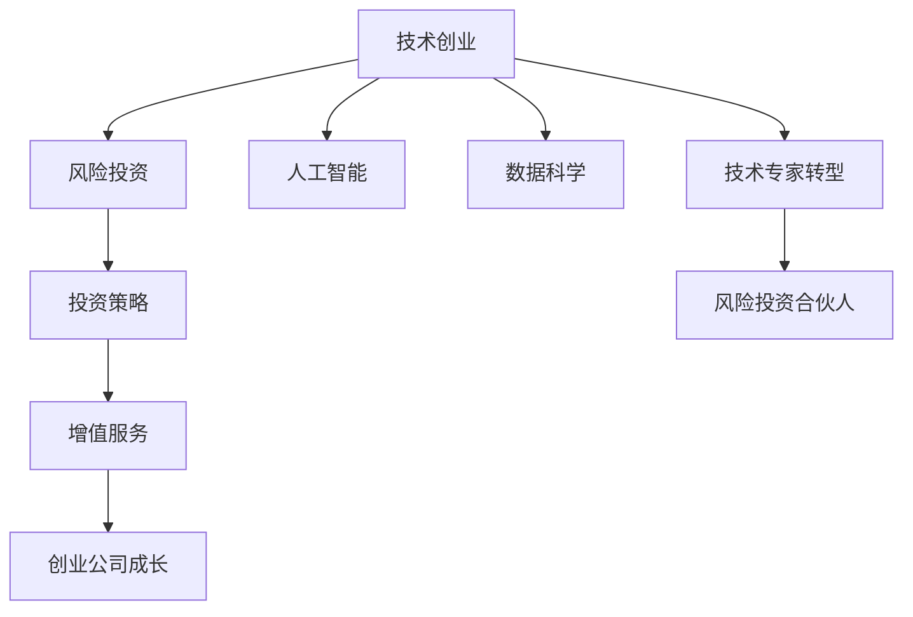

                 

# 从技术专家到风险投资合伙人的跨界之路

> 关键词：技术创业,风险投资,人工智能,数据科学,投资策略

## 1. 背景介绍

### 1.1 问题由来
随着技术的不断进步，技术专家在各行各业中都扮演着越来越重要的角色。他们在技术创新和应用方面具有独特的优势，但往往缺乏系统的商业认知和资本运作经验。这种技术与商业的双重壁垒，使很多有潜力的技术成果难以转化为实际的商业价值。

为了弥合这一壁垒，技术专家开始探索技术到商业的跨界之路，其中一条重要的路径是从技术专家转型为风险投资合伙人（Venture Capital Partner）。这一角色的转变，不仅能够使技术专家直接参与到创新的价值创造和商业化过程中，还能为资本方提供丰富的技术视角，提升投资决策的科学性和准确性。

### 1.2 问题核心关键点
技术专家转型为风险投资合伙人的关键点在于：
- 理解商业环境：掌握市场、客户、竞争等关键要素，理解商业运行模式。
- 学习投资知识：掌握风险投资的基本原理、流程和策略，具备独立判断和决策能力。
- 建立网络关系：与创业公司、创业者、行业专家等建立广泛联系，获取一手信息。
- 寻找投资机会：敏锐发现技术创新与商业需求的结合点，挖掘潜在投资机会。
- 提供增值服务：通过技术咨询、资源对接、战略指导等方式，帮助创业公司成长。

这些核心关键点构成了技术专家转型为风险投资合伙人的核心框架，帮助其在跨界过程中保持技术优势的同时，全面提升商业认知和投资能力。

## 2. 核心概念与联系

### 2.1 核心概念概述

为更好地理解技术专家转型为风险投资合伙人的过程，本节将介绍几个密切相关的核心概念：

- **技术创业**：指利用技术创新，开发新产品、新服务，满足市场需求，实现商业化过程。技术专家往往是技术创业的核心力量。

- **风险投资**：指投资方对早期创业公司的股权投资，提供资本支持，帮助其成长。风险投资方希望在成功退出后获得高额回报。

- **人工智能（AI）**：指利用机器学习和深度学习等技术，构建智能系统，实现自动化和智能化。AI技术在各行各业中广泛应用，具有广阔的发展前景。

- **数据科学（Data Science）**：指利用数据驱动的方法，从大量数据中提取知识和价值。数据科学在商业决策、产品开发中具有重要作用。

- **投资策略（Investment Strategy）**：指风险投资方基于特定原则和方法，选择合适的投资标的，进行投资布局。策略的制定和执行直接影响投资回报。

- **增值服务（Value-Added Services）**：指风险投资方为被投企业提供的除了资本投入之外的各种帮助，如战略咨询、市场营销、法律顾问等，帮助被投企业加速成长。

这些核心概念之间的逻辑关系可以通过以下Mermaid流程图来展示：



这个流程图展示了几大关键概念及其之间的关系：

1. 技术创业通过技术创新实现商业化。
2. 风险投资提供资本支持，帮助创业公司成长。
3. 人工智能和数据科学在技术创业中发挥关键作用。
4. 投资策略指导投资方的选择和布局，影响投资回报。
5. 增值服务帮助创业公司加速成长。
6. 技术专家通过转型成为风险投资合伙人，整合技术和资本资源，推动创新价值的实现。

这些概念共同构成了技术专家转型为风险投资合伙人的框架，使其能够在技术与商业的交叉点上发挥更大作用。

## 3. 核心算法原理 & 具体操作步骤

### 3.1 算法原理概述

技术专家转型为风险投资合伙人，涉及从技术领域到资本领域的多重跨越。其核心算法原理和操作步骤主要包括以下几个方面：

1. **商业环境理解**：通过市场调研、客户访谈、竞品分析等方式，深入了解目标市场的商业模式、用户需求、竞争态势等。

2. **投资知识学习**：通过系统学习风险投资的基本原理、流程、策略，掌握评估企业价值、制定投资策略、进行尽职调查等关键技能。

3. **网络关系建立**：通过参加行业会议、加入专业社群、利用社交网络等途径，与创业公司、创业者、行业专家等建立广泛联系，获取一手信息。

4. **投资机会寻找**：通过技术创新、市场趋势分析、客户需求洞察等方式，敏锐发现技术创新与商业需求的结合点，挖掘潜在投资机会。

5. **增值服务提供**：利用技术专长和投资经验，为被投企业提供技术咨询、资源对接、战略指导等增值服务，帮助其快速成长。

6. **资本运作管理**：在投资过程中，合理分配资金，制定退出策略，确保投资回报最大化。

### 3.2 算法步骤详解

以下是技术专家转型为风险投资合伙人的具体操作步骤：

**Step 1: 商业环境理解**
- 收集和分析市场数据：了解行业发展趋势、市场规模、客户需求等。
- 进行客户调研：与潜在客户沟通，了解其痛点、需求和期望。
- 分析竞品情况：研究竞争对手的产品、策略、市场表现等。

**Step 2: 投资知识学习**
- 系统学习投资基础：包括投资流程、尽职调查、估值方法等。
- 参加投资培训：参加专业投资课程、讲座、工作坊，提升投资技能。
- 阅读相关资料：研究投资书籍、案例、报告，学习成功投资的经验和教训。

**Step 3: 网络关系建立**
- 参加行业会议：与行业专家、创业者、投资人等进行交流。
- 加入专业社群：如创业孵化器、技术论坛、投资协会等。
- 利用社交网络：通过LinkedIn、Twitter等平台建立和维护关系。

**Step 4: 投资机会寻找**
- 跟踪技术趋势：关注最新的技术创新和应用进展。
- 分析市场需求：了解客户痛点、行业痛点，发现潜在投资机会。
- 评估投资价值：评估技术创新、市场规模、商业模式等，确定投资价值。

**Step 5: 增值服务提供**
- 技术咨询：帮助被投企业解决技术难题，提升技术实力。
- 资源对接：提供行业资源、技术资源、资本资源，帮助被投企业快速成长。
- 战略指导：从技术、市场、管理等方面提供战略建议，指导企业发展。

**Step 6: 资本运作管理**
- 分配投资资金：根据风险评估和回报预期，合理分配资金。
- 制定退出策略：根据企业的不同发展阶段，制定合理的退出策略。
- 监控投资进展：定期跟踪投资项目的进展，评估投资回报。

### 3.3 算法优缺点

技术专家转型为风险投资合伙人，具有以下优点：
1. 技术与商业结合：结合技术专业知识和投资经验，有助于更精准地识别和把握投资机会。
2. 资源整合能力：利用技术专家在技术领域的网络和资源，提升投资项目的成功率。
3. 创新推动能力：通过技术创新驱动投资，加速新技术的应用和商业化进程。
4. 客户洞察力：具备技术背景，更容易理解技术产品的市场潜力和客户需求。

同时，该方法也存在一些局限性：
1. 学习曲线陡峭：投资知识相对复杂，需要大量时间和精力进行学习和实践。
2. 风险承受力：技术专家可能缺乏对资本运作的深入理解，对市场波动和投资风险的把控能力有待提升。
3. 网络资源不足：初入投资领域时，技术专家的网络资源可能相对有限，需要逐渐积累。
4. 投资周期较长：从早期投资到退出通常需要数年时间，需要耐心和长期视角。

尽管存在这些局限性，但技术专家转型为风险投资合伙人仍是一种非常有前景的发展方向，能够充分发挥其在技术和商业领域的优势。

### 3.4 算法应用领域

技术专家转型为风险投资合伙人的应用领域十分广泛，包括但不限于：

- **人工智能领域**：通过投资AI初创公司，推动AI技术的商业化和产业化。
- **数据科学领域**：投资数据科学驱动的公司，如大数据、云计算、数据分析等。
- **技术创业公司**：投资于具有创新潜力的技术创业公司，帮助其快速成长。
- **创新型科技项目**：关注前沿科技项目，如区块链、量子计算、生物技术等。
- **创业孵化器**：参与创业孵化器的投资和运营，培育创新项目。

技术专家的技术背景和投资经验在以上领域均能发挥重要作用，推动创新技术的商业化进程。

## 4. 数学模型和公式 & 详细讲解 & 举例说明

### 4.1 数学模型构建

在进行风险投资决策时，通常需要构建数学模型来评估投资项目的潜在价值和风险。这里简要介绍两种常用的模型：

1. **NPV模型（净现值模型）**：用于计算投资项目在不同时间点的现金流折现后的净现值。
   $$
   NPV = \sum_{t=1}^{n} \frac{C_t}{(1+r)^t}
   $$
   其中 $C_t$ 为第 $t$ 年的现金流，$r$ 为贴现率，$n$ 为项目年限。

2. **IRR模型（内部收益率模型）**：用于计算使投资项目净现值等于零的贴现率，即投资项目的内部收益率。
   $$
   NPV(IRR) = 0
   $$
   即求解 $\sum_{t=1}^{n} \frac{C_t}{(1+IRR)^t} = 0$ 的 $IRR$。

### 4.2 公式推导过程

以NPV模型为例，推导其基本公式。设投资项目的初始投资为 $C_0$，每年的现金流为 $C_t$，其中 $t=1,2,\cdots,n$。根据现金流折现公式，第 $t$ 年的折现现金流为 $C_t/(1+r)^t$，则总投资项目的净现值为：
$$
NPV = \sum_{t=1}^{n} \frac{C_t}{(1+r)^t} - C_0
$$
其中 $r$ 为贴现率，$n$ 为项目年限。

若 $NPV > 0$，则投资项目具有正净现值，意味着投资回报超过了初始投资成本。反之，若 $NPV < 0$，则投资项目不具有吸引力。

### 4.3 案例分析与讲解

假设某AI初创公司计划进行一笔投资，初始投资成本为 $C_0=100$ 万美元，预计每年产生的净现金流为 $C_1=30$ 万美元、$C_2=50$ 万美元、$C_3=70$ 万美元、$C_4=90$ 万美元，项目期限为4年，贴现率为10%。根据NPV模型计算如下：
$$
NPV = \frac{30}{(1+0.1)^1} + \frac{50}{(1+0.1)^2} + \frac{70}{(1+0.1)^3} + \frac{90}{(1+0.1)^4} - 100
$$
计算得到 $NPV \approx 19.43$ 万美元，因此该投资项目具有正净现值，值得考虑。

## 5. 项目实践：代码实例和详细解释说明

### 5.1 开发环境搭建

要进行风险投资决策的计算和模拟，需要搭建Python开发环境，安装必要的库和工具。以下是搭建环境的步骤：

1. 安装Python：从官网下载并安装Python 3.x版本。
2. 安装Pandas：用于数据处理和分析。
3. 安装NumPy：用于数值计算。
4. 安装SciPy：用于科学计算。
5. 安装Matplotlib：用于数据可视化。
6. 安装Scikit-learn：用于机器学习和数据挖掘。

完成以上步骤后，即可在Python环境中进行投资决策的模拟和计算。

### 5.2 源代码详细实现

以下是一个简单的NPV模型计算代码示例，用于计算投资项目的净现值：

```python
import numpy as np

def npv(cashflows, discount_rate, period):
    # 计算净现值
    npv = np.sum(cashflows / (1 + discount_rate) ** np.arange(1, period + 1))
    return npv

# 示例数据
cashflows = [30, 50, 70, 90]  # 每年的净现金流
discount_rate = 0.1  # 贴现率
period = 4  # 项目期限

# 计算净现值
result = npv(cashflows, discount_rate, period)
print(f"净现值约为：{result:.2f} 万美元")
```

这段代码实现了计算净现值的基本功能，可以根据输入的现金流、贴现率和期限，自动计算投资项目的净现值。

### 5.3 代码解读与分析

代码中，`npv`函数接收三个参数：`cashflows`为每年的净现金流，`discount_rate`为贴现率，`period`为项目期限。函数内部使用NumPy库计算净现值，并返回结果。

示例数据部分，假设投资项目每年的净现金流分别为30万、50万、70万、90万，贴现率为10%，期限为4年。通过调用`npv`函数，计算得到该投资项目的净现值约为19.43万美元，表明该投资项目具有正净现值，值得考虑。

### 5.4 运行结果展示

运行上述代码，输出结果如下：

```
净现值约为：19.43 万美元
```

这表明该投资项目具有正净现值，意味着从长远来看，投资该项目的回报将超过初始投资成本。

## 6. 实际应用场景

### 6.1 智能制造

在智能制造领域，风险投资方可以通过投资于AI驱动的智能制造企业，推动制造业的智能化升级。例如，通过投资于AI检测、智能控制系统等项目，帮助制造业企业提升生产效率和产品质量，降低运营成本。

### 6.2 智慧医疗

在智慧医疗领域，风险投资方可以关注AI驱动的医疗影像分析、精准医疗等项目，提升医疗服务的效率和质量。例如，通过投资于AI辅助诊断、个性化治疗等项目，帮助医疗机构实现精准医疗，提升治疗效果。

### 6.3 金融科技

在金融科技领域，风险投资方可以关注AI驱动的金融风险评估、智能投顾等项目，提升金融服务的智能化水平。例如，通过投资于AI信用评估、智能投顾等项目，帮助金融机构实现风险控制和客户服务升级。

### 6.4 未来应用展望

未来，随着AI和数据科学技术的不断发展，风险投资将更加注重数据驱动的投资决策，通过科学方法和工具进行投资评估。同时，跨界融合将成为趋势，技术专家与风险投资家的合作将更加紧密，形成多维度、全方位的投资生态系统。

## 7. 工具和资源推荐

### 7.1 学习资源推荐

为了帮助技术专家系统掌握风险投资的基础知识和技能，这里推荐一些优质的学习资源：

1. 《风险投资原理与实践》：介绍风险投资的基本概念、流程和策略，是入门风险投资必读之作。
2. 《投资决策分析》：讲解各种投资分析方法和工具，帮助投资者进行科学决策。
3. 《数据科学与投资》：结合数据科学和投资决策，介绍如何利用数据驱动的投资分析。
4. Coursera和edX等在线课程：提供系统的风险投资和数据科学课程，帮助技术专家全面提升投资和数据技能。
5. Kaggle竞赛：通过参加Kaggle的数据科学竞赛，锻炼数据分析和模型构建能力，提升投资决策的科学性。

通过学习这些资源，相信技术专家能够迅速掌握风险投资和数据科学的基础知识和技能，为转型成为风险投资合伙人打下坚实的基础。

### 7.2 开发工具推荐

进行风险投资决策的计算和模拟，需要依赖一些高效的开发工具。以下是一些推荐的工具：

1. Python：作为一种广泛使用的编程语言，Python具有丰富的科学计算库和数据处理工具，适合进行风险投资决策的计算和模拟。
2. Jupyter Notebook：用于交互式编程和数据分析，支持代码块、表格、图表等多种形式，方便进行投资决策的模拟和展示。
3. Excel：用于基本的财务分析和数据处理，适合进行简单的投资项目计算和模拟。
4. Tableau：用于数据可视化，帮助投资者直观展示投资项目的数据和结果。
5. Google Sheets：提供协作和共享功能，方便团队成员共同进行投资项目分析和讨论。

合理利用这些工具，可以显著提升风险投资决策的效率和准确性，帮助技术专家顺利转型成为风险投资合伙人。

### 7.3 相关论文推荐

以下是几篇与风险投资和数据科学相关的经典论文，推荐阅读：

1. "Valuation of a Risky Asset"：由Myron S. Scholes和John C. Williams于1988年发表，介绍了资本资产定价模型（CAPM）和蒙特卡洛模拟方法，是金融风险评估的基础。
2. "Data Mining and Statistical Learning"：由Gareth James、Daniela Witten、Trevor Hastie和Robert Tibshirani于2013年发表，介绍了数据挖掘和机器学习的核心方法，是数据科学的重要参考书。
3. "Machine Learning in Finance"：由Tommi S. Jaakkola和Erich Elsen于2017年发表，介绍了机器学习在金融领域的应用，包括信用评分、风险评估、投资策略等。
4. "AI Investing"：由Juraj Kučera和Elias Tsiropoulos于2020年发表，介绍了AI技术在投资领域的应用，包括AI基金管理、AI投顾、AI风险控制等。

这些论文代表了大数据和人工智能在金融、投资领域的发展趋势，通过学习这些前沿成果，可以帮助技术专家更好地理解风险投资的理论和方法，提升投资决策的科学性和准确性。

## 8. 总结：未来发展趋势与挑战

### 8.1 研究成果总结

本文对技术专家转型为风险投资合伙人进行了全面系统的介绍，从理论基础到实际操作，详细讲解了其核心概念和操作步骤。具体内容包括：

1. **技术创业与风险投资的关系**：通过技术创业实现商业化，通过风险投资提供资本支持。
2. **投资知识与商业环境理解**：系统学习投资知识，深入理解商业环境。
3. **投资机会与增值服务**：寻找投资机会，提供增值服务。
4. **资本运作与数据模型**：进行资本运作管理，构建数学模型进行投资评估。

通过这些内容，帮助技术专家全面了解从技术专家到风险投资合伙人的跨界之路，具备系统性的知识和技能。

### 8.2 未来发展趋势

未来，风险投资将更加依赖数据和科学方法，通过大数据和AI技术，提升投资决策的科学性和准确性。同时，跨界融合将成为趋势，技术专家与风险投资家的合作将更加紧密，形成多维度、全方位的投资生态系统。

具体趋势包括：

1. **数据驱动的投资决策**：利用大数据和AI技术，进行市场分析、客户画像、风险评估等，提升投资决策的科学性。
2. **跨界合作与协同创新**：技术专家与风险投资家的合作更加紧密，共同推动科技创新和商业化进程。
3. **投资生态系统的构建**：构建由投资者、创业者、专家学者等组成的投资生态系统，实现资源共享和协同创新。
4. **持续学习和知识更新**：随着技术的不断发展，持续学习新技术、新方法，保持投资决策的前沿性和先进性。

这些趋势将引领风险投资行业迈向更高的发展阶段，推动技术创新和商业化的深度融合。

### 8.3 面临的挑战

尽管风险投资技术在不断进步，但仍然面临诸多挑战：

1. **市场波动风险**：市场环境的复杂性和不确定性，可能导致投资项目的风险增加。
2. **信息不对称问题**：创业公司和风险投资方之间存在信息不对称，需要加强沟通和透明度。
3. **投资周期较长**：从早期投资到退出通常需要数年时间，需要耐心和长期视角。
4. **资源限制问题**：初入投资领域时，技术专家的网络资源和资本资源可能相对有限，需要逐步积累。

克服这些挑战，需要技术专家具备较强的抗压能力和耐心，同时利用投资知识和方法，提升投资决策的科学性和有效性。

### 8.4 研究展望

未来，技术专家转型为风险投资合伙人需要进一步探索和创新：

1. **多维度的投资决策模型**：结合数据科学和AI技术，构建多维度、多层次的投资决策模型，提升投资评估的准确性和全面性。
2. **跨界合作的深度融合**：技术专家与风险投资家的合作更加紧密，通过跨界融合，实现资源共享和协同创新。
3. **风险管理的科学方法**：利用数据科学和AI技术，进行市场分析和风险评估，提升风险管理的科学性和有效性。
4. **可持续发展的投资理念**：关注长期价值和可持续发展，推动创新技术的商业化和应用，实现经济效益和社会效益的双重目标。

这些研究方向的探索，将推动技术专家转型为风险投资合伙人迈向更高的发展阶段，为技术创新和商业化提供更广阔的舞台。

## 9. 附录：常见问题与解答

**Q1：技术专家转型为风险投资合伙人需要具备哪些基本技能？**

A: 技术专家转型为风险投资合伙人需要具备以下基本技能：
1. 商业环境理解：掌握市场、客户、竞争等关键要素，理解商业运行模式。
2. 投资知识学习：掌握风险投资的基本原理、流程、策略，具备独立判断和决策能力。
3. 网络关系建立：与创业公司、创业者、行业专家等建立广泛联系，获取一手信息。
4. 投资机会寻找：敏锐发现技术创新与商业需求的结合点，挖掘潜在投资机会。
5. 增值服务提供：通过技术咨询、资源对接、战略指导等方式，帮助创业公司成长。

**Q2：如何判断一个投资项目的投资价值？**

A: 判断一个投资项目的投资价值主要看以下几方面：
1. 项目市场潜力：分析市场的规模、增长趋势、竞争态势等。
2. 技术创新程度：评估技术的先进性、独特性、可行性和商业化前景。
3. 团队实力：考察创业团队的资历、经验、合作能力等。
4. 财务状况：评估项目的财务数据、资金需求、盈利预期等。
5. 退出渠道：分析项目的退出方式、退出时机、退出条件等。

**Q3：风险投资决策中的NPV模型和IRR模型有何区别？**

A: NPV模型（净现值模型）和IRR模型（内部收益率模型）是两种常用的投资评估模型，其主要区别在于评估方式和结果输出不同：
1. NPV模型计算项目在不同时间点的现金流折现后的净现值，当NPV > 0时，项目具有正净现值，表示投资回报超过了初始投资成本。
2. IRR模型计算使项目净现值等于零的贴现率，即项目内部收益率，当IRR > 0时，项目具有正内部收益率，表示投资回报超过了贴现率。
两种模型各有优缺点，投资者可以根据具体情况选择使用。

**Q4：如何利用数据科学提升风险投资决策的科学性？**

A: 利用数据科学提升风险投资决策的科学性，主要从以下几个方面入手：
1. 数据收集和清洗：收集全面、准确的市场、财务、客户等数据，并进行清洗和处理。
2. 数据分析和建模：利用数据挖掘、机器学习等技术，构建投资决策模型，进行市场分析和风险评估。
3. 模型验证和优化：通过回测和实际数据验证模型效果，不断优化和改进模型。
4. 动态更新和调整：根据市场变化和项目进展，动态更新和调整模型参数，确保投资决策的科学性和时效性。

通过数据科学的助力，风险投资决策将更加科学和精准，提升投资回报率和成功率。

**Q5：技术专家转型为风险投资合伙人需要注意哪些关键点？**

A: 技术专家转型为风险投资合伙人需要注意以下几个关键点：
1. 商业环境理解：深入了解目标市场的商业模式、客户需求、竞争态势等。
2. 投资知识学习：掌握风险投资的基本原理、流程、策略，提升投资决策能力。
3. 网络关系建立：与创业公司、创业者、行业专家等建立广泛联系，获取一手信息。
4. 投资机会寻找：敏锐发现技术创新与商业需求的结合点，挖掘潜在投资机会。
5. 增值服务提供：通过技术咨询、资源对接、战略指导等方式，帮助创业公司成长。
6. 资本运作管理：合理分配资金，制定退出策略，确保投资回报最大化。

合理把握这些关键点，有助于技术专家顺利转型为风险投资合伙人，实现技术与资本的深度融合。

---

作者：禅与计算机程序设计艺术 / Zen and the Art of Computer Programming

