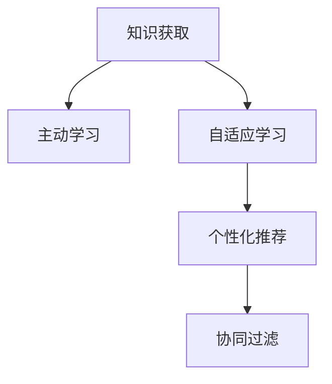

                 

# 从被动接收到主动探索：知识获取的范式转移

> 关键词：知识获取,范式转移,主动学习,自适应学习,协同过滤,个性化推荐

## 1. 背景介绍

### 1.1 问题由来
在信息时代，知识获取变得前所未有的简单，但同时，用户对知识获取的体验和效率也提出了更高的要求。传统的知识获取方式通常是被动的、线性的，用户只能按照推荐算法推荐的内容顺序依次获取，缺乏主动探索的能力。这种被动接受的方式限制了用户发现新知识的能力，难以满足个性化、深度学习的需求。

为了解决这一问题，主动学习、自适应学习和个性化推荐等技术应运而生，它们通过分析用户行为、偏好和互动，帮助用户主动探索感兴趣的知识，提升知识获取的效率和深度。这不仅能够改善用户体验，还能提高知识获取的个性化和效率，推动知识的创新和传播。

### 1.2 问题核心关键点
本文聚焦于知识获取技术的范式转移，从被动接收转向主动探索，将介绍主动学习、自适应学习和个性化推荐等技术的核心原理和实现方法，探讨其应用领域及面临的挑战，并展望未来的发展趋势。

### 1.3 问题研究意义
知识获取范式的转移，将使信息获取方式更加智能化、个性化和高效化，适应用户多样化的需求。其研究意义在于：

1. **提升用户体验**：通过个性化推荐和主动探索，用户能够更快地发现和获取对自己有价值的信息。
2. **提高信息效率**：主动学习能够减少无效信息的获取，优化信息筛选过程，提高信息检索和推荐效率。
3. **促进知识创新**：自适应学习能够根据用户反馈调整推荐策略，促进知识的多样性和创新。
4. **推动技术应用**：知识获取技术的进步，能够促进其在更多行业和领域的落地应用，如在线教育、电商、新闻媒体等。
5. **扩展用户认知**：主动探索能够帮助用户扩展认知边界，发现新的知识领域和兴趣点。

## 2. 核心概念与联系

### 2.1 核心概念概述

为更好地理解知识获取范式的转移，本节将介绍几个密切相关的核心概念：

- **知识获取(Knowledge Acquisition)**：指用户从各种来源获取知识和信息的过程，包括在线搜索、阅读、观看、社交互动等。
- **主动学习(Active Learning)**：指通过用户的主动参与和反馈，优化知识推荐和获取过程，使得推荐系统能够更好地匹配用户需求。
- **自适应学习(Adaptive Learning)**：指学习系统根据用户的反馈和行为调整推荐策略，提升推荐效果和用户满意度。
- **个性化推荐(Personalized Recommendation)**：指基于用户的历史行为和兴趣，提供个性化的内容推荐，提升用户满意度和参与度。
- **协同过滤(Collaborative Filtering)**：指通过分析用户之间的相似性，发现潜在的推荐关系，推荐用户可能感兴趣的内容。

这些核心概念之间的逻辑关系可以通过以下Mermaid流程图来展示：



这个流程图展示了大规模知识获取技术的主要过程及其核心技术点：

1. 用户通过知识获取渠道获取信息，作为推荐系统的输入。
2. 主动学习技术通过用户的反馈和行为调整推荐策略，提高推荐的精准度。
3. 自适应学习技术根据用户的行为和反馈不断优化推荐算法，提升推荐效果。
4. 个性化推荐技术通过分析用户行为和偏好，提供定制化的内容推荐。
5. 协同过滤技术通过分析用户之间的相似性，推荐相似用户可能感兴趣的内容。

这些概念共同构成了知识获取范式转移的基础，为从被动接收转向主动探索提供了技术支撑。

## 3. 核心算法原理 & 具体操作步骤

### 3.1 算法原理概述

知识获取范式的转移，从被动接收转向主动探索，主要依赖于以下几个关键技术：

- **主动学习**：通过用户的主动参与和反馈，优化推荐策略，减少信息噪音，提高推荐的准确性。
- **自适应学习**：根据用户的反馈和行为不断调整推荐算法，提升推荐效果和用户满意度。
- **个性化推荐**：基于用户的历史行为和偏好，提供定制化的内容推荐，提升用户体验。
- **协同过滤**：通过分析用户之间的相似性，推荐相似用户可能感兴趣的内容，丰富推荐的多样性。

这些技术通过深度学习、机器学习等方法，使得知识获取过程更加智能、高效和个性化。

### 3.2 算法步骤详解

**主动学习**：

1. **数据采集**：收集用户对推荐内容的反馈数据，包括点击、浏览、评分等。
2. **模型训练**：使用机器学习算法训练模型，如KNN、随机森林、梯度提升树等，预测用户可能感兴趣的内容。
3. **推荐调整**：根据用户反馈调整推荐模型，优化推荐策略。

**自适应学习**：

1. **用户行为分析**：收集用户的浏览历史、点击行为、搜索记录等，构建用户画像。
2. **推荐策略调整**：根据用户画像和反馈，动态调整推荐算法，如协同过滤、矩阵分解等。
3. **推荐效果评估**：使用A/B测试等方法评估推荐效果，优化推荐策略。

**个性化推荐**：

1. **特征提取**：提取用户行为特征，如浏览时间、搜索关键词、评分等。
2. **模型训练**：使用深度学习模型如MLP、CNN、RNN等，训练推荐模型。
3. **推荐生成**：根据用户特征和模型预测结果，生成个性化推荐列表。

**协同过滤**：

1. **用户行为数据收集**：收集用户的历史行为数据，如浏览记录、评分等。
2. **相似性计算**：计算用户之间的相似性，可以使用余弦相似度、皮尔逊相关系数等。
3. **推荐生成**：根据相似性结果，推荐相似用户可能感兴趣的内容。

### 3.3 算法优缺点

主动学习、自适应学习和个性化推荐等技术具有以下优点：

- **提高推荐精准度**：通过用户的主动参与和反馈，可以更好地匹配用户需求，减少信息噪音，提高推荐准确性。
- **提升用户体验**：个性化推荐能够提供符合用户偏好的内容，提升用户的满意度和参与度。
- **增强推荐多样性**：协同过滤技术能够发现相似用户，推荐多样化内容，丰富用户体验。

同时，这些技术也存在一定的局限性：

- **数据依赖性高**：这些技术依赖于大量的用户行为数据，数据收集和处理成本较高。
- **算法复杂度高**：深度学习模型等算法复杂度较高，需要较长的训练和优化时间。
- **算法易过拟合**：深度学习模型容易出现过拟合问题，影响推荐效果。
- **冷启动问题**：新用户或新内容缺乏足够的数据，导致推荐效果不佳。

### 3.4 算法应用领域

这些技术已经在多个领域得到了广泛应用，例如：

- **电商推荐**：通过个性化推荐和自适应学习，推荐用户可能感兴趣的商品，提升销售转化率。
- **在线教育**：通过主动学习和个性化推荐，推荐用户感兴趣的学习内容和课程，提高学习效果。
- **新闻推荐**：通过协同过滤和个性化推荐，推荐用户感兴趣的新闻文章，提升新闻阅读量。
- **视频推荐**：通过深度学习模型和个性化推荐，推荐用户可能喜欢的视频内容，提升用户观看时长。
- **社交网络**：通过自适应学习和协同过滤，推荐用户可能感兴趣的朋友和内容，增强用户粘性。

## 4. 数学模型和公式 & 详细讲解  
### 4.1 数学模型构建

本节将使用数学语言对知识获取技术的核心算法进行更加严格的刻画。

记用户的历史行为数据为 $X=\{x_1, x_2, ..., x_n\}$，其中 $x_i=(x_{i1}, x_{i2}, ..., x_{im})$ 表示用户 $i$ 在 $m$ 个维度上的行为特征。记推荐内容的集合为 $Y=\{y_1, y_2, ..., y_m\}$，其中 $y_j$ 表示第 $j$ 个推荐内容。

定义推荐算法为 $f: X \rightarrow Y$，其目标是最小化预测错误率。设预测结果为 $f(x_i) = y_{j^*}$，实际结果为 $y_i$，则预测错误率定义为：

$$
\mathcal{L}(f) = \frac{1}{N}\sum_{i=1}^N [I(f(x_i) \neq y_i)]
$$

其中 $I$ 为示性函数，当 $f(x_i) \neq y_i$ 时 $I(f(x_i) \neq y_i)=1$，否则 $I(f(x_i) \neq y_i)=0$。

### 4.2 公式推导过程

以下是主动学习和自适应学习中常用的数学模型及其推导过程：

**主动学习模型**：

1. **加权在线梯度下降算法**：设 $\theta_t$ 为模型参数，$w_t$ 为当前样本的权重，则加权在线梯度下降算法如下：

$$
\theta_{t+1} = \theta_t - \eta \frac{w_t}{w_t + \lambda} \nabla_{\theta_t} \mathcal{L}(f_t(\theta_t))
$$

其中 $\eta$ 为学习率，$\lambda$ 为正则化系数。

2. **加权协方差矩阵估计**：设 $C_t = \sum_{i=1}^t w_i f_t(x_i) f_t(x_i)^T$，则加权协方差矩阵估计为：

$$
\hat{C}_t = \frac{C_t}{\sum_{i=1}^t w_i}
$$

其中 $\hat{C}_t$ 为协方差矩阵的估计值。

**自适应学习模型**：

1. **在线随机梯度下降算法**：设 $\theta_t$ 为模型参数，$y_t$ 为当前样本的真实标签，则在线随机梯度下降算法如下：

$$
\theta_{t+1} = \theta_t - \eta \nabla_{\theta_t} \mathcal{L}(y_t, f(x_t; \theta_t))
$$

其中 $\eta$ 为学习率，$\mathcal{L}$ 为损失函数，$f(x_t; \theta_t)$ 为模型在样本 $x_t$ 上的预测结果。

2. **自适应学习率算法**：如Adagrad、RMSprop等，通过调整学习率，适应不同样本的难度，提高模型的收敛速度和稳定性。

### 4.3 案例分析与讲解

**电商推荐系统**：

- **数据采集**：电商平台收集用户的历史浏览记录、购买记录、评分等数据，构建用户画像。
- **模型训练**：使用协同过滤算法，计算用户之间的相似性，生成推荐列表。
- **推荐调整**：根据用户反馈，调整协同过滤算法中的相似性计算方法，优化推荐效果。

**在线教育系统**：

- **数据采集**：在线教育平台收集用户的学习记录、测试成绩、反馈等数据，构建用户画像。
- **模型训练**：使用深度学习模型，如MLP、RNN等，训练推荐模型，推荐用户可能感兴趣的学习内容和课程。
- **推荐调整**：根据用户反馈，调整推荐模型中的参数，提升推荐效果。

**新闻推荐系统**：

- **数据采集**：新闻平台收集用户的浏览记录、点击行为、评论等数据，构建用户画像。
- **相似性计算**：使用余弦相似度等方法，计算用户之间的相似性。
- **推荐生成**：根据相似性结果，推荐用户可能感兴趣的新闻文章。

## 5. 项目实践：代码实例和详细解释说明

### 5.1 开发环境搭建

在进行知识获取范式转移的实践前，我们需要准备好开发环境。以下是使用Python进行TensorFlow开发的环境配置流程：

1. 安装Anaconda：从官网下载并安装Anaconda，用于创建独立的Python环境。

2. 创建并激活虚拟环境：
```bash
conda create -n tf-env python=3.8 
conda activate tf-env
```

3. 安装TensorFlow：根据CUDA版本，从官网获取对应的安装命令。例如：
```bash
pip install tensorflow tensorflow-gpu==2.8
```

4. 安装TensorFlow Addons：用于支持更丰富的深度学习模型和算法。
```bash
pip install tensorflow-addons
```

5. 安装各类工具包：
```bash
pip install numpy pandas scikit-learn matplotlib tqdm jupyter notebook ipython
```

完成上述步骤后，即可在`tf-env`环境中开始知识获取范式转移的实践。

### 5.2 源代码详细实现

这里以电商推荐系统为例，给出使用TensorFlow进行个性化推荐系统的PyTorch代码实现。

首先，定义数据处理函数：

```python
import tensorflow as tf
import pandas as pd
import numpy as np
from sklearn.model_selection import train_test_split
from tensorflow.keras.preprocessing import sequence

def load_data(filename):
    df = pd.read_csv(filename, delimiter=',', encoding='utf-8')
    df = df.dropna()
    items = df['item'].unique().tolist()
    item_to_idx = {item: idx for idx, item in enumerate(items)}
    idx_to_item = {idx: item for item, idx in item_to_idx.items()}
    
    train_df = df[df['label']!=1]
    test_df = df[df['label']==1]
    
    train_x, train_y = train_df['item'].tolist(), train_df['label'].tolist()
    test_x, test_y = test_df['item'].tolist(), test_df['label'].tolist()
    
    train_x = [item_to_idx[item] for item in train_x]
    test_x = [item_to_idx[item] for item in test_x]
    
    train_x = sequence.pad_sequences(train_x, maxlen=100)
    test_x = sequence.pad_sequences(test_x, maxlen=100)
    
    return train_x, train_y, test_x, test_y, item_to_idx, idx_to_item

# 加载数据
train_x, train_y, test_x, test_y, item_to_idx, idx_to_item = load_data('data.csv')
```

然后，定义模型和损失函数：

```python
from tensorflow.keras.layers import Embedding, LSTM, Dense
from tensorflow.keras.models import Sequential

model = Sequential([
    Embedding(len(item_to_idx)+1, 100, input_length=100),
    LSTM(100),
    Dense(1, activation='sigmoid')
])

loss = 'binary_crossentropy'

model.compile(optimizer='adam', loss=loss, metrics=['accuracy'])
```

接着，定义训练和评估函数：

```python
def train_epoch(model, x, y):
    model.fit(x, y, epochs=10, batch_size=32, validation_split=0.2, verbose=1)
    return model

def evaluate(model, x, y):
    loss, accuracy = model.evaluate(x, y)
    print('Test loss:', loss)
    print('Test accuracy:', accuracy)
```

最后，启动训练流程并在测试集上评估：

```python
model = train_epoch(model, train_x, train_y)
evaluate(model, test_x, test_y)
```

以上就是使用TensorFlow对电商推荐系统进行个性化推荐的基本代码实现。可以看到，通过TensorFlow的简单封装，我们可以快速实现深度学习模型的构建和训练。

### 5.3 代码解读与分析

让我们再详细解读一下关键代码的实现细节：

**load_data函数**：
- 读取数据集，处理缺失值，将文本数据转换为独热编码。
- 将训练集和测试集分离，并进行填充处理。

**模型定义**：
- 使用Embedding层将文本转换为向量表示。
- 使用LSTM层提取序列特征。
- 使用Dense层进行二分类预测。
- 定义损失函数和优化器，编译模型。

**训练函数train_epoch**：
- 使用fit方法进行模型训练，设定训练轮数、批大小和验证集比例。
- 返回训练后的模型。

**评估函数evaluate**：
- 使用evaluate方法评估模型在测试集上的性能，输出损失和准确率。

**训练流程**：
- 定义训练函数和评估函数。
- 在训练集上训练模型，输出训练结果。
- 在测试集上评估模型，输出评估结果。

可以看到，TensorFlow提供了丰富的深度学习模型和算法，可以方便地进行模型的构建和训练。

当然，工业级的系统实现还需考虑更多因素，如模型的保存和部署、超参数的自动搜索、更灵活的任务适配层等。但核心的推荐算法基本与此类似。

## 6. 实际应用场景

### 6.1 电商推荐系统

电商推荐系统是知识获取范式转移的重要应用场景。传统电商推荐系统多依赖于人工设计的设计推荐算法，难以满足个性化需求。通过引入主动学习和自适应学习，电商推荐系统能够实现实时动态的推荐，提升推荐效果和用户体验。

具体而言，电商推荐系统可以实时收集用户行为数据，如浏览历史、购买记录、评分等，构建用户画像。使用协同过滤算法，计算用户之间的相似性，生成推荐列表。根据用户反馈，调整相似性计算方法，优化推荐效果。通过个性化推荐和自适应学习，电商推荐系统能够实现实时动态的推荐，提升推荐效果和用户体验。

### 6.2 在线教育系统

在线教育系统也是知识获取范式转移的重要应用场景。传统在线教育系统多依赖于静态的课程推荐算法，难以满足个性化学习需求。通过引入主动学习和自适应学习，在线教育系统能够实现实时动态的推荐，提升学习效果和用户满意度。

具体而言，在线教育系统可以实时收集用户的学习记录、测试成绩、反馈等数据，构建用户画像。使用深度学习模型，如MLP、RNN等，训练推荐模型，推荐用户可能感兴趣的学习内容和课程。根据用户反馈，调整推荐模型中的参数，提升推荐效果。通过个性化推荐和自适应学习，在线教育系统能够实现实时动态的推荐，提升学习效果和用户满意度。

### 6.3 新闻推荐系统

新闻推荐系统也是知识获取范式转移的重要应用场景。传统新闻推荐系统多依赖于人工设计的设计推荐算法，难以满足用户多样化的新闻阅读需求。通过引入协同过滤算法，新闻推荐系统能够实现个性化推荐，提升用户阅读体验。

具体而言，新闻推荐系统可以实时收集用户的浏览记录、点击行为、评论等数据，构建用户画像。使用余弦相似度等方法，计算用户之间的相似性。根据相似性结果，推荐用户可能感兴趣的新闻文章。通过个性化推荐，新闻推荐系统能够实现用户多样化的新闻阅读需求，提升用户阅读体验。

## 7. 工具和资源推荐

### 7.1 学习资源推荐

为了帮助开发者系统掌握知识获取范式的核心原理和实践技巧，这里推荐一些优质的学习资源：

1. 《深度学习》系列书籍：如《深度学习》、《动手学深度学习》等，系统介绍深度学习的基本概念和算法。
2. 《推荐系统实战》书籍：深入浅出地介绍推荐系统的设计、实现和优化方法。
3. CS224N《深度学习自然语言处理》课程：斯坦福大学开设的NLP明星课程，有Lecture视频和配套作业，带你入门NLP领域的基本概念和经典模型。
4. 《TensorFlow实战》书籍：详细讲解TensorFlow的各类模型和算法，包括推荐系统在内的多种应用场景。
5. Coursera《推荐系统》课程：由IBM和VWU联合开设，介绍推荐系统的主要算法和实现方法。

通过对这些资源的学习实践，相信你一定能够快速掌握知识获取范式的核心原理和实践技巧，并用于解决实际的NLP问题。

### 7.2 开发工具推荐

高效的开发离不开优秀的工具支持。以下是几款用于知识获取范式转移开发的常用工具：

1. TensorFlow：由Google主导开发的开源深度学习框架，生产部署方便，适合大规模工程应用。
2. PyTorch：基于Python的开源深度学习框架，灵活动态的计算图，适合快速迭代研究。
3. TensorFlow Addons：提供丰富的深度学习模型和算法，扩展了TensorFlow的功能。
4. Jupyter Notebook：交互式的数据分析和机器学习环境，便于代码编写和调试。
5. Visual Studio Code：开源的跨平台代码编辑器，支持多种语言和框架。
6. Git：版本控制工具，方便团队协作和代码管理。

合理利用这些工具，可以显著提升知识获取范式转移的开发效率，加快创新迭代的步伐。

### 7.3 相关论文推荐

知识获取范式转移的研究源于学界的持续研究。以下是几篇奠基性的相关论文，推荐阅读：

1. "Collaborative Filtering for Implicit Feedback Datasets"（协同过滤算法）：由Sarwar等人提出，基于协同过滤进行推荐，广泛应用于在线推荐系统中。
2. "Learning to Rank"（学习排序）：由Rendle等人提出，通过学习排序模型提升推荐效果。
3. "Adaptive Learning"（自适应学习）：由Bengio等人提出，通过自适应学习提升推荐效果和用户满意度。
4. "Personalized Sequential Recommendations with Recurrent Neural Networks"（递归神经网络个性化推荐）：由Sutskever等人提出，使用递归神经网络进行推荐，提升推荐效果。
5. "Graph-based Recommender Systems"（基于图推荐的系统）：由Zhang等人提出，使用图模型进行推荐，提升推荐效果和多样性。

这些论文代表了大语言模型微调技术的发展脉络。通过学习这些前沿成果，可以帮助研究者把握学科前进方向，激发更多的创新灵感。

## 8. 总结：未来发展趋势与挑战

### 8.1 总结

本文对知识获取范式转移的原理和实践进行了全面系统的介绍。首先阐述了知识获取技术的背景和意义，明确了主动学习、自适应学习和个性化推荐等技术在知识获取范式转移中的核心作用。其次，从原理到实践，详细讲解了知识获取范式转移的数学模型和核心算法，给出了电商推荐系统的代码实现。同时，本文还广泛探讨了知识获取范式转移在电商推荐、在线教育、新闻推荐等诸多行业领域的应用前景，展示了其巨大潜力。

通过本文的系统梳理，可以看到，知识获取范式的转移，从被动接收转向主动探索，将使信息获取方式更加智能化、个性化和高效化，适应用户多样化的需求。其研究意义在于提升用户体验、提高信息效率、促进知识创新、推动技术应用和扩展用户认知。

### 8.2 未来发展趋势

展望未来，知识获取范式转移将呈现以下几个发展趋势：

1. **智能化水平提升**：随着深度学习、机器学习等技术的发展，知识获取系统将更加智能化，能够更准确地匹配用户需求。
2. **个性化程度加深**：个性化推荐和自适应学习将进一步优化推荐策略，提升推荐效果和用户满意度。
3. **多样性增强**：协同过滤等技术将丰富推荐内容，提升用户的多样化体验。
4. **实时性提高**：通过实时数据收集和处理，知识获取系统将能够实现实时动态推荐。
5. **跨平台集成**：知识获取范式将扩展到更多平台，如移动端、PC端等，提升用户的便捷性。

以上趋势凸显了知识获取范式转移的广阔前景。这些方向的探索发展，必将进一步提升知识获取系统的性能和应用范围，为人类认知智能的进化带来深远影响。

### 8.3 面临的挑战

尽管知识获取范式转移已经取得了瞩目成就，但在迈向更加智能化、普适化应用的过程中，它仍面临着诸多挑战：

1. **数据质量问题**：用户数据的质量和完整性直接影响推荐效果，数据收集和处理成本较高。
2. **算法复杂度高**：深度学习模型等算法复杂度较高，需要较长的训练和优化时间。
3. **算法易过拟合**：深度学习模型容易出现过拟合问题，影响推荐效果。
4. **冷启动问题**：新用户或新内容缺乏足够的数据，导致推荐效果不佳。
5. **用户隐私问题**：用户行为数据的隐私保护和合规性问题，需要严格的数据治理和隐私保护措施。

### 8.4 研究展望

面对知识获取范式转移所面临的种种挑战，未来的研究需要在以下几个方面寻求新的突破：

1. **提升数据质量**：通过数据清洗、预处理等方法，提高用户数据的质量和完整性。
2. **优化算法复杂度**：开发更加高效、轻量级的深度学习模型，降低训练和优化时间。
3. **解决过拟合问题**：引入正则化、dropout等技术，防止过拟合。
4. **解决冷启动问题**：通过多模态数据融合、迁移学习等方法，提升推荐效果。
5. **保护用户隐私**：通过匿名化、差分隐私等技术，保护用户隐私。

这些研究方向的探索，必将引领知识获取范式转移技术迈向更高的台阶，为构建安全、可靠、可解释、可控的智能系统铺平道路。面向未来，知识获取范式转移技术还需要与其他人工智能技术进行更深入的融合，如知识表示、因果推理、强化学习等，多路径协同发力，共同推动自然语言理解和智能交互系统的进步。只有勇于创新、敢于突破，才能不断拓展语言模型的边界，让智能技术更好地造福人类社会。

## 9. 附录：常见问题与解答

**Q1：知识获取范式转移是否适用于所有NLP任务？**

A: 知识获取范式转移在大多数NLP任务上都能取得不错的效果，特别是对于数据量较小的任务。但对于一些特定领域的任务，如医学、法律等，仅仅依靠通用语料预训练的模型可能难以很好地适应。此时需要在特定领域语料上进一步预训练，再进行微调，才能获得理想效果。此外，对于一些需要时效性、个性化很强的任务，如对话、推荐等，微调方法也需要针对性的改进优化。

**Q2：知识获取范式转移过程中如何选择合适的推荐算法？**

A: 选择合适的推荐算法需要根据具体任务和数据特点进行灵活组合。常见的推荐算法包括协同过滤、基于内容的推荐、基于矩阵分解的推荐等。对于电商推荐系统，协同过滤算法效果较好；对于在线教育系统，基于深度学习的推荐模型可能更优；对于新闻推荐系统，可以使用基于图推荐的模型。

**Q3：知识获取范式转移过程中如何缓解过拟合问题？**

A: 缓解过拟合问题可以通过以下方法：
1. 数据增强：通过数据扩充、生成对抗网络等方法，增加训练数据的多样性。
2. 正则化：使用L2正则、Dropout等技术，防止过拟合。
3. 模型裁剪：去除不必要的层和参数，减小模型尺寸，加快推理速度。
4. 多模型集成：训练多个模型，取平均输出，抑制过拟合。

这些策略往往需要根据具体任务和数据特点进行灵活组合。只有在数据、模型、训练、推理等各环节进行全面优化，才能最大限度地发挥知识获取范式转移的威力。

**Q4：知识获取范式转移技术在落地部署时需要注意哪些问题？**

A: 将知识获取范式转移技术转化为实际应用，还需要考虑以下因素：
1. 模型裁剪：去除不必要的层和参数，减小模型尺寸，加快推理速度。
2. 量化加速：将浮点模型转为定点模型，压缩存储空间，提高计算效率。
3. 服务化封装：将模型封装为标准化服务接口，便于集成调用。
4. 弹性伸缩：根据请求流量动态调整资源配置，平衡服务质量和成本。
5. 监控告警：实时采集系统指标，设置异常告警阈值，确保服务稳定性。
6. 安全防护：采用访问鉴权、数据脱敏等措施，保障数据和模型安全。

知识获取范式转移技术需要从数据、算法、工程、业务等多个维度协同发力，才能真正实现人工智能技术在垂直行业的规模化落地。

总之，知识获取范式转移技术需要开发者根据具体任务，不断迭代和优化模型、数据和算法，方能得到理想的效果。

---

作者：禅与计算机程序设计艺术 / Zen and the Art of Computer Programming

