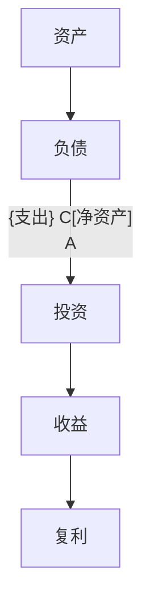

                 

# 从零开始：程序员的理财之路

> 关键词：理财入门, 投资策略, 财务规划, 编程储蓄, 资产配置

## 1. 背景介绍

在程序员的职业轨迹中，技术能力和个人理财同样重要。良好的财务管理不仅能帮助程序员实现财务自由，还能在面对经济波动时，保持生活的稳定性和安全垫。然而，对于大多数程序员来说，理财是一个陌生的领域，常常因为时间、知识和经验的不足，导致对财务问题视而不见。本系列博客将系统性地介绍程序员理财的基本知识和方法，帮助读者掌握理财技能，为未来的经济稳定打下坚实基础。

### 1.1 问题由来

在互联网和科技行业，快速发展的职业生涯带来了丰厚的收入，但也伴随着巨大的财务压力。高薪往往伴随着高支出，尤其是对于刚入行的程序员来说，缺乏理财意识和经验，容易导致“月光族”和债务危机。合理的财务规划和投资策略，不仅能有效管理日常开销，还能最大化财务收益，保障未来的经济安全。

### 1.2 问题核心关键点

理财的核心在于以下几个关键点：
1. **收入管理**：如何分配个人收入，实现收支平衡和节余。
2. **支出规划**：如何控制生活成本，优化消费习惯。
3. **投资组合**：如何进行资产配置，实现财富增值。
4. **风险管理**：如何分散投资风险，保证资产安全。
5. **财务目标**：设定长期和短期的财务目标，明确理财方向。

## 2. 核心概念与联系

### 2.1 核心概念概述

为更好地理解理财的基础和实践，本节将介绍几个密切相关的核心概念：

- **资产**：指任何有价值的资源，如现金、股票、房地产等。
- **负债**：指需要偿还的债务，如贷款、信用卡欠款等。
- **净资产**：资产减去负债的净值，反映个人或家庭的财务健康状况。
- **预算**：个人或家庭的收支计划，用于控制开支，实现财务目标。
- **投资**：将资金投入到预期能产生收益的项目或资产中，包括股票、基金、房地产等。
- **复利**：通过定期重新投资收益，实现财富指数级增长。

这些概念之间的关系可以通过以下Mermaid流程图来展示：



这个流程图展示了这个系列博客要讨论的核心概念及其相互关系：

1. 资产减去负债得到净资产。
2. 通过投资将资产投入不同的项目，产生收益。
3. 复利效应对长期投资有重要影响，能够显著提升财富增值速度。

## 3. 核心算法原理 & 具体操作步骤

### 3.1 算法原理概述

理财的核心算法在于通过合理的收入分配、支出规划和投资策略，最大化净资产和复利效应，同时控制风险。其基本原理可以概括为：

1. **收支平衡**：保证月收入大于月支出，建立财务缓冲区。
2. **资产配置**：将资金分散投资于不同类型的资产，降低整体风险。
3. **复利效应**：通过定期再投资收益，实现财富指数级增长。
4. **风险控制**：通过分散投资和保险等手段，减少不可预见损失。

### 3.2 算法步骤详解

理财的详细步骤如下：

**Step 1: 确定收入和支出**
- 收集个人或家庭的收入和支出数据，建立详细的预算表。
- 分析收入来源和支出项目，识别出必要支出和非必要支出。
- 设定月度、季度和年度预算目标。

**Step 2: 建立紧急基金**
- 计算3-6个月的生活费，作为紧急基金。
- 将紧急基金存入高流动性且风险较低的账户，如货币市场基金。
- 确保紧急基金随时可用，以应对突发事件。

**Step 3: 制定投资计划**
- 评估风险承受能力，选择适合的风险等级。
- 根据资产类型（如股票、债券、房地产等）和收益预期，制定投资组合。
- 设定投资目标和预期回报率，定期重新评估和调整。

**Step 4: 实施理财计划**
- 根据预算表和投资计划，分配月度收入。
- 自动划转资金至不同的投资账户，实现自动再投资。
- 定期监测投资组合表现，适时进行微调。

**Step 5: 监控财务健康**
- 每月评估净资产变化，确保预算执行情况。
- 定期检查财务目标进度，调整策略以应对变化。
- 维护和更新预算表和投资计划，适应新的财务状况。

### 3.3 算法优缺点

理财算法的优点在于其系统性和前瞻性，通过科学规划和合理配置，能够有效提升财务健康和投资收益。然而，理财算法也存在以下缺点：

- **复杂性高**：涉及多个变量和不同时间段的数据，计算过程较为复杂。
- **依赖于数据准确性**：预算和投资计划的准确性直接影响理财效果。
- **市场风险**：投资收益受市场波动影响，可能存在短期波动风险。
- **知识门槛**：需要一定的财务和投资知识，初学者可能难以掌握。
- **执行难度**：需要自律和毅力，长期坚持才能看到显著效果。

### 3.4 算法应用领域

理财算法不仅适用于个人和家庭财务管理，还广泛应用于企业财务规划、资产管理和投资策略制定。在不同应用场景下，理财算法的实施细节会有所不同，但其核心原理和方法基本一致。

## 4. 数学模型和公式 & 详细讲解 & 举例说明

### 4.1 数学模型构建

理财的数学模型主要围绕资产配置和复利计算展开。设初始投资金额为 $P$，年收益率为 $r$，复利计算周期为 $n$，则 $n$ 年后的投资总额 $F$ 可表示为：

$$
F = P(1 + r)^n
$$

### 4.2 公式推导过程

以复利公式为基础，推导不同时间点的投资总额。假设每年复利一次，则 $t$ 年后的投资总额 $F_t$ 为：

$$
F_t = P(1 + r)^t
$$

将上式进一步展开，得到每个时间点的具体数值：

$$
F_1 = P(1 + r)
$$
$$
F_2 = P(1 + r)^2
$$
$$
F_t = P(1 + r)^t
$$

### 4.3 案例分析与讲解

以股票投资为例，假设某投资者初始投资 10000 元，年收益率为 10%，复利计算周期为 5 年。根据复利公式，5 年后的投资总额为：

$$
F_5 = 10000(1 + 0.1)^5 \approx 16105.1
$$

即投资者在 5 年后获得约 6105.1 元的收益，复利效应显著提升了财富增值速度。

## 5. 项目实践：代码实例和详细解释说明

### 5.1 开发环境搭建

在进行理财实践前，我们需要准备好开发环境。以下是使用Python进行PyTorch开发的环境配置流程：

1. 安装Anaconda：从官网下载并安装Anaconda，用于创建独立的Python环境。

2. 创建并激活虚拟环境：
```bash
conda create -n finance-env python=3.8 
conda activate finance-env
```

3. 安装PyTorch：根据CUDA版本，从官网获取对应的安装命令。例如：
```bash
conda install pytorch torchvision torchaudio cudatoolkit=11.1 -c pytorch -c conda-forge
```

4. 安装各类工具包：
```bash
pip install numpy pandas scikit-learn matplotlib tqdm jupyter notebook ipython
```

完成上述步骤后，即可在`finance-env`环境中开始理财实践。

### 5.2 源代码详细实现

这里我们以股票投资为例，使用Python编写一个简单的股票投资收益计算器。

```python
import numpy as np
import matplotlib.pyplot as plt

def compute_compound_interest(principal, rate, time):
    # 计算复利投资总额
    amount = principal * (1 + rate)**time
    return amount

def plot_compound_interest(principal, rate, time):
    # 绘制复利投资收益图
    amounts = [compute_compound_interest(principal, rate, t) for t in range(1, time+1)]
    plt.plot(range(1, time+1), amounts)
    plt.xlabel('Time (years)')
    plt.ylabel('Total Investment')
    plt.title('Compound Interest Plot')
    plt.show()

# 示例
principal = 10000  # 初始投资金额
rate = 0.1        # 年收益率
time = 5          # 投资年限

amount = compute_compound_interest(principal, rate, time)
print(f'5年后投资总额: {amount:.2f}')

# 绘制复利收益图
plot_compound_interest(principal, rate, time)
```

### 5.3 代码解读与分析

让我们再详细解读一下关键代码的实现细节：

**compute_compound_interest函数**：
- 计算复利投资总额的函数，接受初始投资金额、年收益率和投资年限作为输入。

**plot_compound_interest函数**：
- 绘制复利投资收益图的函数，利用列表推导式和numpy库生成时间点对应的投资总额，并使用matplotlib库绘制图形。

**示例**：
- 使用示例数据，计算并输出5年后投资总额，同时绘制复利收益图。

**绘图**：
- 利用matplotlib库的绘图功能，可视化复利投资的收益变化过程。

这个代码实现简单易懂，通过示例展示了复利投资的计算和可视化，帮助理解理财算法的基本原理。

## 6. 实际应用场景

### 6.1 投资组合管理

在企业财务管理中，投资组合管理是理财算法的重要应用。企业需要根据不同资产的风险和收益特性，制定合理的投资组合策略，以最大化资本回报。例如，一个企业可以考虑将资金分配到股票、债券和房地产中，根据市场动态进行定期再平衡，以应对不同的经济环境和风险水平。

### 6.2 个人资产配置

对于个人理财，资产配置同样重要。假设一个程序员有 10 万美元可投资资金，可以将其分配到股票、债券、房地产和现金等不同资产中。根据个人风险承受能力和投资目标，可以设定一个合理的资产比例，如60%股票、30%债券、10%房地产。在股票市场表现良好时，定期再平衡投资组合，确保资产配置始终符合策略。

### 6.3 退休规划

退休规划是长期财务规划的重要组成部分。程序员可以通过定期投资养老金账户，利用复利效应实现财务自由。例如，假设每年投资 1 万美元，年收益率为 8%，25 年后总资产可达约 100 万美元，轻松覆盖退休生活所需。

### 6.4 未来应用展望

伴随理财算法的不断发展和完善，其在各领域的应用将更加广泛和深入。未来的理财算法有望实现：

1. **智能算法辅助决策**：利用机器学习和大数据分析，智能推荐投资组合和财务规划策略。
2. **实时动态调整**：通过高频数据流分析，实现投资组合的实时调整和优化。
3. **多币种跨市场投资**：利用外汇和衍生品市场，实现跨市场投资和风险分散。
4. **绿色投资**：在环境保护和可持续发展方向进行投资，实现社会责任和经济回报的双赢。
5. **智能合约和DeFi**：利用区块链技术，实现自动化财务管理和智能合约自动执行。

理财算法的发展将为程序员和各类投资者带来更多的理财选择和更高效的财富管理方式。

## 7. 工具和资源推荐

### 7.1 学习资源推荐

为了帮助开发者系统掌握理财的基本知识和方法，这里推荐一些优质的学习资源：

1. **《理财入門》**：一本系统介绍个人理财基础知识的书籍，涵盖预算管理、投资策略、风险控制等内容。
2. **《投资的智慧》**：本杰明·格雷厄姆的经典理财著作，深入浅出地介绍了投资原则和方法。
3. **Coursera《金融市场与投资》课程**：由耶鲁大学教授罗伯特·希勒主讲，系统介绍金融市场和投资策略。
4. **Khan Academy理财课程**：通过大量免费视频和练习题，帮助用户逐步掌握理财知识。
5. **Mint个人理财应用**：一款流行的个人财务管理工具，帮助用户跟踪收支、管理投资。

通过对这些资源的学习实践，相信你一定能够快速掌握理财技能，为实现财务自由打下坚实基础。

### 7.2 开发工具推荐

理财计算和分析需要使用一些专业的工具和库。以下是几款推荐的工具：

1. **Python**：因其简洁易读和丰富的库支持，成为理财计算和分析的首选语言。
2. **Excel**：强大的数据处理和可视化功能，适用于个人和企业的理财规划和投资分析。
3. **Tableau**：数据可视化工具，帮助用户更直观地理解财务数据和投资表现。
4. **Matplotlib**：用于绘制图表和数据可视化，是Python中最流行的绘图库之一。
5. **Pandas**：数据处理和分析库，支持读取、清洗和分析各类数据。

合理利用这些工具，可以显著提升理财计算和分析的效率，为财务管理提供可靠的数据支持。

### 7.3 相关论文推荐

理财算法的研究源于学界的持续探索。以下是几篇奠基性的相关论文，推荐阅读：

1. **《金融市场和投资》**：斯蒂芬·罗斯的开创性工作，奠定了现代投资理论的基础。
2. **《智能投资组合理论》**：哈里·马科维茨的经典著作，介绍了现代投资组合理论的核心思想。
3. **《理财新规则》**：本杰明·格雷厄姆的另一部重要著作，提供了经典理财原则和方法。
4. **《行为金融学》**：理查德·塞勒和罗伯特·希勒的合著，揭示了人类心理对理财决策的影响。
5. **《量化投资策略》**：伊曼纽尔·德贝塞特的综合性著作，介绍了多种量化投资策略。

这些论文代表了理财算法的发展脉络。通过学习这些前沿成果，可以帮助研究者把握学科前进方向，激发更多的创新灵感。

## 8. 总结：未来发展趋势与挑战

### 8.1 总结

本文对理财算法进行了全面系统的介绍。首先阐述了理财算法的核心概念和实际应用，明确了理财在提升个人和企业财务健康方面的重要作用。其次，从原理到实践，详细讲解了理财算法的数学模型和操作步骤，给出了理财任务开发的完整代码实例。同时，本文还广泛探讨了理财算法在投资组合管理、个人资产配置、退休规划等多个领域的应用前景，展示了理财算法的广泛适用性和巨大潜力。

通过本文的系统梳理，可以看到，理财算法正在成为程序员财务管理的重要工具，为实现财务自由和家庭财富积累提供了科学的指导。未来，伴随理财算法的持续演进，必将进一步提升个人和企业的财务管理水平，为经济社会发展注入新的动力。

### 8.2 未来发展趋势

展望未来，理财算法将呈现以下几个发展趋势：

1. **智能化决策**：利用人工智能和大数据分析，实现理财算法的智能化决策，提供更加个性化和精准的财务建议。
2. **自动化执行**：通过智能合约和DeFi等技术，实现理财策略的自动化执行和动态调整。
3. **多元化投资**：实现跨市场、跨资产的多元化投资，降低单一资产的风险，提高整体收益。
4. **可持续发展**：推动绿色投资和ESG（环境、社会和治理）投资，实现经济和环境的双赢。
5. **普惠金融**：利用技术手段降低理财门槛，实现理财服务的普惠化和民主化。

这些趋势凸显了理财算法的广阔前景。这些方向的探索发展，必将进一步提升理财系统的智能化和自动化水平，为个人和企业提供更加高效、可靠的财务管理解决方案。

### 8.3 面临的挑战

尽管理财算法已经取得了一定的进展，但在迈向更加智能化、普惠化的应用过程中，仍面临诸多挑战：

1. **数据隐私和安全**：理财涉及大量个人和企业的敏感数据，如何保护数据隐私和安全，是一大难题。
2. **算法透明度和可解释性**：复杂的理财模型往往缺乏透明度，难以解释其决策过程和依据。
3. **市场波动和风险管理**：市场波动和不可预见事件可能对投资组合产生重大影响，如何有效管理风险，是一个重要课题。
4. **技术和应用适配**：理财算法需要与各类金融系统、投资平台和业务场景进行深度适配，技术复杂度较高。
5. **法规和合规性**：理财算法需要符合各国金融监管法规，确保合法合规的运作。

这些挑战需要各方的共同努力，才能实现理财算法的全面落地和应用。唯有从数据、算法、工程、法规等多个维度协同发力，才能真正实现理财算法的普惠化和高效化。

### 8.4 未来突破

面对理财算法所面临的种种挑战，未来的研究需要在以下几个方面寻求新的突破：

1. **隐私保护技术**：开发基于区块链的隐私保护方案，确保数据传输和存储的安全性。
2. **透明可解释算法**：引入可解释性技术，提高理财算法的透明度和可解释性，增强用户信任。
3. **动态风险管理**：结合机器学习和金融工程，实现动态风险管理和投资组合优化。
4. **普适性算法**：开发适用于不同风险偏好和财务状况的普适性理财算法，提升算法的普及率。
5. **法规和技术融合**：结合法律、技术和金融工程，构建合规的理财算法框架，确保算法的合法合规性。

这些研究方向的探索，必将引领理财算法迈向更高的台阶，为个人和企业提供更加智能、可靠和普惠的财务管理服务。面向未来，理财算法还需要与其他金融技术进行更深入的融合，共同推动金融行业的智能化和普惠化发展。总之，理财算法需要从多个维度进行突破，才能真正实现理财的智能化、普惠化和普适化。

## 9. 附录：常见问题与解答

**Q1：理财算法是否适用于所有类型的投资者？**

A: 理财算法适用于不同类型的投资者，包括高净值客户、中产阶层和普通家庭。不同投资者可以根据自身风险承受能力和投资目标，设定合适的理财策略。

**Q2：如何选择合适的理财工具？**

A: 选择合适的理财工具需要考虑多个因素，如投资目标、风险承受能力、资金规模等。可以咨询理财顾问，结合自身情况进行综合评估。

**Q3：理财过程中如何分散风险？**

A: 分散风险的方法包括多元化投资、定期再平衡、分散资产类别等。根据自身风险偏好和市场情况，合理配置资产。

**Q4：理财过程中如何控制开支？**

A: 控制开支需要制定详细的预算计划，严格执行并定期检查。可以采用自动化工具如Mint等，帮助跟踪和管理开支。

**Q5：如何设定理财目标？**

A: 设定理财目标需要明确时间、金额和收益预期，如买房、退休、子女教育等。可以分解为短期和长期目标，逐步实现。

---
作者：禅与计算机程序设计艺术 / Zen and the Art of Computer Programming

