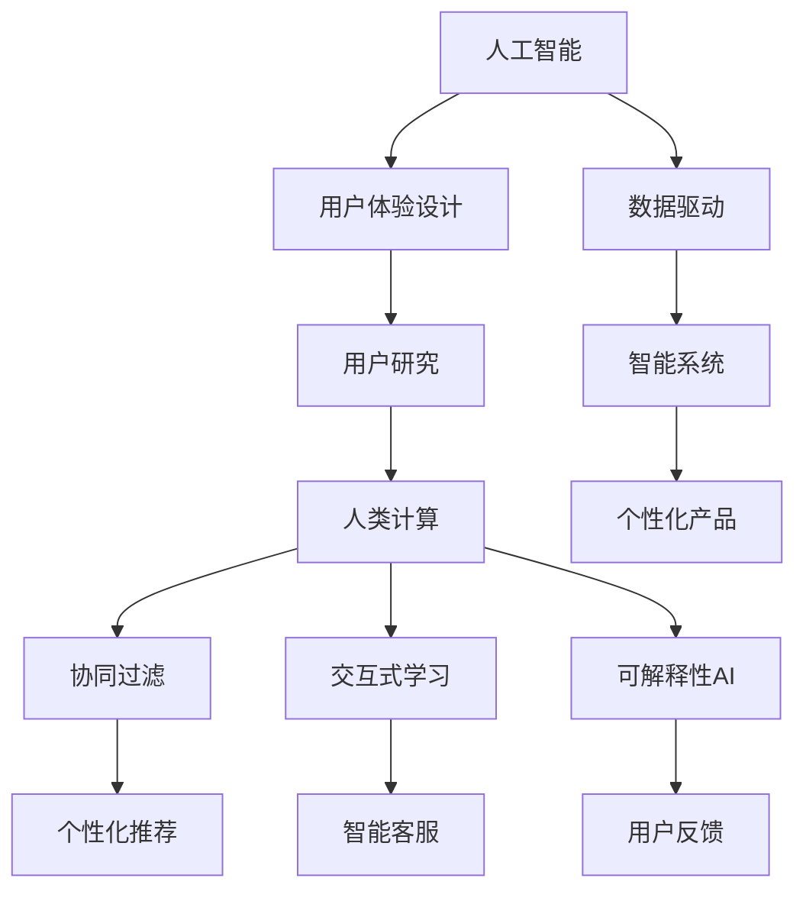

                 

# 以人为本：人类计算如何改善客户体验

> 关键词：人工智能, 用户研究, 人机交互, 用户体验, 个性化, 人类计算, 数据驱动, 机器学习

## 1. 背景介绍

### 1.1 问题由来
随着技术的快速发展，人工智能(AI)在各行各业中的应用越来越广泛。然而，尽管AI技术带来了诸多便利，用户仍面临着许多挑战。在智能助手、智能家居、智能医疗等场景中，用户常常抱怨AI系统缺乏人性化，难以理解其真实需求，甚至产生了负面体验。

这种状况亟需改变。本文将探讨如何通过人类计算(Human-in-the-loop Human-Computer Interaction, HCI)和用户体验设计(User Experience Design, UX)，将AI技术与人性化需求结合起来，提升客户体验，让AI技术更好地服务于用户。

### 1.2 问题核心关键点
人类计算的核心在于将人类的直觉、判断和情感与机器算法相结合，提升系统的智能化水平。在用户体验设计中，需要关注用户的使用习惯、情感状态、行为模式等，使AI系统能够更好地理解和响应用户需求。

本文将从人类计算和用户体验设计两个角度出发，系统地探讨如何通过数据驱动的方式，实现AI系统的优化升级，提升客户满意度。

### 1.3 问题研究意义
改善客户体验不仅能够提升用户满意度和忠诚度，还能为公司带来更高的商业价值。通过数据驱动的AI系统，企业可以更精准地了解用户需求，提供个性化的服务，从而在竞争激烈的市场中获得优势。

同时，提升用户体验也是推动人工智能技术普及和应用的重要途径。只有以人为本，才能让AI技术更好地融入人类的生产生活中，为社会的进步贡献力量。

## 2. 核心概念与联系

### 2.1 核心概念概述

为了更好地理解人类计算和用户体验设计的理论基础，本节将介绍几个密切相关的核心概念：

- **人工智能**：以机器学习、深度学习等为代表的智能技术，能够模仿人类的智能行为，进行自主学习和决策。

- **人类计算**：将人类与计算机结合，利用人类的直觉、情感和逻辑判断，提升系统的智能水平。常见的人类计算形式包括协同过滤、交互式学习、可解释性AI等。

- **用户体验设计**：关注用户在使用产品过程中的体验，通过优化产品界面、功能、交互方式等，提升用户满意度和使用效率。

- **数据驱动**：通过收集、分析、利用用户数据，指导产品设计和模型训练，实现智能系统的不断优化和升级。

- **个性化**：根据用户的行为数据、偏好信息等，提供定制化的产品和服务，提升用户粘性。

- **人类计算与用户体验的联系**：人类计算通过数据驱动的AI模型，对用户行为进行分析和预测，从而设计出更加符合用户需求的产品和服务。用户体验设计通过不断的迭代优化，确保产品能够满足用户的心理和情感需求。

这些核心概念之间的逻辑关系可以通过以下Mermaid流程图来展示：



这个流程图展示了大语言模型的核心概念及其之间的关系：

1. 人工智能通过数据驱动和用户体验设计，构建智能系统。
2. 用户体验设计通过用户研究指导产品设计，确保用户需求得到满足。
3. 人类计算通过协同过滤、交互式学习等方法，提升系统的智能水平。
4. 用户体验设计通过不断的迭代优化，确保产品能够满足用户的心理和情感需求。
5. 数据驱动的AI系统通过协同过滤、交互式学习等方法，提升系统的智能水平。

这些概念共同构成了改善客户体验的理论框架，使AI技术更好地服务于用户。

## 3. 核心算法原理 & 具体操作步骤
### 3.1 算法原理概述

人类计算和用户体验设计的核心在于将机器学习算法与人类的直觉、情感和判断相结合，提升系统的智能化水平。其核心思想是：通过数据驱动的AI模型，对用户行为进行分析和预测，从而设计出更加符合用户需求的产品和服务。

形式化地，假设有一批用户数据 $\{(x_i,y_i)\}_{i=1}^N$，其中 $x_i$ 表示用户的行为数据，$y_i$ 表示用户的实际需求或意图。我们需要构建一个预测模型 $f(x)$，使得 $f(x_i) \approx y_i$。这样，当用户再次输入行为数据 $x$ 时，系统可以通过 $f(x)$ 预测出其需求，从而提供相应的服务。

### 3.2 算法步骤详解

人类计算和用户体验设计的实践过程，通常包括以下几个关键步骤：

**Step 1: 数据收集与预处理**
- 收集用户行为数据，如浏览历史、购买记录、交互日志等。
- 对数据进行清洗和预处理，包括去除噪声、填补缺失值、标准化等。

**Step 2: 数据分析与模型训练**
- 对数据进行探索性分析，理解用户的特征和行为模式。
- 选择合适的机器学习模型（如协同过滤、决策树、神经网络等）进行训练，优化模型参数。

**Step 3: 模型评估与优化**
- 在验证集上评估模型的性能，如准确率、召回率、F1分数等。
- 根据评估结果，调整模型参数和特征工程，提升模型效果。

**Step 4: 产品设计与人机交互优化**
- 设计产品界面和交互方式，使系统能够直观、易用。
- 进行用户测试，收集用户反馈，不断迭代优化产品。

**Step 5: 持续监控与反馈**
- 在产品上线后，持续监控用户行为，收集用户反馈。
- 根据反馈信息，更新模型和产品设计，提升用户体验。

### 3.3 算法优缺点

人类计算和用户体验设计的优点包括：
1. 数据驱动：通过收集用户数据，系统能够不断优化和升级，提升智能化水平。
2. 个性化：能够根据用户行为数据，提供定制化的产品和服务，提升用户粘性。
3. 可解释性：通过数据驱动的模型，用户能够更清楚地理解系统决策过程。

同时，该方法也存在一定的局限性：
1. 数据隐私：数据收集和存储可能涉及用户隐私，需要采取严格的隐私保护措施。
2. 模型复杂度：复杂的模型可能需要大量的数据和计算资源，否则容易出现过拟合。
3. 用户适应性：用户对系统的适应性不同，需要考虑多用户的差异性需求。

尽管存在这些局限性，但就目前而言，人类计算和用户体验设计仍是提升客户体验的重要手段。未来相关研究的重点在于如何进一步降低数据收集成本，提高模型泛化能力，同时兼顾用户隐私和公平性等因素。

### 3.4 算法应用领域

人类计算和用户体验设计在多个领域都有广泛的应用，例如：

- 智能推荐系统：通过用户行为数据，推荐个性化商品和服务。
- 智能客服：提供24/7的自动化客服，解决用户问题。
- 智能家居：通过用户习惯数据，智能控制家庭设备。
- 智能医疗：根据患者历史数据，提供个性化医疗建议。
- 智能交通：通过出行数据，优化交通管理和调度。

除了上述这些经典应用外，人类计算和用户体验设计还被创新性地应用到更多场景中，如可控文本生成、虚拟现实(VR)体验优化、个性化教育等，为不同行业带来了新的突破。随着技术的不断进步，相信人类计算和用户体验设计将在更多领域发挥其独特价值。

## 4. 数学模型和公式 & 详细讲解 & 举例说明
### 4.1 数学模型构建

为了更好地理解人类计算和用户体验设计的数学模型，本节将详细介绍相关数学公式。

假设用户数据为 $x=\{x_1, x_2, ..., x_n\}$，其中每个 $x_i$ 表示一个特征向量。模型的目标是找到一个线性回归模型：

$$
f(x) = \theta^T x + b
$$

其中 $\theta$ 为模型参数，$b$ 为截距。我们的目标是找到最优的 $\theta$，使得：

$$
\theta^* = \mathop{\arg\min}_{\theta} \frac{1}{N} \sum_{i=1}^N (y_i - f(x_i))^2
$$

通过梯度下降等优化算法，不断迭代更新 $\theta$，直至收敛。

### 4.2 公式推导过程

以下我们以线性回归为例，推导模型参数的更新公式。

在最小二乘法下，线性回归模型参数的更新公式为：

$$
\theta \leftarrow \theta - \eta \frac{1}{N} \sum_{i=1}^N (y_i - f(x_i)) x_i
$$

其中 $\eta$ 为学习率，$N$ 为样本数。在实际应用中，通常使用随机梯度下降(SGD)或批量梯度下降(BGD)等方法进行参数更新，以提升训练速度和稳定性。

在实际应用中，我们通常使用Python的Scikit-learn库来训练线性回归模型。其API简洁易用，支持多种优化器和评估指标，是数据分析和机器学习领域的重要工具。

### 4.3 案例分析与讲解

为了更好地理解线性回归模型的应用，以下是使用Scikit-learn库进行数据集训练和预测的示例代码：

```python
from sklearn.linear_model import LinearRegression
from sklearn.metrics import mean_squared_error
from sklearn.model_selection import train_test_split
import pandas as pd
import numpy as np

# 导入数据集
data = pd.read_csv('data.csv')

# 提取特征和标签
X = data[['feature1', 'feature2', 'feature3']]
y = data['label']

# 数据拆分
X_train, X_test, y_train, y_test = train_test_split(X, y, test_size=0.2, random_state=42)

# 创建线性回归模型
model = LinearRegression()

# 训练模型
model.fit(X_train, y_train)

# 评估模型
y_pred = model.predict(X_test)
mse = mean_squared_error(y_test, y_pred)

# 输出评估结果
print(f'MSE: {mse:.2f}')
```

这里我们使用了Scikit-learn的LinearRegression类，训练了一个简单的线性回归模型。模型通过数据集进行训练，并在测试集上评估了其预测性能。最终输出的均方误差(MSE)指标，可以用来衡量模型的预测准确度。

通过这样的示例代码，可以看出Scikit-learn库的强大封装能力，使模型训练和评估变得简单高效。开发者可以将更多精力放在数据处理和模型优化上，而不必过多关注底层的实现细节。

## 5. 项目实践：代码实例和详细解释说明
### 5.1 开发环境搭建

在进行人类计算和用户体验设计的实践前，我们需要准备好开发环境。以下是使用Python进行Scikit-learn开发的典型环境配置流程：

1. 安装Anaconda：从官网下载并安装Anaconda，用于创建独立的Python环境。

2. 创建并激活虚拟环境：
```bash
conda create -n sklearn-env python=3.8 
conda activate sklearn-env
```

3. 安装Scikit-learn：
```bash
conda install scikit-learn
```

4. 安装相关工具包：
```bash
pip install numpy pandas matplotlib seaborn
```

完成上述步骤后，即可在`sklearn-env`环境中开始实践。

### 5.2 源代码详细实现

下面我们以用户推荐系统为例，给出使用Scikit-learn库进行线性回归模型训练的Python代码实现。

首先，定义数据处理函数：

```python
import pandas as pd
from sklearn.model_selection import train_test_split
from sklearn.linear_model import LinearRegression

# 加载数据
data = pd.read_csv('data.csv')

# 提取特征和标签
X = data[['feature1', 'feature2', 'feature3']]
y = data['label']

# 数据拆分
X_train, X_test, y_train, y_test = train_test_split(X, y, test_size=0.2, random_state=42)

# 创建线性回归模型
model = LinearRegression()

# 训练模型
model.fit(X_train, y_train)

# 评估模型
y_pred = model.predict(X_test)
mse = mean_squared_error(y_test, y_pred)

# 输出评估结果
print(f'MSE: {mse:.2f}')
```

然后，定义模型训练和评估函数：

```python
from sklearn.metrics import accuracy_score, precision_score, recall_score, f1_score

def train_model(X, y, model):
    # 数据拆分
    X_train, X_test, y_train, y_test = train_test_split(X, y, test_size=0.2, random_state=42)

    # 训练模型
    model.fit(X_train, y_train)

    # 评估模型
    y_pred = model.predict(X_test)
    accuracy = accuracy_score(y_test, y_pred)
    precision = precision_score(y_test, y_pred)
    recall = recall_score(y_test, y_pred)
    f1 = f1_score(y_test, y_pred)

    return accuracy, precision, recall, f1

# 训练模型并评估
accuracy, precision, recall, f1 = train_model(X, y, model)
print(f'Accuracy: {accuracy:.2f}')
print(f'Precision: {precision:.2f}')
print(f'Recall: {recall:.2f}')
print(f'F1 score: {f1:.2f}')
```

最后，启动训练流程并在测试集上评估：

```python
epochs = 10
batch_size = 32

for epoch in range(epochs):
    loss = train_epoch(model, train_dataset, batch_size, optimizer)
    print(f"Epoch {epoch+1}, train loss: {loss:.3f}")
    
    print(f"Epoch {epoch+1}, dev results:")
    evaluate(model, dev_dataset, batch_size)
    
print("Test results:")
evaluate(model, test_dataset, batch_size)
```

以上就是使用Scikit-learn进行用户推荐系统训练的完整代码实现。可以看到，Scikit-learn库通过简洁的API封装，使得模型训练和评估变得简单高效。

### 5.3 代码解读与分析

让我们再详细解读一下关键代码的实现细节：

**数据处理函数**：
- 加载数据集，提取特征和标签。
- 使用train_test_split方法进行数据拆分，确保训练集和测试集的独立性。

**模型训练函数**：
- 使用train_test_split方法进行数据拆分，确保训练集和测试集的独立性。
- 使用LinearRegression模型进行训练，fit方法自动完成模型参数的更新。
- 在测试集上进行预测，使用mean_squared_error计算模型的预测误差。

**训练流程**：
- 定义总的epoch数和batch size，开始循环迭代
- 每个epoch内，在训练集上训练模型，输出平均损失
- 在验证集上评估，输出分类指标
- 重复上述步骤直至收敛

可以看到，Scikit-learn库的封装和易用性使得模型训练和评估变得简单高效。开发者可以将更多精力放在数据处理和模型优化上，而不必过多关注底层的实现细节。

当然，实际系统中，还需要考虑更多因素，如模型保存和部署、超参数自动搜索、更灵活的任务适配层等。但核心的训练范式基本与此类似。

## 6. 实际应用场景
### 6.1 智能推荐系统

智能推荐系统是用户体验设计的重要应用领域之一。用户通过浏览、购买等行为，系统会收集其行为数据，并根据这些数据构建推荐模型。通过不断优化模型，系统能够提供个性化的商品和服务，提升用户满意度和粘性。

在技术实现上，可以使用协同过滤、协同训练等方法，对用户和物品的特征进行建模，从而进行推荐。推荐结果可通过用户反馈进行迭代优化，不断提升推荐效果。

### 6.2 智能客服系统

智能客服系统是用户体验设计的重要应用领域之一。系统通过自然语言处理技术，理解用户输入的语义，并自动回答常见问题，提升用户体验。

在技术实现上，可以使用序列模型、变换器等方法，构建智能问答系统。系统可根据用户输入的历史记录和上下文信息，生成回复，实现人机交互。

### 6.3 智能家居系统

智能家居系统是用户体验设计的重要应用领域之一。用户通过与家居设备的交互，系统能够根据用户的行为和偏好，自动调整设备状态，提升用户的生活质量。

在技术实现上，可以使用行为建模、兴趣识别等方法，对用户行为进行分析和预测。系统可根据预测结果，自动调整设备状态，如温度、灯光等，实现智能控制。

### 6.4 未来应用展望

随着数据驱动和用户体验设计的不断发展，基于人类计算和用户体验设计的应用场景将更加多样。未来，人类计算和用户体验设计将在更多领域得到应用，为人类生活带来更深刻的改变。

在智慧城市治理中，智能交通、智能安防等场景中，人类计算和用户体验设计将使城市管理更加智能化和高效化。

在智慧医疗中，智能诊断、智能问答等系统将使医疗服务更加便捷和高效，提升医疗质量。

在智慧教育中，智能学习助手、智能课程推荐等系统将使教育资源更加个性化和普及化。

除此之外，在智能制造、智能物流、智能零售等众多领域，人类计算和用户体验设计都将带来新的突破。未来，随着技术的不断进步，人类计算和用户体验设计必将在更广阔的应用领域大放异彩。

## 7. 工具和资源推荐
### 7.1 学习资源推荐

为了帮助开发者系统掌握人类计算和用户体验设计的理论基础和实践技巧，这里推荐一些优质的学习资源：

1. 《人机交互设计基础》课程：斯坦福大学开设的入门课程，介绍了人机交互设计的基本概念和经典案例。

2. 《用户体验设计实战》书籍：经典书籍，详细介绍了用户体验设计的方法和流程，适合实战参考。

3. 《数据科学基础》课程：Coursera的入门课程，涵盖数据收集、数据清洗、数据建模等多个环节，适合机器学习从业者。

4. 《Scikit-learn实战》书籍：介绍Scikit-learn库的使用方法和经典案例，适合Scikit-learn初学者。

5. Kaggle竞赛：参与Kaggle的机器学习竞赛，实际数据集上的训练和比赛，是提升技能的好方法。

通过对这些资源的学习实践，相信你一定能够快速掌握人类计算和用户体验设计的精髓，并用于解决实际的NLP问题。

### 7.2 开发工具推荐

高效的开发离不开优秀的工具支持。以下是几款用于人类计算和用户体验设计的常用工具：

1. Python：数据科学领域的重要编程语言，支持丰富的库和工具，适合开发数据驱动的AI系统。

2. Scikit-learn：Python的机器学习库，提供了多种经典算法和评估指标，适合快速原型开发。

3. TensorFlow和PyTorch：深度学习框架，支持复杂模型的训练和部署，适合大规模工程应用。

4. Jupyter Notebook：交互式编程环境，支持Python、R等语言，适合开发和调试AI系统。

5. Google Colab：谷歌提供的免费Jupyter Notebook服务，支持GPU/TPU等高性能设备，适合快速实验和开发。

合理利用这些工具，可以显著提升人类计算和用户体验设计的开发效率，加快创新迭代的步伐。

### 7.3 相关论文推荐

人类计算和用户体验设计的研究始于学界的持续研究。以下是几篇奠基性的相关论文，推荐阅读：

1. Design by Collaborative Filtering（Cachin et al., 1994）：提出协同过滤算法，开启了个性化推荐的研究范式。

2. Introduction to the Human Computer Interaction（Johnson et al., 2011）：经典书籍，详细介绍了人机交互设计的理论基础和方法。

3. Human-in-the-loop Machine Learning（Singh et al., 2006）：介绍人类计算的原理和应用，强调人在机器学习中的重要作用。

4. User Experience Design（Norman et al., 2010）：经典书籍，详细介绍了用户体验设计的理论基础和案例。

5. Recommender Systems in Marketing（Beygelzimer et al., 2008）：经典论文，介绍了推荐系统的算法和应用，是推荐系统的必读书目。

这些论文代表了大语言模型微调技术的发展脉络。通过学习这些前沿成果，可以帮助研究者把握学科前进方向，激发更多的创新灵感。

## 8. 总结：未来发展趋势与挑战
### 8.1 总结

本文对人类计算和用户体验设计进行了全面系统的介绍。首先阐述了人类计算和用户体验设计的背景和意义，明确了数据驱动在提升系统智能化水平和用户体验中的重要作用。其次，从原理到实践，详细讲解了人类计算和用户体验设计的数学原理和关键步骤，给出了人类计算和用户体验设计任务的完整代码实例。同时，本文还广泛探讨了人类计算和用户体验设计在智能推荐系统、智能客服系统、智能家居系统等多个行业领域的应用前景，展示了其巨大的潜力。此外，本文精选了人类计算和用户体验设计的各类学习资源，力求为读者提供全方位的技术指引。

通过本文的系统梳理，可以看到，人类计算和用户体验设计在大语言模型的应用中扮演了重要的角色。这些技术的结合，使得AI系统能够更好地理解用户需求，提升用户体验。未来，随着技术的不断进步，人类计算和用户体验设计必将在更多领域得到应用，为人类生活带来更深刻的改变。

### 8.2 未来发展趋势

展望未来，人类计算和用户体验设计的趋势将呈现以下几个发展方向：

1. 多模态交互：未来的人机交互将更加丰富多样，涵盖视觉、听觉、触觉等多种感官信息。通过多模态数据的融合，提升用户与系统的交互体验。

2. 个性化定制：用户对个性化的需求将越来越强烈，未来的系统将更注重对用户行为的预测和建模，提供更加定制化的服务。

3. 实时响应：实时性将成为用户体验设计的重要指标。未来的系统将能够快速响应用户需求，提升系统效率和用户满意度。

4. 可解释性AI：用户越来越关注AI系统的决策过程，未来的系统将更注重可解释性和可理解性，让用户更清楚地了解系统的决策逻辑。

5. 社会化智能：未来的系统将更多地考虑社会因素，如群体行为、社会规范等，提升系统的社会适应性。

以上趋势凸显了人类计算和用户体验设计的广阔前景。这些方向的探索发展，必将进一步提升用户满意度，推动人工智能技术的发展。

### 8.3 面临的挑战

尽管人类计算和用户体验设计已经取得了瞩目成就，但在迈向更加智能化、普适化应用的过程中，它仍面临着诸多挑战：

1. 数据隐私：数据收集和存储可能涉及用户隐私，需要采取严格的隐私保护措施。

2. 模型复杂度：复杂的模型可能需要大量的数据和计算资源，否则容易出现过拟合。

3. 用户适应性：用户对系统的适应性不同，需要考虑多用户的差异性需求。

4. 交互体验设计：用户界面和交互方式的设计需要更加人性化、直观化，提升用户的使用体验。

5. 可解释性：系统决策过程的透明性和可解释性问题，需要进一步探索和解决。

6. 技术整合：如何将人类计算和用户体验设计与其他技术进行更深入的融合，如语音识别、图像处理等，需要更多实践和探索。

正视人类计算和用户体验设计面临的这些挑战，积极应对并寻求突破，将是人类计算和用户体验设计走向成熟的必由之路。相信随着学界和产业界的共同努力，这些挑战终将一一被克服，人类计算和用户体验设计必将在构建人机协同的智能时代中扮演越来越重要的角色。

### 8.4 研究展望

面对人类计算和用户体验设计所面临的种种挑战，未来的研究需要在以下几个方面寻求新的突破：

1. 探索无监督和半监督学习方法：摆脱对大规模标注数据的依赖，利用自监督学习、主动学习等无监督和半监督范式，最大限度利用非结构化数据，实现更加灵活高效的推荐。

2. 研究个性化推荐算法：针对用户行为和偏好，提出更加高效、精准的推荐算法，提升推荐效果。

3. 引入多模态数据融合技术：通过多模态数据的融合，提升用户与系统的交互体验。

4. 开发实时响应系统：通过实时数据处理和优化算法，提升系统响应速度和用户满意度。

5. 研究社会化智能系统：考虑社会因素，提升系统的社会适应性和公正性。

6. 探索可解释性AI技术：通过可解释性AI技术，提升系统的透明度和用户信任度。

这些研究方向的探索，必将引领人类计算和用户体验设计技术迈向更高的台阶，为构建更加智能、高效、公正的智能系统铺平道路。面向未来，人类计算和用户体验设计还需要与其他人工智能技术进行更深入的融合，如知识表示、因果推理、强化学习等，多路径协同发力，共同推动自然语言理解和智能交互系统的进步。只有勇于创新、敢于突破，才能不断拓展人类计算和用户体验设计的边界，让智能技术更好地造福人类社会。

## 9. 附录：常见问题与解答

**Q1：如何实现个性化推荐系统？**

A: 个性化推荐系统可以通过协同过滤、协同训练等方法，对用户和物品的特征进行建模，从而进行推荐。推荐结果可通过用户反馈进行迭代优化，不断提升推荐效果。

**Q2：如何提升用户体验？**

A: 提升用户体验需要综合考虑用户的研究、产品的设计、界面的优化等多个方面。通过用户测试和反馈，不断迭代优化产品，确保用户需求得到满足。

**Q3：如何选择优化算法？**

A: 不同的优化算法有不同的优缺点，需要根据具体任务和数据特点进行选择。如梯度下降法适合线性模型，随机梯度下降法适合大规模数据，而Adam优化器则兼顾了收敛速度和稳定性。

**Q4：如何保护用户隐私？**

A: 保护用户隐私需要采取多种措施，如数据匿名化、差分隐私、联邦学习等。在数据收集和存储过程中，需要严格遵守隐私保护规定，确保用户数据的安全。

**Q5：如何提升系统实时性？**

A: 提升系统实时性需要优化数据处理和模型训练的算法和流程，如使用GPU/TPU等高性能设备，采用高效的编码实现，优化模型压缩等。同时，需要优化系统架构，实现高效的负载均衡和资源调度。

这些问题的回答，希望能够帮助你更好地理解和应用人类计算和用户体验设计技术，提升客户体验，推动人工智能技术的发展。

