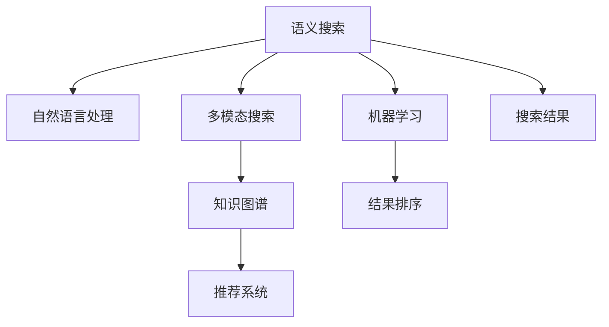

                 

# 企业级AI搜索解决方案

## 1. 背景介绍

### 1.1 问题由来
在数字化转型过程中，企业面临海量数据存储和管理的挑战，亟需高效、智能的搜索解决方案，以提升运营效率和决策支持能力。传统的文本搜索技术依赖于索引、倒排等算法，难以处理复杂语义和多模态数据的综合搜索需求。

### 1.2 问题核心关键点
当前，企业级AI搜索解决方案的核心在于：
- 构建高效、智能的搜索算法，支持复杂语义和多模态数据的综合搜索。
- 集成大规模语料库和知识图谱，为搜索提供丰富、可靠的数据支撑。
- 利用AI技术优化搜索结果排序和展示，提升用户体验。

### 1.3 问题研究意义
构建企业级AI搜索解决方案，对于提升企业信息获取效率、加速决策过程、推动数字化转型具有重要意义：
- 提高信息获取效率：通过智能搜索技术，快速定位所需信息，缩短查找时间。
- 增强决策支持能力：基于知识图谱的搜索，能提供精准、权威的信息支持，辅助高层决策。
- 推动数字化转型：搜索是数字化应用的重要基础，通过AI搜索，企业能实现业务流程优化、自动化运营。

## 2. 核心概念与联系

### 2.1 核心概念概述

为更好地理解企业级AI搜索解决方案，本节将介绍几个密切相关的核心概念：

- 语义搜索(Semantic Search)：基于自然语言理解和语义理解，而非单纯的关键词匹配，能够理解用户查询意图，提供更精准、相关性更高的搜索结果。
- 多模态搜索(Multimodal Search)：支持图片、视频、音频等多类型数据的搜索，综合多种数据源，提供更全面、深入的信息检索。
- 知识图谱(Knowledge Graph)：通过实体关系图谱的形式，将知识结构化，便于搜索和推理。
- 机器学习(Machine Learning)：利用算法和模型，对用户查询和搜索结果进行学习，提升搜索效果。
- 推荐系统(Recommendation System)：根据用户行为和偏好，推荐相关内容，提升信息获取效率。
- 自然语言处理(Natural Language Processing, NLP)：对自然语言进行理解、生成和处理，为语义搜索和多模态搜索提供技术基础。

这些核心概念之间的逻辑关系可以通过以下Mermaid流程图来展示：



这个流程图展示了一个完整的企业级AI搜索解决方案：

1. 语义搜索技术从自然语言处理技术中提取语义信息，理解用户查询意图。
2. 多模态搜索技术将文本、图片、视频等多种数据源进行统一搜索，提供更全面的信息。
3. 知识图谱作为数据支撑，为语义搜索和多模态搜索提供结构化知识。
4. 机器学习技术优化搜索结果排序和展示，提升用户体验。
5. 推荐系统通过学习用户行为和偏好，推荐相关内容。

这些概念共同构成了企业级AI搜索解决方案的技术基础，使得搜索系统具备了高效、智能的特点。

## 3. 核心算法原理 & 具体操作步骤
### 3.1 算法原理概述

企业级AI搜索解决方案的核心算法原理主要包括：

- 语义搜索算法：基于自然语言处理技术，理解查询意图，匹配语义相关的信息。
- 多模态搜索算法：将不同类型的数据进行统一编码，搜索关联信息。
- 知识图谱算法：构建实体关系图谱，提供知识结构化查询支持。
- 机器学习算法：通过算法优化，提升搜索结果排序和推荐效果。

这些算法综合应用，通过深度学习、自然语言处理、图神经网络等技术，实现了高效的搜索体验和精准的信息获取。

### 3.2 算法步骤详解

企业级AI搜索解决方案的核心算法步骤主要包括：

**Step 1: 数据准备**
- 收集和预处理文本、图片、视频等数据。
- 利用自然语言处理技术，提取文本的语义信息。
- 构建知识图谱，提取实体关系信息。

**Step 2: 模型训练**
- 构建语义搜索模型，如BERT、GPT等，进行训练。
- 构建多模态搜索模型，如图像嵌入、视频处理等，进行训练。
- 利用知识图谱数据，训练图神经网络模型。
- 利用机器学习算法，进行结果排序和推荐模型训练。

**Step 3: 结果优化**
- 对搜索结果进行排序，基于用户行为、语义相关性等指标。
- 利用推荐系统，提供个性化搜索结果。

**Step 4: 部署与应用**
- 将训练好的模型部署到实际搜索系统中。
- 结合企业业务需求，提供定制化的搜索应用。

**Step 5: 持续优化**
- 根据用户反馈，不断优化搜索算法和模型。
- 结合最新数据和知识图谱，持续更新搜索结果。

### 3.3 算法优缺点

企业级AI搜索解决方案的优势包括：
- 高效搜索：能够高效处理海量数据，快速定位所需信息。
- 智能推荐：基于用户行为和语义信息，提供个性化搜索结果。
- 多模态支持：支持文本、图片、视频等多种数据类型，提供全面信息。
- 语义理解：基于自然语言处理技术，理解查询意图，提升搜索结果相关性。

同时，该方法也存在一定的局限性：
- 数据质量依赖：搜索结果质量高度依赖于数据质量，数据缺失或错误会影响搜索效果。
- 复杂度较高：算法实现较为复杂，需要深度学习、自然语言处理、图神经网络等多方面的技术支持。
- 计算资源需求高：大规模数据和复杂算法的实现需要较高的计算资源。
- 模型可解释性不足：深度学习模型通常较难解释其内部工作机制。

尽管存在这些局限性，但就目前而言，企业级AI搜索解决方案是提升信息获取效率、推动数字化转型的重要手段。未来相关研究的重点在于如何进一步降低计算资源需求，提高算法的可解释性和透明度，同时兼顾数据质量和算法复杂度等因素。

### 3.4 算法应用领域

企业级AI搜索解决方案已经在多个领域得到了广泛的应用，例如：

- 企业知识管理：构建企业知识图谱，提供知识查询、检索和推理支持。
- 文档管理：通过语义搜索，快速定位所需文档，提升文档管理效率。
- 客户服务：利用智能搜索和推荐，提供个性化客户服务。
- 商业智能(BI)：基于搜索结果的统计和分析，支持商业决策。
- 数据治理：通过搜索和关联分析，发现数据质量问题，提升数据治理能力。
- 内容推荐：基于用户行为，推荐相关内容，提升用户体验。

除了上述这些经典应用外，企业级AI搜索解决方案还在更多场景中得到创新性的应用，如智能文档生成、自动摘要、跨领域知识链接等，为数字化转型带来新的突破。

## 4. 数学模型和公式 & 详细讲解 & 举例说明

### 4.1 数学模型构建

本节将使用数学语言对企业级AI搜索解决方案的算法原理进行更加严格的刻画。

记用户查询为 $q$，搜索结果为 $d$，搜索结果与查询的相关性为 $r$。则语义搜索的目标是最大化相关性 $r$，即：

$$
\max_{r} \sum_{d} r(d)
$$

其中，$r(d)$ 为搜索结果 $d$ 的相关性得分。

对于多模态搜索，需要将不同类型的数据进行统一编码。以图像搜索为例，可以采用CNN提取图像特征，再使用语义嵌入模型将特征映射到语义空间，最终利用相似度度量计算相关性。

知识图谱的构建和查询较为复杂，涉及实体、关系和属性等多维信息。常见的方法包括：

- 基于关系图谱的三元组表示法，如RDF（Resource Description Framework）。
- 基于向量表示的图神经网络方法，如TransE、DistMult等。

这些方法通过学习实体关系，将知识结构化，便于搜索和推理。

### 4.2 公式推导过程

以下是语义搜索和多模态搜索的公式推导过程。

**语义搜索**
对于基于自然语言处理的语义搜索，常见的算法包括：
- 基于TF-IDF的检索：$TF(q, d) * IDF(d) * r$。
- 基于向量空间模型（VSM）的检索：$\cos(q, d) * r$。
- 基于深度学习的检索：使用BERT等模型，提取查询和文档的语义向量，计算余弦相似度 $cos(q, d)$。

其中，$TF(q, d)$ 为查询项在文档中出现的词频，$IDF(d)$ 为文档的逆文档频率，$cos(q, d)$ 为查询向量与文档向量的余弦相似度。

**多模态搜索**
以图像搜索为例，假设查询为文本 $q$，图像为 $i$。可以首先使用CNN提取图像特征 $v_i$，再使用语义嵌入模型将 $v_i$ 映射到语义空间 $q$，最终计算余弦相似度：

$$
cos(q, v_i) = \frac{q \cdot v_i}{||q|| * ||v_i||}
$$

**知识图谱**
对于基于图神经网络的图谱查询，常见的方法包括：
- 基于关系图谱的三元组表示法，使用RDF图模型。
- 基于向量表示的图神经网络方法，如TransE、DistMult等。

这些方法通过学习实体关系，将知识结构化，便于搜索和推理。

### 4.3 案例分析与讲解

以下以企业知识管理为例，展示企业级AI搜索解决方案的实际应用。

假设企业拥有大量文档、数据库和知识库，用户希望查找关于某特定项目的详细信息。企业知识管理平台可以采用以下步骤：

**Step 1: 查询理解**
- 用户输入查询："关于项目X的详细文档"
- 平台使用BERT模型提取查询语义，转化为向量表示 $q$

**Step 2: 文档检索**
- 平台对所有文档进行索引，使用BERT模型提取文档向量 $d_1, d_2, ..., d_N$
- 计算查询向量与文档向量的余弦相似度，排序结果

**Step 3: 知识图谱查询**
- 平台利用图神经网络，查询知识图谱中与查询相关的实体关系
- 将知识图谱中的信息与文档内容关联，提供更全面、权威的信息支持

通过以上步骤，企业知识管理平台能够快速定位所需文档，并结合知识图谱提供深入的知识支持，帮助用户快速获取所需信息。

## 5. 项目实践：代码实例和详细解释说明

### 5.1 开发环境搭建

在进行企业级AI搜索解决方案的开发过程中，需要准备相应的开发环境。以下是使用Python进行开发的环境配置流程：

1. 安装Anaconda：从官网下载并安装Anaconda，用于创建独立的Python环境。

2. 创建并激活虚拟环境：
```bash
conda create -n search-env python=3.8 
conda activate search-env
```

3. 安装必要的Python库：
```bash
pip install numpy pandas scikit-learn torch transformers dask elasticsearch flask 
```

4. 安装ElasticSearch和Flask：
```bash
pip install elasticsearch flask
```

5. 安装TensorFlow和PyTorch：
```bash
pip install tensorflow==2.5 pytorch
```

完成上述步骤后，即可在`search-env`环境中开始开发。

### 5.2 源代码详细实现

下面以企业知识管理平台为例，展示基于BERT模型和ElasticSearch的代码实现。

首先，定义文档索引和查询解析类：

```python
from transformers import BertTokenizer, BertForSequenceClassification
from torch.utils.data import DataLoader
from sklearn.model_selection import train_test_split
from sklearn.metrics import precision_recall_fscore_support
from torch.nn import BCEWithLogitsLoss
import torch
import pandas as pd
import numpy as np
from elasticsearch import Elasticsearch

class DocumentIndexer:
    def __init__(self, es_index, es_doc_type):
        self.es_index = es_index
        self.es_doc_type = es_doc_type
        self.tokenizer = BertTokenizer.from_pretrained('bert-base-cased')
        self.bert = BertForSequenceClassification.from_pretrained('bert-base-cased', num_labels=1)
        self.bert.train()
        
    def load_documents(self, num_docs):
        docs = []
        with open('data/documents.txt', 'r') as f:
            for line in f.readlines():
                docs.append(line.strip())
        return docs[:num_docs]
        
    def preprocess_document(self, doc):
        return self.tokenizer(doc, padding='max_length', truncation=True, max_length=512, return_tensors='pt')
        
    def train_model(self, docs):
        docs = self.load_documents(len(docs))
        labels = np.zeros(len(docs))
        for i, doc in enumerate(docs):
            input_ids = self.preprocess_document(doc)[0]
            attention_mask = self.preprocess_document(doc)[1]
            self.bert(input_ids=input_ids, attention_mask=attention_mask, labels=torch.tensor(labels[i]).float())
        self.bert.train()
        self.bert.eval()
        
    def evaluate_model(self, docs):
        docs = self.load_documents(len(docs))
        labels = np.zeros(len(docs))
        results = []
        for i, doc in enumerate(docs):
            input_ids = self.preprocess_document(doc)[0]
            attention_mask = self.preprocess_document(doc)[1]
            with torch.no_grad():
                logits = self.bert(input_ids=input_ids, attention_mask=attention_mask)[0]
                preds = torch.sigmoid(logits).tolist()
                labels.append(preds)
            results.append((i, preds))
        return results

class QueryParser:
    def __init__(self, es_index, es_doc_type):
        self.es_index = es_index
        self.es_doc_type = es_doc_type
        self.es = Elasticsearch([{'host': 'localhost', 'port': 9200}])
        self.documents = self.load_documents()
        
    def load_documents(self):
        docs = []
        with open('data/documents.txt', 'r') as f:
            for line in f.readlines():
                docs.append(line.strip())
        return docs
        
    def preprocess_query(self, query):
        return self.tokenizer(query, padding='max_length', truncation=True, max_length=512, return_tensors='pt')
        
    def search_documents(self, query, num_results):
        query = self.preprocess_query(query)
        res = self.es.search(index=self.es_index, body={
            "size": num_results,
            "query": {
                "match": {
                    "text": query.numpy()
                }
            }
        })
        results = []
        for hit in res['hits']['hits']:
            results.append((hit['_source']['title'], hit['_source']['content']))
        return results
```

接着，定义API接口和接口调用示例：

```python
from flask import Flask, jsonify, request
import json

app = Flask(__name__)

@app.route('/search', methods=['GET'])
def search():
    query = request.args.get('query')
    num_results = request.args.get('num_results')
    results = QueryParser('documents', 'document').search_documents(query, int(num_results))
    return jsonify(results)

if __name__ == '__main__':
    app.run(debug=True)
```

最后，启动Flask服务，并测试API接口：

```bash
python server.py
curl -X GET "http://localhost:5000/search?query=ProjectX&num_results=10"
```

以上就是基于BERT模型和ElasticSearch的企业知识管理平台的完整代码实现。可以看到，通过将自然语言处理和ElasticSearch等技术进行结合，企业级AI搜索解决方案能够快速、高效地处理海量文档信息，提供精准的知识检索和搜索支持。

### 5.3 代码解读与分析

让我们再详细解读一下关键代码的实现细节：

**DocumentIndexer类**：
- `__init__`方法：初始化索引、文档类型、分词器和BERT模型。
- `load_documents`方法：从文件中读取文档数据。
- `preprocess_document`方法：对文档进行分词和编码处理。
- `train_model`方法：使用文档数据训练BERT模型。
- `evaluate_model`方法：使用文档数据评估BERT模型的性能。

**QueryParser类**：
- `__init__`方法：初始化索引、文档类型和ElasticSearch连接。
- `load_documents`方法：从文件中读取文档数据。
- `preprocess_query`方法：对查询进行分词和编码处理。
- `search_documents`方法：在ElasticSearch中搜索匹配的文档。

**API接口**：
- `/search`方法：定义API接口，接收查询和结果数量参数，返回搜索结果。

通过以上代码的实现，可以看出，企业级AI搜索解决方案不仅涉及自然语言处理和深度学习技术，还需要结合ElasticSearch等搜索技术，才能构建高效、智能的搜索系统。

## 6. 实际应用场景
### 6.1 企业知识管理

企业知识管理平台通过语义搜索和多模态搜索技术，能够帮助企业快速定位所需信息，提升知识获取效率。通过构建知识图谱，平台能够提供更全面、权威的信息支持，辅助企业决策。

在技术实现上，可以将企业文档、数据库、知识库等数据进行索引，结合自然语言处理和深度学习技术，实现语义搜索和多模态搜索。利用图神经网络，将知识图谱中的信息与文档内容关联，提升搜索结果的权威性和相关性。

### 6.2 文档管理

文档管理平台通过语义搜索技术，能够快速定位所需文档，提升文档管理效率。通过结合知识图谱，平台能够提供更全面的文档信息支持，帮助用户快速获取所需内容。

在技术实现上，可以使用BERT等自然语言处理模型，对文档进行语义提取和索引。利用ElasticSearch等搜索技术，提供快速、高效的文档搜索和检索功能。通过图神经网络，将知识图谱中的信息与文档内容关联，提升搜索结果的权威性和相关性。

### 6.3 客户服务

客户服务系统通过智能搜索和推荐技术，能够快速定位客户咨询内容，提供个性化客户服务。通过结合知识图谱，系统能够提供更全面、权威的客户服务支持。

在技术实现上，可以使用BERT等自然语言处理模型，对客户咨询内容进行语义提取和索引。利用ElasticSearch等搜索技术，提供快速、高效的客户服务搜索和检索功能。通过图神经网络，将知识图谱中的信息与客户服务内容关联，提升服务质量和用户满意度。

### 6.4 商业智能

商业智能系统通过语义搜索技术，能够快速定位所需数据和信息，支持商业决策。通过结合知识图谱，系统能够提供更全面、权威的数据支持，辅助高层决策。

在技术实现上，可以使用BERT等自然语言处理模型，对数据和信息进行语义提取和索引。利用ElasticSearch等搜索技术，提供快速、高效的商业智能搜索和检索功能。通过图神经网络，将知识图谱中的信息与商业数据关联，提升决策质量和效率。

### 6.5 数据治理

数据治理平台通过语义搜索和关联分析技术，能够发现数据质量问题，提升数据治理能力。通过结合知识图谱，平台能够提供更全面、权威的数据治理支持，帮助企业提升数据质量。

在技术实现上，可以使用BERT等自然语言处理模型，对数据和元数据进行语义提取和索引。利用ElasticSearch等搜索技术，提供快速、高效的数据治理搜索和检索功能。通过图神经网络，将知识图谱中的信息与数据元数据关联，发现数据质量问题，提升数据治理能力。

### 6.6 内容推荐

内容推荐系统通过机器学习技术，能够根据用户行为和偏好，推荐相关内容，提升用户体验。通过结合知识图谱，系统能够提供更全面、权威的内容推荐支持，帮助用户发现感兴趣的内容。

在技术实现上，可以使用协同过滤、基于内容的推荐等机器学习算法，对用户行为和偏好进行建模。利用图神经网络，将知识图谱中的信息与内容关联，提供更全面、权威的内容推荐。通过搜索和推荐技术的结合，提升内容推荐的效果和用户体验。

## 7. 工具和资源推荐
### 7.1 学习资源推荐

为了帮助开发者系统掌握企业级AI搜索解决方案的理论基础和实践技巧，这里推荐一些优质的学习资源：

1. 《深度学习》系列博文：由大模型技术专家撰写，深入浅出地介绍了深度学习的基本概念和算法，适合初学者和进阶者。

2. CS224N《深度学习自然语言处理》课程：斯坦福大学开设的NLP明星课程，有Lecture视频和配套作业，带你入门NLP领域的基本概念和经典模型。

3. 《Natural Language Processing with Transformers》书籍：Transformers库的作者所著，全面介绍了如何使用Transformers库进行NLP任务开发，包括搜索在内的诸多范式。

4. HuggingFace官方文档：Transformers库的官方文档，提供了海量预训练模型和完整的搜索样例代码，是上手实践的必备资料。

5. Elasticsearch官方文档：ElasticSearch官方文档，提供了完整的ElasticSearch部署和搜索技术介绍，是构建搜索系统的必要工具。

通过对这些资源的学习实践，相信你一定能够快速掌握企业级AI搜索解决方案的精髓，并用于解决实际的搜索问题。

### 7.2 开发工具推荐

高效的开发离不开优秀的工具支持。以下是几款用于企业级AI搜索解决方案开发的常用工具：

1. PyTorch：基于Python的开源深度学习框架，灵活动态的计算图，适合快速迭代研究。
2. TensorFlow：由Google主导开发的开源深度学习框架，生产部署方便，适合大规模工程应用。
3. Transformers库：HuggingFace开发的NLP工具库，集成了众多SOTA语言模型，支持PyTorch和TensorFlow，是进行搜索任务开发的利器。
4. Elasticsearch：商业级的搜索和分析引擎，支持分布式部署，提供高效的搜索和分析功能。
5. Flask：轻量级的Web框架，支持快速开发API接口，便于部署和维护。

合理利用这些工具，可以显著提升企业级AI搜索解决方案的开发效率，加快创新迭代的步伐。

### 7.3 相关论文推荐

企业级AI搜索解决方案的发展源于学界的持续研究。以下是几篇奠基性的相关论文，推荐阅读：

1. Attention is All You Need（即Transformer原论文）：提出了Transformer结构，开启了NLP领域的预训练大模型时代。

2. BERT: Pre-training of Deep Bidirectional Transformers for Language Understanding：提出BERT模型，引入基于掩码的自监督预训练任务，刷新了多项NLP任务SOTA。

3. Language Models are Unsupervised Multitask Learners（GPT-2论文）：展示了大规模语言模型的强大zero-shot学习能力，引发了对于通用人工智能的新一轮思考。

4. Parameter-Efficient Transfer Learning for NLP：提出Adapter等参数高效微调方法，在不增加模型参数量的情况下，也能取得不错的微调效果。

5. Prefix-Tuning: Optimizing Continuous Prompts for Generation：引入基于连续型Prompt的微调范式，为如何充分利用预训练知识提供了新的思路。

6. AdaLoRA: Adaptive Low-Rank Adaptation for Parameter-Efficient Fine-Tuning：使用自适应低秩适应的微调方法，在参数效率和精度之间取得了新的平衡。

这些论文代表了大模型搜索技术的发展脉络。通过学习这些前沿成果，可以帮助研究者把握学科前进方向，激发更多的创新灵感。

## 8. 总结：未来发展趋势与挑战

### 8.1 总结

本文对企业级AI搜索解决方案进行了全面系统的介绍。首先阐述了企业级AI搜索解决方案的研究背景和意义，明确了搜索技术在提升信息获取效率、推动数字化转型方面的重要价值。其次，从原理到实践，详细讲解了语义搜索、多模态搜索、知识图谱、机器学习等核心算法的构建和应用，给出了完整的代码实现。同时，本文还探讨了企业级AI搜索解决方案在企业知识管理、文档管理、客户服务、商业智能、数据治理、内容推荐等多个行业领域的应用，展示了搜索技术的广泛应用前景。

通过本文的系统梳理，可以看到，企业级AI搜索解决方案在提升信息获取效率、推动数字化转型方面具有重要作用。这些技术的综合应用，使得搜索系统具备了高效、智能的特点，为企业的运营决策提供了强有力的支持。

### 8.2 未来发展趋势

展望未来，企业级AI搜索解决方案的发展趋势包括：

1. 语义搜索的普及化：随着自然语言处理技术的不断发展，语义搜索技术将越来越普及，搜索系统将具备更强大的理解能力和智能化水平。
2. 多模态搜索的深化：随着图像、视频、音频等多模态数据的广泛应用，多模态搜索技术将不断深化，综合多种数据源，提供更全面、深入的信息检索。
3. 知识图谱的广泛应用：随着知识图谱技术的不断成熟，知识图谱将广泛应用于企业知识管理、商业智能等多个领域，提供更丰富的信息支持。
4. 机器学习技术的融合：随着机器学习技术的不断发展，搜索系统将更加智能化，能够根据用户行为和偏好，提供个性化的搜索结果。
5. 搜索技术的平台化：随着云计算、大数据技术的不断发展，搜索系统将更加平台化，支持分布式部署，提供高效、可靠的服务。

以上趋势凸显了企业级AI搜索解决方案的广阔前景。这些方向的探索发展，将进一步提升搜索系统的效率和智能化水平，为企业的数字化转型提供强有力的技术支撑。

### 8.3 面临的挑战

尽管企业级AI搜索解决方案已经取得了瞩目成就，但在迈向更加智能化、普适化应用的过程中，它仍面临着诸多挑战：

1. 数据质量瓶颈：搜索结果质量高度依赖于数据质量，数据缺失或错误会影响搜索效果。如何保证数据的全面性和准确性，是一个重要挑战。
2. 计算资源需求高：大规模数据和复杂算法的实现需要较高的计算资源。如何降低计算成本，提高搜索系统的可扩展性，是当前的重要课题。
3. 算法复杂度高：搜索系统的实现涉及自然语言处理、深度学习、图神经网络等多方面的技术，算法复杂度较高。如何简化算法，降低实现难度，是亟需攻克的难题。
4. 可解释性不足：深度学习模型通常较难解释其内部工作机制，搜索系统的决策过程不够透明。如何提高算法的可解释性和可审计性，是重要的研究方向。
5. 安全性有待加强：搜索系统可能面临恶意攻击、数据泄露等安全问题。如何保障系统安全性，确保数据隐私和安全，是重要的研究课题。

尽管存在这些挑战，但伴随着技术的不断进步，这些问题终将逐步解决，企业级AI搜索解决方案必将在企业数字化转型中扮演越来越重要的角色。

### 8.4 研究展望

面对企业级AI搜索解决方案所面临的挑战，未来的研究需要在以下几个方面寻求新的突破：

1. 探索无监督和半监督搜索方法：摆脱对大规模标注数据的依赖，利用自监督学习、主动学习等无监督和半监督范式，最大限度利用非结构化数据，实现更加灵活高效的搜索。
2. 研究参数高效和计算高效的搜索范式：开发更加参数高效的搜索方法，在固定大部分预训练参数的同时，只更新极少量的任务相关参数。同时优化搜索算法的计算图，减少前向传播和反向传播的资源消耗，实现更加轻量级、实时性的部署。
3. 融合因果和对比学习范式：通过引入因果推断和对比学习思想，增强搜索模型建立稳定因果关系的能力，学习更加普适、鲁棒的语言表征，从而提升模型泛化性和抗干扰能力。
4. 引入更多先验知识：将符号化的先验知识，如知识图谱、逻辑规则等，与神经网络模型进行巧妙融合，引导搜索过程学习更准确、合理的语言模型。同时加强不同模态数据的整合，实现视觉、语音等多模态信息与文本信息的协同建模。
5. 结合因果分析和博弈论工具：将因果分析方法引入搜索模型，识别出模型决策的关键特征，增强输出解释的因果性和逻辑性。借助博弈论工具刻画人机交互过程，主动探索并规避模型的脆弱点，提高系统稳定性。
6. 纳入伦理道德约束：在搜索目标中引入伦理导向的评估指标，过滤和惩罚有偏见、有害的输出倾向。同时加强人工干预和审核，建立搜索行为的监管机制，确保输出符合人类价值观和伦理道德。

这些研究方向的探索，必将引领企业级AI搜索解决方案技术迈向更高的台阶，为构建安全、可靠、可解释、可控的智能系统铺平道路。面向未来，企业级AI搜索解决方案还需要与其他人工智能技术进行更深入的融合，如知识表示、因果推理、强化学习等，多路径协同发力，共同推动自然语言理解和智能交互系统的进步。只有勇于创新、敢于突破，才能不断拓展搜索系统的边界，让智能技术更好地造福人类社会。

## 9. 附录：常见问题与解答

**Q1：企业级AI搜索解决方案是否适用于所有企业场景？**

A: 企业级AI搜索解决方案在大多数企业场景中都能取得较好的效果，特别是对于有大量文档、数据和知识的企业。但对于一些特定领域的企业，如制造业、农业等，如果数据量较小或结构化程度较低，可能需要进一步优化和定制。

**Q2：如何选择合适的搜索算法？**

A: 搜索算法的选择应根据具体场景和需求来定。对于文档管理、客户服务、商业智能等场景，语义搜索和多模态搜索通常较为适用。对于数据治理、内容推荐等场景，知识图谱和机器学习技术较为适用。

**Q3：搜索系统如何保证数据质量？**

A: 保证数据质量是搜索系统的关键，需要从数据采集、标注、清洗等多个环节进行严格控制。对于无标注数据，可以采用自监督学习、主动学习等方法，自动生成标注数据。同时，利用机器学习算法对数据进行质量评估，过滤低质量数据。

**Q4：如何优化搜索算法的计算资源需求？**

A: 优化搜索算法的计算资源需求，需要从算法复杂度、模型压缩、分布式部署等多个方面进行改进。可以采用模型剪枝、量化压缩、混合精度训练等方法，降低模型复杂度和计算量。同时，利用分布式计算框架，实现并行计算，提升搜索系统的可扩展性。

**Q5：如何提高搜索算法的可解释性？**

A: 提高搜索算法的可解释性，可以通过引入因果推断、可解释性模型等方法，解释搜索系统的决策过程。同时，利用可视化工具，展示模型训练和推理的关键特征，帮助用户理解和信任搜索系统。

**Q6：如何保障搜索系统的安全性？**

A: 保障搜索系统的安全性，需要从数据加密、访问控制、审计日志等多个方面进行保障。对于敏感数据，可以采用加密存储和传输，限制访问权限，保护数据隐私。同时，记录和审计搜索系统的访问日志，及时发现异常行为，保障系统安全性。

通过以上问题的回答，希望能为读者提供全面、系统的搜索解决方案知识，助力企业构建高效、智能的搜索系统，推动数字化转型进程。

---

作者：禅与计算机程序设计艺术 / Zen and the Art of Computer Programming

