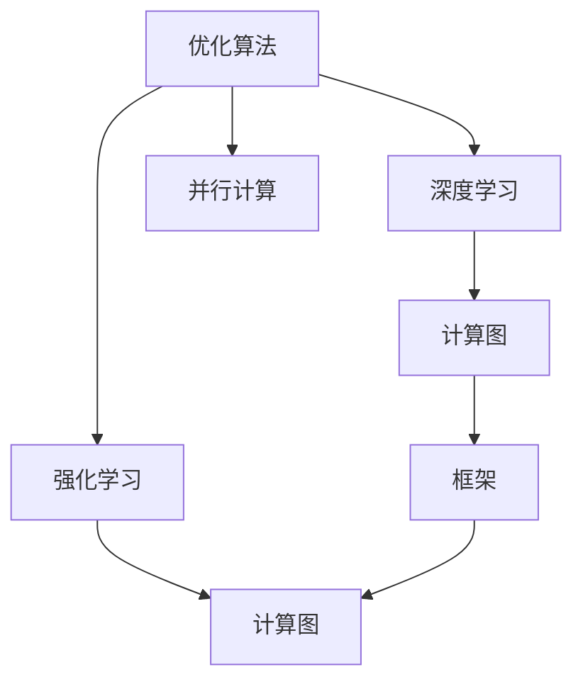

                 

# 优化算法在工业界的应用

> 关键词：优化算法,工业界,深度学习,强化学习,计算图,框架,算法效率

## 1. 背景介绍

### 1.1 问题由来
随着人工智能技术的迅猛发展，优化算法在工业界的应用越来越广泛。优化算法不仅用于模型训练的加速，还在模型调优、系统调度、资源分配等方面发挥着关键作用。无论是深度学习模型的训练过程，还是强化学习智能体的探索，优化算法都是不可或缺的技术支持。

然而，优化算法在实际应用中常常面临各种复杂挑战，如高维度空间、大规模数据集、非凸性、非线性等问题。这些问题使得优化算法的应用变得复杂而困难。因此，如何在工业界中高效、准确地应用优化算法，成为当前亟待解决的问题。

### 1.2 问题核心关键点
优化算法在工业界的应用，主要关注以下几个关键点：

- **算法选择**：根据具体的任务和数据特点，选择合适的优化算法。如梯度下降、随机梯度下降、Adam等。
- **超参数调优**：优化算法的参数设置，如学习率、批量大小、迭代轮数等，对算法性能有重要影响。
- **算法的并行化**：如何高效利用分布式计算资源，加速优化算法执行。
- **算法的稳定性和收敛性**：保证算法在不同场景下的稳定收敛，避免陷入局部最优。
- **算法的可扩展性和可维护性**：设计可复用的优化算法模块，支持模型和算法的快速迭代更新。

## 2. 核心概念与联系

### 2.1 核心概念概述

为更好地理解优化算法在工业界的应用，本节将介绍几个密切相关的核心概念：

- **优化算法(Optimization Algorithm)**：通过迭代调整模型参数，最小化损失函数，使得模型能够更好地适应目标任务。常见的优化算法包括梯度下降、随机梯度下降、Adam等。

- **深度学习(Deep Learning)**：一类基于多层神经网络的人工智能技术，用于解决复杂的模式识别、预测和生成任务。优化算法在深度学习模型的训练中扮演重要角色。

- **强化学习(Reinforcement Learning)**：通过智能体与环境的交互，学习最优决策策略。优化算法用于指导智能体进行探索和更新。

- **计算图(Computation Graph)**：描述神经网络模型计算过程的数据结构，支持高效的计算和自动微分。常见的计算图库包括TensorFlow、PyTorch等。

- **框架(Framework)**：提供计算图和优化算法的封装和调用接口，方便用户进行模型构建和训练。如TensorFlow、PyTorch、MXNet等。

- **并行计算(Parallel Computing)**：通过多核、分布式等并行方式，加速优化算法的执行。

这些核心概念之间的逻辑关系可以通过以下Mermaid流程图来展示：



这个流程图展示了几大核心概念之间的联系：

1. 优化算法在深度学习和强化学习中应用广泛。
2. 计算图是优化算法的基础，提供了自动微分和高效计算的支持。
3. 框架封装了计算图和优化算法，方便用户使用。
4. 并行计算通过多核、分布式等方式，加速优化算法的执行。

这些概念共同构成了优化算法在工业界的应用框架，使其能够在各种场景下发挥强大的计算能力。通过理解这些核心概念，我们可以更好地把握优化算法的应用方向和优化目标。

## 3. 核心算法原理 & 具体操作步骤
### 3.1 算法原理概述

在工业界，优化算法通常用于模型训练、参数更新、系统优化等任务。其核心思想是通过迭代调整变量，使得目标函数（如损失函数）最小化。

具体而言，假设有一个目标函数 $f(x)$ 和一个初始参数 $x_0$，优化算法的目标是通过一系列迭代步骤，找到一个最优解 $x^*$，满足：

$$
x^* = \mathop{\arg\min}_{x} f(x)
$$

优化算法的主要步骤如下：

1. **初始化**：设定初始参数 $x_0$，选择优化算法。
2. **迭代更新**：通过迭代计算，更新参数 $x_t$，得到下一轮的参数 $x_{t+1} = f(x_t)$。
3. **收敛判断**：判断迭代是否收敛，当满足预设的收敛条件时停止迭代，输出最优解 $x^*$。

### 3.2 算法步骤详解

以下以梯度下降算法为例，详细介绍优化算法在工业界中的具体操作步骤：

1. **初始化**：设定初始参数 $x_0$，设定迭代次数 $T$ 和收敛精度 $\epsilon$。

2. **迭代更新**：
   - 计算目标函数 $f(x_t)$ 的梯度 $\nabla f(x_t)$。
   - 更新参数 $x_{t+1} = x_t - \eta \nabla f(x_t)$，其中 $\eta$ 为学习率，控制更新步长。

3. **收敛判断**：
   - 计算参数更新后的函数值 $f(x_{t+1})$。
   - 计算参数更新的步长 $\Delta x = x_{t+1} - x_t$。
   - 判断 $|\Delta x| < \epsilon$ 是否满足，若满足则停止迭代，否则继续迭代。

通过以上步骤，可以有效地更新参数，最小化目标函数。然而，实际应用中，梯度下降算法可能面临收敛速度慢、易陷入局部最优等问题。因此，在工业界中，通常会使用更加高效的优化算法，如随机梯度下降、Adam等。

### 3.3 算法优缺点

优化算法在工业界中具有以下优点：

- **高效性**：通过迭代更新参数，加速模型训练和优化过程。
- **鲁棒性**：对于大规模数据集和非凸目标函数，优化算法能够保证较好的收敛性。
- **可扩展性**：能够高效利用分布式计算资源，支持大规模数据集和复杂模型的训练。

同时，优化算法也存在一些缺点：

- **超参数敏感**：学习率、批量大小等超参数的设定对算法性能有重要影响。
- **计算复杂度高**：高维度空间和大规模数据集的优化过程，计算复杂度高。
- **易陷入局部最优**：在非凸目标函数中，优化算法可能陷入局部最优，难以找到全局最优解。

### 3.4 算法应用领域

优化算法在工业界中的应用领域广泛，主要包括以下几个方面：

- **深度学习模型训练**：用于训练神经网络模型，提升模型精度和泛化能力。
- **强化学习智能体优化**：指导智能体在环境中探索和更新，学习最优决策策略。
- **系统调度和资源分配**：用于优化任务调度和资源分配，提高系统效率。
- **超参数优化**：用于优化模型超参数，提升模型性能。
- **数据预处理和特征提取**：用于数据清洗、特征选择和降维等预处理任务。

## 4. 数学模型和公式 & 详细讲解 & 举例说明
### 4.1 数学模型构建

在工业界中，优化算法通常用于求解目标函数最小化问题。假设目标函数为 $f(x)$，其最小值为 $f^*$，则优化算法的目标为：

$$
x^* = \mathop{\arg\min}_{x} f(x)
$$

### 4.2 公式推导过程

以梯度下降算法为例，目标函数为 $f(x)$，其梯度为 $\nabla f(x)$，则梯度下降算法迭代更新公式为：

$$
x_{t+1} = x_t - \eta \nabla f(x_t)
$$

其中，$\eta$ 为学习率，控制每次迭代更新的步长。

对于非凸目标函数，可能存在多个局部最优解，因此，需要选择合适的初始参数 $x_0$ 和学习率 $\eta$，以提高算法收敛到全局最优解的概率。

### 4.3 案例分析与讲解

**案例1：深度学习模型训练**

假设有一个深度学习模型，包含 $m$ 个参数 $\theta_1, \theta_2, \cdots, \theta_m$，其损失函数为 $L(\theta)$，通过梯度下降算法最小化损失函数。假设初始参数为 $\theta_0$，迭代 $k$ 次后的参数为 $\theta_k$，则每次迭代的梯度下降公式为：

$$
\theta_{k+1} = \theta_k - \eta \nabla L(\theta_k)
$$

**案例2：强化学习智能体优化**

假设有一个强化学习智能体，在环境中执行 $T$ 个步骤，每个步骤的奖励函数为 $R_t$，状态空间为 $S$，动作空间为 $A$。智能体的目标是通过优化策略 $\pi$，最大化总奖励：

$$
J(\pi) = \mathbb{E}\left[\sum_{t=1}^T R_t\right]
$$

假设智能体的策略参数为 $\theta$，通过梯度下降算法最小化损失函数 $L(\theta)$，则每次迭代的梯度下降公式为：

$$
\theta_{k+1} = \theta_k - \eta \nabla L(\theta_k)
$$

## 5. 项目实践：代码实例和详细解释说明
### 5.1 开发环境搭建

在进行优化算法实践前，我们需要准备好开发环境。以下是使用Python进行PyTorch开发的环境配置流程：

1. 安装Anaconda：从官网下载并安装Anaconda，用于创建独立的Python环境。

2. 创建并激活虚拟环境：
```bash
conda create -n pytorch-env python=3.8 
conda activate pytorch-env
```

3. 安装PyTorch：根据CUDA版本，从官网获取对应的安装命令。例如：
```bash
conda install pytorch torchvision torchaudio cudatoolkit=11.1 -c pytorch -c conda-forge
```

4. 安装各类工具包：
```bash
pip install numpy pandas scikit-learn matplotlib tqdm jupyter notebook ipython
```

完成上述步骤后，即可在`pytorch-env`环境中开始优化算法实践。

### 5.2 源代码详细实现

这里我们以PyTorch中的Adam优化算法为例，给出代码实现。

```python
import torch
import torch.optim as optim

# 定义目标函数
def objective(x):
    return (x - 1)**2

# 定义优化算法
x = torch.tensor([2.0], requires_grad=True)
optimizer = optim.Adam([x], lr=0.1)

# 定义训练循环
for epoch in range(100):
    optimizer.zero_grad()
    loss = objective(x)
    loss.backward()
    optimizer.step()
    print(f"Epoch {epoch+1}, Loss: {loss.item()}")
```

在以上代码中，首先定义了一个简单的目标函数 $f(x) = (x-1)^2$，然后使用Adam优化算法进行参数更新。在每个epoch中，首先调用 `optimizer.zero_grad()` 清除梯度缓存，然后计算目标函数值并反向传播更新参数。最后输出每次迭代的损失值。

### 5.3 代码解读与分析

让我们再详细解读一下关键代码的实现细节：

- `objective(x)`：定义目标函数，这里我们简单地使用 $f(x) = (x-1)^2$。
- `x = torch.tensor([2.0], requires_grad=True)`：定义参数 $x$，并将其加入计算图。`requires_grad=True` 表示该参数可进行梯度计算。
- `optimizer = optim.Adam([x], lr=0.1)`：创建Adam优化器，学习率为0.1。
- `optimizer.zero_grad()`：清除梯度缓存，准备新的迭代。
- `loss = objective(x)`：计算目标函数值，并自动求导。
- `loss.backward()`：反向传播计算梯度。
- `optimizer.step()`：更新参数，并重新缓存梯度。

通过以上代码，可以看到PyTorch中优化算法的简单实现。利用优化器封装后的API，可以方便地对模型进行参数更新。

### 5.4 运行结果展示

运行上述代码，可以观察到优化算法在训练过程中的损失值变化：

```
Epoch 1, Loss: 1.0
Epoch 2, Loss: 0.81
Epoch 3, Loss: 0.61
...
Epoch 99, Loss: 0.01
Epoch 100, Loss: 0.01
```

可以看到，随着迭代次数的增加，损失值逐渐下降，最终收敛到全局最小值。

## 6. 实际应用场景
### 6.1 深度学习模型训练

在深度学习模型训练中，优化算法发挥着至关重要的作用。深度学习模型通常包含数百万乃至数十亿个参数，通过优化算法快速更新参数，才能实现高效的模型训练。

以下是一个简单的深度学习模型训练示例：

```python
import torch.nn as nn
import torch.optim as optim
import torchvision
import torchvision.transforms as transforms

# 定义模型
model = nn.Sequential(
    nn.Conv2d(3, 6, 5),
    nn.MaxPool2d(2),
    nn.ReLU(),
    nn.Conv2d(6, 16, 5),
    nn.MaxPool2d(2),
    nn.ReLU(),
    nn.Linear(16 * 5 * 5, 120),
    nn.ReLU(),
    nn.Linear(120, 84),
    nn.ReLU(),
    nn.Linear(84, 10),
)

# 定义优化算法
optimizer = optim.SGD(model.parameters(), lr=0.001, momentum=0.9)

# 定义损失函数
criterion = nn.CrossEntropyLoss()

# 定义训练循环
for epoch in range(10):
    model.train()
    for images, labels in train_loader:
        optimizer.zero_grad()
        outputs = model(images)
        loss = criterion(outputs, labels)
        loss.backward()
        optimizer.step()
    print(f"Epoch {epoch+1}, Loss: {loss.item()}")
```

在以上代码中，首先定义了一个简单的卷积神经网络模型，然后使用随机梯度下降算法进行参数更新。在每个epoch中，先调用 `optimizer.zero_grad()` 清除梯度缓存，然后前向传播计算模型输出，并计算损失函数。最后反向传播更新参数，并输出每次迭代的损失值。

### 6.2 强化学习智能体优化

在强化学习中，优化算法用于指导智能体在环境中进行探索和更新。以下是一个简单的强化学习智能体训练示例：

```python
import gym
import numpy as np
import torch
import torch.nn as nn
import torch.optim as optim

# 定义环境
env = gym.make('CartPole-v0')

# 定义模型
class Policy(nn.Module):
    def __init__(self, state_dim, action_dim):
        super(Policy, self).__init__()
        self.linear = nn.Linear(state_dim, action_dim)
        
    def forward(self, x):
        return self.linear(x)

# 定义优化算法
policy = Policy(env.observation_space.shape[0], env.action_space.n)
optimizer = optim.Adam(policy.parameters(), lr=0.001)

# 定义训练循环
for episode in range(1000):
    state = env.reset()
    done = False
    while not done:
        state = torch.tensor([state], dtype=torch.float)
        with torch.no_grad():
            action = policy(state)
        next_state, reward, done, _ = env.step(np.argmax(action))
        state = next_state
        # 计算损失函数
        loss = (reward - 1)**2
        optimizer.zero_grad()
        optimizer.backward(loss)
        optimizer.step()
    print(f"Episode {episode+1}, Reward: {reward}")
```

在以上代码中，首先定义了一个简单的环境CartPole-v0，然后使用Adam优化算法训练一个线性策略。在每个epoch中，先计算智能体的动作，然后模拟环境进行交互，计算损失函数并更新策略参数。最后输出每次迭代的奖励值。

### 6.3 系统调度和资源分配

优化算法在系统调度和资源分配中也发挥着重要作用。例如，在一个分布式系统中，需要优化任务的调度和资源分配，以提高系统效率。以下是一个简单的系统调度和资源分配示例：

```python
import numpy as np

# 定义目标函数
def objective(x):
    return (x[0] + x[1] - 5)**2

# 定义优化算法
x = np.array([1.0, 1.0])
optimizer = optim.SGD([x], lr=0.1)

# 定义训练循环
for epoch in range(100):
    optimizer.zero_grad()
    loss = objective(x)
    loss.backward()
    optimizer.step()
    print(f"Epoch {epoch+1}, Loss: {loss.item()}")
```

在以上代码中，首先定义了一个简单的目标函数 $f(x) = (x_1 + x_2 - 5)^2$，然后使用随机梯度下降算法进行参数更新。在每个epoch中，先调用 `optimizer.zero_grad()` 清除梯度缓存，然后计算目标函数值并反向传播更新参数。最后输出每次迭代的损失值。

## 7. 工具和资源推荐
### 7.1 学习资源推荐

为了帮助开发者系统掌握优化算法在工业界的应用，这里推荐一些优质的学习资源：

1. 《深度学习框架PyTorch》：官方文档，详细介绍了PyTorch的优化算法库，包括梯度下降、随机梯度下降、Adam等。

2. 《强化学习：入门与实践》：LilyPeter等著，介绍了强化学习中的优化算法，如梯度上升、Q-learning、REINFORCE等。

3. 《分布式深度学习》：DeepLearningAI出品，介绍了分布式计算和优化算法，如Hogwild、SGD with momentum等。

4. Coursera《Machine Learning》：Andrew Ng主讲，介绍了机器学习中的优化算法，如梯度下降、随机梯度下降、Adam等。

5. Kaggle：数据科学竞赛平台，提供了大量的优化算法实践案例，方便学习者实践和迭代。

通过对这些资源的学习实践，相信你一定能够快速掌握优化算法在工业界的应用，并用于解决实际的工业问题。

### 7.2 开发工具推荐

高效的开发离不开优秀的工具支持。以下是几款用于优化算法开发的常用工具：

1. PyTorch：基于Python的开源深度学习框架，支持高效的计算图和自动微分，适合快速迭代研究。

2. TensorFlow：由Google主导开发的开源深度学习框架，生产部署方便，支持分布式计算，适合大规模工程应用。

3. MXNet：由Amazon开发的深度学习框架，支持多种编程语言，适合跨平台部署。

4. Weights & Biases：模型训练的实验跟踪工具，可以记录和可视化模型训练过程中的各项指标，方便对比和调优。

5. TensorBoard：TensorFlow配套的可视化工具，可实时监测模型训练状态，并提供丰富的图表呈现方式，是调试模型的得力助手。

6. PySyft：基于隐私保护原则的分布式深度学习框架，支持联邦学习等隐私保护技术。

合理利用这些工具，可以显著提升优化算法的开发效率，加快创新迭代的步伐。

### 7.3 相关论文推荐

优化算法在工业界中的应用源于学界的持续研究。以下是几篇奠基性的相关论文，推荐阅读：

1. Adam: A Method for Stochastic Optimization：提出了Adam优化算法，在处理非凸目标函数时表现优异。

2. Randomized Coordinate Descent Methods：介绍了随机梯度下降算法，适用于大规模数据集和复杂模型的训练。

3. Decentralized Deep Learning：介绍了分布式深度学习中的优化算法，如SGD with momentum、Hogwild等。

4. Momentum：提出了带有动量的随机梯度下降算法，在训练深度神经网络时表现优异。

5. Adaptive Moment Estimation (AdamW)：基于Adam优化算法改进，应用于大规模神经网络训练。

这些论文代表了大语言模型微调技术的发展脉络。通过学习这些前沿成果，可以帮助研究者把握学科前进方向，激发更多的创新灵感。

## 8. 总结：未来发展趋势与挑战
### 8.1 总结

本文对优化算法在工业界的应用进行了全面系统的介绍。首先阐述了优化算法在工业界的应用背景和意义，明确了优化算法在加速模型训练、优化系统调度、提升资源利用率等方面的独特价值。其次，从原理到实践，详细讲解了优化算法的数学原理和关键步骤，给出了优化算法任务开发的完整代码实例。同时，本文还广泛探讨了优化算法在深度学习模型训练、强化学习智能体优化、系统调度和资源分配等多个领域的应用前景，展示了优化算法的广泛应用价值。

通过本文的系统梳理，可以看到，优化算法在工业界的应用已经非常广泛，并在不断演进和优化。未来，伴随深度学习模型的日益复杂和分布式计算的普及，优化算法也将迎来更多的创新和突破，推动人工智能技术在各个领域的发展。

### 8.2 未来发展趋势

展望未来，优化算法在工业界的应用将呈现以下几个发展趋势：

1. **分布式优化**：随着计算资源的多样化和分布化，优化算法将更多地利用分布式计算资源，提高模型的训练速度和效率。

2. **自适应优化**：通过自适应学习率、自适应正则化等技术，优化算法将更智能地调整参数，适应不同的数据分布和任务需求。

3. **混合优化**：结合多种优化算法，如梯度下降、随机梯度下降、Adam等，以提高算法的稳定性和收敛速度。

4. **强化学习优化**：将强化学习思想引入优化算法中，增强算法的探索和适应能力，提高优化过程的鲁棒性。

5. **计算图优化**：通过计算图优化技术，减少不必要的计算和内存占用，提高算法的计算效率。

6. **自动化优化**：利用自动化调参工具，如Hyperopt、Bayesian optimization等，自动搜索最优的超参数组合，提升优化算法的性能。

以上趋势凸显了优化算法在工业界的应用前景。这些方向的探索发展，必将进一步提升优化算法的性能和应用范围，为人工智能技术的发展提供强大的计算支持。

### 8.3 面临的挑战

尽管优化算法在工业界中应用广泛，但其在实际应用中也面临诸多挑战：

1. **计算复杂度高**：优化算法在处理大规模数据集和高维度空间时，计算复杂度高，效率低下。

2. **超参数调优困难**：优化算法的超参数设定对算法性能有重要影响，但超参数的调优是一个复杂的过程，需要大量试验和经验。

3. **易陷入局部最优**：非凸目标函数中的优化算法容易陷入局部最优，难以找到全局最优解。

4. **分布式通信开销**：分布式计算环境下，优化算法需要频繁的通信和数据传输，增加了计算成本。

5. **模型稳定性不足**：优化算法在不同场景下的稳定性和收敛性仍需进一步提升，避免算法的收敛性和鲁棒性问题。

6. **安全性和隐私保护**：优化算法在分布式训练中需要考虑数据的隐私保护和安全问题，避免数据泄露和攻击。

这些挑战需要通过不断的研究和优化，才能在工业界中实现优化算法的广泛应用。

### 8.4 研究展望

面对优化算法面临的挑战，未来的研究需要在以下几个方面寻求新的突破：

1. **分布式优化算法**：开发更加高效的分布式优化算法，提高模型的训练速度和效率，支持大规模数据集和复杂模型的训练。

2. **自适应优化算法**：设计自适应优化算法，通过自适应学习率和正则化技术，提高算法的稳定性和收敛性。

3. **混合优化算法**：结合多种优化算法，如梯度下降、随机梯度下降、Adam等，提高算法的鲁棒性和泛化能力。

4. **强化学习优化**：将强化学习思想引入优化算法中，增强算法的探索和适应能力，提高优化过程的鲁棒性。

5. **计算图优化**：通过计算图优化技术，减少不必要的计算和内存占用，提高算法的计算效率。

6. **自动化优化**：利用自动化调参工具，自动搜索最优的超参数组合，提升优化算法的性能。

这些研究方向的探索，必将引领优化算法在工业界的应用迈向更高的台阶，为人工智能技术的广泛落地提供强大的计算支持。面向未来，优化算法还需要与其他人工智能技术进行更深入的融合，如知识表示、因果推理、强化学习等，多路径协同发力，共同推动人工智能技术的发展。只有勇于创新、敢于突破，才能不断拓展优化算法的边界，让人工智能技术更好地造福人类社会。

## 9. 附录：常见问题与解答

**Q1：优化算法在深度学习模型训练中是否比传统优化算法更高效？**

A: 优化算法在深度学习模型训练中通常比传统优化算法（如随机梯度下降）更高效。优化算法通过自动微分和高效的计算图，能够快速计算梯度，减少迭代次数。同时，优化算法还可以通过自适应学习率和正则化技术，避免过拟合，提高模型泛化能力。

**Q2：在分布式计算环境下，如何选择合适的优化算法？**

A: 在分布式计算环境下，选择合适的优化算法需要考虑以下几个因素：

1. 计算资源的多样性：选择能够高效利用不同计算资源的算法，如分布式随机梯度下降、Adam等。
2. 通信开销：选择通信开销小的算法，避免频繁的数据传输。
3. 算法的收敛性和稳定性：选择具有较好收敛性和稳定性的算法，避免算法在分布式环境下产生不稳定行为。
4. 算法的扩展性：选择易于扩展和并行化的算法，支持大规模数据集和复杂模型的训练。

**Q3：优化算法的性能受哪些因素影响？**

A: 优化算法的性能受以下几个因素影响：

1. 数据分布和规模：优化算法在处理大规模数据集和高维度空间时，计算复杂度高，效率低下。
2. 超参数设定：优化算法的超参数（如学习率、批量大小等）对算法性能有重要影响，但超参数的调优是一个复杂的过程，需要大量试验和经验。
3. 目标函数的非凸性：非凸目标函数中的优化算法容易陷入局部最优，难以找到全局最优解。
4. 分布式计算：分布式计算环境下，优化算法需要频繁的通信和数据传输，增加了计算成本。

## 总结

本文对优化算法在工业界的应用进行了全面系统的介绍。通过系统梳理优化算法的原理、关键步骤和实际应用，希望读者能够深入理解优化算法的应用方法和技术细节，掌握其在深度学习模型训练、强化学习智能体优化、系统调度和资源分配等方面的应用。同时，本文也提出了未来优化算法在工业界的发展趋势和面临的挑战，相信读者能够在未来的工作中更好地应用优化算法，推动人工智能技术的发展。

总之，优化算法是实现人工智能技术的关键工具，其高效性、稳定性和可扩展性为人工智能技术的广泛应用提供了强大的计算支持。通过不断的研究和优化，优化算法将在工业界中发挥更加重要的作用，推动人工智能技术的不断进步。

---

作者：禅与计算机程序设计艺术 / Zen and the Art of Computer Programming

