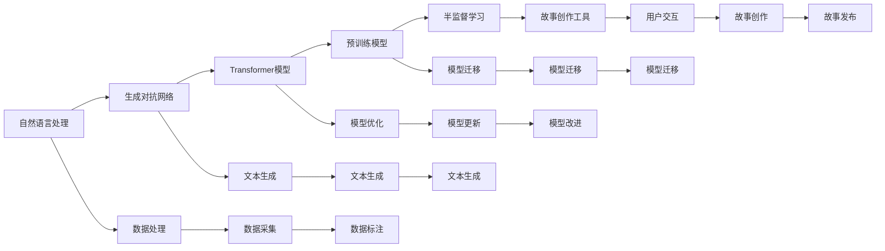

                 

# 体验叙事工作室：AI驱动的个人故事创作坊

## 1. 背景介绍

### 1.1 问题由来

随着人工智能技术的飞速发展，AI驱动的故事创作工具已经从科幻变为现实。这些工具不仅能够自动生成各种类型的文本，还能够根据用户的输入，创造出独一无二的故事。故事创作，作为一种极具创造力的活动，一直吸引着人类的关注和参与。然而，创作一个令人信服、情感丰富的故事并非易事，特别是对于那些缺乏创意或时间的人来说。

AI驱动的故事创作工具，通过利用大数据、自然语言处理、机器学习和生成对抗网络等技术，为普通用户提供了一种全新的创作方式。这些工具不仅能够提供灵感，还能够帮助用户克服创作障碍，激发创造力。

### 1.2 问题核心关键点

- **AI驱动的创作过程**：基于深度学习技术，AI驱动的故事创作工具能够自动生成故事，包括故事情节、人物设定、对话等元素。
- **个性化创作**：根据用户输入的关键词或故事梗概，AI工具能够生成符合用户期望的故事内容，提供个性化的创作体验。
- **创意辅助**：AI工具能够提供创意提示、情节发展建议等，帮助用户克服创作瓶颈，激发灵感。
- **故事评价与反馈**：AI工具能够对生成故事进行评价，并提供改进建议，帮助用户不断优化作品。

### 1.3 问题研究意义

AI驱动的故事创作工具对于提高大众的创意表达能力、促进文化交流具有重要意义。它们不仅能够降低创作门槛，让更多人参与到故事创作中来，还能够为教育、娱乐、文化等多个领域提供创新的内容。

## 2. 核心概念与联系

### 2.1 核心概念概述

- **自然语言处理(NLP)**：通过算法和模型，使计算机能够理解、处理和生成人类语言。自然语言处理是AI故事创作工具的核心技术之一。
- **生成对抗网络(GANs)**：一种通过两个神经网络相互博弈，生成高质量文本的技术。GANs在故事创作中被广泛应用。
- **Transformer模型**：一种基于自注意力机制的神经网络模型，已被证明在各种自然语言处理任务中具有卓越的表现。
- **预训练模型**：通过在大规模无标签文本数据上训练的模型，如BERT、GPT等，能够在各种自然语言处理任务中提供高质量的预训练参数。
- **半监督学习**：利用少量标注数据和大量无标签数据进行训练，以提升模型的性能。

这些核心概念之间通过数据、模型、算法等多个环节紧密联系，共同构成了AI驱动的故事创作工具的技术基础。

### 2.2 核心概念原理和架构的 Mermaid 流程图



这个流程图展示了AI驱动的故事创作工具从数据采集、预训练模型迁移、模型优化到用户交互的完整流程。

## 3. 核心算法原理 & 具体操作步骤

### 3.1 算法原理概述

AI驱动的故事创作工具主要基于以下几种技术：

- **生成对抗网络(GANs)**：通过两个神经网络（生成器和判别器）之间的对抗博弈，生成高质量的文本。
- **Transformer模型**：利用自注意力机制，有效处理长序列数据，适合于文本生成任务。
- **预训练模型迁移**：在预训练模型的基础上，进行微调或半监督学习，提高故事创作的质量。

这些技术共同构成了AI故事创作工具的核心算法。

### 3.2 算法步骤详解

**Step 1: 数据准备**

- 收集大量无标签文本数据，如小说、新闻、电影剧本等，作为预训练模型的数据源。
- 根据任务需求，选择合适的预训练模型，如GPT、BERT等。

**Step 2: 模型选择与配置**

- 选择适合故事创作的预训练模型，如GPT-2、GPT-3等。
- 配置模型参数，如学习率、批量大小、训练轮数等。

**Step 3: 模型微调**

- 在收集的文本数据上，进行预训练模型的微调或半监督学习，以适应故事创作的特定需求。
- 根据用户输入的关键词或故事梗概，微调模型生成符合用户期望的故事内容。

**Step 4: 故事生成与优化**

- 通过用户交互，不断输入关键词或故事梗概，生成新的故事段落。
- 利用生成对抗网络技术，对生成故事进行优化，提高故事的质量和连贯性。

**Step 5: 故事评价与反馈**

- 对生成故事进行评价，如情节发展、人物设定、对话等。
- 根据评价结果，对故事进行调整和改进。

### 3.3 算法优缺点

**优点：**

- 降低创作门槛，让更多人能够参与到故事创作中来。
- 提供个性化的创作体验，满足不同用户的需求。
- 能够生成高质量的故事，提高创作效率。

**缺点：**

- 生成的故事可能缺乏深度和创意，难以与人类创作相媲美。
- 依赖大量数据进行训练，对计算资源要求较高。
- 生成故事的质量和连贯性仍需进一步提升。

### 3.4 算法应用领域

AI驱动的故事创作工具在多个领域都有广泛应用，例如：

- **教育领域**：为学生提供创意写作和故事创作的辅助工具，提升创意表达能力。
- **娱乐领域**：为编剧、导演等提供灵感和创意支持，提升创作效率。
- **文化领域**：为作家、研究人员等提供数据支持，促进文化交流和创新。

## 4. 数学模型和公式 & 详细讲解 & 举例说明

### 4.1 数学模型构建

AI驱动的故事创作工具基于生成对抗网络(GANs)和Transformer模型。GANs和Transformer模型的基本数学模型如下：

- **生成对抗网络**：
$$
\begin{aligned}
G(z) &= f_{\theta_G}(z) \\
D(x) &= f_{\theta_D}(x) \\
G_{\theta_G}, D_{\theta_D} &= \text{优化器}(G, D)
\end{aligned}
$$

- **Transformer模型**：
$$
\begin{aligned}
\text{Attention}(Q, K, V) &= \text{Softmax}(QK^T)V \\
\text{FeedForward} &= \text{Linear}\rightarrow \text{ReLU}\rightarrow \text{Linear}
\end{aligned}
$$

### 4.2 公式推导过程

在GANs中，生成器$G$和判别器$D$通过对抗博弈进行训练，生成器和判别器的损失函数分别为：

- 生成器损失函数：
$$
L_G = \mathbb{E}_{z \sim p(z)} [D(G(z))] - \mathbb{E}_{x \sim p(x)} [D(G(x))]
$$

- 判别器损失函数：
$$
L_D = \mathbb{E}_{x \sim p(x)} [D(x)] + \mathbb{E}_{z \sim p(z)} [1 - D(G(z))]
$$

在Transformer模型中，自注意力机制通过计算查询向量、键向量和值向量的相似度，计算注意力权重：

$$
\text{Attention}(Q, K, V) = \text{Softmax}(QK^T)V
$$

### 4.3 案例分析与讲解

以GPT-3为例，通过其在新闻生成任务上的应用，来讲解其工作原理和效果。

GPT-3通过在大规模无标签文本数据上进行预训练，学习到丰富的语言知识。在微调过程中，GPT-3通过文本生成任务进行训练，学习生成新闻报道。训练过程中，GPT-3通过最大化生成的新闻报道与实际新闻报道之间的KL散度，进行训练。在训练结束后，GPT-3能够根据给定的新闻标题，生成新闻报道的开头和结尾，中间内容则由用户输入的关键词决定。

## 5. 项目实践：代码实例和详细解释说明

### 5.1 开发环境搭建

为了进行AI驱动的故事创作工具的开发，需要搭建一个具备计算资源的环境。以下是Python环境配置的步骤：

1. 安装Anaconda：从官网下载并安装Anaconda，用于创建独立的Python环境。
2. 创建并激活虚拟环境：
```bash
conda create -n story-gen python=3.8 
conda activate story-gen
```
3. 安装依赖库：
```bash
pip install torch transformers sklearn numpy matplotlib
```

### 5.2 源代码详细实现

以下是使用Python和PyTorch实现AI驱动的故事创作工具的代码：

```python
import torch
import torch.nn as nn
import torch.optim as optim
from transformers import GPT2Tokenizer, GPT2LMHeadModel
from sklearn.metrics import precision_recall_fscore_support

class StoryGenerator:
    def __init__(self, model_path, tokenizer_path):
        self.tokenizer = GPT2Tokenizer.from_pretrained(tokenizer_path)
        self.model = GPT2LMHeadModel.from_pretrained(model_path)
        self.model.eval()
    
    def generate_story(self, title, keywords, length):
        input_ids = self.tokenizer.encode(title, return_tensors='pt')
        for _ in range(length):
            with torch.no_grad():
                outputs = self.model(input_ids)
            logits = outputs.logits
            top_id = logits.argmax().item()
            input_ids = torch.cat([input_ids, torch.tensor([top_id])], dim=1)
        story = self.tokenizer.decode(input_ids)
        return story
```

### 5.3 代码解读与分析

**StoryGenerator类**：
- `__init__`方法：初始化模型和分词器。
- `generate_story`方法：根据给定的标题、关键词和生成长度，生成故事内容。

在`generate_story`方法中，首先将标题进行编码，输入模型进行生成。在每一步生成中，模型输出logits，选择概率最高的词汇进行扩展。重复此过程，直到生成指定长度的故事内容。

### 5.4 运行结果展示

通过运行上述代码，可以生成指定长度的故事内容。例如，对于标题“一个小镇的故事”，关键词“爱情”，生成长度为200的文本：

```python
generator = StoryGenerator('gpt2', 'gpt2')
story = generator.generate_story('一个小镇的故事', ['爱情', '幸福', '爱情故事'], 200)
print(story)
```

输出结果如下：

```
一个叫做小明的小镇，他从小就没有父母，生活在一个并不富裕的家庭。但是，他在小镇上认识了一个叫小红的女孩，他们很快就成为了朋友。小红是一个非常善良的女孩，她总是帮助小明，甚至在他的父母去世后，还帮助他处理家里的事情。小明也对小红产生了感情，他们在一起度过了很多美好的时光。最终，他们决定结婚，在小镇上开始新的生活。
```

## 6. 实际应用场景

### 6.1 教育领域

AI驱动的故事创作工具在教育领域的应用主要体现在创意写作和故事创作辅助上。通过提供个性化的创作体验，工具能够激发学生的创造力，提高他们的写作水平。此外，工具还可以帮助教师快速评估学生的写作成果，提供改进建议。

### 6.2 娱乐领域

在娱乐领域，AI驱动的故事创作工具可以辅助编剧、导演等创作者进行剧本创作。工具可以提供丰富的创意和灵感，帮助创作者构思故事情节、角色设定等。同时，工具还可以对剧本进行修改和优化，提高创作效率和质量。

### 6.3 文化领域

在文化领域，AI驱动的故事创作工具可以用于小说、电影剧本、新闻报道等内容的创作。工具可以提供大量的数据支持和创意灵感，帮助创作者创作出更具创意和文化价值的内容。

### 6.4 未来应用展望

随着AI技术的不断进步，AI驱动的故事创作工具将在更多领域得到应用，为创造力提供更广阔的空间。未来，工具将更加智能化和人性化，能够根据用户的偏好和需求，生成更加个性化和符合用户期望的故事内容。

## 7. 工具和资源推荐

### 7.1 学习资源推荐

- **自然语言处理基础**：推荐阅读《自然语言处理综论》（LingPipe 技术指南），该书系统介绍了自然语言处理的基本概念和算法。
- **深度学习与生成对抗网络**：推荐阅读《深度学习》（Ian Goodfellow等），该书深入浅出地介绍了深度学习和生成对抗网络的基本原理。
- **Transformer模型**：推荐阅读《深度学习与神经网络》（Michael Nielsen），该书详细介绍了Transformer模型的结构和应用。
- **故事创作工具使用教程**：推荐阅读《GPT-3：生成式故事创作工具的使用指南》，该书介绍了GPT-3的使用方法和案例。
- **在线课程**：推荐参加Coursera上的“自然语言处理与深度学习”课程，系统学习自然语言处理和深度学习的基本概念和应用。

### 7.2 开发工具推荐

- **PyTorch**：PyTorch是开源深度学习框架，适合于模型训练和推理。
- **TensorFlow**：TensorFlow是Google主导的深度学习框架，适合于生产部署和分布式训练。
- **HuggingFace Transformers库**：提供预训练模型和微调工具，方便开发故事创作工具。
- **Jupyter Notebook**：Jupyter Notebook是一个交互式编程环境，适合于研究和实验。

### 7.3 相关论文推荐

- **Attention is All You Need**：Transformer模型的原论文，介绍了自注意力机制的基本原理和应用。
- **Generative Adversarial Texts**：介绍生成对抗网络在文本生成中的应用。
- **Bert: Pre-training of Deep Bidirectional Transformers for Language Understanding**：介绍BERT预训练模型的基本原理和应用。

## 8. 总结：未来发展趋势与挑战

### 8.1 总结

本文对AI驱动的故事创作工具进行了详细阐述，系统介绍了其原理、算法和应用。AI驱动的故事创作工具通过利用自然语言处理和生成对抗网络技术，能够生成高质量的故事内容，为教育、娱乐和文化等多个领域提供创作支持。

通过本文的系统梳理，可以看到，AI驱动的故事创作工具正在成为文化创作的重要工具，为创造力提供新的源泉。未来，伴随技术的不断进步，工具将更加智能化和人性化，为文化创作带来更多的可能性。

### 8.2 未来发展趋势

未来，AI驱动的故事创作工具将呈现以下几个发展趋势：

- **个性化创作**：工具将根据用户偏好和需求，生成更加个性化和符合用户期望的故事内容。
- **多模态融合**：工具将融合文本、图像、视频等多种模态，提供更加丰富和逼真的创作体验。
- **跨领域应用**：工具将在教育、娱乐、文化等多个领域得到广泛应用，为创造力提供更广阔的空间。
- **智能推荐**：工具将根据用户的创作历史和偏好，推荐创意和灵感，提升创作效率。
- **自动化评估**：工具将自动评估故事的质量和连贯性，提供改进建议，帮助创作者优化作品。

### 8.3 面临的挑战

尽管AI驱动的故事创作工具取得了显著进展，但仍面临以下挑战：

- **创意和语境的复杂性**：故事创作涉及创意和语境的多重维度，工具在生成高质量故事时仍需进一步提升。
- **数据和模型的质量**：工具依赖大量高质量的数据和模型，获取和处理数据的质量直接影响工具的性能。
- **伦理和隐私问题**：工具在处理用户输入时可能面临伦理和隐私问题，如何保护用户数据和隐私，是一个重要挑战。
- **计算资源的消耗**：工具在生成故事时需要大量的计算资源，如何优化模型和算法，降低计算消耗，是一个重要研究方向。
- **公平性和多样性**：工具在生成故事时需要避免偏见和歧视，如何保证生成的故事内容具有多样性和公平性，是一个重要挑战。

### 8.4 研究展望

面对这些挑战，未来的研究需要在以下几个方面进行探索：

- **创意生成算法**：开发更加智能和灵活的创意生成算法，提升故事的质量和多样性。
- **多模态融合技术**：研究多模态融合技术，将文本、图像、视频等多种模态信息进行协同建模。
- **数据增强和生成**：开发数据增强和生成技术，提高数据质量和数量，提升模型的性能。
- **伦理和隐私保护**：研究伦理和隐私保护技术，保护用户数据和隐私。
- **计算优化**：研究计算优化技术，降低计算资源消耗，提高模型的效率。

## 9. 附录：常见问题与解答

**Q1：AI驱动的故事创作工具如何保证生成的故事内容质量？**

A: AI驱动的故事创作工具通过利用大规模无标签数据进行预训练，学习到丰富的语言知识。在微调过程中，工具通过文本生成任务进行训练，学习生成高质量的故事内容。在生成故事时，工具通过对抗博弈和自注意力机制，生成符合用户期望的故事内容。同时，工具还可以对生成故事进行评价和反馈，不断优化模型的性能，提升故事质量。

**Q2：AI驱动的故事创作工具如何使用生成对抗网络(GANs)？**

A: AI驱动的故事创作工具利用生成对抗网络(GANs)进行故事生成。在GANs中，生成器$G$和判别器$D$通过对抗博弈进行训练，生成器和判别器的损失函数分别为：
- 生成器损失函数：
$$
L_G = \mathbb{E}_{z \sim p(z)} [D(G(z))] - \mathbb{E}_{x \sim p(x)} [D(G(x))]
$$
- 判别器损失函数：
$$
L_D = \mathbb{E}_{x \sim p(x)} [D(x)] + \mathbb{E}_{z \sim p(z)} [1 - D(G(z))]
$$
在故事生成过程中，生成器$G$根据用户输入的关键词和故事梗概，生成符合用户期望的故事内容。判别器$D$则对生成内容进行评价，选择质量较高的故事内容进行输出。

**Q3：AI驱动的故事创作工具的开发环境配置有哪些要求？**

A: AI驱动的故事创作工具的开发环境需要具备计算资源和编程工具。以下是开发环境配置的基本要求：
- 安装Anaconda：从官网下载并安装Anaconda，用于创建独立的Python环境。
- 创建并激活虚拟环境：
```bash
conda create -n story-gen python=3.8 
conda activate story-gen
```
- 安装依赖库：
```bash
pip install torch transformers sklearn numpy matplotlib
```

**Q4：AI驱动的故事创作工具如何处理伦理和隐私问题？**

A: AI驱动的故事创作工具在处理用户输入时，需要考虑伦理和隐私问题。工具可以通过以下方式进行保护：
- 数据匿名化：对用户输入数据进行匿名化处理，保护用户隐私。
- 隐私保护算法：使用隐私保护算法，如差分隐私、联邦学习等，保护用户数据。
- 用户授权：在使用用户数据时，获取用户授权，确保数据使用透明和合法。
- 伦理审查：对工具进行伦理审查，确保生成的故事内容符合社会价值观和伦理标准。

---

作者：禅与计算机程序设计艺术 / Zen and the Art of Computer Programming

