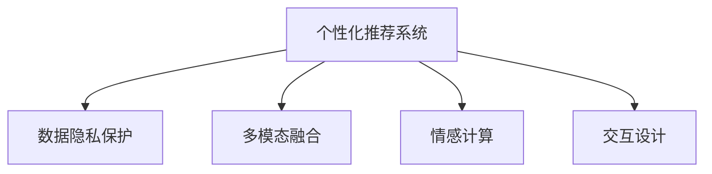

                 

# 体验的个人化叙事：AI驱动的生活故事

> 关键词：人工智能, 个性化, 叙事技术, 数据隐私, 交互设计, 情感计算, 多模态融合, 人类增强

## 1. 背景介绍

### 1.1 问题由来
在数字化时代，每个人的生活体验都深刻地依赖于数字技术的参与。从社交媒体到智能家居，从在线教育到虚拟现实，数字技术已经无处不在。然而，技术的发展并没有带来预期的幸福感的提升，反而引发了诸如信息过载、社交孤立等问题。在这一背景下，个性化叙事的出现为改善人类体验提供了新的方向。

个性化叙事技术通过分析用户的偏好、兴趣和行为，提供量身定制的信息流和内容推荐，帮助用户发现更多兴趣点，改善生活体验。人工智能（AI），尤其是深度学习技术，为个性化叙事的实现提供了强有力的技术支持。

### 1.2 问题核心关键点
个性化叙事技术的核心在于以下几个方面：

- **数据获取与处理**：通过用户行为数据、社交媒体数据、位置数据等多源数据获取和分析，了解用户兴趣和行为模式。
- **个性化内容推荐**：基于用户画像，推荐符合用户偏好的内容，改善用户体验。
- **情感计算与交互设计**：通过分析用户情感反馈，动态调整内容推荐，提升用户满意度。
- **隐私保护与伦理**：在个性化叙事中，保护用户隐私、确保数据安全、避免数据滥用是至关重要的。

个性化叙事技术不仅改善了个体的生活体验，还为商业、教育、医疗等多个领域带来了新的发展机遇。

### 1.3 问题研究意义
个性化叙事技术的应用，有助于提升用户的生活质量，促进数字化产品的用户体验，同时也能推动相关产业的创新发展。

1. **提升用户体验**：个性化叙事技术能够根据用户需求提供定制化的内容推荐，提升用户满意度和粘性。
2. **驱动产业升级**：通过个性化叙事，商家能够更好地理解用户需求，制定更精准的市场策略，提升商业效益。
3. **促进创新应用**：个性化叙事技术能够为教育、医疗等领域带来新的应用模式，改善服务质量。
4. **改善社会关系**：通过个性化叙事技术，建立更个性化、更贴合用户需求的社交平台，提升社交质量。
5. **推动技术进步**：个性化叙事技术的发展，推动了数据挖掘、情感计算、多模态融合等技术的发展，为未来的技术突破提供了基础。

## 2. 核心概念与联系

### 2.1 核心概念概述

为更好地理解个性化叙事技术，本节将介绍几个关键概念：

- **个性化推荐系统**：通过分析用户行为数据，为用户推荐个性化内容的技术。
- **数据隐私保护**：在数据收集、处理和存储过程中，确保用户数据安全，避免隐私泄露。
- **多模态融合**：将文本、图像、语音等多种形式的数据进行融合，提升内容推荐的效果。
- **情感计算**：通过分析用户的情感反馈，提升个性化叙事的效果。
- **交互设计**：通过优化用户界面和交互流程，提升用户体验。

这些核心概念之间的联系可以通过以下Mermaid流程图来展示：



这个流程图展示了个性化叙事中各关键概念之间的相互作用：

1. **数据隐私保护**：保护用户数据隐私，确保个性化推荐系统公平、公正地运作。
2. **多模态融合**：通过融合多种数据形式，提升内容推荐的质量和个性化程度。
3. **情感计算**：分析用户情感反馈，优化个性化推荐系统，提升用户体验。
4. **交互设计**：通过设计友好、直观的交互界面，增强用户对系统的满意度。

## 3. 核心算法原理 & 具体操作步骤

### 3.1 算法原理概述

个性化叙事技术的核心在于通过深度学习模型进行用户行为分析，从而提供个性化的内容推荐。其核心算法包括：

- **协同过滤**：通过分析用户行为数据，预测用户对未交互内容的评分。
- **矩阵分解**：将用户与内容的评分矩阵分解成用户和内容的潜在因子，提升推荐效果。
- **深度学习模型**：使用神经网络模型进行用户兴趣和行为模式的预测，提高推荐精度。

### 3.2 算法步骤详解

个性化叙事技术的具体实现流程如下：

**Step 1: 数据收集与预处理**
- 收集用户行为数据（如浏览记录、购买记录、社交媒体互动等）。
- 对数据进行清洗和归一化，去除噪声和缺失值。

**Step 2: 特征提取与用户画像构建**
- 使用协同过滤、矩阵分解等方法，提取用户兴趣和行为特征。
- 构建用户画像，描述用户的基本信息和偏好。

**Step 3: 内容推荐**
- 使用深度学习模型（如CNN、RNN、Transformer等）进行内容表示学习。
- 通过相似度计算，推荐与用户画像匹配度高的内容。

**Step 4: 情感计算与交互设计**
- 分析用户对推荐内容的情感反馈（如点赞、评论、分享等）。
- 根据情感反馈动态调整推荐策略，提升用户体验。
- 设计友好、直观的交互界面，提升用户粘性。

**Step 5: 隐私保护与合规**
- 在数据收集和处理过程中，确保用户数据隐私，避免滥用。
- 遵守相关法律法规（如GDPR、CCPA等），保护用户权益。

### 3.3 算法优缺点

个性化叙事技术具有以下优点：

- **提升用户体验**：通过个性化内容推荐，满足用户需求，提升用户满意度。
- **优化资源利用**：根据用户兴趣推荐内容，避免资源浪费。
- **促进商业发展**：帮助商家精准营销，提升销售转化率。

但同时也存在一些局限性：

- **数据隐私风险**：收集和处理用户数据可能引发隐私泄露和数据滥用。
- **冷启动问题**：新用户缺乏足够行为数据，难以进行有效推荐。
- **过度推荐问题**：推荐过多内容可能导致信息过载，影响用户体验。

### 3.4 算法应用领域

个性化叙事技术已经广泛应用于多个领域，包括：

- **电子商务**：通过个性化推荐，提升用户购买体验，增加销售额。
- **社交媒体**：分析用户兴趣和行为，推荐相关内容和互动机会，提升用户粘性。
- **在线教育**：根据用户学习行为，推荐个性化学习内容，提升学习效果。
- **医疗健康**：通过个性化推荐，提供符合用户健康需求的内容，改善健康管理。
- **旅游出行**：分析用户旅游偏好，推荐个性化旅游路线和目的地，提升旅游体验。

## 4. 数学模型和公式 & 详细讲解 & 举例说明

### 4.1 数学模型构建

假设用户集为 $U$，内容集为 $I$，用户-内容的评分矩阵为 $R$，用户画像为 $P$，推荐模型为 $M$。

- **用户画像**：$P_{u,i} \in \mathbb{R}^n$，其中 $n$ 为特征维度。
- **推荐模型**：$M_{u,i} = M(P_u, P_i)$。

### 4.2 公式推导过程

基于上述假设，个性化推荐模型的目标是通过用户画像 $P$ 和内容特征 $I$ 预测用户对内容的评分 $R$。具体而言，推荐模型 $M$ 可以使用深度神经网络进行建模，公式如下：

$$
R_{u,i} = M_{u,i}(P_u, P_i)
$$

其中 $M_{u,i}$ 为推荐模型，$P_u$ 和 $P_i$ 分别为用户和内容的特征向量。

通过最小化预测评分与实际评分的误差，优化推荐模型 $M$。常用的优化目标函数包括均方误差（MSE）和平均绝对误差（MAE）：

$$
L(M) = \frac{1}{|U|\times|I|} \sum_{u \in U, i \in I} (R_{u,i} - M_{u,i}(P_u, P_i))^2
$$

### 4.3 案例分析与讲解

假设某电商平台的个性化推荐系统，通过用户历史购买记录和浏览行为，为用户推荐商品。系统使用协同过滤算法和深度神经网络模型，具体流程如下：

1. **数据收集**：收集用户购买记录、浏览记录等行为数据。
2. **特征提取**：对数据进行特征提取和归一化，构建用户画像。
3. **协同过滤**：使用协同过滤算法预测用户对未交互商品的评分。
4. **深度学习模型**：使用深度神经网络模型进行商品表示学习。
5. **推荐算法**：结合协同过滤和深度学习模型，推荐用户可能感兴趣的商品。
6. **情感计算**：分析用户对推荐商品的反馈，动态调整推荐策略。
7. **隐私保护**：在数据收集和处理过程中，确保用户数据安全。

## 5. 项目实践：代码实例和详细解释说明

### 5.1 开发环境搭建

在进行个性化叙事技术的开发前，我们需要准备好开发环境。以下是使用Python进行TensorFlow开发的环境配置流程：

1. 安装Anaconda：从官网下载并安装Anaconda，用于创建独立的Python环境。

2. 创建并激活虚拟环境：
```bash
conda create -n tf-env python=3.8 
conda activate tf-env
```

3. 安装TensorFlow：根据CUDA版本，从官网获取对应的安装命令。例如：
```bash
conda install tensorflow=2.7
```

4. 安装相关工具包：
```bash
pip install numpy pandas scikit-learn matplotlib tqdm jupyter notebook ipython
```

完成上述步骤后，即可在`tf-env`环境中开始个性化叙事技术的开发。

### 5.2 源代码详细实现

下面以电商平台个性化推荐系统为例，给出使用TensorFlow进行代码实现的详细示例。

首先，定义数据处理函数：

```python
import tensorflow as tf
from tensorflow.keras.preprocessing.sequence import pad_sequences
from tensorflow.keras.layers import Embedding, Dense, Dot, Flatten

def preprocess_data(train_data, test_data, max_seq_len=100):
    train_texts = [text.split() for text in train_data]
    train_labels = [label for label in train_data]
    test_texts = [text.split() for text in test_data]
    test_labels = [label for label in test_data]
    
    # 对文本进行编码
    tokenizer = tf.keras.preprocessing.text.Tokenizer()
    tokenizer.fit_on_texts(train_texts + test_texts)
    word_index = tokenizer.word_index
    sequences = tokenizer.texts_to_sequences(train_texts + test_texts)
    padded_sequences = pad_sequences(sequences, maxlen=max_seq_len)
    
    # 对标签进行编码
    label_index = {label: i for i, label in enumerate(set(train_labels + test_labels))}
    train_labels = [label_index[label] for label in train_labels]
    test_labels = [label_index[label] for label in test_labels]
    
    return padded_sequences, train_labels, test_labels, word_index
```

然后，定义深度学习模型：

```python
model = tf.keras.Sequential([
    Embedding(len(word_index) + 1, 100, input_length=max_seq_len),
    Flatten(),
    Dense(64, activation='relu'),
    Dense(1, activation='sigmoid')
])
```

接着，定义训练和评估函数：

```python
def train_model(model, train_data, val_data, epochs=10, batch_size=32):
    train_dataset = tf.data.Dataset.from_tensor_slices(train_data).shuffle(1000).batch(batch_size)
    val_dataset = tf.data.Dataset.from_tensor_slices(val_data).batch(batch_size)
    
    model.compile(optimizer='adam', loss='binary_crossentropy', metrics=['accuracy'])
    history = model.fit(train_dataset, validation_data=val_dataset, epochs=epochs)
    
    return history
```

最后，启动训练流程并在测试集上评估：

```python
train_padded_sequences, train_labels, test_padded_sequences, test_labels = preprocess_data(train_data, test_data, max_seq_len=100)
history = train_model(model, (train_padded_sequences, train_labels), (test_padded_sequences, test_labels))

test_loss, test_acc = model.evaluate(test_padded_sequences, test_labels)
print(f"Test Loss: {test_loss:.4f}")
print(f"Test Accuracy: {test_acc:.4f}")
```

以上就是使用TensorFlow进行个性化推荐系统的完整代码实现。可以看到，TensorFlow提供了强大的深度学习框架和丰富的工具支持，使得个性化推荐系统的开发变得简单高效。

### 5.3 代码解读与分析

让我们再详细解读一下关键代码的实现细节：

**preprocess_data函数**：
- `train_data` 和 `test_data`：训练集和测试集的数据。
- `max_seq_len`：文本序列的最大长度。
- `pad_sequences`：对文本序列进行padding，确保序列长度一致。
- `tokenizer`：使用Keras的Tokenizer对文本进行编码。
- `word_index`：文本中的词汇索引。
- `label_index`：标签的索引。

**model定义**：
- `Embedding`：嵌入层，将文本转换为向量表示。
- `Flatten`：将向量展开为一维数组。
- `Dense`：全连接层，进行特征提取和分类。

**train_model函数**：
- `shuffle`：对数据集进行随机打乱，避免过拟合。
- `batch`：将数据集划分为批次。
- `compile`：定义优化器、损失函数和评估指标。
- `fit`：进行模型训练，返回训练历史。
- `evaluate`：在测试集上评估模型性能。

**代码运行**：
- `preprocess_data`：预处理训练集和测试集，构建序列和标签。
- `train_model`：使用训练集进行模型训练，并在验证集上评估。
- `evaluate`：在测试集上评估模型性能。

可以看到，TensorFlow的代码实现简洁高效，易于理解和修改。开发者可以根据具体需求，调整模型结构和训练参数，快速迭代实验。

## 6. 实际应用场景

### 6.1 社交媒体内容推荐

社交媒体平台通过个性化推荐系统，向用户推荐其感兴趣的内容，提高用户粘性和平台活跃度。例如，微博通过分析用户关注的话题和互动行为，推荐符合用户兴趣的内容。微信则通过用户的阅读记录和互动数据，推荐可能感兴趣的朋友和文章。

### 6.2 在线教育个性化学习

在线教育平台通过个性化推荐系统，为学生推荐个性化的学习内容，提升学习效果。例如，Coursera根据学生的学习行为和成绩，推荐适合的课程和练习题。Khan Academy通过学生的学习历史和测试成绩，推荐个性化的学习路径和资源。

### 6.3 智能家居场景推荐

智能家居平台通过个性化推荐系统，为用户推荐符合其生活习惯和偏好的家居控制方案。例如，小米智能家居根据用户的使用习惯和反馈，推荐最优的智能设备组合和控制策略。Google Home则通过用户的语音指令和搜索历史，推荐适合的任务和内容。

### 6.4 未来应用展望

随着个性化叙事技术的发展，未来将在更多领域得到应用，为社会带来变革性影响：

- **智慧医疗**：通过个性化推荐系统，向患者推荐个性化的医疗方案和健康指导。
- **智能交通**：根据用户的出行习惯和偏好，推荐最优的出行路线和交通工具。
- **旅游出行**：分析用户的旅游偏好和行为，推荐个性化的旅游路线和目的地。
- **金融理财**：根据用户的投资偏好和行为，推荐个性化的理财方案和投资建议。
- **智能制造**：根据工人的操作习惯和偏好，推荐最优的生产流程和设备配置。

个性化叙事技术的应用前景广阔，将在各个领域带来深远的变革。未来，随着技术的不断进步和数据量的不断增长，个性化叙事技术将为人类生活带来更多便利和乐趣。

## 7. 工具和资源推荐

### 7.1 学习资源推荐

为了帮助开发者系统掌握个性化叙事技术，这里推荐一些优质的学习资源：

1. **《深度学习与推荐系统》**：清华大学郑涌教授的课程，系统讲解了协同过滤、深度学习等推荐系统算法。
2. **《推荐系统实战》**：京东工程师编写的书籍，详细介绍了推荐系统的实现和优化。
3. **《机器学习实战》**：谷歌工程师编写的书籍，涵盖了机器学习的基本概念和算法。
4. **Kaggle竞赛**：Kaggle平台提供了多个推荐系统相关的竞赛，通过参与竞赛可以提升实战能力。
5. **GitHub开源项目**：Github上有很多优秀的推荐系统开源项目，可以通过阅读代码学习先进技术。

通过对这些资源的学习实践，相信你一定能够快速掌握个性化叙事技术的精髓，并用于解决实际的个性化推荐问题。

### 7.2 开发工具推荐

高效的开发离不开优秀的工具支持。以下是几款用于个性化叙事技术开发的常用工具：

1. **TensorFlow**：谷歌开发的深度学习框架，提供了丰富的工具和算法支持。
2. **PyTorch**：Facebook开发的深度学习框架，灵活高效，适合学术研究和工程应用。
3. **scikit-learn**：Python的机器学习库，提供了多种推荐算法和工具。
4. **Spark**：Apache开发的分布式计算框架，适合处理大规模数据集。
5. **Jupyter Notebook**：交互式的Python开发环境，方便进行数据探索和模型调试。

合理利用这些工具，可以显著提升个性化叙事技术的开发效率，加快创新迭代的步伐。

### 7.3 相关论文推荐

个性化叙事技术的发展源于学界的持续研究。以下是几篇奠基性的相关论文，推荐阅读：

1. **《推荐系统实用手册》**：Item-based和User-based协同过滤算法。
2. **《深度学习与推荐系统》**：深度神经网络在推荐系统中的应用。
3. **《个性化推荐系统》**：总结了多种个性化推荐方法，如基于内容的推荐、基于协同过滤的推荐、混合推荐等。
4. **《情感计算与用户体验》**：分析了情感计算对个性化叙事的影响。
5. **《多模态数据融合》**：探讨了多模态数据融合在推荐系统中的应用。

这些论文代表了个性化叙事技术的发展脉络。通过学习这些前沿成果，可以帮助研究者把握学科前进方向，激发更多的创新灵感。

## 8. 总结：未来发展趋势与挑战

### 8.1 总结

本文对个性化叙事技术进行了全面系统的介绍。首先阐述了个性化叙事技术的研究背景和意义，明确了其在提升用户体验、优化资源利用等方面的独特价值。其次，从原理到实践，详细讲解了个性化叙事技术的数学模型、算法步骤和具体实现，给出了个性化的代码实例。同时，本文还探讨了个性化叙事技术在多个领域的应用前景，展示了其广泛的应用潜力。

通过本文的系统梳理，可以看到，个性化叙事技术在提升用户体验、优化资源利用方面发挥着重要作用。未来，伴随技术的不断进步和数据的持续增长，个性化叙事技术将在更多领域得到应用，为人类生活带来更多便利和乐趣。

### 8.2 未来发展趋势

展望未来，个性化叙事技术将呈现以下几个发展趋势：

1. **多模态融合**：将文本、图像、语音等多种形式的数据进行融合，提升内容推荐的效果。
2. **情感计算与社交**：通过分析用户情感反馈，动态调整推荐策略，提升用户体验。
3. **隐私保护与合规**：在数据收集和处理过程中，确保用户数据安全，避免滥用。
4. **交互设计与用户体验**：通过优化用户界面和交互流程，增强用户对系统的满意度。
5. **个性化推荐**：结合协同过滤和深度学习，提升推荐精度和个性化程度。

以上趋势凸显了个性化叙事技术的广阔前景。这些方向的探索发展，将进一步提升个性化叙事的效果，为人类生活带来更多便利和乐趣。

### 8.3 面临的挑战

尽管个性化叙事技术已经取得了瞩目成就，但在迈向更加智能化、普适化应用的过程中，它仍面临着诸多挑战：

1. **数据隐私风险**：收集和处理用户数据可能引发隐私泄露和数据滥用。
2. **冷启动问题**：新用户缺乏足够行为数据，难以进行有效推荐。
3. **信息过载**：推荐过多内容可能导致信息过载，影响用户体验。
4. **数据质量**：数据质量和完整性对推荐效果有重要影响，需要严格的数据治理。
5. **技术瓶颈**：现有的推荐算法难以应对大规模数据和高维度特征，需要更多创新算法。

### 8.4 研究展望

面对个性化叙事技术所面临的挑战，未来的研究需要在以下几个方面寻求新的突破：

1. **深度学习与多模态融合**：结合深度学习和多模态融合技术，提升推荐精度和效果。
2. **隐私保护与伦理**：在数据收集和处理过程中，确保用户数据安全，避免滥用。
3. **冷启动与新用户推荐**：开发针对新用户的推荐算法，提升用户体验。
4. **信息过滤与过载**：引入信息过滤技术，避免信息过载，提升用户体验。
5. **动态调整与反馈机制**：建立动态调整和反馈机制，提升推荐系统的适应性和灵活性。

这些研究方向的探索，将进一步提升个性化叙事的效果，为人类生活带来更多便利和乐趣。总之，个性化叙事技术的研究和应用，需要在技术、数据、伦理等多方面进行全面优化，方能不断拓展其应用边界，为人类社会带来深远影响。

## 9. 附录：常见问题与解答

**Q1：个性化叙事技术是否适用于所有用户？**

A: 个性化叙事技术适用于大部分用户，但对于部分用户可能存在一定的偏差。例如，新用户由于缺乏足够行为数据，个性化推荐效果可能不如老用户。此外，不同用户的兴趣偏好可能存在较大差异，需要针对不同用户进行个性化调整。

**Q2：如何在个性化推荐中保护用户隐私？**

A: 在个性化推荐中保护用户隐私，需要采取以下措施：
1. 数据匿名化：对用户数据进行匿名化处理，防止数据泄露。
2. 数据加密：对用户数据进行加密，防止数据被恶意访问。
3. 数据最小化：只收集必要的数据，避免过度收集。
4. 数据访问控制：限制对用户数据的访问权限，防止数据滥用。
5. 数据存储安全：采用安全的数据存储方式，防止数据泄露和篡改。

**Q3：个性化推荐系统如何处理冷启动问题？**

A: 处理冷启动问题，可以采用以下策略：
1. 基于内容的推荐：利用物品特征，对新用户进行初步推荐。
2. 协同过滤推荐：利用用户-物品评分矩阵，对新用户进行推荐。
3. 基于模型的推荐：利用深度学习模型，对新用户进行推荐。
4. 多模态融合推荐：结合文本、图像、语音等多种形式的数据，对新用户进行推荐。
5. 交互反馈推荐：通过用户交互反馈，动态调整推荐策略，提升新用户推荐效果。

**Q4：如何提高个性化推荐系统的推荐精度？**

A: 提高个性化推荐系统的推荐精度，可以采用以下策略：
1. 数据质量提升：提高数据质量，去除噪声和缺失值。
2. 模型优化：优化推荐模型，使用深度学习、协同过滤等算法。
3. 特征工程：设计有效的特征，提高特征对推荐精度的影响。
4. 数据增强：通过数据增强技术，提高模型的泛化能力。
5. 模型融合：采用多种推荐算法，融合结果进行推荐。

**Q5：如何提升个性化推荐系统的用户体验？**

A: 提升个性化推荐系统的用户体验，可以采用以下策略：
1. 多样性控制：控制推荐内容的多样性，避免内容单一。
2. 个性化调整：根据用户反馈，动态调整推荐策略。
3. 交互设计：设计友好、直观的交互界面，增强用户粘性。
4. 情感计算：分析用户情感反馈，提升推荐效果。
5. 数据反馈：通过用户反馈，优化推荐系统。

---

作者：禅与计算机程序设计艺术 / Zen and the Art of Computer Programming

