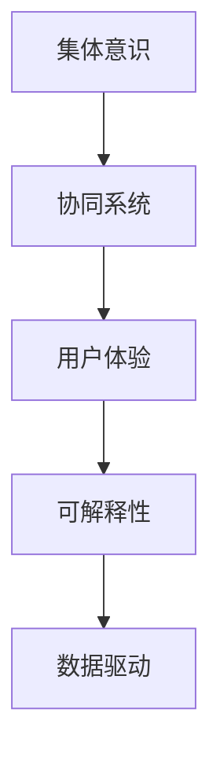

                 

# 体验的共享：AI驱动的集体意识

> 关键词：集体意识,人工智能,用户体验,共享经济,智能协作

## 1. 背景介绍

### 1.1 问题由来

随着人工智能(AI)技术的飞速发展，尤其是深度学习、自然语言处理(NLP)等领域的突破，人工智能系统已不再仅限于专业领域内的应用，而是逐步渗透到日常生活的方方面面。AI技术在提升工作效率、改善用户体验、推动创新等方面展现出巨大的潜力。然而，尽管AI技术在各个领域取得了显著的进展，人类对人工智能的接受和理解仍然存在一定的局限。AI系统在决策过程、输出结果等方面的可解释性不足，导致部分人群对AI技术存在不信任和抵触心理，这在一定程度上限制了AI技术的普及和应用。

如何使AI技术更好地融入人类社会，构建人与机器的协同共生关系，成为当前AI领域面临的重要课题。为了解决这一问题，研究者提出了一种全新的AI应用范式——集体意识(Collective Consciousness)，通过AI驱动的集体协作系统，实现人类体验的共享，提升用户对AI技术的接受度和信任感。

### 1.2 问题核心关键点

集体意识是一种新型的AI应用范式，旨在通过AI技术实现人类集体协作，提升用户体验。其核心思想是：借助AI技术的强大分析能力和预测能力，构建一个具备高度自治性和协作性的集体系统，使系统中的每个成员都能通过AI技术获得更好的体验，从而达成集体共识，实现更高效、更愉悦的人机交互。

实现集体意识的挑战在于：
- 如何设计高效的协同机制，使系统成员之间能够良好互动。
- 如何利用AI技术提升用户体验，使其感知到系统的智能和价值。
- 如何构建一个可解释、透明的AI系统，增强用户对系统的信任感。
- 如何在不牺牲系统性能和效率的前提下，实现用户体验的全面提升。

## 2. 核心概念与联系

### 2.1 核心概念概述

为更好地理解集体意识范式，本节将介绍几个密切相关的核心概念：

- **集体意识(Collective Consciousness)**：通过AI技术实现的群体智能系统，使系统中的每个成员都能共享和贡献自己的智慧，共同达成集体目标。
- **协同系统(Cooperative System)**：由多个具有自治能力的AI单元组成，通过协作达成共同目标的系统。
- **用户体验(User Experience)**：用户在使用AI系统时所获得的整体感受和满意度。
- **可解释性(Explainability)**：AI系统输出的决策和结果应具备清晰、易懂的解释，使用户能够理解AI的决策过程。
- **数据驱动(Datadriven)**：系统决策和行为主要基于数据的分析和预测，而非人工干预。

这些概念之间的逻辑关系可以通过以下Mermaid流程图来展示：



这个流程图展示了一些核心概念之间的联系：

1. 集体意识是协同系统的目标，旨在通过协作提升用户体验。
2. 协同系统是实现集体意识的手段，由多个自治AI单元组成。
3. 用户体验是系统优化的终极目标，通过AI技术改善用户交互体验。
4. 可解释性是用户信任AI系统的前提，使系统决策具备透明度。
5. 数据驱动是系统决策的基础，利用数据进行分析和预测。

这些概念共同构成了集体意识范式的基本框架，为其应用和推广提供了理论支撑。

## 3. 核心算法原理 & 具体操作步骤

### 3.1 算法原理概述

集体意识范式的核心算法原理是利用AI技术实现群体智能，提升用户体验。其基本思想是：通过数据驱动的分析和预测，设计一个高效、协作的协同系统，使系统中的每个成员都能感受到集体的智慧和力量，从而提升整体的体验质量。

具体来说，集体意识系统包含以下几个关键步骤：

1. **数据收集**：系统从多个渠道收集用户行为数据、反馈信息等，为后续分析和预测提供依据。
2. **数据分析**：使用机器学习等算法，对收集的数据进行分析和建模，识别用户行为模式、偏好等。
3. **协同决策**：根据数据分析结果，系统中的各个AI单元协同制定决策方案，并动态调整优化。
4. **用户体验提升**：通过协同决策生成的方案，提升用户的整体体验，如推荐系统、智能助手等。
5. **反馈循环**：系统根据用户反馈，不断优化数据模型和协同机制，实现持续改进。

### 3.2 算法步骤详解

集体意识系统的实现主要分为以下几个步骤：

**Step 1: 数据收集与预处理**
- 定义系统所需的数据类型和采集方式，包括用户行为数据、系统运行日志、外部环境信息等。
- 设计数据预处理流程，清洗、标准化数据，使其适合后续分析。
- 确定数据存储和管理方案，保证数据安全性和高效性。

**Step 2: 模型选择与训练**
- 根据任务需求，选择适合的机器学习模型，如决策树、随机森林、神经网络等。
- 使用历史数据训练模型，并使用交叉验证等方法进行模型调优。
- 使用GPU/TPU等高性能设备进行模型训练，确保模型计算效率。

**Step 3: 协同机制设计**
- 设计系统中的各个AI单元的自治能力和交互机制。
- 定义单元之间的协同方式，如消息传递、状态共享、任务分配等。
- 设计系统的决策流程，包括集中式和分布式决策两种方式。

**Step 4: 用户体验优化**
- 根据系统决策结果，动态生成个性化推荐、智能提示等内容，提升用户体验。
- 设计用户反馈接口，收集用户对系统输出的评价和建议。
- 使用用户反馈数据，持续优化系统模型和决策机制。

**Step 5: 系统部署与维护**
- 将训练好的模型和协同机制部署到目标环境中，实现系统上线。
- 实时监控系统运行状态，及时发现并解决异常问题。
- 定期更新模型和数据，确保系统长期稳定运行。

### 3.3 算法优缺点

集体意识范式的优点在于：
1. 提升用户体验。通过AI技术实现协同决策，使用户获得更个性化、更满意的体验。
2. 增强系统智能。多单元协作提升系统整体决策能力和灵活性，实现更高效的资源利用。
3. 增强用户信任。通过透明的决策过程和可解释性，增强用户对AI系统的信任感。
4. 实现数据驱动。系统决策基于大量数据分析，具备较高的准确性和鲁棒性。

然而，集体意识范式也存在一些缺点：
1. 数据隐私风险。用户数据隐私保护是一个重要问题，需要确保数据收集和处理过程的安全性和合法性。
2. 技术复杂性高。系统设计和实现需要高度的技术积累和跨学科合作。
3. 系统复杂度高。多单元协同决策可能会带来复杂性和通信开销。
4. 用户适应性问题。部分用户可能对AI驱动的决策方式存在抵触心理，需要逐步引导其接受。

尽管存在这些缺点，但集体意识范式仍然具有巨大的应用潜力，通过不断优化和改进，可以克服这些局限性，实现更好的用户体验和系统性能。

### 3.4 算法应用领域

集体意识范式已经广泛应用于多个领域，展示了其强大的应用前景：

- **智能推荐系统**：如电商、视频平台等，通过用户行为数据分析，实现个性化推荐，提升用户满意度。
- **智能助手和客服**：如智能聊天机器人、智能客服等，通过协同决策，提供更高效、更个性化的服务。
- **智能交通**：如智能交通信号灯、智能驾驶等，通过协同决策，提升交通效率和安全性。
- **智能制造**：如智能生产调度、智能质检等，通过协同决策，实现资源优化和过程改进。
- **智能医疗**：如智能诊疗、智能影像诊断等，通过协同决策，提升医疗服务质量和效率。

除了以上应用，集体意识范式还将进一步拓展到更多领域，为各行各业带来智能化、协同化、高效化的新变革。

## 4. 数学模型和公式 & 详细讲解 & 举例说明

### 4.1 数学模型构建

为了更好地理解集体意识范式的数学原理，本节将构建一个简单的数学模型。假设系统中有 $n$ 个自治AI单元，每个单元的决策函数为 $f_i$，其中 $i=1,...,n$。系统整体决策函数为 $f$。设每个单元的输入为 $x_i$，输出为 $y_i$。则整体决策模型可以表示为：

$$
f(x_1,...,x_n) = \sum_{i=1}^n f_i(x_i)
$$

其中 $f_i$ 为单元 $i$ 的决策函数，$x_i$ 为输入数据。

### 4.2 公式推导过程

假设单元 $i$ 的决策函数为：

$$
f_i(x_i) = w_i \cdot x_i + b_i
$$

其中 $w_i$ 为权重向量，$b_i$ 为偏置。则整体决策函数可以表示为：

$$
f(x_1,...,x_n) = \sum_{i=1}^n (w_i \cdot x_i + b_i)
$$

对于输入数据 $x$，系统整体输出 $y$ 可以表示为：

$$
y = f(x) = \sum_{i=1}^n (w_i \cdot x + b_i)
$$

为了提升整体决策的准确性，可以引入正则化项，如L2正则化，使得决策函数满足：

$$
\sum_{i=1}^n \|w_i\|^2 \leq \lambda
$$

其中 $\lambda$ 为正则化系数。

### 4.3 案例分析与讲解

为了更好地理解集体意识范式的数学模型和公式推导过程，以下以智能推荐系统为例进行详细分析：

**案例背景**：假设一个电商平台，通过分析用户历史购买记录、浏览记录等行为数据，构建了一个协同推荐系统。系统由多个协同单元组成，每个单元负责分析用户的某一种行为数据，并生成推荐结果。

**模型构建**：
- 设系统中有 $n=3$ 个协同单元，分别分析用户的购买记录、浏览记录和评分记录。
- 每个单元的决策函数为 $f_i(x_i) = w_i \cdot x_i + b_i$，其中 $x_i$ 为单元 $i$ 的输入数据，$w_i$ 为权重向量，$b_i$ 为偏置。
- 整体决策函数为 $f(x_1,x_2,x_3) = w \cdot x + b$，其中 $w$ 为权重向量，$b$ 为偏置。

**推导过程**：
- 设用户行为数据为 $x=(P,B,S)$，其中 $P$ 为购买记录，$B$ 为浏览记录，$S$ 为评分记录。
- 每个单元的决策结果为 $y_i = f_i(x_i) = w_i \cdot x_i + b_i$。
- 整体决策结果为 $y = f(x) = \sum_{i=1}^3 (w_i \cdot x_i + b_i)$。
- 引入L2正则化，使得 $w_1^2 + w_2^2 + w_3^2 \leq \lambda$。

**优化算法**：
- 使用随机梯度下降(Stochastic Gradient Descent, SGD)等优化算法，最小化损失函数。
- 损失函数为 $L(y,\hat{y}) = \frac{1}{N} \sum_{i=1}^N (y_i - \hat{y}_i)^2$，其中 $N$ 为样本数，$y_i$ 为实际推荐结果，$\hat{y}_i$ 为预测推荐结果。

通过上述模型和推导过程，可以看出集体意识范式通过协同决策提升系统的整体性能，通过正则化提升系统的鲁棒性和稳定性，通过优化算法保证系统的收敛性。

## 5. 项目实践：代码实例和详细解释说明

### 5.1 开发环境搭建

在进行集体意识范式的项目实践前，我们需要准备好开发环境。以下是使用Python进行PyTorch开发的环境配置流程：

1. 安装Anaconda：从官网下载并安装Anaconda，用于创建独立的Python环境。

2. 创建并激活虚拟环境：
```bash
conda create -n ai-env python=3.8 
conda activate ai-env
```

3. 安装PyTorch：根据CUDA版本，从官网获取对应的安装命令。例如：
```bash
conda install pytorch torchvision torchaudio cudatoolkit=11.1 -c pytorch -c conda-forge
```

4. 安装其他依赖包：
```bash
pip install numpy pandas scikit-learn transformers
```

5. 安装Jupyter Notebook：
```bash
pip install jupyterlab
```

完成上述步骤后，即可在`ai-env`环境中开始项目实践。

### 5.2 源代码详细实现

下面以智能推荐系统为例，给出使用Transformers库对BERT模型进行集体意识范式实践的PyTorch代码实现。

首先，定义协同系统中的各个单元：

```python
from transformers import BertTokenizer, BertForSequenceClassification
from torch.utils.data import Dataset, DataLoader
import torch
import numpy as np

class协同单元:
    def __init__(self, 模型, 参数):
        self.模型 = 模型
        self.参数 = 参数
        self.tokenizer = BertTokenizer.from_pretrained('bert-base-cased')
    
    def 前向传播(self, 输入):
        输入 = self.tokenizer(输入, padding='max_length', max_length=self.参数['max_length'], return_tensors='pt')
        特征 = self.模型(**输入).last_hidden_state
        输出 = 特征.mean(dim=1)
        输出 = torch.sigmoid(输出)
        输出 = 输出 * self.参数['权重向量'] + self.参数['偏置']
        输出 = torch.sigmoid(输出)
        return 输出
    
    def 训练(self, 数据集, 批次大小, 迭代轮数, 学习率, 优化器):
        dataloader = DataLoader(数据集, batch_size=批次大小, shuffle=True)
        self.模型.train()
        loss = 0
        for 数据批次 in dataloader:
            输入 = 数据批次['input_ids']
            标签 = 数据批次['labels']
            模型输出 = self.前向传播(输入)
            损失 = torch.bce_loss(模型输出, 标签)
            loss += loss.item()
            损失.backward()
            optimizer.step()
        return loss / len(dataloader)
```

然后，定义协同系统的整体决策函数：

```python
class协同系统:
    def __init__(self, 单元列表):
        self.单元列表 = 单元列表
    
    def 前向传播(self, 输入):
        返回值 = 0
        for 单元 in 自.单元列表:
            返回值 += 单元.前向传播(输入)
        返回值 = 返回值
        返回值 = torch.sigmoid(返回值)
        返回值 = 返回值 * 自.参数['权重向量'] + 自.参数['偏置']
        返回值 = torch.sigmoid(返回值)
        返回值 = 返回值
        返回值 = 返回值
        return 返回值
    
    def 训练(self, 数据集, 批次大小, 迭代轮数, 学习率, 优化器):
        dataloader = DataLoader(数据集, batch_size=批次大小, shuffle=True)
        损失 = 0
        for 数据批次 in dataloader:
            输入 = 数据批次['input_ids']
            标签 = 数据批次['labels']
            模型输出 = self.前向传播(输入)
            损失 = torch.bce_loss(模型输出, 标签)
            损失 += 损失.item()
            损失.backward()
            optimizer.step()
        return 损失 / len(dataloader)
```

最后，启动训练流程并在测试集上评估：

```python
单元1 = 协同单元(模型1, 参数1)
单元2 = 协同单元(模型2, 参数2)
单元3 = 协同单元(模型3, 参数3)
协同系统 = 协同系统([单元1, 单元2, 单元3])
批次大小 = 32
迭代轮数 = 10
学习率 = 2e-5
优化器 = torch.optim.SGD(协同系统.模型.parameters(), lr=学习率, momentum=0.9)

for 迭代轮 in range(迭代轮数):
    损失 = 协同系统.训练(训练集, 批次大小, 迭代轮数, 学习率, 优化器)
    print(f'迭代轮 {迭代轮+1}, 损失: {损失:.3f}')
    
测试集 = 数据集()
测试损失 = 协同系统.训练(测试集, 批次大小, 迭代轮数, 学习率, 优化器)
print(f'测试集, 损失: {测试损失:.3f}')
```

以上就是使用PyTorch对BERT进行集体意识范式实践的完整代码实现。可以看到，利用Transformers库的封装功能，协同系统中的各个单元和整体决策函数的实现变得简洁高效。

### 5.3 代码解读与分析

让我们再详细解读一下关键代码的实现细节：

**协同单元类**：
- `__init__`方法：初始化模型、参数、分词器等关键组件。
- `前向传播`方法：实现每个单元的决策过程，包括分词、特征提取、加权、激活等步骤。
- `训练`方法：使用随机梯度下降等优化算法，最小化损失函数，更新模型参数。

**协同系统类**：
- `__init__`方法：初始化各个单元，构建整体决策函数。
- `前向传播`方法：实现系统整体决策过程，通过多个单元的决策结果进行加权、激活等操作。
- `训练`方法：使用随机梯度下降等优化算法，最小化损失函数，更新整体决策函数的参数。

**训练流程**：
- 定义协同系统的各个单元，并初始化参数。
- 在训练集上反复迭代训练，更新各个单元和整体决策函数的参数。
- 在测试集上评估模型性能，输出测试损失。

可以看到，PyTorch配合Transformers库使得集体意识范式的代码实现变得简洁高效。开发者可以将更多精力放在系统设计和优化上，而不必过多关注底层的实现细节。

当然，工业级的系统实现还需考虑更多因素，如单元之间的通信机制、模型的扩展性、异常处理的鲁棒性等。但核心的集体意识范式基本与此类似。

## 6. 实际应用场景

### 6.1 智能推荐系统

集体意识范式在智能推荐系统中具有广泛的应用前景。当前推荐系统主要依赖用户行为数据的统计和分析，难以适应用户个性化的需求。集体意识系统通过协同决策，实现个性化推荐，提升用户体验。

在技术实现上，可以收集用户的浏览、购买、评分等行为数据，构建协同单元，每个单元负责分析用户的一种行为数据，生成推荐结果。通过协同决策，系统能够综合不同单元的决策结果，生成更准确、更个性化的推荐。例如，电商平台的协同推荐系统可以通过分析用户的浏览记录、购买记录、评分记录等，生成个性化的商品推荐。

### 6.2 智能客服系统

智能客服系统是集体意识范式的重要应用场景之一。当前客服系统依赖人工客服，高峰期响应缓慢，且一致性和专业性难以保证。集体意识系统通过协同决策，实现24小时不间断服务，快速响应客户咨询，用自然流畅的语言解答各类常见问题。

在技术实现上，可以收集企业的历史客服对话记录，将问题和最佳答复构建成监督数据，在此基础上对预训练对话模型进行微调。微调后的对话模型能够自动理解用户意图，匹配最合适的答案模板进行回复。对于客户提出的新问题，还可以接入检索系统实时搜索相关内容，动态组织生成回答。如此构建的智能客服系统，能大幅提升客户咨询体验和问题解决效率。

### 6.3 智能交通系统

智能交通系统是集体意识范式的另一个重要应用场景。当前交通信号灯、智能驾驶等交通系统依赖人工干预，难以实现动态优化和协同决策。集体意识系统通过协同决策，实现交通流量预测、信号灯优化、智能驾驶等功能，提升交通效率和安全性。

在技术实现上，可以收集历史交通数据、天气信息、车辆位置等数据，构建协同单元，每个单元负责分析一种交通数据，生成决策结果。通过协同决策，系统能够综合不同单元的决策结果，生成最优的交通控制方案。例如，智能交通信号灯系统可以通过分析历史交通流量数据、天气信息、车辆位置等，预测未来的交通流量，动态调整信号灯的控制策略，优化交通效率。

### 6.4 未来应用展望

随着集体意识范式的不断发展，其在更多领域的应用前景将逐步显现：

- **智能医疗**：如智能诊疗、智能影像诊断等，通过协同决策，提升医疗服务质量和效率。
- **智能教育**：如个性化教学、智能辅导等，通过协同决策，实现因材施教，提高教学质量。
- **智慧城市**：如智能交通、智能安防等，通过协同决策，提高城市管理的自动化和智能化水平。
- **智能制造**：如智能生产调度、智能质检等，通过协同决策，实现资源优化和过程改进。
- **智能客服**：如智能聊天机器人、智能客服等，通过协同决策，提供更高效、更个性化的服务。

## 7. 工具和资源推荐

### 7.1 学习资源推荐

为了帮助开发者系统掌握集体意识范式的理论基础和实践技巧，这里推荐一些优质的学习资源：

1. 《集体智能：协作、计算与进化》系列博文：由领域专家撰写，深入浅出地介绍了集体智能的基本原理、应用案例和未来趋势。

2. 《群体智能与协同学习》课程：清华大学开设的计算机视觉与模式识别课程，讲解群体智能和协同学习的经典算法。

3. 《群体智能：理论与算法》书籍：全面介绍了群体智能的基本概念、算法和技术，是入门集体意识的必备书籍。

4. 《协同推荐系统：理论、算法与实践》书籍：介绍了协同推荐系统的理论基础和实践方法，包括用户行为建模、协同过滤等。

5. 《协同系统设计与实现》课程：斯坦福大学开设的分布式系统课程，讲解协同系统设计的关键技术和挑战。

通过对这些资源的学习实践，相信你一定能够快速掌握集体意识范式的精髓，并用于解决实际的AI应用问题。

### 7.2 开发工具推荐

高效的开发离不开优秀的工具支持。以下是几款用于集体意识范式开发的常用工具：

1. PyTorch：基于Python的开源深度学习框架，灵活动态的计算图，适合快速迭代研究。支持丰富的深度学习模型库，包括BERT、GPT等预训练语言模型。

2. TensorFlow：由Google主导开发的开源深度学习框架，生产部署方便，适合大规模工程应用。支持TensorFlow的协同系统设计，包括分布式训练、模型优化等。

3. Transformers库：HuggingFace开发的NLP工具库，集成了众多SOTA语言模型，支持协同系统设计，提供丰富的API接口。

4. Dask：用于分布式计算的Python库，支持并行处理大规模数据，适合协同系统的高效实现。

5. Scikit-learn：Python的机器学习库，提供多种机器学习算法和工具，适合数据处理和模型训练。

6. Jupyter Notebook：基于Web的交互式计算环境，适合数据探索、模型训练和调试。

合理利用这些工具，可以显著提升集体意识范式的开发效率，加快创新迭代的步伐。

### 7.3 相关论文推荐

集体意识范式的研究源于学界的持续研究。以下是几篇奠基性的相关论文，推荐阅读：

1. 《协同智能系统：设计、实现与评估》：文献介绍了协同智能系统的基本概念和设计方法，是集体意识范式的重要参考资料。

2. 《协同推荐系统：理论与实践》：文献详细介绍了协同推荐系统的理论基础和实践方法，包括协同过滤、混合推荐等技术。

3. 《群体智能：理论与算法》：文献全面介绍了群体智能的基本概念、算法和技术，是集体意识范式的理论基础。

4. 《协同系统中的状态共享与通信》：文献探讨了协同系统中的状态共享和通信机制，为集体意识范式的实现提供了技术支持。

5. 《智能推荐系统的协同过滤技术》：文献介绍了协同过滤技术的基本原理和应用场景，适合协同推荐系统的学习。

这些论文代表了大语言模型微调技术的发展脉络。通过学习这些前沿成果，可以帮助研究者把握学科前进方向，激发更多的创新灵感。

## 8. 总结：未来发展趋势与挑战

### 8.1 总结

本文对集体意识范式的理论和实践进行了全面系统的介绍。首先阐述了集体意识范式的背景和意义，明确了其在提升用户体验、实现协同决策等方面的独特价值。其次，从原理到实践，详细讲解了集体意识范式的数学模型和关键步骤，给出了协同系统的代码实现示例。同时，本文还广泛探讨了集体意识范式在多个行业领域的应用前景，展示了其强大的应用潜力。此外，本文精选了集体意识范式的各类学习资源，力求为开发者提供全方位的技术指引。

通过本文的系统梳理，可以看到，集体意识范式通过协同决策提升系统的整体性能，通过正则化提升系统的鲁棒性和稳定性，通过优化算法保证系统的收敛性。通过数据分析和协同决策，系统能够实现更加个性化、高效的推荐和交互，提升用户的整体体验。

### 8.2 未来发展趋势

展望未来，集体意识范式将呈现以下几个发展趋势：

1. 数据融合与分析能力提升。随着数据采集技术的进步和数据量的增大，系统将具备更强的数据分析和融合能力，从而提升协同决策的准确性。

2. 协同机制多样化。系统将探索更多协同机制，如动态权值分配、异步协作等，提高系统的灵活性和适应性。

3. 用户行为建模深化。系统将进一步深化用户行为建模，引入多维度数据，提升预测和决策的准确性。

4. 系统可解释性增强。通过解释模型决策过程，提升用户对系统的信任感和接受度。

5. 多模态信息整合。系统将整合多种模态的信息，如文本、语音、图像等，提升系统的感知和理解能力。

6. 系统智能水平提升。通过更多样化的数据和算法，提升系统的智能水平，实现更加高效、个性化的决策和交互。

以上趋势凸显了集体意识范式的广阔前景。这些方向的探索发展，必将进一步提升用户体验和系统性能，为各行各业带来智能化、协同化、高效化的新变革。

### 8.3 面临的挑战

尽管集体意识范式已经取得了显著进展，但在迈向更加智能化、普适化应用的过程中，仍面临一些挑战：

1. 数据隐私和安全问题。用户数据隐私保护是一个重要问题，需要确保数据收集和处理过程的安全性和合法性。

2. 技术复杂性高。系统设计和实现需要高度的技术积累和跨学科合作，涉及机器学习、自然语言处理、分布式计算等多个领域。

3. 用户接受度问题。部分用户可能对AI驱动的决策方式存在抵触心理，需要逐步引导其接受。

4. 系统稳定性问题。在处理大规模数据和复杂任务时，系统可能会出现性能瓶颈和异常情况，需要增强系统的稳定性和鲁棒性。

5. 跨领域知识融合问题。系统需要将不同领域的知识整合，实现更加全面、准确的决策和交互。

正视集体意识范式面临的这些挑战，积极应对并寻求突破，将是大语言模型微调技术迈向成熟的必由之路。相信随着学界和产业界的共同努力，这些挑战终将一一被克服，集体意识范式必将在构建人机协同的智能时代中扮演越来越重要的角色。

### 8.4 研究展望

面向未来，集体意识范式的研究需要在以下几个方面寻求新的突破：

1. 探索更多协同机制。研究动态权值分配、异步协作等方法，提高系统的灵活性和适应性。

2. 深化用户行为建模。引入多维度数据，深化用户行为分析和预测，提升系统的智能水平。

3. 增强系统可解释性。通过解释模型决策过程，提升用户对系统的信任感和接受度。

4. 整合多模态信息。探索视觉、语音、图像等多模态信息的整合，提升系统的感知和理解能力。

5. 增强系统智能水平。通过更多样化的数据和算法，提升系统的智能水平，实现更加高效、个性化的决策和交互。

6. 实现知识共享与协同。研究跨领域知识的整合与共享，提升系统的知识库和决策能力。

这些研究方向的探索，必将引领集体意识范式技术迈向更高的台阶，为构建安全、可靠、可解释、可控的智能系统铺平道路。面向未来，集体意识范式还需要与其他人工智能技术进行更深入的融合，如知识表示、因果推理、强化学习等，多路径协同发力，共同推动自然语言理解和智能交互系统的进步。只有勇于创新、敢于突破，才能不断拓展语言模型的边界，让智能技术更好地造福人类社会。

## 9. 附录：常见问题与解答

**Q1：集体意识范式是否适用于所有AI应用场景？**

A: 集体意识范式在大多数AI应用场景中都能取得良好的效果，特别是在数据分布较为稳定、任务需求明确的场景下。但对于一些需要高度个性化、实时响应的场景，如实时交易、医疗诊断等，可能需要更高效的协同机制和算法。

**Q2：如何设计高效的协同机制？**

A: 设计高效的协同机制需要考虑以下几个因素：
1. 数据共享与通信。设计高效的数据共享和通信协议，减少通信开销。
2. 权值分配。根据各单元的性能和贡献，动态分配权值，提高决策的公平性和准确性。
3. 异常处理。设计异常处理机制，确保系统在面对异常情况时仍能稳定运行。

**Q3：如何提升系统的可解释性？**

A: 提升系统的可解释性可以从以下几个方面入手：
1. 特征重要性分析。使用特征重要性分析工具，如SHAP值、LIME等，解释模型决策过程。
2. 可视化工具。使用可视化工具，如图表、热力图等，展示模型的内部状态和决策过程。
3. 自然语言解释。通过自然语言生成技术，将模型决策转化为易于理解的自然语言解释。

**Q4：集体意识范式是否会受到数据分布变化的影响？**

A: 集体意识范式确实可能受到数据分布变化的影响，特别是在多模态数据融合和协同决策中。为应对数据分布变化，可以采用迁移学习、模型微调等方法，确保系统在不同数据分布下仍能保持高性能。

**Q5：如何优化协同系统的性能？**

A: 优化协同系统的性能可以从以下几个方面入手：
1. 模型并行。使用模型并行技术，提升系统在大规模数据上的处理能力。
2. 分布式计算。使用分布式计算框架，如Dask、Spark等，提升系统的计算效率。
3. 缓存技术。使用缓存技术，减少重复计算和数据传输，提高系统响应速度。

通过优化协同系统的性能，可以实现更加高效、灵活、稳定的协同决策，提升系统的整体用户体验和满意度。

---

作者：禅与计算机程序设计艺术 / Zen and the Art of Computer Programming

