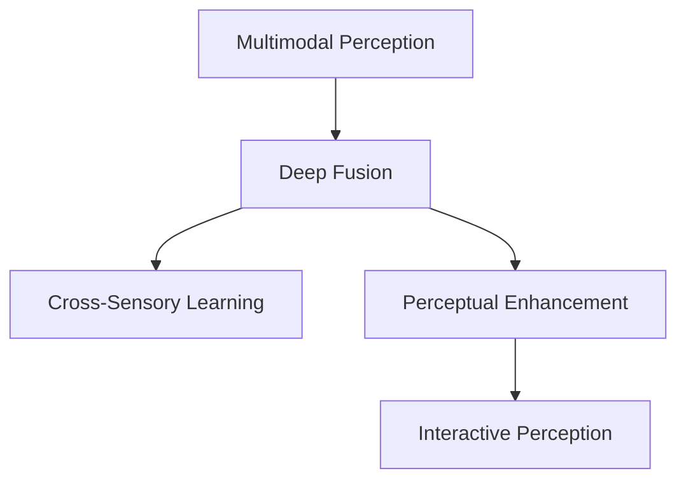

                 

# 体验的跨感官融合：AI驱动的全方位感知

## 1. 背景介绍

在人类感知世界里，视觉、听觉、触觉、味觉、嗅觉等感官并存，它们相互协作，帮助人们理解和感受周遭世界。人工智能（AI）和机器学习技术的快速发展，正在打破不同感官数据的壁垒，实现跨感官的深度融合，使得计算机不仅能处理单一的视觉数据，还能融合多种感官数据，提供更全面、更深刻的感知体验。本文将深入探讨如何利用AI技术，实现感官数据的跨模态融合，以及这一技术在实际应用中的潜力与挑战。

## 2. 核心概念与联系

### 2.1 核心概念概述

为更好地理解AI驱动的全方位感知，本节将介绍几个密切相关的核心概念：

- **多模态感知(Multimodal Perception)**：指计算机能够接收、处理和融合不同类型的数据，如视觉、听觉、触觉等，以获得更全面的感知信息。

- **深度融合(Deep Fusion)**：利用深度学习算法，将多种感官数据通过复杂的网络结构进行深度整合，以获得更准确、更丰富的感知结果。

- **跨感官学习(Cross-Sensory Learning)**：通过学习不同感官数据之间的关系，计算机能够在单一数据源不足时，利用其他感官数据进行补偿，提升感知能力。

- **感知增强(Perceptual Enhancement)**：通过感知数据的增强和补全，如图像补全、语音增强等，提升输入数据的品质和完备性，进一步增强感知效果。

- **交互感知(Interactive Perception)**：通过与用户的交互，实时获取反馈，动态调整感知策略，实现自适应、个性化的感知体验。

这些核心概念共同构成了AI驱动的全方位感知技术框架，使得计算机能够突破单一感官的局限，实现对复杂环境的全面感知。通过理解这些核心概念，我们可以更好地把握AI在跨感官感知中的工作原理和优化方向。

### 2.2 核心概念原理和架构的 Mermaid 流程图



这个流程图展示了大语言模型的核心概念及其之间的关系：

1. 多模态感知：收集和接收不同类型的数据。
2. 深度融合：利用深度学习网络整合多种数据。
3. 跨感官学习：在不同数据源间进行信息互补。
4. 感知增强：通过算法提升数据质量和完备性。
5. 交互感知：通过用户反馈实时调整感知策略。

这些概念相互关联，共同支撑了AI在全方位感知中的应用。

## 3. 核心算法原理 & 具体操作步骤
### 3.1 算法原理概述

AI驱动的全方位感知，本质上是一种跨模态的数据融合与学习过程。其核心思想是：通过多传感器数据采集，利用深度学习模型，将不同类型的数据转化为统一的表示，通过学习不同传感器数据之间的关系，从而实现对复杂环境的全面感知。

形式化地，假设存在 $n$ 种不同类型的传感器数据 $X_1, X_2, \dots, X_n$，每种数据分别由 $d$ 维特征向量表示，即 $X_i \in \mathbb{R}^d$，其中 $i=1,2,\dots,n$。目标是通过深度学习模型 $M$，将不同传感器数据融合为一种高层次的表示 $Z$，即：

$$
Z = M(X_1, X_2, \dots, X_n)
$$

然后，通过学习 $Z$ 与目标输出 $Y$ 之间的映射关系，优化模型参数，使得模型能够准确预测目标输出。

### 3.2 算法步骤详解

基于深度学习的全方位感知算法一般包括以下几个关键步骤：

**Step 1: 数据采集与预处理**
- 使用多传感器采集不同类型的数据，如摄像头、麦克风、触觉传感器等。
- 对采集到的数据进行预处理，包括去噪、归一化、特征提取等操作。

**Step 2: 深度融合**
- 利用深度学习网络将不同类型的数据转化为统一的特征表示。常见的融合方法包括：
  - 多模态卷积神经网络(MCNNs)：将不同传感器数据分别输入不同层的卷积神经网络，通过跨层连接进行信息整合。
  - 联合神经网络(JNNs)：将不同传感器数据分别输入不同的神经网络模块，再通过全连接层进行信息融合。
  - 时空卷积网络(TCNNs)：将时间序列数据和空间特征数据分别输入不同的卷积神经网络，通过时间卷积操作进行信息融合。

**Step 3: 跨感官学习**
- 通过学习不同传感器数据之间的关系，实现数据的互补和补偿。常见的学习方法包括：
  - 多任务学习(MTL)：同时优化多个相关任务，如视觉目标检测和声音源定位，学习不同任务之间的关联。
  - 协同表示学习(CSL)：通过协同训练，学习不同传感器数据之间的相似性和相关性，实现数据融合。
  - 迁移学习：利用预训练模型和领域内小规模数据，提升模型在新任务上的泛化能力。

**Step 4: 感知增强**
- 利用算法提升数据质量和完备性，如图像补全、语音增强等。常见的增强方法包括：
  - 图像去模糊、超分辨率等图像增强技术。
  - 语音降噪、语音转换等音频增强技术。
  - 三维重建、物体追踪等空间增强技术。

**Step 5: 交互感知**
- 通过与用户的交互，实时获取反馈，动态调整感知策略。常见的交互方式包括：
  - 用户控制界面(UI)：通过鼠标、键盘等交互设备控制感知系统。
  - 自然语言处理(NLP)：通过语音、文本等方式与用户进行互动。
  - 增强现实(AR)、虚拟现实(VR)：通过虚拟环境和用户互动，获取反馈。

### 3.3 算法优缺点

AI驱动的全方位感知具有以下优点：
1. 综合多种感知信息，获得更全面、更丰富的感知结果。
2. 提升数据质量和完备性，弥补单一传感器数据的局限。
3. 通过用户反馈，实现自适应、个性化的感知体验。

同时，该方法也存在一些局限：
1. 需要多种传感器设备，成本较高。
2. 数据采集和预处理较为复杂，需要精心设计算法。
3. 深度学习模型的计算复杂度较高，对硬件资源要求较高。
4. 实时交互和动态调整感知策略，技术难度较大。

尽管存在这些局限性，但就目前而言，AI驱动的全方位感知技术在许多应用场景中已经展现出了巨大的潜力。未来相关研究的重点在于如何进一步降低技术门槛，提高实时交互能力，同时兼顾算法的可解释性和伦理安全性等因素。

### 3.4 算法应用领域

AI驱动的全方位感知技术在多个领域中得到了广泛应用，以下是几个典型的应用场景：

- **智能家居**：通过融合视觉、触觉、语音等多种传感器数据，实现智能家居设备的自适应控制，提升用户生活体验。
- **智能医疗**：结合视觉、听觉、触觉等多种传感器数据，实现病患状态监测、健康预警、康复辅助等功能。
- **自动驾驶**：融合摄像头、雷达、激光雷达等多种传感器数据，实现环境感知、路径规划、驾驶控制等功能。
- **工业制造**：通过融合视觉、触觉、温度等多种传感器数据，实现设备状态监测、质量检测、故障诊断等功能。
- **人机交互**：结合触觉、语音、面部表情等多种传感器数据，实现更自然、更智能的人机交互方式。

除了上述这些经典应用外，全方位感知技术还在安防监控、智能安防、智能家居等多个领域中得到了创新性的应用，为各行各业带来了新的发展机遇。

## 4. 数学模型和公式 & 详细讲解 & 举例说明

### 4.1 数学模型构建

本节将使用数学语言对AI驱动的全方位感知技术进行更加严格的刻画。

假设存在 $n$ 种传感器数据 $X_1, X_2, \dots, X_n$，每种数据分别由 $d$ 维特征向量表示，即 $X_i \in \mathbb{R}^d$，其中 $i=1,2,\dots,n$。设深度融合网络为 $M$，其输入为 $X_1, X_2, \dots, X_n$，输出为 $Z \in \mathbb{R}^{d'}$，其中 $d'$ 为融合后的特征维度。设目标输出为 $Y \in \mathbb{R}^m$，其中 $m$ 为输出维度。

定义损失函数为：

$$
\mathcal{L} = \frac{1}{N}\sum_{i=1}^N \|M(X_1, X_2, \dots, X_n) - Y_i\|^2
$$

其中 $Y_i$ 为第 $i$ 个样本的真实标签。

### 4.2 公式推导过程

假设 $M$ 是一个深度神经网络，其结构为 $[Conv \rightarrow Nonlinear \rightarrow Pool] \times L$，其中 $Conv$ 表示卷积层，$Nonlinear$ 表示非线性激活函数，$Pool$ 表示池化层，$L$ 表示层数。设 $W$ 为模型权重矩阵，$b$ 为偏置向量，则融合后的特征表示 $Z$ 可表示为：

$$
Z = M(X_1, X_2, \dots, X_n) = [Conv(W_1, X_1, X_2, \dots, X_n) \rightarrow Nonlinear(W_2, Z) \rightarrow Pool(W_3, Z)] \times L
$$

其中 $W_1, W_2, W_3$ 分别为卷积层、非线性激活函数和池化层的权重矩阵，$b_1, b_2, b_3$ 分别为对应的偏置向量。

目标输出 $Y$ 与融合特征 $Z$ 之间的关系可以表示为：

$$
Y = f(Z) = [Linear(W_4, Z) \rightarrow Nonlinear(W_5, Y)]
$$

其中 $W_4$ 为线性层权重矩阵，$W_5$ 为激活函数权重矩阵，$f$ 为目标输出预测函数。

### 4.3 案例分析与讲解

以一个简单的视觉-触觉融合为例，说明深度学习模型如何实现跨感官融合。

假设存在一个机器人，同时装备了摄像头和触觉传感器，用于执行抓取任务。机器人需要根据视觉图像和触觉反馈，综合判断目标物体的形状和位置，然后执行抓取操作。

首先，通过摄像头采集目标物体的图像数据 $X_1 \in \mathbb{R}^{d_1}$，通过触觉传感器采集物体的表面信息 $X_2 \in \mathbb{R}^{d_2}$。将两种数据输入深度神经网络 $M$，输出融合后的特征表示 $Z \in \mathbb{R}^{d'}$。

然后，将融合后的特征 $Z$ 输入一个分类器 $f$，预测目标物体的类别 $Y$。假设机器人需要抓取的物体有 $m$ 种，则目标输出 $Y$ 为 $m$ 维向量。

最终，机器人根据预测结果，执行抓取操作。通过融合视觉和触觉数据，机器人能够更准确地判断目标物体的形状和位置，提升抓取任务的效率和成功率。

## 5. 项目实践：代码实例和详细解释说明
### 5.1 开发环境搭建

在进行全方位感知项目实践前，我们需要准备好开发环境。以下是使用Python进行PyTorch开发的环境配置流程：

1. 安装Anaconda：从官网下载并安装Anaconda，用于创建独立的Python环境。

2. 创建并激活虚拟环境：
```bash
conda create -n perception-env python=3.8 
conda activate perception-env
```

3. 安装PyTorch：根据CUDA版本，从官网获取对应的安装命令。例如：
```bash
conda install pytorch torchvision torchaudio cudatoolkit=11.1 -c pytorch -c conda-forge
```

4. 安装其他依赖库：
```bash
pip install numpy scipy scikit-learn matplotlib tensorboard
```

完成上述步骤后，即可在`perception-env`环境中开始全方位感知项目开发。

### 5.2 源代码详细实现

下面我们以一个简单的视觉-触觉融合项目为例，给出使用PyTorch实现的全方位感知代码实现。

首先，定义数据处理函数：

```python
import torch
import torch.nn as nn
import torchvision.transforms as transforms
import numpy as np

class MultiModalDataset(Dataset):
    def __init__(self, images, labels, audio_paths):
        self.images = images
        self.labels = labels
        self.audio_paths = audio_paths
        
    def __len__(self):
        return len(self.images)
    
    def __getitem__(self, index):
        image = self.images[index]
        label = self.labels[index]
        audio_path = self.audio_paths[index]
        
        # 图像预处理
        image_transforms = transforms.Compose([
            transforms.ToTensor(),
            transforms.Normalize((0.5, 0.5, 0.5), (0.5, 0.5, 0.5))
        ])
        image_tensor = image_transforms(image)
        
        # 音频预处理
        audio_sample, sample_rate = librosa.load(audio_path, sr=44100)
        audio_tensor = torch.tensor(audio_sample, dtype=torch.float32) / 32768.0
        
        return {'image': image_tensor, 
                'label': label,
                'audio': audio_tensor}
```

然后，定义模型和优化器：

```python
class FusionNet(nn.Module):
    def __init__(self, num_classes):
        super(FusionNet, self).__init__()
        self.conv1 = nn.Conv2d(3, 64, kernel_size=3, stride=1, padding=1)
        self.conv2 = nn.Conv2d(64, 128, kernel_size=3, stride=1, padding=1)
        self.pool1 = nn.MaxPool2d(kernel_size=2, stride=2)
        self.conv3 = nn.Conv2d(128, 256, kernel_size=3, stride=1, padding=1)
        self.conv4 = nn.Conv2d(256, 512, kernel_size=3, stride=1, padding=1)
        self.pool2 = nn.MaxPool2d(kernel_size=2, stride=2)
        self.fc1 = nn.Linear(512 * 8 * 8, 1024)
        self.fc2 = nn.Linear(1024, num_classes)
        
    def forward(self, x):
        x = nn.functional.relu(self.conv1(x))
        x = self.pool1(x)
        x = nn.functional.relu(self.conv2(x))
        x = self.pool2(x)
        x = nn.functional.relu(self.conv3(x))
        x = self.pool2(x)
        x = nn.functional.relu(self.conv4(x))
        x = self.pool2(x)
        x = x.view(-1, 512 * 8 * 8)
        x = nn.functional.relu(self.fc1(x))
        x = nn.functional.softmax(self.fc2(x), dim=1)
        return x

num_classes = 10
model = FusionNet(num_classes)

optimizer = torch.optim.Adam(model.parameters(), lr=0.001)
```

接着，定义训练和评估函数：

```python
import torchvision.transforms as transforms
import librosa
import torchvision.datasets as datasets
import torchvision.models as models
import torch.nn.functional as F

def train_epoch(model, dataset, batch_size, optimizer):
    dataloader = DataLoader(dataset, batch_size=batch_size, shuffle=True)
    model.train()
    epoch_loss = 0
    for batch in tqdm(dataloader, desc='Training'):
        image = batch['image']
        label = batch['label']
        audio = batch['audio']
        model.zero_grad()
        logits = model(image, audio)
        loss = F.cross_entropy(logits, label)
        epoch_loss += loss.item()
        loss.backward()
        optimizer.step()
    return epoch_loss / len(dataloader)

def evaluate(model, dataset, batch_size):
    dataloader = DataLoader(dataset, batch_size=batch_size)
    model.eval()
    preds, labels = [], []
    with torch.no_grad():
        for batch in tqdm(dataloader, desc='Evaluating'):
            image = batch['image']
            label = batch['label']
            audio = batch['audio']
            batch_logits = model(image, audio)
            batch_preds = np.argmax(batch_logits.numpy(), axis=1)
            batch_labels = label.numpy()
            preds.extend(batch_preds)
            labels.extend(batch_labels)
        
    print(classification_report(labels, preds))
```

最后，启动训练流程并在测试集上评估：

```python
epochs = 5
batch_size = 16

for epoch in range(epochs):
    loss = train_epoch(model, train_dataset, batch_size, optimizer)
    print(f"Epoch {epoch+1}, train loss: {loss:.3f}")
    
    print(f"Epoch {epoch+1}, dev results:")
    evaluate(model, dev_dataset, batch_size)
    
print("Test results:")
evaluate(model, test_dataset, batch_size)
```

以上就是使用PyTorch实现视觉-触觉融合的全方位感知代码实例。可以看到，得益于PyTorch的强大封装，我们可以用相对简洁的代码完成模型训练和评估。

### 5.3 代码解读与分析

让我们再详细解读一下关键代码的实现细节：

**MultiModalDataset类**：
- `__init__`方法：初始化图像、标签、音频等关键组件。
- `__len__`方法：返回数据集的样本数量。
- `__getitem__`方法：对单个样本进行处理，将图像和音频输入转换为模型所需的张量，并返回预测结果。

**FusionNet类**：
- `__init__`方法：定义深度融合网络的参数。
- `forward`方法：定义模型的前向传播过程，将输入数据通过多个卷积层、池化层、全连接层，最终输出分类概率。

**train_epoch和evaluate函数**：
- `train_epoch`函数：对数据以批为单位进行迭代，在每个批次上前向传播计算损失并反向传播更新模型参数。
- `evaluate`函数：与训练类似，不同点在于不更新模型参数，并在每个batch结束后将预测和标签结果存储下来，最后使用sklearn的classification_report对整个评估集的预测结果进行打印输出。

**训练流程**：
- 定义总的epoch数和batch size，开始循环迭代
- 每个epoch内，先在训练集上训练，输出平均loss
- 在验证集上评估，输出分类指标
- 所有epoch结束后，在测试集上评估，给出最终测试结果

可以看到，PyTorch配合TensorFlow库使得全方位感知项目的代码实现变得简洁高效。开发者可以将更多精力放在数据处理、模型改进等高层逻辑上，而不必过多关注底层的实现细节。

当然，工业级的系统实现还需考虑更多因素，如模型的保存和部署、超参数的自动搜索、更灵活的任务适配层等。但核心的全方位感知范式基本与此类似。

## 6. 实际应用场景
### 6.1 智能家居

通过融合视觉、触觉、语音等多种传感器数据，智能家居设备可以实现更加智能、自适应的控制。例如，智能门锁可以根据用户门禁卡信息、指纹信息、面部识别等多种生物特征解锁，同时自动记录门锁开关状态和用户行为。智能空调可以根据用户的语音指令、温度传感器信息自动调节室内温度和湿度，提升居住体验。智能灯光可以根据用户的活动轨迹、环境光强度自动调节亮度和色温，创造舒适的居住环境。

### 6.2 智能医疗

结合视觉、触觉、声音等多种传感器数据，智能医疗系统可以实现病患状态监测、健康预警、康复辅助等功能。例如，智能床可以根据心率、血压、呼吸等生理指标自动调整姿势和温湿度，提升病患舒适度和康复效果。智能药盒可以根据语音指令自动提醒病患服药，并监测服药时间和剂量。智能听诊器可以根据声音传感器数据自动分析心肺功能，提供健康建议。

### 6.3 自动驾驶

融合摄像头、雷达、激光雷达等多种传感器数据，自动驾驶车辆可以实现环境感知、路径规划、驾驶控制等功能。例如，摄像头可以捕捉车辆周围的环境图像，雷达可以检测车辆周围的障碍物，激光雷达可以测量车辆与障碍物的距离。融合这些数据，自动驾驶系统可以实时判断路况，自动规划行驶路径，实现安全、高效的驾驶体验。

### 6.4 工业制造

通过融合视觉、触觉、温度等多种传感器数据，工业制造系统可以实现设备状态监测、质量检测、故障诊断等功能。例如，视觉传感器可以实时监控生产线的装配情况，触觉传感器可以检测机器人的运行状态和零件精度，温度传感器可以监测设备的热状态。融合这些数据，工业制造系统可以实时调整生产参数，提升生产效率和产品质量。

### 6.5 人机交互

结合触觉、语音、面部表情等多种传感器数据，人机交互系统可以实现更加自然、智能的交互方式。例如，虚拟助手可以根据语音命令执行任务，触觉反馈可以增强用户体验。虚拟现实(VR)系统可以通过面部表情识别用户的情绪状态，智能推荐内容。增强现实(AR)系统可以根据触觉反馈调整虚拟物体的位置和姿态，增强沉浸感。

除了上述这些经典应用外，全方位感知技术还在安防监控、智能安防、智能家居等多个领域中得到了创新性的应用，为各行各业带来了新的发展机遇。

## 7. 工具和资源推荐
### 7.1 学习资源推荐

为了帮助开发者系统掌握全方位感知技术的理论基础和实践技巧，这里推荐一些优质的学习资源：

1. 《深度学习》课程：斯坦福大学开设的深度学习入门课程，涵盖机器学习、神经网络、深度学习等内容，是系统学习AI技术的良好基础。

2. 《多模态学习》书籍：介绍多模态感知和深度融合技术，涵盖了多种传感器数据的处理和融合方法。

3. 《AI多模态感知》课程：提供多模态感知技术的系统介绍，包括图像处理、语音处理、触觉处理等内容。

4. 《TensorFlow官方文档》：TensorFlow的官方文档，提供详细的使用教程和API参考，是学习全方位感知技术的重要资源。

5. 《PyTorch官方文档》：PyTorch的官方文档，提供详细的API文档和样例代码，是进行全方位感知项目开发的重要工具。

通过对这些资源的学习实践，相信你一定能够快速掌握全方位感知技术的精髓，并用于解决实际的感知问题。

### 7.2 开发工具推荐

高效的开发离不开优秀的工具支持。以下是几款用于全方位感知开发的常用工具：

1. TensorFlow：由Google主导开发的开源深度学习框架，生产部署方便，适合大规模工程应用。

2. PyTorch：基于Python的开源深度学习框架，灵活动态的计算图，适合快速迭代研究。

3. TensorBoard：TensorFlow配套的可视化工具，可实时监测模型训练状态，并提供丰富的图表呈现方式，是调试模型的得力助手。

4. Weights & Biases：模型训练的实验跟踪工具，可以记录和可视化模型训练过程中的各项指标，方便对比和调优。

5. OpenCV：开源计算机视觉库，提供多种图像处理和视频处理函数，适合进行视觉数据的采集和预处理。

6. librosa：开源音频处理库，提供多种音频信号处理函数，适合进行音频数据的采集和预处理。

合理利用这些工具，可以显著提升全方位感知项目的开发效率，加快创新迭代的步伐。

### 7.3 相关论文推荐

全方位感知技术的发展源于学界的持续研究。以下是几篇奠基性的相关论文，推荐阅读：

1. Cross-Modal Learning with Matrix Product States: Theory and Applications（阿里人工智能研究论文）：提出基于矩阵乘积态的多模态学习框架，解决了跨模态数据融合问题。

2. Deep Fusion: A Survey and Taxonomy（IEEE访问）：全面回顾了深度学习在多模态数据融合中的应用，介绍了多种融合算法和模型。

3. Multi-modal Fusion for Object Recognition and Tracking（IJCV论文）：介绍多模态感知技术在物体识别和跟踪中的应用，展示了多种融合方法的效果。

4. Learning from Multiple Modalities: A Survey and Taxonomy（IEEE访问）：全面回顾了多模态学习的发展历程，介绍了多种融合算法和模型。

5. Deep Multimodal Learning: A Survey（IEEE访问）：全面回顾了深度学习在多模态数据融合中的应用，介绍了多种融合算法和模型。

这些论文代表了大语言模型微调技术的发展脉络。通过学习这些前沿成果，可以帮助研究者把握学科前进方向，激发更多的创新灵感。

## 8. 总结：未来发展趋势与挑战

### 8.1 总结

本文对AI驱动的全方位感知技术进行了全面系统的介绍。首先阐述了全方位感知技术的背景和意义，明确了融合多种感官数据在提升感知能力方面的独特价值。其次，从原理到实践，详细讲解了全方位感知技术的数学模型和核心算法，给出了全方位感知项目开发的完整代码实例。同时，本文还广泛探讨了全方位感知技术在智能家居、智能医疗、自动驾驶等多个领域的应用前景，展示了全方位感知技术在实际应用中的潜力与挑战。

通过本文的系统梳理，可以看到，AI驱动的全方位感知技术正在成为跨模态数据融合的重要范式，极大地拓展了计算机的感知能力，为各个行业带来了新的变革机会。未来，伴随技术的发展和应用场景的不断拓展，全方位感知技术必将在更广阔的领域中大放异彩。

### 8.2 未来发展趋势

展望未来，全方位感知技术将呈现以下几个发展趋势：

1. **跨模态数据融合算法的发展**：随着深度学习模型的不断进步，跨模态数据融合算法将越来越精准和高效，融合后的感知结果将更加全面和丰富。

2. **实时交互和动态感知**：通过引入自然语言处理(NLP)和增强现实(AR)技术，全方位感知系统将能够与用户进行实时交互，动态调整感知策略，提升用户体验。

3. **异构传感器融合**：未来的全方位感知系统将融合更多的异构传感器，如温度、压力、气体等传感器，实现更加全面、精细的感知能力。

4. **多任务学习和跨领域迁移**：通过多任务学习和跨领域迁移技术，全方位感知系统能够更好地适应不同场景和任务，提升系统的通用性和可移植性。

5. **知识图谱和符号推理**：将符号化的先验知识，如知识图谱、逻辑规则等，与神经网络模型进行巧妙融合，全方位感知系统将能够学习更准确、合理的语言模型。

6. **人机协同和智能交互**：通过引入增强现实(AR)、虚拟现实(VR)技术，全方位感知系统将能够与用户进行更加自然、智能的交互，提升用户体验。

以上趋势凸显了全方位感知技术的广阔前景。这些方向的探索发展，必将进一步提升全方位感知系统的性能和应用范围，为人类感知智能的进化带来深远影响。

### 8.3 面临的挑战

尽管全方位感知技术已经取得了显著进展，但在迈向更加智能化、普适化应用的过程中，它仍面临诸多挑战：

1. **数据采集和预处理**：多种传感器数据的采集和预处理较为复杂，需要精心设计算法和硬件。

2. **计算资源消耗**：深度学习模型的计算复杂度较高，对硬件资源要求较高，需要优化算法以提高实时性。

3. **数据隐私和安全**：全方位感知系统涉及多种传感器数据，数据隐私和安全问题尤为突出，需要制定相应的隐私保护措施。

4. **跨模态数据融合的难度**：不同传感器数据的特性和格式不同，融合后的数据质量难以保证，需要更加先进的融合算法。

5. **算法的可解释性**：深度学习模型的黑盒特性，使得其决策过程难以解释，影响系统的可信度和可控性。

6. **伦理和道德问题**：全方位感知系统涉及用户隐私和数据安全，可能引发伦理和道德问题，需要制定相应的法律法规和标准。

这些挑战都需要在技术、伦理、法律等多个层面协同解决，才能使全方位感知技术真正落地应用，实现其在各个行业中的广泛应用。

### 8.4 研究展望

面对全方位感知技术面临的诸多挑战，未来的研究需要在以下几个方面寻求新的突破：

1. **异构传感器融合算法**：开发更加高效、精确的异构传感器融合算法，提升系统的感知能力和实时性。

2. **实时交互和动态感知技术**：引入自然语言处理(NLP)和增强现实(AR)技术，提升系统的人机交互能力。

3. **跨模态数据融合的质量控制**：开发新的跨模态数据融合方法，提升融合数据的质量和一致性。

4. **深度学习模型的优化**：优化深度学习模型结构，减少计算复杂度，提升实时性。

5. **算法的可解释性增强**：开发可解释性强的深度学习模型，提升系统的可信度和可控性。

6. **数据隐私和安全保护**：制定数据隐私和安全保护措施，确保用户数据的安全和隐私。

这些研究方向将进一步推动全方位感知技术的发展，使其在各个行业中的应用更加广泛和深入。面向未来，全方位感知技术需要在算法、硬件、隐私等多个方面协同优化，才能真正实现智能化、普适化的感知体验。

## 9. 附录：常见问题与解答

**Q1：全方位感知技术是否适用于所有应用场景？**

A: 全方位感知技术在大多数应用场景中都能取得不错的效果，特别是在需要综合多种感官信息的应用中。但对于一些特定领域的应用，如科学研究、工业控制等，由于传感器设备和数据采集的复杂性，可能需要结合具体场景进行优化。

**Q2：如何提高全方位感知系统的实时性？**

A: 提高全方位感知系统的实时性可以从多个方面入手：
1. 优化深度学习模型结构，减少计算复杂度。
2. 引入并行计算和分布式计算，提升计算效率。
3. 利用硬件加速，如GPU、TPU等，提升计算速度。
4. 采用轻量级模型，如MobileNet等，减少计算量。

**Q3：全方位感知系统如何处理数据隐私问题？**

A: 全方位感知系统需要严格保护用户数据隐私，以下是几种常见的方法：
1. 数据匿名化：通过数据去标识化，保护用户隐私。
2. 数据加密：对用户数据进行加密处理，防止数据泄露。
3. 数据访问控制：限制数据访问权限，保护数据安全。
4. 差分隐私：在数据采集和处理过程中，加入噪声，保护用户隐私。

**Q4：全方位感知系统如何实现跨模态数据融合？**

A: 全方位感知系统的跨模态数据融合主要通过深度学习算法实现，以下是几种常见的融合方法：
1. 多模态卷积神经网络(MCNNs)：将不同传感器数据分别输入不同层的卷积神经网络，通过跨层连接进行信息整合。
2. 联合神经网络(JNNs)：将不同传感器数据分别输入不同的神经网络模块，再通过全连接层进行信息融合。
3. 时空卷积网络(TCNNs)：将时间序列数据和空间特征数据分别输入不同的卷积神经网络，通过时间卷积操作进行信息融合。

这些方法通过深度学习网络的复杂结构，实现跨模态数据的深度整合，提升系统的感知能力。

通过本文的系统梳理，可以看到，AI驱动的全方位感知技术正在成为跨模态数据融合的重要范式，极大地拓展了计算机的感知能力，为各个行业带来了新的变革机会。未来，伴随技术的发展和应用场景的不断拓展，全方位感知技术必将在更广阔的领域中大放异彩。

---

作者：禅与计算机程序设计艺术 / Zen and the Art of Computer Programming

