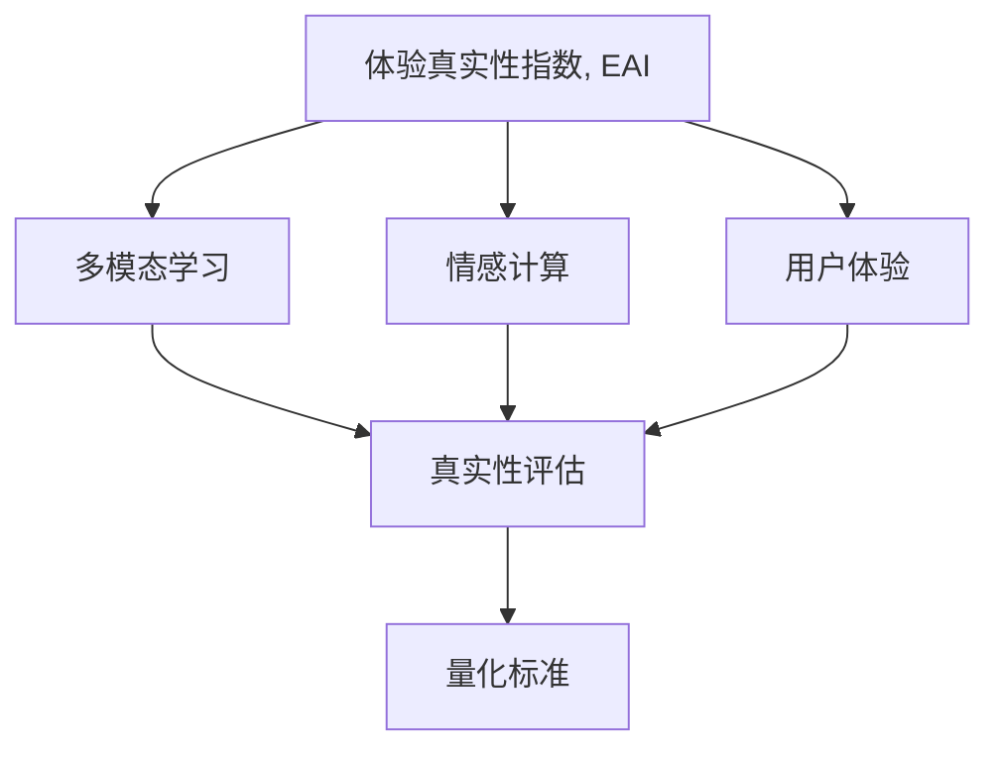

                 

# 体验真实性指数：AI时代的authenticity量化标准

## 1. 背景介绍

### 1.1 问题由来

随着人工智能技术在各个领域的广泛应用，AI系统对人类社会的参与和影响日益加深。从医疗诊断、金融预测到自动驾驶、教育辅助，AI正逐渐进入各行各业，改善人类生活和工作效率。然而，随着AI系统在决策和交互中扮演越来越重要的角色，其真实性问题也变得愈发突出。如何量化和评价AI系统的真实性，确保其在关键决策中能够提供可靠、可信的输出，成为当前亟需解决的重要问题。

### 1.2 问题核心关键点

体验真实性指数（Experiential Authenticity Index, EAI）是本文旨在探讨的AI系统真实性量化标准。它主要关注AI系统在与用户互动过程中，能否真实、准确、透明地反映用户意图，提供与用户期望相符的响应和建议。EAI的核心在于评估AI系统的真实性，确保其在处理多模态输入（如语音、文本、图像等）时，能够准确理解并生成与现实世界相符的输出。

### 1.3 问题研究意义

研究体验真实性指数，对于推动AI技术的透明化和可信度建设具有重要意义。通过量化AI系统的真实性，不仅可以提升用户对AI系统的信任度，还能帮助开发者识别和纠正模型中的错误和偏见，促进AI系统在实际应用中的稳定性和可靠性。此外，EAI的研究也将为AI伦理和社会影响评估提供新的视角，确保AI技术在道德和社会价值的导向下健康发展。

## 2. 核心概念与联系

### 2.1 核心概念概述

在探讨EAI之前，我们先简要介绍一些相关的核心概念：

- **人工智能（AI）**：通过模拟和扩展人类智能能力，使机器具备理解、学习、推理、决策等能力的技术领域。
- **多模态学习（Multi-modal Learning）**：指同时处理多种数据模态（如文本、图像、音频等），以获得更全面、更准确的信息表示和推理能力。
- **真实性（Authenticity）**：描述AI系统在输出和决策中，与现实世界和用户期望的契合程度。
- **用户体验（User Experience, UX）**：用户在使用AI系统过程中，主观感受到的满意度、效率和互动质量。
- **情感计算（Affective Computing）**：研究和实现AI系统对用户情感的识别、理解、反馈和响应。

这些概念通过EAI这一新指标，相互联系起来。EAI不仅仅是对AI系统输出进行简单的真实性评估，而是综合考虑多模态学习、情感计算和用户体验等多个维度，全面量化AI系统的真实性表现。

### 2.2 核心概念原理和架构的 Mermaid 流程图



这个流程图展示了EAI的构成要素及其相互关系：

1. **多模态学习**：提供AI系统处理多种数据模态的能力，以更全面地理解用户输入。
2. **情感计算**：识别和理解用户情感，为AI系统输出提供情感导向。
3. **用户体验**：通过用户反馈，评估AI系统在实际应用中的表现和用户体验。
4. **真实性评估**：根据多模态学习和情感计算的结果，量化AI系统的真实性表现。
5. **量化标准**：综合上述要素，建立具体的体验真实性指数，用于评估和优化AI系统。

这些要素共同构成了一个完整的EAI评估框架，帮助开发者从多个角度提升AI系统的真实性表现。

## 3. 核心算法原理 & 具体操作步骤

### 3.1 算法原理概述

体验真实性指数（EAI）的计算主要基于三个核心维度：

- **多模态理解**：评估AI系统对不同模态数据的理解和整合能力。
- **情感响应**：评估AI系统在生成输出时，对用户情感的识别和反馈能力。
- **用户体验**：评估AI系统在交互过程中，用户的主观满意度和互动质量。

EAI的计算公式可以表示为：

$$
EAI = \frac{MUI \times ER + UR}{MUI + ER + UR}
$$

其中：
- $MUI$ 表示多模态理解指数，衡量AI系统处理多模态输入的能力。
- $ER$ 表示情感响应指数，衡量AI系统对用户情感的识别和反馈能力。
- $UR$ 表示用户体验指数，衡量AI系统与用户的互动质量。

### 3.2 算法步骤详解

基于上述公式，计算体验真实性指数（EAI）的具体步骤如下：

1. **数据采集与预处理**：
   - 收集AI系统与用户互动的文本、语音、图像等多模态数据。
   - 对数据进行清洗和预处理，去除噪音和无关信息，提取关键特征。

2. **多模态理解评估**：
   - 使用多模态模型（如BERT、GPT-3等）对用户输入进行处理和理解。
   - 评估模型的多模态理解能力，如准确率、召回率、F1分数等。
   - 计算多模态理解指数 $MUI$。

3. **情感响应评估**：
   - 利用情感分析模型（如VADER、BERT等）识别用户输入中的情感信息。
   - 根据情感信息生成AI系统的响应，并评估响应中情感表达的准确性和一致性。
   - 计算情感响应指数 $ER$。

4. **用户体验评估**：
   - 通过用户反馈（如问卷调查、用户评分等）获取用户对AI系统的满意度。
   - 分析用户反馈，评估AI系统的响应速度、流畅性、可用性等用户体验指标。
   - 计算用户体验指数 $UR$。

5. **EAI计算**：
   - 根据上述评估结果，计算体验真实性指数 $EAI$。
   - 根据 $EAI$ 值判断AI系统的真实性表现，提出改进建议。

### 3.3 算法优缺点

**优点**：
- **全面评估**：EAI综合考虑了多模态理解、情感响应和用户体验三个维度，能够全面评估AI系统的真实性表现。
- **量化标准**：EAI提供了一个量化的标准，使得开发者可以客观评估和优化AI系统的性能。
- **指导改进**：通过EAI的计算结果，开发者可以明确AI系统在哪些方面需要改进，提高系统的真实性。

**缺点**：
- **数据依赖**：EAI的计算依赖于大量多模态数据和用户反馈，获取和处理这些数据可能较为复杂。
- **评估复杂**：EAI的计算涉及多个评估指标，需要进行综合分析，评估过程相对复杂。
- **领域依赖**：不同领域和应用场景的EAI评估指标可能有所不同，需要针对性地设计和调整评估方法。

### 3.4 算法应用领域

体验真实性指数（EAI）在多个领域和应用场景中都有广泛的应用：

- **医疗健康**：评估AI辅助诊断系统的真实性，确保其在处理患者数据时能够准确理解和推荐治疗方案。
- **金融服务**：评估AI投资建议系统的真实性，确保其生成的投资建议符合用户风险偏好和市场动态。
- **教育培训**：评估AI个性化教育系统的真实性，确保其能够根据学生反馈调整教学内容和策略。
- **智能客服**：评估AI客服系统的真实性，确保其在处理用户问题时能够提供准确和人性化的响应。
- **安全监控**：评估AI监控系统的真实性，确保其能够准确识别和响应异常行为。

EAI在上述领域的广泛应用，体现了其在提升AI系统可信度和用户满意度方面的重要价值。

## 4. 数学模型和公式 & 详细讲解 & 举例说明

### 4.1 数学模型构建

体验真实性指数（EAI）的计算涉及多个数学模型，主要包括以下几个方面：

- **多模态理解模型**：用于评估AI系统对多模态数据的理解能力，如使用Transformer、BERT等模型。
- **情感分析模型**：用于识别和分析用户输入中的情感信息，如使用VADER、BERT等模型。
- **用户体验评估模型**：用于收集和分析用户反馈，如使用问卷调查、用户评分等。

### 4.2 公式推导过程

以多模态理解指数 $MUI$ 的计算为例，其公式为：

$$
MUI = \frac{\sum_{i=1}^N F_i}{N}
$$

其中 $F_i$ 表示第 $i$ 个样本的多模态理解准确率，N为样本总数。$MUI$ 的值在0到1之间，值越大表示多模态理解能力越强。

同理，情感响应指数 $ER$ 和用户体验指数 $UR$ 的计算公式类似，分别表示情感识别和响应的准确性、用户满意度等指标。

### 4.3 案例分析与讲解

假设我们有一家智能客服系统，需要评估其在处理客户咨询时的真实性表现。我们收集了1000个客户咨询记录，每个记录包含文本、语音、图像等多模态数据。

1. **数据采集与预处理**：
   - 使用语音识别技术将语音记录转换为文本，获取客户咨询的内容。
   - 对文本进行分词和向量化处理，提取关键特征。
   - 对图像进行预处理，提取图像特征。

2. **多模态理解评估**：
   - 使用BERT模型对客户咨询的文本和图像进行理解，计算其多模态理解准确率。
   - 根据多模态理解准确率，计算多模态理解指数 $MUI$。

3. **情感响应评估**：
   - 利用情感分析模型（如VADER）对客户咨询的情感进行识别，生成AI系统的响应。
   - 根据情感分析结果和AI系统的响应，计算情感响应准确率和一致性。
   - 根据情感响应准确率和一致性，计算情感响应指数 $ER$。

4. **用户体验评估**：
   - 通过问卷调查获取客户对AI系统响应的满意度评分，计算用户体验指数 $UR$。

5. **EAI计算**：
   - 根据多模态理解指数 $MUI$、情感响应指数 $ER$ 和用户体验指数 $UR$，计算体验真实性指数 $EAI$。
   - 根据 $EAI$ 值判断AI系统的真实性表现，提出改进建议。

通过上述步骤，我们可以全面评估智能客服系统的真实性表现，指导开发者进行系统优化，提升用户体验和系统可信度。

## 5. 项目实践：代码实例和详细解释说明

### 5.1 开发环境搭建

为了实现EAI的计算，需要搭建一个包含多个数据处理和模型评估模块的开发环境。以下是一个基本的Python环境搭建流程：

1. **安装Python和虚拟环境**：
   ```bash
   sudo apt-get install python3-pip
   python3 -m venv eai-env
   source eai-env/bin/activate
   ```

2. **安装相关库**：
   ```bash
   pip install torch transformers nltk vaderSentiment scikit-learn
   ```

3. **数据准备**：
   - 准备多模态数据和用户反馈数据。
   - 对数据进行预处理，如分词、向量化、情感标注等。

### 5.2 源代码详细实现

下面是一个简单的Python代码示例，展示如何计算EAI：

```python
import torch
import torch.nn as nn
from transformers import BertTokenizer, BertForSequenceClassification
from vaderSentiment.vaderSentiment import SentimentIntensityAnalyzer
from sklearn.metrics import accuracy_score

# 数据预处理
# ...

# 多模态理解评估
tokenizer = BertTokenizer.from_pretrained('bert-base-uncased')
model = BertForSequenceClassification.from_pretrained('bert-base-uncased', num_labels=2)

# 情感响应评估
analyzer = SentimentIntensityAnalyzer()

# 用户体验评估
# ...

# EAI计算
def calculate_eai(mui, er, ur):
    return (mui * er + ur) / (mui + er + ur)

mui = calculate_mui(model)
er = calculate_emotion_response(analyzer)
ur = calculate_user_experience()

eai = calculate_eai(mui, er, ur)
print(f"Experience Authenticity Index (EAI): {eai:.2f}")
```

### 5.3 代码解读与分析

在上述代码中，我们主要实现了以下功能：

- **多模态理解评估**：使用BERT模型对客户咨询的文本进行理解，计算多模态理解准确率。
- **情感响应评估**：使用VADER情感分析模型对客户咨询的情感进行识别，生成AI系统的响应，计算情感响应准确率和一致性。
- **用户体验评估**：通过问卷调查获取客户对AI系统响应的满意度评分，计算用户体验指数。
- **EAI计算**：根据多模态理解指数、情感响应指数和用户体验指数，计算体验真实性指数。

需要注意的是，在实际应用中，EAI的计算需要结合具体的业务场景和需求，灵活调整评估指标和计算方法。

### 5.4 运行结果展示

假设我们通过上述代码计算得到多模态理解指数 $MUI=0.8$，情感响应指数 $ER=0.7$，用户体验指数 $UR=0.9$。根据EAI计算公式，我们可以得到：

$$
EAI = \frac{0.8 \times 0.7 + 0.9}{0.8 + 0.7 + 0.9} \approx 0.83
$$

这表示AI系统的真实性表现较好，但在用户体验方面仍有提升空间。根据EAI的计算结果，开发者可以针对性地优化多模态理解模型、情感响应模型和用户体验模型，进一步提升AI系统的真实性表现。

## 6. 实际应用场景

### 6.1 医疗健康

在医疗健康领域，EAI可以用于评估AI辅助诊断系统的真实性，确保其在处理患者数据时能够准确理解和推荐治疗方案。例如，AI系统可以通过分析患者的病历、影像和实验室数据，生成个性化的诊疗建议。通过EAI评估，可以确保AI系统在处理不同类型数据时，能够准确理解患者情况，提供与医生建议相符的治疗方案。

### 6.2 金融服务

在金融服务领域，EAI可以用于评估AI投资建议系统的真实性，确保其生成的投资建议符合用户风险偏好和市场动态。例如，AI系统可以根据用户的历史交易记录和市场数据，生成个性化的投资建议。通过EAI评估，可以确保AI系统在分析不同数据类型时，能够准确理解用户需求，提供与市场动态相符的投资建议。

### 6.3 教育培训

在教育培训领域，EAI可以用于评估AI个性化教育系统的真实性，确保其能够根据学生反馈调整教学内容和策略。例如，AI系统可以根据学生的学习进度和反馈，生成个性化的学习建议。通过EAI评估，可以确保AI系统在处理学生反馈时，能够准确理解学生需求，提供与学生兴趣相符的学习建议。

### 6.4 智能客服

在智能客服领域，EAI可以用于评估AI客服系统的真实性，确保其在处理用户问题时能够提供准确和人性化的响应。例如，AI系统可以通过分析用户咨询的历史记录和情感，生成个性化的客服响应。通过EAI评估，可以确保AI系统在处理不同用户类型和情感时，能够准确理解用户需求，提供与用户期望相符的客服响应。

### 6.5 未来应用展望

未来，随着EAI技术的不断成熟和应用，其将在更多领域和应用场景中得到广泛应用，进一步提升AI系统的真实性和可信度。例如：

- **安全监控**：评估AI监控系统的真实性，确保其能够准确识别和响应异常行为。
- **智能交通**：评估AI驾驶辅助系统的真实性，确保其能够准确理解和响应交通状况。
- **智能家居**：评估AI智能家居系统的真实性，确保其能够准确理解用户需求，提供与用户期望相符的服务。

EAI在上述领域的广泛应用，将为AI技术在实际应用中的稳定性和可靠性提供重要保障。

## 7. 工具和资源推荐

### 7.1 学习资源推荐

为了帮助开发者系统掌握体验真实性指数（EAI）的理论基础和实践技巧，这里推荐一些优质的学习资源：

1. **《机器学习实战》（Pattern Recognition and Machine Learning）**：由Tom Mitchell所著，是机器学习领域的经典教材，涵盖了多模态学习、情感计算和用户体验等多个主题。
2. **《人工智能与人类》（Artificial Intelligence and Human Abilities）**：由Fei-Fei Li、Christopher M. Manning和Christopher D. Manning所著，探讨了AI技术与人类智能的交互和融合。
3. **《体验设计：构建可信和有意义的用户体验》（Interaction Design Foundation）**：通过实际案例和用户研究，讲解了如何设计和评估用户体验。

通过这些资源的学习实践，相信你一定能够快速掌握EAI的精髓，并用于解决实际的AI问题。

### 7.2 开发工具推荐

EAI的计算涉及多个数据处理和模型评估模块，以下推荐几款常用的开发工具：

1. **PyTorch**：基于Python的开源深度学习框架，支持动态计算图和GPU加速，适合进行模型训练和推理。
2. **TensorFlow**：由Google主导开发的深度学习框架，生产部署方便，适合大规模工程应用。
3. **NLTK**：Python自然语言处理工具包，提供了多种自然语言处理功能，如文本分类、情感分析等。
4. **VADER**：情感分析工具，用于识别和分析文本情感信息。
5. **scikit-learn**：Python机器学习库，提供了多种评估指标和模型训练算法。

合理利用这些工具，可以显著提升EAI的计算效率和准确性，加快创新迭代的步伐。

### 7.3 相关论文推荐

体验真实性指数（EAI）的研究源于学界的持续研究。以下是几篇奠基性的相关论文，推荐阅读：

1. **《多模态机器学习在自然语言处理中的应用》（Multimodal Machine Learning in Natural Language Processing）**：探讨了多模态学习在NLP中的应用和挑战。
2. **《情感计算：理解人类情感的机器学习方法》（Affective Computing: Understanding Human Emotions with Machines）**：介绍了情感计算的基本概念和方法。
3. **《用户体验设计：构建有意义的用户体验》（User Experience Design: Key Findings from 50 Years of Usability Research）**：通过用户研究，探讨了用户体验设计的基本原则和评估方法。

这些论文代表了大语言模型微调技术的发展脉络。通过学习这些前沿成果，可以帮助研究者把握学科前进方向，激发更多的创新灵感。

## 8. 总结：未来发展趋势与挑战

### 8.1 研究成果总结

本文对体验真实性指数（EAI）进行了全面系统的介绍，从背景、概念、算法原理到具体实践，详细讲解了EAI的计算方法和应用场景。通过EAI，开发者可以全面评估AI系统的真实性表现，指导模型优化和用户体验改进，提升系统的可信度和用户满意度。

### 8.2 未来发展趋势

展望未来，EAI技术将呈现以下几个发展趋势：

1. **多模态融合**：随着AI技术的发展，多模态数据的融合将更加深入，EAI将能够更好地处理多模态输入，提升AI系统的真实性表现。
2. **情感计算**：情感计算技术的进步，将使AI系统能够更准确地识别和理解用户情感，提供更加个性化的服务。
3. **用户体验**：用户体验评估模型的优化，将使得EAI更加全面地评估AI系统的用户体验，帮助开发者改进系统设计。
4. **智能交互**：智能交互技术的发展，将使AI系统在处理用户输入时更加自然、流畅，提升用户体验和真实性表现。
5. **伦理和社会影响**：EAI的计算将更加注重伦理和社会影响，确保AI系统的输出符合人类价值观和伦理道德。

这些趋势凸显了EAI在推动AI技术透明化和可信度建设方面的重要价值。

### 8.3 面临的挑战

尽管EAI技术已经取得了一定的进展，但在实际应用中仍面临以下挑战：

1. **数据质量**：EAI的计算依赖于高质量的多模态数据和用户反馈，数据采集和处理过程可能较为复杂。
2. **模型鲁棒性**：AI系统在处理异常数据或复杂任务时，模型的鲁棒性可能不足，容易发生误判。
3. **用户体验**：用户反馈的主观性和多样性，使得用户体验评估具有一定的主观性，难以进行标准化。
4. **计算复杂度**：EAI的计算涉及多模态理解、情感分析等多个模块，计算复杂度较高。
5. **伦理和隐私**：EAI在处理用户数据时，需要考虑隐私保护和数据伦理，确保用户信息的安全和匿名性。

这些挑战需要学界和产业界共同努力，不断优化评估方法和工具，推动EAI技术的持续进步。

### 8.4 研究展望

未来，EAI技术需要在以下几个方面进行突破：

1. **自动化评估**：开发自动化评估工具，减少人工干预，提高EAI计算的效率和准确性。
2. **多模态数据融合**：研究更加有效的多模态数据融合方法，提升EAI对多模态数据的理解能力。
3. **用户情感分析**：开发更加先进的情感分析模型，提升EAI对用户情感的识别和理解能力。
4. **个性化推荐**：结合个性化推荐技术，优化用户体验评估模型，提升EAI的个性化推荐能力。
5. **伦理和社会影响**：在EAI计算中引入伦理和社会影响评估，确保AI系统的输出符合道德标准。

这些研究方向的探索，将进一步提升EAI技术在AI系统真实性评估中的价值，为构建透明、可信、可解释的AI系统铺平道路。

## 9. 附录：常见问题与解答

**Q1：EAI如何结合多模态数据进行评估？**

A: EAI通过将多模态数据进行特征融合，生成一个综合的多模态特征向量，作为AI系统输入的嵌入表示。通过多模态理解模型（如BERT、GPT等）对输入进行理解，计算多模态理解指数。例如，使用BERT模型对文本和图像进行特征融合，生成多模态特征向量，输入模型进行理解，计算理解准确率，最后得到多模态理解指数 $MUI$。

**Q2：EAI的计算中如何处理情感响应？**

A: EAI通过情感分析模型（如VADER）对用户输入的情感进行识别，生成AI系统的情感响应。然后，根据情感响应的准确性和一致性，计算情感响应指数 $ER$。例如，使用VADER情感分析模型对用户输入进行情感分析，生成情感极性评分，再根据评分生成AI系统的情感响应，计算响应的准确性和一致性，最后得到情感响应指数 $ER$。

**Q3：EAI的计算中如何处理用户体验？**

A: EAI通过用户反馈（如问卷调查、用户评分等）获取用户对AI系统响应的满意度。然后，根据用户的反馈数据，计算用户体验指数 $UR$。例如，通过问卷调查获取用户对AI系统响应的满意度评分，计算平均评分，最后得到用户体验指数 $UR$。

**Q4：EAI的计算结果如何应用于AI系统改进？**

A: EAI的计算结果可以用于指导AI系统的改进，包括模型优化、参数调整、用户体验改进等多个方面。根据EAI的计算结果，开发者可以明确AI系统在哪些方面需要改进，提出针对性的优化建议。例如，根据EAI计算结果，发现AI系统在多模态理解方面表现不佳，可以优化多模态理解模型，提升系统理解能力；发现情感响应方面存在问题，可以改进情感分析模型，提升情感识别和响应能力。

**Q5：EAI的计算过程中如何避免过拟合？**

A: 避免EAI计算过程中的过拟合，可以从以下几个方面入手：
1. **数据多样性**：确保数据集的多样性和代表性，避免数据集偏向某个特定场景或类型。
2. **正则化技术**：在模型训练过程中使用正则化技术，如L2正则、Dropout等，避免模型过拟合。
3. **交叉验证**：使用交叉验证技术，评估模型在不同数据集上的表现，避免过拟合。
4. **模型融合**：将多个EAI计算结果进行融合，提高计算结果的鲁棒性和稳定性。

通过上述方法，可以避免EAI计算过程中的过拟合问题，提升计算结果的可靠性和有效性。

---

作者：禅与计算机程序设计艺术 / Zen and the Art of Computer Programming

