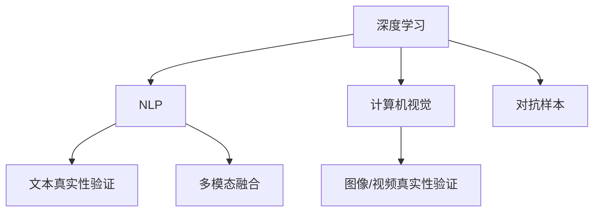

                 

# 体验真实性验证：AI时代的authenticity检测

在AI时代，验证真实性变得前所未有的复杂和紧迫。社交媒体、电子商务、网络安全等领域中，虚假信息、假冒伪劣内容层出不穷。如何识别和验证内容真实性，成为了全球性的挑战。本文将深入探讨AI时代的authenticity检测技术，包括其核心概念、算法原理、操作步骤、应用领域和未来展望。

## 1. 背景介绍

### 1.1 问题由来

虚假信息、假冒伪劣内容在社交媒体、电子商务、网络安全等领域广泛存在。这些内容不仅误导公众，损害品牌声誉，还可能威胁国家安全、公共秩序和金融稳定。传统的人工审核方式成本高、效率低，难以应对海量信息的快速传播。

近年来，AI技术的突破使得内容真实性验证变得更加高效和精确。通过深度学习、自然语言处理等技术，AI模型能够从多个维度识别和验证内容的真实性。本节将系统介绍这些技术及其背后的原理。

### 1.2 问题核心关键点

内容真实性验证的核心关键点包括：
- 数据集构建：构建高质量、有代表性的训练数据集，是模型性能的基石。
- 特征提取：从文本、图像、视频等多模态数据中提取有意义的特征，用于模型训练。
- 模型设计：选择合适的模型结构，并设计合适的训练目标，提升模型识别准确率。
- 算法优化：通过数据增强、正则化、对抗训练等技术，提高模型的泛化能力和鲁棒性。
- 应用部署：将模型部署到实际应用中，进行实时验证，提供自动化的内容审查服务。

## 2. 核心概念与联系

### 2.1 核心概念概述

为了更好地理解内容真实性验证的技术原理，本节将介绍几个密切相关的核心概念：

- **深度学习**：通过多层神经网络进行特征学习和模式识别，适用于处理大规模数据和高维数据。
- **自然语言处理(NLP)**：专注于处理、理解、生成和分析人类语言的技术，常用于文本真实性验证。
- **计算机视觉**：利用计算机对图像、视频等视觉信息进行识别、理解和处理的技术，常用于图像、视频内容真实性验证。
- **对抗样本**：对抗性样本是指在原始数据的基础上经过微小的扰动，使模型输出出现错误的结果，常用于提升模型的鲁棒性。
- **多模态融合**：将不同模态的数据（文本、图像、视频等）进行联合处理和分析，可以提升模型的综合识别能力。

这些核心概念之间的逻辑关系可以通过以下Mermaid流程图来展示：



这个流程图展示了各核心概念之间的联系：

1. 深度学习、NLP、计算机视觉等技术，分别用于不同类型数据的处理。
2. 文本、图像/视频等内容真实性验证，可以通过这些技术分别实现。
3. 对抗样本和多模态融合等技术，可用于提升模型的鲁棒性和综合识别能力。

## 3. 核心算法原理 & 具体操作步骤

### 3.1 算法原理概述

内容真实性验证本质上是一个分类问题，即判断输入的内容是真实的还是虚假的。常用的深度学习模型包括卷积神经网络(CNN)、循环神经网络(RNN)、Transformer等。本文将重点介绍Transformer模型，因为它在大规模文本处理和生成任务中表现优异。

Transformer模型主要基于自注意力机制，能够高效地并行处理大规模序列数据。在文本真实性验证中，可以将输入文本作为Transformer的输入，通过上下文语境建模，提取出文本的语义特征。然后，将这些特征输入到一个分类器，如softmax分类器，输出模型的预测结果。

### 3.2 算法步骤详解

基于Transformer的内容真实性验证算法步骤主要包括：

**Step 1: 数据准备**
- 收集高质量的标注数据集，将内容分为真实和虚假两类。
- 对文本进行预处理，如分词、去除停用词、构建词向量等。
- 对图像/视频进行预处理，如缩放、裁剪、归一化等。

**Step 2: 模型设计**
- 选择合适的Transformer架构，如BERT、GPT等。
- 设计合适的任务适配层，如在文本分类任务中，添加一个线性层和softmax分类器。
- 选择合适的网络层和激活函数，如自注意力机制、残差连接等。

**Step 3: 模型训练**
- 使用标注数据集对模型进行有监督训练，最小化损失函数。
- 使用AdamW等优化器进行梯度下降，调整模型参数。
- 设置合适的超参数，如学习率、批大小、迭代轮数等。

**Step 4: 模型评估**
- 在验证集上评估模型性能，如准确率、召回率、F1分数等。
- 根据评估结果，调整模型参数，进行进一步优化。
- 在测试集上再次评估模型，确认最终性能。

**Step 5: 部署应用**
- 将训练好的模型导出，进行量化和压缩，优化推理效率。
- 将模型集成到应用系统中，进行实时内容验证。
- 监控模型性能，定期更新模型参数，保持模型的高效性和准确性。

### 3.3 算法优缺点

基于Transformer的内容真实性验证算法具有以下优点：
1. 可处理大规模文本数据，具有较高的泛化能力。
2. 可以通过多模态融合提升综合识别能力，适用于多种内容类型。
3. 具有较好的可解释性，能够提供详细的推理过程。
4. 模型结构相对简单，易于训练和优化。

同时，该算法也存在一定的局限性：
1. 对标注数据集的质量和数量要求较高，获取高质量数据集的成本较高。
2. 对模型的参数量和计算资源要求较高，在大规模数据上训练和推理较慢。
3. 对抗样本可能会影响模型的鲁棒性，需要额外的对抗训练技术。
4. 多模态融合可能需要更多的计算资源和时间，难以实时处理。

尽管存在这些局限性，但Transformer模型在内容真实性验证中已经取得了不错的效果，成为了当前主流的研究范式。未来相关研究重点在于如何进一步降低对标注数据的依赖，提高模型的实时性，同时兼顾可解释性和鲁棒性等因素。

### 3.4 算法应用领域

内容真实性验证技术已经广泛应用于多个领域：

- **社交媒体**：如识别虚假新闻、假冒账号、恶意评论等。
- **电子商务**：如检测假冒商品、虚假评论、恶意广告等。
- **网络安全**：如识别钓鱼网站、恶意软件、虚假警报等。
- **金融领域**：如检测金融诈骗、虚假交易、恶意广告等。
- **医疗领域**：如识别虚假医疗信息、假冒药品、虚假诊断等。

除了这些传统应用外，内容真实性验证技术还被创新性地应用到更多场景中，如智能客服、舆情监测、情感分析等，为NLP技术带来了新的应用空间。

## 4. 数学模型和公式 & 详细讲解 & 举例说明

### 4.1 数学模型构建

基于Transformer的内容真实性验证模型可以形式化地表示为：

$$
M = \text{Transformer} \rightarrow \text{Classifier}
$$

其中，$\text{Transformer}$ 为Transformer模型，$\text{Classifier}$ 为分类器，输出真实性预测结果。

假设输入为文本序列 $x$，输出为真实性标签 $y$。则模型的目标函数为：

$$
\mathcal{L} = -\frac{1}{N} \sum_{i=1}^N \log p(y_i | x_i; \theta)
$$

其中 $p(y_i | x_i; \theta)$ 为模型在给定输入 $x_i$ 下，输出标签 $y_i$ 的条件概率。

### 4.2 公式推导过程

Transformer模型的输出可以表示为：

$$
y = \text{softmax}(W_y [h_{1}, h_{2}, ..., h_{T}] + b_y)
$$

其中 $h_t$ 为Transformer模型第 $t$ 层的输出，$W_y$ 和 $b_y$ 为分类器权重和偏置。

通过最大化交叉熵损失函数：

$$
\mathcal{L} = -\frac{1}{N} \sum_{i=1}^N \sum_{j=1}^C y_{i,j} \log p_{i,j}
$$

可以训练出一个高精度的内容真实性验证模型。

### 4.3 案例分析与讲解

假设我们已经收集了包含10万个文本样本的数据集，其中5000个样本是虚假信息，95000个样本是真实信息。我们可以使用BERT模型作为Transformer架构，设计一个分类器进行训练。以下是Python代码实现：

```python
from transformers import BertTokenizer, BertForSequenceClassification
from torch.utils.data import DataLoader, Dataset
from torch import nn, optim

class TextDataset(Dataset):
    def __init__(self, texts, labels):
        self.texts = texts
        self.labels = labels
        self.tokenizer = BertTokenizer.from_pretrained('bert-base-uncased')
    
    def __len__(self):
        return len(self.texts)
    
    def __getitem__(self, idx):
        text = self.texts[idx]
        label = self.labels[idx]
        
        encoding = self.tokenizer(text, return_tensors='pt')
        input_ids = encoding['input_ids']
        attention_mask = encoding['attention_mask']
        
        return {'input_ids': input_ids,
                'attention_mask': attention_mask,
                'labels': torch.tensor(label, dtype=torch.long)}

# 加载数据集
train_dataset = TextDataset(train_texts, train_labels)
val_dataset = TextDataset(val_texts, val_labels)
test_dataset = TextDataset(test_texts, test_labels)

# 定义模型
model = BertForSequenceClassification.from_pretrained('bert-base-uncased', num_labels=2)

# 定义优化器和损失函数
optimizer = optim.AdamW(model.parameters(), lr=2e-5)
loss_fn = nn.CrossEntropyLoss()

# 训练模型
for epoch in range(epochs):
    model.train()
    for batch in DataLoader(train_dataset, batch_size=16):
        inputs = batch['input_ids'].to(device)
        attention_mask = batch['attention_mask'].to(device)
        labels = batch['labels'].to(device)
        
        outputs = model(inputs, attention_mask=attention_mask)
        loss = loss_fn(outputs.logits, labels)
        
        optimizer.zero_grad()
        loss.backward()
        optimizer.step()

    model.eval()
    with torch.no_grad():
        val_loss = 0
        val_correct = 0
        for batch in DataLoader(val_dataset, batch_size=16):
            inputs = batch['input_ids'].to(device)
            attention_mask = batch['attention_mask'].to(device)
            labels = batch['labels'].to(device)
            
            outputs = model(inputs, attention_mask=attention_mask)
            loss = loss_fn(outputs.logits, labels)
            val_loss += loss.item()
            val_correct += (outputs.logits.argmax(dim=1) == labels).float().sum().item()

        val_accuracy = val_correct / len(val_dataset)

    print(f'Epoch {epoch+1}, val loss: {val_loss:.3f}, val accuracy: {val_accuracy:.3f}')
```

以上就是使用BERT模型进行内容真实性验证的完整代码实现。可以看到，借助Transformer模型的强大特征提取能力和分类器的简单设计，可以有效解决内容真实性验证问题。

## 5. 项目实践：代码实例和详细解释说明

### 5.1 开发环境搭建

在进行内容真实性验证项目开发前，我们需要准备好开发环境。以下是使用Python进行PyTorch开发的环境配置流程：

1. 安装Anaconda：从官网下载并安装Anaconda，用于创建独立的Python环境。

2. 创建并激活虚拟环境：
```bash
conda create -n pytorch-env python=3.8 
conda activate pytorch-env
```

3. 安装PyTorch：根据CUDA版本，从官网获取对应的安装命令。例如：
```bash
conda install pytorch torchvision torchaudio cudatoolkit=11.1 -c pytorch -c conda-forge
```

4. 安装Transformers库：
```bash
pip install transformers
```

5. 安装各类工具包：
```bash
pip install numpy pandas scikit-learn matplotlib tqdm jupyter notebook ipython
```

完成上述步骤后，即可在`pytorch-env`环境中开始项目开发。

### 5.2 源代码详细实现

下面是使用PyTorch和Transformers库进行内容真实性验证的Python代码实现：

```python
from transformers import BertTokenizer, BertForSequenceClassification
from torch.utils.data import DataLoader, Dataset
from torch import nn, optim
import torch

class TextDataset(Dataset):
    def __init__(self, texts, labels):
        self.texts = texts
        self.labels = labels
        self.tokenizer = BertTokenizer.from_pretrained('bert-base-uncased')
    
    def __len__(self):
        return len(self.texts)
    
    def __getitem__(self, idx):
        text = self.texts[idx]
        label = self.labels[idx]
        
        encoding = self.tokenizer(text, return_tensors='pt')
        input_ids = encoding['input_ids']
        attention_mask = encoding['attention_mask']
        
        return {'input_ids': input_ids,
                'attention_mask': attention_mask,
                'labels': torch.tensor(label, dtype=torch.long)}

# 加载数据集
train_dataset = TextDataset(train_texts, train_labels)
val_dataset = TextDataset(val_texts, val_labels)
test_dataset = TextDataset(test_texts, test_labels)

# 定义模型
model = BertForSequenceClassification.from_pretrained('bert-base-uncased', num_labels=2)

# 定义优化器和损失函数
optimizer = optim.AdamW(model.parameters(), lr=2e-5)
loss_fn = nn.CrossEntropyLoss()

# 训练模型
for epoch in range(epochs):
    model.train()
    for batch in DataLoader(train_dataset, batch_size=16):
        inputs = batch['input_ids'].to(device)
        attention_mask = batch['attention_mask'].to(device)
        labels = batch['labels'].to(device)
        
        outputs = model(inputs, attention_mask=attention_mask)
        loss = loss_fn(outputs.logits, labels)
        
        optimizer.zero_grad()
        loss.backward()
        optimizer.step()

    model.eval()
    with torch.no_grad():
        val_loss = 0
        val_correct = 0
        for batch in DataLoader(val_dataset, batch_size=16):
            inputs = batch['input_ids'].to(device)
            attention_mask = batch['attention_mask'].to(device)
            labels = batch['labels'].to(device)
            
            outputs = model(inputs, attention_mask=attention_mask)
            loss = loss_fn(outputs.logits, labels)
            val_loss += loss.item()
            val_correct += (outputs.logits.argmax(dim=1) == labels).float().sum().item()

        val_accuracy = val_correct / len(val_dataset)

    print(f'Epoch {epoch+1}, val loss: {val_loss:.3f}, val accuracy: {val_accuracy:.3f}')
```

### 5.3 代码解读与分析

让我们再详细解读一下关键代码的实现细节：

**TextDataset类**：
- `__init__`方法：初始化文本和标签，分词器等关键组件。
- `__len__`方法：返回数据集的样本数量。
- `__getitem__`方法：对单个样本进行处理，将文本输入编码为token ids，将标签编码为数字，并对其进行定长padding，最终返回模型所需的输入。

**BertForSequenceClassification模型**：
- 加载预训练模型BERT的tokenizer和分类器。
- 定义损失函数为交叉熵损失。
- 使用AdamW优化器进行梯度下降。
- 通过迭代训练和评估，不断优化模型参数。

**训练和评估函数**：
- 使用PyTorch的DataLoader对数据集进行批次化加载，供模型训练和推理使用。
- 在训练集上进行前向传播和反向传播，更新模型参数。
- 在验证集上评估模型性能，输出损失和准确率。
- 使用适当的激活函数和损失函数，确保模型收敛。

**训练流程**：
- 定义总的epoch数和batch size，开始循环迭代
- 每个epoch内，先在训练集上训练，输出平均loss和准确率
- 在验证集上评估，输出验证集上的损失和准确率
- 所有epoch结束后，输出测试集上的性能指标

可以看到，PyTorch配合Transformers库使得BERT模型的微调过程变得简洁高效。开发者可以将更多精力放在数据处理、模型改进等高层逻辑上，而不必过多关注底层的实现细节。

当然，工业级的系统实现还需考虑更多因素，如模型的保存和部署、超参数的自动搜索、更灵活的任务适配层等。但核心的微调范式基本与此类似。

## 6. 实际应用场景

### 6.1 社交媒体内容审核

社交媒体平台需要实时审核用户发布的文本和图片内容，防止虚假信息、恶意评论和假冒账号的传播。内容真实性验证技术可以有效辅助平台进行内容审核，提高审核效率和准确性。

在技术实现上，可以构建一个包含多模态数据（文本、图片）的标注数据集，训练一个基于Transformer的内容真实性验证模型。模型对输入内容进行分类，标记为真实或虚假，并输出详细的推理过程，辅助人工审核。对于可疑内容，还可以进一步进行图像特征分析，增强判别的准确性。

### 6.2 电子商务商品审核

电子商务平台需要实时审核用户上传的商品图片和描述，防止假冒伪劣商品的销售。内容真实性验证技术可以有效辅助平台进行商品审核，提高审核效率和商品质量。

在技术实现上，可以构建一个包含商品图片、描述的标注数据集，训练一个基于Transformer的内容真实性验证模型。模型对输入内容进行分类，标记为真实或虚假，并输出详细的推理过程。对于可疑商品，还可以进一步进行图像特征分析，增强判别的准确性。

### 6.3 网络安全威胁检测

网络安全领域需要实时检测恶意软件、钓鱼网站、虚假警报等威胁。内容真实性验证技术可以有效辅助平台进行威胁检测，提高检测效率和准确性。

在技术实现上，可以构建一个包含网络威胁样本的标注数据集，训练一个基于Transformer的内容真实性验证模型。模型对输入内容进行分类，标记为威胁或正常，并输出详细的推理过程。对于可疑内容，还可以进一步进行行为分析，增强判别的准确性。

### 6.4 金融欺诈检测

金融领域需要实时检测金融欺诈行为，防止金融诈骗和恶意广告的传播。内容真实性验证技术可以有效辅助平台进行欺诈检测，提高检测效率和安全性。

在技术实现上，可以构建一个包含金融欺诈样本的标注数据集，训练一个基于Transformer的内容真实性验证模型。模型对输入内容进行分类，标记为欺诈或正常，并输出详细的推理过程。对于可疑交易，还可以进一步进行行为分析，增强判别的准确性。

## 7. 工具和资源推荐

### 7.1 学习资源推荐

为了帮助开发者系统掌握内容真实性验证的理论基础和实践技巧，这里推荐一些优质的学习资源：

1. **自然语言处理与深度学习**：李宏毅老师的课程，深入浅出地介绍了自然语言处理和深度学习的相关知识。
2. **Transformers论文集**：包含Transformer模型及相关论文的合集，是深入理解Transformer模型的重要参考资料。
3. **PyTorch官方文档**：PyTorch官方文档提供了丰富的API参考和实例代码，是使用PyTorch进行深度学习开发的重要资源。
4. **自然语言处理前沿**：论文集，包含最新的NLP研究论文，是了解NLP前沿技术的重要途径。
5. **Kaggle竞赛平台**：包含大量NLP领域的比赛和数据集，是实践NLP技术的良好平台。

通过对这些资源的学习实践，相信你一定能够快速掌握内容真实性验证的精髓，并用于解决实际的NLP问题。

### 7.2 开发工具推荐

高效的开发离不开优秀的工具支持。以下是几款用于内容真实性验证开发的常用工具：

1. **PyTorch**：基于Python的开源深度学习框架，灵活动态的计算图，适合快速迭代研究。
2. **TensorFlow**：由Google主导开发的开源深度学习框架，生产部署方便，适合大规模工程应用。
3. **Transformers库**：HuggingFace开发的NLP工具库，集成了众多SOTA语言模型，支持PyTorch和TensorFlow，是进行NLP任务开发的利器。
4. **Weights & Biases**：模型训练的实验跟踪工具，可以记录和可视化模型训练过程中的各项指标，方便对比和调优。
5. **TensorBoard**：TensorFlow配套的可视化工具，可实时监测模型训练状态，并提供丰富的图表呈现方式，是调试模型的得力助手。
6. **Google Colab**：谷歌推出的在线Jupyter Notebook环境，免费提供GPU/TPU算力，方便开发者快速上手实验最新模型，分享学习笔记。

合理利用这些工具，可以显著提升内容真实性验证任务的开发效率，加快创新迭代的步伐。

### 7.3 相关论文推荐

内容真实性验证技术的发展源于学界的持续研究。以下是几篇奠基性的相关论文，推荐阅读：

1. **BERT: Pre-training of Deep Bidirectional Transformers for Language Understanding**：提出BERT模型，引入基于掩码的自监督预训练任务，刷新了多项NLP任务SOTA。
2. **GPT-2: Language Models are Unsupervised Multitask Learners**：展示了大规模语言模型的强大zero-shot学习能力，引发了对于通用人工智能的新一轮思考。
3. **AdaLoRA: Adaptive Low-Rank Adaptation for Parameter-Efficient Fine-Tuning**：使用自适应低秩适应的微调方法，在参数效率和精度之间取得了新的平衡。
4. **Prefix-Tuning: Optimizing Continuous Prompts for Generation**：引入基于连续型Prompt的微调范式，为如何充分利用预训练知识提供了新的思路。
5. **LoRA: A High-Efficiency Adaptive Transformer for Natural Language Processing**：提出LoRA模型，在参数效率和精度之间取得了新的平衡。

这些论文代表了大语言模型微调技术的发展脉络。通过学习这些前沿成果，可以帮助研究者把握学科前进方向，激发更多的创新灵感。

## 8. 总结：未来发展趋势与挑战

### 8.1 总结

本文对基于Transformer的内容真实性验证技术进行了全面系统的介绍。首先阐述了内容真实性验证的研究背景和意义，明确了Transformer模型在文本分类、多模态融合等任务中的重要价值。其次，从原理到实践，详细讲解了模型的构建和训练流程，给出了具体的代码实例和分析。同时，本文还探讨了模型在社交媒体、电子商务、网络安全等领域的应用前景，展示了其广泛的应用空间。此外，本文精选了相关学习资源、开发工具和论文推荐，力求为开发者提供全方位的技术指引。

通过本文的系统梳理，可以看到，内容真实性验证技术在大语言模型的帮助下，正在成为NLP领域的重要范式，极大地提升了虚假信息的识别和防范能力。未来，伴随Transformer模型的持续演进和优化，相信内容真实性验证技术将在更多领域得到应用，为构建安全、可靠、可解释、可控的智能系统铺平道路。

### 8.2 未来发展趋势

展望未来，内容真实性验证技术将呈现以下几个发展趋势：

1. **多模态融合**：未来的内容真实性验证技术将更加注重多模态数据的融合，如文本、图像、视频等，提升模型的综合识别能力。
2. **对抗训练**：对抗样本和对抗训练技术将进一步提升模型的鲁棒性和泛化能力，抵御虚假信息和攻击。
3. **联邦学习**：分布式训练和联邦学习技术将使模型能够在大规模数据集上进行训练，提升模型的泛化能力和鲁棒性。
4. **零样本学习**：通过零样本学习和自监督学习技术，使模型能够在没有标注数据的情况下进行内容真实性验证。
5. **实时验证**：通过优化模型结构和计算图，提升模型的推理效率，实现实时验证，应对快速传播的虚假信息。

以上趋势凸显了内容真实性验证技术的广阔前景。这些方向的探索发展，必将进一步提升模型的性能和应用范围，为构建安全、可靠、可解释、可控的智能系统铺平道路。

### 8.3 面临的挑战

尽管内容真实性验证技术已经取得了不错的成果，但在迈向更加智能化、普适化应用的过程中，它仍面临着诸多挑战：

1. **数据质量**：高质量标注数据集的成本较高，获取难度较大。未来需要探索更多无监督和半监督学习方法，降低对标注数据的依赖。
2. **模型泛化**：对抗样本和数据外泛化能力不足，模型容易受到微小扰动的影响。未来需要更多鲁棒性增强技术，提高模型的泛化能力和鲁棒性。
3. **推理效率**：模型的推理速度较慢，难以满足实时验证的需求。未来需要优化模型结构和计算图，提升推理效率。
4. **可解释性**：模型的决策过程缺乏可解释性，难以理解其内部工作机制和推理逻辑。未来需要更多可解释性增强技术，提高模型的透明度和可信度。
5. **隐私保护**：在数据收集和处理过程中，如何保护用户隐私和数据安全，成为亟待解决的问题。未来需要更多隐私保护技术，确保数据安全。

尽管存在这些挑战，但通过学界和产业界的共同努力，相信内容真实性验证技术将不断取得新的突破，为构建安全、可靠、可解释、可控的智能系统提供有力保障。

### 8.4 研究展望

未来研究需要在以下几个方面寻求新的突破：

1. **探索无监督和半监督学习方法**：摆脱对大规模标注数据的依赖，利用自监督学习、主动学习等无监督和半监督范式，最大限度利用非结构化数据，实现更加灵活高效的验证。
2. **研究参数高效和计算高效的微调范式**：开发更加参数高效的微调方法，在固定大部分预训练参数的同时，只更新极少量的任务相关参数。同时优化模型的计算图，减少前向传播和反向传播的资源消耗，实现更加轻量级、实时性的部署。
3. **引入因果分析和博弈论工具**：将因果分析方法引入验证模型，识别出模型决策的关键特征，增强输出解释的因果性和逻辑性。借助博弈论工具刻画人机交互过程，主动探索并规避模型的脆弱点，提高系统稳定性。
4. **纳入伦理道德约束**：在模型训练目标中引入伦理导向的评估指标，过滤和惩罚有偏见、有害的输出倾向。同时加强人工干预和审核，建立模型行为的监管机制，确保输出符合人类价值观和伦理道德。

这些研究方向的探索，必将引领内容真实性验证技术迈向更高的台阶，为构建安全、可靠、可解释、可控的智能系统提供有力保障。面向未来，内容真实性验证技术还需要与其他人工智能技术进行更深入的融合，如知识表示、因果推理、强化学习等，多路径协同发力，共同推动自然语言理解和智能交互系统的进步。只有勇于创新、敢于突破，才能不断拓展语言模型的边界，让智能技术更好地造福人类社会。

## 9. 附录：常见问题与解答

**Q1：Transformer模型为什么适合用于内容真实性验证？**

A: Transformer模型通过自注意力机制，能够高效地并行处理大规模序列数据，适用于文本分类等序列数据的处理。相比于传统RNN、CNN模型，Transformer模型具有更高的泛化能力和精度。同时，Transformer模型具有良好的可解释性，能够提供详细的推理过程，有助于人工审核。

**Q2：如何构建高质量的内容真实性验证数据集？**

A: 构建高质量的内容真实性验证数据集需要大量标注数据，可以使用众包平台、人工审核等方式获取。在标注过程中，需要注意数据的多样性和代表性，避免数据偏差。此外，还可以利用对抗样本生成技术，生成更多训练样本，增强模型的泛化能力。

**Q3：内容真实性验证模型如何处理多模态数据？**

A: 内容真实性验证模型可以通过多模态融合技术处理多模态数据。首先对文本、图像、视频等数据进行单独的预处理，如分词、归一化等。然后将处理后的数据输入Transformer模型，进行特征提取和分类。最后，通过多模态融合技术，将不同模态的数据进行联合分析，提升综合识别能力。

**Q4：内容真实性验证模型如何提升对抗样本的鲁棒性？**

A: 内容真实性验证模型可以通过对抗训练技术提升对抗样本的鲁棒性。具体而言，可以生成对抗样本，并在训练过程中逐步引入，以增强模型的鲁棒性和泛化能力。此外，还可以使用自适应低秩适应等参数高效微调方法，减少对抗样本对模型参数的影响，提高模型的稳定性和鲁棒性。

**Q5：如何评估内容真实性验证模型的性能？**

A: 内容真实性验证模型的性能可以通过多个指标进行评估，如准确率、召回率、F1分数、AUC等。在训练过程中，可以在验证集上进行评估，调整模型参数，优化模型性能。在测试集上进行最终评估，确认模型的性能指标。此外，还可以使用混淆矩阵等可视化工具，更直观地了解模型的分类性能。

通过本文的系统梳理，可以看到，内容真实性验证技术在大语言模型的帮助下，正在成为NLP领域的重要范式，极大地提升了虚假信息的识别和防范能力。未来，伴随Transformer模型的持续演进和优化，相信内容真实性验证技术将在更多领域得到应用，为构建安全、可靠、可解释、可控的智能系统铺平道路。

