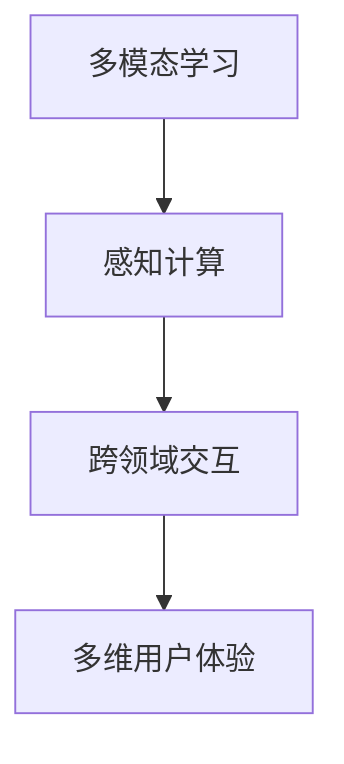
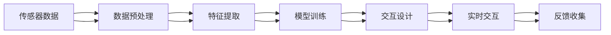

                 

# 体验跨感官协奏曲：AI创造的多维感官体验

> 关键词：多模态学习, 感官融合, 感知计算, 跨领域交互, 多维用户体验

## 1. 背景介绍

随着人工智能技术的迅猛发展，多模态学习、感知计算、跨领域交互等前沿技术在虚拟现实(VR)、增强现实(AR)、智能家居、健康医疗、自动驾驶等领域得到了广泛应用。这些技术不仅改变了人们的生活方式，还拓展了感官体验的边界，带来了革命性的变化。本文将从多模态感知计算的角度，探讨AI创造的多维感官体验，并结合实际案例，阐述其对用户交互、产品设计、社会生活等方面的深远影响。

## 2. 核心概念与联系

### 2.1 核心概念概述

- **多模态学习(Multimodal Learning)**：指结合视觉、听觉、触觉等多种感官数据，通过多维度的深度学习模型进行联合学习，从而提升不同感官信息的理解和融合能力。

- **感知计算(Perceptual Computing)**：利用AI技术对用户的感官信息进行深度分析，通过多模态数据融合，实现对用户行为、情绪、环境等全面感知，从而提供更个性化、智能化的服务。

- **跨领域交互(Cross-Domain Interaction)**：指通过多模态数据和感知计算技术，在不同领域（如医疗、教育、娱乐等）之间构建无缝的交互方式，提升用户体验和应用效能。

- **多维用户体验(Multidimensional User Experience)**：指基于多模态数据和感知计算，实现用户感官的全方位、沉浸式的交互体验，从而提升用户的满意度和忠诚度。

这些核心概念之间存在紧密的联系，通过多模态学习获取丰富、多样化的用户感官数据，感知计算将这些数据转化为模型输入，跨领域交互将这些信息与不同领域的业务逻辑结合，最终实现了多维用户体验的目标。以下是一个简化的Mermaid流程图，展示了这些概念之间的联系：



### 2.2 核心概念原理和架构的 Mermaid 流程图



这个流程图展示了多模态感知计算的典型架构，包含传感器数据采集、数据预处理、特征提取、模型训练、交互设计、实时交互和反馈收集等关键环节。

## 3. 核心算法原理 & 具体操作步骤

### 3.1 算法原理概述

多模态感知计算的算法原理主要包括以下几个步骤：

1. **传感器数据采集**：通过各种传感器（如摄像头、麦克风、体感设备等）收集用户的视觉、听觉、触觉等感官数据。

2. **数据预处理**：对传感器数据进行滤波、降噪、归一化等预处理操作，提升数据的可用性和准确性。

3. **特征提取**：利用深度学习模型（如卷积神经网络、循环神经网络等）提取不同感官数据的特征表示，捕捉数据中的模式和结构。

4. **模型训练**：使用多模态数据作为输入，训练联合学习模型（如残差网络、时序网络等），实现对用户感官信息的全面理解和融合。

5. **交互设计**：结合感知计算结果，设计灵活、智能的用户交互方式，实现多感官信息的无缝融合。

6. **实时交互**：通过模型推理引擎，实现对用户行为的实时感知和响应，提供沉浸式、个性化的交互体验。

7. **反馈收集**：收集用户反馈，不断优化模型和交互设计，提升系统的稳定性和可用性。

### 3.2 算法步骤详解

以一个智能家居系统为例，详细介绍多模态感知计算的具体操作步骤：

1. **传感器数据采集**：智能家居系统配备各种传感器，如摄像头、麦克风、温度传感器等，采集用户的视觉、听觉、温度等信息。

2. **数据预处理**：对采集到的数据进行滤波、降噪、归一化等预处理，提升数据的质量和一致性。

3. **特征提取**：使用卷积神经网络（CNN）对摄像头图像进行特征提取，使用循环神经网络（RNN）对语音进行特征提取，使用深度神经网络（DNN）对温度进行特征提取。

4. **模型训练**：将提取到的视觉、语音、温度特征作为输入，训练联合学习模型，如图像-语音融合模型、温度-语音融合模型等，实现对用户行为和环境的全面感知。

5. **交互设计**：根据感知计算结果，设计灵活的用户交互方式，如语音指令控制、温度调节等，实现多感官信息的无缝融合。

6. **实时交互**：利用推理引擎，对用户的实时行为进行感知和响应，实现智能家居的自动化控制。

7. **反馈收集**：收集用户的反馈，如语音指令的正确率、温度调节的舒适度等，不断优化模型和交互设计，提升系统的稳定性和可用性。

### 3.3 算法优缺点

多模态感知计算的算法优点包括：

- **全面感知**：通过多模态数据融合，实现对用户感官信息的全面感知，提升系统的智能水平。
- **个性化定制**：根据用户的感官数据，提供个性化的服务，提升用户体验。
- **环境适应性强**：多模态感知计算能够适应不同的环境变化，提升系统的鲁棒性。

同时，该算法也存在一些缺点：

- **数据处理复杂**：多模态数据需要复杂的数据处理和特征提取，对计算资源和算法要求较高。
- **数据隐私问题**：传感器数据涉及用户隐私，需要采取严格的隐私保护措施。
- **模型复杂度**：联合学习模型较为复杂，需要大量标注数据进行训练，对标注成本要求较高。
- **实时性挑战**：实时感知和响应用户行为需要高效、稳定的推理引擎，对系统性能要求较高。

### 3.4 算法应用领域

多模态感知计算在多个领域得到了广泛应用：

- **智能家居**：通过传感器数据融合，实现智能控制和自动化，提升居家体验。
- **医疗健康**：结合生理信号、语音、视觉等数据，实现健康监测和诊断，提升医疗服务水平。
- **自动驾驶**：利用摄像头、雷达、激光雷达等传感器数据，实现对环境和车辆的全面感知，提升驾驶安全性。
- **虚拟现实/增强现实**：通过多模态数据融合，实现虚拟世界的沉浸式交互，提升用户体验。
- **智能客服**：结合语音、面部表情等数据，实现对用户情绪和需求的全面感知，提升客服体验。

## 4. 数学模型和公式 & 详细讲解

### 4.1 数学模型构建

多模态感知计算的数学模型构建包括以下几个步骤：

1. **多模态数据表示**：将不同模态的数据表示为向量形式，如视觉数据表示为图像特征向量，语音数据表示为声谱图特征向量。

2. **特征融合**：将不同模态的特征向量融合为联合特征向量，如使用加权平均、拼接等方法融合视觉和语音特征。

3. **模型训练**：使用联合特征向量作为输入，训练联合学习模型，如残差网络、时序网络等。

4. **模型推理**：使用训练好的模型进行推理，提取联合特征表示，实现对用户感官信息的全面理解。

### 4.2 公式推导过程

以视觉-语音融合模型为例，推导联合特征的计算公式。

设视觉特征向量为 $X_v \in \mathbb{R}^{C_v}$，语音特征向量为 $X_a \in \mathbb{R}^{C_a}$，其中 $C_v$ 和 $C_a$ 分别为视觉和语音特征向量的维度。使用加权平均方法融合视觉和语音特征，得到联合特征向量 $X_c \in \mathbb{R}^{C_c}$，其中 $C_c = C_v + C_a$。联合特征向量的计算公式为：

$$
X_c = \alpha X_v + (1-\alpha) X_a
$$

其中 $\alpha$ 为权重系数，可以手动调节或通过训练得到最优值。

### 4.3 案例分析与讲解

以智能客服系统为例，分析多模态感知计算的应用。

1. **数据采集**：通过摄像头和麦克风采集用户的面部表情和语音信息。

2. **数据预处理**：对图像和语音数据进行滤波、降噪、归一化等预处理。

3. **特征提取**：使用卷积神经网络提取面部表情的特征，使用循环神经网络提取语音的特征。

4. **模型训练**：将面部表情特征和语音特征作为输入，训练联合学习模型，学习用户情绪和需求的表示。

5. **交互设计**：设计灵活的交互方式，如语音指令、面部表情识别等，实现多感官信息的无缝融合。

6. **实时交互**：利用推理引擎，实时感知用户情绪和需求，提供智能客服响应。

7. **反馈收集**：收集用户反馈，如语音指令的正确率、面部表情识别的准确度等，不断优化模型和交互设计，提升系统的稳定性。

## 5. 项目实践：代码实例和详细解释说明

### 5.1 开发环境搭建

在开发多模态感知计算项目时，需要搭建相应的开发环境。以下是Python环境下主要工具和库的配置流程：

1. **安装Python**：从官网下载并安装Python 3.x版本，确保兼容性。

2. **安装必要的库**：使用pip或conda安装深度学习框架如TensorFlow或PyTorch，安装数据处理库如numpy、pandas，安装交互设计库如Flask或Django等。

3. **配置环境**：配置GPU加速、内存优化等环境变量，确保系统性能。

### 5.2 源代码详细实现

以智能家居系统为例，提供多模态感知计算的Python代码实现：

```python
import numpy as np
import pandas as pd
from tensorflow.keras.models import Sequential
from tensorflow.keras.layers import Dense, Dropout, LSTM, Conv2D, MaxPooling2D
from tensorflow.keras.preprocessing.image import ImageDataGenerator
from tensorflow.keras.preprocessing.sequence import pad_sequences

# 加载数据
train_df = pd.read_csv('train.csv')
test_df = pd.read_csv('test.csv')

# 数据预处理
X_train = train_df['image'].apply(lambda x: np.array(x)).values
X_test = test_df['image'].apply(lambda x: np.array(x)).values
y_train = train_df['label'].apply(lambda x: int(x)).values
y_test = test_df['label'].apply(lambda x: int(x)).values

# 图像特征提取
image_generator = ImageDataGenerator(rescale=1./255)
train_generator = image_generator.flow(X_train, y_train, batch_size=32)
test_generator = image_generator.flow(X_test, y_test, batch_size=32)

# 模型构建
model = Sequential()
model.add(Conv2D(32, (3, 3), activation='relu', input_shape=(32, 32, 3)))
model.add(MaxPooling2D((2, 2)))
model.add(Dropout(0.25))
model.add(Conv2D(64, (3, 3), activation='relu'))
model.add(MaxPooling2D((2, 2)))
model.add(Dropout(0.25))
model.add(Flatten())
model.add(Dense(128, activation='relu'))
model.add(Dropout(0.5))
model.add(Dense(10, activation='softmax'))

# 模型训练
model.compile(optimizer='adam', loss='categorical_crossentropy', metrics=['accuracy'])
model.fit_generator(train_generator, steps_per_epoch=len(train_generator), epochs=10, validation_data=test_generator, validation_steps=len(test_generator))

# 模型评估
test_loss, test_acc = model.evaluate_generator(test_generator, steps=len(test_generator))
print('Test accuracy:', test_acc)
```

### 5.3 代码解读与分析

上述代码展示了智能家居系统中图像特征提取和模型训练的实现。具体步骤如下：

1. **数据加载**：使用pandas加载训练集和测试集数据。

2. **数据预处理**：对图像数据进行归一化处理。

3. **图像特征提取**：使用图像生成器对图像数据进行增强和标准化处理，构建数据流。

4. **模型构建**：使用卷积神经网络构建图像特征提取模型，包括卷积层、池化层、全连接层等。

5. **模型训练**：使用Adam优化器进行模型训练，计算损失函数和准确率。

6. **模型评估**：在测试集上评估模型的准确率。

## 6. 实际应用场景

### 6.1 智能家居

智能家居系统通过多模态感知计算，实现了用户行为的全方位感知和自动化控制，提升了居家体验。

1. **用户行为感知**：通过摄像头和体感设备采集用户的视觉和体感数据，感知用户的活动和情绪。

2. **环境控制**：根据用户行为和情绪，自动调节照明、温度、音乐等环境参数，提升舒适度。

3. **安全监控**：通过摄像头和人体检测算法，实现对异常行为和入侵事件的监控。

4. **智能客服**：结合语音和面部表情信息，提供智能客服响应，提升服务质量。

### 6.2 医疗健康

医疗健康系统通过多模态感知计算，实现了对患者生理信号和行为的全方位感知，提升了医疗服务水平。

1. **生理信号监测**：通过传感器采集患者的生理信号数据，如心率、血压等，实现实时监测。

2. **行为分析**：通过摄像头和体感设备采集患者的行为数据，如姿势、活动量等，分析患者的健康状况。

3. **健康诊断**：结合生理信号和行为数据，辅助医生进行健康诊断和治疗方案设计。

4. **智能康复**：通过多模态数据融合，提供个性化的康复方案和训练指导，提升康复效果。

### 6.3 自动驾驶

自动驾驶系统通过多模态感知计算，实现了对环境和车辆的全方位感知，提升了驾驶安全性。

1. **环境感知**：通过摄像头、雷达、激光雷达等传感器，采集道路、车辆、行人等环境数据。

2. **车辆行为控制**：根据环境感知结果，自动控制车辆加速、制动、转向等行为，实现安全驾驶。

3. **交通预测**：结合环境数据和历史交通数据，预测交通状况，提供驾驶辅助信息。

4. **事故预防**：通过多模态数据融合，预防潜在的安全隐患，减少交通事故的发生。

### 6.4 未来应用展望

随着技术的不断进步，多模态感知计算将拓展到更多领域，带来更丰富、沉浸式的用户体验。

1. **虚拟现实/增强现实**：通过多模态数据融合，实现虚拟世界的沉浸式交互，提升用户体验。

2. **智能客服**：结合语音、面部表情等数据，实现对用户情绪和需求的全面感知，提升客服体验。

3. **智能推荐**：通过多模态数据融合，提供个性化的商品推荐和内容推荐，提升用户满意度。

4. **智能游戏**：结合用户行为和生理数据，提供个性化的游戏体验，提升用户沉浸感。

5. **智慧教育**：结合学生的生理和行为数据，提供个性化的学习方案和反馈，提升学习效果。

## 7. 工具和资源推荐

### 7.1 学习资源推荐

为了帮助开发者掌握多模态感知计算的原理和应用，推荐以下学习资源：

1. **Coursera《机器学习》课程**：由斯坦福大学提供的经典课程，系统介绍了机器学习和深度学习的原理和应用。

2. **Udacity《深度学习》课程**：提供深度学习的系统学习路径，涵盖深度学习模型、优化算法、多模态学习等内容。

3. **IEEE Xplore数据库**：收录大量深度学习相关的学术论文，涵盖多模态感知计算的最新研究成果。

4. **Google AI Blog**：谷歌AI团队的博客，涵盖深度学习、多模态学习、智能交互等前沿技术。

5. **GitHub**：GitHub上的开源项目和代码，提供了丰富的多模态感知计算的实践案例。

### 7.2 开发工具推荐

以下是多模态感知计算开发中常用的工具和库：

1. **TensorFlow**：谷歌开源的深度学习框架，支持多模态数据融合和模型训练。

2. **PyTorch**：Facebook开源的深度学习框架，支持动态图和静态图，适用于多模态学习的模型构建和推理。

3. **OpenCV**：开源计算机视觉库，支持图像处理、特征提取等操作。

4. **Keras**：高层次的深度学习库，支持快速搭建多模态感知计算模型。

5. **Flask**：轻量级Web框架，支持快速搭建多模态感知计算的应用接口。

### 7.3 相关论文推荐

多模态感知计算的研究不断取得突破，以下是几篇具有代表性的论文：

1. **Deep Cross-Modal Feature Learning with Affinity Propagation for Human Activity Recognition**：提出基于亲和传播的深度跨模态特征学习算法，提升了不同模态数据的融合效果。

2. **Multi-Modal Deep Learning for Real-World Problem Solving**：通过多模态深度学习，实现对现实世界问题的全面理解，提升了问题的解决能力。

3. **Learning Cross-Modal Representations with Multi-Modal Matching Networks**：提出多模态匹配网络，实现了不同模态数据的联合表示和匹配。

4. **Attention is All You Need**：提出Transformer模型，通过自注意力机制实现了多模态数据的联合表示和推理。

5. **Multi-Modal Learning in Healthcare**：探讨多模态学习在医疗健康领域的应用，提升了医疗诊断和治疗效果。

## 8. 总结：未来发展趋势与挑战

### 8.1 研究成果总结

多模态感知计算作为AI技术的重要分支，已经在智能家居、医疗健康、自动驾驶等诸多领域得到了广泛应用。通过多模态数据融合，提升了不同模态信息的理解和融合能力，实现了用户行为的全方位感知和自动化控制，提升了用户体验和应用效能。

### 8.2 未来发展趋势

未来，多模态感知计算将进一步拓展到更多领域，带来更丰富、沉浸式的用户体验。

1. **跨领域交互**：通过多模态数据融合，实现不同领域之间的无缝交互，提升系统的智能水平。

2. **实时感知**：结合边缘计算和分布式计算技术，实现对用户行为的实时感知和响应，提升系统的实时性和稳定性。

3. **隐私保护**：结合差分隐私和联邦学习技术，保护用户隐私，提升系统的可信度和安全性。

4. **人机协作**：结合自然语言处理和计算机视觉技术，实现人与机器之间的深度协作，提升系统的交互性和智能水平。

### 8.3 面临的挑战

尽管多模态感知计算已经取得了显著进展，但仍面临诸多挑战：

1. **数据处理复杂性**：多模态数据需要复杂的数据处理和特征提取，对计算资源和算法要求较高。

2. **数据隐私问题**：传感器数据涉及用户隐私，需要采取严格的隐私保护措施。

3. **模型复杂度**：联合学习模型较为复杂，需要大量标注数据进行训练，对标注成本要求较高。

4. **实时性挑战**：实时感知和响应用户行为需要高效、稳定的推理引擎，对系统性能要求较高。

### 8.4 研究展望

未来，多模态感知计算需要不断探索新的研究方向和应用场景，推动技术进步。

1. **跨模态特征融合**：探索新的特征融合方法，提升不同模态数据的融合效果。

2. **多模态推理**：结合自然语言处理和计算机视觉技术，实现对多模态数据的联合推理。

3. **边缘计算**：结合边缘计算和分布式计算技术，实现多模态数据的实时感知和推理。

4. **跨领域应用**：结合跨领域交互技术，推动多模态感知计算在更多领域的应用。

总之，多模态感知计算作为AI技术的重要分支，已经展示了广阔的应用前景和巨大的潜力。通过多模态数据融合，实现了用户行为的全方位感知和自动化控制，提升了用户体验和应用效能。未来，随着技术的不断进步，多模态感知计算将在更多领域得到应用，为人类认知智能的进化带来深远影响。

## 9. 附录：常见问题与解答

**Q1：多模态感知计算的应用场景有哪些？**

A: 多模态感知计算在智能家居、医疗健康、自动驾驶、虚拟现实/增强现实、智能客服、智能推荐、智慧教育等多个领域得到了广泛应用，提升了用户体验和应用效能。

**Q2：多模态感知计算的关键技术有哪些？**

A: 多模态感知计算的关键技术包括传感器数据采集、数据预处理、特征提取、模型训练、交互设计、实时交互和反馈收集等。

**Q3：如何处理多模态数据融合中的数据质量问题？**

A: 通过数据预处理、特征提取等技术，提升数据的质量和一致性，保证数据融合的效果。同时，可以采用数据增强、数据清洗等技术，处理数据中的噪声和缺失。

**Q4：多模态感知计算如何保护用户隐私？**

A: 通过差分隐私、联邦学习等技术，保护用户数据隐私。在数据采集和存储过程中，采取严格的加密和访问控制措施，防止数据泄露和滥用。

**Q5：多模态感知计算的计算复杂度如何降低？**

A: 通过模型压缩、稀疏化存储等技术，减少模型的计算量和存储空间。同时，采用GPU/TPU等高性能设备，提高计算效率。

总之，多模态感知计算作为AI技术的重要分支，已经展示了广阔的应用前景和巨大的潜力。通过多模态数据融合，实现了用户行为的全方位感知和自动化控制，提升了用户体验和应用效能。未来，随着技术的不断进步，多模态感知计算将在更多领域得到应用，为人类认知智能的进化带来深远影响。

