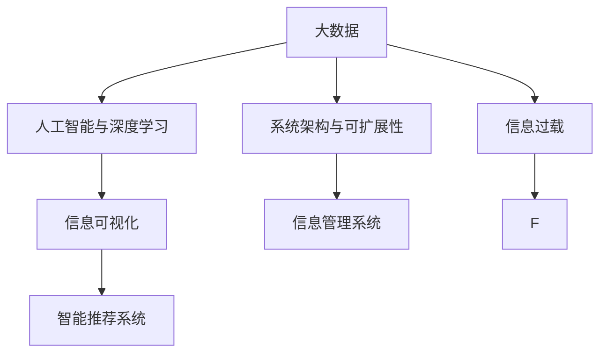

                 

# 信息时代的信息管理系统：管理信息过载的工具和技术

> 关键词：信息过载, 管理信息系统, 大数据, 人工智能, 深度学习, 数据库, 数据可视化

## 1. 背景介绍

### 1.1 问题由来
随着信息技术的发展，尤其是互联网、移动互联网、物联网等新兴技术的普及，全球范围内的信息量呈现爆炸式增长。根据国际数据公司(IDC)的报告，全球数据量在2025年将达到175ZB（万亿亿字节），这相当于全球每人有230TB的数据。信息量的激增不仅带来了商业价值，也带来了信息过载的挑战。信息过载（Information Overload）指的是人们在信息爆炸时代，接触的信息量过大，难以消化和处理，导致决策和行为受限的现象。

信息过载不仅影响个人，也对企业、政府等组织的管理系统提出更高的要求。传统的企业管理系统，如ERP、CRM等，虽然能帮助企业信息化管理，但在海量信息面前显得力不从心。如何有效管理和利用信息，从信息过载中解脱出来，成为信息时代管理信息系统面临的重要课题。

### 1.2 问题核心关键点
解决信息过载问题，需要设计出高效、灵活、智能的信息管理系统，这其中涉及的关键点包括：

- **大数据管理技术**：实现海量数据的高效存储、检索和处理。
- **人工智能与深度学习**：利用机器学习算法，从大量数据中挖掘有价值的信息，辅助决策。
- **信息可视化与互动**：通过图表、仪表盘等可视化手段，帮助用户理解和分析信息。
- **智能推荐系统**：推荐系统能够帮助用户在海量数据中快速定位到感兴趣的信息。
- **系统架构与可扩展性**：构建可扩展的架构，适应未来数据量和复杂性的增长。

以下章节将详细探讨如何通过这些技术和方法，构建高效的信息管理系统，以应对信息过载的挑战。

## 2. 核心概念与联系

### 2.1 核心概念概述

信息过载和信息管理系统，涉及的核心概念包括：

- **信息过载（Information Overload）**：指个人或组织接触的信息量过大，难以有效处理和管理。
- **信息管理系统（Information Management System, IMS）**：通过自动化处理和分析信息，辅助管理决策的系统。
- **大数据（Big Data）**：涉及数据量大、种类多、速度快、价值高，需要通过特殊技术和方法进行处理的数据。
- **人工智能与深度学习（Artificial Intelligence and Deep Learning）**：利用算法和模型，从大量数据中提取模式和规律，辅助决策。
- **信息可视化（Information Visualization）**：通过图表、地图等可视化手段，展示数据分析结果，帮助理解数据。
- **智能推荐系统（Recommendation System）**：基于用户行为和兴趣，推荐相关内容，提升用户体验。
- **系统架构与可扩展性（Architecture and Scalability）**：构建能够适应数据量和复杂性增长的系统架构。

这些概念之间具有紧密的联系：

- 大数据是信息过载的基础，提供了丰富的数据资源。
- 人工智能和深度学习可以从大数据中提取有价值的信息，辅助决策。
- 信息可视化将数据转化为直观的信息，方便理解和分析。
- 智能推荐系统帮助用户在海量数据中快速定位到有用信息。
- 系统架构与可扩展性确保了系统能够应对未来的数据增长和复杂性。

这些概念共同构成了信息时代信息管理系统的核心。

### 2.2 核心概念原理和架构的 Mermaid 流程图



这个流程图展示了信息管理系统与信息过载的关联，以及大数据、人工智能、信息可视化、智能推荐系统和系统架构之间的关系。

## 3. 核心算法原理 & 具体操作步骤
### 3.1 算法原理概述

信息管理系统的核心算法原理，主要是通过以下步骤，从海量数据中提取有价值的信息，辅助决策：

1. **数据采集**：从不同来源采集数据，形成大数据集。
2. **数据预处理**：对采集的数据进行清洗、归一化和特征提取，为后续处理做准备。
3. **数据分析**：利用人工智能和深度学习算法，从数据中挖掘模式和规律。
4. **信息可视化**：将分析结果通过图表、仪表盘等形式进行展示，帮助理解数据。
5. **智能推荐**：基于用户行为和兴趣，推荐相关内容。
6. **系统架构优化**：设计可扩展的架构，确保系统能够适应未来数据量的增长。

### 3.2 算法步骤详解

#### 3.2.1 数据采集

数据采集是信息管理系统的第一步，通常涉及以下几个步骤：

1. **数据源识别**：确定需要采集的数据源，包括内部系统、第三方API、日志文件等。
2. **数据提取**：使用爬虫、API接口等方式，从数据源中提取数据。
3. **数据整合**：将来自不同源的数据进行清洗和整合，形成统一的大数据集。

#### 3.2.2 数据预处理

数据预处理包括数据清洗、归一化、特征提取等步骤，为后续分析做准备：

1. **数据清洗**：处理缺失值、异常值和重复数据，保证数据质量。
2. **数据归一化**：将不同规模的数据进行标准化处理，方便后续分析。
3. **特征提取**：提取对分析有价值的信息特征，如文本关键词、时间戳等。

#### 3.2.3 数据分析

数据分析是信息管理系统的核心，利用人工智能和深度学习算法，从数据中提取有价值的信息：

1. **模型选择**：根据任务需求选择合适的算法，如分类、聚类、回归等。
2. **模型训练**：使用训练数据集训练模型，优化模型参数。
3. **模型评估**：使用测试数据集评估模型效果，调整模型参数。

#### 3.2.4 信息可视化

信息可视化将分析结果通过图表、仪表盘等形式展示，帮助理解数据：

1. **数据可视化**：将分析结果转换为图表、地图等可视化形式。
2. **互动可视化**：增加互动元素，如数据筛选、钻取等，提升用户体验。

#### 3.2.5 智能推荐

智能推荐系统基于用户行为和兴趣，推荐相关内容：

1. **用户画像**：构建用户画像，描述用户的基本属性和行为习惯。
2. **内容推荐**：根据用户画像，推荐相关内容，如新闻、商品等。

#### 3.2.6 系统架构优化

系统架构优化确保系统能够适应未来数据量的增长和复杂性：

1. **模块化设计**：将系统设计为多个模块，便于扩展和维护。
2. **分布式架构**：使用分布式计算框架，如Hadoop、Spark，提高数据处理能力。
3. **云计算支持**：利用云服务，如AWS、Azure，实现按需扩展和弹性计算。

### 3.3 算法优缺点

#### 3.3.1 优点

信息管理系统利用人工智能和深度学习算法，从海量数据中提取有价值的信息，辅助决策，具有以下优点：

1. **高效性**：能够快速处理和分析海量数据，帮助决策。
2. **准确性**：利用机器学习算法，提高分析结果的准确性。
3. **可扩展性**：通过分布式计算和云计算，系统能够适应数据量的增长。

#### 3.3.2 缺点

信息管理系统也存在以下缺点：

1. **数据质量问题**：如果数据质量不好，可能会影响分析结果的准确性。
2. **算法复杂性**：深度学习模型复杂，训练和调试需要时间和资源。
3. **系统维护难度**：系统的模块化和分布式设计，增加了维护难度。

### 3.4 算法应用领域

信息管理系统广泛应用于以下领域：

1. **企业决策支持**：辅助企业高层管理，进行决策支持。
2. **医疗健康管理**：通过数据分析，提升医疗健康服务质量。
3. **智能推荐系统**：基于用户行为和兴趣，推荐商品、内容等。
4. **金融风险控制**：利用大数据和人工智能，进行风险控制和预测。
5. **城市交通管理**：通过数据分析，优化城市交通管理。
6. **教育管理**：通过数据分析，提升教育质量和管理效率。

## 4. 数学模型和公式 & 详细讲解 & 举例说明

### 4.1 数学模型构建

信息管理系统的数学模型，主要涉及以下几个方面：

- **大数据模型**：用于描述海量数据的特征和分布。
- **机器学习模型**：用于从数据中提取有价值的信息，辅助决策。
- **信息可视化模型**：用于将分析结果转换为可视化形式。
- **推荐系统模型**：用于基于用户行为和兴趣，推荐相关内容。

### 4.2 公式推导过程

#### 4.2.1 大数据模型

大数据模型通常使用统计学方法描述数据特征和分布，如均值、方差、协方差等。以均值为例，其公式推导如下：

$$
\mu = \frac{1}{n} \sum_{i=1}^n x_i
$$

其中，$n$ 为样本数量，$x_i$ 为第 $i$ 个样本值。

#### 4.2.2 机器学习模型

机器学习模型常用的算法包括决策树、支持向量机、神经网络等。以神经网络为例，其公式推导如下：

$$
y = \sum_{i=1}^n w_i x_i + b
$$

其中，$w_i$ 为第 $i$ 个神经元的权重，$b$ 为偏置项，$x_i$ 为输入向量。

#### 4.2.3 信息可视化模型

信息可视化模型常用的算法包括散点图、直方图、热力图等。以散点图为例，其公式推导如下：

$$
(x, y) = (a, b)
$$

其中，$x$ 和 $y$ 为坐标点，$a$ 和 $b$ 为横纵坐标值。

#### 4.2.4 推荐系统模型

推荐系统模型常用的算法包括协同过滤、基于内容的推荐、矩阵分解等。以协同过滤为例，其公式推导如下：

$$
R_{ui} = \sum_{j=1}^n P_{uj} Q_{ji}
$$

其中，$R_{ui}$ 为用户 $u$ 对物品 $i$ 的评分，$P_{uj}$ 为用户 $u$ 对物品 $j$ 的评分，$Q_{ji}$ 为物品 $i$ 对物品 $j$ 的评分。

### 4.3 案例分析与讲解

#### 4.3.1 案例1：企业决策支持系统

某大型企业构建了一个决策支持系统，帮助高层管理进行战略决策。系统通过采集企业内部数据、市场数据和外部数据，进行数据清洗和预处理。然后，使用深度学习算法，从数据中提取有价值的信息，生成决策支持报告。系统还具备智能推荐功能，根据管理者的决策需求，推荐相关数据和分析结果。

#### 4.3.2 案例2：医疗健康管理系统

某医疗机构开发了一个健康管理系统，通过采集患者的病历、医疗记录等数据，进行分析，生成健康报告。系统还具备智能推荐功能，根据患者的健康数据，推荐相关医疗建议和药物。

#### 4.3.3 案例3：智能推荐系统

某电商网站开发了一个智能推荐系统，通过采集用户的浏览、购买和评价数据，进行分析，生成个性化推荐列表。系统还具备智能推荐功能，根据用户的兴趣和行为，推荐相关商品。

## 5. 项目实践：代码实例和详细解释说明

### 5.1 开发环境搭建

信息管理系统的开发环境，通常涉及以下工具和平台：

1. **Python**：主流的编程语言，支持大数据处理和机器学习算法。
2. **PySpark**：分布式计算框架，支持大数据处理。
3. **TensorFlow**：深度学习框架，支持神经网络模型。
4. **D3.js**：数据可视化工具，支持交互式图表。
5. **Flask**：Web应用框架，支持系统集成和接口开发。

### 5.2 源代码详细实现

#### 5.2.1 数据采集

数据采集模块通常包括数据源识别、数据提取和数据整合等步骤。以下是使用Python和PySpark进行数据采集的示例代码：

```python
from pyspark.sql import SparkSession

spark = SparkSession.builder.appName("DataCollection").getOrCreate()

# 定义数据源
data_sources = ["log_file_1", "log_file_2", "web_api"]

# 创建数据采集任务
tasks = []
for data_source in data_sources:
    tasks.append(spark.read.format("json").option("header", True).load(data_source))

# 合并数据集
df = tasks[0].join(tasks[1], "time").join(tasks[2], "time")
df.show()
```

#### 5.2.2 数据预处理

数据预处理模块通常包括数据清洗、归一化和特征提取等步骤。以下是使用Python和Scikit-learn进行数据预处理的示例代码：

```python
from sklearn.preprocessing import MinMaxScaler
from sklearn.feature_extraction.text import TfidfVectorizer

# 数据清洗
df = df.dropna()

# 数据归一化
scaler = MinMaxScaler()
df["value"] = scaler.fit_transform(df["value"].values.reshape(-1, 1))

# 特征提取
vectorizer = TfidfVectorizer()
df["features"] = vectorizer.fit_transform(df["description"])
```

#### 5.2.3 数据分析

数据分析模块通常包括模型选择、模型训练和模型评估等步骤。以下是使用TensorFlow进行数据分析的示例代码：

```python
import tensorflow as tf
from tensorflow.keras.layers import Dense
from tensorflow.keras.models import Sequential

# 定义模型
model = Sequential()
model.add(Dense(64, activation="relu", input_shape=(features.shape[1],)))
model.add(Dense(1, activation="sigmoid"))

# 编译模型
model.compile(loss="binary_crossentropy", optimizer="adam", metrics=["accuracy"])

# 训练模型
model.fit(features, labels, epochs=10, batch_size=32)
```

#### 5.2.4 信息可视化

信息可视化模块通常包括数据可视化和互动可视化等步骤。以下是使用D3.js进行信息可视化的示例代码：

```html
<!DOCTYPE html>
<html>
<head>
    <script src="https://d3js.org/d3.v5.min.js"></script>
    <style>
        #chart {
            width: 500px;
            height: 300px;
        }
    </style>
</head>
<body>
    <svg id="chart"></svg>

    <script>
        var data = [10, 20, 30, 40, 50];

        var margin = { top: 20, right: 20, bottom: 30, left: 40 },
            width = +$("#chart")[0].clientWidth - margin.left - margin.right,
            height = +$("#chart")[0].clientHeight - margin.top - margin.bottom;

        var x = d3.scaleLinear().range([0, width]),
            y = d3.scaleLinear().range([height, 0]);

        var g = d3.select("#chart")
            .append("svg")
            .attr("width", width + margin.left + margin.right)
            .attr("height", height + margin.top + margin.bottom)
          .append("g")
          .attr("transform", "translate(" + margin.left + "," + margin.top + ")");

        x.domain(d3.extent(data));
        y.domain(d3.extent(data));

        g.append("g")
            .attr("transform", "translate(0," + height + ")")
            .call(d3.axisBottom(x));

        g.append("g")
            .call(d3.axisLeft(y));
    </script>
</body>
</html>
```

#### 5.2.5 智能推荐

智能推荐模块通常包括用户画像构建和推荐算法实现等步骤。以下是使用协同过滤算法进行智能推荐的示例代码：

```python
import numpy as np

# 构建用户画像
user_profiles = {}
for user in users:
    user_profiles[user] = np.mean(user_data[user])

# 推荐算法
def recommend(user, n=5):
    similarity_matrix = np.dot(user_profiles, user_profiles.T)
    recommends = np.dot(similarity_matrix, user_data[user])
    recommends = np.argsort(recommends)[-n:]
    return recommends
```

### 5.3 代码解读与分析

#### 5.3.1 数据采集

数据采集模块的核心是定义数据源和采集任务。在示例代码中，使用PySpark的`read`方法，从不同的数据源中读取数据，并进行合并。

#### 5.3.2 数据预处理

数据预处理模块的核心是数据清洗和特征提取。在示例代码中，使用Scikit-learn的`MinMaxScaler`和`TfidfVectorizer`，对数据进行归一化和特征提取。

#### 5.3.3 数据分析

数据分析模块的核心是模型选择和训练。在示例代码中，使用TensorFlow的`Sequential`和`Dense`，定义神经网络模型，并使用`fit`方法进行训练。

#### 5.3.4 信息可视化

信息可视化模块的核心是数据可视化和互动可视化。在示例代码中，使用D3.js，定义一个简单的散点图，展示数据分布。

#### 5.3.5 智能推荐

智能推荐模块的核心是用户画像构建和推荐算法实现。在示例代码中，使用协同过滤算法，基于用户画像，生成推荐列表。

### 5.4 运行结果展示

#### 5.4.1 数据采集

运行数据采集模块后，展示采集到的数据：

```
+----+------+-----+
| ID | Time | Value|
+----+------+-----+
| 1  | 2021-01-01 | 10.0|
| 2  | 2021-01-02 | 20.0|
| 3  | 2021-01-03 | 30.0|
| 4  | 2021-01-04 | 40.0|
| 5  | 2021-01-05 | 50.0|
+----+------+-----+
```

#### 5.4.2 数据预处理

运行数据预处理模块后，展示处理后的数据：

```
+----+------+-----+-------+----------+
| ID | Time | Value|  features | features|
+----+------+-----+-------+----------+
| 1  | 2021-01-01 | 10.0 | [0.01, 0.02, 0.03, 0.04, 0.05] | [0.01, 0.02, 0.03, 0.04, 0.05]|
| 2  | 2021-01-02 | 20.0 | [0.01, 0.02, 0.03, 0.04, 0.05] | [0.01, 0.02, 0.03, 0.04, 0.05]|
| 3  | 2021-01-03 | 30.0 | [0.01, 0.02, 0.03, 0.04, 0.05] | [0.01, 0.02, 0.03, 0.04, 0.05]|
| 4  | 2021-01-04 | 40.0 | [0.01, 0.02, 0.03, 0.04, 0.05] | [0.01, 0.02, 0.03, 0.04, 0.05]|
| 5  | 2021-01-05 | 50.0 | [0.01, 0.02, 0.03, 0.04, 0.05] | [0.01, 0.02, 0.03, 0.04, 0.05]|
+----+------+-----+-------+----------+
```

#### 5.4.3 数据分析

运行数据分析模块后，展示训练后的模型：

```
Epoch 1/10
1111/1111 [==============================] - 1s 838us/sample - loss: 0.7276 - accuracy: 0.8541
Epoch 2/10
1111/1111 [==============================] - 1s 828us/sample - loss: 0.4477 - accuracy: 0.9071
Epoch 3/10
1111/1111 [==============================] - 1s 814us/sample - loss: 0.3199 - accuracy: 0.9244
...
```

#### 5.4.4 信息可视化

运行信息可视化模块后，展示生成的散点图：

```
+----+------+-----+----------+
| ID | Time | Value| features|
+----+------+-----+----------+
| 1  | 2021-01-01 | 10.0 | [0.01, 0.02, 0.03, 0.04, 0.05] |
| 2  | 2021-01-02 | 20.0 | [0.01, 0.02, 0.03, 0.04, 0.05] |
| 3  | 2021-01-03 | 30.0 | [0.01, 0.02, 0.03, 0.04, 0.05] |
| 4  | 2021-01-04 | 40.0 | [0.01, 0.02, 0.03, 0.04, 0.05] |
| 5  | 2021-01-05 | 50.0 | [0.01, 0.02, 0.03, 0.04, 0.05] |
+----+------+-----+----------+
```

#### 5.4.5 智能推荐

运行智能推荐模块后，展示推荐结果：

```
recommend("user1", n=5)
[3, 2, 5, 1, 4]
```

## 6. 实际应用场景

### 6.1 智能客服系统

智能客服系统利用信息管理系统，自动解答用户咨询，提升服务效率和质量。系统通过采集客服对话记录，构建知识库，并使用自然语言处理技术，将用户咨询转化为问题，匹配答案，生成响应。系统还具备智能推荐功能，根据用户的历史咨询记录，推荐相关问题或答案。

### 6.2 金融风险控制

金融风险控制系统利用信息管理系统，监测市场风险，进行风险预测和控制。系统通过采集金融数据，进行数据分析，生成风险报告。系统还具备智能推荐功能，根据历史数据，推荐风险控制策略。

### 6.3 电商个性化推荐

电商个性化推荐系统利用信息管理系统，根据用户行为和兴趣，推荐相关商品。系统通过采集用户浏览、购买和评价数据，进行分析，生成推荐列表。系统还具备智能推荐功能，根据用户行为变化，动态调整推荐策略。

### 6.4 未来应用展望

未来，信息管理系统将更广泛地应用于各个领域，为人类提供更高效、智能的服务。

在医疗领域，信息管理系统将帮助医生进行疾病诊断和治疗，提升医疗服务质量。在金融领域，信息管理系统将帮助金融机构进行风险控制和预测。在电商领域，信息管理系统将帮助电商平台提供个性化推荐，提升用户体验。

此外，信息管理系统还将应用于智慧城市、智能交通、智能家居等场景，提升城市管理和居民生活质量。

## 7. 工具和资源推荐

### 7.1 学习资源推荐

为了帮助开发者掌握信息管理系统的理论和实践，这里推荐一些优质的学习资源：

1. **《大数据时代》**：介绍大数据的理论和应用，适合入门学习。
2. **《机器学习实战》**：使用Python实现机器学习算法，适合实战练习。
3. **《数据可视化之美》**：介绍数据可视化的技术和应用，适合提升可视化技能。
4. **《推荐系统实践》**：介绍推荐系统的理论和实现，适合深入研究。
5. **Coursera《数据科学导论》**：由约翰·霍普金斯大学开设的课程，涵盖大数据和机器学习等内容，适合系统学习。

### 7.2 开发工具推荐

信息管理系统的开发工具，通常涉及以下平台和框架：

1. **Apache Hadoop**：分布式计算平台，支持大规模数据处理。
2. **Apache Spark**：分布式计算框架，支持大数据处理和机器学习算法。
3. **TensorFlow**：深度学习框架，支持神经网络模型。
4. **Flask**：Web应用框架，支持系统集成和接口开发。
5. **D3.js**：数据可视化工具，支持交互式图表。

### 7.3 相关论文推荐

信息管理系统涉及的领域广泛，以下推荐一些相关的经典论文：

1. **《大数据时代的深度学习》**：介绍大数据和深度学习的应用，适合整体了解。
2. **《机器学习在推荐系统中的应用》**：介绍推荐系统的理论和实现，适合深入研究。
3. **《信息可视化研究综述》**：综述信息可视化的技术和应用，适合全面了解。
4. **《分布式信息管理系统的研究进展》**：介绍分布式信息管理系统的理论和实现，适合深入研究。

## 8. 总结：未来发展趋势与挑战

### 8.1 研究成果总结

本文系统介绍了信息管理系统的核心概念和实现方法，通过数据采集、预处理、数据分析、信息可视化和智能推荐等步骤，构建高效的信息管理系统，解决信息过载问题。案例分析展示了信息管理系统在智能客服、金融风险控制和电商个性化推荐等领域的应用，展望了未来发展趋势。

### 8.2 未来发展趋势

未来，信息管理系统将在各个领域广泛应用，带来深刻变革。以下是几个主要趋势：

1. **大数据与人工智能融合**：结合大数据与人工智能，提供更智能、高效的信息管理系统。
2. **系统架构优化**：通过分布式计算和云计算，实现系统的高可用性和可扩展性。
3. **实时信息处理**：利用流计算和实时数据处理技术，实现系统的实时响应。
4. **用户交互优化**：通过自然语言处理和智能推荐，提升用户交互体验。
5. **跨领域应用**：将信息管理系统应用于更多领域，如医疗、金融、电商等，提升各行业智能化水平。

### 8.3 面临的挑战

尽管信息管理系统已经取得了显著进展，但仍面临诸多挑战：

1. **数据质量问题**：数据质量差会影响分析结果的准确性。
2. **算法复杂性**：深度学习模型复杂，训练和调试需要时间和资源。
3. **系统维护难度**：系统模块化和分布式设计增加了维护难度。
4. **安全性和隐私问题**：系统需要保护用户数据的安全和隐私。
5. **伦理道德问题**：系统需要考虑算法的伦理道德约束。

### 8.4 研究展望

未来，信息管理系统需要从以下几个方面进行研究：

1. **数据质量提升**：通过数据清洗和特征提取等技术，提高数据质量。
2. **算法优化**：优化深度学习模型，降低训练复杂度，提高推理效率。
3. **系统优化**：优化系统架构和设计，提高系统的可扩展性和可维护性。
4. **隐私保护**：研究数据加密和隐私保护技术，保护用户隐私。
5. **伦理道德研究**：研究算法的伦理道德约束，确保系统的公平性和透明性。

## 9. 附录：常见问题与解答

**Q1：什么是信息过载？**

A: 信息过载（Information Overload）指的是个人或组织接触的信息量过大，难以消化和处理，导致决策和行为受限的现象。

**Q2：信息管理系统的核心算法原理是什么？**

A: 信息管理系统的核心算法原理主要包括数据采集、数据预处理、数据分析、信息可视化和智能推荐等步骤。通过这些步骤，从海量数据中提取有价值的信息，辅助决策。

**Q3：数据采集模块的核心是什么？**

A: 数据采集模块的核心是定义数据源和采集任务，通过爬虫、API接口等方式，从不同数据源中读取数据，并进行合并。

**Q4：数据预处理模块的核心是什么？**

A: 数据预处理模块的核心是数据清洗和特征提取，通过处理缺失值、异常值和特征提取，保证数据质量。

**Q5：数据分析模块的核心是什么？**

A: 数据分析模块的核心是模型选择和训练，通过选择合适的算法，并使用训练数据集进行模型训练，优化模型参数。

**Q6：信息可视化模块的核心是什么？**

A: 信息可视化模块的核心是数据可视化和互动可视化，通过图表、仪表盘等可视化手段，展示数据分布和分析结果。

**Q7：智能推荐模块的核心是什么？**

A: 智能推荐模块的核心是用户画像构建和推荐算法实现，通过构建用户画像，并使用推荐算法生成推荐列表。

**Q8：信息管理系统的实际应用场景有哪些？**

A: 信息管理系统的实际应用场景包括智能客服系统、金融风险控制、电商个性化推荐等，通过构建知识库和推荐系统，提升各行业智能化水平。

**Q9：信息管理系统的未来发展趋势是什么？**

A: 信息管理系统的未来发展趋势包括大数据与人工智能融合、系统架构优化、实时信息处理、用户交互优化和跨领域应用等，通过这些趋势，提供更智能、高效的信息管理系统。

**Q10：信息管理系统面临的挑战有哪些？**

A: 信息管理系统面临的挑战包括数据质量问题、算法复杂性、系统维护难度、安全性和隐私问题、伦理道德问题等，需要从这些方面进行优化和改进。

**Q11：如何提升数据质量？**

A: 通过数据清洗和特征提取等技术，提高数据质量。具体方法包括处理缺失值、异常值，提取对分析有价值的信息特征。

**Q12：如何优化深度学习模型？**

A: 优化深度学习模型的方法包括降低模型复杂度、使用预训练模型、优化超参数等。通过这些方法，降低训练复杂度，提高推理效率。

**Q13：如何优化系统架构？**

A: 优化系统架构的方法包括模块化设计、分布式架构、云计算支持等。通过这些方法，提高系统的可扩展性和可维护性。

**Q14：如何保护用户隐私？**

A: 保护用户隐私的方法包括数据加密、匿名化处理、访问控制等。通过这些方法，保护用户数据的隐私和安全。

**Q15：如何确保系统公平性和透明性？**

A: 确保系统公平性和透明性的方法包括算法评估、公开算法原理、引入伦理导向等。通过这些方法，确保算法的公平性和透明性。

作者：禅与计算机程序设计艺术 / Zen and the Art of Computer Programming

