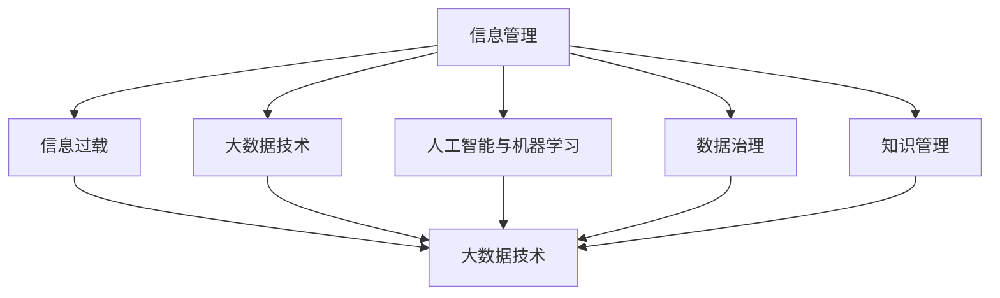

                 

# 信息时代的信息管理：如何处理信息过载以提高生产力

> 关键词：信息管理, 信息过载, 大数据, 人工智能, 生产效率, 自动化

## 1. 背景介绍

### 1.1 问题由来
随着信息时代的到来，数据和信息的数量呈爆炸性增长。企业、个人、政府机构都面临着前所未有的信息过载问题。信息过载不仅造成了数据存储和处理的巨大压力，还对决策制定和生产力提升带来了严重阻碍。如何有效管理和利用海量信息，成为当前信息管理领域亟待解决的难题。

### 1.2 问题核心关键点
信息过载的核心在于：
- 数据量激增：互联网、物联网、移动设备的广泛应用，使得信息生成速度和数量不断增加。
- 数据质量参差不齐：海量数据中存在大量噪音、冗余和不一致信息。
- 数据处理难度大：数据类型多样、来源广泛，传统处理方法难以应对。
- 信息需求复杂：用户需求多变、个性化，对信息管理的要求不断提高。

### 1.3 问题研究意义
有效处理信息过载，对于提升组织和个人的生产力具有重要意义：

1. **决策支持**：快速获取、分析并利用可靠信息，帮助决策者制定科学决策。
2. **效率提升**：通过自动化信息管理流程，大幅提高数据处理和利用效率。
3. **成本节约**：减少数据存储和处理成本，优化资源配置。
4. **创新驱动**：以数据为驱动，促进产品和服务的创新。
5. **风险控制**：通过数据监控和分析，及时发现和应对潜在风险。

## 2. 核心概念与联系

### 2.1 核心概念概述

为更好地理解信息管理在信息过载环境下的实践，本节将介绍几个密切相关的核心概念：

- **信息管理**：涉及信息的收集、存储、处理、分析和应用的整个过程，旨在最大化信息资源的效用。
- **信息过载**：当信息量超出个人或系统的处理能力，导致效率降低、决策困难、用户体验差等现象。
- **大数据技术**：通过分布式计算、存储和分析技术，处理大规模数据集，提取有用信息。
- **人工智能与机器学习**：通过算法模型和自动化工具，实现信息的智能化处理和分析。
- **数据治理**：涉及数据质量管理、数据隐私保护、数据合规等多个方面，确保数据可用性和安全性。
- **知识管理**：将信息转化为知识，通过知识共享和应用，提升组织和个人能力。

这些核心概念之间的逻辑关系可以通过以下Mermaid流程图来展示：



这个流程图展示了一个典型信息管理系统的核心组件及其相互关系：

1. 信息管理是系统的主线，涵盖数据的收集、存储、处理、分析和应用。
2. 信息过载是信息管理过程中常见的问题，需要通过技术手段解决。
3. 大数据技术和人工智能是解决信息过载的核心工具。
4. 数据治理和知识管理是信息管理的关键支撑，确保数据质量和知识转化效果。

## 3. 核心算法原理 & 具体操作步骤
### 3.1 算法原理概述

信息管理的核心算法原理是通过自动化和智能化的手段，对海量信息进行高效处理和利用，以支持决策和提升生产力。其核心在于：

1. **数据清洗与预处理**：通过算法模型和规则，对原始数据进行去噪、缺失值填补、格式转换等处理。
2. **特征提取与选择**：从原始数据中提取关键特征，选择与目标任务相关的特征集。
3. **模型训练与优化**：使用机器学习算法训练模型，并进行参数调优，以提高模型的预测准确性和泛化能力。
4. **结果解释与反馈**：将模型预测结果转化为易于理解和利用的形式，并通过反馈机制不断优化模型。

### 3.2 算法步骤详解

信息管理算法步骤如下：

1. **数据收集与存储**：
   - 通过API、ETL工具等方式，收集相关数据并存储到数据库或数据湖中。
   - 采用分布式存储技术，如Hadoop、Spark等，以支持大规模数据的存储和管理。

2. **数据清洗与预处理**：
   - 使用数据清洗工具，如Pandas、OpenRefine等，进行数据格式转换、去噪、缺失值填补等处理。
   - 采用正则表达式、自然语言处理工具等，对文本数据进行实体识别、分词等处理。

3. **特征提取与选择**：
   - 使用特征提取算法，如TF-IDF、Word2Vec等，从原始数据中提取关键特征。
   - 使用特征选择算法，如L1正则化、PCA等，选择对目标任务影响较大的特征。

4. **模型训练与优化**：
   - 使用机器学习算法，如随机森林、SVM、深度学习等，对数据进行建模和预测。
   - 采用交叉验证、网格搜索等方法，对模型参数进行调优，以提高模型性能。

5. **结果解释与反馈**：
   - 使用可视化工具，如Tableau、Power BI等，将模型预测结果转化为易于理解的图表和报告。
   - 建立反馈机制，根据用户反馈和实际效果，不断调整和优化模型。

### 3.3 算法优缺点

信息管理算法的优点在于：
1. 提高数据处理效率：自动化和智能化的处理流程，大幅提升数据处理速度。
2. 提升决策质量：基于高质量的数据和模型，提供可靠的决策支持。
3. 支持个性化需求：通过算法调整和模型优化，满足不同用户和场景的需求。
4. 促进知识共享：将数据转化为知识，并通过共享和应用，提升组织能力。

但同时，该算法也存在一些缺点：
1. 数据质量和一致性问题：数据来源多样，可能存在不一致和噪音，影响处理效果。
2. 算法复杂度较高：信息管理涉及多领域技术，算法实现和调试复杂。
3. 对数据量敏感：大规模数据处理可能需要高性能计算资源，成本较高。
4. 对数据隐私和安全问题：处理敏感数据时，需要考虑隐私保护和数据安全。

### 3.4 算法应用领域

信息管理算法已经在多个领域得到了广泛应用，例如：

- **金融领域**：通过大数据分析，实时监测市场动态，优化投资决策。
- **医疗健康**：利用患者数据，预测疾病风险，提升医疗服务质量。
- **零售业**：通过客户数据，精准推荐商品，提升销售额。
- **制造业**：通过设备数据，优化生产流程，提高生产效率。
- **城市管理**：通过城市数据，优化资源配置，改善公共服务。
- **教育行业**：利用学生数据，个性化教学，提升教育效果。

## 4. 数学模型和公式 & 详细讲解 & 举例说明

### 4.1 数学模型构建

本节将使用数学语言对信息管理算法进行更加严格的刻画。

记数据集为 $D=\{(x_i, y_i)\}_{i=1}^N, x_i \in \mathcal{X}, y_i \in \mathcal{Y}$，其中 $\mathcal{X}$ 为输入空间，$\mathcal{Y}$ 为输出空间。

定义模型 $M_{\theta}:\mathcal{X} \rightarrow \mathcal{Y}$，其中 $\theta$ 为模型参数。假设训练集的损失函数为 $\mathcal{L}(M_{\theta},D)$，则信息管理的优化目标为：

$$
\hat{\theta} = \mathop{\arg\min}_{\theta} \mathcal{L}(M_{\theta},D)
$$

通过梯度下降等优化算法，信息管理算法不断更新模型参数 $\theta$，最小化损失函数 $\mathcal{L}$，使得模型输出逼近真实标签。

### 4.2 公式推导过程

以分类任务为例，假设计算机模型在输入 $x$ 上的输出为 $\hat{y}=M_{\theta}(x)$，表示样本属于正类的概率。真实标签 $y \in \{0,1\}$。则分类任务的交叉熵损失函数为：

$$
\ell(M_{\theta}(x),y) = -[y\log \hat{y} + (1-y)\log (1-\hat{y})]
$$

将损失函数代入经验风险公式，得：

$$
\mathcal{L}(\theta) = -\frac{1}{N}\sum_{i=1}^N [y_i\log M_{\theta}(x_i)+(1-y_i)\log(1-M_{\theta}(x_i))]
$$

根据链式法则，损失函数对参数 $\theta_k$ 的梯度为：

$$
\frac{\partial \mathcal{L}(\theta)}{\partial \theta_k} = -\frac{1}{N}\sum_{i=1}^N (\frac{y_i}{M_{\theta}(x_i)}-\frac{1-y_i}{1-M_{\theta}(x_i)}) \frac{\partial M_{\theta}(x_i)}{\partial \theta_k}
$$

其中 $\frac{\partial M_{\theta}(x_i)}{\partial \theta_k}$ 可进一步递归展开，利用自动微分技术完成计算。

### 4.3 案例分析与讲解

考虑一个零售商需要分析客户购买行为，以优化产品推荐。使用信息管理算法步骤如下：

1. **数据收集与存储**：
   - 收集客户历史购买数据、浏览数据、评价数据等。
   - 将数据存储到分布式数据库Hadoop中。

2. **数据清洗与预处理**：
   - 使用Pandas进行数据格式转换和缺失值填补。
   - 使用NLP工具进行文本数据的分词和实体识别。

3. **特征提取与选择**：
   - 提取购买频率、浏览时长、评价情感等特征。
   - 选择购买金额、浏览次数、评价内容作为重要特征。

4. **模型训练与优化**：
   - 使用随机森林算法训练分类模型。
   - 使用交叉验证方法调优模型参数。

5. **结果解释与反馈**：
   - 使用Tableau将模型预测结果可视化。
   - 根据用户反馈调整推荐算法。

通过以上步骤，零售商能够有效分析客户行为，提供个性化产品推荐，提升销售额和客户满意度。

## 5. 项目实践：代码实例和详细解释说明
### 5.1 开发环境搭建

在进行信息管理实践前，我们需要准备好开发环境。以下是使用Python进行Pandas和Scikit-learn开发的环境配置流程：

1. 安装Anaconda：从官网下载并安装Anaconda，用于创建独立的Python环境。

2. 创建并激活虚拟环境：
```bash
conda create -n pytorch-env python=3.8 
conda activate pytorch-env
```

3. 安装Pandas：
```bash
conda install pandas
```

4. 安装Scikit-learn：
```bash
conda install scikit-learn
```

5. 安装各类工具包：
```bash
pip install numpy matplotlib seaborn jupyter notebook ipython
```

完成上述步骤后，即可在`pytorch-env`环境中开始信息管理实践。

### 5.2 源代码详细实现

下面以分类任务为例，给出使用Pandas和Scikit-learn进行信息管理的PyTorch代码实现。

首先，定义数据处理函数：

```python
import pandas as pd
from sklearn.preprocessing import StandardScaler
from sklearn.model_selection import train_test_split

def load_data(file_path):
    df = pd.read_csv(file_path)
    features = df.drop('label', axis=1)
    labels = df['label']
    features = StandardScaler().fit_transform(features)
    return features, labels

def train_test_split(features, labels, test_size=0.2):
    X_train, X_test, y_train, y_test = train_test_split(features, labels, test_size=test_size, random_state=42)
    return X_train, X_test, y_train, y_test
```

然后，定义模型训练函数：

```python
from sklearn.ensemble import RandomForestClassifier
from sklearn.metrics import classification_report

def train_model(X_train, y_train, X_test, y_test, model):
    model.fit(X_train, y_train)
    y_pred = model.predict(X_test)
    print(classification_report(y_test, y_pred))
```

最后，启动训练流程：

```python
from sklearn.pipeline import Pipeline

pipeline = Pipeline([
    ('scaler', StandardScaler()),
    ('model', RandomForestClassifier(n_estimators=100, random_state=42))
])

features, labels = load_data('data.csv')
X_train, X_test, y_train, y_test = train_test_split(features, labels)

train_model(X_train, y_train, X_test, y_test, pipeline)
```

以上就是使用Pandas和Scikit-learn对分类任务进行信息管理的完整代码实现。可以看到，得益于Pandas和Scikit-learn的强大封装，我们可以用相对简洁的代码完成数据预处理、模型训练和结果输出。

### 5.3 代码解读与分析

让我们再详细解读一下关键代码的实现细节：

**load_data函数**：
- `load_data`方法：读取数据文件，将其转化为Pandas DataFrame，然后提取特征和标签，并对特征进行标准化处理。

**train_test_split函数**：
- `train_test_split`方法：使用`train_test_split`函数将数据划分为训练集和测试集。

**train_model函数**：
- `train_model`方法：首先训练随机森林分类器，然后在测试集上评估模型性能，输出分类报告。

**Pipeline管道**：
- 使用Scikit-learn的`Pipeline`管道，依次进行标准化和模型训练。

通过以上步骤，开发者可以快速构建一个简单的信息管理模型，并进行数据处理和模型训练。当然，对于更复杂的信息管理任务，还需要进一步优化和扩展。

## 6. 实际应用场景
### 6.1 智能客服系统

信息管理技术在智能客服系统中可以广泛应用。传统的客服系统依赖大量人工，无法及时响应客户需求，且服务质量不稳定。通过信息管理，智能客服系统能够快速分析客户问题，自动生成回复，提升服务效率和质量。

具体实现步骤如下：

1. **数据收集**：
   - 收集历史客服对话记录，提取问题、回答、客户情绪等信息。
   - 使用自然语言处理工具进行文本清洗和实体识别。

2. **特征提取**：
   - 提取问题类型、回答长度、客户情绪等特征。
   - 使用TF-IDF或Word2Vec提取文本特征。

3. **模型训练**：
   - 使用随机森林或深度学习模型训练预测模型。
   - 使用交叉验证调优模型参数。

4. **系统部署**：
   - 将训练好的模型部署到实时客服系统中。
   - 根据客户输入问题，自动匹配最佳回答，提升服务效率。

通过以上步骤，智能客服系统能够根据历史对话和用户输入，快速生成最佳回答，大幅提升客服效率和服务质量。

### 6.2 金融风险管理

信息管理技术在金融风险管理中同样重要。金融机构需要实时监测市场动态，预测金融风险，避免重大损失。通过信息管理，金融机构能够快速分析市场数据，预测风险事件，制定应对策略。

具体实现步骤如下：

1. **数据收集**：
   - 收集市场交易数据、新闻、社交媒体数据等。
   - 使用自然语言处理工具进行文本清洗和实体识别。

2. **特征提取**：
   - 提取市场指数、交易量、新闻情绪等特征。
   - 使用LSTM或Transformer模型提取文本特征。

3. **模型训练**：
   - 使用深度学习模型训练预测模型。
   - 使用交叉验证调优模型参数。

4. **风险预警**：
   - 根据预测结果，实时监控市场动态，发出风险预警。
   - 制定相应的风险应对策略。

通过以上步骤，金融机构能够快速分析市场数据，预测风险事件，及时采取应对措施，降低金融风险。

### 6.3 智慧城市管理

信息管理技术在智慧城市管理中也有广泛应用。城市管理者需要实时监测城市运行数据，优化资源配置，提升公共服务质量。通过信息管理，智慧城市能够快速分析各种数据，制定科学决策。

具体实现步骤如下：

1. **数据收集**：
   - 收集城市交通数据、环境数据、人流数据等。
   - 使用传感器和监控设备获取实时数据。

2. **特征提取**：
   - 提取交通流量、空气质量、人口密度等特征。
   - 使用时间序列分析和统计学方法提取特征。

3. **模型训练**：
   - 使用时间序列模型或回归模型训练预测模型。
   - 使用交叉验证调优模型参数。

4. **决策支持**：
   - 根据预测结果，优化城市资源配置，改善公共服务。
   - 实时调整交通信号灯、公共交通路线等。

通过以上步骤，智慧城市能够快速分析各种数据，制定科学决策，提升城市管理水平和居民生活质量。

### 6.4 未来应用展望

随着信息管理技术的不断发展，其在更多领域将得到广泛应用，为各行各业带来变革性影响。

在智慧医疗领域，通过信息管理，医疗机构能够实时监测患者数据，预测疾病风险，提升诊疗效率。

在智能制造领域，通过信息管理，制造企业能够实时监测设备运行数据，预测设备故障，提高生产效率。

在教育领域，通过信息管理，教育机构能够实时分析学生数据，提供个性化教学，提升教育效果。

未来，信息管理技术将在更多领域发挥重要作用，推动各行各业向智能化、自动化方向发展。

## 7. 工具和资源推荐
### 7.1 学习资源推荐

为了帮助开发者系统掌握信息管理的理论基础和实践技巧，这里推荐一些优质的学习资源：

1. 《Python数据科学手册》系列书籍：由知名数据科学家撰写，详细介绍了数据清洗、特征工程、模型训练等NLP核心技术。

2. Coursera《数据科学导论》课程：由哈佛大学开设的入门级课程，涵盖数据预处理、特征工程、模型选择等基本概念。

3. Kaggle数据科学竞赛平台：提供大量真实数据集和挑战任务，实战练习信息管理技能。

4. DataCamp在线学习平台：提供多种数据科学课程，涵盖Python、R、SQL等工具，提供丰富的实战练习。

5. TensorFlow官方文档：提供丰富的教程和样例，帮助开发者快速上手TensorFlow及其扩展库。

通过对这些资源的学习实践，相信你一定能够快速掌握信息管理的精髓，并用于解决实际的NLP问题。

### 7.2 开发工具推荐

高效的开发离不开优秀的工具支持。以下是几款用于信息管理开发的常用工具：

1. Python：作为数据科学的首选语言，Python有丰富的第三方库和框架，适合快速迭代开发。

2. Pandas：数据处理的核心库，支持各种数据格式，方便进行数据清洗和预处理。

3. Scikit-learn：机器学习领域的重要库，提供丰富的算法和工具，支持数据建模和分析。

4. TensorFlow：由Google主导开发的深度学习框架，支持分布式计算和模型部署。

5. Weights & Biases：模型训练的实验跟踪工具，可以记录和可视化模型训练过程中的各项指标，方便对比和调优。

6. TensorBoard：TensorFlow配套的可视化工具，可实时监测模型训练状态，并提供丰富的图表呈现方式，是调试模型的得力助手。

合理利用这些工具，可以显著提升信息管理任务的开发效率，加快创新迭代的步伐。

### 7.3 相关论文推荐

信息管理技术的发展源于学界的持续研究。以下是几篇奠基性的相关论文，推荐阅读：

1. "A Survey on Deep Learning Techniques for Data Cleaning"（深度学习数据清洗综述）：综述了深度学习在数据清洗中的应用，包括噪声过滤、缺失值填补等。

2. "Data Mining: Concepts and Techniques"（数据挖掘概念与技术）：介绍数据挖掘的基本概念和常用算法，涵盖分类、聚类、关联规则挖掘等。

3. "Machine Learning Yearning"（机器学习入门指南）：由Google Brain团队撰写，详细介绍了机器学习模型的训练、调优和部署等实践技巧。

4. "Deep Learning for Time Series Forecasting"（深度学习时间序列预测）：介绍深度学习在时间序列预测中的应用，包括LSTM、GRU等模型。

5. "Knowledge Graphs: Concepts, Approaches, Technologies, and Applications"（知识图谱）：介绍知识图谱的基本概念和应用，涵盖实体识别、关系抽取、知识推理等。

这些论文代表了大数据和信息管理技术的发展脉络。通过学习这些前沿成果，可以帮助研究者把握学科前进方向，激发更多的创新灵感。

## 8. 总结：未来发展趋势与挑战

### 8.1 总结

本文对信息管理技术在信息过载环境下的应用进行了全面系统的介绍。首先阐述了信息过载问题的背景和重要性，明确了信息管理在提升生产力方面的独特价值。其次，从原理到实践，详细讲解了信息管理的数学原理和关键步骤，给出了信息管理任务开发的完整代码实例。同时，本文还广泛探讨了信息管理技术在多个行业领域的应用前景，展示了其广阔的发展空间。

通过本文的系统梳理，可以看到，信息管理技术在处理海量数据、提升决策效率、促进知识共享等方面具有重要价值。随着信息技术的不断发展，信息管理技术必将成为各行各业的重要工具，推动信息时代的技术进步和产业升级。

### 8.2 未来发展趋势

展望未来，信息管理技术将呈现以下几个发展趋势：

1. **自动化程度提高**：自动化和智能化的处理流程，使得信息管理更加高效和精准。

2. **实时性增强**：通过分布式计算和实时数据处理技术，信息管理能够快速响应实时需求，提升决策速度。

3. **多模态融合**：结合视觉、语音、文本等多种数据类型，实现更全面、准确的信息处理。

4. **深度学习应用深入**：利用深度学习模型，提高特征提取和数据分析能力，提升信息管理效果。

5. **数据隐私保护加强**：在数据管理过程中，更加注重数据隐私和安全，确保数据合规和用户权益。

6. **知识图谱发展**：通过知识图谱构建和应用，提升信息管理系统的智能化水平。

以上趋势凸显了信息管理技术的广阔前景。这些方向的探索发展，必将进一步提升信息管理系统的性能和应用范围，为各行各业带来新的价值。

### 8.3 面临的挑战

尽管信息管理技术已经取得了显著进展，但在迈向更加智能化、自动化应用的过程中，它仍面临诸多挑战：

1. **数据质量和一致性问题**：数据来源多样，可能存在不一致和噪音，影响处理效果。

2. **算法复杂度较高**：信息管理涉及多领域技术，算法实现和调试复杂。

3. **计算资源需求高**：大规模数据处理可能需要高性能计算资源，成本较高。

4. **数据隐私和安全问题**：处理敏感数据时，需要考虑隐私保护和数据安全。

5. **实时性要求高**：实时数据处理需要高效的算法和系统架构，保证系统响应速度。

6. **模型可解释性不足**：信息管理系统需要具备较高的可解释性，方便用户理解和调试。

正视信息管理面临的这些挑战，积极应对并寻求突破，将是信息管理技术走向成熟的必由之路。相信随着学界和产业界的共同努力，这些挑战终将一一被克服，信息管理技术必将在构建智能化、自动化的信息时代中扮演越来越重要的角色。

### 8.4 研究展望

未来，信息管理技术需要在以下几个方面寻求新的突破：

1. **数据质量提升**：开发更智能的数据清洗和预处理技术，提升数据质量和一致性。

2. **算法优化**：简化算法流程，提高算法效率和可解释性，降低开发和维护成本。

3. **计算资源优化**：开发高效的数据处理和存储技术，降低计算资源需求。

4. **数据隐私保护**：加强数据隐私保护技术，确保数据安全合规。

5. **实时性优化**：优化实时数据处理算法和系统架构，提升系统响应速度。

6. **知识图谱整合**：将知识图谱与信息管理系统结合，提升系统的智能化水平。

这些研究方向的探索，必将引领信息管理技术迈向更高的台阶，为构建智能化、自动化的信息时代提供有力支撑。面向未来，信息管理技术还需要与其他人工智能技术进行更深入的融合，如知识表示、因果推理、强化学习等，多路径协同发力，共同推动信息时代的进步。只有勇于创新、敢于突破，才能不断拓展信息管理的边界，让信息管理技术更好地服务于人类社会。

## 9. 附录：常见问题与解答

**Q1：信息管理技术能否处理所有类型的数据？**

A: 信息管理技术可以处理多种类型的数据，如结构化数据、半结构化数据、非结构化数据等。但对于某些特定类型的数据，可能需要结合特定工具进行处理。例如，图像数据需要使用计算机视觉技术进行分析和处理。

**Q2：信息管理技术是否适用于所有行业？**

A: 信息管理技术适用于绝大多数行业，但具体应用需要根据行业特性进行调整和优化。例如，医疗行业需要使用医疗领域的知识图谱和规范，教育行业需要使用教育数据标准等。

**Q3：信息管理技术如何应对数据量激增？**

A: 信息管理技术可以通过分布式计算和存储技术，如Hadoop、Spark等，处理大规模数据集。同时，可以使用数据压缩、数据分层等技术，优化存储和读取效率。

**Q4：信息管理技术如何提高决策质量？**

A: 信息管理技术通过自动化和智能化的处理流程，大幅提升数据处理速度和精度，减少人为干预，提高决策质量。同时，通过数据可视化和报告生成工具，帮助决策者更好地理解数据和结果。

**Q5：信息管理技术如何保障数据隐私和安全？**

A: 信息管理技术需要采用数据脱敏、加密、访问控制等措施，保障数据隐私和安全。同时，需要建立数据使用合规制度，确保数据使用的合法性和透明性。

这些问题的答案展示了信息管理技术的适用范围、应用方法和挑战应对策略，帮助读者更好地理解和使用信息管理技术。

---

作者：禅与计算机程序设计艺术 / Zen and the Art of Computer Programming

