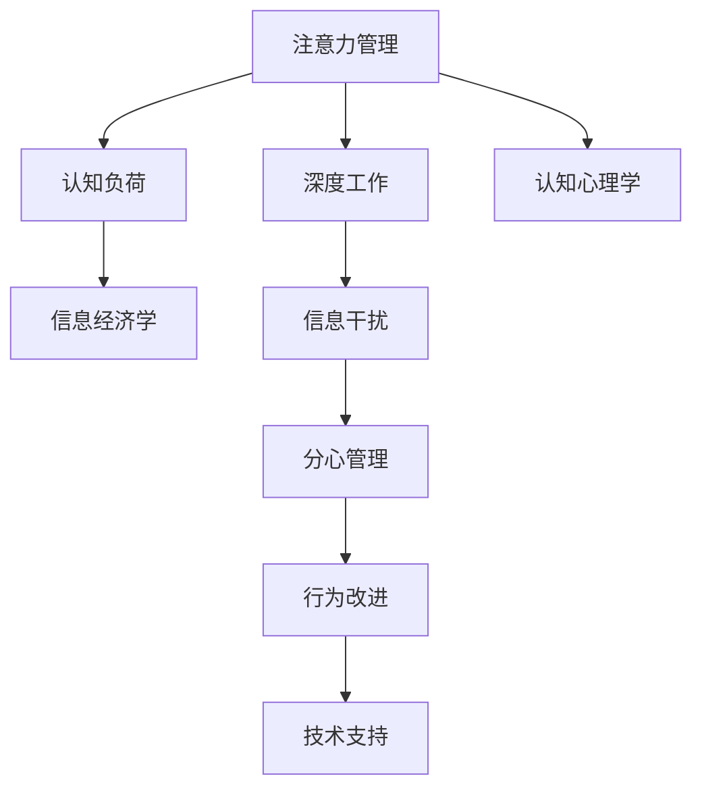

                 

# 信息时代的注意力管理实践与策略：在干扰和分心中保持头脑清晰

> 关键词：注意力管理, 信息干扰, 分心管理, 深度工作, 认知科学

## 1. 背景介绍

在信息爆炸的时代，人们每天面对海量的信息，从电子邮件、社交媒体、到即时通讯、视频流，无处不在的信息流让人应接不暇。然而，信息的泛滥并非全是好事，它在带来便利的同时，也导致了大量的注意力分散和分心问题。根据《美国职业病报告》，注意力缺陷和注意力分散问题已经成为美国职场的一个主要问题，每年给美国社会带来巨大的经济损失。

### 1.1 问题由来

注意力管理(Attention Management)和分心管理(Distractibility Management)成为了现代科技时代下，人类面临的重大挑战。注意力是认知心理学的核心概念，指人们在与外界刺激互动时，选择和维持特定刺激的能力。在信息过载的时代，如何管理和优化注意力资源，显得尤为重要。

**现代生活的特征**：

1. **信息泛滥**：互联网使得信息传播成本极低，几乎人人都可以发布信息，导致信息泛滥。
2. **干扰频发**：社交媒体、即时通讯、广告弹窗等，不断打断人们的注意力。
3. **分心易生**：游戏、短视频、电子阅读等，容易使人沉迷，难以自拔。

### 1.2 问题核心关键点

注意力管理和分心管理的关键点在于：

1. **识别干扰源**：准确识别出导致分心的主要干扰源。
2. **优化注意力策略**：通过科学的管理策略，提升注意力集中度和持续时间。
3. **技术支持**：利用各种工具和算法，辅助实现注意力管理的自动化。
4. **行为改进**：通过心理训练和习惯养成，改善注意力分配和使用效率。

本文将深入探讨注意力管理和分心管理的核心概念、核心算法、具体操作步骤，并通过数学模型和实践案例，为读者提供全面的指导。

## 2. 核心概念与联系

### 2.1 核心概念概述

为更好地理解注意力管理和分心管理，本节将介绍几个关键概念：

- **注意力管理(Attention Management)**：指通过各种策略和工具，识别并管理干扰源，提升注意力集中度。
- **分心管理(Distractibility Management)**：指通过行为干预和心理训练，提升注意力控制力，减少分心行为。
- **深度工作(Deep Work)**：指一种通过高度集中注意力，使大脑进入最优状态，高效完成任务的工作模式。
- **认知负荷(Cognitive Load)**：指完成任务所需的心理资源（如记忆、思考、计算），过载会分散注意力。
- **认知心理学(Cognitive Psychology)**：研究注意力、记忆、语言等认知过程，揭示人类思维本质。
- **信息经济学(Information Economics)**：分析信息获取与注意力成本的关系，强调信息选择的效率。

这些概念之间的逻辑关系可以通过以下Mermaid流程图来展示：



这个流程图展示了几大关键概念之间的联系：

1. 注意力管理通过管理干扰源，提升深度工作时的注意力集中度。
2. 认知负荷和信息经济学解释了注意力资源的使用效率，以及信息选择的重要性。
3. 认知心理学揭示了注意力管理背后的心理机制。
4. 深度工作是注意力管理的最终目标，即在干扰和分心中保持头脑清晰。
5. 分心管理通过行为干预和心理训练，提升对干扰的抵抗力。
6. 技术支持提供各种工具和算法，辅助注意力管理的自动化实施。
7. 行为改进从根本上提升注意力控制力，改善分心行为。

## 3. 核心算法原理 & 具体操作步骤
### 3.1 算法原理概述

注意力管理和分心管理算法的核心在于通过识别干扰源，应用优化策略，最大化注意力资源的使用效率，同时最小化分心行为的发生。具体来说，这一过程可以分解为以下几个步骤：

1. **识别干扰源**：通过数据分析、问卷调查、行为观察等手段，识别并分类常见干扰源。
2. **设置注意力目标**：明确深度工作的具体任务和时间节点，制定合理的注意力分配策略。
3. **应用注意力优化策略**：如时间块管理、番茄工作法、优先级排序等，提升注意力集中度和持续时间。
4. **监测注意力使用情况**：通过时间跟踪工具、注意力监测应用等，实时获取注意力使用情况。
5. **调整策略并迭代优化**：根据监测结果，调整注意力分配策略，并通过行为干预和心理训练持续改进。

### 3.2 算法步骤详解

以下我们详细介绍基于上述流程的注意力管理算法详细步骤：

**Step 1: 识别干扰源**
1. **数据收集**：利用应用程序如RescueTime、Focus@Will等，收集用户日常使用设备、软件、网站等数据。
2. **干扰源分类**：将数据归类为工作、娱乐、社交、通讯等干扰源，统计各类型干扰源在一天中的占比。
3. **时间分布分析**：分析干扰源出现的时间分布，找出高峰和低谷时段。

**Step 2: 设置注意力目标**
1. **任务规划**：明确每个深度工作的具体任务，并划分到不同时间段。
2. **时间块划分**：将一天划分为若干固定长度的注意力时间块，例如每个时间块25分钟。
3. **目标设定**：为每个时间块设定明确的目标，例如阅读一篇论文、编写一个代码模块等。

**Step 3: 应用注意力优化策略**
1. **时间块管理**：在每个时间块内，集中注意力完成目标任务，避免中途打断。
2. **番茄工作法**：采用番茄工作法，每工作25分钟休息5分钟，避免长时间工作导致的疲劳和分心。
3. **优先级排序**：根据任务的紧急程度和重要性，优先处理高优先级任务，减少次要干扰。

**Step 4: 监测注意力使用情况**
1. **时间跟踪**：使用RescueTime、Toggl等时间跟踪工具，记录每个任务的时间分配情况。
2. **注意力监测**：利用浏览器插件如Focus@Will、StayFocusd等，监控当前使用的应用和网站，防止分心。
3. **反馈和调整**：根据时间跟踪和注意力监测的结果，调整时间块划分和任务规划。

**Step 5: 调整策略并迭代优化**
1. **数据反馈**：分析时间跟踪和注意力监测的数据，找出低效率和分心行为。
2. **策略优化**：针对低效率和分心问题，调整时间块管理、番茄工作法等策略，进行优化。
3. **行为干预**：通过心理训练如冥想、呼吸练习等，改善注意力控制力。
4. **持续改进**：不断重复上述流程，逐步提升注意力管理效果。

### 3.3 算法优缺点

注意力管理和分心管理算法具有以下优点：

1. **科学性和可操作性**：利用科学研究和工具，制定切实可行的管理策略，提升注意力集中度。
2. **自动化和可监测性**：通过技术手段，自动化跟踪注意力使用情况，及时发现和调整问题。
3. **个性化和灵活性**：针对不同人的注意力特点和工作习惯，制定个性化管理方案。
4. **系统性和持续性**：将注意力管理视为一个系统工程，长期坚持，逐步提升效果。

同时，该算法也存在一些局限性：

1. **数据依赖**：算法的准确性和效果依赖于数据的质量和数量，难以全面覆盖所有干扰源。
2. **行为改变**：仅靠技术手段和数据反馈，难以从根本上改变用户的行为习惯，需要配合心理训练和行为干预。
3. **模型简化**：算法模型往往基于简化假设，无法完全预测复杂情境下的注意力变化。
4. **隐私风险**：监测工具的数据采集可能带来隐私问题，需要谨慎处理。

尽管存在这些局限性，基于注意力管理的算法仍在持续改进和优化，为提升信息时代的工作效率和生活质量做出了重要贡献。

### 3.4 算法应用领域

注意力管理和分心管理算法已经在诸多领域得到了广泛应用，例如：

1. **企业管理**：通过提高员工注意力集中度，提升团队工作效率和企业竞争力。
2. **学习与教育**：通过优化学生的注意力分配，提升学习效果和学术成绩。
3. **远程工作**：帮助远程工作者管理家庭和工作干扰，提升远程工作质量。
4. **健康与福祉**：改善注意力管理，减少因注意力问题带来的心理压力和身体不适。
5. **创意与设计**：通过深度工作模式，激发创意灵感，提升设计品质。

这些应用场景展示了注意力管理和分心管理算法的广泛适用性，为提升信息时代的生产力和生活质量提供了重要支持。

## 4. 数学模型和公式 & 详细讲解 & 举例说明（备注：数学公式请使用latex格式，latex嵌入文中独立段落使用 $$，段落内使用 $)
### 4.1 数学模型构建

基于上述算法步骤，可以构建一个简单的数学模型来描述注意力管理过程。假设一天有24小时，其中$N$个时间块，每个时间块长度为$t$分钟，每个时间块的注意力集中度为$A_i$，那么一天的注意力总时间可以表示为：

$$
T = N \times t \times A_i
$$

其中$A_i$是随机变量，服从特定的概率分布，如正态分布、贝塔分布等。为了最大化$T$，需要优化$A_i$的分布。

### 4.2 公式推导过程

假设$A_i$服从均值为$\mu$、标准差为$\sigma$的正态分布，则期望注意力总时间$T$为：

$$
E[T] = N \times t \times \mu
$$

为了提高$T$，可以通过优化$\mu$和$\sigma$，使其尽可能接近目标值。例如，可以通过时间块管理、番茄工作法等策略，提升$A_i$的均值$\mu$，并控制其标准差$\sigma$，减少波动。

具体而言，假设每个时间块的注意力集中度$A_i$服从正态分布$A_i \sim N(\mu, \sigma^2)$，那么期望注意力总时间$T$的优化目标为：

$$
\max E[T] = N \times t \times \mu
$$

通过控制$\mu$和$\sigma$，最大化$T$。常见的优化方法包括：

1. **均值优化**：通过增加时间块长度$t$和频率$N$，提升$A_i$的均值$\mu$。
2. **方差控制**：通过时间块管理、番茄工作法等策略，减小$A_i$的标准差$\sigma$，减少波动。

### 4.3 案例分析与讲解

以时间块管理为例，假设每个时间块的长度为25分钟，共8个时间块，每天工作8小时，则期望注意力总时间为：

$$
E[T] = 8 \times 25 \times \mu
$$

根据公式推导，为了最大化$E[T]$，需要提升$\mu$。例如，通过时间块管理，将25分钟的时间块分成若干小时间块，每个小时间块集中注意力10分钟，休息5分钟。这种策略有助于提高注意力集中度$\mu$，并减小标准差$\sigma$。

假设优化后的均值$\mu = 0.8$，标准差$\sigma = 0.2$，则期望注意力总时间$E[T]$为：

$$
E[T] = 8 \times 25 \times 0.8 = 160 \text{分钟}
$$

通过调整时间块管理策略，可以在每天8小时内完成更多的工作任务，显著提升工作效率。

## 5. 项目实践：代码实例和详细解释说明
### 5.1 开发环境搭建

在进行注意力管理项目实践前，我们需要准备好开发环境。以下是使用Python进行项目开发的环境配置流程：

1. 安装Anaconda：从官网下载并安装Anaconda，用于创建独立的Python环境。

2. 创建并激活虚拟环境：
```bash
conda create -n attention-env python=3.8 
conda activate attention-env
```

3. 安装相关Python包：
```bash
pip install pandas numpy matplotlib seaborn
```

4. 安装时间跟踪工具RescueTime：
```bash
conda install -c conda-forge 'rescuetime'
```

5. 安装注意力监测工具Focus@Will：
```bash
pip install focusatwill
```

完成上述步骤后，即可在`attention-env`环境中开始项目实践。

### 5.2 源代码详细实现

下面以使用RescueTime和Focus@Will进行注意力管理为例，给出代码实现。

首先，获取RescueTime的数据，并统计各干扰源的使用时间：

```python
import rescue_time
from rescue_time import RescueTime
from collections import defaultdict

# 初始化RescueTime
rescue = RescueTime()

# 获取当前用户数据
data = rescue.get_user_data()

# 统计各干扰源使用时间
source_times = defaultdict(int)
for record in data['time_entries']:
    source_times[record['source_name']] += record['minutes']

# 打印统计结果
print('各干扰源使用时间：')
for source, time in source_times.items():
    print(f'{source}: {time}分钟')
```

然后，使用Focus@Will进行注意力监测：

```python
import focusatwill
from focusatwill import FocusAtWill

# 初始化Focus@Will
focus = FocusAtwill()

# 获取当前应用列表
apps = focus.get_applications()

# 设置当前应用为工作应用
focus.set_applications(apps)

# 获取当前应用的注意力值
attention_score = focus.get_attention_score()

# 打印注意力值
print(f'当前应用注意力值: {attention_score}')
```

最后，将上述两个步骤结合起来，进行实际的注意力管理：

```python
# 使用RescueTime获取当前用户数据
rescue_data = rescue.get_user_data()

# 统计各干扰源使用时间
source_times = defaultdict(int)
for record in rescue_data['time_entries']:
    source_times[record['source_name']] += record['minutes']

# 使用Focus@Will获取当前应用注意力值
focus_data = focus.get_attention_score()

# 打印统计和监测结果
print('各干扰源使用时间：')
for source, time in source_times.items():
    print(f'{source}: {time}分钟')

print('当前应用注意力值: ', focus_data)
```

以上就是使用RescueTime和Focus@Will进行注意力管理的完整代码实现。可以看到，通过这些工具，可以实时监测和记录用户的注意力使用情况，进而进行更精准的优化。

### 5.3 代码解读与分析

让我们再详细解读一下关键代码的实现细节：

**RescueTime数据获取**：
- `rescue.get_user_data()`方法用于获取当前用户的RescueTime数据，包括各应用的使用时间等。
- `defaultdict(int)`用于创建统计各干扰源使用时间的字典。
- 遍历`time_entries`，累加每个应用的使用时间，并打印统计结果。

**Focus@Will应用设置**：
- `focus.get_applications()`方法用于获取所有应用列表。
- `focus.set_applications(apps)`方法用于将当前应用设置为工作应用。
- `focus.get_attention_score()`方法用于获取当前应用的注意力值。

**综合分析**：
- 结合RescueTime和Focus@Will的数据，可以得出用户的注意力使用情况和干扰源分布。
- 根据这些数据，可以调整时间块管理、番茄工作法等策略，优化注意力集中度和持续时间。

## 6. 实际应用场景
### 6.1 企业管理

在企业管理中，通过提高员工注意力集中度，可以显著提升团队工作效率和企业竞争力。常见的应用场景包括：

1. **会议管理**：使用时间块管理和番茄工作法，使会议高效进行，减少不必要的干扰。
2. **任务分配**：通过优先级排序和分时管理，优化任务安排，提升团队协作效率。
3. **远程办公**：利用注意力监测工具，确保远程工作者保持高效，避免家庭和工作干扰。

### 6.2 学习与教育

在学习和教育中，优化学生的注意力分配，可以提升学习效果和学术成绩。常见的应用场景包括：

1. **课程规划**：根据学生的注意力周期，规划合适的学习时间块和休息时间，提升学习效率。
2. **课堂管理**：利用焦点应用，防止学生分心，保持课堂注意力集中。
3. **学习监测**：使用RescueTime等工具，监测学生的注意力使用情况，及时发现和改进问题。

### 6.3 远程工作

在远程工作中，管理好注意力，可以提升远程工作质量。常见的应用场景包括：

1. **时间管理**：通过时间块管理和番茄工作法，提升远程工作者的注意力集中度。
2. **任务分配**：利用优先级排序和分时管理，优化远程工作任务安排。
3. **工具使用**：使用RescueTime、Focus@Will等工具，记录和监测远程工作的注意力使用情况。

### 6.4 健康与福祉

在健康与福祉中，改善注意力管理，可以减少因注意力问题带来的心理压力和身体不适。常见的应用场景包括：

1. **冥想练习**：通过冥想和呼吸练习，改善注意力控制力，缓解压力和焦虑。
2. **注意力训练**：利用认知训练工具，提升注意力集中度和持续性。
3. **心理干预**：通过心理训练和行为干预，改善注意力管理，提升生活质量。

### 6.5 未来应用展望

随着技术的发展，未来注意力管理和分心管理将进一步普及和深化，带来更多应用场景。例如：

1. **智能家居**：通过智能设备和系统，自动化管理家庭和工作干扰，提升居家和工作体验。
2. **健康管理**：结合生理监测设备和注意力监测工具，提供个性化的健康建议和管理方案。
3. **教育科技**：利用注意力监测和分析技术，优化在线教育平台的用户体验和教学效果。

## 7. 工具和资源推荐
### 7.1 学习资源推荐

为了帮助开发者系统掌握注意力管理和分心管理理论基础和实践技巧，这里推荐一些优质的学习资源：

1. **《深度工作：如何在分心时代高效生活》**：作者Cal Newport，系统介绍了深度工作的重要性、原则和方法，是提升工作效率的重要读物。
2. **《认知负荷：信息时代注意力管理的科学》**：作者Elena Polyakova，详细讲解了认知负荷的概念、测量和管理方法，适合技术人员深入学习。
3. **Coursera《注意力管理：从科学到实践》**：斯坦福大学开设的注意力管理课程，涵盖注意力管理的理论和实践，适合初学者学习。
4. **Udemy《时间管理：科学原理与应用》**：系统讲解时间管理和注意力优化策略，适合日常工作和生活中的应用。
5. **Github《注意力管理开源项目》**：包含各类开源工具和算法实现，适合开发者深入学习和使用。

通过对这些资源的学习实践，相信你一定能够快速掌握注意力管理的精髓，并用于解决实际的注意力问题。

### 7.2 开发工具推荐

高效的开发离不开优秀的工具支持。以下是几款用于注意力管理和分心管理开发的常用工具：

1. **RescueTime**：时间跟踪和管理工具，帮助用户记录和分析日常活动，优化时间利用。
2. **Focus@Will**：注意力监测工具，通过音乐和背景音，帮助用户集中注意力，减少分心。
3. **Toggl**：时间跟踪工具，记录和分析任务时间分配，优化工作安排。
4. **Focus Booster**：番茄工作法工具，帮助用户按照番茄工作法安排时间，提升注意力集中度。
5. **Google Calendar**：日程管理工具，帮助用户安排和管理任务时间。
6. **StayFocusd**：浏览器插件，限制用户访问特定网站的时间，减少分心行为。

合理利用这些工具，可以显著提升注意力管理和分心管理任务的开发效率，加快创新迭代的步伐。

### 7.3 相关论文推荐

注意力管理和分心管理的发展源于学界的持续研究。以下是几篇奠基性的相关论文，推荐阅读：

1. **《信息时代的深度工作》**：作者Cal Newport，探讨了深度工作在现代信息社会的重要性，提出了注意力管理的具体策略。
2. **《认知负荷的理论和测量》**：作者Elena Polyakova，介绍了认知负荷的概念、测量和管理方法，为实践提供了科学依据。
3. **《注意力管理的心理学和工程学》**：作者Erin E. McBride，综述了注意力管理的研究进展，提出了未来研究的方向。
4. **《利用深度学习进行注意力监测》**：作者Kristjan Plangger，探讨了利用深度学习模型监测注意力的方法，提升了监测的准确性和实时性。
5. **《心理训练对注意力的影响》**：作者Maren Wulff，分析了心理训练对注意力集中度和持续性的影响，提供了实证支持。

这些论文代表了大规模注意力管理的研究进展，通过学习这些前沿成果，可以帮助研究者把握学科前进方向，激发更多的创新灵感。

## 8. 总结：未来发展趋势与挑战
### 8.1 总结

本文对注意力管理和分心管理的核心概念、核心算法、具体操作步骤进行了全面系统的介绍。首先阐述了注意力管理和分心管理的研究背景和意义，明确了注意力管理在提升信息时代工作效率和生活质量方面的重要作用。其次，从原理到实践，详细讲解了注意力管理和分心管理的数学模型和操作步骤，并通过代码实例和数据分析，为读者提供了全面的指导。

通过本文的系统梳理，可以看到，注意力管理和分心管理算法正在成为信息时代的重要范式，极大地提升了工作和学习效率，改善了心理和生理健康。未来的研究还需要在技术、行为、心理等多个维度协同发力，进一步提升注意力管理的效果和应用范围。

### 8.2 未来发展趋势

展望未来，注意力管理和分心管理技术将呈现以下几个发展趋势：

1. **自动化和智能化**：利用人工智能和机器学习技术，实现自动化的注意力监测和管理，提高效率和准确性。
2. **个性化和定制化**：基于用户的行为和心理数据，提供个性化的注意力管理方案，提升用户体验。
3. **多模态融合**：结合生理监测、环境感知等多种数据源，实现多模态的注意力监测和管理，提升综合效果。
4. **跨平台整合**：将注意力管理工具整合到不同平台（如手机、电脑、智能家居等），形成无缝的跨平台体验。
5. **跨文化适应**：考虑不同文化背景和习惯，设计适应性更强的注意力管理工具和策略。
6. **伦理和安全**：关注注意力管理的隐私和安全问题，确保用户数据和行为的安全。

以上趋势凸显了注意力管理和分心管理技术的广阔前景。这些方向的探索发展，必将进一步提升信息时代的工作效率和生活质量，为构建更智能、更高效的工作和生活环境提供支持。

### 8.3 面临的挑战

尽管注意力管理和分心管理技术已经取得了显著成果，但在迈向更加智能化、普适化应用的过程中，它仍面临诸多挑战：

1. **数据隐私和安全**：如何保护用户的数据隐私，防止数据泄露和滥用，是未来需要重点关注的问题。
2. **行为习惯改变**：仅靠技术手段和数据反馈，难以从根本上改变用户的行为习惯，需要配合心理训练和行为干预。
3. **多模态融合复杂性**：将生理监测、环境感知等多种数据源融合，需要克服技术实现和数据整合的复杂性。
4. **跨平台兼容性**：将注意力管理工具整合到不同平台（如手机、电脑、智能家居等），需要解决跨平台兼容性问题。
5. **跨文化适应性**：设计适应性更强的注意力管理工具和策略，需要考虑不同文化背景和习惯。

正视这些挑战，积极应对并寻求突破，将是大规模注意力管理技术走向成熟的必由之路。相信随着学界和产业界的共同努力，这些挑战终将一一被克服，注意力管理技术必将在构建智能工作和生活环境中发挥重要作用。

### 8.4 研究展望

面向未来，注意力管理和分心管理研究需要在以下几个方面寻求新的突破：

1. **自动化和智能化**：利用人工智能和机器学习技术，实现自动化的注意力监测和管理，提高效率和准确性。
2. **个性化和定制化**：基于用户的行为和心理数据，提供个性化的注意力管理方案，提升用户体验。
3. **多模态融合**：结合生理监测、环境感知等多种数据源，实现多模态的注意力监测和管理，提升综合效果。
4. **跨平台整合**：将注意力管理工具整合到不同平台（如手机、电脑、智能家居等），形成无缝的跨平台体验。
5. **跨文化适应**：考虑不同文化背景和习惯，设计适应性更强的注意力管理工具和策略。
6. **伦理和安全**：关注注意力管理的隐私和安全问题，确保用户数据和行为的安全。

这些研究方向的探索，必将引领注意力管理技术迈向更高的台阶，为构建智能工作和生活环境提供更强大的支持。面向未来，注意力管理技术还需要与其他人工智能技术进行更深入的融合，如知识表示、因果推理、强化学习等，多路径协同发力，共同推动注意力管理技术的进步。只有勇于创新、敢于突破，才能不断拓展注意力管理的边界，让智能技术更好地造福人类社会。

## 9. 附录：常见问题与解答

**Q1: 注意力管理和分心管理对生产力和生活有什么影响？**

A: 注意力管理和分心管理对生产力和生活质量有显著影响。通过优化注意力分配和使用，可以提升工作效率、学习效果和生活质量。例如：

1. **工作生产力**：通过提高注意力集中度，减少分心行为，提升任务完成速度和质量。
2. **学习效果**：通过优化学习时间安排和注意力管理，提升学习效率和学术成绩。
3. **生活品质**：通过减少分心行为，提高心理和身体健康，改善家庭和工作生活体验。

**Q2: 如何有效识别和分类常见干扰源？**

A: 识别和分类常见干扰源可以通过以下步骤：

1. **数据收集**：使用RescueTime、Toggl等时间跟踪工具，记录用户日常使用设备、软件、网站等数据。
2. **数据分析**：统计各应用的使用时间，分析使用频率和时间分布。
3. **分类归档**：将干扰源归类为工作、娱乐、社交、通讯等，统计各类型干扰源在一天中的占比。
4. **时间分布分析**：分析干扰源出现的时间分布，找出高峰和低谷时段。

**Q3: 如何在深度工作中保持注意力集中？**

A: 在深度工作中保持注意力集中，可以采用以下策略：

1. **时间块管理**：将一天划分为若干固定长度的注意力时间块，每个时间块集中注意力完成特定任务。
2. **番茄工作法**：采用番茄工作法，每工作25分钟休息5分钟，避免长时间工作导致的疲劳和分心。
3. **优先级排序**：根据任务的紧急程度和重要性，优先处理高优先级任务，减少次要干扰。

**Q4: 如何使用注意力监测工具？**

A: 使用注意力监测工具，可以实时记录和分析注意力使用情况，具体步骤如下：

1. **安装工具**：安装Focus@Will、StayFocusd等注意力监测工具。
2. **设置应用**：将当前应用设置为工作应用，如编程、学习等。
3. **监测注意力**：使用Focus@Will等工具，监测当前应用的注意力值。
4. **分析报告**：定期查看注意力监测报告，调整注意力管理策略。

**Q5: 注意力管理和分心管理技术面临哪些挑战？**

A: 注意力管理和分心管理技术面临以下挑战：

1. **数据隐私和安全**：如何保护用户的数据隐私，防止数据泄露和滥用。
2. **行为习惯改变**：仅靠技术手段和数据反馈，难以从根本上改变用户的行为习惯。
3. **多模态融合复杂性**：将生理监测、环境感知等多种数据源融合，需要克服技术实现和数据整合的复杂性。
4. **跨平台兼容性**：将注意力管理工具整合到不同平台（如手机、电脑、智能家居等），需要解决跨平台兼容性问题。
5. **跨文化适应性**：设计适应性更强的注意力管理工具和策略，需要考虑不同文化背景和习惯。

**Q6: 如何根据注意力管理数据进行优化？**

A: 根据注意力管理数据进行优化，可以采用以下步骤：

1. **数据反馈**：分析时间跟踪和注意力监测的数据，找出低效率和分心问题。
2. **策略调整**：针对低效率和分心问题，调整时间块管理、番茄工作法等策略，进行优化。
3. **行为干预**：通过心理训练如冥想、呼吸练习等，改善注意力控制力。
4. **持续改进**：不断重复上述流程，逐步提升注意力管理效果。

---

作者：禅与计算机程序设计艺术 / Zen and the Art of Computer Programming

