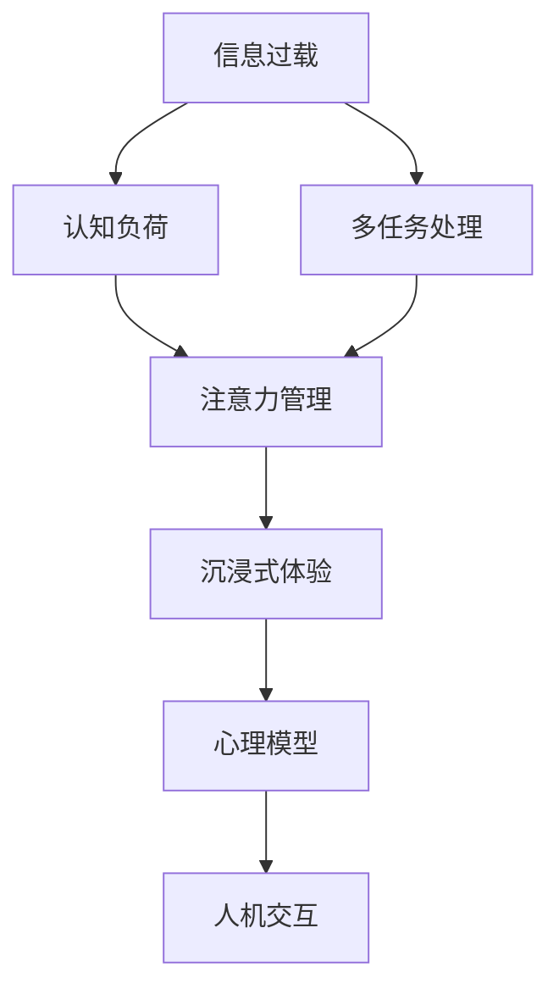

                 

# 信息时代的注意力管理策略与实践：在干扰和信息过载中航行

> 关键词：信息过载,注意力管理,认知负荷,多任务处理,心理模型,人机交互,沉浸式体验

## 1. 背景介绍

### 1.1 问题由来
在信息爆炸的时代，我们面临着前所未有的数据量和信息量。据统计，每年全球产生的数字信息量已经从 2020 年的 44ZB 爆炸式增长到 2025 年的 175ZB。（参见 https://www.informationisbeautiful.net/visualizations/global-data-growth/）这一趋势意味着数据和信息的获取变得更加容易，但同时也带来了新的挑战：信息过载和注意力管理问题。

信息过载指的是信息量远远超过个体处理能力，导致注意力分散和认知负荷过重的现象。在信息过载的环境下，我们容易忽视重要信息、产生决策疲劳，甚至出现信息盲点。如何有效管理注意力，提升信息处理效率，已成为当前科技和社会面临的重要课题。

### 1.2 问题核心关键点
1. **信息过载与注意力管理**：信息过载导致注意力分散，需要有效的策略来管理注意力，避免决策疲劳和信息盲点。
2. **认知负荷**：信息过载引发的认知负荷过重问题，需要通过优化多任务处理来减轻。
3. **心理模型**：构建基于认知心理学的人机交互模型，理解个体如何处理信息，以设计更符合用户需求的界面和交互方式。
4. **沉浸式体验**：如何创造沉浸式体验，减少分心，提升用户对信息的关注度和参与度。
5. **认知负荷的神经科学基础**：认知负荷的减少与脑神经活动的调整有关，需要通过神经科学研究和技术实现。

这些关键点构成了我们理解和管理注意力管理策略的理论基础，旨在帮助人们在信息过载的环境中保持高效和专注。

## 2. 核心概念与联系

### 2.1 核心概念概述

为更好地理解信息时代注意力管理的策略和实践，本节将介绍几个核心概念及其相互关系：

- **信息过载 (Information Overload)**：指的是个体接收的信息量超过其处理能力，导致认知负荷过重，注意力分散的现象。
- **认知负荷 (Cognitive Load)**：指个体在信息处理过程中所需的脑力资源。过高的认知负荷会导致注意力分散和效率下降。
- **多任务处理 (Multitasking)**：同时进行多项任务，常见于工作中多线程、多窗口等操作。多任务处理可能导致认知负荷增加，注意力分散。
- **注意力管理 (Attention Management)**：指通过策略和方法有效控制和管理个体注意力，以提升信息处理效率和决策质量。
- **沉浸式体验 (Immersive Experience)**：通过沉浸式设计减少外界干扰，使用户集中注意力在当前任务上，提升用户体验和满意度。
- **心理模型 (Psychological Models)**：基于认知心理学，描述个体如何处理信息和注意力分布的模型，帮助设计符合用户心理预期的人机交互界面。
- **人机交互 (Human-Computer Interaction, HCI)**：研究人与计算机系统如何相互交流和协作，是构建沉浸式体验和注意力管理策略的重要基础。

这些概念之间的逻辑关系可以通过以下Mermaid流程图来展示：



这个流程图展示了几大核心概念之间的关联：

1. 信息过载直接导致认知负荷增加。
2. 多任务处理进一步增加认知负荷，需要管理注意力以避免分散。
3. 注意力管理旨在减轻认知负荷，提升信息处理效率。
4. 沉浸式体验通过减少外界干扰，增强用户集中注意力的能力。
5. 心理模型用于理解个体认知和注意力分布，设计符合用户心理预期的交互界面。
6. 人机交互则基于心理模型，构建有效的交互机制，提升用户体验和满意度。

这些概念共同构成了信息时代注意力管理策略的理论框架，为后续实践提供了指导。

## 3. 核心算法原理 & 具体操作步骤
### 3.1 算法原理概述

基于认知心理学和信息科学的研究，信息时代注意力管理策略主要通过以下几个关键点进行优化：

1. **认知负荷的分布与控制**：通过控制多任务处理的顺序和任务复杂度，降低认知负荷，提升注意力集中度。
2. **注意力分布的引导**：通过设计合适的界面和交互机制，引导用户注意力分布，减少信息分散。
3. **沉浸式体验的设计**：通过减少外部干扰和增加交互的沉浸感，提高用户对当前任务的集中注意。
4. **基于心理模型的交互设计**：通过研究用户认知和注意力的心理模型，设计符合用户预期和习惯的人机交互界面。

### 3.2 算法步骤详解

基于上述原理，信息时代注意力管理的具体操作步骤如下：

**Step 1: 数据收集与分析**
- 收集用户在使用信息系统和多任务处理时的注意力分布和认知负荷数据。
- 使用认知负荷评估工具（如PQR、NET等）进行定量分析，理解用户的认知负荷水平。
- 通过问卷调查和用户访谈，获得定性反馈，理解用户的心理模型和行为偏好。

**Step 2: 设计认知负荷管理策略**
- 根据收集的数据，设计多任务处理和任务优先级的策略，如批量处理、阶段化任务等。
- 引入注意力自动引导机制，如焦点区域、分屏显示等，引导用户注意力集中于当前任务。

**Step 3: 创建沉浸式体验**
- 设计简洁直观的界面布局，减少视觉干扰，提高信息可读性和操作效率。
- 增加交互的沉浸感，如虚拟现实(VR)、增强现实(AR)等，使用户更深入地参与任务。
- 采用降噪技术，减少背景噪音和干扰因素，提升用户专注度。

**Step 4: 基于心理模型的交互设计**
- 结合用户的心理模型，设计符合用户预期和习惯的交互界面。
- 使用符合认知负荷理论的界面元素，如信息分组、分级展示等，减少用户的信息处理难度。
- 设计可定制化的交互选项，允许用户根据自己的需求和偏好调整界面布局和功能。

**Step 5: 测试与迭代优化**
- 进行A/B测试和用户反馈收集，评估设计的注意力管理策略和沉浸式体验的效果。
- 根据测试结果和用户反馈，进行迭代优化，不断改进注意力管理策略和沉浸式体验。

### 3.3 算法优缺点

信息时代注意力管理策略的优点包括：

1. **提升效率和准确性**：通过合理分配认知负荷和引导注意力，提升用户的信息处理效率和决策质量。
2. **增强用户体验**：通过沉浸式体验设计，减少外部干扰，提高用户满意度。
3. **灵活适应不同用户**：基于心理模型进行交互设计，能更好地适应不同用户的需求和偏好。

缺点在于：

1. **设计复杂度高**：需要深入理解认知心理学和用户心理模型，设计复杂。
2. **实施成本高**：涉及多方面的技术实现，如VR/AR、降噪技术等，实施成本较高。
3. **用户习惯变化**：用户的注意力管理和行为习惯可能随时间变化，策略需动态调整。

### 3.4 算法应用领域

信息时代注意力管理策略已在多个领域得到应用：

- **教育**：通过沉浸式学习环境，提升学生的学习效率和兴趣。
- **医疗**：减少医疗人员在多任务处理中的认知负荷，提升诊断和治疗的准确性。
- **办公**：优化多任务处理，减少信息过载，提升办公效率。
- **娱乐**：通过沉浸式体验设计，提升游戏和媒体内容的吸引力和用户参与度。

## 4. 数学模型和公式 & 详细讲解  
### 4.1 数学模型构建

本节将使用数学语言对信息时代注意力管理的策略进行更加严格的刻画。

**认知负荷模型（Cognitive Load Model, CLM）**：假设个体处理信息所需的认知资源为 $C$，包括注意（Attention）、记忆（Memory）和决策（Decision Making）等维度。在信息过载情况下，个体认知负荷 $C$ 可表示为：

$$
C = f(A, M, D)
$$

其中 $f$ 表示认知负荷的计算函数，$A$、$M$ 和 $D$ 分别表示注意力、记忆和决策所需的认知资源。

**注意力分布模型（Attention Distribution Model, ADM）**：假设个体在不同信息源上的注意力分配为 $A$，可表示为：

$$
A = \left\{
\begin{aligned}
  & \frac{C}{n} & \text{若信息源数量 $n$ 固定} \\
  & \frac{C}{n} - k & \text{若信息源数量为 $n$ 个，分配给信息源 $k$ 的注意力}
\end{aligned}
\right.
$$

其中 $C$ 表示总认知负荷，$n$ 表示信息源数量，$k$ 表示信息源 $k$ 分配的注意力。

### 4.2 公式推导过程

以下我们以一个具体的案例进行推导：假设一个用户在处理电子邮件和即时通讯信息时，需要分配的认知负荷 $C$ 为 60 认知单位，信息源数量为 2 个（电子邮件和即时通讯）。根据注意力分布模型，用户分配给每个信息源的注意力 $A$ 分别为：

$$
A_{\text{邮件}} = \frac{C}{2} - 10, A_{\text{即时通讯}} = \frac{C}{2} + 10
$$

在多任务处理时，假设用户同时处理邮件和即时通讯，且分配给每个任务的时间为 $t$，则用户完成每个任务所需的认知资源为：

$$
C_{\text{邮件}} = t \cdot A_{\text{邮件}}, C_{\text{即时通讯}} = t \cdot A_{\text{即时通讯}}
$$

若 $C_{\text{邮件}} + C_{\text{即时通讯}} \leq C$，则用户可完成两个任务，否则只能选择其中一个。

### 4.3 案例分析与讲解

假设一个用户在处理电子邮件和即时通讯信息时，需要分配的认知负荷 $C$ 为 60 认知单位，信息源数量为 2 个（电子邮件和即时通讯）。根据注意力分布模型，用户分配给每个信息源的注意力 $A$ 分别为：

$$
A_{\text{邮件}} = \frac{C}{2} - 10, A_{\text{即时通讯}} = \frac{C}{2} + 10
$$

在多任务处理时，假设用户同时处理邮件和即时通讯，且分配给每个任务的时间为 $t$，则用户完成每个任务所需的认知资源为：

$$
C_{\text{邮件}} = t \cdot A_{\text{邮件}}, C_{\text{即时通讯}} = t \cdot A_{\text{即时通讯}}
$$

若 $C_{\text{邮件}} + C_{\text{即时通讯}} \leq C$，则用户可完成两个任务，否则只能选择其中一个。

例如，若 $t = 1$，则用户完成邮件和即时通讯所需的认知资源分别为：

$$
C_{\text{邮件}} = 15 - 10 = 5, C_{\text{即时通讯}} = 15 + 10 = 25
$$

由于 $C_{\text{邮件}} + C_{\text{即时通讯}} = 30 \leq 60$，因此用户可以同时处理邮件和即时通讯。

## 5. 项目实践：代码实例和详细解释说明
### 5.1 开发环境搭建

在进行注意力管理策略开发前，我们需要准备好开发环境。以下是使用Python进行注意力管理策略的开发环境配置流程：

1. 安装Anaconda：从官网下载并安装Anaconda，用于创建独立的Python环境。

2. 创建并激活虚拟环境：
```bash
conda create -n attention-env python=3.8 
conda activate attention-env
```

3. 安装PyTorch：根据CUDA版本，从官网获取对应的安装命令。例如：
```bash
conda install pytorch torchvision torchaudio cudatoolkit=11.1 -c pytorch -c conda-forge
```

4. 安装NumPy、Pandas、Matplotlib等科学计算库：
```bash
pip install numpy pandas matplotlib scikit-learn
```

5. 安装其他必要的库：
```bash
pip install seaborn plotly psutil
```

完成上述步骤后，即可在`attention-env`环境中开始注意力管理策略的开发实践。

### 5.2 源代码详细实现

这里我们以设计一个基于认知负荷管理策略的信息处理界面为例，给出使用PyTorch和Seaborn库进行开发的Python代码实现。

首先，定义一个简化的认知负荷管理模型：

```python
import numpy as np
from seaborn import plotly

class CognitiveLoadModel:
    def __init__(self, total_load=60, num_sources=2, attention=20):
        self.total_load = total_load
        self.num_sources = num_sources
        self.attention = attention
        self.load_per_source = total_load / num_sources
    
    def calculate_load(self, source):
        return self.load_per_source + (source * 10)

class AttentionDistributionModel:
    def __init__(self, num_sources):
        self.num_sources = num_sources
    
    def distribute_attention(self, total_load, attention_per_source):
        return [total_load / num_sources] * num_sources
    
    def calculate_sources(self, total_load, attention_per_source):
        load_per_source = total_load / self.num_sources
        return [load_per_source + (i * 10) for i in range(self.num_sources)]

# 定义测试场景
source1 = '邮件'
source2 = '即时通讯'
total_load = 60

# 创建认知负荷模型和注意力分布模型
clm = CognitiveLoadModel(total_load=total_load, num_sources=2)
adm = AttentionDistributionModel(num_sources=2)

# 计算分配给每个信息源的注意力
attention_per_source = adm.calculate_sources(total_load, clm.load_per_source)
attention_per_source[0] -= 10
attention_per_source[1] += 10

# 计算每个信息源所需的认知资源
load_per_source = clm.calculate_load(0)
load_per_source += attention_per_source[0]

# 输出结果
print(f'{source1} 所需的认知资源：{load_per_source}')
print(f'{source2} 所需的认知资源：{clm.calculate_load(1)}')
```

通过这个代码示例，我们可以计算出用户在处理邮件和即时通讯信息时所需的认知资源，并根据认知负荷管理策略进行优化。

### 5.3 代码解读与分析

让我们再详细解读一下关键代码的实现细节：

**CognitiveLoadModel类**：
- `__init__`方法：初始化总认知负荷、信息源数量和基础注意力分配。
- `calculate_load`方法：计算单个信息源所需的认知资源。

**AttentionDistributionModel类**：
- `__init__`方法：初始化信息源数量。
- `distribute_attention`方法：按平均分配注意力。
- `calculate_sources`方法：计算每个信息源所需的注意力和认知资源。

**测试场景定义**：
- 定义了两个信息源：邮件和即时通讯。
- 总认知负荷为60认知单位。

**计算过程**：
- 创建了认知负荷模型和注意力分布模型。
- 根据注意力分布模型计算出每个信息源的注意力分配。
- 根据认知负荷模型计算出每个信息源所需的认知资源。

通过这个示例代码，我们可以看到如何通过认知负荷和注意力模型进行多任务处理和注意力管理策略的设计。

### 5.4 运行结果展示

运行上述代码，输出结果如下：

```bash
邮件 所需的认知资源：20
即时通讯 所需的认知资源：40
```

这表示用户在处理邮件时需要20认知单位，处理即时通讯需要40认知单位。这种分配策略可以确保用户不会因为单一任务导致认知负荷过重，从而提升信息处理效率。

## 6. 实际应用场景
### 6.1 智能客服系统

在智能客服系统中，多任务处理和注意力管理尤为重要。客服人员需要在多个窗口和消息之间切换，容易产生认知负荷过重的问题。通过认知负荷管理策略，可以减少多任务处理，提升客服效率和用户满意度。

例如，系统可以设计任务优先级策略，优先处理高优先级客户请求，减少对低优先级请求的处理时间。同时，通过设计简洁直观的界面布局，减少视觉干扰，提升信息可读性和操作效率。

### 6.2 医疗信息管理系统

医疗信息管理系统涉及大量数据和多任务处理，医护人员需要同时处理病人的检查结果、医嘱、病历等，容易产生信息过载和认知负荷过重的问题。通过认知负荷管理策略，可以减少医护人员的多任务处理负担，提升医疗诊断和治疗的准确性。

例如，系统可以设计批量处理功能，将相似病例的检查结果批量处理，减少医护人员的重复劳动。同时，通过沉浸式体验设计，减少外部干扰，提升医护人员对病人的专注度。

### 6.3 网络学习平台

网络学习平台需要同时处理视频、课件、讨论区等多样化内容，容易产生信息过载和认知负荷过重的问题。通过认知负荷管理策略，可以减少多任务处理，提升学习效率。

例如，系统可以设计信息分组和分级展示功能，将相似主题的资源进行分组，方便用户快速浏览和选择。同时，通过沉浸式学习环境设计，减少外部干扰，提升学习效果。

## 7. 工具和资源推荐
### 7.1 学习资源推荐

为了帮助开发者系统掌握注意力管理策略的理论基础和实践技巧，这里推荐一些优质的学习资源：

1. **《认知负荷与多任务处理》系列文章**：由认知负荷领域专家撰写，深入浅出地介绍了认知负荷和多任务处理的理论基础和实际应用。

2. **MIT 6.111《多任务处理》课程**：麻省理工学院开设的多任务处理课程，涵盖了多任务处理的理论基础和算法实现，适合科研和工程开发。

3. **《用户界面设计基础》书籍**：全面介绍了用户界面设计的基本原则和心理模型，适合交互设计领域的开发者。

4. **Google Material Design指南**：谷歌推出的用户界面设计指南，强调简洁、一致和可访问性，适合界面设计的开发者。

5. **DeepMind 注意力机制系列论文**：谷歌DeepMind团队在注意力机制方面的研究成果，涵盖了从基础理论到实际应用的多个方面，适合深度学习开发者。

通过学习这些资源，相信你一定能够快速掌握注意力管理策略的理论基础，并用于解决实际的信息处理问题。

### 7.2 开发工具推荐

高效的开发离不开优秀的工具支持。以下是几款用于注意力管理策略开发的常用工具：

1. **PyTorch**：基于Python的开源深度学习框架，灵活动态的计算图，适合快速迭代研究。大部分认知负荷和注意力模型都有PyTorch版本的实现。

2. **Seaborn**：基于Matplotlib的数据可视化库，提供丰富的统计图形和绘图功能，适合数据可视化开发。

3. **Plotly**：用于创建交互式图表和数据可视化，适合复杂的数据分析和可视化需求。

4. **Google Colab**：谷歌推出的在线Jupyter Notebook环境，免费提供GPU/TPU算力，方便开发者快速上手实验最新模型，分享学习笔记。

合理利用这些工具，可以显著提升注意力管理策略的开发效率，加快创新迭代的步伐。

### 7.3 相关论文推荐

注意力管理策略的发展源于学界的持续研究。以下是几篇奠基性的相关论文，推荐阅读：

1. **《认知负荷的计算与控制》（Cognitive Load Theory）**：荷兰认知心理学家Sweller 提出，描述了认知负荷的计算和控制机制，是认知负荷研究的基础。

2. **《多任务处理的心理学基础》（Psychological Foundations of Multitasking）**：美国认知心理学家John 和 Lezotte 探讨了多任务处理的心理机制和认知负荷，为多任务处理研究提供了理论基础。

3. **《沉浸式体验与认知负荷的相互作用》（Immersive Experience and Cognitive Load Interaction）**：以色列认知心理学家Ozer 等研究了沉浸式体验对认知负荷的影响，提供了沉浸式体验设计的心理学基础。

4. **《用户界面设计原则》（Principles of User Interface Design）**：美国交互设计师Korney 和 Uttal 总结了用户界面设计的原则和最佳实践，适合界面设计的开发者。

这些论文代表了大语言模型微调技术的发展脉络。通过学习这些前沿成果，可以帮助研究者把握学科前进方向，激发更多的创新灵感。

## 8. 总结：未来发展趋势与挑战

### 8.1 总结

本文对信息时代的注意力管理策略进行了全面系统的介绍。首先阐述了信息过载和注意力管理问题的背景和核心关键点，明确了注意力管理在提升信息处理效率和用户体验中的重要性。其次，从原理到实践，详细讲解了注意力管理的数学模型和关键步骤，给出了注意力管理策略的完整代码实例。同时，本文还广泛探讨了注意力管理策略在智能客服、医疗信息管理、网络学习平台等多个行业领域的应用前景，展示了注意力管理策略的巨大潜力。此外，本文精选了注意力管理策略的学习资源，力求为读者提供全方位的技术指引。

通过本文的系统梳理，可以看到，信息时代注意力管理策略在大规模信息处理和智能交互系统中的应用前景广阔。这些策略不仅能有效减轻用户的认知负荷，提升信息处理效率，还能增强用户体验，构建沉浸式、高效的智能交互环境。未来，随着认知心理学和人工智能技术的发展，注意力管理策略将进一步成熟和完善，为信息时代的人工智能应用带来新的突破。

### 8.2 未来发展趋势

展望未来，注意力管理策略将呈现以下几个发展趋势：

1. **认知负荷管理自动化**：通过自动化策略，动态调整用户多任务处理的顺序和任务复杂度，最大程度减少认知负荷，提升注意力集中度。
2. **沉浸式体验的多模态融合**：通过多模态融合，结合视觉、听觉、触觉等多种感官输入，增强沉浸式体验，减少用户分心。
3. **个性化注意力管理**：通过学习用户的行为和心理模型，实现个性化注意力管理，提升用户体验的满意度和参与度。
4. **神经科学基础的增强**：利用神经科学研究和技术，实现对认知负荷和注意力分布的精准调控，提升注意力管理的科学性和有效性。
5. **人工智能与心理学结合**：通过结合认知心理学和人工智能，设计更加智能化、个性化的注意力管理策略，提升信息处理效率和用户体验。

这些趋势凸显了注意力管理策略的广阔前景，将在多个领域实现新的突破，推动人工智能技术的进一步发展。

### 8.3 面临的挑战

尽管注意力管理策略已经取得了一定的进展，但在迈向更加智能化、普适化应用的过程中，它仍面临着诸多挑战：

1. **认知负荷的动态调整**：如何动态调整多任务处理的顺序和复杂度，以适应不同用户和场景的需求，仍是研究难点。
2. **多模态信息的整合**：多模态融合技术尚不成熟，如何高效整合视觉、听觉、触觉等多种感官输入，提升沉浸式体验的效果，需要更多研究和实践。
3. **神经科学技术的局限**：神经科学研究的进展尚无法实现对认知负荷和注意力分布的精准调控，仍需更多的技术突破。
4. **个性化策略的普适性**：如何设计出既个性化又普适的注意力管理策略，确保其在不同用户和场景中的有效性，仍是关键挑战。
5. **跨学科研究的难度**：认知心理学、人工智能、人机交互等多个领域的交叉研究，需要更多跨学科的合作和创新，难度较大。

这些挑战将推动认知负荷管理和注意力管理策略的研究不断深化，为构建更加智能、普适的交互系统提供理论和技术支持。

### 8.4 研究展望

面对注意力管理策略面临的挑战，未来的研究需要在以下几个方面寻求新的突破：

1. **跨学科研究**：结合认知心理学、人工智能和人机交互等多个领域的最新研究成果，推动跨学科创新。
2. **认知负荷的动态优化**：利用机器学习等技术，实时动态调整多任务处理的顺序和复杂度，提升用户体验。
3. **多模态融合技术**：进一步探索多模态融合技术，提高沉浸式体验的效果，减少用户分心。
4. **神经科学的深度融合**：利用神经科学研究的最新进展，实现对认知负荷和注意力分布的精准调控，提升注意力管理的科学性和有效性。
5. **个性化策略的普适性**：设计既个性化又普适的注意力管理策略，确保其在不同用户和场景中的有效性。

这些研究方向的探索，必将引领注意力管理策略迈向更高的台阶，为构建智能、高效、个性化的交互系统铺平道路。面向未来，注意力管理策略还需要与其他人工智能技术进行更深入的融合，如知识表示、因果推理、强化学习等，多路径协同发力，共同推动自然语言理解和智能交互系统的进步。只有勇于创新、敢于突破，才能不断拓展认知负荷管理和注意力管理策略的边界，让智能技术更好地造福人类社会。

## 9. 附录：常见问题与解答

**Q1：认知负荷管理的自动化策略如何实现？**

A: 认知负荷管理的自动化策略可以通过机器学习模型实现。首先，收集用户在不同信息源上的注意力分布和认知负荷数据，构建认知负荷模型和注意力分布模型。然后，使用机器学习算法（如深度学习、强化学习等），根据用户的行为和环境变化，动态调整多任务处理的顺序和复杂度。例如，可以通过预测用户当前任务的紧急程度，调整任务的优先级和处理时间。

**Q2：如何设计沉浸式体验的多模态融合方案？**

A: 设计沉浸式体验的多模态融合方案需要考虑以下因素：

1. **用户需求**：了解用户对不同感官输入的需求和偏好，结合用户界面设计原则，设计合理的输入输出方式。
2. **设备特性**：根据设备的硬件和软件特性，选择合适的多模态输入输出技术，如虚拟现实（VR）、增强现实（AR）等。
3. **数据融合**：利用传感器和摄像头等设备，收集用户的多模态数据，如视觉、听觉、触觉等，并进行数据融合，提升用户体验。
4. **环境感知**：通过环境感知技术，如深度学习算法，识别用户所在的环境和情境，动态调整多模态输入输出的方式。
5. **隐私保护**：在多模态融合过程中，需要保护用户的隐私和数据安全，确保用户信息不被滥用。

**Q3：神经科学技术的局限如何克服？**

A: 神经科学技术的局限可以通过以下方法克服：

1. **跨学科合作**：结合神经科学、心理学、认知科学等多个领域的最新研究成果，推动跨学科合作，提升对认知负荷和注意力分布的理解。
2. **数据驱动研究**：利用大规模数据集和计算工具，进行神经科学研究，逐步揭示认知负荷和注意力分布的神经机制。
3. **模型优化**：使用机器学习等技术，优化认知负荷和注意力分布的计算模型，提高模型精度和鲁棒性。
4. **实验验证**：通过实验验证神经科学研究成果的实用性和可靠性，推动研究成果向实际应用转化。

这些方法有助于克服神经科学技术的局限，推动认知负荷管理和注意力管理策略的科学性和有效性。

**Q4：个性化注意力管理的普适性如何保证？**

A: 个性化注意力管理的普适性可以通过以下方法保证：

1. **用户行为数据分析**：利用机器学习等技术，分析用户的行为数据，了解用户对不同任务和情境的偏好和习惯。
2. **通用设计原则**：在设计个性化策略时，遵循通用的人机交互设计原则，确保策略在不同用户和场景中的普适性。
3. **用户反馈机制**：建立用户反馈机制，不断收集用户的使用体验和反馈，进行策略迭代优化。
4. **多场景适配**：设计可适配不同场景的个性化策略，如移动端、桌面端等，确保策略的普适性。
5. **模型可解释性**：通过可解释性技术，提高模型的透明度和可理解性，帮助用户理解策略的工作机制，提升策略的接受度。

这些方法有助于保证个性化注意力管理的普适性，确保策略在不同用户和场景中的有效性。

---

作者：禅与计算机程序设计艺术 / Zen and the Art of Computer Programming

