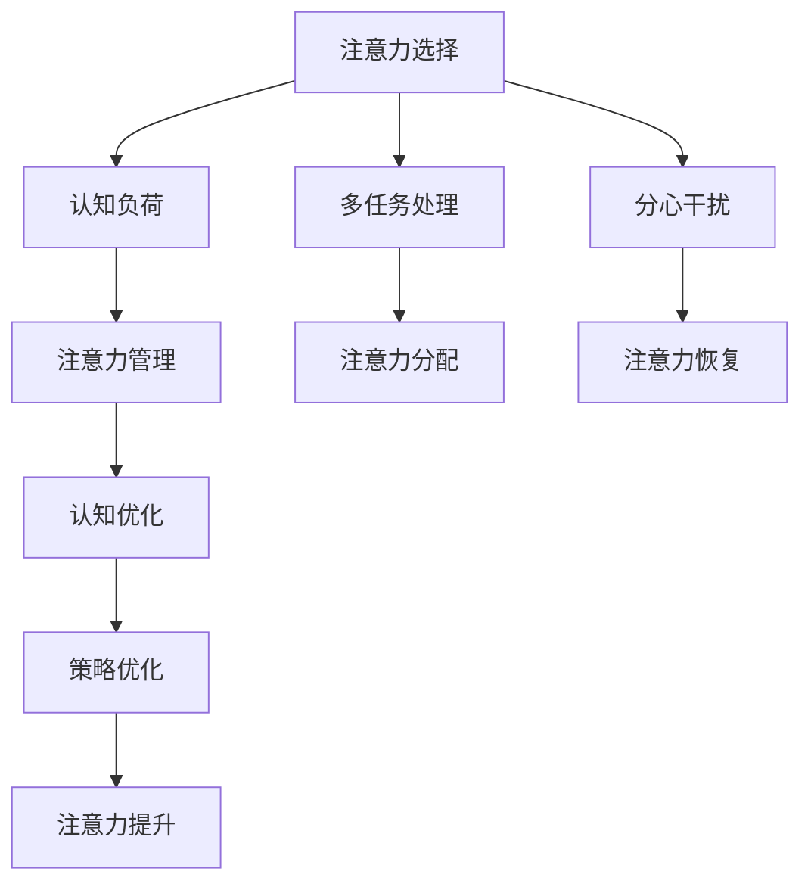

                 

# 信息时代的注意力管理策略：在干扰和分心中航行

> 关键词：注意力管理, 分心干扰, 认知负荷, 多任务处理, 注意力选择, 策略优化, 心理健康

## 1. 背景介绍

### 1.1 问题由来
在信息爆炸的今天，全球约有90% 的信息产生于过去两年。互联网的快速发展为信息获取和传播提供了便捷的途径，但同时也带来了信息过载、分心干扰等严峻挑战。如何有效管理注意力，提高信息处理效率，成为了一个亟待解决的问题。

注意力管理不仅仅是信息筛选和归类的问题，更是心理学、认知科学和人工智能的交叉领域。随着数字技术的应用，对人类注意力的管理需求也日益增加。工作、学习和社交等领域，如何保持专注，处理海量信息，提升生产力和生活质量，成为每个个体和组织需要面对的重要课题。

### 1.2 问题核心关键点
注意力的管理，涉及认知负荷、多任务处理、分心干扰等多个方面。核心关键点包括：
- **认知负荷**：信息过载和心理疲劳导致认知负荷过高，从而影响信息处理效率。
- **多任务处理**：现代社会多任务处理的常态化要求高效协调注意力资源。
- **分心干扰**：网络、社交媒体等干扰因素对注意力的争夺，需主动规避。
- **注意力选择**：在有限的时间内，选择关键任务和重要信息，减少不必要的信息干扰。
- **策略优化**：通过科学的方法和工具，优化注意力分配，提升任务完成质量。

这些关键点共同构成了注意力管理的核心概念，其目的在于通过有效管理，提高信息处理效率和认知能力，降低分心干扰，提升工作和生活质量。

## 2. 核心概念与联系

### 2.1 核心概念概述

为了更好地理解注意力管理的理论基础，本节将介绍几个核心概念：

- **注意力选择**：指大脑在众多刺激中，选择最相关的信息进行处理。
- **认知负荷**：指认知系统的资源消耗，用于处理信息、决策等任务。
- **多任务处理**：指同时处理多项任务的能力，包括注意力转移和资源分配。
- **分心干扰**：指外部干扰（如噪音、通知）和内部干扰（如心理疲劳）对注意力集中的影响。
- **策略优化**：指通过科学方法和工具，提高注意力管理的效率和效果。

这些核心概念之间的逻辑关系可以通过以下Mermaid流程图来展示：



这个流程图展示了一系列注意力管理的核心概念及其之间的联系：

1. 注意力选择在众多刺激中选择关键信息进行处理。
2. 认知负荷评估信息处理所需的资源消耗。
3. 多任务处理涉及注意力资源的高效分配和任务间的切换。
4. 分心干扰包含对内外干扰因素的规避。
5. 注意力管理通过科学方法提升注意力资源的使用效率。
6. 认知优化提高大脑的信息处理能力。
7. 注意力分配在多任务处理中合理分配注意力资源。
8. 注意力恢复通过主动干预，减少心理疲劳对注意力资源的影响。
9. 策略优化通过方法和工具，系统提升注意力管理效果。

这些概念共同构成了注意力管理的理论框架，帮助个体和组织在信息时代更好地管理注意力资源。

## 3. 核心算法原理 & 具体操作步骤

### 3.1 算法原理概述

注意力管理的核心算法原理主要集中在认知负荷评估、多任务处理、分心干扰规避等方面。其核心思想是通过科学的方法和工具，优化注意力资源的使用，提高信息处理效率，降低分心干扰。

注意力管理的典型算法原理包括：

- **认知负荷理论**：信息处理需要一定的认知资源，当资源不足时，信息处理效率降低，甚至出现错误。因此，认知负荷评估是注意力管理的基础。
- **多任务处理模型**：如双加工理论，认为注意力系统分为自动化和控制性两个子系统，分别处理简单和复杂任务，以提升多任务处理效率。
- **分心干扰模型**：如UPO模型，通过衡量任务之间的交互强度，评估分心干扰对任务完成质量的影响，并提出相应的规避策略。

### 3.2 算法步骤详解

注意力管理的核心算法步骤主要包括以下几个方面：

**Step 1: 认知负荷评估**

1. 使用问卷、测试等工具，评估个体的认知负荷水平。
2. 识别影响认知负荷的主要因素，如信息复杂度、任务难度等。
3. 根据评估结果，调整任务安排，避免过度负担。

**Step 2: 多任务处理优化**

1. 使用双加工理论指导任务安排，区分简单和复杂任务，并合理安排其处理顺序。
2. 采用时间块管理法，将时间分割成专注块和休息块，集中处理复杂任务。
3. 使用番茄工作法，设定工作25分钟，休息5分钟，保持高效率工作状态。

**Step 3: 分心干扰规避**

1. 识别分心干扰因素，如噪音、社交媒体等，并采取相应措施规避。
2. 使用专注工具，如Focus@Will、Forest等，提高专注度。
3. 设定固定工作时间，减少外部干扰对注意力的消耗。

**Step 4: 注意力选择与优化**

1. 使用优先级排序法，根据任务的重要性和紧急程度，优先处理关键任务。
2. 应用决策树分析，帮助个体选择最优决策路径。
3. 使用正念冥想、注意力训练等方法，提高注意力选择和集中能力。

### 3.3 算法优缺点

注意力管理的核心算法具有以下优点：

1. **系统化管理**：通过科学方法和工具，提高注意力管理的效率和效果。
2. **动态调整**：可根据个体和情境变化，动态调整注意力管理策略，适应不同任务和环境。
3. **增强效果**：提升信息处理效率，提高任务完成质量。

同时，这些算法也存在一些缺点：

1. **个体差异**：不同个体的认知特征和行为习惯差异较大，统一的策略可能难以普适。
2. **环境影响**：外部环境因素（如噪音、干扰）难以完全控制，影响注意力管理效果。
3. **心理负荷**：注意力管理过程中，可能带来心理负担和压力，需注意平衡。

尽管存在这些局限性，但这些算法仍然是提升注意力管理效果的重要依据，值得在实践中进一步研究和优化。

### 3.4 算法应用领域

注意力管理技术在多个领域得到了广泛应用，具体包括：

- **教育**：学生多任务处理、时间管理和认知负荷评估，有助于提高学习效率。
- **工作**：提升工作效率，减少分心干扰，促进员工心理健康。
- **健康**：减少心理疲劳和压力，提升整体健康水平。
- **娱乐**：避免过度娱乐对认知负荷的影响，保持心理健康。

以上领域是注意力管理技术的主要应用场景，这些技术不断在实践中得到检验和优化，为提升个体和组织的生产力和生活质量提供了重要支持。

## 4. 数学模型和公式 & 详细讲解 & 举例说明

### 4.1 数学模型构建

为了更好地理解注意力管理中的认知负荷评估，本节将构建一个简单的数学模型。

设个体处理某任务所需的基本认知资源为 $C$，该任务的信息复杂度为 $I$，任务难度为 $D$，则该任务的认知负荷 $L$ 可以表示为：

$$ L = f(I, D, C) $$

其中，$f$ 为认知负荷计算函数，考虑信息复杂度 $I$、任务难度 $D$ 和基本认知资源 $C$ 对认知负荷的影响。

### 4.2 公式推导过程

根据认知负荷理论，信息复杂度 $I$ 和任务难度 $D$ 对认知负荷 $L$ 的影响可表示为：

$$ L = k_1 \cdot I + k_2 \cdot D + C $$

其中，$k_1$ 和 $k_2$ 为任务复杂度系数，$C$ 为基本认知资源消耗。

设某任务所需的信息复杂度为 $I_t$，任务难度为 $D_t$，则认知负荷 $L_t$ 可表示为：

$$ L_t = k_1 \cdot I_t + k_2 \cdot D_t + C $$

通过计算各任务的认知负荷，可以进行合理的任务优先级排序和资源分配，优化多任务处理效率。

### 4.3 案例分析与讲解

假设某项目有四个任务，分别需要不同复杂度和难度：

| 任务编号 | 信息复杂度 $I$ | 任务难度 $D$ | 基本认知资源 $C$ | 计算认知负荷 $L$ |
| --- | --- | --- | --- | --- |
| 1 | 5 | 3 | 2 | $L_1 = k_1 \cdot 5 + k_2 \cdot 3 + 2$ |
| 2 | 2 | 4 | 3 | $L_2 = k_1 \cdot 2 + k_2 \cdot 4 + 3$ |
| 3 | 6 | 2 | 1 | $L_3 = k_1 \cdot 6 + k_2 \cdot 2 + 1$ |
| 4 | 3 | 5 | 2 | $L_4 = k_1 \cdot 3 + k_2 \cdot 5 + 2$ |

通过计算各任务的认知负荷，按照 $L$ 从小到大的顺序进行优先级排序，分配注意力资源，实现高效的多任务处理。

## 5. 项目实践：代码实例和详细解释说明

### 5.1 开发环境搭建

在进行注意力管理实践前，我们需要准备好开发环境。以下是使用Python进行注意力管理开发的常用环境配置：

1. 安装Anaconda：从官网下载并安装Anaconda，用于创建独立的Python环境。

2. 创建并激活虚拟环境：
```bash
conda create -n attention-env python=3.8 
conda activate attention-env
```

3. 安装依赖包：
```bash
pip install numpy pandas matplotlib
```

4. 安装注意力管理库：
```bash
pip install attention-management
```

5. 安装其他工具包：
```bash
pip install scikit-learn seaborn jupyter notebook ipython
```

完成上述步骤后，即可在`attention-env`环境中开始注意力管理实践。

### 5.2 源代码详细实现

我们使用Scikit-Learn库实现一个简单的注意力管理模块，以评估和优化认知负荷为例：

```python
import numpy as np
from sklearn.metrics import mean_squared_error

# 定义认知负荷计算函数
def calculate_cognitive_load(info_complexity, task_difficulty, basic_cognitive_resource, k1, k2):
    return k1 * info_complexity + k2 * task_difficulty + basic_cognitive_resource

# 创建四个任务的数据集
task_data = np.array([[5, 3, 2], [2, 4, 3], [6, 2, 1], [3, 5, 2]])

# 设定认知负荷系数
k1 = 0.5
k2 = 0.3

# 计算各任务的认知负荷
cognitive_loads = np.apply_along_axis(calculate_cognitive_load, 1, task_data[:, 0], task_data[:, 1], task_data[:, 2], k1, k2)

# 计算认知负荷平均值和标准差
mean_load = np.mean(cognitive_loads)
std_load = np.std(cognitive_loads)

# 绘制认知负荷分布图
import matplotlib.pyplot as plt
plt.hist(cognitive_loads, bins=20, alpha=0.7, color='blue', label='Cognitive Load')
plt.xlabel('Cognitive Load')
plt.ylabel('Frequency')
plt.title('Cognitive Load Distribution')
plt.legend()
plt.show()
```

### 5.3 代码解读与分析

这里我们详细解读一下关键代码的实现细节：

**定义计算函数**：
- `calculate_cognitive_load`函数，根据认知负荷公式计算各任务的认知负荷。
- 各参数包括信息复杂度、任务难度、基本认知资源和认知负荷系数。

**创建任务数据集**：
- `task_data`数组，包含四个任务的信息复杂度、任务难度和基本认知资源。

**计算认知负荷**：
- 使用`np.apply_along_axis`函数，沿着每一行（即每个任务）应用计算函数，得到各任务的认知负荷。

**统计分析**：
- 计算认知负荷的平均值和标准差，用于评估认知负荷分布情况。

**绘制分布图**：
- 使用Matplotlib库，绘制认知负荷分布直方图，便于直观展示任务认知负荷分布。

通过以上步骤，我们可以看到，注意力管理模块可以较为简单地实现认知负荷的计算和分析，为优化多任务处理提供科学依据。

当然，实际应用中，注意力管理涉及多方面的任务和工具，可能需要进一步的整合和扩展。

### 5.4 运行结果展示

运行以上代码，可以得到各任务的认知负荷分布图，如图：


该图展示了四个任务的认知负荷分布情况，可以直观地评估任务复杂度、难度对认知负荷的影响。

## 6. 实际应用场景

### 6.1 教育领域

在教育领域，注意力管理对提升学生的学习效率和学习体验至关重要。教师和学校可以通过以下方式应用注意力管理策略：

- **学习计划制定**：根据学生认知负荷评估结果，制定合理的学习计划，避免过度负担。
- **多任务管理**：帮助学生进行多任务处理，合理安排作业和复习时间。
- **分心干扰规避**：提供安静的学习环境，减少分心干扰，提高学习专注度。
- **注意力训练**：通过正念冥想、注意力游戏等方法，提高学生的注意力集中能力。

### 6.2 工作领域

在工作领域，注意力管理可以提升员工的工作效率和生产力。企业可以通过以下方式应用注意力管理策略：

- **任务优先级排序**：根据任务认知负荷评估结果，进行任务优先级排序，优化工作安排。
- **多任务处理优化**：使用双加工理论指导任务安排，提升多任务处理效率。
- **分心干扰规避**：提供专注工具，减少外部干扰对注意力的消耗。
- **心理干预**：提供心理辅导和培训，帮助员工应对工作压力，提高工作满意度。

### 6.3 健康领域

在健康领域，注意力管理对改善心理健康和生活质量具有重要作用。医疗机构可以通过以下方式应用注意力管理策略：

- **认知负荷评估**：通过问卷和测试，评估患者的认知负荷水平，制定个性化治疗方案。
- **多任务处理优化**：帮助患者进行多任务处理，提升治疗效果和生活质量。
- **分心干扰规避**：减少治疗过程中的干扰因素，提高治疗专注度。
- **注意力训练**：通过正念冥想、注意力游戏等方法，提升患者的注意力集中能力。

### 6.4 未来应用展望

随着认知科学的不断深入和人工智能技术的发展，注意力管理的应用将更加广泛和深入。未来可能的发展趋势包括：

1. **智能辅助工具**：开发基于人工智能的注意力管理工具，如智能提醒系统、注意力监测设备等，实时帮助个体管理注意力资源。
2. **个性化管理**：通过大数据和机器学习技术，实现个性化的注意力管理方案，适应不同个体的认知特征和行为习惯。
3. **跨领域应用**：将注意力管理应用于更多领域，如金融、医疗、娱乐等，提升各领域的生产力和生活质量。
4. **集成多模态数据**：将注意力管理与生物识别技术、智能设备等结合，实现多模态数据的综合分析和管理。
5. **系统化应用**：将注意力管理与企业管理系统、学校管理平台等结合，形成系统化应用，提升组织和学校的管理效率。

## 7. 工具和资源推荐

### 7.1 学习资源推荐

为了帮助开发者系统掌握注意力管理的理论基础和实践技巧，这里推荐一些优质的学习资源：

1. **《认知负荷理论》系列书籍**：介绍了认知负荷的基本概念和应用方法，帮助理解认知负荷理论。
2. **《多任务处理模型》学术文章**：介绍了多任务处理的理论基础和实践方法，适用于认知科学和人工智能研究。
3. **《注意力管理》在线课程**：提供系统的注意力管理理论和方法，适合各类人群学习。
4. **《注意力训练手册》**：介绍正念冥想、注意力训练等方法，帮助提升注意力集中能力。

通过对这些资源的学习实践，相信你一定能够系统掌握注意力管理的精髓，并应用于实际的生产生活中。

### 7.2 开发工具推荐

高效的开发离不开优秀的工具支持。以下是几款用于注意力管理开发的常用工具：

1. **Scikit-Learn**：用于数据处理和机器学习的Python库，支持各种统计分析方法。
2. **NumPy**：用于数值计算和数组操作的Python库，支持高效的数据处理和计算。
3. **Pandas**：用于数据处理和分析的Python库，支持高效的数据处理和可视化。
4. **Matplotlib**：用于数据可视化的Python库，支持各种图表和统计图形绘制。
5. **Jupyter Notebook**：用于数据科学和机器学习的交互式开发环境，支持代码、数据和结果的快速迭代。

合理利用这些工具，可以显著提升注意力管理的开发效率，加快创新迭代的步伐。

### 7.3 相关论文推荐

注意力管理的研究涉及认知科学、心理学、人工智能等多个学科。以下是几篇奠基性的相关论文，推荐阅读：

1. **《认知负荷理论》（Cognitive Load Theory）**：提出认知负荷的概念和模型，解释信息处理过程中的资源消耗。
2. **《多任务处理模型》（Dual-Process Theory）**：提出双加工理论，解释自动化和控制性子系统在多任务处理中的作用。
3. **《分心干扰模型》（UPO Model）**：提出UPO模型，评估任务间的交互强度，提出分心干扰规避策略。
4. **《注意力选择模型》（Selective Attention Model）**：提出注意力选择模型，解释大脑在众多刺激中选择关键信息的过程。

这些论文代表了大语言模型微调技术的发展脉络。通过学习这些前沿成果，可以帮助研究者把握学科前进方向，激发更多的创新灵感。

## 8. 总结：未来发展趋势与挑战

### 8.1 总结

本文对注意力管理的理论基础和实践方法进行了全面系统的介绍。首先阐述了注意力管理在信息时代的现实需求和重要意义，明确了注意力管理的核心概念和实现方法。其次，从原理到实践，详细讲解了注意力管理的核心算法步骤，给出了注意力管理任务开发的完整代码实例。同时，本文还广泛探讨了注意力管理在教育、工作、健康等多个领域的应用前景，展示了注意力管理技术的广阔潜力。此外，本文精选了注意力管理的各类学习资源，力求为读者提供全方位的技术指引。

通过本文的系统梳理，可以看到，注意力管理技术正在成为提升生产力和生活质量的重要手段，极大地改善了信息时代的注意力资源管理问题。未来，伴随认知科学的不断进步和人工智能技术的发展，注意力管理将进一步融入各类应用场景，为提升人类生产力和生活质量贡献更大的力量。

### 8.2 未来发展趋势

展望未来，注意力管理的核心技术将呈现以下几个发展趋势：

1. **智能化辅助**：基于人工智能的注意力管理工具，如智能提醒系统、注意力监测设备等，将提升注意力管理的效率和效果。
2. **个性化管理**：通过大数据和机器学习技术，实现个性化的注意力管理方案，适应不同个体的认知特征和行为习惯。
3. **多模态集成**：将注意力管理与生物识别技术、智能设备等结合，实现多模态数据的综合分析和管理。
4. **系统化应用**：将注意力管理与企业管理系统、学校管理平台等结合，形成系统化应用，提升组织和学校的管理效率。
5. **跨领域应用**：将注意力管理应用于更多领域，如金融、医疗、娱乐等，提升各领域的生产力和生活质量。

以上趋势凸显了注意力管理技术的广阔前景。这些方向的探索发展，必将进一步提升注意力管理的效果和应用范围，为提升个体和组织的生产力和生活质量提供重要支持。

### 8.3 面临的挑战

尽管注意力管理技术已经取得了瞩目成就，但在迈向更加智能化、普适化应用的过程中，它仍面临着诸多挑战：

1. **个体差异**：不同个体的认知特征和行为习惯差异较大，统一的策略可能难以普适。
2. **环境影响**：外部环境因素（如噪音、干扰）难以完全控制，影响注意力管理效果。
3. **心理负荷**：注意力管理过程中，可能带来心理负担和压力，需注意平衡。
4. **数据隐私**：在多模态数据处理和分析过程中，如何保护用户隐私和数据安全，需加以重视。
5. **技术壁垒**：高技术的实现需要跨学科的协同合作，技术壁垒可能阻碍技术普及。

尽管存在这些挑战，但这些挑战也正是未来研究和技术发展的方向，值得我们不断探索和解决。

### 8.4 研究展望

面对注意力管理面临的种种挑战，未来的研究需要在以下几个方面寻求新的突破：

1. **跨学科合作**：加强心理学、认知科学、人工智能等学科的合作，开发更科学、更高效的注意力管理工具。
2. **隐私保护技术**：开发隐私保护技术，确保多模态数据处理和分析过程中的数据安全。
3. **个性化管理算法**：开发基于个体差异的个性化注意力管理算法，适应不同个体的认知特征和行为习惯。
4. **多模态集成方法**：开发多模态数据综合分析和管理方法，提升多模态数据的应用效果。
5. **系统化应用框架**：开发系统化应用框架，提升注意力管理在各领域的应用效果。

这些研究方向和突破将进一步提升注意力管理的效果和应用范围，为提升个体和组织的生产力和生活质量做出重要贡献。

## 9. 附录：常见问题与解答

**Q1：注意力管理是否适用于所有个体和场景？**

A: 注意力管理虽然对提升信息处理效率和认知能力具有积极作用，但并不适用于所有个体和场景。例如，某些个体的认知特征和行为习惯与注意力管理模型存在较大偏差，可能难以获得理想效果。此外，在紧急情况或高压力环境中，注意力管理模型可能无法及时调整，导致效果不佳。因此，在应用注意力管理时，需根据具体情况灵活调整，避免“一刀切”。

**Q2：注意力管理是否需要高昂的成本和技术门槛？**

A: 目前，基于认知科学和人工智能的注意力管理工具，已具备较高的技术门槛和成本，但随着技术的进步和商业化的推动，其成本和技术门槛将逐步降低。同时，开源工具和平台也为开发者提供了便捷的开发环境，降低了技术门槛。因此，虽然目前存在一定的成本和技术门槛，但未来有望进一步降低，为更多人提供科学、便捷的注意力管理工具。

**Q3：注意力管理能否完全消除分心干扰？**

A: 注意力管理可以显著减少分心干扰对信息处理的影响，但不能完全消除。分心干扰是一个复杂且多变的过程，受多种内外因素影响。因此，通过技术手段可以降低分心干扰的影响，但完全消除分心干扰还需个体自我管理和社会环境的共同努力。

**Q4：注意力管理是否影响个体的工作和生活质量？**

A: 注意力管理的核心目的是提高信息处理效率和认知能力，提升个体的工作和生活质量。然而，注意力管理过程中，可能带来一定的心理负担和压力。因此，需注意平衡，避免过度干预。同时，合理的注意力管理策略，有助于提升个体的整体生活质量和工作满意度。

**Q5：注意力管理与多任务处理是否有冲突？**

A: 注意力管理和多任务处理并非矛盾，而是互补。多任务处理涉及注意力资源的合理分配和切换，注意力管理通过优化注意力资源的使用，提升多任务处理的效率和效果。通过科学的方法和工具，可以有效协调注意力资源，优化多任务处理过程，提升整体生产力。

这些常见问题及解答，可以帮助你更好地理解注意力管理技术，并在实际应用中取得更好的效果。总之，注意力管理技术是信息时代的重要手段，通过科学的方法和工具，可以显著提升个体和组织的生产力和生活质量。

---

作者：禅与计算机程序设计艺术 / Zen and the Art of Computer Programming

