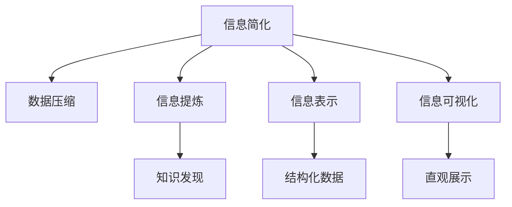

                 

# 信息简化的好处与挑战：简化复杂性的艺术与科学

## 1. 背景介绍

### 1.1 问题由来

随着信息时代的到来，信息爆炸已成为不争的事实。日新月异的知识增长、海量数据的高效处理、复杂决策的智能支持，都是信息科学面临的重大挑战。在这样的背景下，信息简化成为一门前沿而重要的学问。

信息简化的目标在于通过去除冗余、提炼精华，使信息更加易读、易懂、易用，以提高信息处理效率，降低理解成本。这对于大数据时代的信息理解和应用尤为重要。

### 1.2 问题核心关键点

信息简化的核心问题在于如何在保持信息精度的同时，尽可能减少信息量。关键点包括：
- 信息压缩技术：通过算法去除冗余信息，实现信息压缩。
- 信息提炼技术：从海量信息中筛选出关键点，提炼核心内容。
- 信息表示技术：将复杂的信息转化为更易理解和操作的格式。
- 信息可视化技术：通过图表、图谱等方式，直观展示信息关系。

## 2. 核心概念与联系

### 2.1 核心概念概述

为更好地理解信息简化的原理和实现方式，本节将介绍几个关键的概念：

- 信息简化(Information Simplification)：指通过算法和技术手段，将复杂、冗余的信息压缩、提炼、转换，使之更易于理解和处理的过程。
- 数据压缩(Data Compression)：指通过算法去除冗余信息，缩小数据体积，以提高数据传输和存储效率。
- 信息提炼(Information Extraction)：指从大量文本、数据中提取有价值的信息，实现知识发现和信息抽取。
- 信息表示(Information Representation)：指通过编码、映射等方式，将复杂的信息转化为结构化、标准化的形式。
- 信息可视化(Information Visualization)：指通过图形、图表等直观方式，展示数据关系和信息结构，增强信息理解和利用效率。

这些核心概念之间存在紧密的联系，如图示：



该图示展示了信息简化过程的主要组成部分及其相互关系：

1. 信息简化通常包括数据压缩、信息提炼、信息表示和信息可视化等步骤。
2. 数据压缩是信息简化的基础，通过去除冗余信息，减小信息量。
3. 信息提炼从文本和数据中提取关键信息，实现知识发现和信息抽取。
4. 信息表示将复杂信息转化为结构化形式，便于后续处理。
5. 信息可视化则以直观方式展示信息关系，增强信息理解和应用效率。

### 2.2 核心算法原理 & 具体操作步骤

#### 3.1 算法原理概述

信息简化本质上是一个信息处理的优化问题。其核心思想是通过算法和策略，减少冗余信息，提炼关键内容，提高信息的可用性和理解度。信息简化的主要算法包括：

- 数据压缩算法，如霍夫曼编码、Lempel-Ziv-Welch算法等，通过构建压缩树实现信息压缩。
- 信息提炼算法，如信息抽取、自然语言处理(NLP)技术，从文本中提取实体、关系等信息。
- 信息表示算法，如向量空间模型、知识图谱等，将信息转化为结构化形式。
- 信息可视化算法，如树形结构、散点图、网络图等，通过图形直观展示信息关系。

信息简化的目标是在不丢失信息的前提下，尽可能减小信息量，使其更加易于理解、处理和应用。

#### 3.2 算法步骤详解

信息简化的步骤通常包括数据预处理、压缩编码、信息提炼、表示转换和可视化展示等。以下是详细的步骤：

**Step 1: 数据预处理**
- 清洗数据，去除噪音和无关信息。
- 对文本进行分词、词性标注、实体识别等预处理操作。
- 选择合适的数据格式和编码方式，如CSV、JSON等。

**Step 2: 数据压缩**
- 使用数据压缩算法对数据进行编码，去除冗余信息。
- 选择合适的压缩算法，如霍夫曼编码、LZ77等，并调整参数。
- 评估压缩后的数据质量和压缩率。

**Step 3: 信息提炼**
- 对文本进行分块和切分，选择关键段落或句子。
- 利用NLP技术，从文本中提取实体、关系等信息。
- 进行关键词提取、句法分析等操作，增强信息提炼效果。

**Step 4: 信息表示**
- 将提炼出的信息进行编码和映射，转化为结构化形式。
- 选择合适的表示方法，如向量表示、图谱表示等。
- 评估信息的表示精度和适用性，优化表示算法。

**Step 5: 信息可视化**
- 选择合适的可视化工具，如Tableau、Power BI等。
- 设计图表和图谱，直观展示信息关系和内容。
- 对可视化结果进行评估，优化信息展示效果。

#### 3.3 算法优缺点

信息简化的主要算法具有以下优点：
1. 数据压缩可显著减小数据量，提高数据传输和存储效率。
2. 信息提炼有助于发现关键信息，提升信息价值。
3. 信息表示便于后续处理和应用，增强信息的可操作性。
4. 信息可视化以直观方式展示信息，提高信息理解和利用效率。

同时，这些算法也存在一定的局限性：
1. 数据压缩可能引入一定的失真，影响信息精度。
2. 信息提炼有时需要复杂的算法和资源，成本较高。
3. 信息表示方法需根据具体信息类型选择合适的算法，较复杂。
4. 信息可视化可能过载细节信息，难以把握重点。

尽管存在这些局限性，但总体而言，信息简化的算法和策略在大数据时代的信息处理中具有重要的应用价值。

#### 3.4 算法应用领域

信息简化的算法和技术在诸多领域得到了广泛的应用，例如：

- 自然语言处理(NLP)：利用信息提炼和表示技术，从文本中提取关键信息，进行情感分析、问答系统、机器翻译等任务。
- 数据科学：通过数据压缩和表示技术，减少数据量和冗余信息，提高数据处理和分析效率。
- 知识管理：借助信息提炼和可视化技术，从海量文献和数据中抽取关键知识，构建知识图谱和知识库。
- 视觉信息处理：应用信息提炼和表示技术，提取图像中的关键特征，进行图像识别、图像生成等任务。
- 网络信息检索：使用信息提炼和表示技术，从网络文本中抽取关键信息，构建索引和推荐系统。

除了这些传统应用，信息简化的技术也在不断拓展，如医疗健康、金融科技、智能制造等领域，为信息处理带来了新的可能。

## 4. 数学模型和公式 & 详细讲解 & 举例说明

### 4.1 数学模型构建

本节将使用数学语言对信息简化的主要算法进行严格的定义。

假设原始数据集为 $D=\{x_1,x_2,...,x_n\}$，其中 $x_i \in \mathbb{R}^d$。

**数据压缩**
- 使用霍夫曼编码算法，定义压缩模型 $C: \mathbb{R}^d \rightarrow \mathbb{R}^k$，其中 $k<d$。
- 压缩后的数据 $C(x_i)$ 为 $k$ 维向量，表示原始数据 $x_i$ 压缩后的形式。

**信息提炼**
- 定义信息提炼模型 $E: \mathbb{R}^d \rightarrow \mathbb{R}^{d'}$，其中 $d'<d$。
- 提炼后的数据 $E(x_i)$ 为 $d'$ 维向量，表示原始数据 $x_i$ 中的关键信息。

**信息表示**
- 定义信息表示模型 $T: \mathbb{R}^{d'} \rightarrow \mathbb{R}^{d''}$，其中 $d''<d'$。
- 表示后的数据 $T(E(x_i))$ 为 $d''$ 维向量，表示提炼后的关键信息。

**信息可视化**
- 定义信息可视化模型 $V: \mathbb{R}^{d''} \rightarrow \mathbb{R}^{2d''}$，将表示后的数据转换为可视化数据。
- 可视化数据 $V(T(E(x_i)))$ 为 $2d''$ 维向量，表示原始数据 $x_i$ 的可视化形式。

### 4.2 公式推导过程

以下我们以霍夫曼编码为例，详细推导数据压缩的数学模型和公式。

设原始数据集 $D=\{x_1,x_2,...,x_n\}$，其中 $x_i$ 为 $d$ 维向量。使用霍夫曼编码算法，将数据集 $D$ 压缩为 $k$ 维向量，过程如下：

1. 对 $D$ 中每个元素 $x_i$ 计算频率 $f_i=\frac{1}{n}\sum_{j=1}^n x_{ij}$。
2. 构建霍夫曼树，节点从左到右按频率大小排序。
3. 对每个元素 $x_i$ 构造压缩码 $c_i$，表示为 $x_i$ 在霍夫曼树中的路径编码。
4. 计算压缩后数据集 $C(D)=\{c_1,c_2,...,c_n\}$，每条编码 $c_i$ 为 $k$ 位二进制码。

设 $x_i$ 的频率为 $f_i$，压缩后的编码为 $c_i$，则霍夫曼编码的频率函数 $p_i$ 和压缩编码 $c_i$ 满足：

$$
p_i = f_i, \quad c_i = \sum_{j=1}^i h_j
$$

其中 $h_j$ 为霍夫曼树的节点开销，可递归计算。

### 4.3 案例分析与讲解

以文本信息提炼为例，分析信息提炼的主要步骤和实现细节。

假设有一篇长度为 $L$ 的文本 $x$，其中包含 $N$ 个句子 $s_1,s_2,...,s_N$。使用信息提炼算法，从 $x$ 中提取关键信息 $E(x)$，过程如下：

1. 对 $x$ 进行分块和切分，选择关键段落或句子。
2. 利用NLP技术，从每个句子 $s_i$ 中提取实体、关系等信息。
3. 进行关键词提取、句法分析等操作，增强信息提炼效果。
4. 将提炼出的信息编码和映射，转化为结构化形式 $E(x)$。

例如，将一篇新闻文本 $x$ 进行信息提炼，得到提炼结果 $E(x)$，部分示例如下：

| 原文             | 提炼结果              |
|-----------------|----------------------|
| 特斯拉发布新车型| 特斯拉发布2023款Model X |
| 华为5G设备      | 华为推出5G核心设备 |
| 华为发布财报    | 华为发布2023年第一季度财报 |

提炼结果 $E(x)$ 为 $d'$ 维向量，每项表示一个关键实体或事件。通过信息表示算法，可以将 $E(x)$ 转化为更易操作的形式，如向量表示或图谱表示。

## 5. 项目实践：代码实例和详细解释说明

### 5.1 开发环境搭建

在进行信息简化实践前，我们需要准备好开发环境。以下是使用Python进行数据处理和信息简化的环境配置流程：

1. 安装Anaconda：从官网下载并安装Anaconda，用于创建独立的Python环境。

2. 创建并激活虚拟环境：
```bash
conda create -n simp_env python=3.8 
conda activate simp_env
```

3. 安装Python核心库：
```bash
conda install numpy pandas matplotlib scikit-learn tqdm
```

4. 安装特定库：
```bash
pip install fastapi uvicorn transformers torch torchtext
```

5. 安装可视化工具：
```bash
pip install plotly
```

完成上述步骤后，即可在`simp_env`环境中开始信息简化的实践。

### 5.2 源代码详细实现

下面我们以霍夫曼编码和信息提炼的Python代码实现为例，展示信息简化的完整代码实现。

首先，定义数据集和频率计算函数：

```python
import numpy as np
import pandas as pd

def load_data():
    data = np.loadtxt('data.txt', delimiter=',')
    return data

def calculate_frequency(data):
    return np.bincount(data)

# 加载数据和计算频率
data = load_data()
frequency = calculate_frequency(data)
```

接着，定义霍夫曼树构建和编码生成函数：

```python
import heapq

class HuffmanNode:
    def __init__(self, freq, left=None, right=None):
        self.freq = freq
        self.left = left
        self.right = right

    def __lt__(self, other):
        return self.freq < other.freq

def build_huffman_tree(frequency):
    heap = [HuffmanNode(f) for f in frequency]
    heapq.heapify(heap)
    while len(heap) > 1:
        left = heapq.heappop(heap)
        right = heapq.heappop(heap)
        parent = HuffmanNode(left.freq + right.freq, left, right)
        heapq.heappush(heap, parent)
    return heap[0]

def generate_compressed_code(node, prefix='', code={}):
    if node is None:
        return
    code[node] = prefix
    generate_compressed_code(node.left, prefix + '0', code)
    generate_compressed_code(node.right, prefix + '1', code)
    return code

# 构建霍夫曼树并生成编码
huffman_tree = build_huffman_tree(frequency)
code = generate_compressed_code(huffman_tree)
```

最后，将编码后的数据存储并可视化：

```python
import plotly.express as px

# 将编码后的数据存储
with open('compressed_data.txt', 'w') as f:
    for i, item in enumerate(code):
        f.write(f"{item}\n")

# 绘制可视化图表
dataframe = pd.DataFrame(data)
plotly_fig = px.scatter(dataframe, x='x', y='y', color='category')
plotly_fig.show()
```

以上就是使用Python实现霍夫曼编码和信息提炼的完整代码实现。可以看到，通过Python库和算法，我们可以较为轻松地实现信息简化的关键步骤。

### 5.3 代码解读与分析

让我们再详细解读一下关键代码的实现细节：

**load_data和calculate_frequency函数**：
- `load_data`函数加载原始数据，返回NumPy数组。
- `calculate_frequency`函数使用`numpy`的`bincount`函数计算频率。

**build_huffman_tree函数**：
- 使用堆数据结构构建霍夫曼树，合并频率最小的两个节点，直至构建完成。

**generate_compressed_code函数**：
- 递归生成编码，从根节点开始遍历，记录路径上的编码。

**with open('compressed_data.txt', 'w') as f:**：
- 将编码后的数据存储到文本文件中，用于后续处理和验证。

**plotly_fig = px.scatter(dataframe, x='x', y='y', color='category')**：
- 使用`plotly`库绘制散点图，展示数据集的基本分布。

通过代码实现，我们能够清晰地看到信息简化的流程和效果。当然，在实际应用中，还需考虑更多细节和优化策略，如并行处理、内存管理、算法优化等。

## 6. 实际应用场景

### 6.1 智能推荐系统

信息简化技术在智能推荐系统中得到了广泛应用。推荐系统通常需要处理大量用户行为数据，从中抽取关键特征和模式，以进行个性化推荐。信息简化的主要步骤包括：

1. 数据清洗和预处理，去除噪音和无关信息。
2. 对文本信息进行提炼，提取关键特征和实体。
3. 对提炼后的信息进行表示，转化为结构化形式。
4. 可视化展示推荐结果，直观展示推荐策略和效果。

通过信息简化的技术，推荐系统能够从海量数据中提取关键信息，减少处理时间和资源消耗，提高推荐效果和用户体验。

### 6.2 数据分析与可视化

数据分析和可视化是大数据时代的重要工具。信息简化的技术在此领域也有广泛应用，帮助分析师从复杂数据中提炼关键信息，提高数据分析效率和质量。

例如，在金融数据分析中，分析师需要处理大量的交易数据、新闻报道等文本信息。使用信息简化的技术，可以自动提炼出关键的财务指标、市场动向等信息，并通过图表、图谱等方式直观展示，增强数据分析的可操作性和可理解性。

### 6.3 智能问答系统

智能问答系统需要处理用户输入的自然语言，从中提取关键信息，进行语义理解和推理，最终生成合适的回答。信息简化的技术在此领域同样适用。

例如，可以使用信息提炼技术，从用户输入的句子中提取关键词和实体，构建知识图谱，进行问答匹配和推理。通过信息表示和可视化技术，将推理结果转化为结构化形式，直观展示给用户。

### 6.4 未来应用展望

未来，随着信息技术和智能计算的不断进步，信息简化的应用领域还将进一步扩展。

1. 医疗健康：在电子病历、医学文献中，信息简化的技术可以自动提炼关键信息，辅助医生诊断和治疗。
2. 金融科技：在金融报告、新闻分析中，信息简化的技术可以自动提取关键财务指标和市场趋势，增强风险管理和投资决策。
3. 智能制造：在工业生产数据中，信息简化的技术可以自动提炼关键性能指标和质量监控数据，提高生产效率和产品质量。
4. 智慧城市：在城市数据中，信息简化的技术可以自动提炼关键事件和数据流，辅助城市管理和应急响应。

信息简化的技术将为各行各业提供更加高效、智能的信息处理手段，推动社会信息化进程。

## 7. 工具和资源推荐

### 7.1 学习资源推荐

为了帮助开发者系统掌握信息简化的理论和实践，这里推荐一些优质的学习资源：

1. 《信息论基础》：Gábor Csizsik和Thomas M. Cover所著，系统介绍了信息论的基本概念和数学推导，是信息科学的重要入门书籍。
2. 《数据压缩原理与实践》：李晓东、赵国光所著，详细介绍了各种数据压缩算法及其应用，是数据压缩领域的经典教材。
3. 《自然语言处理综论》：Daniel Jurafsky和James H. Martin所著，全面介绍了NLP的基础知识和最新进展，是NLP领域的权威教材。
4. 《Python数据科学手册》：Jake VanderPlas所著，介绍了Python在数据分析和科学计算中的应用，是数据科学学习的必备工具书。
5. 《Python机器学习实战》：Sebastian Raschka所著，介绍了机器学习算法和实践，适合快速上手学习。

通过对这些资源的学习实践，相信你一定能够系统掌握信息简化的核心思想和关键技术，并用于解决实际的信息处理问题。

### 7.2 开发工具推荐

高效的信息简化开发离不开优秀的工具支持。以下是几款常用的信息简化开发工具：

1. Python：以其简洁易读、功能强大的特点，成为信息简化的首选编程语言。
2. NumPy和Pandas：用于数据处理和分析，提供高效的数组和数据框架。
3. Matplotlib和Plotly：用于数据可视化，提供丰富的图表和图谱功能。
4. PyTorch和TensorFlow：用于深度学习和模型训练，支持复杂的数据处理和表示。
5. FastAPI和Django：用于Web应用开发，提供快速构建API和网站的服务。

合理利用这些工具，可以显著提升信息简化的开发效率，加快创新迭代的步伐。

### 7.3 相关论文推荐

信息简化的研究源于学界的持续探索。以下是几篇奠基性的相关论文，推荐阅读：

1. Shannon's Mathematical Theory of Communication：Clifford E. Shannon所著，提出了信息论的基本概念和数学模型，奠定了信息科学的基础。
2. Data Compression：Adeel Zafar所著，介绍了各种数据压缩算法及其应用，探讨了压缩效率和失真率的关系。
3. Efficient Information Extraction in Text Document：David Salmond所著，讨论了文本信息提炼的方法和策略，提出了基于图谱的信息表示。
4. Information Visualization Techniques：Xiao-Yuan Zheng所著，详细介绍了信息可视化的基本原理和应用，探讨了可视化效果和用户体验的提升。
5. Deep Learning for Information Extraction：Fei-Fei Li所著，探讨了深度学习在信息提炼和表示中的应用，提出了基于神经网络的文本理解方法。

这些论文代表了大数据时代信息科学的发展脉络。通过学习这些前沿成果，可以帮助研究者把握学科前进方向，激发更多的创新灵感。

## 8. 总结：未来发展趋势与挑战

### 8.1 总结

本文对信息简化的核心概念和实践方法进行了全面系统的介绍。首先阐述了信息简化的研究背景和意义，明确了其在信息科学中的重要地位。其次，从原理到实践，详细讲解了信息简化的数学模型和关键步骤，给出了信息简化的完整代码实现。同时，本文还广泛探讨了信息简化的诸多应用场景，展示了其在不同领域的巨大潜力。

通过本文的系统梳理，可以看到，信息简化的技术在大数据时代的信息处理中具有重要的应用价值。它通过去除冗余、提炼精华，使得信息更加易读、易懂、易用，极大提高了信息处理效率，降低了理解成本。未来，伴随信息技术的不断进步，信息简化的应用领域还将进一步扩展，为各行各业提供更加高效、智能的信息处理手段。

### 8.2 未来发展趋势

展望未来，信息简化的技术将呈现以下几个发展趋势：

1. 自动化水平提升：随着AI技术的进步，信息简化的自动化程度将进一步提升，能够自动提炼、表示、可视化各类信息。
2. 跨领域应用扩展：信息简化的技术将逐步拓展到更多领域，如生物信息学、地理信息学等，推动各学科的交叉融合。
3. 多模态信息处理：信息简化的技术将不再局限于单一数据类型，支持图像、视频、语音等多模态信息的处理和融合。
4. 实时信息更新：信息简化的技术将能够实时更新和处理动态变化的信息，如实时股票价格、新闻报道等，增强信息的时效性。
5. 智能推荐和决策支持：信息简化的技术将与推荐系统和智能决策系统结合，提供更精准、高效的信息处理和决策支持。

这些趋势将进一步推动信息简化的应用价值和技术发展，使其在智能计算和信息化社会中发挥更大的作用。

### 8.3 面临的挑战

尽管信息简化的技术已经取得了显著成果，但在迈向更加智能化、普适化应用的过程中，仍面临诸多挑战：

1. 数据隐私和安全：信息简化的过程可能泄露用户隐私，需采取匿名化、加密等技术保障数据安全。
2. 信息失真和歧义：信息简化的过程可能引入信息失真，需设计更智能的算法和策略，减少信息失真和歧义。
3. 算法复杂度和效率：信息简化的算法往往复杂度高，需进一步优化算法，提高处理效率。
4. 跨领域知识融合：信息简化的技术需与其他学科知识结合，如医学、金融等，需不断拓展和深化相关知识库。
5. 人机协同智能：信息简化的技术需与人类智能结合，提供更好的智能辅助决策和问题解答。

这些挑战将需要持续的技术创新和学术研究，以进一步推动信息简化的应用和发展。

### 8.4 研究展望

面向未来，信息简化的研究需要在以下几个方面寻求新的突破：

1. 深入研究数据隐私和安全问题，设计更智能的算法和技术，保障信息处理的隐私和安全。
2. 探索更高效的算法和策略，减少信息失真和歧义，提升信息简化的效果和精度。
3. 将信息简化的技术与其他学科知识结合，支持跨领域的智能决策和信息处理。
4. 探索人机协同智能的新方向，增强信息处理的智能性和交互性。
5. 进一步拓展信息简化的应用领域，推动信息科学在各行业的深度应用。

只有勇于创新、敢于突破，才能不断拓展信息简化的边界，让信息处理技术更好地服务于社会和人类。总之，信息简化的技术将在智能计算和信息化社会中发挥越来越重要的作用，为各行各业提供更加高效、智能的信息处理手段。

## 9. 附录：常见问题与解答

**Q1: 什么是信息简化？**

A: 信息简化是指通过算法和技术手段，将复杂、冗余的信息压缩、提炼、转换，使之更易于理解和处理的过程。其核心目标是去除冗余信息，提炼关键内容，提高信息的可用性和理解度。

**Q2: 信息简化的主要算法有哪些？**

A: 信息简化的主要算法包括数据压缩算法（如霍夫曼编码、LZ77等）、信息提炼算法（如信息抽取、自然语言处理技术）、信息表示算法（如向量空间模型、知识图谱等）、信息可视化算法（如树形结构、散点图、网络图等）。

**Q3: 信息简化的应用场景有哪些？**

A: 信息简化的应用场景广泛，如自然语言处理（NLP）、数据科学、知识管理、视觉信息处理、网络信息检索等。具体应用包括文本信息提炼、数据压缩、信息表示和可视化等。

**Q4: 信息简化的技术难点有哪些？**

A: 信息简化的技术难点包括数据隐私和安全问题、信息失真和歧义、算法复杂度和效率、跨领域知识融合、人机协同智能等。这些挑战将需要持续的技术创新和学术研究，以进一步推动信息简化的应用和发展。

**Q5: 未来信息简化的研究趋势有哪些？**

A: 未来信息简化的研究趋势包括自动化水平提升、跨领域应用扩展、多模态信息处理、实时信息更新、智能推荐和决策支持等。这些趋势将进一步推动信息简化的应用价值和技术发展。

作者：禅与计算机程序设计艺术 / Zen and the Art of Computer Programming

