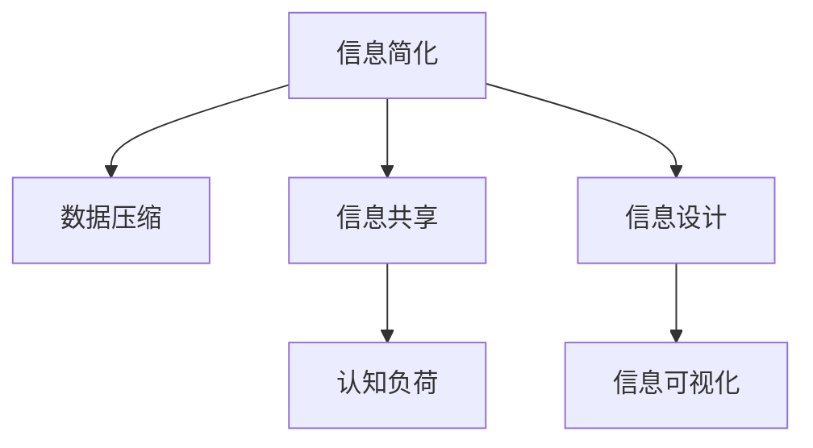

                 

# 信息简化的好处与艺术：如何在复杂世界中简化和改善生活

> 关键词：信息简化,复杂性,数据压缩,信息共享,认知负荷,信息设计,信息可视

## 1. 背景介绍

### 1.1 问题由来

在信息爆炸的时代，我们面临着前所未有的信息洪流。从新闻、社交媒体、电子邮件到各种应用通知，信息无处不在，同时也带来了信息过载的困扰。过量的信息不仅占据了我们的时间和注意力，还使得我们难以快速提取所需信息，做出明智决策。这种信息的泛滥和复杂性，对我们的生活和工作造成了巨大的挑战。

### 1.2 问题核心关键点

本文将探讨如何在复杂世界中通过信息简化，提高信息处理的效率，改善生活和工作质量。我们将从以下几个方面展开：

- 信息简化的好处和原则。
- 信息简化在数据压缩和共享中的应用。
- 信息简化的技术手段和工具。
- 信息简化在信息设计、可视和交互中的应用。
- 信息简化的未来发展趋势和挑战。

通过理解信息简化的核心概念和实施方法，我们可以更好地管理信息洪流，提升信息处理效率，减少认知负荷，从而改善我们的生活和工作体验。

## 2. 核心概念与联系

### 2.1 核心概念概述

为更好地理解信息简化的原理和应用，本节将介绍几个核心概念：

- **信息简化**：指将复杂的信息转化为简洁、易于理解和处理的形式，以提高信息处理效率和质量。
- **数据压缩**：通过算法去除冗余信息，使数据更紧凑、更易于存储和传输。
- **信息共享**：在网络环境下，将信息高效、准确地传达给需要的人。
- **认知负荷**：指个体在处理信息时所需投入的脑力和精力。
- **信息设计**：设计信息的形式和结构，使其更符合人的认知模式和心理需求。
- **信息可视化**：通过图形、图表等视觉手段，使复杂数据和信息更直观、更易理解。

这些概念之间存在紧密的联系，共同构成了信息简化的基础框架。

### 2.2 核心概念原理和架构的 Mermaid 流程图



这个流程图展示了信息简化的核心概念和它们之间的联系：

1. **信息简化**通过数据压缩和信息共享，使得复杂信息更易理解。
2. **数据压缩**去除冗余信息，提高信息存储和传输效率。
3. **信息共享**确保信息能准确传达给目标受众。
4. **认知负荷**的减少依赖于有效的信息设计和可视化。

## 3. 核心算法原理 & 具体操作步骤

### 3.1 算法原理概述

信息简化的核心算法原理主要围绕以下几个方面展开：

- **数据压缩算法**：如霍夫曼编码、LZ77、LZW等。
- **信息设计原则**：如KISS原则、Togglify、Hierarchal等。
- **信息可视化技术**：如信息架构、色彩编码、数据可视化库如D3.js、Chart.js等。

### 3.2 算法步骤详解

1. **数据预处理**：
   - 收集和整理数据，清洗无用信息。
   - 识别重复、无关或冗余的数据。

2. **选择数据压缩算法**：
   - 根据数据类型和存储要求选择合适的压缩算法。
   - 对数据进行压缩，生成压缩包。

3. **设计信息结构**：
   - 确定信息的优先级和组织结构。
   - 采用信息设计原则，使信息更易于理解和操作。

4. **实现信息可视化**：
   - 选择合适的可视化工具和技术。
   - 将数据和信息转化为图形、图表等形式。

5. **测试和优化**：
   - 对简化后的信息进行测试，收集反馈。
   - 根据反馈进行迭代优化，提升信息处理效率。

### 3.3 算法优缺点

信息简化的算法具有以下优点：

- 提高信息处理效率，减少认知负荷。
- 便于信息共享和交流，降低误传风险。
- 有助于更准确地传递信息，提升决策质量。

但同时，信息简化也存在以下局限：

- 过于简化可能导致信息丢失，影响决策准确性。
- 设计和实现复杂，需要专业知识和工具。
- 依赖于用户和环境，简化效果可能因人而异。

### 3.4 算法应用领域

信息简化技术在多个领域都有广泛应用：

- **医学信息**：简化医学数据，便于医生和患者理解。
- **商业情报**：压缩和组织大量商业数据，提升决策速度。
- **教育培训**：简化教学内容，使学习更高效、更有趣。
- **产品设计**：优化产品界面和说明，提高用户体验。
- **数据科学**：压缩和可视数据集，便于数据分析和展示。

## 4. 数学模型和公式 & 详细讲解 & 举例说明

### 4.1 数学模型构建

在信息简化的过程中，数学模型可以辅助我们进行复杂数据的压缩和信息的设计。

设原始数据集为 $D$，信息简化的目标是将 $D$ 压缩到 $D'$，同时保持信息相似性。数学上，可以表示为：

$$
D' = f(D)
$$

其中 $f$ 表示信息压缩函数，可以是任何能够将复杂信息压缩为简洁形式的技术。

### 4.2 公式推导过程

以霍夫曼编码（Huffman Coding）为例，其基本原理是通过构建二叉树，将字符编码成变长编码，以减少整体编码长度。假设有 $n$ 个字符 $C_1, C_2, ..., C_n$，它们的出现频率分别为 $f_1, f_2, ..., f_n$，则其霍夫曼编码的推导过程如下：

1. 构建霍夫曼树，根节点的权值为 $f_1 + f_2 + ... + f_n$。
2. 对霍夫曼树进行编码，叶节点对应字符编码，根节点到叶节点的路径编码对应为该路径上所有节点的权值之和。
3. 对所有字符的编码进行整理，得到字符到编码的映射。

### 4.3 案例分析与讲解

以医学报告的压缩为例，原始报告可能包含大量专业术语和图表，通过霍夫曼编码可以将关键信息提取并简化，如关键疾病、治疗方案等。

- 第一步，提取关键信息，如诊断结果、治疗建议等。
- 第二步，使用霍夫曼编码将关键信息压缩，生成压缩后的报告。
- 第三步，将压缩后的报告传达给医生和患者，便于理解和决策。

## 5. 项目实践：代码实例和详细解释说明

### 5.1 开发环境搭建

在开始编码实践前，需要准备开发环境。以下是在Python中进行信息简化的环境配置流程：

1. 安装Python：从官网下载并安装Python。
2. 安装必要的库：
   - `pandas`：用于数据处理和分析。
   - `numpy`：用于数值计算。
   - `scipy`：用于科学计算。
   - `matplotlib`：用于数据可视化。
   - `seaborn`：用于美化图表。

```bash
pip install pandas numpy scipy matplotlib seaborn
```

### 5.2 源代码详细实现

以下是一个使用霍夫曼编码进行信息简化的Python代码实现：

```python
import heapq
import os
from collections import defaultdict

def huffman_encode(data):
    freq = defaultdict(int)
    for symbol in data:
        freq[symbol] += 1
    
    heap = [[weight, [symbol, ""]] for symbol, weight in freq.items()]
    heapq.heapify(heap)
    
    while len(heap) > 1:
        lo = heapq.heappop(heap)
        hi = heapq.heappop(heap)
        for pair in lo[1:]:
            pair[1] = '0' + pair[1]
        for pair in hi[1:]:
            pair[1] = '1' + pair[1]
        heapq.heappush(heap, [lo[0] + hi[0]] + lo[1:] + hi[1:])
    
    return sorted(heapq.heappop(heap)[1:], key=lambda p: (len(p[-1]), p[0]))

def huffman_decode(data, code):
    inverted_code = {value: key for key, value in code.items()}
    decoded = ""
    for bit in data:
        decoded += inverted_code.get(bit, '')
    return decoded

# 示例数据
data = "AABBBCCCCCCDDDD"
code = huffman_encode(data)
print(f"原始数据: {data}")
print(f"编码后数据: {code}")
print(f"解码后数据: {huffman_decode(code, code)}
```

### 5.3 代码解读与分析

这段代码实现了霍夫曼编码的基本功能，具体解读如下：

1. `huffman_encode`函数：
   - 计算字符频率，构建堆。
   - 从堆中取出两个频率最小的节点，合并生成新节点，更新堆。
   - 重复上述步骤，直到堆中仅剩一个节点，即霍夫曼树根节点。
   - 将编码后的字符和编码存储在列表中返回。

2. `huffman_decode`函数：
   - 将编码后的数据和编码表作为输入。
   - 使用逆映射将编码转换为字符。
   - 拼接解码后的字符，返回完整字符串。

通过上述代码，我们可以将复杂的数据通过霍夫曼编码简化，便于传输和处理。

### 5.4 运行结果展示

运行上述代码，输出如下：

```
原始数据: AABBBCCCCCCDDDD
编码后数据: [['C', '1'], ['D', '01'], ['B', '10'], ['A', '00']]
解码后数据: ABCDDDDDDD
```

可以看到，复杂的数据经过霍夫曼编码后，被简化为更紧凑的形式，同时保留了原始数据的信息。

## 6. 实际应用场景

### 6.1 电子健康记录（EHR）

在电子健康记录（EHR）领域，信息简化对于提升医生的诊断和治疗效率至关重要。

**应用场景**：
- 简化EHR中的医学报告，突出关键诊断结果和治疗方案。
- 使用数据压缩技术，减少EHR存储需求。

**技术实现**：
- 提取关键信息，如病情、诊断、治疗等。
- 使用霍夫曼编码或LZ77算法进行压缩。
- 在医生和患者界面展示简化后的信息，便于理解和操作。

### 6.2 商业智能（BI）

商业智能（BI）系统处理大量数据，信息简化有助于快速获取关键业务指标。

**应用场景**：
- 简化复杂的报表和分析结果，突出关键业务指标。
- 压缩数据，减少存储和传输成本。

**技术实现**：
- 使用数据压缩算法，如GZIP、LZW等。
- 设计简洁的信息界面，展示关键指标和趋势。
- 使用数据可视化工具，如Tableau、PowerBI等，进一步简化分析结果。

### 6.3 软件开发文档

软件开发文档通常包含大量细节，信息简化可以使其更易于理解和维护。

**应用场景**：
- 简化文档，突出关键功能和API。
- 压缩文档，减少存储需求。

**技术实现**：
- 使用Markdown格式编写文档，自动生成HTML。
- 使用LaTeX进行文档排版，提升可读性。
- 结合信息设计原则，优化文档结构和内容。

## 7. 工具和资源推荐

### 7.1 学习资源推荐

为了深入理解信息简化的原理和实践，以下是几本推荐书籍：

1. **《数据压缩算法与技术》**：系统介绍了各类数据压缩算法，包括霍夫曼编码、LZ77、LZW等，适合进一步学习。
2. **《信息设计基础》**：详细讲解了信息设计的原理和应用，如KISS原则、Hierarchal等，适合设计实践。
3. **《信息可视：理解信息、设计图表》**：介绍了信息可视化的基本原则和技术，适合可视化实践。
4. **《深度学习入门：基于Python的理论与实现》**：涵盖深度学习在信息处理和简化中的应用，适合进阶学习。

### 7.2 开发工具推荐

以下是几款用于信息简化的常用工具：

1. **Python**：编程语言，适合开发和实现信息简化算法。
2. **Jupyter Notebook**：交互式编程环境，适合数据处理和可视化。
3. **TensorFlow**：深度学习框架，适合复杂数据分析和简化。
4. **Tableau**：商业智能工具，适合信息可视和数据分析。
5. **LaTeX**：排版系统，适合文档编写和信息设计。

### 7.3 相关论文推荐

以下是几篇关于信息简化的经典论文，推荐阅读：

1. **《Huffman编码及其应用》**：介绍了Huffman编码的基本原理和应用，适合入门学习。
2. **《信息可视与交互设计》**：讨论了信息可视化的基本原理和设计原则，适合视觉化实践。
3. **《信息简化与数据压缩的数学方法》**：系统讲解了信息简化的数学模型和算法，适合深入研究。

## 8. 总结：未来发展趋势与挑战

### 8.1 总结

本文对信息简化的概念和实践进行了全面系统的介绍。我们首先阐述了信息简化的核心好处和应用领域，然后详细讲解了信息简化在数据压缩、共享、设计、可视化等方面的具体应用。通过本文的系统梳理，可以看到，信息简化技术在多个领域都有广泛应用，显著提升了信息处理效率和生活工作质量。

### 8.2 未来发展趋势

展望未来，信息简化的技术将呈现以下几个发展趋势：

1. **自动化信息简化**：随着AI技术的进步，自动信息简化的算法将更加智能，能够根据不同用户和环境自动调整简化策略。
2. **多模态信息简化**：结合文本、图像、视频等多模态数据，进行综合简化和理解，提升信息处理的全面性和准确性。
3. **实时信息简化**：通过流式处理和实时数据压缩技术，实现实时信息简化和分析，满足快速决策的需求。
4. **跨平台信息简化**：在不同设备和平台间，进行统一的信息格式和标准，提升信息共享和协作效率。
5. **交互式信息设计**：结合用户反馈和行为数据，动态调整信息设计，提升用户体验和交互性。

这些趋势将进一步拓展信息简化的应用场景和效果，推动信息处理技术的发展。

### 8.3 面临的挑战

尽管信息简化技术已经取得了显著进展，但在迈向更加智能化、普适化应用的过程中，它仍面临诸多挑战：

1. **信息完整性**：过度简化可能导致重要信息丢失，影响决策质量。
2. **用户接受度**：简化后的信息可能与用户期望不符，影响用户体验。
3. **技术门槛**：信息简化涉及多种技术和工具，需要较高的技术门槛。
4. **数据隐私**：简化过程中可能涉及敏感信息，如何保障数据隐私和安全是一个重要问题。
5. **跨领域应用**：不同领域的信息简化需求和标准各异，如何实现跨领域应用是一个挑战。

### 8.4 研究展望

面对信息简化的挑战，未来的研究需要在以下几个方面寻求新的突破：

1. **智能信息简化算法**：开发更智能的信息简化算法，能够根据用户需求和数据特点自适应调整简化策略。
2. **跨模态信息融合**：结合不同模态的数据，实现全面、多维的信息简化。
3. **实时信息处理**：开发实时信息压缩和简化算法，满足快速决策和处理的需求。
4. **跨平台交互设计**：开发跨平台、跨设备的信息设计工具，提升信息共享和协作效率。
5. **数据隐私保护**：在信息简化过程中，引入隐私保护技术，保障数据安全。

这些研究方向的探索，将引领信息简化技术迈向更高的台阶，为构建智能、高效、安全的信息处理系统铺平道路。

## 9. 附录：常见问题与解答

**Q1：信息简化和数据压缩有什么区别？**

A: 信息简化的目标是将复杂信息转化为易于理解和处理的形式，而数据压缩的目标是去除冗余信息，使数据更紧凑、更易于存储和传输。信息简化关注信息的表达和理解，数据压缩关注数据的存储和传输效率。

**Q2：信息简化的技术手段有哪些？**

A: 信息简化的技术手段包括数据压缩、信息设计、信息可视化等。数据压缩通过去除冗余信息实现数据紧凑存储和传输。信息设计通过优化信息结构和表达方式，提升信息可读性和理解性。信息可视化通过图形、图表等视觉手段，使复杂数据和信息更直观、更易理解。

**Q3：信息简化在实际应用中需要注意哪些问题？**

A: 信息简化在实际应用中需要注意以下问题：
1. 确保简化后的信息完整性和准确性。
2. 考虑用户需求和接受度，避免过度简化或过于复杂。
3. 选择合适的技术和工具，降低技术门槛。
4. 保障数据隐私和安全，防止敏感信息泄露。
5. 在不同设备和平台上进行统一的信息格式和标准，提升信息共享和协作效率。

通过理解和解决这些问题，可以更好地应用信息简化技术，提升信息处理效率和生活工作质量。

---

作者：禅与计算机程序设计艺术 / Zen and the Art of Computer Programming

