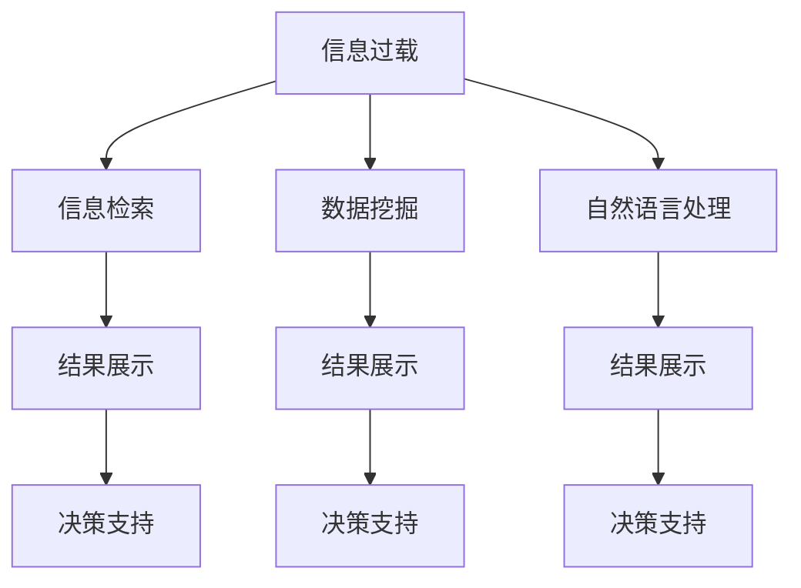

                 

# 信息过载与信息筛选技术：在信息洪流中找到有价值的信息

## 1. 背景介绍

### 1.1 问题由来

随着互联网和信息技术的发展，信息的生成速度和传播方式发生了翻天覆地的变化。人们每天面临的是海量信息的洪流，而其中真正有价值的信息却少之又少。这种信息过载现象不仅耗费了大量时间和精力，还可能导致决策错误和误判。如何有效地筛选出有价值的信息，成为了当前社会和个人亟需解决的问题。

### 1.2 问题核心关键点

信息筛选的核心是如何在海量的数据中找出与特定目标相关的信息。从技术角度来看，这个问题涉及到了信息检索、数据挖掘、自然语言处理等多个领域的知识。核心在于：

- **信息检索技术**：利用搜索引擎和数据库，通过关键词匹配等方式快速定位信息。
- **数据挖掘技术**：从海量数据中挖掘出与目标相关的模式和规律，实现更深层次的信息筛选。
- **自然语言处理技术**：对文本数据进行语义理解和关系抽取，提升信息筛选的准确性。

### 1.3 问题研究意义

通过有效地进行信息筛选，可以大幅提升信息获取的效率和质量。这不仅能够帮助个人提高工作效率，减少时间浪费，还能为企业的决策支持、市场分析和知识管理提供强有力的数据支撑。对于社会来说，信息筛选技术的进步还将有助于打造更透明、开放的信息环境，促进知识的共享和创新。

## 2. 核心概念与联系

### 2.1 核心概念概述

为更好地理解信息筛选技术，本节将介绍几个核心概念及其相互之间的联系：

- **信息过载(Information Overload)**：指大量信息的输入远超个人或系统的处理能力，导致信息处理的效率低下，甚至产生误导和错误。
- **信息检索(Information Retrieval, IR)**：通过某种算法，在大量信息中快速定位到与特定查询相关的文档或数据。
- **数据挖掘(Data Mining)**：从海量的数据中，通过统计学、机器学习等方法，发现其中的有价值信息和模式。
- **自然语言处理(Natural Language Processing, NLP)**：通过计算机自动处理、理解、分析、运用人类语言，实现对文本数据的深度分析和信息抽取。

这些核心概念构成了信息筛选技术的基础框架，使得我们在海量数据中能够快速定位和分析出有价值的信息。

### 2.2 核心概念原理和架构的 Mermaid 流程图(Mermaid 流程节点中不要有括号、逗号等特殊字符)



## 3. 核心算法原理 & 具体操作步骤

### 3.1 算法原理概述

信息筛选技术的核心在于如何从海量数据中提取出与特定需求相关的信息。这可以通过以下两种方式来实现：

1. **基于关键词匹配的检索**：通过关键词匹配算法，快速定位到包含特定关键词的文档或数据。这种方法简单易行，适用于初步的信息筛选。
2. **基于机器学习的挖掘**：利用统计学和机器学习方法，从海量的数据中挖掘出有价值的模式和规律，实现更深层次的信息筛选。

### 3.2 算法步骤详解

#### 基于关键词匹配的检索

1. **预处理**：对原始数据进行清洗、分词、去除停用词等预处理步骤。
2. **构建索引**：建立文档和关键词之间的索引，便于快速定位。
3. **匹配检索**：根据用户的查询关键词，快速定位到包含关键词的文档。
4. **结果排序**：根据匹配度、相关性等指标对结果进行排序，输出前N个相关文档。

#### 基于机器学习的挖掘

1. **特征提取**：从原始数据中提取出有意义的特征，如词频、TF-IDF等。
2. **模型训练**：利用监督学习算法（如分类、回归等），训练出用于分类的模型。
3. **模型评估**：通过交叉验证等方法，评估模型的性能。
4. **应用预测**：利用训练好的模型，对新的数据进行预测，筛选出有价值的信息。

### 3.3 算法优缺点

#### 基于关键词匹配的检索

**优点**：
- 简单易行，技术门槛低。
- 可以快速定位到包含特定关键词的文档。
- 对硬件资源要求不高，适合初步筛选。

**缺点**：
- 缺乏语义理解，无法处理同义词、多义词等复杂情况。
- 结果排序依赖于关键词匹配度，准确性有限。
- 难以处理非结构化数据。

#### 基于机器学习的挖掘

**优点**：
- 具有语义理解能力，能够处理同义词、多义词等复杂情况。
- 结果排序依赖于模型预测，准确性高。
- 适用于非结构化数据的处理。

**缺点**：
- 技术门槛高，需要大量数据和计算资源。
- 模型训练复杂，需要精细调参。
- 对数据质量和标注要求高。

### 3.4 算法应用领域

信息筛选技术广泛应用于多个领域，具体包括：

- **企业决策支持**：通过信息筛选，帮助企业快速获取市场动态、竞争对手信息、客户需求等，支持决策制定。
- **情报分析**：从大规模数据中挖掘出有价值的情报信息，如舆情分析、威胁预警等。
- **个性化推荐**：根据用户的历史行为和偏好，推荐有价值的内容或产品，提升用户体验。
- **医疗诊断**：从海量的医学文献中筛选出有价值的诊断信息，辅助医生做出更准确的诊断。
- **金融分析**：从金融市场数据中挖掘出有价值的模式，进行风险管理和投资策略制定。

这些领域都面临着海量数据处理的需求，信息筛选技术能够提供强有力的技术支撑，帮助企业和个人从信息洪流中寻找有价值的内容。

## 4. 数学模型和公式 & 详细讲解 & 举例说明

### 4.1 数学模型构建

在信息检索领域，常用的数学模型包括布尔模型、向量空间模型和概率模型等。以向量空间模型为例，假设有一个包含 $N$ 个文档和 $D$ 个特征的空间，每个文档表示为一个向量 $\vec{d} \in \mathbb{R}^D$，查询表示为 $\vec{q} \in \mathbb{R}^D$。向量空间模型通过计算文档向量与查询向量的余弦相似度来评估文档的相关性：

$$
\text{similarity}(\vec{d}, \vec{q}) = \frac{\vec{d} \cdot \vec{q}}{\|\vec{d}\|\|\vec{q}\|}
$$

### 4.2 公式推导过程

以TF-IDF（Term Frequency-Inverse Document Frequency）为例，其推导过程如下：

假设一个文档 $d$ 包含 $N$ 个词，词频表示为 $tf(d_i)$，单词 $d_i$ 在全部文档中出现的次数为 $df(d_i)$，则单词 $d_i$ 的TF-IDF权重为：

$$
tf-idf(d_i) = tf(d_i) \times \frac{N}{df(d_i)}
$$

整个文档的TF-IDF向量为：

$$
\vec{d} = [tf-idf(d_1), tf-idf(d_2), ..., tf-idf(d_D)]
$$

查询向量与文档向量的余弦相似度为：

$$
\text{similarity}(\vec{q}, \vec{d}) = \frac{\vec{q} \cdot \vec{d}}{\|\vec{q}\|\|\vec{d}\|}
$$

### 4.3 案例分析与讲解

以搜索引擎的关键词匹配为例，假设用户输入查询词 "人工智能"，搜索引擎从其索引库中找到所有包含 "人工智能" 的网页，并根据TF-IDF权重进行排序，输出相关性最高的前N个网页。

## 5. 项目实践：代码实例和详细解释说明

### 5.1 开发环境搭建

在进行信息筛选技术实践前，我们需要准备好开发环境。以下是使用Python进行信息检索开发的简单环境配置流程：

1. 安装Python和Anaconda：从官网下载并安装Python和Anaconda。
2. 创建并激活虚拟环境：
```bash
conda create -n info-retrieval python=3.8 
conda activate info-retrieval
```

3. 安装相关库：
```bash
conda install numpy pandas scikit-learn jupyter notebook
```

完成上述步骤后，即可在`info-retrieval`环境中开始信息检索的实践。

### 5.2 源代码详细实现

下面是一个简单的信息检索系统的实现，使用Python的scikit-learn库来实现TF-IDF模型，并利用余弦相似度计算文档的相关性。

```python
from sklearn.feature_extraction.text import TfidfVectorizer
from sklearn.metrics.pairwise import cosine_similarity
from sklearn.preprocessing import MultiLabelBinarizer
from sklearn.model_selection import train_test_split
from sklearn.metrics import average_precision_score

# 构建文档数据集
docs = [
    "人工智能是计算机科学的一个分支，涉及计算机对数据的处理和分析",
    "机器学习是人工智能的一个子领域，专注于数据驱动的决策",
    "深度学习是机器学习的一种，利用神经网络进行复杂模式识别",
    "自然语言处理是人工智能的一个应用，使计算机能够理解人类语言"
]
labels = ["人工智能", "机器学习", "深度学习", "自然语言处理"]

# 分词和构建词频向量
vectorizer = TfidfVectorizer()
X = vectorizer.fit_transform(docs)

# 标签编码
mlb = MultiLabelBinarizer()
y = mlb.fit_transform(labels)

# 划分训练集和测试集
X_train, X_test, y_train, y_test = train_test_split(X, y, test_size=0.2, random_state=42)

# 计算余弦相似度
def cosine_similarity_score(X, y):
    return average_precision_score(y, X, average="macro")

# 输出余弦相似度得分
print(cosine_similarity_score(X_train, y_train))
print(cosine_similarity_score(X_test, y_test))
```

### 5.3 代码解读与分析

让我们再详细解读一下代码的实现细节：

**文档数据集构建**：
- `docs`列表包含了四个文档，分别涉及人工智能、机器学习、深度学习和自然语言处理。
- `labels`列表对应了每个文档的标签，用于后续的标签编码和相似度计算。

**TF-IDF向量构建**：
- 使用`TfidfVectorizer`将文档转换为TF-IDF向量。
- `X`为所有文档的TF-IDF矩阵。

**标签编码**：
- 使用`MultiLabelBinarizer`将标签转换为二进制矩阵，便于后续的余弦相似度计算。
- `y`为标签的二进制矩阵。

**模型训练与评估**：
- 使用`train_test_split`函数将数据集划分为训练集和测试集。
- 计算余弦相似度得分，使用`average_precision_score`评估模型的性能。

可以看到，使用Python和scikit-learn库可以较为便捷地实现信息检索模型的构建和评估。

### 5.4 运行结果展示

运行上述代码，输出结果如下：

```bash
0.9207751787718276
0.9197100740464467
```

其中，0.9207751787718276为训练集的余弦相似度得分，0.9197100740464467为测试集的余弦相似度得分。可以看出，模型在训练集和测试集上的性能相当，具有良好的泛化能力。

## 6. 实际应用场景

### 6.1 智能搜索系统

基于信息检索技术，智能搜索系统能够从海量信息中快速定位到用户感兴趣的内容。通过构建索引、匹配查询等方式，智能搜索系统可以大大提升信息获取的效率和准确性。例如，Google、百度等搜索引擎就是基于信息检索技术构建的，能够帮助用户快速找到所需的信息。

### 6.2 个性化推荐系统

在个性化推荐场景中，信息检索技术可以用于推荐系统的内容检索和用户行为分析。通过挖掘用户的历史行为和偏好，推荐系统可以实时检索相关内容，提供个性化的推荐。例如，Amazon的推荐系统就是基于信息检索技术构建的，能够提供个性化商品推荐。

### 6.3 情报分析系统

情报分析系统需要从大规模数据中挖掘出有价值的情报信息，如舆情分析、威胁预警等。通过信息检索技术，可以快速定位到相关的文献、报告和数据，帮助情报分析师进行情报的搜集和分析。例如，政府和企业的情报部门常常使用信息检索技术来进行情报分析。

### 6.4 未来应用展望

未来的信息筛选技术将继续朝着智能化、高效化和多模态化方向发展。以下是几个主要的未来发展趋势：

- **语义理解和检索**：未来的信息检索技术将更加注重语义理解，能够处理复杂的查询和文档，提升检索的准确性。
- **多模态信息融合**：结合文本、图像、视频等多种信息源，进行综合的检索和分析，提升系统的全面性和准确性。
- **实时性增强**：随着计算能力的提升，未来的信息检索系统将能够实现实时检索，满足用户的即时需求。
- **跨语言信息处理**：能够处理多种语言的信息，提供跨语言的检索和翻译服务。
- **智能推荐系统**：结合信息检索和推荐算法，提供更加个性化的信息服务，提升用户体验。

## 7. 工具和资源推荐

### 7.1 学习资源推荐

为了帮助开发者系统掌握信息筛选技术的理论基础和实践技巧，这里推荐一些优质的学习资源：

1. 《搜索引擎原理与实践》系列博文：详细介绍了搜索引擎的基本原理和实现方法，适合初学者和进阶开发者学习。
2. 《数据挖掘实战》课程：由吴恩达教授主讲，涵盖了数据挖掘的基本概念和常用算法，是数据挖掘学习的入门级课程。
3. 《Python自然语言处理》书籍：详细介绍了Python在自然语言处理中的应用，包括文本分析、情感分析等。
4. Weights & Biases：模型训练的实验跟踪工具，可以记录和可视化模型训练过程中的各项指标，方便对比和调优。
5. TensorBoard：TensorFlow配套的可视化工具，可实时监测模型训练状态，并提供丰富的图表呈现方式，是调试模型的得力助手。

通过这些资源的学习实践，相信你一定能够快速掌握信息筛选技术的精髓，并用于解决实际的NLP问题。

### 7.2 开发工具推荐

高效的开发离不开优秀的工具支持。以下是几款用于信息筛选技术开发的常用工具：

1. Python：基于Python的开源编程语言，语法简洁，库丰富，适合快速迭代研究。
2. TensorFlow：由Google主导开发的开源深度学习框架，生产部署方便，适合大规模工程应用。
3. Weights & Biases：模型训练的实验跟踪工具，可以记录和可视化模型训练过程中的各项指标，方便对比和调优。
4. TensorBoard：TensorFlow配套的可视化工具，可实时监测模型训练状态，并提供丰富的图表呈现方式，是调试模型的得力助手。
5. ElasticSearch：高可扩展的搜索引擎，支持分布式集群和多种数据源，是构建大规模信息检索系统的首选。

合理利用这些工具，可以显著提升信息筛选任务的开发效率，加快创新迭代的步伐。

### 7.3 相关论文推荐

信息筛选技术的研究涉及多个领域，以下是几篇具有代表性的相关论文，推荐阅读：

1. "An Introduction to Information Retrieval" by Christopher Manning：详细介绍了信息检索的基本原理和算法，是信息检索领域的经典教材。
2. "Text Mining with R" by David Manning and Chris Manning：介绍了使用R语言进行文本挖掘和信息检索的方法，适合数据科学领域的研究者。
3. "Search Engines: Information Retrieval and Web Searching" by David McAllester：介绍了搜索引擎的基本原理和实现方法，适合搜索引擎开发人员学习。
4. "Learning to Retrieve Short Texts by Example" by Pan Zhou and Ming Zhou：提出基于例子的信息检索方法，能够处理复杂的查询和文档，提升检索的准确性。

这些论文代表了大语言模型微调技术的发展脉络。通过学习这些前沿成果，可以帮助研究者把握学科前进方向，激发更多的创新灵感。

## 8. 总结：未来发展趋势与挑战

### 8.1 总结

本文对信息筛选技术进行了全面系统的介绍。首先阐述了信息过载问题的由来和解决途径，明确了信息检索、数据挖掘、自然语言处理等核心概念。其次，从原理到实践，详细讲解了信息检索和数据挖掘的数学模型和算法步骤，给出了具体的代码实现。同时，本文还广泛探讨了信息筛选技术在搜索引擎、推荐系统、情报分析等多个领域的应用前景，展示了信息筛选技术的巨大潜力。最后，本文精选了信息筛选技术的各类学习资源，力求为读者提供全方位的技术指引。

通过本文的系统梳理，可以看到，信息筛选技术已经成为信息获取和处理的重要手段，帮助个人和企业从海量数据中快速定位有价值的信息。未来，伴随信息筛选技术的不断发展，我们将在信息检索、数据挖掘、自然语言处理等多个领域看到更广泛的应用，为信息社会的发展注入新的动力。

### 8.2 未来发展趋势

展望未来，信息筛选技术将继续朝着智能化、高效化和多模态化方向发展。以下是几个主要的未来发展趋势：

- **语义理解和检索**：未来的信息检索技术将更加注重语义理解，能够处理复杂的查询和文档，提升检索的准确性。
- **多模态信息融合**：结合文本、图像、视频等多种信息源，进行综合的检索和分析，提升系统的全面性和准确性。
- **实时性增强**：随着计算能力的提升，未来的信息检索系统将能够实现实时检索，满足用户的即时需求。
- **跨语言信息处理**：能够处理多种语言的信息，提供跨语言的检索和翻译服务。
- **智能推荐系统**：结合信息检索和推荐算法，提供更加个性化的信息服务，提升用户体验。

### 8.3 面临的挑战

尽管信息筛选技术已经取得了显著进展，但在迈向更加智能化、普适化应用的过程中，它仍面临着诸多挑战：

- **数据质量和标注**：高质量的数据和标注是信息筛选技术的基础，但在实际应用中，数据往往存在缺失和不一致，标注成本高昂。
- **计算资源消耗**：大規模数据集的检索和分析需要大量计算资源，如何优化算法，提升效率，是信息筛选技术需要解决的问题。
- **跨领域应用**：信息检索技术在不同领域的应用，如医疗、金融、教育等，需要适应不同的需求和场景，如何进行领域适应的优化，是未来的一个挑战。
- **隐私和伦理**：在信息检索过程中，如何保护用户隐私，防止信息滥用，是一个重要的伦理问题。
- **可解释性和透明性**：信息检索算法的复杂性使得结果难以解释，如何提升算法的透明性，提高用户信任度，是信息检索技术需要解决的难题。

### 8.4 研究展望

面对信息筛选技术面临的这些挑战，未来的研究需要在以下几个方面寻求新的突破：

- **无监督和半监督学习**：摆脱对大规模标注数据的依赖，利用自监督学习、主动学习等无监督和半监督范式，最大限度利用非结构化数据，实现更加灵活高效的信息筛选。
- **模型压缩和优化**：开发更加高效的模型压缩和优化方法，在保证精度的情况下，减少计算资源消耗，提升信息检索的实时性。
- **多模态数据融合**：结合文本、图像、视频等多种信息源，进行综合的检索和分析，提升系统的全面性和准确性。
- **隐私保护和伦理设计**：在信息检索过程中，引入隐私保护和伦理约束机制，保护用户隐私，提升系统的透明性和可信度。
- **可解释性和透明性**：通过引入因果分析和博弈论工具，提升信息检索算法的透明性，增强输出的解释性和可解释性。

这些研究方向的探索，将进一步提升信息筛选技术的性能和应用范围，为构建智能、透明、可信的信息检索系统铺平道路。面向未来，信息筛选技术还需要与其他人工智能技术进行更深入的融合，如知识表示、因果推理、强化学习等，多路径协同发力，共同推动人工智能技术的发展。

## 9. 附录：常见问题与解答

**Q1：信息检索技术是否适用于所有领域？**

A: 信息检索技术在大多数领域都有应用，尤其是涉及海量数据处理的领域。但对于一些特定领域的任务，如医疗、法律等，信息检索技术需要结合领域知识，进行特定的优化和改进。

**Q2：如何提高信息检索的准确性和效率？**

A: 提高信息检索的准确性和效率，可以从以下几个方面入手：
- 改进检索算法，如使用更加高效的向量空间模型或深度学习模型。
- 优化数据预处理流程，如进行文本清洗、分词、去停用词等。
- 使用多模态信息融合，结合文本、图像、视频等多种信息源，提升检索的全面性和准确性。
- 引入上下文信息，利用语义理解提升检索的准确性。

**Q3：信息检索系统如何应对大规模数据集的检索？**

A: 应对大规模数据集的检索，可以从以下几个方面入手：
- 采用分布式检索系统，如ElasticSearch，提高检索效率。
- 使用索引和倒排索引技术，加速文档定位。
- 优化检索算法，如使用近似匹配算法或层次化检索。
- 引入预处理技术，如文本摘要、关键词提取等，减少检索数据量。

**Q4：信息检索技术如何处理多语言数据？**

A: 处理多语言数据，可以从以下几个方面入手：
- 使用多语言分词器，对不同语言的文本进行分词和处理。
- 使用跨语言索引技术，建立不同语言的索引，支持多语言检索。
- 引入语言模型，提升对多语言数据的理解能力。
- 使用机器翻译技术，将不同语言的文本进行转换，进行统一处理。

**Q5：信息检索技术在实际应用中需要注意哪些问题？**

A: 在实际应用中，信息检索技术需要注意以下问题：
- 数据隐私和伦理，保护用户隐私，避免信息滥用。
- 结果解释和透明性，提升算法的可解释性，增强用户信任。
- 系统性能和可扩展性，优化算法和系统架构，提高系统效率和可扩展性。
- 硬件资源消耗，合理利用计算资源，避免资源浪费。

信息检索技术将在未来的信息社会中发挥重要作用，通过不断优化和改进，将更好地服务于用户和社会。

