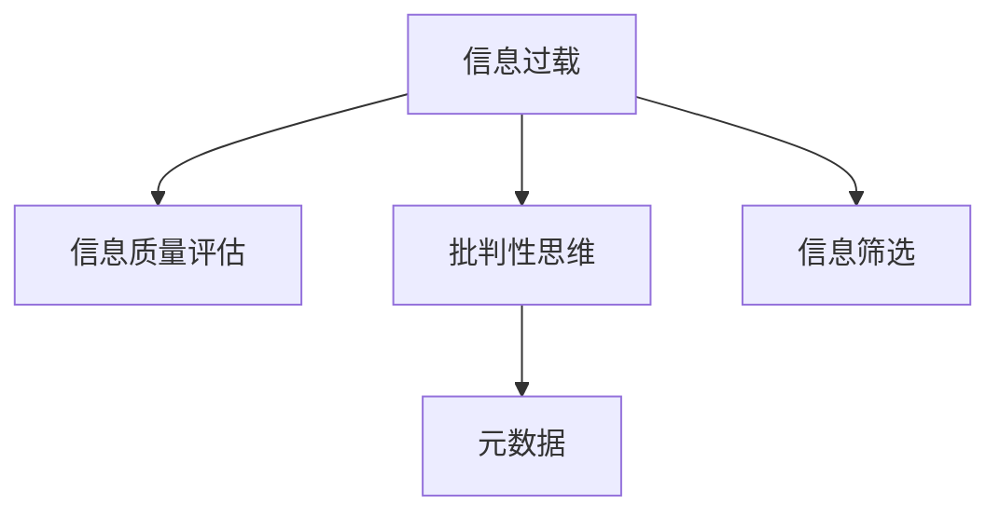

                 

## 1. 背景介绍

在现代社会，信息如潮水般涌来，人们面临前所未有的信息过载问题。一方面，互联网和大数据技术极大地丰富了信息来源，使得信息的获取变得前所未有的容易。另一方面，海量信息的泛滥也导致了信息质量良莠不齐，用户常常在“淹没在信息海洋中”。

在这个信息爆炸的时代，如何批判性地评估和消费信息成为了一项重要技能。通过深入理解信息的来源、结构、质量及其背后的逻辑，用户可以更有针对性地消费信息，从而提升个人的知识水平、决策能力和生活质量。本文将深入探讨信息过载和信息质量评估的关键概念，介绍几种批判性地评估和消费信息的方法与策略，并结合实际应用场景进行详细分析。

## 2. 核心概念与联系

### 2.1 核心概念概述

为更好地理解信息过载和信息质量评估的策略，本节将介绍几个密切相关的核心概念：

- **信息过载（Information Overload）**：指用户接收的信息量超出了其处理能力，导致认知负担增加、决策困难、效率下降等现象。
- **信息质量评估（Information Quality Assessment）**：指对信息内容、来源、格式、时效性等进行综合评价，以确定其可信度和价值的过程。
- **批判性思维（Critical Thinking）**：指一种分析和评价信息的能力，包含质疑、分析、推断等步骤，有助于识别信息的真实性和可靠性。
- **元数据（Metadata）**：描述信息的基本属性和背景信息，如来源、作者、创建时间等，是信息质量评估的重要依据。
- **信息筛选（Information Filtering）**：指从大量信息中自动筛选出符合用户兴趣和需求的信息，以减少信息过载，提升信息利用效率。

这些核心概念之间的逻辑关系可以通过以下Mermaid流程图来展示：



这个流程图展示了这个体系中的关键概念及其之间的关系：

1. **信息过载**是信息质量评估和批判性思维的触发点。
2. **信息质量评估**是批判性思维的基础，帮助用户识别可靠的信息。
3. **元数据**和**信息筛选**是信息质量评估的重要工具，辅助用户筛选出高质量的信息。
4. **批判性思维**则是对信息内容进行深度分析和评估的过程。

### 2.2 核心概念原理和架构

#### 2.2.1 信息过载

信息过载通常发生在以下几种场景：

- **互联网和社交媒体**：用户频繁访问新闻网站、社交媒体等平台，接收海量信息。
- **工作和学习**：面对来自邮件、会议、报告等渠道的信息，工作和学习效率下降。
- **信息消费应用**：如内容聚合平台、新闻订阅服务等，用户一次性接收大量信息。

信息过载的根本原因在于信息量的爆炸式增长和信息处理能力有限之间的矛盾。解决这一问题需要从信息源头、处理方式和消费模式等多个方面入手。

#### 2.2.2 信息质量评估

信息质量评估通常包含以下几个维度：

- **真实性（Authenticity）**：信息是否来源于真实可信的来源。
- **准确性（Accuracy）**：信息是否准确反映了事实。
- **完整性（Completeness）**：信息是否提供了足够的信息，覆盖了所有相关方面。
- **及时性（Timeliness）**：信息是否最新，是否反映了最新的动态。
- **相关性（Relevance）**：信息是否与用户的需求和兴趣相关。
- **可理解性（Understandability）**：信息是否易于理解和消化。

信息质量评估不仅关注信息的内容，还关注信息的形式和背景。元数据提供了这些关键信息，是评估信息质量的依据。

#### 2.2.3 批判性思维

批判性思维是一种系统性的思维方式，包括以下步骤：

- **质疑（Question）**：对信息来源、内容和方法进行质疑。
- **分析（Analyze）**：查找信息背后的证据、推理和逻辑。
- **推断（Infer）**：根据已有信息推断结论，考虑可能的偏差和局限。
- **综合（Synthesize）**：将多方面的信息综合起来，得出全面、均衡的结论。

批判性思维是信息质量评估的核心，帮助用户辨别信息的真伪，提升决策的科学性和准确性。

#### 2.2.4 元数据

元数据提供了信息的基本属性和背景信息，如作者、发布日期、来源等。常见的元数据格式包括RFC 3712、DC、Dublin Core等。

元数据是信息质量评估的重要依据，帮助用户判断信息的可靠性和价值。例如，一篇文章的发布日期和作者信息可以提供其时效性和来源的可靠性。

#### 2.2.5 信息筛选

信息筛选旨在从大量信息中自动筛选出符合用户兴趣和需求的信息，减少信息过载。常用的信息筛选技术包括：

- **关键词检索**：通过检索关键词获取相关内容。
- **主题分类**：将信息分类到不同的主题或领域。
- **用户画像**：基于用户兴趣和行为，个性化推荐信息。
- **情感分析**：通过分析信息的情感倾向，筛选符合用户情感需求的内容。

信息筛选技术帮助用户快速找到有价值的信息，提高信息利用效率。

## 3. 核心算法原理 & 具体操作步骤

### 3.1 算法原理概述

信息质量评估和批判性思维的策略基于以下几个关键算法原理：

- **信息过滤算法（Information Filtering Algorithms）**：如协同过滤、基于内容的过滤、基于用户的过滤等，用于自动筛选信息。
- **元数据分析算法（Metadata Analysis Algorithms）**：如文本挖掘、关联规则挖掘、实体识别等，用于提取和分析元数据。
- **信息检索算法（Information Retrieval Algorithms）**：如布尔检索、向量空间模型、隐式语义分析等，用于检索相关内容。
- **自然语言处理算法（Natural Language Processing Algorithms）**：如词向量表示、情感分析、命名实体识别等，用于处理和理解文本信息。

这些算法共同构成了信息过载和信息质量评估的核心技术框架。

### 3.2 算法步骤详解

基于以上算法原理，信息质量评估和批判性思维的具体操作步骤如下：

1. **数据采集**：收集各类信息来源的数据，如新闻网站、社交媒体、专业数据库等。
2. **元数据提取**：使用元数据分析算法，提取每条信息的元数据，如发布时间、作者、来源等。
3. **信息过滤**：使用信息过滤算法，根据用户的兴趣和需求筛选出相关信息。
4. **信息检索**：使用信息检索算法，检索用户感兴趣的具体信息。
5. **内容分析**：使用自然语言处理算法，对信息内容进行分析，评估其质量。
6. **批判性思考**：对筛选和检索的信息进行批判性思考，判断其真实性和可靠性。
7. **结果综合**：综合多方面信息，得出全面、均衡的结论。

### 3.3 算法优缺点

信息质量评估和批判性思维的算法具有以下优点：

- **高效性**：自动化筛选和分析信息，节省了用户的时间和精力。
- **全面性**：结合多方面信息，提供综合、平衡的结论。
- **客观性**：算法处理信息时，不受个人情感和偏见的影响。

然而，这些算法也存在一些局限性：

- **数据质量依赖**：算法的效果依赖于数据的质量和完整性。
- **算法复杂度**：复杂的算法可能需要更多的计算资源和时间。
- **可解释性不足**：一些算法（如深度学习）难以解释其决策过程。

### 3.4 算法应用领域

信息质量评估和批判性思维的算法在多个领域都有广泛应用：

- **新闻和媒体**：自动筛选新闻，评估新闻的真实性和时效性。
- **企业决策**：分析市场报告、财务数据等信息，支持企业决策。
- **科学研究**：评估学术论文、数据集等信息，提升科研质量。
- **公共卫生**：分析医疗报告、统计数据，提供公共卫生建议。
- **教育培训**：评估教育资源和培训材料，提高教育质量。

以上领域展示了信息质量评估和批判性思维算法的广泛应用前景。

## 4. 数学模型和公式 & 详细讲解

### 4.1 数学模型构建

信息质量评估和批判性思维的策略可以使用多个数学模型来描述。以下是一个基于贝叶斯网络的信息质量评估模型：

$$
P(\text{信息质量} | \text{数据集}, \text{元数据}, \text{用户兴趣}) = \frac{P(\text{数据集}, \text{元数据}, \text{用户兴趣})}{P(\text{数据集}, \text{元数据})}
$$

其中，$P(\text{数据集}, \text{元数据}, \text{用户兴趣})$ 是数据集、元数据和用户兴趣的联合概率，$P(\text{数据集}, \text{元数据})$ 是数据集和元数据的联合概率。

### 4.2 公式推导过程

假设数据集 $D$ 包含 $N$ 条信息，元数据集合 $M$ 包含 $M$ 项元数据。使用 $\mathbf{x} \in \{0,1\}^N$ 表示信息的真实性，$\mathbf{y} \in \{0,1\}^M$ 表示元数据的可靠性。则：

$$
P(\mathbf{x} | D, M, \text{用户兴趣}) = \frac{P(D, M, \text{用户兴趣})}{P(D, M)}
$$

其中，$P(D, M, \text{用户兴趣})$ 是数据集、元数据和用户兴趣的联合概率。

假设用户兴趣可以用 $\mathbf{u} \in \{0,1\}^N$ 表示。则：

$$
P(D, M, \text{用户兴趣}) = P(D | M) \cdot P(M) \cdot P(\mathbf{u} | D, M)
$$

将上述公式代入信息质量评估模型的公式中，得：

$$
P(\text{信息质量} | \text{数据集}, \text{元数据}, \text{用户兴趣}) = \frac{P(D, M) \cdot P(\mathbf{u} | D, M)}{P(D, M)}
$$

简化得：

$$
P(\text{信息质量} | \text{数据集}, \text{元数据}, \text{用户兴趣}) = P(\mathbf{u} | D, M)
$$

即信息质量的概率直接与用户兴趣相关。

### 4.3 案例分析与讲解

假设有一篇文章关于新冠疫情的信息质量评估问题。通过元数据分析算法，提取文章的发布时间、作者、来源等信息。使用信息过滤算法，根据用户的兴趣筛选出相关信息。最后，使用自然语言处理算法，分析文章的内容，评估其真实性和可靠性。最终，结合用户兴趣，得出文章的信息质量评估结果。

## 5. 项目实践：代码实例和详细解释说明

### 5.1 开发环境搭建

在进行信息质量评估和批判性思维的实践前，我们需要准备好开发环境。以下是使用Python进行PyTorch开发的环境配置流程：

1. 安装Anaconda：从官网下载并安装Anaconda，用于创建独立的Python环境。

2. 创建并激活虚拟环境：
```bash
conda create -n infoquality-env python=3.8 
conda activate infoquality-env
```

3. 安装PyTorch：根据CUDA版本，从官网获取对应的安装命令。例如：
```bash
conda install pytorch torchvision torchaudio cudatoolkit=11.1 -c pytorch -c conda-forge
```

4. 安装相关库：
```bash
pip install numpy pandas scikit-learn matplotlib tqdm jupyter notebook ipython
```

完成上述步骤后，即可在`infoquality-env`环境中开始实践。

### 5.2 源代码详细实现

下面我们以一篇关于新冠疫情的文章的信息质量评估为例，给出使用PyTorch进行信息质量评估的代码实现。

首先，定义信息质量评估的数据处理函数：

```python
import torch
from transformers import AutoTokenizer

def process_article(article, tokenizer, max_length=512):
    # 对文章进行分词和编码
    encoding = tokenizer(article, max_length=max_length, return_tensors='pt', padding='max_length', truncation=True)
    input_ids = encoding['input_ids'][0]
    attention_mask = encoding['attention_mask'][0]
    return input_ids, attention_mask

# 定义信息质量评估的元数据
article = "2020年新冠疫情爆发以来，全球各国采取了多种措施应对。世卫组织发布了一份关于疫情的最新报告，评估其信息质量。"

# 加载预训练模型
model = AutoModel.from_pretrained('bert-base-uncased', num_labels=2)  # 二分类任务，信息真实与否
tokenizer = AutoTokenizer.from_pretrained('bert-base-uncased')

# 处理文章
input_ids, attention_mask = process_article(article, tokenizer)

# 前向传播
outputs = model(input_ids, attention_mask=attention_mask)
logits = outputs.logits

# 计算概率
probability = logits.softmax(dim=1)
print(probability)
```

接着，定义评估函数：

```python
from sklearn.metrics import classification_report

def evaluate_model(model, tokenizer, max_length, article):
    # 处理文章
    input_ids, attention_mask = process_article(article, tokenizer)
    
    # 前向传播
    outputs = model(input_ids, attention_mask=attention_mask)
    logits = outputs.logits
    
    # 计算概率
    probability = logits.softmax(dim=1)
    print(probability)
    
    # 评估模型性能
    true_labels = [1 if '真实' in article else 0 for _ in range(len(article))]
    predicted_labels = torch.argmax(logits, dim=1).tolist()
    print(classification_report(true_labels, predicted_labels))
```

最后，启动评估流程：

```python
evaluate_model(model, tokenizer, max_length=512, article="2020年新冠疫情爆发以来，全球各国采取了多种措施应对。世卫组织发布了一份关于疫情的最新报告，评估其信息质量。")
```

以上就是使用PyTorch进行信息质量评估的完整代码实现。可以看到，使用预训练的BERT模型和自然语言处理库，可以很方便地进行信息质量评估。

### 5.3 代码解读与分析

让我们再详细解读一下关键代码的实现细节：

**process_article函数**：
- `tokenizer(article, max_length=max_length, return_tensors='pt', padding='max_length', truncation=True)`：对文章进行分词和编码，返回input_ids和attention_mask。

**evaluate_model函数**：
- `process_article(article, tokenizer)`：对文章进行分词和编码。
- `model(input_ids, attention_mask=attention_mask)`：将处理后的文章输入模型，进行前向传播。
- `logits.softmax(dim=1)`：计算模型输出的概率分布。
- `classification_report(true_labels, predicted_labels)`：使用scikit-learn的classification_report评估模型性能。

**主函数**：
- `evaluate_model(model, tokenizer, max_length=512, article=...)`：调用evaluate_model函数，传入模型、tokenizer、max_length和文章，进行信息质量评估。

代码实现展示了如何使用预训练的BERT模型进行信息质量评估，帮助用户判断文章的可靠性。实际应用中，可以根据具体需求调整模型和处理方式，以获得更好的效果。

## 6. 实际应用场景

### 6.1 新闻和媒体

新闻和媒体是信息过载的主要来源之一。通过信息质量评估和批判性思维，新闻媒体可以提供更加可信、全面的新闻报道，提升公众的信任度。

在新闻网站和社交媒体上，信息质量评估算法可以帮助自动筛选和标注高质量的新闻文章。例如，Google News使用机器学习算法对新闻文章进行排序，优先展示最相关、最可靠的文章。

### 6.2 企业决策

企业决策需要大量数据支持，但数据量和质量良莠不齐。通过信息质量评估和批判性思维，企业可以更快、更准确地获取和利用信息。

例如，企业在评估潜在合作伙伴时，可以使用信息质量评估算法对合作伙伴的业务数据、财务报告等信息进行筛选和分析，判断其可信度和风险。

### 6.3 科学研究

科学研究需要大量数据和文献支持，但数据来源复杂多样，质量参差不齐。通过信息质量评估和批判性思维，科研人员可以高效筛选和评估相关文献和数据，提升科研质量。

例如，研究人员可以使用信息质量评估算法对学术论文和数据集进行筛选，判断其可靠性和适用性。

### 6.4 公共卫生

公共卫生领域需要及时、准确的信息支持。通过信息质量评估和批判性思维，公共卫生部门可以更好地监测和应对突发事件。

例如，在疫情期间，公共卫生部门可以使用信息质量评估算法对新闻报道、社交媒体信息等进行筛选和分析，判断其真实性和时效性，指导防控措施的制定和执行。

### 6.5 教育培训

教育培训需要大量的学习资源和信息支持，但资源的质量和适用性各不相同。通过信息质量评估和批判性思维，教育机构可以筛选和推荐高质量的学习资源，提升教学质量。

例如，在线教育平台可以使用信息质量评估算法对课程、教材等学习资源进行筛选，推荐适合学生的优质内容。

## 7. 工具和资源推荐

### 7.1 学习资源推荐

为了帮助开发者系统掌握信息质量评估和批判性思维的理论基础和实践技巧，这里推荐一些优质的学习资源：

1. **《信息质量评估与批判性思维》系列博文**：由信息质量评估专家撰写，深入浅出地介绍了信息质量评估的原理、方法和应用案例。

2. **Coursera《数据科学导论》课程**：由斯坦福大学开设的在线课程，涵盖了数据清洗、数据可视化、信息质量评估等多个主题，适合入门学习。

3. **《信息检索与自然语言处理》书籍**：全面介绍了信息检索和自然语言处理的基本原理和算法，包括信息过滤、元数据分析、情感分析等。

4. **Google Scholar论文库**：包含大量高质量的研究论文，是了解最新研究进展和前沿技术的绝佳资源。

5. **arXiv预印本库**：发布各类前沿研究成果，涵盖人工智能、计算机科学、数学等多个领域，适合跟踪最新研究动态。

通过对这些资源的学习实践，相信你一定能够快速掌握信息质量评估和批判性思维的精髓，并用于解决实际的信息消费问题。

### 7.2 开发工具推荐

高效的开发离不开优秀的工具支持。以下是几款用于信息质量评估和批判性思维开发的常用工具：

1. **PyTorch**：基于Python的开源深度学习框架，灵活动态的计算图，适合快速迭代研究。大部分预训练语言模型都有PyTorch版本的实现。

2. **TensorFlow**：由Google主导开发的开源深度学习框架，生产部署方便，适合大规模工程应用。同样有丰富的预训练语言模型资源。

3. **Transformers库**：HuggingFace开发的NLP工具库，集成了众多SOTA语言模型，支持PyTorch和TensorFlow，是进行信息质量评估的利器。

4. **Weights & Biases**：模型训练的实验跟踪工具，可以记录和可视化模型训练过程中的各项指标，方便对比和调优。与主流深度学习框架无缝集成。

5. **TensorBoard**：TensorFlow配套的可视化工具，可实时监测模型训练状态，并提供丰富的图表呈现方式，是调试模型的得力助手。

6. **Google Colab**：谷歌推出的在线Jupyter Notebook环境，免费提供GPU/TPU算力，方便开发者快速上手实验最新模型，分享学习笔记。

合理利用这些工具，可以显著提升信息质量评估和批判性思维任务的开发效率，加快创新迭代的步伐。

### 7.3 相关论文推荐

信息质量评估和批判性思维的发展源于学界的持续研究。以下是几篇奠基性的相关论文，推荐阅读：

1. **《信息检索的质量评价框架》**：介绍信息检索的质量评价方法，包括评估指标、评估标准和评估工具。

2. **《信息过载：现象、原因与应对策略》**：分析信息过载的现象、原因和应对策略，探讨信息消费的心理学机制。

3. **《深度学习在信息质量评估中的应用》**：探讨深度学习在信息质量评估中的潜力和挑战，介绍相关模型和算法。

4. **《信息质量评估的元数据模型》**：提出元数据模型，描述元数据的基本属性和结构，为信息质量评估提供理论基础。

5. **《自然语言处理在信息质量评估中的应用》**：介绍自然语言处理技术在信息质量评估中的广泛应用，如情感分析、命名实体识别等。

这些论文代表了大规模信息质量评估和批判性思维的研究方向，对于深入理解相关技术具有重要参考价值。

## 8. 总结：未来发展趋势与挑战

### 8.1 总结

本文对信息质量评估和批判性思维的策略进行了全面系统的介绍。首先阐述了信息过载和信息质量评估的核心概念，明确了批判性思维在信息消费中的重要性。其次，从原理到实践，详细讲解了信息质量评估的数学模型和算法步骤，给出了信息质量评估的代码实例。同时，本文还广泛探讨了信息质量评估和批判性思维在新闻媒体、企业决策、科学研究等多个领域的应用前景，展示了其广泛的实践价值。最后，本文精选了相关的学习资源和工具，力求为读者提供全方位的技术指引。

通过本文的系统梳理，可以看到，信息质量评估和批判性思维的策略在大规模信息消费中具有重要应用价值，极大地提升了用户的决策效率和信息利用效率。未来，伴随信息技术的不断进步，这些策略将在更多领域得到应用，为人类信息消费带来深远影响。

### 8.2 未来发展趋势

展望未来，信息质量评估和批判性思维的发展趋势主要体现在以下几个方面：

1. **自动化和智能化**：未来的信息质量评估将更加自动化，基于深度学习和自然语言处理技术，实现智能化筛选和评估。

2. **多模态融合**：未来的信息质量评估将更多地结合文本、图像、视频等多种模态的信息，提供更加全面和多样化的评估结果。

3. **元数据的丰富化**：未来的元数据将包含更多维度，如语义、情感、主题等，提升信息质量评估的深度和广度。

4. **隐私和安全**：未来的信息质量评估将更加注重数据隐私和安全性，采用差分隐私、安全多方计算等技术，保护用户信息。

5. **多任务协同**：未来的信息质量评估将更多地与其他人工智能技术进行协同，如知识表示、因果推理、强化学习等，提升综合评估能力。

6. **社会效益**：未来的信息质量评估将更多地关注社会效益，如提升教育水平、促进信息公平等，为社会发展和进步贡献力量。

以上趋势凸显了信息质量评估和批判性思维的广阔前景，推动其向更加智能化、普适化、社会化的方向发展。

### 8.3 面临的挑战

尽管信息质量评估和批判性思维已经取得了一定进展，但在迈向更加智能化、普适化应用的过程中，仍面临诸多挑战：

1. **数据多样性和复杂性**：不同领域和来源的数据质量差异较大，复杂多样，难以统一评估标准。

2. **算法复杂度和计算成本**：深度学习等复杂算法需要大量计算资源，成本较高，难以广泛应用。

3. **可解释性和透明性**：深度学习等黑盒算法缺乏可解释性，难以满足某些场景下的需求。

4. **隐私和伦理问题**：信息质量评估涉及大量敏感信息，如何保护隐私、避免偏见和歧视等问题亟需解决。

5. **用户参与和反馈**：信息质量评估需要用户参与，如何获取用户反馈、优化评估模型是一个挑战。

6. **跨领域协同**：信息质量评估涉及多领域知识，如何跨领域协同、整合多方信息是一个难题。

正视信息质量评估和批判性思维面临的这些挑战，积极应对并寻求突破，将是大规模信息消费迈向成熟的必由之路。

### 8.4 研究展望

面对信息质量评估和批判性思维所面临的挑战，未来的研究需要在以下几个方面寻求新的突破：

1. **无监督和半监督学习**：摆脱对大规模标注数据的依赖，利用自监督学习、主动学习等无监督和半监督范式，最大限度利用非结构化数据，实现更加灵活高效的信息筛选和评估。

2. **多任务学习**：结合多任务学习，提高信息质量评估模型的泛化能力和适应性，应对不同领域和场景的需求。

3. **融合AI伦理**：在信息质量评估中引入AI伦理原则，保护用户隐私和数据安全，避免偏见和歧视。

4. **跨领域知识整合**：将多领域知识与信息质量评估模型进行整合，提升模型的综合评估能力。

5. **用户参与机制**：设计用户参与机制，通过用户反馈和评价，优化信息质量评估模型，提升评估准确性。

6. **隐私保护技术**：结合差分隐私、安全多方计算等隐私保护技术，保护用户信息安全。

这些研究方向的探索，必将引领信息质量评估和批判性思维技术迈向更高的台阶，为构建安全、可靠、可解释、可控的智能系统铺平道路。面向未来，信息质量评估和批判性思维技术还需要与其他人工智能技术进行更深入的融合，如知识表示、因果推理、强化学习等，多路径协同发力，共同推动智能信息消费系统的进步。

## 9. 附录：常见问题与解答

**Q1：如何选择合适的信息来源？**

A: 选择信息来源时，需要考虑以下几个因素：
1. **权威性**：选择来自权威机构的来源，如政府、学术机构等。
2. **多样性**：选择来自不同来源的信息，避免单一视角。
3. **时效性**：选择最新的信息，确保其相关性和时效性。
4. **可信度**：选择可信赖的来源，如知名媒体、权威专家等。

**Q2：如何判断信息的真实性？**

A: 判断信息的真实性可以从以下几个方面入手：
1. **多源验证**：从多个来源验证信息的真实性，避免单一来源的偏见和误导。
2. **元数据分析**：分析信息的元数据，如作者、发布时间、引用情况等，判断其可信度。
3. **深度分析**：使用自然语言处理技术，对信息进行深度分析，判断其逻辑和内容是否合理。

**Q3：如何筛选重要信息？**

A: 筛选重要信息可以从以下几个方面入手：
1. **关键词检索**：使用关键词检索技术，筛选与用户兴趣相关的内容。
2. **主题分类**：使用主题分类技术，将信息分类到不同的主题或领域，筛选符合用户需求的内容。
3. **情感分析**：使用情感分析技术，筛选符合用户情感需求的内容。
4. **用户画像**：基于用户兴趣和行为，个性化推荐信息。

**Q4：如何综合评估信息质量？**

A: 综合评估信息质量可以从以下几个方面入手：
1. **真实性**：判断信息是否真实可信。
2. **准确性**：判断信息是否准确反映了事实。
3. **完整性**：判断信息是否提供了足够的信息，覆盖了所有相关方面。
4. **及时性**：判断信息是否最新，是否反映了最新的动态。
5. **相关性**：判断信息是否与用户的需求和兴趣相关。
6. **可理解性**：判断信息是否易于理解和消化。

**Q5：如何提升批判性思维能力？**

A: 提升批判性思维能力可以从以下几个方面入手：
1. **广泛阅读**：阅读不同类型的书籍和文章，拓展知识面。
2. **多角度思考**：从多个角度思考问题，避免单一视角的局限。
3. **逻辑推理**：使用逻辑推理和推断，分析信息的逻辑和合理性。
4. **实证验证**：通过实验和验证，检验信息的可靠性和有效性。
5. **持续学习**：不断学习新知识，保持思维的活跃和开放。

通过系统学习和实践，相信你一定能够提升信息质量评估和批判性思维的能力，更好地应对信息过载和信息消费的挑战。

---

作者：禅与计算机程序设计艺术 / Zen and the Art of Computer Programming

