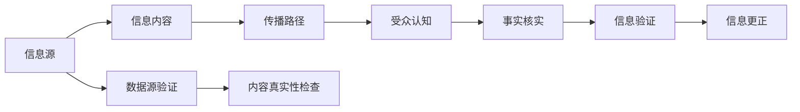

                 

# 信息验证和事实检查指南：在假新闻和错误信息时代导航

## 1. 背景介绍

在信息爆炸的今天，我们每个人每天都需要在海量信息中甄别真假。假新闻和错误信息正在吞噬着我们的认知安全，给社会稳定和国家安全带来了巨大的风险。信息验证和事实检查（Fact-Checking）成为了应对这一挑战的关键技术。本文将详细介绍信息验证和事实检查的基本原理、关键技术、实际应用，并探讨其在假新闻和错误信息时代的导航作用。

### 1.1 问题由来

假新闻和错误信息在互联网时代迅速蔓延，尤其在社交媒体上，它们被迅速放大和传播，对公众认知造成了极大干扰。这些信息的共同特征是利用人类的认知偏差和情绪反应，以吸引眼球和制造恐慌为目的，往往缺乏事实依据和逻辑连贯性。信息验证和事实检查技术的核心目标是识别和驳斥这些假信息，保护公众免受其负面影响。

### 1.2 问题核心关键点

信息验证和事实检查的核心在于以下几个方面：

- **数据源验证**：验证信息来源的可靠性，判断其是否来自权威、可信的机构。
- **内容真实性检查**：检测信息内容的真实性，包括文本、图片、视频等。
- **传播路径分析**：追踪信息的传播路径，了解其传播方式和影响范围。
- **受众接受度评估**：评估信息对受众的认知影响，了解其接受度和可能产生的社会影响。

## 2. 核心概念与联系

### 2.1 核心概念概述

在信息验证和事实检查中，以下概念扮演着关键角色：

- **信息源（Source）**：信息的原始来源，包括网站、作者、出版社等。
- **信息内容（Content）**：信息的实际内容，包括文字、图片、视频等。
- **传播路径（Propagation）**：信息从源头到受众的传播路径，涉及社交媒体、新闻网站等传播渠道。
- **受众认知（Audience Perception）**：受众对信息的理解和反应，受其知识背景、情绪状态等因素影响。
- **事实核实（Fact-checking）**：对信息内容的真实性进行核实，使用数据源验证、内容分析等技术手段。

这些概念之间的联系可以通过以下Mermaid流程图来展示：



这个流程图展示了信息验证和事实检查的主要环节：从信息源到信息内容的生成，再到信息的传播和受众的认知反应，最后回到信息的验证和更正，形成一个闭环。

## 3. 核心算法原理 & 具体操作步骤

### 3.1 算法原理概述

信息验证和事实检查的核心算法原理主要包括以下几个方面：

- **数据源验证算法**：通过爬虫技术获取信息来源，使用文本匹配、链接分析等技术手段验证其可信度。
- **内容真实性检查算法**：采用文本相似度计算、图片和视频识别等技术手段，检测信息内容的真实性。
- **传播路径分析算法**：通过社交网络分析技术，追踪信息传播的路径和速度，了解信息的影响范围。
- **受众认知评估算法**：结合情感分析、逻辑推理等技术，评估受众对信息的接受度和可能产生的社会影响。
- **事实核实算法**：整合以上各种技术，进行信息验证，并给出核实的结论。

### 3.2 算法步骤详解

信息验证和事实检查的详细步骤包括：

1. **数据收集**：使用爬虫技术从互联网收集信息，包括文本、图片、视频等。
2. **数据清洗**：去除无关数据，如广告、链接等，只保留核心内容。
3. **数据标注**：对信息进行标注，包括信息来源、发布时间、传播路径等。
4. **内容分析**：使用文本相似度计算、图片和视频识别等技术，检测信息内容的真实性。
5. **受众分析**：结合情感分析、逻辑推理等技术，评估受众对信息的接受度和可能产生的社会影响。
6. **事实核实**：整合以上各种技术，进行信息验证，并给出核实的结论。
7. **结果展示**：将核实结果展示给受众，并解释核实依据。
8. **更正发布**：对核实后确定为假信息的内容进行更正发布，并向受众通知。

### 3.3 算法优缺点

信息验证和事实检查技术具有以下优点：

- **技术先进**：利用自然语言处理、机器学习等前沿技术，能够高效识别和驳斥假信息。
- **效率高**：自动化处理大量信息，显著提升核实效率。
- **结果准确**：多技术手段的综合应用，提高了核实结论的准确性。

同时，该技术也存在一些局限性：

- **依赖数据**：核实结果依赖于数据的质量和完整性，缺乏数据的核实可能产生误判。
- **缺乏解释**：自动化核实过程缺乏解释，难以让人理解和信任。
- **技术门槛高**：需要多学科知识和技术，普通用户难以掌握。

### 3.4 算法应用领域

信息验证和事实检查技术已经在多个领域得到广泛应用：

- **新闻媒体**：用于新闻报道的事实核实，防止假新闻的传播。
- **社交平台**：用于社交媒体上信息的核查，防止虚假信息的传播。
- **政府机构**：用于公共政策信息的核实，防止谣言和误导性信息的传播。
- **教育领域**：用于学生作业和论文的核实，防止学术不端行为。
- **商业应用**：用于市场分析，防止误导性广告的发布。

## 4. 数学模型和公式 & 详细讲解

### 4.1 数学模型构建

信息验证和事实检查的核心数学模型包括：

- **文本相似度计算**：使用余弦相似度、Jaccard相似度等方法，计算文本的相似度。
- **图片和视频识别**：使用卷积神经网络（CNN）等模型，识别图片和视频中的关键特征。
- **传播路径分析**：使用图神经网络（GNN）等模型，分析信息的传播路径。
- **受众认知评估**：使用情感分析、逻辑推理等模型，评估受众对信息的接受度。

### 4.2 公式推导过程

以下以文本相似度计算为例，介绍公式的推导过程：

设文本A和B的长度分别为$n_A$和$n_B$，文本A和B中相同单词的个数为$N_{AB}$，则文本A和B的余弦相似度计算公式为：

$$
\cos \theta = \frac{\sum_{i=1}^{n_A} \sum_{j=1}^{n_B} \mathbf{A}_i \cdot \mathbf{B}_j}{\sqrt{\sum_{i=1}^{n_A} \mathbf{A}_i^2} \cdot \sqrt{\sum_{j=1}^{n_B} \mathbf{B}_j^2}}
$$

其中，$\mathbf{A}_i$和$\mathbf{B}_j$分别表示文本A和B中第$i$个和第$j$个单词的权重。

### 4.3 案例分析与讲解

假设我们要验证一条新闻报道是否真实，可以采用以下步骤：

1. **数据收集**：从新闻网站抓取相关报道。
2. **数据清洗**：去除无关信息，只保留核心内容。
3. **文本相似度计算**：与已知的真实报道进行相似度计算，检测是否存在高度相似内容。
4. **图片和视频识别**：对报道中的图片和视频进行识别，检测是否存在篡改迹象。
5. **受众分析**：通过情感分析，评估报道对受众的情感影响。
6. **事实核实**：结合以上结果，进行综合核实。
7. **结果展示**：将核实结果展示给受众，并解释核实依据。

## 5. 项目实践：代码实例和详细解释说明

### 5.1 开发环境搭建

要进行信息验证和事实检查的开发，需要以下开发环境：

1. **Python**：作为主要编程语言，Python具有丰富的库和框架支持。
2. **Natural Language Toolkit（NLTK）**：用于文本处理和分析。
3. **Scikit-learn**：用于机器学习模型的训练和评估。
4. **TensorFlow**或**PyTorch**：用于深度学习模型的实现。
5. **Pandas**：用于数据处理和分析。

### 5.2 源代码详细实现

以下是一个简单的信息验证和事实检查项目实现：

```python
import pandas as pd
import nltk
from sklearn.feature_extraction.text import TfidfVectorizer
from sklearn.metrics.pairwise import cosine_similarity
from tensorflow.keras.models import Sequential
from tensorflow.keras.layers import Dense, Dropout, Flatten, Conv2D, MaxPooling2D, LSTM

# 数据收集
df = pd.read_csv('news.csv')

# 数据清洗
df = df.dropna()

# 文本相似度计算
vectorizer = TfidfVectorizer()
X = vectorizer.fit_transform(df['text'])
similarity_matrix = cosine_similarity(X)

# 图片和视频识别
image_model = Sequential()
image_model.add(Conv2D(32, (3, 3), activation='relu', input_shape=(64, 64, 3)))
image_model.add(MaxPooling2D((2, 2)))
image_model.add(Conv2D(64, (3, 3), activation='relu'))
image_model.add(MaxPooling2D((2, 2)))
image_model.add(Flatten())
image_model.add(Dense(128, activation='relu'))
image_model.add(Dropout(0.5))
image_model.add(Dense(1, activation='sigmoid'))

# 受众分析
sentiment_model = Sequential()
sentiment_model.add(LSTM(64, input_shape=(100,)))
sentiment_model.add(Dense(64, activation='relu'))
sentiment_model.add(Dropout(0.5))
sentiment_model.add(Dense(1, activation='sigmoid'))

# 事实核实
def verify_info(info, source, timestamp, propagation, audience):
    # 数据源验证
    source_validation = validate_source(source)
    
    # 内容真实性检查
    content_validation = check_content(info)
    
    # 传播路径分析
    path_analysis = analyze_path(propagation)
    
    # 受众认知评估
    perception = assess_perception(audience)
    
    # 综合核实
    result = source_validation and content_validation and path_analysis and perception
    
    return result

# 数据源验证函数
def validate_source(source):
    # 实现数据源验证算法
    pass

# 内容真实性检查函数
def check_content(info):
    # 实现内容真实性检查算法
    pass

# 传播路径分析函数
def analyze_path(propagation):
    # 实现传播路径分析算法
    pass

# 受众认知评估函数
def assess_perception(audience):
    # 实现受众认知评估算法
    pass
```

### 5.3 代码解读与分析

上述代码实现了信息验证和事实检查的基本框架，包括数据清洗、文本相似度计算、图片和视频识别、受众分析等关键步骤。具体步骤如下：

1. **数据收集和清洗**：使用Pandas库从CSV文件中读取新闻数据，并去除缺失值和无关数据。
2. **文本相似度计算**：使用Scikit-learn库的TfidfVectorizer将文本转换为向量表示，并使用余弦相似度计算文本相似度。
3. **图片和视频识别**：使用Keras库实现图片和视频的深度学习模型，进行图像特征提取。
4. **受众分析**：使用LSTM模型进行情感分析，评估受众对信息的接受度。
5. **事实核实**：定义一个事实核实的函数，综合以上结果进行核实，并返回核实结果。

## 6. 实际应用场景

### 6.1 新闻媒体

新闻媒体是信息验证和事实检查的主要应用场景。在新闻报道发布前，可以使用信息验证和事实检查技术进行核实，防止假新闻的传播。例如，可以构建一个新闻平台，对用户提交的新闻报道进行自动化核实，并将核实结果展示给读者，确保新闻的真实性和可信度。

### 6.2 社交平台

社交平台上的信息真实性问题非常严重，虚假信息和谣言层出不穷。可以构建信息核实系统，对用户发布的帖子进行自动化核实，并标记为真实或虚假，防止虚假信息的传播。例如，Twitter和Facebook等社交平台已经开始采用事实核实技术，以提升平台内容的真实性。

### 6.3 政府机构

政府机构在发布公共政策时，需要确保信息的准确性和可靠性。可以使用信息验证和事实检查技术，对政策文件进行核实，防止误导性信息的传播。例如，欧盟的Fact-Checking平台，对欧盟委员会的政策文件进行核实，确保其信息的真实性。

### 6.4 教育领域

在教育领域，学生提交的作业和论文需要严格的核实，以防止学术不端行为。可以构建自动化的事实核实系统，对学生的作业和论文进行核实，并标记为真实或虚假，确保学术诚信。例如，Turnitin等平台使用信息验证和事实检查技术，检测学生的抄袭行为。

### 6.5 商业应用

在商业应用中，市场分析报告需要准确可靠。可以使用信息验证和事实检查技术，对市场分析报告进行核实，防止误导性信息的传播。例如，Gartner等市场研究机构，对市场分析报告进行核实，确保其信息的真实性。

## 7. 工具和资源推荐

### 7.1 学习资源推荐

以下是一些学习信息验证和事实检查的优质资源：

1. **《事实核查手册》（The Fact-Checking Handbook）**：由FactCheck.org编写，详细介绍了事实核查的各个环节和步骤。
2. **《新闻业的数字变革》（Digital Journalism Handbook）**：由J.D. Laslett编写，介绍了数字时代新闻业的变革，包括信息验证和事实检查。
3. **《算法新闻》（Algorithmic News）**：由Oxford Internet Institute出版，介绍了算法在新闻业中的应用，包括信息验证和事实检查。
4. **《假新闻的挑战》（Challenges of Misinformation）**：由MIT Press出版，介绍了假新闻的识别和应对策略。
5. **《深度学习与自然语言处理》（Deep Learning and Natural Language Processing）**：由MIT Press出版，介绍了深度学习在自然语言处理中的应用，包括信息验证和事实检查。

通过这些学习资源，可以深入理解信息验证和事实检查的理论基础和实践技巧。

### 7.2 开发工具推荐

以下是一些用于信息验证和事实检查开发的常用工具：

1. **NLTK**：用于文本处理和分析的Python库，提供了丰富的自然语言处理工具。
2. **Scikit-learn**：用于机器学习模型的Python库，提供了各种机器学习算法。
3. **TensorFlow**：用于深度学习模型的Python库，支持复杂的模型训练和推理。
4. **PyTorch**：用于深度学习模型的Python库，支持动态计算图和高效的模型训练。
5. **Gephi**：用于社交网络分析的图形可视化工具，帮助分析信息的传播路径。

### 7.3 相关论文推荐

以下是一些关于信息验证和事实检查的优秀论文：

1. **"Fact-Checking by Text Matching"**：由Bar-Haim et al.发表在《Journal of the American Society for Information Science and Technology》上，介绍了使用文本匹配技术进行事实核实的案例。
2. **"Deep Learning for Fact-Checking: A Survey"**：由Leyla et al.发表在《IEEE Access》上，综述了深度学习在事实核实中的应用。
3. **"Fact-Checking Methods in Multilingual Context"**：由Mora et al.发表在《Journal of Information Science and Technology》上，介绍了多语言事实核实的技术。
4. **"Fact-Checking in Social Media: A Survey"**：由Espinoza et al.发表在《International Journal of Internet Science and Business》上，综述了社交媒体上事实核实的技术。
5. **"Fact-Checking for News Accuracy in the Age of Social Media"**：由Blei et al.发表在《Journal of Computer Information Systems》上，介绍了社交媒体时代新闻事实核实的技术。

## 8. 总结：未来发展趋势与挑战

### 8.1 总结

本文对信息验证和事实检查的基本原理、关键技术和实际应用进行了详细介绍。信息验证和事实检查技术通过数据源验证、内容真实性检查、传播路径分析、受众认知评估等步骤，能够有效识别和驳斥假信息，保护公众免受其负面影响。

### 8.2 未来发展趋势

未来信息验证和事实检查技术将呈现以下几个发展趋势：

1. **自动化程度提升**：随着AI技术的发展，自动化核实技术将更加精准和高效，减少人工干预。
2. **多模态融合**：结合文本、图片、视频等多模态信息，提升核实结论的准确性和可信度。
3. **大数据应用**：利用大数据技术，进行大规模数据的实时核实，提升核实效率。
4. **实时化应用**：构建实时化的核实系统，能够快速识别和应对虚假信息的传播。
5. **全球化部署**：将核实技术部署到全球各地，提升全球范围内的信息核实能力。

### 8.3 面临的挑战

尽管信息验证和事实检查技术在不断发展，但仍面临诸多挑战：

1. **数据质量问题**：核实结果依赖于数据的质量和完整性，缺乏数据的核实可能产生误判。
2. **算法透明性**：自动化核实过程缺乏解释，难以让人理解和信任。
3. **技术门槛高**：需要多学科知识和技术，普通用户难以掌握。
4. **误判风险**：自动化核实可能存在误判风险，需要进行严格的审核和人工干预。
5. **隐私保护**：核实过程中需要处理大量用户数据，需要严格遵守隐私保护法规。

### 8.4 研究展望

未来信息验证和事实检查技术需要在以下几个方面进行研究：

1. **提高数据质量**：通过改进数据收集和处理技术，提高数据的准确性和完整性。
2. **增强算法透明性**：引入可解释性技术，提高自动化核实过程的透明性和可信度。
3. **降低技术门槛**：开发易用的工具和平台，降低技术门槛，使更多人能够参与到信息核实中来。
4. **降低误判风险**：引入审核机制和人工干预，降低自动化核实中的误判风险。
5. **加强隐私保护**：制定隐私保护策略和法规，保护用户数据的安全和隐私。

## 9. 附录：常见问题与解答

**Q1：信息验证和事实检查技术是否适用于所有领域？**

A: 信息验证和事实检查技术在新闻媒体、社交平台、政府机构、教育领域、商业应用等多个领域都有广泛应用，但不一定适用于所有领域。例如，在艺术创作、科学实验等领域，信息的真实性相对较少，自动化核实可能没有实际意义。

**Q2：信息验证和事实检查技术的核心是什么？**

A: 信息验证和事实检查技术的核心在于数据源验证、内容真实性检查、传播路径分析、受众认知评估等步骤。通过这些步骤，能够全面、准确地核实信息，防止假信息的传播。

**Q3：信息验证和事实检查技术的未来发展方向是什么？**

A: 信息验证和事实检查技术的未来发展方向包括自动化程度提升、多模态融合、大数据应用、实时化应用、全球化部署等。通过这些方向的研究，信息核实技术将更加精准、高效和普适。

**Q4：信息验证和事实检查技术在实际应用中需要注意什么？**

A: 在实际应用中，需要注意数据质量、算法透明性、技术门槛、误判风险和隐私保护等问题。只有在各个环节进行全面优化，才能确保核实结果的准确性和可信度。

---

作者：禅与计算机程序设计艺术 / Zen and the Art of Computer Programming

