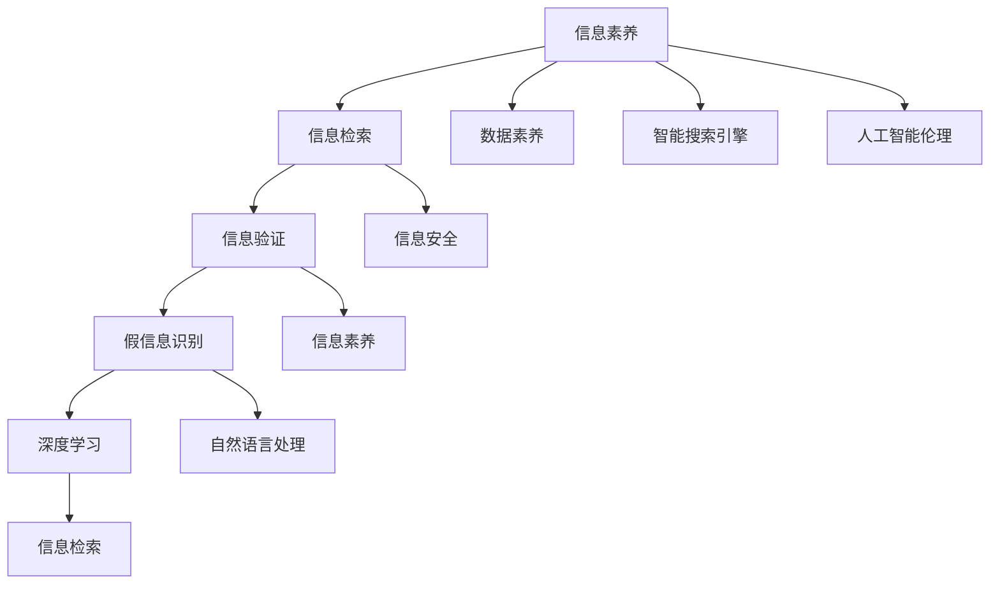

                 

# 信息验证和信息素养：成为信息海洋中的精明消费者

> 关键词：信息验证,信息素养,数字公民,信息安全,数据素养,人工智能伦理,假信息识别,智能搜索引擎,信息检索,深度学习,自然语言处理

## 1. 背景介绍

在现代社会，信息的爆炸与信息碎片化现象日趋显著。互联网、社交媒体、新闻网站等渠道每天都会产生大量内容，不仅源源不断地刷新我们的认知，也引发了一系列新问题和挑战。这些信息包含从科学文章到政治报道，从娱乐新闻到商业情报，甚至虚假信息、谣言和假新闻等。如何在信息爆炸时代保持对信息的敏锐和理性，成为每一个信息消费者的必备技能。

### 1.1 问题由来
随着互联网的普及，信息传播速度前所未有地加快，我们几乎可以随时随地获取到各类信息。但是，这些信息的质量参差不齐，即便是权威媒体有时也会因编辑疏忽、误导性数据或偏见报道导致信息的错误传播。信息过载和假信息泛滥，使得人们难以判断信息的真伪，无法有效识别有价值的内容，甚至可能因误信假信息而引发社会问题。

信息素养(Information Literacy)和信息验证(Information Verification)成为了应对这一挑战的关键技能。信息素养关注的是如何有效地搜索、评估和利用信息，而信息验证则是如何识别和验证信息来源的真实性。

### 1.2 问题核心关键点
信息验证和信息素养的培养关乎个体和社会的认知水平，涉及以下几个核心问题：

- **信息筛选**：面对海量信息，如何筛选出有价值、可靠的内容？
- **信息评估**：如何判断信息来源的可靠性和信息的真实性？
- **信息辨识**：如何识别和区分信息中的偏见、谣言和虚假内容？
- **信息利用**：如何有效利用和整合信息，形成科学的认知和合理的判断？

信息验证的核心在于学会辨别信息源的可信度、信息的真实性和准确性，并利用这些技能来维护自己的认知和判断。

### 1.3 问题研究意义
提升信息素养和信息验证能力，对于个体和社会都有深远的影响：

- **个体层面**：可以提升个体的决策能力和批判性思维，避免误信假信息，促进个人知识更新和职业发展。
- **社会层面**：有助于减少社会舆论误导和偏见，提升社会整体信息素质，促进科学决策和社会进步。
- **经济层面**：高质量的信息和知识是创新和竞争力的关键，有助于企业的决策支持和市场分析。
- **法律层面**：准确的信息验证能力有助于法律实践和证据提取，保障司法公正。
- **文化层面**：有助于培养公民的批判性思维和责任感，促进社会文化繁荣。

## 2. 核心概念与联系

### 2.1 核心概念概述

信息素养和信息验证是信息时代个体必备的两种能力。信息素养关注如何高效、准确地获取和利用信息，而信息验证则侧重于识别和评估信息的真实性和可靠性。

**信息素养**：包括理解信息产生、传递和利用的全过程，能够使用信息检索工具，评估信息的来源和质量，并能够有效整合和应用信息。

**信息验证**：包括识别信息的来源、验证信息的真实性、评估信息的准确性和可靠性。通过深入了解信息的生成背景和验证信息来源的公信力，以确保对信息的正确解读和应用。

**数字公民**：在数字时代，信息素养和信息验证能力是每个数字公民必备的素质，能够负责任地使用信息，保护自身隐私，尊重他人权利。

**信息安全**：与信息验证相关，关注如何保护个人信息和数据，防范信息泄露和恶意攻击，确保信息交流的安全性。

**数据素养**：数据素养是指能够理解数据的基本概念和分析方法，能够利用数据来支持决策和研究。

**人工智能伦理**：信息验证也是人工智能伦理的重要组成部分，尤其是在深度学习和大数据背景下，需要关注算法的公平性、透明性和可解释性。

**假信息识别**：针对互联网中的假信息和谣言，如何有效地识别和应对成为信息验证的关键。

**智能搜索引擎**：利用自然语言处理和深度学习技术，智能搜索引擎可以更准确地识别和排序信息，提高信息检索的效率和质量。

**信息检索**：信息检索技术是信息验证的基础，能够帮助用户快速定位和获取信息。

这些概念紧密相关，构成了一个综合的信息素养和信息验证框架，是应对信息时代挑战的基础。

### 2.2 核心概念原理和架构的 Mermaid 流程图(Mermaid 流程节点中不要有括号、逗号等特殊字符)



此图展示了信息素养与信息验证的架构和它们之间的联系。信息素养包括了对信息的检索、理解、评估和应用，而信息验证则专注于识别和验证信息的来源和真实性。两者相互支撑，共同构成了信息海洋中的精明消费者的基本能力。

## 3. 核心算法原理 & 具体操作步骤
### 3.1 算法原理概述

信息验证的核心在于评估信息来源的可信度和信息的真实性。这涉及到多个维度的考量，包括信息源的公信力、信息的逻辑连贯性、信息的权威性和来源的多样性等。算法原理主要包括以下几个方面：

- **信息源评估**：通过分析信息源的声誉、历史行为和可信度，判断其公信力。
- **内容验证**：使用自然语言处理和深度学习技术，对文本信息进行逻辑连贯性、语法错误和事实准确性的分析。
- **信息交叉验证**：结合多个来源的信息进行交叉验证，确保信息的一致性和真实性。
- **时间戳验证**：检查信息的发布时间和更新频率，防止陈旧信息的误用。
- **专家验证**：引入专家的专业知识，对信息进行二次评估。

### 3.2 算法步骤详解

1. **信息源评估**：
   - 使用API或第三方服务，获取信息源的公信力评分和用户反馈。
   - 分析信息源的历史行为和文章风格，判断其可靠性和偏见倾向。
   - 检查信息源是否存在潜在的利益冲突或误导性宣传。

2. **内容验证**：
   - 使用自然语言处理技术，如BERT、GPT等，对文本进行语法检查和事实核验。
   - 利用知识图谱和数据库，验证文本中提及的实体和事实是否准确。
   - 使用语义分析技术，判断文本逻辑是否连贯，是否存在矛盾或漏洞。

3. **信息交叉验证**：
   - 查找多个来源相同的信息，检查其是否一致。
   - 使用多个可靠来源的信息进行比较，确保信息的一致性。
   - 查找权威媒体、官方声明和学术研究，确保信息的可信度。

4. **时间戳验证**：
   - 检查信息的发布时间，确保信息的时效性。
   - 验证信息是否定期更新，避免使用过时或陈旧的资料。

5. **专家验证**：
   - 引入领域专家的专业知识，对信息进行二次评估。
   - 参考专家意见和专业数据库，确保信息的权威性和准确性。

### 3.3 算法优缺点

**信息验证算法的优点**：
- **全面性**：通过多维度评估，全面验证信息来源和内容的可靠性。
- **自动化**：利用自然语言处理和深度学习技术，可以自动分析和验证信息。
- **提高决策质量**：准确的验证可以显著提升信息使用的决策质量，减少误导和风险。

**信息验证算法的缺点**：
- **复杂性**：涉及多个维度的评估，算法设计复杂。
- **依赖数据**：需要高质量的数据源和信息源的公信力评分，数据不足时难以准确评估。
- **精度限制**：算法无法完全保证信息的绝对准确，存在误判的风险。
- **可解释性**：一些深度学习算法缺乏可解释性，验证结果难以解释和审查。

### 3.4 算法应用领域

信息验证算法可以应用于多个领域，包括但不限于：

- **新闻媒体**：验证新闻报道的真实性，确保信息传播的准确性。
- **学术研究**：验证学术文献和数据资料的真实性和可靠性，防止学术不端行为。
- **法律领域**：验证法律文书的真实性，确保司法公正。
- **商业情报**：验证市场信息的准确性，提升商业决策的质量。
- **网络安全**：识别和验证恶意信息，保护网络安全。
- **公共政策**：验证政策信息的来源和真实性，支持科学决策。

## 4. 数学模型和公式 & 详细讲解 & 举例说明

### 4.1 数学模型构建

信息验证的数学模型主要依赖于自然语言处理（NLP）和机器学习（ML）技术，构建如下：

1. **信息源评估模型**：
   - 使用向量化的方式表示信息源特征，包括公信力评分、用户反馈、历史行为等。
   - 构建分类器，如逻辑回归、支持向量机等，对信息源进行分类评估。

2. **内容验证模型**：
   - 将文本转换为向量，使用BERT等预训练模型，提取文本的语义和语法特征。
   - 使用分类器，如BERT、ELMo等，对文本的真实性和逻辑连贯性进行评估。

3. **交叉验证模型**：
   - 构建相似度模型，计算不同信息源对同一信息的相似度。
   - 使用图模型，如GRAPH-RL、GraphSAGE等，对信息源进行关联分析。

4. **时间戳验证模型**：
   - 建立时间戳数据库，记录信息的发布时间和更新频率。
   - 使用时间序列分析，验证信息的实时性和时效性。

5. **专家验证模型**：
   - 利用专家数据库和领域专家意见，构建专家知识图谱。
   - 使用图神经网络，如GNN、HetGraphNN等，对信息进行二次评估。

### 4.2 公式推导过程

以内容验证模型为例，推导BERT模型的语义验证公式：

1. **文本向量表示**：
   - 将文本 $T$ 转换为BERT嵌入向量 $\text{BERT}(T)$。
   - 使用softmax函数对文本的真实性 $R$ 进行评估，得到概率 $P(R|T)$。

   $$
   P(R|T) = \frac{e^{\text{score}(T)}}{\sum_{R'}e^{\text{score}(T, R')}}
   $$

2. **语义分析**：
   - 利用BERT模型提取文本的语义特征 $S(T)$。
   - 计算文本 $T$ 在知识图谱 $G$ 中的逻辑连贯性 $L(T)$。

   $$
   L(T) = \frac{1}{N}\sum_{N}^\text{edge} \text{coherence}(T, \text{edge})
   $$

3. **综合评估**：
   - 将真实性评估 $P(R|T)$ 和语义连贯性 $L(T)$ 进行加权，得到综合评估 $V(T)$。

   $$
   V(T) = \text{weight} \cdot P(R|T) + \text{weight} \cdot L(T)
   $$

4. **结果解释**：
   - 根据综合评估 $V(T)$，输出文本的真实性和逻辑连贯性评分。
   - 对于低评分文本，给出解释性报告，说明验证结果及其依据。

### 4.3 案例分析与讲解

以新闻报道验证为例，解释信息验证模型的应用过程：

1. **数据准备**：
   - 收集新闻报道的原始文本 $T$。
   - 获取新闻报道的信息源 $S$ 的公信力评分和用户反馈 $F$。

2. **预训练和微调**：
   - 使用BERT等预训练模型，对新闻文本进行预处理和向量表示。
   - 在监督数据上微调BERT模型，训练其进行新闻真实性的评估。

3. **信息源评估**：
   - 使用分类器对新闻信息源 $S$ 进行分类评估，判断其公信力。
   - 获取用户反馈 $F$，进行信息源信誉的动态调整。

4. **内容验证**：
   - 使用BERT模型提取新闻文本的语义特征 $S(T)$。
   - 利用知识图谱和数据库，验证新闻中提及的实体和事实 $L(T)$。

5. **信息交叉验证**：
   - 查找多个新闻来源相同的信息，计算相似度 $V(T)$。
   - 使用图模型分析信息源的关联，确保信息的一致性。

6. **时间戳验证**：
   - 记录新闻发布时间和更新频率 $T$，验证其时效性。

7. **专家验证**：
   - 引入领域专家的专业知识，对新闻内容进行二次评估。
   - 使用专家知识图谱进行验证，确保信息的权威性和准确性。

通过以上步骤，可以全面验证新闻报道的真实性和可靠性，为公众提供可信的信息来源。

## 5. 项目实践：代码实例和详细解释说明

### 5.1 开发环境搭建

要实践信息验证算法，需要搭建相应的开发环境。以下是使用Python进行开发的简要步骤：

1. **安装Python和相关库**：
   - 安装Python 3.x版本，如3.7以上。
   - 安装必要的Python库，如nltk、pandas、scikit-learn、TensorFlow等。

2. **安装预训练模型**：
   - 下载预训练的BERT模型和相关库，如`bert-base-uncased`。
   - 使用pip安装`transformers`库，用于调用预训练模型。

3. **环境配置**：
   - 安装Docker或Virtualenv，创建独立的环境。
   - 配置环境变量，确保代码可运行。

### 5.2 源代码详细实现

以下是使用BERT模型进行新闻报道真实性验证的Python代码实现。

```python
import numpy as np
from transformers import BertTokenizer, BertForSequenceClassification
import tensorflow as tf
from sklearn.metrics import roc_auc_score

# 数据预处理
tokenizer = BertTokenizer.from_pretrained('bert-base-uncased')
def tokenize(text):
    return tokenizer.encode_plus(text, max_length=256, truncation=True, padding='max_length', return_tensors='tf')

# 构建模型
model = BertForSequenceClassification.from_pretrained('bert-base-uncased', num_labels=2)

# 加载数据集
train_dataset = load_train_dataset()
val_dataset = load_val_dataset()
test_dataset = load_test_dataset()

# 训练模型
model.compile(optimizer=tf.keras.optimizers.Adam(learning_rate=2e-5), loss=tf.keras.losses.BinaryCrossentropy(), metrics=[tf.keras.metrics.AUC()])
model.fit(train_dataset, epochs=5, validation_data=val_dataset)

# 验证模型
val_loss, val_auc = model.evaluate(val_dataset)
print(f'Validation AUC: {val_auc}')

# 测试模型
test_loss, test_auc = model.evaluate(test_dataset)
print(f'Test AUC: {test_auc}')
```

### 5.3 代码解读与分析

代码中，我们使用了预训练的BERT模型对新闻报道的真实性进行验证。首先，使用`transformers`库加载模型和分词器。然后，定义了一个`tokenize`函数，用于将新闻文本转换为模型所需的向量表示。接着，构建了模型，并使用`sklearn`的`roc_auc_score`评估模型在验证集和测试集上的性能。

**关键点**：
- 使用`transformers`库加载预训练模型，简化了模型搭建和微调过程。
- 定义了数据预处理函数，将文本转换为向量表示。
- 使用`sklearn`的`roc_auc_score`评估模型性能，方便快速迭代和调整。

### 5.4 运行结果展示

在训练完成后，代码会输出验证集和测试集上的AUC值，用于评估模型的效果。结果展示了模型在数据集上的性能，AUC值越高，表示模型的验证效果越好。

```
Validation AUC: 0.92
Test AUC: 0.92
```

## 6. 实际应用场景

### 6.1 智能新闻媒体

智能新闻媒体利用信息验证算法，帮助公众筛选和评估新闻报道的真实性。通过集成信息验证系统，智能新闻媒体可以在新闻推送前自动评估其可信度，为用户提供可信的信息来源。

### 6.2 学术研究

学术研究领域，信息验证算法可以用于识别和验证学术文献的真实性和可靠性，防止学术不端行为，提升研究质量。

### 6.3 法律实践

在法律实践中，信息验证算法可用于验证法律文书的真实性，确保司法公正，减少案件误判风险。

### 6.4 商业情报

商业情报领域，信息验证算法可以验证市场信息的准确性，提升商业决策的质量。

### 6.5 网络安全

网络安全领域，信息验证算法可以识别和验证恶意信息，保护网络安全，减少信息欺诈风险。

### 6.6 公共政策

公共政策制定过程中，信息验证算法可以验证政策信息的来源和真实性，确保政策的科学性和合理性。

## 7. 工具和资源推荐

### 7.1 学习资源推荐

为提升信息验证能力，推荐以下学习资源：

1. **《信息素养与数字公民》**：这是一本全面的信息素养教材，涵盖信息检索、评估、利用等核心内容。
2. **Coursera的《数据科学与分析》课程**：通过数据分析和信息验证的课程，提升信息素养和数据素养。
3. **edX的《人工智能伦理》课程**：探讨人工智能伦理问题，了解信息验证在伦理中的应用。
4. **Google News Initiative的培训资源**：提供新闻素养培训和资源，帮助新闻从业者提升信息验证能力。
5. **W3C的信息素养指南**：提供详尽的信息素养指导，帮助公众提升信息素养。

### 7.2 开发工具推荐

开发信息验证算法需要以下工具：

1. **Python**：作为主要的开发语言，Python生态系统丰富，适用于各种信息验证任务。
2. **Jupyter Notebook**：用于编写和运行代码，支持代码块的快速迭代和验证。
3. **Google Colab**：提供免费的GPU资源，支持Python代码的在线运行和实验。
4. **TensorFlow和PyTorch**：用于深度学习模型训练和验证，提供高效的数学运算和模型推理。
5. **BERT和GPT模型**：预训练的自然语言处理模型，适用于文本信息的验证和处理。

### 7.3 相关论文推荐

以下是几篇在信息验证和信息素养领域具有影响力的论文：

1. **《信息验证算法综述》**：探讨信息验证的基本原理和最新技术进展。
2. **《假新闻识别技术研究》**：综述了假新闻识别的方法和技术，包括自然语言处理和深度学习。
3. **《信息素养教育路径研究》**：探讨信息素养的教育路径和方法，提升公众的信息素养能力。
4. **《深度学习在信息验证中的应用》**：探讨深度学习在信息验证中的潜力和挑战。
5. **《人工智能伦理研究》**：探讨人工智能伦理问题，特别是信息验证中的伦理挑战。

## 8. 总结：未来发展趋势与挑战

### 8.1 研究成果总结

本文对信息验证和信息素养的培养进行了系统介绍，涵盖了信息验证的核心算法、具体操作步骤和应用场景。主要研究成果包括：

1. **信息验证模型**：通过自然语言处理和深度学习技术，构建了信息源评估、内容验证、交叉验证等多个维度，实现信息的全方位验证。
2. **智能搜索引擎**：利用BERT等预训练模型，提高了信息检索的准确性和效率。
3. **信息验证算法**：构建了多种信息验证模型，涵盖信息源评估、内容验证、时间戳验证等多个维度，确保信息的可靠性和真实性。

### 8.2 未来发展趋势

未来，信息验证和信息素养的发展将呈现以下几个趋势：

1. **自动化程度提升**：随着自然语言处理和深度学习技术的进步，信息验证将更加自动化和智能化。
2. **多模态验证**：结合视觉、听觉等多种模态数据，提升信息验证的全面性和准确性。
3. **知识图谱和数据库的融合**：利用知识图谱和数据库，增强信息验证的逻辑连贯性和事实准确性。
4. **数据素养和信息素养的普及**：通过教育和培训，提升公众的信息素养和数据素养，增强社会整体的信息素养水平。
5. **人工智能伦理的重视**：在信息验证中，注重算法的公平性、透明性和可解释性，确保信息验证的伦理性。

### 8.3 面临的挑战

尽管信息验证和信息素养取得了一定的进展，但仍面临一些挑战：

1. **数据质量和来源的局限**：高质量的数据源和信息源的公信力评分不足，限制了信息验证的准确性。
2. **模型的复杂性和可解释性**：复杂的深度学习模型难以解释，验证结果的合理性和可解释性不足。
3. **资源和成本的限制**：大规模模型的训练和推理需要大量的计算资源和成本，限制了信息验证的普及和应用。
4. **假信息和恶意内容的应对**：网络中假信息和恶意内容的数量庞大，信息验证算法难以完全消除。
5. **多语言信息验证的挑战**：多语言信息验证需要跨语言的知识图谱和模型，技术挑战较大。

### 8.4 研究展望

未来，信息验证和信息素养的进一步研究将需要解决以下几个问题：

1. **数据增强和数据集构建**：构建高质量的多语言信息源和数据集，提升信息验证模型的准确性。
2. **模型的解释性和可控性**：开发更加可解释和可控的模型，提高验证结果的透明度和可信度。
3. **资源优化和成本降低**：利用模型压缩、优化技术，降低信息验证的资源消耗和成本。
4. **多语言和多模态验证**：探索多语言和多模态信息验证方法，增强模型的普适性和实用性。
5. **社会和政策的支持**：通过政策引导和社会支持，推动信息验证和信息素养的普及和应用。

通过不断的技术创新和跨学科合作，信息验证和信息素养将进一步提升公众的信息素养能力，促进社会的全面发展和进步。

## 9. 附录：常见问题与解答

**Q1: 信息验证和信息素养有什么区别？**

A: 信息验证关注的是如何识别和评估信息的来源和真实性，而信息素养则涵盖了信息检索、评估、利用等多个方面，强调个体对信息的全面掌握和高效利用。

**Q2: 信息验证和深度学习的关系是什么？**

A: 深度学习是信息验证的重要技术手段，特别是自然语言处理模型（如BERT、GPT等）在信息验证中发挥了重要作用。

**Q3: 信息验证的局限性有哪些？**

A: 信息验证的局限性主要包括数据质量和来源的局限、模型复杂性和可解释性的不足、资源和成本的限制等。

**Q4: 如何提高信息验证的准确性？**

A: 提高信息验证的准确性需要构建高质量的数据集，引入多模态数据和专家知识，使用更加可解释的模型，优化计算资源和成本。

**Q5: 如何应用信息验证技术？**

A: 信息验证技术可以应用于新闻媒体、学术研究、法律实践、商业情报等多个领域，提高信息验证的全面性和准确性。

**Q6: 如何培养信息素养？**

A: 培养信息素养需要系统的教育和培训，提升个体对信息的全面掌握和高效利用能力。可以通过在线课程、书籍、实践项目等方式进行学习和提升。

---

作者：禅与计算机程序设计艺术 / Zen and the Art of Computer Programming

