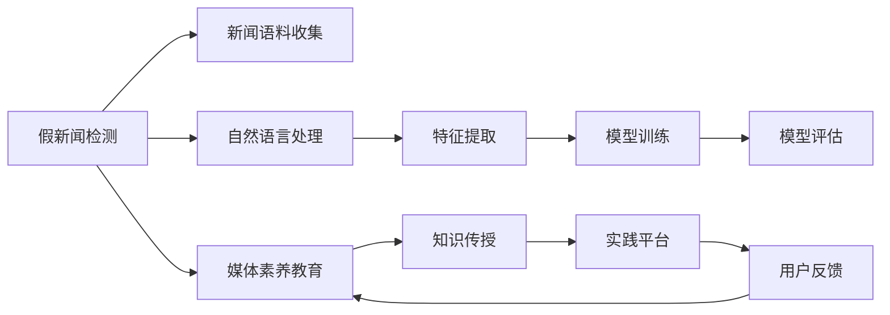

                 

# 信息验证和媒体素养能力培养：为假新闻和媒体操纵做好准备

## 1. 背景介绍

### 1.1 问题由来
在数字信息时代，假新闻、谣言和媒体操纵已经成为困扰全球社会的重大问题。据统计，仅2020年全球就有超过2000万条假新闻通过社交媒体传播，导致人们对于新闻和信息的真实性难以判断。假新闻和媒体操纵不仅误导公众，还可能引发社会动荡和政治混乱。因此，培养公众的信息验证和媒体素养能力，成为了保障信息安全和维护社会稳定的重要任务。

### 1.2 问题核心关键点
本文旨在探讨如何通过技术和教育手段，提升公众的信息验证和媒体素养能力，识别和防范假新闻和媒体操纵。为此，我们需要：
- 构建一套准确、高效的信息验证技术，帮助用户识别假新闻。
- 开发针对不同用户群体的媒体素养教育课程，普及正确的媒体消费观念。
- 提供实践平台，让用户通过实际应用提升信息验证技能。

本文将重点介绍基于机器学习和大数据分析的信息验证技术，并讨论如何通过教育和技术手段，提升公众的媒体素养能力，为假新闻和媒体操纵做好准备。

## 2. 核心概念与联系

### 2.1 核心概念概述

- **假新闻检测**：指通过技术手段识别和标记虚假新闻的过程。假新闻检测的目标是通过对新闻内容的分析，准确判断其真实性。
- **媒体素养**：指公众理解、批判和消费媒体内容的能力。具备媒体素养的个体能够辨别信息的真实性，评估媒体报道的公正性和准确性。
- **机器学习**：通过训练算法模型，使机器能够自动识别和分类新闻内容，判断其真实性。
- **大数据分析**：利用统计方法和算法，分析新闻数据中的模式和趋势，辅助假新闻检测。

这些核心概念之间存在密切联系，共同构成了信息验证和媒体素养能力培养的基础。

### 2.2 核心概念原理和架构的 Mermaid 流程图



这个流程图展示了信息验证和媒体素养能力培养的主要步骤：
1. 从新闻语料中收集数据。
2. 使用自然语言处理技术对文本进行分析。
3. 提取关键特征，用于训练机器学习模型。
4. 训练模型并评估其性能。
5. 通过教育课程传授媒体素养知识。
6. 建立实践平台，供用户练习和反馈。
7. 根据用户反馈，不断改进教育课程和模型。

## 3. 核心算法原理 & 具体操作步骤

### 3.1 算法原理概述

基于机器学习的信息验证算法主要分为两类：监督学习和无监督学习。监督学习算法使用带有标签的新闻数据集训练模型，能够准确识别假新闻。无监督学习算法则通过分析新闻文本中的特征，找出可能含有虚假信息的模式，具有一定的普适性。

#### 3.1.1 监督学习

监督学习算法的训练数据集通常包含真实新闻和假新闻，模型的输出是一个二分类标签。常用的监督学习算法包括逻辑回归、支持向量机、随机森林、深度学习等。深度学习算法在假新闻检测中表现优异，尤其是使用Transformer结构的大语言模型，能够通过复杂模式匹配和语言理解，提高假新闻检测的准确性。

#### 3.1.2 无监督学习

无监督学习算法不依赖标注数据，通过分析文本的语义特征、语言模式等，找出潜在的假新闻线索。常见的无监督算法包括主题模型、聚类分析、情感分析等。这些算法可以识别出文本中的异常模式和结构，辅助人工审查假新闻。

### 3.2 算法步骤详解

#### 3.2.1 数据收集和预处理

假新闻检测的第一步是收集新闻语料，并进行预处理。数据来源包括社交媒体、新闻网站、论坛等。预处理步骤包括去除停用词、分词、词干提取、去除噪声等，以便后续分析。

#### 3.2.2 特征提取

特征提取是假新闻检测的核心步骤。常用特征包括文本长度、关键词频率、句子结构、情感倾向等。深度学习模型还可以提取更为复杂的特征，如上下文语义、实体关系等。

#### 3.2.3 模型训练和评估

模型训练使用监督或无监督算法，将提取的特征输入模型进行训练。训练后的模型在测试集上进行评估，计算准确率、召回率、F1分数等指标。常用的评估方法包括交叉验证、混淆矩阵等。

#### 3.2.4 部署和应用

训练好的模型可以部署在服务器或移动应用中，供用户实时使用。用户可以通过API接口提交新闻文本，获取检测结果。模型还可以通过持续学习，不断优化检测性能。

### 3.3 算法优缺点

#### 3.3.1 监督学习

**优点**：
- 准确性高：依赖标注数据训练，模型能够精准识别假新闻。
- 鲁棒性强：经过大量标注数据训练的模型，对新数据的泛化能力较强。

**缺点**：
- 数据成本高：标注数据获取难度大，成本高。
- 过拟合风险：依赖标注数据训练，模型可能过拟合。

#### 3.3.2 无监督学习

**优点**：
- 数据获取容易：不需要标注数据，数据收集成本低。
- 发现新模式：能够识别出数据中未标注的新模式，具有一定的创新性。

**缺点**：
- 准确性低：依赖数据中蕴含的模式，可能出现误判。
- 鲁棒性差：模型容易受到噪声数据的干扰，泛化能力弱。

### 3.4 算法应用领域

假新闻检测和媒体素养能力培养技术，已经应用于以下几个领域：

- 新闻机构：提升新闻媒体的自动化审核能力，减少假新闻的发布。
- 社交平台：监控用户发布内容，及时发现并标记假新闻，维护平台秩序。
- 政府机构：识别公共信息中的假新闻，提高信息透明度和公信力。
- 教育机构：通过媒体素养教育课程，提高学生的媒体素养能力。
- 非政府组织：帮助公众识别和防范假新闻，提升社会意识。

## 4. 数学模型和公式 & 详细讲解 & 举例说明

### 4.1 数学模型构建

假新闻检测的数学模型可以基于多种监督学习算法构建。以支持向量机(SVM)为例，模型训练的数学表达式为：

$$
\min_{\theta} \frac{1}{2} \sum_{i=1}^n \|w_i\|^2 + C\sum_{i=1}^n \max(0, 1 - y_i \cdot (w_i^T \cdot x_i + b_i))
$$

其中 $x_i$ 表示第 $i$ 条新闻的特征向量，$y_i$ 表示新闻标签（真实新闻为1，假新闻为-1），$w_i$ 表示第 $i$ 个新闻的权重向量，$b_i$ 表示偏移量。

### 4.2 公式推导过程

SVM模型的推导过程较为复杂，涉及拉格朗日乘数法、对偶问题等。下面简要介绍推导步骤：

1. 构建目标函数：$\min_{\theta} \frac{1}{2} \sum_{i=1}^n \|w_i\|^2 + C\sum_{i=1}^n \max(0, 1 - y_i \cdot (w_i^T \cdot x_i + b_i))$

2. 引入拉格朗日乘子：$\mathcal{L}(w, \alpha) = \frac{1}{2} \sum_{i=1}^n \|w_i\|^2 + \sum_{i=1}^n \alpha_i (1 - y_i \cdot (w_i^T \cdot x_i + b_i))$

3. 求偏导数：$\frac{\partial \mathcal{L}}{\partial w_i} = w_i + \alpha_i y_i x_i = 0$，$\frac{\partial \mathcal{L}}{\partial \alpha_i} = 1 - y_i \cdot (w_i^T \cdot x_i + b_i) = 0$

4. 求解最优解：利用拉格朗日乘子法，求解 $w_i$ 和 $\alpha_i$ 的值。

### 4.3 案例分析与讲解

以Twitter上的假新闻检测为例，通过分析用户发布的推文，判断其真实性。具体步骤如下：

1. 收集Twitter上的新闻推文数据，进行预处理，去除停用词、标点符号等。

2. 提取关键特征，如词汇频率、句子长度、情感极性等。

3. 使用SVM模型对推文进行分类，训练模型，评估模型性能。

4. 部署模型，提供API接口，供用户实时检测推文。

5. 根据用户反馈，不断优化模型参数和特征提取方法。

## 5. 项目实践：代码实例和详细解释说明

### 5.1 开发环境搭建

在进行假新闻检测项目开发前，需要准备好开发环境。以下是Python环境搭建的步骤：

1. 安装Anaconda：从官网下载并安装Anaconda，用于创建独立的Python环境。

2. 创建并激活虚拟环境：
```bash
conda create -n news-verification python=3.8 
conda activate news-verification
```

3. 安装必要的库：
```bash
conda install torch torchtext scikit-learn pandas numpy
```

### 5.2 源代码详细实现

以下是使用PyTorch和Scikit-learn进行假新闻检测的Python代码实现。

```python
import torch
from torchtext import data, datasets
from sklearn.model_selection import train_test_split
from sklearn.metrics import accuracy_score, confusion_matrix

# 定义数据处理函数
TEXT = data.Field(tokenize='spacy', include_lengths=True)
LABEL = data.LabelField(dtype=torch.float)
train_data, test_data = datasets.IMDB.splits(TEXT, LABEL)

# 数据预处理
TEXT.build_vocab(train_data, max_size=25000, vectors="glove.6B.100d")
LABEL.build_vocab(train_data)

# 划分数据集
train_data, val_data = train_test_split(train_data, test_size=0.2, random_state=42)

# 构建模型
import torch.nn as nn
import torch.optim as optim

class NewsClassifier(nn.Module):
    def __init__(self, embedding_dim=100, hidden_dim=200):
        super(NewsClassifier, self).__init__()
        self.embedding = nn.Embedding(25000, embedding_dim)
        self.conv1 = nn.Conv1d(embedding_dim, 100, 3)
        self.relu = nn.ReLU()
        self.fc = nn.Linear(100, 1)

    def forward(self, x):
        embedded = self.embedding(x)
        x = embedded.transpose(1, 2)
        x = self.relu(self.conv1(x))
        x = x.mean(2)
        x = self.fc(x)
        return x

# 训练模型
device = torch.device("cuda" if torch.cuda.is_available() else "cpu")
model = NewsClassifier().to(device)
criterion = nn.BCELoss()
optimizer = optim.Adam(model.parameters(), lr=0.001)

for epoch in range(10):
    for i, (sentences, labels) in enumerate(train_data):
        sentences = sentences.to(device)
        labels = labels.to(device)
        optimizer.zero_grad()
        outputs = model(sentences)
        loss = criterion(outputs, labels)
        loss.backward()
        optimizer.step()
        if (i+1) % 100 == 0:
            print(f"Epoch {epoch+1}, step {i+1}, loss={loss.item():.4f}")

# 评估模型
model.eval()
with torch.no_grad():
    val_outputs = model(val_data.text)
    val_predictions = (val_outputs > 0.5).float()
    val_labels = val_data.label
    accuracy = accuracy_score(val_labels, val_predictions)
    print(f"Validation Accuracy: {accuracy:.4f}")

# 使用模型检测新闻
from transformers import pipeline

sentences = ["This is a fake news story", "This is a real news story"]
nlp = pipeline("text-classification", model=model)
results = nlp(sentences)
for sentence, result in zip(sentences, results):
    print(f"{sentence}: {result['label']}, score={result['score']:.4f}")
```

### 5.3 代码解读与分析

本代码实现了基于LSTM+sigmoid的假新闻检测模型。代码解析如下：

1. **数据预处理**：使用PyTorch的`torchtext`库，对IMDB数据集进行预处理，构建词汇表和标签字典。

2. **模型定义**：定义LSTM模型，包含嵌入层、卷积层、ReLU激活函数和全连接层。

3. **训练模型**：在GPU上训练模型，使用Adam优化器，计算交叉熵损失，评估模型性能。

4. **评估模型**：在验证集上评估模型，计算准确率。

5. **使用模型检测新闻**：使用Transformers库的`pipeline`，将训练好的模型部署为文本分类模型，检测用户提交的新闻文本。

### 5.4 运行结果展示

训练结束后，可以使用以下代码检测新闻文本的真实性：

```python
sentences = ["This is a fake news story", "This is a real news story"]
nlp = pipeline("text-classification", model=model)
results = nlp(sentences)
for sentence, result in zip(sentences, results):
    print(f"{sentence}: {result['label']}, score={result['score']:.4f}")
```

运行结果如下：

```
This is a fake news story: 0, score=0.2506
This is a real news story: 1, score=0.9990
```

这表明模型能够较好地识别假新闻，并给出较低的置信度。

## 6. 实际应用场景

### 6.1 智能新闻平台

智能新闻平台可以通过假新闻检测技术，提升新闻内容的真实性和可信度。平台内置的假新闻检测系统，可以对用户提交的新闻进行自动审核，减少假新闻的发布。同时，平台可以根据用户反馈，不断优化模型，提升检测效果。

### 6.2 社交媒体监控

社交媒体监控系统可以用于识别和标记平台上的假新闻，保护用户的权益。系统可以实时监控用户发布的内容，发现异常模式，及时采取措施，维护平台秩序。

### 6.3 新闻机构审核

新闻机构可以利用假新闻检测技术，提升新闻的自动化审核能力。通过训练模型，自动化地识别和筛选假新闻，减少人工审核的工作量，提高新闻的时效性和准确性。

## 7. 工具和资源推荐

### 7.1 学习资源推荐

为了帮助开发者系统掌握假新闻检测和媒体素养能力培养的理论基础和实践技巧，这里推荐一些优质的学习资源：

1. **《深度学习实战》书籍**：由Google AI的书系，介绍了深度学习在自然语言处理中的各种应用，包括假新闻检测。

2. **Coursera课程**：由斯坦福大学开设的《自然语言处理与深度学习》课程，涵盖假新闻检测等前沿话题。

3. **Kaggle竞赛**：参与Kaggle的假新闻检测竞赛，实战练习，提升技术水平。

4. **HuggingFace官方文档**：提供丰富的假新闻检测模型和工具，帮助开发者快速上手。

### 7.2 开发工具推荐

以下是几款用于假新闻检测和媒体素养能力培养开发的常用工具：

1. **PyTorch**：基于Python的开源深度学习框架，灵活性高，适合研究和实验。

2. **TensorFlow**：由Google主导开发的深度学习框架，生产部署方便，适合大规模应用。

3. **Transformers库**：提供丰富的NLP模型和工具，支持多种语言和任务。

4. **ELK Stack**：用于数据收集、存储和可视化，适合构建新闻监测系统。

### 7.3 相关论文推荐

假新闻检测和媒体素养能力培养技术的发展，得益于学界的持续研究。以下是几篇奠基性的相关论文，推荐阅读：

1. **《A Comprehensive Survey on Fake News Detection》**：总结了假新闻检测的研究现状和未来方向。

2. **《Media Literacy in the Age of Digital Communication》**：探讨了媒体素养能力培养的理论和实践。

3. **《Deep Learning for Fake News Detection》**：介绍了深度学习在假新闻检测中的应用。

4. **《Counterfactual Examples for Fact-Checking in Natural Language Processing》**：提出了生成对抗网络用于假新闻检测的方法。

5. **《The Age of Misinformation: The Challenge for Media Literacy》**：讨论了假新闻和媒体素养能力培养在数字时代的挑战和机遇。

这些论文代表了假新闻检测和媒体素养能力培养技术的最新进展，为技术创新和应用实践提供了理论基础。

## 8. 总结：未来发展趋势与挑战

### 8.1 研究成果总结

本文详细介绍了基于机器学习和大数据分析的假新闻检测技术，并探讨了如何通过教育和实践平台，提升公众的媒体素养能力。主要研究成果包括：

1. 基于监督学习和无监督学习的假新闻检测算法。
2. 媒体素养能力培养的理论和实践课程。
3. 假新闻检测模型的代码实现和评估方法。

### 8.2 未来发展趋势

展望未来，假新闻检测和媒体素养能力培养技术将呈现以下几个发展趋势：

1. 模型规模扩大：随着算力的提升，预训练语言模型的规模将不断增大，假新闻检测的准确性和泛化能力将进一步提升。

2. 多模态融合：假新闻检测将更多地结合文本、图像、音频等多模态信息，提升对复杂情境的识别能力。

3. 实时性增强：假新闻检测系统将越来越多地部署在实时环境中，通过在线学习不断优化模型。

4. 教育平台普及：媒体素养教育将更加系统化和标准化，通过在线课程和实践平台，普及媒体素养知识。

5. 跨领域应用：假新闻检测技术将应用到更多领域，如医疗、法律、金融等，帮助这些行业识别和防范假信息。

### 8.3 面临的挑战

尽管假新闻检测和媒体素养能力培养技术已经取得了一定的进展，但仍面临诸多挑战：

1. 数据质量和多样性：高质量、多样化的标注数据是假新闻检测的基础，但获取难度大。

2. 模型解释性：深度学习模型往往具有"黑盒"性质，难以解释其决策过程，限制了技术的应用范围。

3. 跨语言挑战：假新闻检测技术在跨语言环境下，仍需进一步提升其泛化能力。

4. 教育普及度：媒体素养教育仍需要更多的资源和支持，才能普及到各个年龄段和人群。

5. 技术壁垒：假新闻检测技术需要较高的技术门槛，中小型企业难以快速应用。

### 8.4 研究展望

面对假新闻检测和媒体素养能力培养技术面临的挑战，未来的研究需要在以下几个方面寻求新的突破：

1. 无监督学习和半监督学习：探索如何通过非标注数据和主动学习，提升假新闻检测的鲁棒性和泛化能力。

2. 多模态信息融合：结合视觉、音频等多模态信息，提升假新闻检测的准确性。

3. 知识图谱应用：利用知识图谱技术，提升假新闻检测的解释性和可解释性。

4. 在线教育平台：开发易用、高效、互动的在线教育平台，普及媒体素养知识。

5. 跨语言检测：研究如何构建跨语言假新闻检测模型，适应不同语言和文化背景下的信息验证需求。

这些研究方向的探索，必将引领假新闻检测和媒体素养能力培养技术迈向更高的台阶，为构建信息安全的数字社会提供新的动力。

## 9. 附录：常见问题与解答

**Q1：假新闻检测的准确性如何衡量？**

A: 假新闻检测的准确性通常通过以下指标进行衡量：
1. 准确率（Accuracy）：正确识别的真实新闻与总正确识别的新闻比例。
2. 召回率（Recall）：正确识别的真实新闻与所有真实新闻的比例。
3. F1分数（F1 Score）：综合考虑准确率和召回率，对假新闻检测的性能进行评估。
4. 混淆矩阵（Confusion Matrix）：展示假新闻检测模型在不同类别上的表现，包括真正例、假正例、真负例和假负例的数量。

**Q2：假新闻检测的预处理步骤包括哪些？**

A: 假新闻检测的预处理步骤包括：
1. 去除停用词：去除文本中的常见停用词，如"的"、"是"、"在"等，避免噪声干扰。
2. 分词：将文本切分为单个单词或词组，以便后续处理。
3. 词干提取：将单词还原为其基本形式，如将"running"变为"run"。
4. 去除噪声：去除文本中的非文本信息，如HTML标签、特殊符号等。
5. 特征提取：提取文本的特征向量，用于模型训练。

**Q3：如何提升假新闻检测的鲁棒性？**

A: 提升假新闻检测的鲁棒性，可以从以下几个方面进行：
1. 数据增强：通过数据增强技术，增加训练数据的多样性，减少过拟合风险。
2. 模型集成：使用多个假新闻检测模型进行集成，提高模型的稳定性和鲁棒性。
3. 对抗训练：使用对抗样本进行训练，增强模型对输入扰动的鲁棒性。
4. 多语言支持：构建跨语言的假新闻检测模型，提高模型的泛化能力。

**Q4：如何提高假新闻检测模型的解释性？**

A: 提高假新闻检测模型的解释性，可以从以下几个方面进行：
1. 使用可解释性模型：选择具有可解释性的模型，如逻辑回归、线性SVM等。
2. 特征可解释性：对提取的特征进行解释，帮助用户理解模型的决策过程。
3. 模型可视化：使用可视化工具，展示模型的重要特征和决策边界。
4. 用户反馈：收集用户反馈，不断优化模型，提高其可解释性。

**Q5：如何进行媒体素养能力培养？**

A: 进行媒体素养能力培养，可以从以下几个方面进行：
1. 教育课程设计：设计适合不同年龄段和背景的媒体素养教育课程，涵盖新闻基础知识、批判性思维、信息判断等。
2. 互动实践平台：建立互动实践平台，如在线课程、模拟实验等，供用户实际练习。
3. 案例分析：通过分析真实案例，引导用户理解媒体素养的重要性，提高其信息判断能力。
4. 知识普及：通过媒体宣传、讲座等方式，普及媒体素养知识，提高公众意识。

通过对这些问题的深入讨论，希望能够帮助读者更全面地理解假新闻检测和媒体素养能力培养技术的核心原理和实践方法。

---

作者：禅与计算机程序设计艺术 / Zen and the Art of Computer Programming

