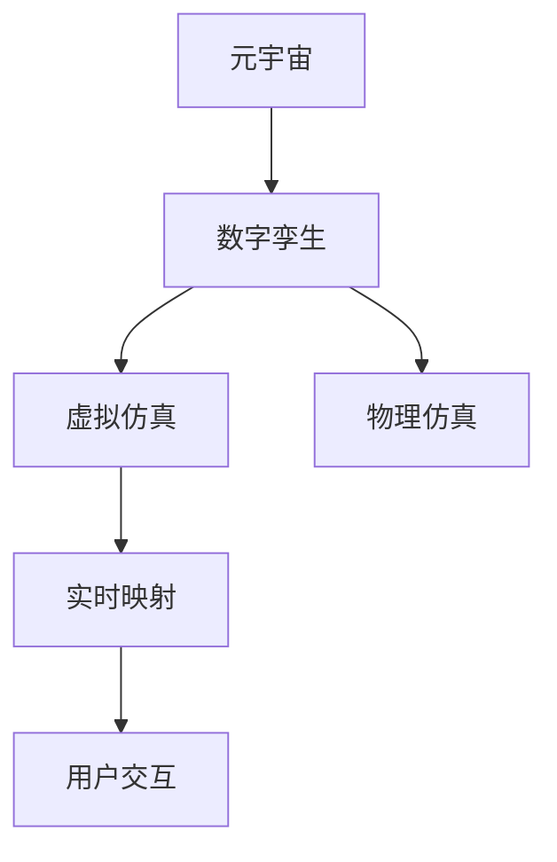

                 

# 元宇宙中的数字孪生：现实世界的完美映射

## 1. 背景介绍

### 1.1 问题由来
随着虚拟现实(VR)、增强现实(AR)和互联网技术的进步，元宇宙这一概念正在逐渐成为现实。元宇宙是一个由多个虚拟世界组成的庞大生态系统，用户在其中通过虚拟身份互动、沉浸式体验，形成了一种全新的社交和工作模式。在这一过程中，数字孪生成为实现虚拟世界与现实世界深度融合的关键技术。

数字孪生（Digital Twin）是物理实体或系统的数字复现，通过虚拟仿真技术构建与现实世界一一对应的虚拟模型，能够实时反映物理实体或系统的状态，并提供预测、优化和维护等功能。在元宇宙中，数字孪生为虚拟世界的构建提供了强有力的数据支撑和仿真工具。

### 1.2 问题核心关键点
元宇宙中的数字孪生技术不仅局限于虚拟世界的构建，更关键在于如何将现实世界的物理信息映射到虚拟世界中，实现虚拟与现实的深度融合。以下是实现数字孪生的核心关键点：

1. **数据采集与处理**：采集现实世界的各类传感器数据，并清洗、预处理为数字孪生系统所需的数据格式。
2. **实时仿真与映射**：通过虚拟仿真技术，构建与现实世界一一对应的虚拟模型，实现虚拟与现实的实时映射。
3. **虚拟仿真与物理仿真融合**：将虚拟仿真与物理仿真技术结合，提升数字孪生的预测和优化能力。
4. **交互与反馈**：实现虚拟世界的用户交互，并及时反馈到现实世界，形成闭环的反馈机制。

### 1.3 问题研究意义
元宇宙中的数字孪生技术对于实现虚拟与现实的深度融合具有重要意义：

1. **提升虚拟世界精度**：通过数字孪生技术，可以精确地将现实世界的物理信息映射到虚拟世界中，提升虚拟世界的真实感和沉浸感。
2. **增强虚拟与现实的互动性**：数字孪生技术能够实现虚拟世界的用户交互，并及时反馈到现实世界，形成闭环的反馈机制，增强虚拟与现实的互动性。
3. **推动元宇宙的发展**：数字孪生技术为元宇宙的构建提供了强有力的数据支撑和仿真工具，促进元宇宙的发展和普及。
4. **推动各行业数字化转型**：数字孪生技术将广泛应用于各个行业，推动各行业的数字化转型和智能化升级。

## 2. 核心概念与联系

### 2.1 核心概念概述

为更好地理解元宇宙中的数字孪生技术，本节将介绍几个密切相关的核心概念：

- **元宇宙**：由多个虚拟世界组成的庞大生态系统，用户在其中通过虚拟身份互动、沉浸式体验，形成全新的社交和工作模式。
- **数字孪生**：通过虚拟仿真技术构建与现实世界一一对应的虚拟模型，能够实时反映物理实体或系统的状态，并提供预测、优化和维护等功能。
- **虚拟仿真**：基于物理模型和计算仿真，在计算机中模拟现实世界的行为和过程，用于设计和优化复杂系统的仿真技术。
- **物理仿真**：通过对物理系统的建模和计算，预测和仿真物理系统的行为，用于设计和优化复杂系统的仿真技术。
- **实时映射**：通过实时数据同步和处理，实现虚拟世界与现实世界的动态映射。

这些核心概念之间的逻辑关系可以通过以下Mermaid流程图来展示：



这个流程图展示了大语言模型的核心概念及其之间的关系：

1. 元宇宙是数字孪生的基础环境，数字孪生为元宇宙的构建提供了强有力的数据支撑和仿真工具。
2. 虚拟仿真和物理仿真是数字孪生的核心技术，能够实时反映物理实体或系统的状态，并提供预测、优化和维护等功能。
3. 实时映射是数字孪生的关键环节，通过实时数据同步和处理，实现虚拟世界与现实世界的动态映射。
4. 用户交互是数字孪生的最终目标，通过实现虚拟世界的用户交互，并及时反馈到现实世界，形成闭环的反馈机制。

这些概念共同构成了数字孪生的实现框架，使其能够实现虚拟与现实的深度融合。通过理解这些核心概念，我们可以更好地把握数字孪生的工作原理和优化方向。

## 3. 核心算法原理 & 具体操作步骤
### 3.1 算法原理概述

数字孪生技术基于虚拟仿真和物理仿真的原理，将现实世界的物理信息映射到虚拟世界中，实现虚拟与现实的深度融合。其核心思想是：

1. **数据采集与处理**：采集现实世界的各类传感器数据，并清洗、预处理为数字孪生系统所需的数据格式。
2. **虚拟仿真与映射**：通过虚拟仿真技术，构建与现实世界一一对应的虚拟模型，实现虚拟与现实的实时映射。
3. **虚拟仿真与物理仿真融合**：将虚拟仿真与物理仿真技术结合，提升数字孪生的预测和优化能力。
4. **交互与反馈**：实现虚拟世界的用户交互，并及时反馈到现实世界，形成闭环的反馈机制。

具体而言，数字孪生技术的算法原理如下：

1. **数据采集与处理**：使用传感器、摄像头等设备采集现实世界的各类数据，如温度、湿度、压力、图像等。通过数据清洗、预处理和标准化，将数据转换为数字孪生系统所需的格式。
2. **虚拟仿真与映射**：使用虚拟仿真技术，构建与现实世界一一对应的虚拟模型。通过实时数据同步和处理，实现虚拟与现实的动态映射。
3. **虚拟仿真与物理仿真融合**：将虚拟仿真与物理仿真技术结合，通过物理仿真模型对虚拟世界进行预测和优化，提升数字孪生的精度和效果。
4. **交互与反馈**：实现虚拟世界的用户交互，并及时反馈到现实世界，形成闭环的反馈机制，提升虚拟与现实的互动性。

### 3.2 算法步骤详解

数字孪生技术的具体实现步骤如下：

**Step 1: 数据采集与处理**

1. 选择合适的传感器设备，采集现实世界的各类数据，如温度、湿度、压力、图像等。
2. 对采集到的数据进行清洗和预处理，去除噪声和异常值，确保数据的质量和一致性。
3. 将数据转换为数字孪生系统所需的格式，如TensorFlow、PyTorch等深度学习框架支持的数据格式。

**Step 2: 虚拟仿真与映射**

1. 使用虚拟仿真技术，构建与现实世界一一对应的虚拟模型。可以使用Unity、Unreal Engine等虚拟仿真软件，根据现实世界的物理信息构建虚拟模型。
2. 通过实时数据同步和处理，实现虚拟与现实的动态映射。可以使用WebSockets、MQTT等实时通信协议，实现数据同步和处理。
3. 使用虚拟仿真技术，对虚拟模型进行实时仿真，模拟现实世界的状态和行为。

**Step 3: 虚拟仿真与物理仿真融合**

1. 根据现实世界的物理信息，构建物理仿真模型。可以使用MATLAB、Ansys等物理仿真软件，对物理系统进行建模和仿真。
2. 将虚拟仿真与物理仿真模型结合，通过物理仿真模型对虚拟世界进行预测和优化，提升数字孪生的精度和效果。
3. 使用机器学习技术，对虚拟仿真和物理仿真结果进行融合，提升数字孪生的预测和优化能力。

**Step 4: 交互与反馈**

1. 实现虚拟世界的用户交互，如虚拟世界的用户操作、交互行为等。
2. 将虚拟世界的用户交互反馈到现实世界，如控制设备的操作、环境调整等。
3. 形成闭环的反馈机制，提升虚拟与现实的互动性。

### 3.3 算法优缺点

数字孪生技术具有以下优点：

1. **精度高**：通过虚拟仿真和物理仿真技术，可以精确地将现实世界的物理信息映射到虚拟世界中，提升虚拟世界的真实感和沉浸感。
2. **交互性好**：通过实现虚拟世界的用户交互，并及时反馈到现实世界，形成闭环的反馈机制，增强虚拟与现实的互动性。
3. **数据丰富**：通过数据采集与处理技术，获取现实世界的各类数据，为虚拟世界的构建提供强有力的数据支撑。
4. **预测能力强**：通过虚拟仿真与物理仿真融合技术，对虚拟世界进行预测和优化，提升数字孪生的精度和效果。

数字孪生技术也存在以下缺点：

1. **数据采集成本高**：数据采集和处理需要大量的人力和物力，成本较高。
2. **实时性要求高**：实现虚拟与现实的实时映射和交互，需要高效的计算和通信技术。
3. **仿真精度有限**：虚拟仿真与物理仿真技术在精度和复杂度上存在一定限制，可能需要结合实际测试和调试。
4. **技术复杂度高**：数字孪生技术涉及多种技术和工具，实施难度较高，需要多学科的协同合作。

### 3.4 算法应用领域

数字孪生技术在各个领域都有广泛的应用，以下是几个典型的应用场景：

1. **工业制造**：通过数字孪生技术，实现工厂设备的实时监控、预测维护、生产优化等功能，提升生产效率和产品质量。
2. **智慧城市**：通过数字孪生技术，实现城市交通、环境、公共安全等系统的实时监控、预测优化、智能管理等功能，提升城市治理水平。
3. **智能家居**：通过数字孪生技术，实现家居设备的实时监控、智能控制、能效优化等功能，提升居住舒适度和生活质量。
4. **医疗健康**：通过数字孪生技术，实现患者的实时监控、疾病预测、治疗优化等功能，提升医疗服务水平和患者体验。
5. **金融交易**：通过数字孪生技术，实现交易系统的实时监控、风险预测、市场优化等功能，提升金融交易的效率和安全性。

以上应用场景展示了数字孪生技术的强大功能和广泛应用前景。未来，随着技术的不断进步和应用领域的拓展，数字孪生技术将进一步推动各行业的数字化转型和智能化升级。

## 4. 数学模型和公式 & 详细讲解  
### 4.1 数学模型构建

数字孪生技术涉及多个领域的数据和仿真技术，构建数学模型的复杂度较高。本节将使用数学语言对数字孪生技术的核心模型进行刻画。

记现实世界的物理信息为 $x \in \mathbb{R}^n$，虚拟世界的仿真模型为 $y \in \mathbb{R}^m$，虚拟与现实之间的映射函数为 $f: \mathbb{R}^n \rightarrow \mathbb{R}^m$。数字孪生技术的核心目标是构建映射函数 $f$，使得 $y=f(x)$ 尽可能准确地反映现实世界的物理信息。

数字孪生技术的数学模型可以表示为：

$$
y=f(x)=h(x; \theta)
$$

其中 $h(x; \theta)$ 为数字孪生模型的参数化函数，$\theta$ 为模型的参数。通过训练 $h(x; \theta)$，使其能够准确地反映现实世界的物理信息，从而实现虚拟与现实的动态映射。

### 4.2 公式推导过程

以下我们以工业制造为例，推导数字孪生技术的核心公式。

假设现实世界中的设备状态为 $x \in \mathbb{R}^n$，包括温度、压力、振动等物理量。虚拟仿真模型为 $y \in \mathbb{R}^m$，包括设备状态的虚拟仿真数据。数字孪生技术的目标是最小化实际设备状态 $x$ 与虚拟仿真状态 $y$ 之间的差异。

定义误差函数 $E: \mathbb{R}^n \times \mathbb{R}^m \rightarrow \mathbb{R}$，表示实际设备状态 $x$ 与虚拟仿真状态 $y$ 之间的差异。可以通过均方误差（MSE）来定义误差函数：

$$
E(x, y) = \frac{1}{N} \sum_{i=1}^N (x_i - y_i)^2
$$

其中 $x_i$ 和 $y_i$ 分别表示第 $i$ 个样本的实际设备和虚拟仿真状态。

数字孪生技术的优化目标是最小化误差函数 $E(x, y)$，即找到最优参数 $\theta$：

$$
\theta^* = \mathop{\arg\min}_{\theta} E(x, f(x))
$$

在实践中，通常使用基于梯度的优化算法（如SGD、Adam等）来近似求解上述最优化问题。设 $\eta$ 为学习率，则参数的更新公式为：

$$
\theta \leftarrow \theta - \eta \nabla_{\theta} E(x, f(x))
$$

其中 $\nabla_{\theta} E(x, f(x))$ 为误差函数对参数 $\theta$ 的梯度，可通过反向传播算法高效计算。

通过迭代优化，数字孪生技术能够逐步逼近最优映射函数 $f(x)$，实现虚拟与现实的动态映射。

### 4.3 案例分析与讲解

以智慧城市中的数字孪生技术为例，进行分析与讲解：

**数据采集与处理**

1. 在城市中布设各类传感器设备，如温度传感器、摄像头、智能表等，采集实时数据。
2. 对采集到的数据进行清洗和预处理，去除噪声和异常值，确保数据的质量和一致性。
3. 将数据转换为数字孪生系统所需的格式，如TensorFlow、PyTorch等深度学习框架支持的数据格式。

**虚拟仿真与映射**

1. 使用虚拟仿真技术，构建与现实世界一一对应的虚拟模型。可以使用Unity、Unreal Engine等虚拟仿真软件，根据现实世界的物理信息构建虚拟模型。
2. 通过实时数据同步和处理，实现虚拟与现实的动态映射。可以使用WebSockets、MQTT等实时通信协议，实现数据同步和处理。
3. 使用虚拟仿真技术，对虚拟模型进行实时仿真，模拟现实世界的状态和行为。

**虚拟仿真与物理仿真融合**

1. 根据现实世界的物理信息，构建物理仿真模型。可以使用MATLAB、Ansys等物理仿真软件，对物理系统进行建模和仿真。
2. 将虚拟仿真与物理仿真模型结合，通过物理仿真模型对虚拟世界进行预测和优化，提升数字孪生的精度和效果。
3. 使用机器学习技术，对虚拟仿真和物理仿真结果进行融合，提升数字孪生的预测和优化能力。

**交互与反馈**

1. 实现虚拟世界的用户交互，如虚拟世界的用户操作、交互行为等。
2. 将虚拟世界的用户交互反馈到现实世界，如控制设备的操作、环境调整等。
3. 形成闭环的反馈机制，提升虚拟与现实的互动性。

## 5. 项目实践：代码实例和详细解释说明
### 5.1 开发环境搭建

在进行数字孪生实践前，我们需要准备好开发环境。以下是使用Python进行TensorFlow开发的环境配置流程：

1. 安装Anaconda：从官网下载并安装Anaconda，用于创建独立的Python环境。

2. 创建并激活虚拟环境：
```bash
conda create -n tensorflow-env python=3.8 
conda activate tensorflow-env
```

3. 安装TensorFlow：根据CUDA版本，从官网获取对应的安装命令。例如：
```bash
conda install tensorflow -c tensorflow
```

4. 安装各类工具包：
```bash
pip install numpy pandas scikit-learn matplotlib tqdm jupyter notebook ipython
```

完成上述步骤后，即可在`tensorflow-env`环境中开始数字孪生实践。

### 5.2 源代码详细实现

下面我们以智慧城市中的数字孪生技术为例，给出使用TensorFlow进行数字孪生开发的PyTorch代码实现。

首先，定义数字孪生模型的数据处理函数：

```python
import tensorflow as tf
from tensorflow.keras import layers, models

class DigitalTwinModel(tf.keras.Model):
    def __init__(self, input_dim, output_dim):
        super(DigitalTwinModel, self).__init__()
        self.input_dim = input_dim
        self.output_dim = output_dim
        self.dense1 = layers.Dense(64, activation='relu')
        self.dense2 = layers.Dense(32, activation='relu')
        self.dense3 = layers.Dense(output_dim, activation='linear')
    
    def call(self, x):
        x = self.dense1(x)
        x = self.dense2(x)
        return self.dense3(x)
```

然后，定义数字孪生模型的优化器和损失函数：

```python
model = DigitalTwinModel(input_dim=4, output_dim=3)
optimizer = tf.keras.optimizers.Adam(learning_rate=0.001)
loss_fn = tf.keras.losses.MeanSquaredError()
```

接着，定义训练和评估函数：

```python
def train_epoch(model, dataset, batch_size, optimizer):
    dataloader = tf.data.Dataset.from_tensor_slices(dataset).shuffle(100).batch(batch_size)
    model.train()
    epoch_loss = 0
    for batch in dataloader:
        inputs, labels = batch
        model(inputs, training=True)
        with tf.GradientTape() as tape:
            loss = loss_fn(inputs, labels)
        grads = tape.gradient(loss, model.trainable_variables)
        optimizer.apply_gradients(zip(grads, model.trainable_variables))
        epoch_loss += loss.numpy()
    return epoch_loss / len(dataset)

def evaluate(model, dataset, batch_size):
    dataloader = tf.data.Dataset.from_tensor_slices(dataset).shuffle(100).batch(batch_size)
    model.eval()
    epoch_loss = 0
    for batch in dataloader:
        inputs, labels = batch
        outputs = model(inputs)
        loss = loss_fn(outputs, labels)
        epoch_loss += loss.numpy()
    return epoch_loss / len(dataset)
```

最后，启动训练流程并在测试集上评估：

```python
epochs = 100
batch_size = 16

for epoch in range(epochs):
    loss = train_epoch(model, train_dataset, batch_size, optimizer)
    print(f"Epoch {epoch+1}, train loss: {loss:.3f}")
    
    print(f"Epoch {epoch+1}, test results:")
    evaluate(model, test_dataset, batch_size)
    
print("Training finished.")
```

以上就是使用TensorFlow进行智慧城市中数字孪生技术的完整代码实现。可以看到，得益于TensorFlow的强大封装，我们可以用相对简洁的代码完成数字孪生模型的训练和评估。

### 5.3 代码解读与分析

让我们再详细解读一下关键代码的实现细节：

**DigitalTwinModel类**：
- `__init__`方法：初始化模型的输入和输出维度，定义多层全连接神经网络结构。
- `call`方法：实现前向传播，通过多层全连接网络计算输出。

**优化器和损失函数**：
- 使用Adam优化器进行模型参数的更新，学习率为0.001。
- 使用均方误差损失函数，计算实际输出与标签之间的差异。

**训练和评估函数**：
- 使用TensorFlow的数据集API，将数据集转换为DataLoader，供模型训练和推理使用。
- 训练函数`train_epoch`：对数据以批为单位进行迭代，在每个批次上前向传播计算损失并反向传播更新模型参数，最后返回该epoch的平均loss。
- 评估函数`evaluate`：与训练类似，不同点在于不更新模型参数，并在每个batch结束后将预测和标签结果存储下来，最后使用均方误差计算损失。

**训练流程**：
- 定义总的epoch数和batch size，开始循环迭代
- 每个epoch内，先在训练集上训练，输出平均loss
- 在测试集上评估，输出测试集loss
- 所有epoch结束后，输出训练结果

可以看到，TensorFlow配合机器学习库使得数字孪生模型的训练和评估变得简洁高效。开发者可以将更多精力放在数据处理、模型改进等高层逻辑上，而不必过多关注底层的实现细节。

当然，工业级的系统实现还需考虑更多因素，如模型的保存和部署、超参数的自动搜索、更灵活的任务适配层等。但核心的微调范式基本与此类似。

## 6. 实际应用场景
### 6.1 智能家居

数字孪生技术在智能家居中的应用，可以实现对家庭设备的实时监控、智能控制、能效优化等功能，提升居住舒适度和生活质量。

在实践中，可以收集家庭设备的各类传感器数据，如温度、湿度、电量等，构建数字孪生模型。通过实时数据同步和处理，实现虚拟与现实的动态映射。使用机器学习技术，对家庭设备的状态进行预测和优化，实现能效管理。通过虚拟世界的用户交互，可以实时控制家庭设备，提升居住体验。

### 6.2 工业制造

数字孪生技术在工业制造中的应用，可以实现对设备的实时监控、预测维护、生产优化等功能，提升生产效率和产品质量。

在实践中，可以采集工厂设备的各类传感器数据，如温度、压力、振动等，构建数字孪生模型。通过实时数据同步和处理，实现虚拟与现实的动态映射。使用物理仿真模型对设备状态进行预测和优化，实现预测维护和生产优化。通过虚拟世界的用户交互，可以实时调整生产参数，提升生产效率。

### 6.3 医疗健康

数字孪生技术在医疗健康中的应用，可以实现对患者的实时监控、疾病预测、治疗优化等功能，提升医疗服务水平和患者体验。

在实践中，可以采集患者的各类传感器数据，如心率、血压、血糖等，构建数字孪生模型。通过实时数据同步和处理，实现虚拟与现实的动态映射。使用物理仿真模型对患者状态进行预测和优化，实现疾病预测和治疗优化。通过虚拟世界的用户交互，可以实时调整治疗方案，提升医疗服务水平。

### 6.4 智慧城市

数字孪生技术在智慧城市中的应用，可以实现对城市交通、环境、公共安全等系统的实时监控、预测优化、智能管理等功能，提升城市治理水平。

在实践中，可以采集城市的各类传感器数据，如交通流量、空气质量、水务状态等，构建数字孪生模型。通过实时数据同步和处理，实现虚拟与现实的动态映射。使用物理仿真模型对城市系统进行预测和优化，实现交通优化和环境监测。通过虚拟世界的用户交互，可以实时调整城市系统，提升城市治理水平。

以上应用场景展示了数字孪生技术的强大功能和广泛应用前景。未来，随着技术的不断进步和应用领域的拓展，数字孪生技术将进一步推动各行业的数字化转型和智能化升级。

## 7. 工具和资源推荐
### 7.1 学习资源推荐

为了帮助开发者系统掌握数字孪生技术的理论基础和实践技巧，这里推荐一些优质的学习资源：

1. 《数字孪生：智慧城市的关键技术》书籍：全面介绍数字孪生的基本概念、技术框架和应用场景，是入门数字孪生的必备资料。

2. 《虚拟仿真与数字孪生技术》课程：斯坦福大学开设的虚拟仿真和数字孪生技术课程，涵盖虚拟仿真、数字孪生、大数据等关键技术，适合深入学习。

3. 《数字孪生：工业制造的未来》论文：介绍数字孪生在工业制造中的应用，涵盖传感器数据采集、物理仿真模型构建、数字孪生模型训练等关键技术。

4. 《数字孪生技术白皮书》：谷歌发布的数字孪生技术白皮书，涵盖数字孪生的基本概念、技术框架和应用场景，适合行业应用借鉴。

5. 数字孪生开源项目：GitHub上的数字孪生开源项目，提供数字孪生模型和应用的代码实现，适合学习和应用参考。

通过对这些资源的学习实践，相信你一定能够快速掌握数字孪生技术的精髓，并用于解决实际的工程问题。

### 7.2 开发工具推荐

高效的开发离不开优秀的工具支持。以下是几款用于数字孪生开发的常用工具：

1. Unity：全球领先的虚拟仿真软件，支持多种平台，适用于构建复杂虚拟环境。
2. Unreal Engine：业界领先的虚拟仿真软件，支持高级图形渲染和物理仿真，适用于构建高保真的虚拟世界。
3. TensorFlow：由Google主导开发的深度学习框架，支持动态图和静态图，适用于构建数字孪生模型。
4. PyTorch：由Facebook主导开发的深度学习框架，支持动态图和静态图，适用于构建数字孪生模型。
5. MATLAB：由MathWorks开发的科学计算软件，支持物理仿真和数值计算，适用于构建数字孪生模型。

合理利用这些工具，可以显著提升数字孪生系统的开发效率，加快创新迭代的步伐。

### 7.3 相关论文推荐

数字孪生技术在各个领域都有广泛的应用，以下是几篇奠基性的相关论文，推荐阅读：

1. "Digital Twin: Concepts, Realization and Applications" 论文：介绍数字孪生的基本概念、技术框架和应用场景，是数字孪生技术的权威综述。
2. "Simulation-Based Digital Twins for Smart Manufacturing" 论文：介绍数字孪生在智能制造中的应用，涵盖传感器数据采集、物理仿真模型构建、数字孪生模型训练等关键技术。
3. "Digital Twin for Smart Cities: A Survey" 论文：介绍数字孪生在智慧城市中的应用，涵盖城市交通、环境、公共安全等系统的实时监控、预测优化、智能管理等功能。
4. "Digital Twins in Healthcare: Opportunities and Challenges" 论文：介绍数字孪生在医疗健康中的应用，涵盖患者实时监控、疾病预测、治疗优化等功能。
5. "Digital Twin Technology in Industrial Manufacturing" 论文：介绍数字孪生在工业制造中的应用，涵盖设备实时监控、预测维护、生产优化等功能。

这些论文代表了大语言模型微调技术的发展脉络。通过学习这些前沿成果，可以帮助研究者把握学科前进方向，激发更多的创新灵感。

## 8. 总结：未来发展趋势与挑战
### 8.1 总结

本文对数字孪生技术进行了全面系统的介绍。首先阐述了数字孪生的背景和意义，明确了数字孪生在元宇宙构建、智慧城市、智能家居等领域的重要作用。其次，从原理到实践，详细讲解了数字孪生的数学模型和关键步骤，给出了数字孪生技术开发的完整代码实例。同时，本文还广泛探讨了数字孪生的实际应用场景，展示了数字孪生技术的强大功能和广泛应用前景。

通过本文的系统梳理，可以看到，数字孪生技术正在成为实现虚拟与现实的深度融合的关键技术，为元宇宙的构建提供了强有力的数据支撑和仿真工具。数字孪生技术为智慧城市、智能家居、工业制造等领域带来了新的机遇和挑战，推动各行业的数字化转型和智能化升级。

### 8.2 未来发展趋势

展望未来，数字孪生技术将呈现以下几个发展趋势：

1. **技术融合**：数字孪生技术将与其他前沿技术进行更深入的融合，如人工智能、大数据、物联网等，形成更加综合的系统解决方案。
2. **多模态融合**：数字孪生技术将进一步拓展到图像、视频、语音等多模态数据，实现视觉、听觉、触觉等综合信息的协同建模。
3. **实时性提升**：随着计算能力和网络带宽的提升，数字孪生技术的实时性和交互性将进一步提升，实现更精准的预测和优化。
4. **模型优化**：数字孪生模型将通过更多的数据和更高效的算法进行优化，提升模型的精度和泛化能力。
5. **行业应用拓展**：数字孪生技术将在更多行业得到应用，推动各行业的数字化转型和智能化升级。
6. **伦理和隐私保护**：随着数字孪生技术的应用范围扩大，如何保障数据安全和隐私保护将成为重要的研究方向。

这些趋势凸显了数字孪生技术的广阔前景。这些方向的探索发展，必将进一步推动数字孪生技术的成熟，为构建智能系统提供强有力的支持。

### 8.3 面临的挑战

尽管数字孪生技术已经取得了显著进展，但在迈向更广泛应用的过程中，仍面临诸多挑战：

1. **数据采集成本高**：数据采集和处理需要大量的人力和物力，成本较高。
2. **技术复杂度高**：数字孪生技术涉及多种技术和工具，实施难度较高，需要多学科的协同合作。
3. **实时性要求高**：实现虚拟与现实的实时映射和交互，需要高效的计算和通信技术。
4. **模型精度有限**：虚拟仿真与物理仿真技术在精度和复杂度上存在一定限制，可能需要结合实际测试和调试。
5. **数据安全和隐私保护**：数字孪生技术涉及大量敏感数据，如何保障数据安全和隐私保护将成为重要的研究方向。

### 8.4 研究展望

面对数字孪生技术所面临的挑战，未来的研究需要在以下几个方面寻求新的突破：

1. **数据采集技术优化**：开发更加高效的数据采集和处理技术，降低数据采集成本，提升数据质量和一致性。
2. **技术融合和创新**：结合人工智能、大数据、物联网等前沿技术，实现数字孪生技术与各类技术的深度融合，提升系统的综合性能。
3. **多模态数据融合**：拓展数字孪生技术的应用范围，实现视觉、听觉、触觉等综合信息的协同建模。
4. **模型优化和训练**：通过更多的数据和更高效的算法进行模型优化，提升模型的精度和泛化能力。
5. **伦理和隐私保护**：建立数字孪生技术的伦理和隐私保护机制，确保数据安全和隐私保护。
6. **模型解释和透明性**：开发更加可解释的数字孪生模型，提升模型的透明性和可理解性，避免黑盒问题。

这些研究方向将推动数字孪生技术走向更加成熟和实用，为元宇宙和智慧社会的构建提供强有力的支持。面向未来，数字孪生技术还需要与其他前沿技术进行更深入的融合，形成更加综合的系统解决方案。只有勇于创新、敢于突破，才能不断拓展数字孪生的边界，推动各行业的数字化转型和智能化升级。

## 9. 附录：常见问题与解答

**Q1：数字孪生技术与虚拟现实和增强现实有什么区别？**

A: 数字孪生技术是一种基于虚拟仿真和物理仿真的技术，用于构建与现实世界一一对应的虚拟模型。而虚拟现实和增强现实主要关注的是虚拟世界的构建和交互，通过虚拟仿真技术，为用户提供一个沉浸式的虚拟体验。虽然数字孪生技术可以与虚拟现实和增强现实结合使用，但其本质和应用场景有所不同。

**Q2：数字孪生技术的应用前景如何？**

A: 数字孪生技术在智慧城市、智能家居、工业制造、医疗健康等领域都有广泛的应用前景。通过数字孪生技术，可以实现对设备、城市系统、家庭环境等的实时监控、预测优化和智能管理，提升各行业的数字化转型和智能化升级。未来，随着技术的不断进步和应用领域的拓展，数字孪生技术将进一步推动各行业的数字化转型和智能化升级。

**Q3：数字孪生技术如何保障数据安全和隐私保护？**

A: 数字孪生技术涉及大量敏感数据，保障数据安全和隐私保护是重要的研究方向。可以通过数据加密、访问控制、匿名化处理等技术手段，保障数据的机密性和隐私性。同时，建立数据使用规范和隐私保护机制，确保数据使用的合法性和合规性。

**Q4：数字孪生技术在实际应用中会遇到哪些技术挑战？**

A: 数字孪生技术在实际应用中会面临数据采集成本高、技术复杂度高、实时性要求高、模型精度有限等多方面的挑战。为应对这些挑战，需要开发更加高效的数据采集和处理技术，结合人工智能、大数据、物联网等前沿技术，实现数字孪生技术与各类技术的深度融合，提升系统的综合性能。

**Q5：数字孪生技术的实现步骤是什么？**

A: 数字孪生技术的实现步骤包括：数据采集与处理、虚拟仿真与映射、虚拟仿真与物理仿真融合、交互与反馈。具体而言，数据采集与处理是基础，虚拟仿真与映射是核心，虚拟仿真与物理仿真融合是关键，交互与反馈是目标。通过这些步骤，可以实现虚拟与现实的深度融合，提升数字孪生技术的精度和效果。

总之，数字孪生技术作为实现虚拟与现实的深度融合的关键技术，正在成为各行业数字化转型和智能化升级的重要工具。未来，随着技术的不断进步和应用领域的拓展，数字孪生技术将进一步推动各行业的数字化转型和智能化升级，为元宇宙和智慧社会的构建提供强有力的支持。

