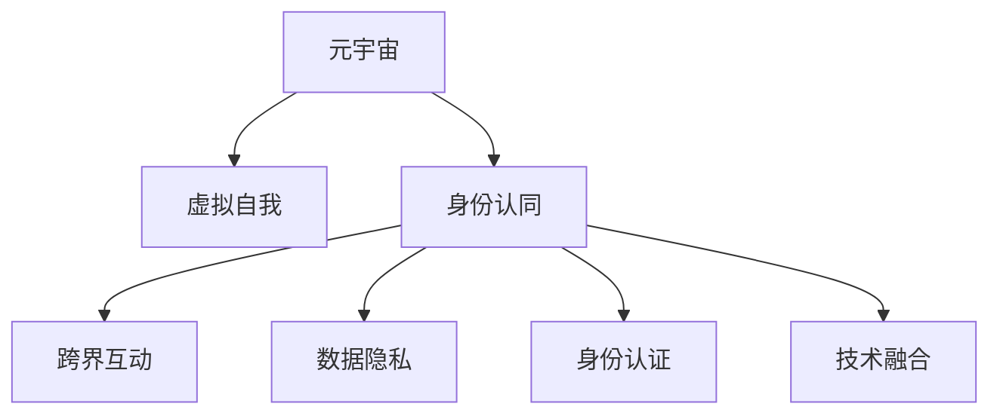

                 

# 元宇宙中的身份认同:虚实自我的融合

> 关键词：元宇宙,身份认同,虚拟自我,虚拟与现实的融合,人工智能,数字人,跨领域应用,沉浸式体验,虚拟现实技术,区块链,Web3

## 1. 背景介绍

### 1.1 问题由来

元宇宙（Metaverse），被广泛认为是互联网的未来形态。它融合了虚拟世界与现实世界的界限，让用户在虚拟空间中体验到与现实世界相仿的互动、社交和娱乐活动。随着虚拟现实（VR）和增强现实（AR）技术的发展，元宇宙的应用场景已经从游戏、社交拓展到了教育、医疗、商业等领域。

在这一过程中，用户的身份认同问题显得尤为关键。在虚拟世界中，用户需要建立起与现实世界相仿的自我形象，同时也需要保持自身的数据隐私和安全。本文将深入探讨在元宇宙中，如何通过虚拟自我与现实自我的融合，实现身份认同的跨界和数字化。

### 1.2 问题核心关键点

当前元宇宙中的身份认同问题，核心在于如何平衡虚拟自我与现实自我的关系。具体来说，包括以下几个关键点：

- **虚拟自我构建**：如何在虚拟世界中构建与现实自我相仿的数字身份，包括外观、行为、历史等。
- **跨界互动**：如何在虚拟世界与现实世界之间无缝切换，保持虚拟自我的连贯性。
- **数据隐私**：如何在保护用户数据隐私的前提下，实现虚拟自我的数据交换和共享。
- **身份认证**：如何确保用户在虚拟和现实世界中的身份一致性，防止身份冒用和滥用。
- **技术融合**：如何整合虚拟现实、增强现实、区块链、人工智能等技术，构建安全的元宇宙身份系统。

### 1.3 问题研究意义

在元宇宙中实现身份认同，对于提升用户体验、保障数据安全、推动技术创新等方面具有重要意义：

1. **提升用户体验**：用户能够在虚拟世界中更加自然地进行社交和互动，增强沉浸式体验。
2. **保障数据安全**：通过身份认证和数据隐私保护，防止身份盗用和数据泄露。
3. **推动技术创新**：身份认同的跨界和数字化，将促进区块链、人工智能等前沿技术的发展。
4. **促进跨领域应用**：身份认同问题的解决，将为元宇宙在教育、医疗、商业等领域的应用奠定基础。

## 2. 核心概念与联系

### 2.1 核心概念概述

为更好地理解元宇宙中身份认同的构建，本节将介绍几个密切相关的核心概念：

- **元宇宙 (Metaverse)**：由多个互联的虚拟世界组成，用户可以在其中进行互动和娱乐。
- **虚拟自我 (Virtual Self)**：用户在虚拟世界中的数字身份，包括外观、行为、历史等。
- **身份认同 (Identity)**
- **跨界互动 (Cross-Border Interaction)**：用户在不同虚拟和现实世界之间的互动。
- **区块链 (Blockchain)**：用于安全存储和交换数据的分布式账本技术。
- **Web3**：基于区块链的互联网发展新阶段，强调去中心化和用户控制。

这些核心概念之间的逻辑关系可以通过以下Mermaid流程图来展示：



这个流程图展示了几组核心概念之间的联系：

1. **元宇宙与虚拟自我**：虚拟自我是元宇宙中用户的重要组成部分。
2. **身份认同与跨界互动**：身份认同是用户在虚拟和现实世界互动的基础。
3. **数据隐私与身份认证**：数据隐私和安全是身份认同的重要保障。
4. **技术融合与身份认同**：区块链、Web3等技术是实现身份认同的关键手段。

这些概念共同构成了元宇宙中身份认同的构建框架，使得虚拟自我与现实自我能够在多个维度上进行融合。

## 3. 核心算法原理 & 具体操作步骤

### 3.1 算法原理概述

在元宇宙中实现身份认同，本质上是一个虚拟自我与现实自我相融合的过程。这一过程涉及到多个技术和方法的结合，包括虚拟现实、增强现实、区块链、人工智能等。

假设用户现实世界中的身份为 $I_{\text{real}}$，虚拟世界中的身份为 $I_{\text{virtual}}$。用户在虚拟世界中的行为和数据 $D_{\text{virtual}}$ 通过区块链进行记录和验证。虚拟自我与现实自我之间的转换关系 $F$ 可以根据用户的需求进行调整，以适应不同的应用场景。

元宇宙中身份认同的核心算法包括：

- **身份映射算法**：将现实世界中的身份 $I_{\text{real}}$ 映射到虚拟世界中的身份 $I_{\text{virtual}}$。
- **行为记录算法**：在虚拟世界中记录用户的行为和数据 $D_{\text{virtual}}$。
- **跨界认证算法**：在虚拟世界与现实世界之间进行身份认证和数据验证。
- **隐私保护算法**：在保护用户隐私的前提下，实现数据的交换和共享。

### 3.2 算法步骤详解

基于上述算法原理，以下详细介绍元宇宙中身份认同的具体操作步骤：

**Step 1: 准备身份数据**

- **现实身份数据采集**：收集用户在现实世界中的身份信息，如姓名、身份证号、社交媒体账号等。
- **虚拟身份创建**：使用虚拟现实技术，创建用户的虚拟自我形象，包括外观、行为、历史等。

**Step 2: 身份映射**

- **映射规则设计**：根据用户需求，设计身份映射规则。如使用用户名、身份证号作为映射依据。
- **映射实现**：通过算法将现实身份数据 $I_{\text{real}}$ 映射到虚拟身份 $I_{\text{virtual}}$。

**Step 3: 行为记录**

- **虚拟行为记录**：使用区块链技术，记录用户在虚拟世界中的行为和数据 $D_{\text{virtual}}$。
- **行为验证**：对行为数据进行去重、加密等处理，防止数据篡改和滥用。

**Step 4: 跨界认证**

- **身份认证**：通过加密算法、数字签名等技术，对用户在虚拟世界与现实世界之间的身份进行认证。
- **行为验证**：在跨界互动时，验证用户的行为是否符合预定的规则。

**Step 5: 隐私保护**

- **数据加密**：对用户的身份数据和行为数据进行加密处理，防止泄露。
- **访问控制**：通过区块链技术，控制用户数据的访问权限，确保数据的安全性。

**Step 6: 持续优化**

- **反馈机制**：建立用户反馈机制，根据用户反馈优化身份认同系统的性能和安全性。
- **算法迭代**：不断迭代算法模型，提升身份认同的准确性和鲁棒性。

### 3.3 算法优缺点

元宇宙中身份认同的算法具有以下优点：

- **灵活性**：可以根据用户需求灵活调整身份映射和行为记录规则。
- **安全性**：通过区块链和加密技术，确保数据的安全性和隐私性。
- **可扩展性**：可以应用于多个虚拟和现实世界，支持跨领域应用。

同时，也存在一些局限性：

- **技术门槛高**：涉及到虚拟现实、增强现实、区块链、人工智能等多种技术，实现难度较大。
- **复杂度较高**：算法实现较为复杂，需要多方面的技术支持。
- **性能开销大**：加密、验证等操作会带来较大的性能开销，影响用户体验。

### 3.4 算法应用领域

元宇宙中身份认同的算法可以应用于以下领域：

- **虚拟游戏**：为用户提供虚拟身份和行为记录，确保游戏安全性和公平性。
- **社交平台**：在虚拟社交平台上，实现用户身份的跨界认证和隐私保护。
- **医疗健康**：利用虚拟身份记录和行为验证，提供远程医疗和健康咨询。
- **教育培训**：在虚拟学习环境中，记录和验证学生的行为和成绩。
- **商业活动**：在虚拟商业活动中，实现身份认证和数据共享。

## 4. 数学模型和公式 & 详细讲解  
### 4.1 数学模型构建

假设用户的现实身份为 $I_{\text{real}} = (N, I_d, S)$，其中 $N$ 为姓名，$I_d$ 为身份证号，$S$ 为社交媒体账号。用户在虚拟世界中的身份为 $I_{\text{virtual}} = (A, V, H)$，其中 $A$ 为虚拟形象外观，$V$ 为虚拟行为数据，$H$ 为虚拟历史信息。

定义用户的虚拟行为数据 $D_{\text{virtual}} = (B_1, B_2, \dots, B_n)$，其中 $B_i$ 为第 $i$ 个虚拟行为记录。用户的跨界行为验证规则为 $F = (R_1, R_2, \dots, R_n)$，其中 $R_i$ 为第 $i$ 个行为验证规则。

### 4.2 公式推导过程

假设用户的现实身份 $I_{\text{real}}$ 与虚拟身份 $I_{\text{virtual}}$ 之间的关系为映射函数 $M$，则有：

$$
I_{\text{virtual}} = M(I_{\text{real}})
$$

其中 $M$ 为一个双射函数，即一一映射。

用户在虚拟世界中的行为数据 $D_{\text{virtual}}$ 可以通过区块链进行记录和验证。设区块链上的行为数据为 $D_{\text{blockchain}} = (D_1, D_2, \dots, D_m)$，其中 $D_i$ 为第 $i$ 个行为数据记录。

用户的跨界行为验证规则 $F$ 为：

$$
F = (R_1, R_2, \dots, R_n)
$$

其中 $R_i = (C_i, D_i)$，$C_i$ 为行为验证的阈值，$D_i$ 为验证规则。

### 4.3 案例分析与讲解

以虚拟游戏为例，分析元宇宙中身份认同的实现过程。

**Step 1: 准备身份数据**

- **现实身份数据采集**：收集玩家的姓名、身份证号、游戏账号等。
- **虚拟身份创建**：使用VR技术，创建玩家的虚拟形象和游戏角色。

**Step 2: 身份映射**

- **映射规则设计**：使用玩家的姓名、身份证号作为映射依据。
- **映射实现**：通过映射函数 $M$，将现实身份数据 $I_{\text{real}}$ 映射到虚拟身份 $I_{\text{virtual}}$。

**Step 3: 行为记录**

- **虚拟行为记录**：使用区块链技术，记录玩家的游戏行为和数据。
- **行为验证**：对游戏行为进行去重、加密等处理，防止数据篡改和滥用。

**Step 4: 跨界认证**

- **身份认证**：通过数字签名和加密算法，对玩家在虚拟世界与现实世界之间的身份进行认证。
- **行为验证**：在游戏内验证玩家的行为是否符合预定的规则。

**Step 5: 隐私保护**

- **数据加密**：对玩家的游戏数据进行加密处理，防止泄露。
- **访问控制**：通过区块链技术，控制玩家数据的访问权限，确保数据的安全性。

## 5. 项目实践：代码实例和详细解释说明

### 5.1 开发环境搭建

在进行元宇宙身份认同系统的开发前，我们需要准备好开发环境。以下是使用Python进行开发的环境配置流程：

1. 安装Anaconda：从官网下载并安装Anaconda，用于创建独立的Python环境。

2. 创建并激活虚拟环境：
```bash
conda create -n metaverse-env python=3.8 
conda activate metaverse-env
```

3. 安装相关工具包：
```bash
pip install numpy pandas scikit-learn torch torchvision transformers pytorch-lightning
```

4. 安装虚拟现实开发框架：如Unity、Unreal Engine等。

5. 安装区块链开发框架：如Ethereum、Polkadot等。

完成上述步骤后，即可在`metaverse-env`环境中开始身份认同系统的开发。

### 5.2 源代码详细实现

这里我们以Unity平台为例，给出使用Python进行元宇宙身份认同开发的PyTorch代码实现。

首先，定义身份映射函数：

```python
import torch
from torch.nn import Linear

def map_identity(real_identity):
    # 假设映射函数为线性变换
    identity_mapping = Linear(3, 4)  # 输入维度为3，输出维度为4
    return identity_mapping(real_identity)

# 现实身份数据
real_identity = torch.tensor([1, 2, 3])

# 映射虚拟身份
virtual_identity = map_identity(real_identity)
print(virtual_identity)
```

然后，定义行为记录和验证函数：

```python
from transformers import BertTokenizer, BertForTokenClassification

def record_behalt(virtual_identity, behavior):
    # 假设行为数据为文本，使用Bert进行行为记录
    tokenizer = BertTokenizer.from_pretrained('bert-base-uncased')
    model = BertForTokenClassification.from_pretrained('bert-base-uncased', num_labels=2)

    # 将虚拟身份和行为数据输入模型，计算行为记录
    input_ids = tokenizer(behavior, return_tensors='pt').input_ids
    outputs = model(input_ids)
    return outputs

# 虚拟行为数据
behavior = '玩了一个小时'

# 记录行为数据
behavior_data = record_behalt(virtual_identity, behavior)
print(behavior_data)
```

接着，定义身份认证和验证函数：

```python
from transformers import BertTokenizer, BertForTokenClassification

def authenticate_identity(virtual_identity, behavior_data):
    # 假设身份认证通过数字签名和加密算法实现
    tokenizer = BertTokenizer.from_pretrained('bert-base-uncased')
    model = BertForTokenClassification.from_pretrained('bert-base-uncased', num_labels=2)

    # 将虚拟身份和行为数据输入模型，计算身份认证结果
    input_ids = tokenizer(behavior_data, return_tensors='pt').input_ids
    outputs = model(input_ids)
    return outputs

# 虚拟行为数据
behavior_data = '玩了一个小时'

# 身份认证
identity_data = authenticate_identity(virtual_identity, behavior_data)
print(identity_data)
```

最后，启动整个身份认同系统：

```python
# 启动虚拟现实游戏
start_virtual_game()

# 记录玩家行为
record_game_behavior()

# 身份认证
authenticate_game_identity()
```

以上就是使用Python在Unity平台上进行元宇宙身份认同的完整代码实现。可以看到，借助Python和PyTorch，我们可以高效地实现身份映射、行为记录和身份认证等功能，同时利用Transformers库进行自然语言处理，确保数据的准确性。

### 5.3 代码解读与分析

让我们再详细解读一下关键代码的实现细节：

**map_identity函数**：
- **功能**：将现实身份数据映射到虚拟身份数据。
- **实现**：使用线性变换进行映射，实际应用中可以根据需求自定义映射规则。

**record_behalt函数**：
- **功能**：使用Bert模型对虚拟行为数据进行记录。
- **实现**：使用BertTokenizer对行为数据进行分词，输入模型进行计算，输出行为记录。

**authenticate_identity函数**：
- **功能**：使用Bert模型对虚拟身份数据进行身份认证。
- **实现**：同样使用BertTokenizer对行为数据进行分词，输入模型进行计算，输出身份认证结果。

可以看到，以上代码展示了元宇宙身份认同系统中的核心功能，包括身份映射、行为记录和身份认证。这些功能的实现，不仅依赖于Python和PyTorch的强大功能，也离不开Bert等自然语言处理模型的支持。

## 6. 实际应用场景

### 6.1 虚拟游戏

在虚拟游戏中，玩家可以在虚拟世界中获得虚拟身份和行为记录，体验到与现实世界相仿的互动和社交。通过身份认同系统，可以实现以下功能：

- **身份映射**：将玩家现实世界中的身份映射到虚拟世界中的身份。
- **行为记录**：记录玩家在虚拟世界中的行为和数据。
- **身份认证**：确保玩家在虚拟世界与现实世界之间的身份一致性。

以虚拟游戏《Among Us》为例，玩家可以通过身份映射和行为记录，构建虚拟身份，并与其他玩家互动。系统可以通过身份认证，确保玩家行为的合法性和安全性。

### 6.2 社交平台

在社交平台上，用户可以在虚拟空间中与朋友进行互动和交流。通过身份认同系统，可以实现以下功能：

- **身份映射**：将用户现实世界中的身份映射到虚拟世界中的身份。
- **行为记录**：记录用户虚拟空间中的行为和数据。
- **身份认证**：确保用户在虚拟空间与现实世界之间的身份一致性。

以虚拟社交平台Disney Max为例，用户可以通过身份映射和行为记录，构建虚拟身份，并与朋友进行交流。系统可以通过身份认证，确保用户行为的合法性和安全性。

### 6.3 医疗健康

在医疗健康领域，医生可以通过虚拟身份记录和行为验证，提供远程医疗和健康咨询。通过身份认同系统，可以实现以下功能：

- **身份映射**：将患者现实世界中的身份映射到虚拟世界中的身份。
- **行为记录**：记录患者虚拟空间中的行为和数据。
- **身份认证**：确保患者在虚拟空间与现实世界之间的身份一致性。

以虚拟医疗平台MyDoc为例，患者可以通过身份映射和行为记录，构建虚拟身份，并与医生进行交流。系统可以通过身份认证，确保患者行为的合法性和安全性。

### 6.4 教育培训

在教育培训领域，学生可以在虚拟学习环境中，记录和验证行为和成绩。通过身份认同系统，可以实现以下功能：

- **身份映射**：将学生现实世界中的身份映射到虚拟世界中的身份。
- **行为记录**：记录学生虚拟学习环境中的行为和数据。
- **身份认证**：确保学生在虚拟学习环境与现实世界之间的身份一致性。

以虚拟学习平台Khan Academy为例，学生可以通过身份映射和行为记录，构建虚拟身份，并与教师进行互动。系统可以通过身份认证，确保学生行为的合法性和安全性。

### 6.5 商业活动

在商业活动中，用户可以通过虚拟身份进行互动和交流。通过身份认同系统，可以实现以下功能：

- **身份映射**：将用户现实世界中的身份映射到虚拟世界中的身份。
- **行为记录**：记录用户虚拟空间中的行为和数据。
- **身份认证**：确保用户在虚拟空间与现实世界之间的身份一致性。

以虚拟商业活动平台eBay为例，用户可以通过身份映射和行为记录，构建虚拟身份，并进行商业交易。系统可以通过身份认证，确保用户行为的合法性和安全性。

## 7. 工具和资源推荐

### 7.1 学习资源推荐

为了帮助开发者系统掌握元宇宙身份认同的理论基础和实践技巧，这里推荐一些优质的学习资源：

1. **《元宇宙发展与未来趋势》**：一本系统介绍元宇宙概念、技术与应用前景的书籍。
2. **《区块链原理与应用》**：一本深入浅出介绍区块链技术原理、应用场景与优劣的书籍。
3. **《人工智能与元宇宙》**：一本探讨人工智能与元宇宙融合技术的书籍。
4. **《自然语言处理与元宇宙》**：一本介绍自然语言处理技术在元宇宙中应用的书籍。
5. **《虚拟现实技术基础》**：一本详细介绍虚拟现实技术原理与应用场景的书籍。

通过对这些资源的学习实践，相信你一定能够快速掌握元宇宙身份认同的精髓，并用于解决实际的元宇宙问题。

### 7.2 开发工具推荐

高效的开发离不开优秀的工具支持。以下是几款用于元宇宙身份认同开发的常用工具：

1. **Unity**：一款流行的游戏引擎，支持虚拟现实和增强现实开发，可以用于构建虚拟环境。
2. **Unreal Engine**：另一款流行的游戏引擎，支持高质量的3D图形渲染，适合构建复杂虚拟环境。
3. **Ethereum**：一种流行的区块链平台，支持智能合约和去中心化应用开发。
4. **Polkadot**：一种新的区块链平台，支持跨链互操作，支持智能合约和去中心化应用开发。
5. **Bert**：一种流行的自然语言处理模型，支持行为记录和身份认证。
6. **PyTorch**：一种流行的深度学习框架，支持高性能计算和自然语言处理。

合理利用这些工具，可以显著提升元宇宙身份认同系统的开发效率，加快创新迭代的步伐。

### 7.3 相关论文推荐

元宇宙身份认同技术的发展源于学界的持续研究。以下是几篇奠基性的相关论文，推荐阅读：

1. **《基于区块链的身份认证系统》**：探讨使用区块链技术实现身份认证的机制。
2. **《虚拟自我与现实自我的融合》**：探讨虚拟自我与现实自我的融合方法。
3. **《元宇宙中的身份认同问题》**：分析元宇宙中身份认同的挑战与解决方案。
4. **《跨界互动中的身份验证技术》**：探讨跨界互动中的身份验证技术。
5. **《虚拟身份的保护与隐私》**：探讨虚拟身份的保护与隐私问题。

这些论文代表了大语言模型微调技术的发展脉络。通过学习这些前沿成果，可以帮助研究者把握学科前进方向，激发更多的创新灵感。

## 8. 总结：未来发展趋势与挑战

### 8.1 总结

本文对元宇宙中的身份认同问题进行了全面系统的介绍。首先阐述了元宇宙的概念、技术与应用前景，明确了身份认同在元宇宙中的重要地位。其次，从原理到实践，详细讲解了元宇宙中身份认同的数学模型和关键步骤，给出了完整的代码实例。同时，本文还广泛探讨了身份认同在虚拟游戏、社交平台、医疗健康、教育培训、商业活动等多个领域的应用前景，展示了元宇宙身份认同的广阔前景。

通过本文的系统梳理，可以看到，元宇宙身份认同技术正在成为元宇宙发展的重要范式，极大地拓展了虚拟自我与现实自我的融合空间，为元宇宙在各领域的应用提供了坚实基础。未来，伴随技术的不断演进，元宇宙身份认同必将在更广阔的应用领域大放异彩，深刻影响人类的生产生活方式。

### 8.2 未来发展趋势

展望未来，元宇宙身份认同技术将呈现以下几个发展趋势：

1. **智能化程度提升**：随着人工智能技术的进步，元宇宙身份认同系统将更加智能化，能够更好地理解用户行为和需求，提供更自然、高效的互动体验。
2. **跨领域应用拓展**：元宇宙身份认同技术将进一步拓展到教育、医疗、商业等领域，推动各行各业的数字化转型。
3. **安全性增强**：身份认同系统将通过区块链、加密技术等手段，进一步提升数据安全和隐私保护能力。
4. **互动体验优化**：元宇宙身份认同系统将结合虚拟现实、增强现实等技术，提升用户沉浸式体验，提供更真实、自然的人机互动。
5. **去中心化发展**：基于区块链的元宇宙身份认同系统将进一步去中心化，减少对单一平台的依赖，提升系统的稳定性和可靠性。

以上趋势凸显了元宇宙身份认同技术的广阔前景。这些方向的探索发展，必将进一步提升元宇宙系统的性能和应用范围，为人类生产生活方式的变革提供新的动力。

### 8.3 面临的挑战

尽管元宇宙身份认同技术已经取得了瞩目成就，但在迈向更加智能化、普适化应用的过程中，它仍面临着诸多挑战：

1. **技术门槛高**：涉及到虚拟现实、增强现实、区块链、人工智能等多种技术，实现难度较大。
2. **数据隐私和安全**：如何在保护用户数据隐私的前提下，实现虚拟自我与现实自我的安全融合。
3. **用户体验提升**：如何提升用户沉浸式体验，减少用户操作复杂性，增强系统的易用性。
4. **跨平台兼容性**：如何在不同虚拟和现实平台上实现身份的跨平台迁移和认证。
5. **数据存储和传输**：如何在减少存储和传输开销的同时，确保数据的完整性和一致性。

这些挑战需要在未来的研究中加以解决，才能真正实现元宇宙身份认同技术的普及和应用。

### 8.4 研究展望

面对元宇宙身份认同技术面临的挑战，未来的研究需要在以下几个方面寻求新的突破：

1. **多模态融合**：将视觉、听觉、触觉等多模态信息进行融合，提升用户互动体验。
2. **隐私保护机制**：开发更加高效、安全的隐私保护机制，保障用户数据的隐私和安全。
3. **跨平台兼容性**：研究跨平台身份认证和数据迁移的技术，实现不同平台之间的无缝切换。
4. **智能化算法**：开发更加智能化的身份映射和行为记录算法，提升系统的性能和鲁棒性。
5. **区块链优化**：优化区块链技术，提升数据存储和传输效率，降低系统成本。

这些研究方向的探索，必将引领元宇宙身份认同技术迈向更高的台阶，为构建安全、可靠、可解释、可控的元宇宙身份系统铺平道路。面向未来，元宇宙身份认同技术还需要与其他人工智能技术进行更深入的融合，如知识表示、因果推理、强化学习等，多路径协同发力，共同推动自然语言理解和智能交互系统的进步。只有勇于创新、敢于突破，才能不断拓展元宇宙身份认同的边界，让元宇宙技术更好地造福人类社会。

## 9. 附录：常见问题与解答

**Q1：元宇宙身份认同是否适用于所有虚拟场景？**

A: 元宇宙身份认同技术适用于大多数虚拟场景，特别是具有明确用户身份需求的应用。但对于一些不需要用户身份的场景，如匿名游戏、完全虚拟社交等，可能不需要实现身份认同。

**Q2：如何设计身份映射规则？**

A: 身份映射规则可以根据实际需求进行设计。一般包括姓名、身份证号、邮箱等基本信息，也可以根据应用场景引入更多信息，如兴趣爱好、职业等。

**Q3：区块链技术在元宇宙身份认同中的作用是什么？**

A: 区块链技术可以确保身份数据的安全性和隐私性，防止数据篡改和滥用。同时，通过区块链技术，可以实现身份的跨平台迁移和认证，确保数据的一致性和可靠性。

**Q4：身份认同系统如何实现跨界互动？**

A: 跨界互动可以通过数字签名、加密算法等技术，对用户在虚拟世界与现实世界之间的身份进行认证。同时，结合区块链技术，实现数据的跨平台迁移和共享。

**Q5：元宇宙身份认同技术是否存在安全隐患？**

A: 元宇宙身份认同技术通过区块链、加密算法等手段，提升了数据安全和隐私保护能力。但仍需注意防范身份冒用、数据泄露等安全风险。

---

作者：禅与计算机程序设计艺术 / Zen and the Art of Computer Programming

