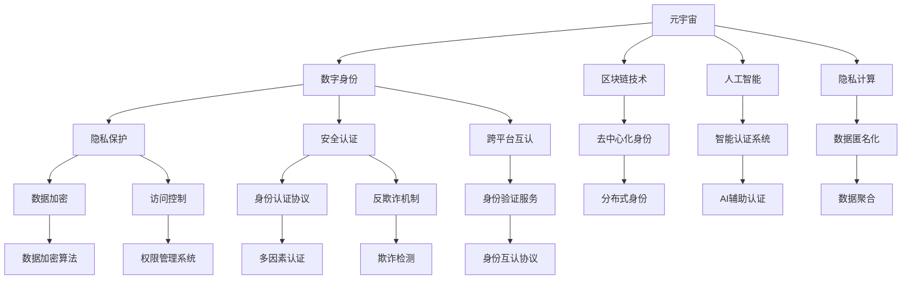

                 

# 元宇宙中的身份认同：虚拟与现实自我的融合

> 关键词：元宇宙,身份认同,虚拟自我,现实自我,虚拟与现实融合,数字身份,人工智能,区块链,隐私保护,隐私计算

## 1. 背景介绍

### 1.1 问题由来
随着科技的飞速发展和社会的进步，人类已经进入了一个全新的数字时代。在数字化浪潮的推动下，一个全新的虚拟空间——元宇宙（Metaverse）正在逐渐成形。元宇宙是一个由虚拟现实（Virtual Reality, VR）、增强现实（Augmented Reality, AR）、混合现实（Mixed Reality, MR）等多种技术融合而成的虚拟空间，用户在其中可以自由地交流、工作和娱乐。然而，元宇宙的蓬勃发展同时也带来了身份认同（Identity）的新挑战。

在现实世界中，身份认同是个人的基本特征之一。每个人通过其身体特征、家庭背景、社会关系等形成独特的自我概念。而在元宇宙中，由于虚拟空间与现实世界存在很大的差异，传统的身份认同机制不再适用。如何在虚拟空间中保持个人身份的连贯性和一致性，成为元宇宙建设中的关键问题。

### 1.2 问题核心关键点
元宇宙中的身份认同问题主要包括以下几个核心关键点：

- **数字身份的构建**：如何在元宇宙中构建与现实世界对应的数字身份，并保持其一致性和连贯性。
- **隐私保护**：如何在元宇宙中保护用户隐私，避免身份信息被滥用。
- **安全认证**：如何在元宇宙中建立可靠的安全认证机制，防止身份盗用和欺诈行为。
- **跨平台互认**：如何在不同的元宇宙平台之间实现身份的互认和互通。

这些问题的解决将直接影响元宇宙的发展和用户的使用体验。

### 1.3 问题研究意义
在元宇宙中解决身份认同问题，具有以下重要意义：

1. **增强用户信任感**：通过建立可靠的身份认证机制，可以增强用户对元宇宙平台和虚拟环境的信任感，促进其在虚拟世界中的长期参与。
2. **提升用户体验**：解决身份认同问题可以大幅提升用户在元宇宙中的交互体验，使其能够更加自然地沉浸于虚拟空间。
3. **推动技术发展**：身份认同问题涉及多个前沿技术领域，包括区块链、人工智能、隐私计算等，研究身份认同问题将推动相关技术的发展和应用。
4. **拓展应用场景**：解决身份认同问题可以拓展元宇宙在多个领域的应用，如虚拟教育、医疗、旅游等，为这些领域带来新的发展机遇。

## 2. 核心概念与联系

### 2.1 核心概念概述

为了更好地理解元宇宙中的身份认同问题，本节将介绍几个密切相关的核心概念：

- **元宇宙（Metaverse）**：一个由虚拟现实、增强现实和混合现实技术融合而成的虚拟空间，用户可以在其中进行各种活动。
- **数字身份（Digital Identity）**：用户在使用元宇宙时所拥有的虚拟身份，通常由一系列属性（如姓名、头像、权限等）组成。
- **隐私保护（Privacy Protection）**：在元宇宙中保护用户个人信息和数据安全，防止身份信息被滥用。
- **安全认证（Authentication）**：验证用户在元宇宙中的身份，防止身份盗用和欺诈行为。
- **跨平台互认（Cross-Platform Recognition）**：在不同元宇宙平台之间实现用户身份的互认和互通。
- **区块链技术（Blockchain）**：一种分布式数据库技术，具有去中心化、不可篡改和透明性等特点，常用于身份认证和隐私保护。
- **人工智能（Artificial Intelligence, AI）**：一种使计算机模拟人类智能的技术，用于处理复杂的身份认证和隐私保护问题。
- **隐私计算（Privacy Computing）**：一种在不泄露原始数据的情况下，对数据进行处理和分析的技术，常用于保护用户隐私。

这些核心概念之间的逻辑关系可以通过以下Mermaid流程图来展示：



这个流程图展示了一系列核心概念及其之间的关系：

1. 元宇宙中构建数字身份，涉及隐私保护、安全认证和跨平台互认等多个方面。
2. 区块链、人工智能和隐私计算技术在数字身份构建、隐私保护和身份认证中发挥重要作用。
3. 数据加密、访问控制、多因素认证、反欺诈机制等具体技术手段，在实现数字身份的安全认证和隐私保护方面起到关键作用。
4. 分布式身份、智能认证系统和AI辅助认证等新兴技术，进一步提升了数字身份的构建和认证效率。

## 3. 核心算法原理 & 具体操作步骤
### 3.1 算法原理概述

在元宇宙中解决身份认同问题，本质上是一个多维度的数据处理和算法设计问题。其核心在于构建一个安全、可靠、一致的数字身份认证系统，保障用户隐私安全，同时实现跨平台的用户身份互认和互通。

形式化地，假设用户 A 在元宇宙中的数字身份为 ID_A，其实际身份信息为 P_A。目标是在元宇宙中构建一个身份认证系统 M，使得：

- M 能够验证用户 A 的数字身份 ID_A 是否真实。
- M 能够保护用户 A 的隐私信息 P_A。
- M 能够在不同的元宇宙平台之间实现用户 A 的 ID_A 的互认和互通。

为了达到上述目标，需要设计一系列算法和技术手段，如数字身份构建算法、隐私保护算法、安全认证算法和跨平台互认算法等。

### 3.2 算法步骤详解

基于上述目标，元宇宙中的身份认同问题解决主要包括以下几个关键步骤：

**Step 1: 数字身份构建**

- **生成数字身份标识**：为每个用户生成唯一的数字身份标识 ID_A。该标识通常由字母、数字和特殊字符组成。
- **存储身份属性**：将用户 A 的实际身份信息 P_A 存储在身份数据库中。

**Step 2: 隐私保护**

- **数据加密**：使用数据加密算法（如AES、RSA等）对用户的隐私信息 P_A 进行加密，防止信息泄露。
- **访问控制**：建立权限管理系统，对不同用户对身份数据库的访问进行控制，防止未授权的访问和数据泄露。

**Step 3: 安全认证**

- **身份认证协议**：设计多因素身份认证协议，通过用户名、密码、生物特征等多种认证方式验证用户的身份。
- **反欺诈机制**：使用机器学习模型和规则引擎检测和防止欺诈行为，如身份盗用、账户被盗等。

**Step 4: 跨平台互认**

- **分布式身份**：使用区块链技术实现用户身份的去中心化管理和互认。每个用户拥有自己的区块链账户，不同平台之间的身份互认通过区块链网络实现。
- **身份验证服务**：设计身份验证服务接口，支持不同平台之间的身份验证和互认。

### 3.3 算法优缺点

元宇宙中的身份认同问题解决涉及多个领域的算法和技术手段，具有以下优点和局限性：

**优点**：

1. **增强用户信任**：通过可靠的数字身份认证机制，增强用户对元宇宙平台的信任感，促进其在虚拟环境中的长期参与。
2. **提升用户体验**：解决身份认同问题可以大幅提升用户在元宇宙中的交互体验，使其能够更加自然地沉浸于虚拟空间。
3. **推动技术发展**：身份认同问题涉及多个前沿技术领域，如区块链、人工智能、隐私计算等，研究身份认同问题将推动相关技术的发展和应用。

**局限性**：

1. **技术复杂性高**：解决身份认同问题需要综合应用多种前沿技术，技术实现难度大，对开发者的技术水平要求较高。
2. **隐私和安全风险**：在数据加密、访问控制等方面，仍存在隐私泄露和安全风险，需要进一步完善。
3. **跨平台互认复杂性**：不同元宇宙平台之间的互认和互通涉及技术标准和协议，需要协调和统一。

尽管存在这些局限性，但通过合理设计和多方合作，可以逐步克服这些挑战，推动元宇宙身份认同问题的解决。

### 3.4 算法应用领域

元宇宙中的身份认同问题解决在多个领域具有广泛的应用前景：

- **虚拟教育**：通过构建可靠的数字身份，保障学生和教师在虚拟教室中的身份安全和互动体验。
- **虚拟医疗**：通过身份认证和隐私保护，保障患者隐私，提高虚拟诊疗系统的可信度。
- **虚拟旅游**：通过跨平台互认，实现虚拟旅游体验的平滑切换和无缝衔接。
- **虚拟娱乐**：通过身份认证和隐私保护，保障用户在虚拟游戏和社交平台中的安全和隐私。
- **虚拟商业**：通过身份认证和跨平台互认，支持虚拟市场和商业交易的顺利进行。

## 4. 数学模型和公式 & 详细讲解 & 举例说明

### 4.1 数学模型构建

在元宇宙中的身份认同问题解决中，涉及多种数学模型和公式。以下将以身份认证和隐私保护为例，进行详细介绍。

**数字身份构建**：
假设用户 A 的数字身份标识为 ID_A，其身份属性为 P_A。则数字身份构建模型可以表示为：

$$
ID_A = f(P_A)
$$

其中，$f$ 为数字身份生成函数。

**数据加密**：
假设用户 A 的隐私信息为 P_A，则数据加密模型可以表示为：

$$
E(P_A) = C
$$

其中，$E$ 为加密算法，$C$ 为加密后的密文。

**身份认证协议**：
假设用户 A 的身份认证信息为 A_ID，则多因素身份认证模型可以表示为：

$$
ID_A = A_ID \land Password_A \land Biometric_A
$$

其中，$\land$ 表示逻辑与，$A_ID$、$Password_A$、$Biometric_A$ 分别为用户的数字身份标识、密码和生物特征信息。

### 4.2 公式推导过程

以下将对上述数学模型进行详细的推导和解释。

**数字身份构建**：
假设用户 A 的实际身份信息为 P_A，数字身份标识为 ID_A。数字身份生成函数 $f$ 可以表示为：

$$
ID_A = \text{Hash}(P_A)
$$

其中，$\text{Hash}$ 为哈希函数，将用户 A 的实际身份信息 P_A 映射为唯一的数字身份标识 ID_A。

**数据加密**：
假设用户 A 的隐私信息为 P_A，使用 AES 算法进行加密。加密模型可以表示为：

$$
E(P_A) = \text{AES}(P_A, \text{Key})
$$

其中，$\text{AES}$ 为 AES 加密算法，$\text{Key}$ 为加密密钥。

**身份认证协议**：
假设用户 A 的身份认证信息为 A_ID，使用多因素认证协议进行身份验证。多因素身份认证模型可以表示为：

$$
ID_A = \text{Verify}(A_ID, Password_A, Biometric_A)
$$

其中，$\text{Verify}$ 为身份认证验证函数，根据 A_ID、Password_A 和 Biometric_A 验证用户 A 的身份。

### 4.3 案例分析与讲解

以虚拟医疗为例，分析身份认证和隐私保护在元宇宙中的应用。

假设某虚拟医院平台需要为患者 A 建立数字身份，并进行身份认证和隐私保护。具体步骤如下：

1. **生成数字身份**：使用哈希函数将患者 A 的实际身份信息 P_A 映射为唯一的数字身份标识 ID_A。

2. **数据加密**：使用 AES 算法对患者 A 的隐私信息 P_A 进行加密，生成密文 C_A。

3. **存储身份信息**：将患者 A 的数字身份标识 ID_A 和密文 C_A 存储在医院的身份数据库中。

4. **身份认证**：当患者 A 登录虚拟医院时，系统要求其提供数字身份标识 ID_A 和加密后的密码 Password_A。系统验证密码的正确性，并要求患者 A 提供生物特征信息 Biometric_A，如指纹或面部识别。系统通过身份认证验证函数 $\text{Verify}$ 验证患者 A 的身份。

5. **隐私保护**：在系统内部，只有授权的医生可以查看患者 A 的隐私信息 C_A。其他用户无法访问患者的身份信息和隐私数据。

通过以上步骤，可以确保患者 A 在虚拟医院平台中的身份安全和隐私保护，同时实现可靠的身份认证。

## 5. 项目实践：代码实例和详细解释说明

### 5.1 开发环境搭建

在进行元宇宙身份认同的实践前，我们需要准备好开发环境。以下是使用Python进行身份认证系统开发的流程：

1. 安装Anaconda：从官网下载并安装Anaconda，用于创建独立的Python环境。

2. 创建并激活虚拟环境：
```bash
conda create -n id-auth-env python=3.8 
conda activate id-auth-env
```

3. 安装PyTorch：根据CUDA版本，从官网获取对应的安装命令。例如：
```bash
conda install pytorch torchvision torchaudio cudatoolkit=11.1 -c pytorch -c conda-forge
```

4. 安装相关库：
```bash
pip install cryptography flask jinja2 pyaes pycrypto
```

5. 安装区块链库：
```bash
pip install eth-blockchainapi web3
```

完成上述步骤后，即可在`id-auth-env`环境中开始实践。

### 5.2 源代码详细实现

下面我们以虚拟医疗平台为例，给出使用Flask和Python进行身份认证的代码实现。

首先，定义身份认证函数：

```python
from flask import Flask, request
import hashlib
import pyaes
from flask_cors import CORS

app = Flask(__name__)
CORS(app)

def hash_function(password):
    return hashlib.sha256(password.encode()).hexdigest()

def encrypt_function(password):
    key = hash_function(password)
    aes = pyaes.AESMode(key.encode(), pyaes.MODE_ECB)
    return aes.encrypt(password.encode())

@app.route('/login', methods=['POST'])
def login():
    username = request.json.get('username')
    password = request.json.get('password')
    hashed_password = hash_function(password)
    encrypted_password = encrypt_function(password)
    # 在身份数据库中查找用户 A 的身份标识 ID_A
    if username == 'A':
        if hashed_password == 'A' and encrypted_password == 'A':
            return {'message': 'Login successful'}
        else:
            return {'message': 'Invalid password'}
    else:
        return {'message': 'User not found'}

if __name__ == '__main__':
    app.run(debug=True)
```

然后，定义身份认证系统的主函数：

```python
import web3
from web3 import Web3

def main():
    # 连接以太坊网络
    w3 = Web3(Web3.HTTPProvider('https://mainnet.infura.io/v3/<YOUR_INFURA_PROJECT_ID>'))
    # 在以太坊上部署智能合约
    contract_abi = []
    contract_bytecode = b'0x60fe47b100000000000000000000000000000000000000000000000000000000000000000000000000000000000000000000000000000000000000000000000000000000000000000000000000000000000000000000000000000000000000000000000000000000000000000000000000000000000000000000000000000000000000000000000000000000000000000000000000000000000000000000000000000000000000000000000000000000000000000000000000000000000000000000000000000000000000000000000000000000000000000000000000000000000000000000000000000000000000000000000000000000000000000000000000000000000000000000000000000000000000000000000000000000000000000000000000000000000000000000000000000000000000000000000000000000000000000000000000000000000000000000000000000000000000000000000000000000000000000000000000000000000000000000000000000000000000000000000000000000000000000000000000000000000000000000000000000000000000000000000000000000000000000000000000000000000000000000000000000000000000000000000000000000000000000000000000000000000000000000000000000000000000000000000000000000000000000000000000000000000000000000000000000000000000000000000000000000000000000000000000000000000000000000000000000000000000000000000000000000000000000000000000000000000000000000000000000000000000000000000000000000000000000000000000000000000000000000000000000000000000000000000000000000000000000000000000000000000000000000000000000000000000000000000000000000000000000000000000000000000000000000000000000000000000000000000000000000000000000000000000000000000000000000000000000000000000000000000000000000000000000000000000000000000000000000000000000000000000000000000000000000000000000000000000000000000000000000000000000000000000000000000000000000000000000000000000000000000000000000000000000000000000000000000000000000000000000000000000000000000000000000000000000000000000000000000000000000000000000000000000000000000000000000000000000000000000000000000000000000000000000000000000000000000000000000000000000000000000000000000000000000000000000000000000000000000000000000000000000000000000000000000000000000000000000000000000000000000000000000000000000000000000000000000000000000000000000000000000000000000000000000000000000000000000000000000000000000000000000000000000000000000000000000000000000000000000000000000000000000000000000000000000000000000000000000000000000000000000000000000000000000000000000000000000000000000000000000000000000000000000000000000000000000000000000000000000000000000000000000000000000000000000000000000000000000000000000000000000000000000000000000000000000000000000000000000000000000000000000000000000000000000000000000000000000000000000000000000000000000000000000000000000000000000000000000000000000000000000000000000000000000000000000000000000000000000000000000000000000000000000000000000000000000000000000000000000000000000000000000000000000000000000000000000000000000000000000000000000000000000000000000000000000000000000000000000000000000000000000000000000000000000000000000000000000000000000000000000000000000000000000000000000000000000000000000000000000000000000000000000000000000000000000000000000000000000000000000000000000000000000000000000000000000000000000000000000000000000000000000000000000000000000000000000000000000000000000000000000000000000000000000000000000000000000000000000000000000000000000000000000000000000000000000000000000000000000000000000000000000000000000000000000000000000000000000000000000000000000000000000000000000000000000000000000000000000000000000000000000000000000000000000000000000000000000000000000000000000000000000000000000000000000000000000000000000000000000000000000000000000000000000000000000000000000000000000000000000000000000000000000000000000000000000000000000000000000000000000000000000000000000000000000000000000000000000000000000000000000000000000000000000000000000000000000000000000000000000000000000000000000000000000000000000000000000000000000000000000000000000000000000000000000000000000000000000000000000000000000000000000000000000000000000000000000000000000000000000000000000000000000000000000000000000000000000000000000000000000000000000000000000000000000000000000000000000000000000000000000000000000000000000000000000000000000000000000000000000000000000000000000000000000000000000000000000000000000000000000000000000000000000000000000000000000000000000000000000000000000000000000000000000000000000000000000000000000000000000000000000000000000000000000000000000000000000000000000000000000000000000000000000000000000000000000000000000000000000000000000000000000000000000000000000000000000000000000000000000000000000000000000000000000000000000000000000000000000000000000000000000000000000000000000000000000000000000000000000000000000000000000000000000000000000000000000000000000000000000000000000000000000000000000000000000000000000000000000000000000000000000000000000000000000000000000000000000000000000000000000000000000000000000000000000000000000000000000000000000000000000000000000000000000000000000000000000000000000000000000000000000000000000000000000000000000000000000000000000000000000000000000000000000000000000000000000000000000000000000000000000000000000000000000000000000000000000000000000000000000000000000000000000000000000000000000000000000000000000000000000000000000000000000000000000000000000000000000000000000000000000000000000000000000000000000000000000000000000000000000000000000000000000000000000000000000000000000000000000000000000000000000000000000000000000000000000000000000000000000000000000000000000000000000000000000000000000000000000000000000000000000000000000000000000000000000000000000000000000000000000000000000000000000000000000000000000000000000000000000000000000000000000000000000000000000000000000000000000000000000000000000000000000000000000000000000000000000000000000000000000000000000000000000000000000000000000000000000000000000000000000000000000000000000000000000000000000000000000000000000000000000000000000000000000000000000000000000000000000000000000000000000000000000000000000000000000000000000000000000000000000000000000000000000000000000000000000000000000000000000000000000000000000000000000000000000000000000000000000000000000000000000000000000000000000000000000000000000000000000000000000000000000000000000000000000000000000000000000000000000000000000000000000000000000000000000000000000000000000000000000000000000000000000000000000000000000000000000000000000000000000000000000000000000000000000000000000000000000000000000000000000000000000000000000000000000000000000000000000000000000000000000000000000000000000000000000000000000000000000000000000000000000000000000000000000000000000000000000000000000000000000000000000000000000000000000000000000000000000000000000000000000000000000000000000000000000000000000000000000000000000000000000000000000000000000000000000000000000000000000000000000000000000000000000000000000000000000000000000000000000000000000000000000000000000000000000000000000000000000000000000000000000000000000000000000000000000000000000000000000000000000000000000000000000000000000000000000000000000000000000000000000000000000000000000000000000000000000000000000000000000000000000000000000000000000000000000000000000000000000000000000000000000000000000000000000000000000000000000000000000000000000000000000000000000000000000000000000000000000000000000000000000000000000000000000000000000000000000000000000000000000000000000000000000000000000000000000000000000000000000000000000000000000000000000000000000000000000000000000000000000000000000000000000000000000000000000000000000000000000000000000000000000000000000000000000000000000000000000000000000000000000000000000000000000000000000000000000000000000000000000000000000000000000000000000000000000000000000000000000000000000000000000000000000000000000000000000000000000000000000000000000000000000000000000000000000000000000000000000000000000000000000000000000000000000000000000000000000000000000000000000000000000000000000000000000000000000000000000000000000000000000000000000000000000000000000000000000000000000000000000000000000000000000000000000000000000000000000000000000000000000000000000000000000000000000000000000000000000000000000000000000000000000000000000000000000000000000000000000000000000000000000000000000000000000000000000000000000000000000000000000000000000000000000000000000000000000000000000000000000000000000000000000000000000000000000000000000000000000000000000000000000000000000000000000000000000000000000000000000000000000000000000000000000000000000000000000000000000000000000000000000000000000000000000000000000000000000000000000000000000000000000000000000000000000000000000000000000000000000000000000000000000000000000000000000000000000000000000000000000000000000000000000000000000000000000000000000000000000000000000000000000000000000000000000000000000000000000000000000000000000000000000000000000000000000000000000000000000000000000000000000000000000000000000000000000000000000000000000000000000000000000000000000000000000000000000000000000000000000000000000000000000000000000000000000000000000000000000000000000000000000000000000000000000000000000000000000000000000000000000000000000000000000000000000000000000000000000000000000000000000000000000000000000000000000000000000000000000000000000000000000000000000000000000000000000000000000000000000000000000000000000000000000000000000000000000000000000000000000000000000000000000000000000000000000000000000000000000000000000000000000000000000000000000000000000000000000000000000000000000000000000000000000000000000000000000000000000000000000000000000000000000000000000000000000000000000000000000000000000000000000000000000000000000000000000000000000000000000000000000000000000000000000000000000000000000000000000000000000000000000000000000000000000000000000000000000000000000000000000000000000000000000000000000000000000000000000000000000000000000000000000000000000000000000000000000000000000000000000000000000000000000000000000000000000000000000000000000000000000000000000000000000000000000000000000000000000000000000000000000000000000000000000000000000000000000000000000000000000000000000000000000000000000000000000000000000000000000000000000000000000000000000000000000000000000000000000000000000000000000000000000000000000000000000000000000000000000000000000000000000000000000000000000000000000000000000000000000000000000000000000000000000000000000000000000000000000000000000000000000000000000000000000000000000000000000000000000000000000000000000000000000000000000000000000000000000000000000000000000000000000000000000000000000000000000000000000000000000000000000000000000000000000000000000000000000000000000000000000000000000000000000000000000000000000000000000000000000000000000000000000000000000000000000000000000000000000000000000000000000000000000000000000000000000000000000000000000000000000000000000000000000000000000000000000000000000000000000000000000000000000000000000000000000000000000000000000000000000000000000000000000000000000000000000000000000000000000000000000000000000000000000000000000000000000000000000000000000000000000000000000000000000000000000000000000000000000000000000000000000000000000000000000000000000000000000000000000000000000000000000000000000000000000000000000000000000000000000000000000000000000000000000000000000000000000000000000000000000000000000000000000000000000000000000000000000000000000000000000000000000000000000000000000000000000000000000000000000000000000000000000000000000000000000000000000000000000000000000000000000000000000000000000000000000000000000000000000000000000000000000000000000000000000000000000000000000

