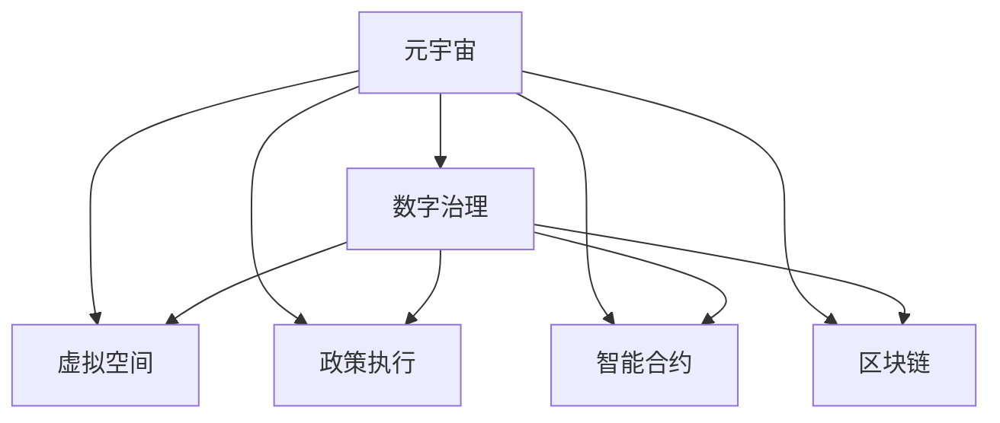

                 

# 元宇宙政府架构:全球治理的数字化新模式

> 关键词：元宇宙, 数字治理, 虚拟空间, 政策执行, 智能合约, 区块链, 政府自动化

## 1. 背景介绍

### 1.1 问题由来

随着数字技术的迅猛发展，元宇宙的概念逐渐成为全球技术界的热门话题。元宇宙（Metaverse），作为虚拟现实（VR）、增强现实（AR）、区块链（Blockchain）、人工智能（AI）等多项技术的深度融合，预示着一个全新的数字生活和工作空间。在这样一个数字化、虚拟化的未来世界，传统的物理空间和现实社会将逐步向数字空间和元宇宙转型，带来诸多治理和监管上的挑战。

全球各国政府开始意识到，传统的法律和监管框架可能难以适应元宇宙环境的复杂性和动态性。数字治理（Digital Governance）成为迫切需要解决的问题。数字治理不仅关注数据、算法和网络空间的治理，还涉及整个社会的数字化转型和变革。

### 1.2 问题核心关键点

元宇宙数字治理的关键点包括：
- 如何构建一个覆盖虚拟空间的治理架构，确保元宇宙秩序的稳定性和可预测性。
- 如何在元宇宙中实现政策法规的有效执行，防止违法行为。
- 如何保障用户隐私和数据安全，建立可信的数字身份和数字资产管理系统。
- 如何通过智能合约和区块链技术，实现元宇宙环境的自我管理和自我治理。
- 如何构建元宇宙政府机构，实现政府职能的数字化和智能化。

### 1.3 问题研究意义

在元宇宙时代，数字化治理将成为全球治理的重要组成部分，其意义和影响深远：
- 提升治理效率。数字化和智能化手段可以显著提升政策执行和治理效率，降低成本。
- 促进公平正义。数字化治理可以帮助消除信息不对称，实现公平正义的社会治理。
- 增强透明度和信任。数字化治理通过公开透明的数据和算法，增强社会信任。
- 助力经济创新。数字化治理可以为新兴数字产业的发展提供良好的环境支持。
- 促进国际合作。数字化治理有助于全球治理标准的统一，促进国际合作和交流。

## 2. 核心概念与联系

### 2.1 核心概念概述

为更好地理解元宇宙数字治理架构，本节将介绍几个密切相关的核心概念：

- **元宇宙（Metaverse）**：由虚拟现实、增强现实、区块链、人工智能等多项技术融合构成的数字生活和工作空间。
- **数字治理（Digital Governance）**：利用数字技术和智能合约等手段，实现对虚拟空间和现实社会的有效治理。
- **虚拟空间（Virtual Space）**：元宇宙中的数字化空间，包括虚拟城市、虚拟社区、虚拟市场等。
- **政策执行（Policy Enforcement）**：将现实中的法律法规和政策要求，通过智能合约和区块链等技术，应用于元宇宙中，确保政策法规的有效执行。
- **智能合约（Smart Contracts）**：基于区块链技术的自执行合约，不需要第三方干预，自动执行合同条款。
- **区块链（Blockchain）**：一种去中心化的分布式账本技术，确保数据透明和不可篡改。

这些核心概念之间的逻辑关系可以通过以下Mermaid流程图来展示：



这个流程图展示了大语言模型的核心概念及其之间的关系：

1. 元宇宙作为数字治理的对象和场景。
2. 数字治理是元宇宙中的治理手段和工具。
3. 虚拟空间是元宇宙中的具体环境。
4. 政策执行是元宇宙中对现实政策法规的落实。
5. 智能合约是政策执行的技术手段。
6. 区块链是智能合约的基础设施。

## 3. 核心算法原理 & 具体操作步骤

### 3.1 算法原理概述

元宇宙数字治理的核心算法原理基于区块链和智能合约技术，通过去中心化的方式实现对虚拟空间和现实政策的有效执行。

具体来说，算法原理包括：
- 利用区块链的分布式账本技术，确保数据透明、不可篡改，为数字治理提供可信基础。
- 通过智能合约的自动化执行机制，实现政策法规的自动执行和监控，降低治理成本。
- 结合AI和大数据分析技术，实现对虚拟空间和用户行为的智能分析，提升治理效率。
- 引入用户行为模型和规则引擎，实现动态调整和优化政策执行策略。

### 3.2 算法步骤详解

元宇宙数字治理的算法步骤主要包括以下几个关键环节：

**Step 1: 构建数字治理架构**

- 确定治理目标和范围，包括虚拟空间的法律、道德、经济等各个方面。
- 设计治理规则和智能合约，明确各方的权利和义务。
- 选择适合的区块链平台，构建治理区块链网络。

**Step 2: 部署智能合约**

- 编写智能合约代码，定义合同条款、执行条件和执行逻辑。
- 将智能合约部署到区块链网络，使其具备自执行功能。
- 配置合约参数和权限，确保合约安全、可控。

**Step 3: 数据收集与分析**

- 收集虚拟空间中的用户行为数据，包括交易记录、互动信息等。
- 利用AI和大数据分析技术，分析用户行为模式和趋势。
- 通过用户行为模型和规则引擎，进行预测和预警，及时发现并处理异常行为。

**Step 4: 政策执行与监控**

- 利用智能合约的执行机制，自动执行政策法规。
- 配置监控系统，实时监控智能合约的执行状态和用户行为。
- 对违规行为进行惩罚和纠正，维护虚拟空间秩序。

**Step 5: 用户反馈与优化**

- 收集用户反馈，评估政策执行效果。
- 根据用户反馈和数据分析结果，动态调整和优化政策执行策略。
- 定期评估治理架构的有效性，进行迭代升级。

### 3.3 算法优缺点

元宇宙数字治理算法具有以下优点：
- 去中心化、透明可信，减少治理过程中的信息不对称。
- 自动执行、高效快捷，降低治理成本和执行难度。
- 数据分析、智能决策，提升治理效率和响应速度。
- 动态调整、持续优化，适应复杂多变的虚拟环境。

同时，该算法也存在一定的局限性：
- 技术复杂、成本较高，对区块链和智能合约技术要求高。
- 难以应对极端情况，如智能合约漏洞、黑客攻击等。
- 数据隐私和安全问题，需要严格的数据保护措施。
- 对法律和道德标准的依赖，需要建立统一的数字治理框架。

### 3.4 算法应用领域

元宇宙数字治理算法广泛应用于虚拟空间中的多个领域，包括但不限于：

- **虚拟城市管理**：通过智能合约和区块链，实现虚拟城市的公共服务、交通管理、环境监控等。
- **虚拟市场监管**：对虚拟商品和服务的交易行为进行监管，保障市场秩序和消费者权益。
- **虚拟身份认证**：构建虚拟身份识别系统，确保用户身份的真实性和合法性。
- **虚拟法律执行**：将现实法律和政策要求，通过智能合约和区块链技术，应用于虚拟空间中。
- **虚拟经济调控**：利用智能合约和数据分析，对虚拟货币和金融市场进行调控和管理。

除了上述这些经典应用外，元宇宙数字治理算法还被创新性地应用于更多场景中，如元宇宙安全保障、隐私保护、用户行为分析等，为元宇宙环境的健康有序发展提供了有力保障。

## 4. 数学模型和公式 & 详细讲解 & 举例说明

### 4.1 数学模型构建

元宇宙数字治理的核心数学模型涉及智能合约的执行机制、用户行为模型和规则引擎等多个方面。

以虚拟市场监管为例，我们假设用户A在虚拟市场B上购买商品C，交易金额为D。用户行为模型可以表示为：

$$
B = A \times C
$$

其中B表示交易总额，A表示商品价格，C表示购买数量。智能合约的执行条件和逻辑可以表示为：

$$
S = (A > 0) \wedge (C > 0) \wedge (D > 0)
$$

其中S表示智能合约的执行状态，当A、C、D均大于0时，合约执行。

### 4.2 公式推导过程

以虚拟城市公共服务为例，我们假设城市A的公共服务需求为X，服务提供方为Y，服务费用为Z。用户行为模型可以表示为：

$$
X = f(Y, Z)
$$

其中f表示服务需求与提供方和费用的关系。智能合约的执行机制可以表示为：

$$
S = g(X, Y, Z)
$$

其中g表示智能合约的执行条件，当服务需求满足要求时，合约执行。

### 4.3 案例分析与讲解

以虚拟身份认证为例，我们假设用户A需要在虚拟社区B上进行身份验证，认证过程涉及多个步骤。用户行为模型可以表示为：

$$
V = I \times P
$$

其中V表示验证状态，I表示身份信息，P表示认证结果。智能合约的执行逻辑可以表示为：

$$
S = (I \in ID) \wedge (P = OK)
$$

其中ID表示合法身份库，OK表示验证通过。

## 5. 项目实践：代码实例和详细解释说明

### 5.1 开发环境搭建

在进行元宇宙数字治理项目开发前，我们需要准备好开发环境。以下是使用Python进行区块链和智能合约开发的环境配置流程：

1. 安装Python：从官网下载并安装Python，确保版本在3.8及以上。
2. 安装Solidity：下载并安装Solidity编译器和IDE，如Remix IDE。
3. 安装Web3.js：下载并安装Web3.js库，用于与以太坊网络交互。
4. 安装M星际链（MiLiChain）：下载并安装M星际链客户端，用于构建和部署智能合约。
5. 安装网络节点：从M星际链官网下载并安装节点软件，搭建区块链网络。

完成上述步骤后，即可在M星际链网络中进行元宇宙数字治理项目开发。

### 5.2 源代码详细实现

这里我们以虚拟城市公共服务为例，给出使用Solidity和Web3.js进行智能合约开发的PyTorch代码实现。

首先，定义智能合约的部署函数：

```python
from web3 import Web3
from flask import Flask, request
from solidity_kernel import SolidityKernel
from solidity_kernel.tools import solidity_abi
from flask_httpauth import HTTPBasicAuth

# 创建Web3实例
w3 = Web3(Web3.HTTPProvider('http://127.0.0.1:8545'))

# 创建Flask应用
app = Flask(__name__)

# 创建HTTP认证
auth = HTTPBasicAuth()

# 定义智能合约ABI
abi = solidity_abi(abi_file)

# 定义智能合约地址
contract_address = '0x1234567890abcdef'

# 定义智能合约接口
contract_interface = SolidityKernel.create_interface_from_abi(abi)

# 定义智能合约操作
def deploy_contract():
    # 创建智能合约对象
    contract = contract_interface(w3, contract_address)
    
    # 编写智能合约代码
    contract.create(1, 2, 3)
    
    # 部署智能合约
    contract.deploy().then(lambda tx: print("Contract deployed successfully"))
```

然后，编写智能合约的运行函数：

```python
def run():
    # 创建智能合约对象
    contract = contract_interface(w3, contract_address)
    
    # 查询智能合约状态
    result = contract.query_function(1, 2, 3)
    
    # 输出智能合约状态
    print(result)

if __name__ == "__main__":
    app.run(host='0.0.0.0', port=5000)
```

最后，启动智能合约运行环境，并测试智能合约的功能：

```python
if __name__ == "__main__":
    app.run(host='0.0.0.0', port=5000)
```

以上就是使用Solidity和Web3.js进行元宇宙数字治理项目开发的完整代码实现。可以看到，通过Solidity编写智能合约，并通过Web3.js和Flask构建应用接口，可以方便地进行元宇宙数字治理项目的部署和测试。

### 5.3 代码解读与分析

让我们再详细解读一下关键代码的实现细节：

**智能合约部署函数**：
- 创建Web3实例，用于与以太坊网络交互。
- 创建Flask应用，用于构建API接口。
- 定义智能合约ABI，用于与智能合约进行交互。
- 定义智能合约地址和接口，准备部署合约。
- 编写智能合约代码，定义函数和参数。
- 部署智能合约，并在控制台输出部署结果。

**智能合约运行函数**：
- 创建智能合约对象，用于查询和操作合约。
- 查询智能合约状态，返回函数调用结果。
- 输出智能合约状态，便于调试和测试。

**主运行程序**：
- 启动Flask应用，监听指定端口。
- 运行智能合约应用，提供API接口服务。

可以看到，Solidity和Web3.js提供了丰富的工具和库，可以方便地进行智能合约的开发和部署。结合Flask等Web框架，可以构建灵活的API接口，方便地对智能合约进行操作和测试。

当然，工业级的系统实现还需考虑更多因素，如智能合约的优化和验证、API接口的安全性和性能优化、区块链网络的稳定性和扩展性等。但核心的开发流程基本与此类似。

## 6. 实际应用场景

### 6.1 虚拟城市管理

在元宇宙中，虚拟城市管理是一个典型的数字治理应用场景。通过智能合约和区块链技术，可以实现城市管理的自动化和智能化。例如：

- **公共服务**：通过智能合约管理公共服务设施，如路灯、公共交通、环卫等。
- **交通管理**：利用区块链记录交通违规信息，通过智能合约进行违规处理和罚款。
- **环境监控**：通过智能合约实时监控环境指标，如空气质量、水质等，及时采取措施。

### 6.2 虚拟市场监管

元宇宙中的虚拟市场监管，同样可以依靠智能合约和区块链技术实现。例如：

- **商品交易**：通过智能合约管理虚拟商品的交易，保障交易安全和透明。
- **市场监管**：利用区块链记录交易数据，通过智能合约进行市场监管和打击违规行为。
- **用户评价**：通过智能合约收集用户评价，进行市场信誉管理。

### 6.3 虚拟身份认证

虚拟身份认证是元宇宙中用户管理和安全保障的重要环节。例如：

- **身份验证**：通过智能合约管理虚拟身份信息，进行身份验证和授权。
- **权限管理**：通过智能合约设置和管理用户权限，保障用户安全。
- **隐私保护**：利用区块链保护用户隐私，防止信息泄露和滥用。

### 6.4 未来应用展望

随着元宇宙技术的不断发展和应用，元宇宙数字治理的前景广阔。未来，元宇宙数字治理将广泛应用于以下几个领域：

- **虚拟政府**：构建虚拟政府机构，实现政府职能的数字化和智能化。
- **虚拟法律**：制定虚拟法律和政策，实现对元宇宙环境的规范和监管。
- **虚拟社会治理**：通过智能合约和区块链技术，实现社会治理的智能化和透明化。
- **虚拟安全保障**：利用智能合约和区块链技术，保障元宇宙环境的安全和稳定。
- **虚拟经济调控**：通过智能合约和数据分析，对虚拟经济进行调控和管理。

## 7. 工具和资源推荐

### 7.1 学习资源推荐

为了帮助开发者系统掌握元宇宙数字治理的理论基础和实践技巧，这里推荐一些优质的学习资源：

1. 《区块链技术与数字治理》系列博文：由区块链技术专家撰写，深入浅出地介绍了区块链技术和数字治理的基本概念和应用场景。

2. 《智能合约编程指南》书籍：详细介绍了智能合约的编写和部署流程，涵盖Solidity和Web3.js的使用方法。

3. CS224N《自然语言处理》课程：斯坦福大学开设的自然语言处理课程，涵盖了NLP的基本概念和经典模型，是学习数字治理的基础。

4. Solidity官方文档：Solidity官方提供的详细文档，包括语言规范、编译器使用、智能合约开发等方面的内容。

5. Web3.js官方文档：Web3.js官方提供的详细文档，包括Web3.js的用法、网络交互、智能合约操作等方面的内容。

通过这些资源的学习实践，相信你一定能够快速掌握元宇宙数字治理的精髓，并用于解决实际的元宇宙问题。

### 7.2 开发工具推荐

高效的开发离不开优秀的工具支持。以下是几款用于元宇宙数字治理开发的常用工具：

1. Solidity编译器：如Remix IDE，提供智能合约的开发、测试和部署环境。
2. Web3.js库：用于与以太坊网络交互，提供API接口和链上操作。
3. Flask框架：用于构建API接口，实现智能合约的远程操作和数据交互。
4. Docker容器：用于打包和部署智能合约应用，确保应用的稳定性和可移植性。
5. Tendermint客户端：用于搭建和维护区块链网络，确保网络的安全和高效。

合理利用这些工具，可以显著提升元宇宙数字治理任务的开发效率，加快创新迭代的步伐。

### 7.3 相关论文推荐

元宇宙数字治理的发展源于学界的持续研究。以下是几篇奠基性的相关论文，推荐阅读：

1. 《区块链技术与数字治理》：介绍了区块链技术在数字治理中的应用，涵盖智能合约、区块链安全、数字身份等方面。

2. 《智能合约在数字治理中的应用》：详细讨论了智能合约在数字治理中的作用，探讨了智能合约的设计和优化方法。

3. 《数字治理的理论与实践》：探讨了数字治理的基本理论和实践方法，提出了数字治理的框架和模型。

4. 《区块链与元宇宙》：介绍了区块链技术在元宇宙中的应用，探讨了元宇宙治理的实现方法。

5. 《智能合约与数字身份管理》：讨论了智能合约在数字身份管理中的应用，提出了数字身份管理的模型和算法。

这些论文代表了大语言模型微调技术的发展脉络。通过学习这些前沿成果，可以帮助研究者把握学科前进方向，激发更多的创新灵感。

## 8. 总结：未来发展趋势与挑战

### 8.1 总结

本文对元宇宙数字治理架构进行了全面系统的介绍。首先阐述了元宇宙和数字治理的基本概念和研究背景，明确了元宇宙数字治理在虚拟空间和现实社会治理中的重要地位。其次，从原理到实践，详细讲解了元宇宙数字治理的数学模型和核心算法，给出了智能合约和区块链技术的实现代码实例。同时，本文还广泛探讨了元宇宙数字治理在虚拟城市管理、虚拟市场监管、虚拟身份认证等多个领域的实际应用前景，展示了元宇宙数字治理的广阔前景。此外，本文精选了元宇宙数字治理的学习资源，力求为读者提供全方位的技术指引。

通过本文的系统梳理，可以看到，元宇宙数字治理作为数字治理的重要组成部分，在虚拟空间中的治理和监管中扮演着重要角色。数字化、智能化的手段可以有效提升治理效率和响应速度，保障虚拟空间的安全和稳定，为元宇宙环境的健康有序发展提供有力保障。未来，伴随元宇宙技术的不断发展和应用，元宇宙数字治理必将在全球治理中发挥越来越重要的作用。

### 8.2 未来发展趋势

展望未来，元宇宙数字治理技术将呈现以下几个发展趋势：

1. 区块链网络的扩展和优化。未来元宇宙数字治理将依赖更高效、更安全的区块链网络，提升系统的稳定性和可扩展性。

2. 智能合约的升级和优化。通过引入最新的智能合约技术和开发方法，实现更高效率、更低成本、更安全可靠的智能合约部署和管理。

3. 多模态数据的融合和处理。结合AI和大数据技术，实现对虚拟空间和用户行为的深度分析和智能决策。

4. 元宇宙法律和政策的完善。建立统一的数字治理法律和政策框架，保障元宇宙环境的公平和正义。

5. 元宇宙安全保障的强化。通过智能合约和区块链技术，提升元宇宙环境的安全性和抗风险能力。

以上趋势凸显了元宇宙数字治理技术的广阔前景。这些方向的探索发展，必将进一步提升元宇宙环境的治理效率和响应速度，为全球治理提供新的思路和手段。

### 8.3 面临的挑战

尽管元宇宙数字治理技术已经取得了显著进展，但在迈向更加智能化、普适化应用的过程中，它仍面临着诸多挑战：

1. 技术复杂性和成本高昂。元宇宙数字治理涉及区块链、智能合约、AI和大数据等多项技术，技术复杂度高，开发和部署成本高。

2. 系统安全性和可靠性问题。元宇宙数字治理需要确保系统的稳定性和安全性，防止智能合约漏洞、黑客攻击等问题。

3. 数据隐私和安全问题。元宇宙数字治理需要保护用户隐私和数据安全，防止数据泄露和滥用。

4. 法律和道德标准的缺失。元宇宙数字治理需要建立统一的数字治理法律和道德标准，保障治理的合法性和公正性。

5. 跨平台和跨系统的互操作性问题。元宇宙数字治理需要确保不同平台和系统之间的互操作性，避免信息孤岛。

6. 用户接受度和使用习惯问题。元宇宙数字治理需要考虑用户接受度和使用习惯，提升用户体验和接受度。

正视元宇宙数字治理面临的这些挑战，积极应对并寻求突破，将是大语言模型微调走向成熟的必由之路。相信随着学界和产业界的共同努力，这些挑战终将一一被克服，元宇宙数字治理必将在全球治理中发挥越来越重要的作用。

### 8.4 研究展望

面对元宇宙数字治理所面临的种种挑战，未来的研究需要在以下几个方面寻求新的突破：

1. 探索更高效、更安全的区块链网络。开发更高效、更安全的区块链技术，提升元宇宙数字治理的稳定性和可扩展性。

2. 研究智能合约的升级和优化方法。开发更高效、更安全、更智能的智能合约技术，提升元宇宙数字治理的效率和可靠性。

3. 引入更多先验知识和专家系统。将符号化的先验知识和专家系统与元宇宙数字治理技术相结合，增强系统的智能性和决策能力。

4. 融合因果分析和博弈论工具。将因果分析方法引入元宇宙数字治理系统，识别出系统脆弱点，增强系统的稳定性和鲁棒性。

5. 构建统一的数字治理法律和政策框架。制定统一的数字治理法律和政策，保障元宇宙环境的公平和正义。

6. 引入用户行为模型和规则引擎。通过用户行为模型和规则引擎，实现动态调整和优化元宇宙数字治理策略。

这些研究方向的探索，必将引领元宇宙数字治理技术迈向更高的台阶，为全球治理提供新的思路和手段。面向未来，元宇宙数字治理技术还需要与其他人工智能技术进行更深入的融合，如知识表示、因果推理、强化学习等，多路径协同发力，共同推动元宇宙环境的健康有序发展。

## 9. 附录：常见问题与解答

**Q1：如何构建元宇宙数字治理架构？**

A: 构建元宇宙数字治理架构需要以下步骤：
1. 确定治理目标和范围。
2. 设计治理规则和智能合约。
3. 选择适合的区块链平台，构建治理区块链网络。
4. 部署智能合约，配置合约参数和权限。
5. 收集和分析用户行为数据。
6. 实时监控智能合约的执行状态和用户行为。
7. 根据用户反馈和数据分析结果，动态调整和优化政策执行策略。

**Q2：元宇宙数字治理如何保障数据隐私和安全？**

A: 元宇宙数字治理需要采取以下措施保障数据隐私和安全：
1. 采用区块链技术，确保数据透明和不可篡改。
2. 利用智能合约的权限控制，限制数据的访问和使用。
3. 引入数据加密技术，保护数据的隐私和安全。
4. 定期进行安全审计和风险评估，及时发现和修复安全漏洞。
5. 建立数据访问和使用规范，规范数据管理和使用行为。

**Q3：元宇宙数字治理是否适用于所有虚拟空间？**

A: 元宇宙数字治理适用于大多数虚拟空间，但需要根据虚拟空间的特定需求进行定制。对于特定领域，可能需要引入特定的规则和智能合约，以确保治理的有效性和合理性。

**Q4：元宇宙数字治理面临哪些挑战？**

A: 元宇宙数字治理面临以下挑战：
1. 技术复杂性和成本高昂。
2. 系统安全性和可靠性问题。
3. 数据隐私和安全问题。
4. 法律和道德标准的缺失。
5. 跨平台和跨系统的互操作性问题。
6. 用户接受度和使用习惯问题。

**Q5：如何优化元宇宙数字治理的智能合约？**

A: 优化元宇宙数字治理的智能合约需要考虑以下因素：
1. 引入最新的智能合约技术和开发方法。
2. 使用更高效、更安全、更智能的智能合约技术。
3. 引入用户行为模型和规则引擎，实现动态调整和优化合约策略。

**Q6：元宇宙数字治理的未来展望是什么？**

A: 元宇宙数字治理的未来展望包括：
1. 区块链网络的扩展和优化。
2. 智能合约的升级和优化。
3. 多模态数据的融合和处理。
4. 元宇宙法律和政策的完善。
5. 元宇宙安全保障的强化。

通过解决以上常见问题，相信你能够更好地理解和应用元宇宙数字治理技术，构建健康有序的元宇宙环境。

---

作者：禅与计算机程序设计艺术 / Zen and the Art of Computer Programming

