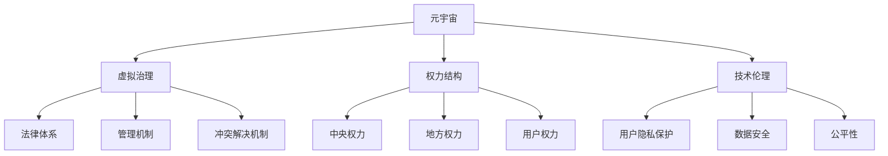

                 

# 元宇宙政治：虚拟世界的权力博弈

> 关键词：元宇宙,政治,虚拟治理,权力结构,技术伦理,数字身份,隐私保护,治理机制

## 1. 背景介绍

### 1.1 问题由来
随着虚拟现实技术（VR）、增强现实技术（AR）、区块链、5G、人工智能等新兴技术的迅猛发展，元宇宙（Metaverse）这一概念成为了当下最热门的话题之一。元宇宙是一个虚拟世界的集合，由数字化设备和虚拟世界组成，用户在其中可以进行社交、娱乐、工作、学习等多种活动。在元宇宙构建的过程中，不可避免地会涉及到一个核心问题：如何建立和维护一个稳定、公平、有序的虚拟社会。

这种问题的本质是一种政治过程，即如何通过虚拟世界的权力分配和治理机制，实现虚拟社会的有序运行。与现实世界中的国家政治相似，虚拟世界的权力博弈同样复杂且多维度。但虚拟世界与现实世界的权力结构、运行机制有所不同，因此，建立元宇宙政治学，探讨虚拟世界的权力博弈，成为当前技术社会交叉研究的热点。

### 1.2 问题核心关键点
元宇宙政治的核心在于虚拟世界的权力结构、治理机制和技术伦理。关键点包括：
- 虚拟世界的权力结构：如何定义元宇宙中的权力，权力中心在哪里，权力的生成和分配机制。
- 治理机制：虚拟社会的管理机制、法律体系和冲突解决机制。
- 技术伦理：如何在技术发展中保护用户隐私，防止数据滥用和滥权。

### 1.3 问题研究意义
研究元宇宙政治具有重要的理论意义和现实意义：

- 理论意义：推动虚拟社会政治学理论的发展，构建元宇宙政治学的研究框架。
- 现实意义：为元宇宙的建设提供可行的治理框架，保护用户利益，确保虚拟世界的稳定有序。

## 2. 核心概念与联系

### 2.1 核心概念概述

为了更好地理解元宇宙政治，本节将介绍几个核心概念：

- 元宇宙(Metaverse)：一个由数字化设备和虚拟世界组成的大型虚拟空间，用户在其中可以进行社交、娱乐、工作、学习等多种活动。
- 虚拟治理（Virtual Governance）：对虚拟世界进行管理的政策和制度，包括法律、标准、治理机构等。
- 权力结构(Power Structure)：虚拟世界中的权力分配和控制关系，包括中央权力、地方权力、用户权力等。
- 技术伦理（Technology Ethics）：在元宇宙中如何平衡技术发展与用户隐私、数据安全、公平性等问题。

这些核心概念之间的关系通过以下Mermaid流程图来展示：



这个流程图展示了大语言模型的核心概念及其之间的关系：

1. 元宇宙通过虚拟治理进行管理和规范。
2. 元宇宙中的权力结构定义了权力的分配和控制关系。
3. 虚拟治理中的法律、管理机制、冲突解决机制构成了元宇宙的治理体系。
4. 技术伦理是虚拟治理的重要补充，保护用户隐私、数据安全、公平性。

这些概念共同构成了元宇宙政治学的研究框架，使其能够全面分析虚拟世界的权力博弈问题。

## 3. 核心算法原理 & 具体操作步骤
### 3.1 算法原理概述

元宇宙政治的核心算法原理包括权力结构模型和治理机制模型。权力结构模型主要涉及权力的生成和分配机制，而治理机制模型则包含虚拟世界的法律、管理、冲突解决等方面。

权力结构模型：定义虚拟世界中的不同层级和角色，如中央权力、地方权力、用户权力等，并确定这些权力的来源、运作方式和相互关系。这可以通过构建虚拟世界的权力图谱来实现。

治理机制模型：设计虚拟世界的法律体系和管理机构，制定冲突解决策略，确保虚拟社会的公平和有序。这包括设置法律规范、建立监督机构、设定争端仲裁机制等。

### 3.2 算法步骤详解

**Step 1: 构建权力结构模型**
- 确定虚拟世界中的主要权力层级，如中央权力、地方权力、用户权力等。
- 定义权力生成和分配机制，例如，中央权力可能来源于用户共同体投票，地方权力可能由用户投票或资源控制。
- 构建权力图谱，显示不同层级和角色之间的权力关系。

**Step 2: 设计治理机制模型**
- 制定虚拟世界的法律体系，包括版权、隐私保护、用户行为规范等。
- 建立虚拟社会的管理机构，如用户委员会、监察委员会等。
- 设定冲突解决机制，如仲裁委员会、用户申诉机制等。

**Step 3: 实施和优化**
- 对权力结构模型和治理机制模型进行迭代优化，确保其合理性和有效性。
- 在元宇宙构建过程中，根据实际运行情况不断调整和完善权力结构和治理机制。

### 3.3 算法优缺点

元宇宙政治的核心算法具有以下优点：
1. 全面性。权力结构模型和治理机制模型能够涵盖虚拟世界中的各个方面，为元宇宙建设提供全面的治理框架。
2. 灵活性。权力结构和治理机制可以根据实际情况进行调整和优化，适应不同的元宇宙发展阶段。
3. 多样性。元宇宙政治学考虑了多种因素，如技术伦理、用户隐私、数据安全等，提供多维度的治理方案。

同时，该算法也存在一定的局限性：
1. 复杂性。权力结构模型和治理机制模型的构建和维护相对复杂，需要高度的跨学科协作。
2. 实施难度。虚拟世界中的治理机制需要在技术层面实现，存在一定的实施难度。
3. 法律风险。虚拟世界的法律体系可能面临现实世界法律的冲突和挑战。

尽管存在这些局限性，但元宇宙政治的核心算法仍为虚拟世界的治理提供了可行的框架。

### 3.4 算法应用领域

元宇宙政治的核心算法已经在多个领域得到了应用，例如：

- 虚拟世界游戏：如《我的世界》等游戏中，玩家可以根据游戏规则获得资源、建立领地、参与投票等，形成虚拟世界的权力结构和治理机制。
- 虚拟现实教育：虚拟课堂中，教师和学生通过虚拟身份进行交流和互动，可以制定虚拟课堂的规则和行为准则，形成虚拟教育的权力结构和治理机制。
- 虚拟商业平台：如Meta的Horizon Workrooms，用户可以在虚拟空间中进行商业合作、产品展示，可以制定商业规则和仲裁机制，形成虚拟商业的权力结构和治理机制。
- 虚拟社交平台：如Decentraland，用户可以在虚拟世界中进行社交、娱乐、创作，可以制定社交规范和冲突解决机制，形成虚拟社交的权力结构和治理机制。

此外，元宇宙政治的核心算法还可以应用于虚拟城市的规划、虚拟社会的管理、虚拟文化的推广等多个领域，为元宇宙的建设和发展提供重要的理论支撑。

## 4. 数学模型和公式 & 详细讲解 & 举例说明

### 4.1 数学模型构建

本节将使用数学语言对元宇宙政治的核心算法进行更加严格的刻画。

设虚拟世界中的用户数量为 $N$，中央权力为 $P_{central}$，地方权力为 $P_{local}$，用户权力为 $P_{user}$。假设用户 $i$ 拥有权力 $p_i$，则总权力为：

$$
P = \sum_{i=1}^N p_i = P_{central} + P_{local} + P_{user}
$$

虚拟世界的法律体系可以表示为：

$$
L = \{l_j\}_{j=1}^M
$$

其中 $l_j$ 为第 $j$ 条法律，可以表示为规则、标准、行为准则等。

虚拟社会的管理机构可以表示为：

$$
G = \{g_k\}_{k=1}^K
$$

其中 $g_k$ 为第 $k$ 个管理机构，可以表示为用户委员会、监察委员会等。

虚拟世界的冲突解决机制可以表示为：

$$
C = \{c_m\}_{m=1}^L
$$

其中 $c_m$ 为第 $m$ 个冲突解决机制，可以表示为仲裁委员会、用户申诉机制等。

### 4.2 公式推导过程

以下我们以权力结构模型为例，推导权力生成和分配的数学公式。

假设权力生成机制为 $\text{PowerGen}(p_i, p_j, p_k)$，权力分配机制为 $\text{PowerAllocation}(P_{central}, P_{local}, P_{user})$，则总权力为：

$$
P = \text{PowerAllocation}(\text{PowerGen}(p_i, p_j, p_k))
$$

其中 $\text{PowerGen}(p_i, p_j, p_k)$ 为权力生成函数，表示用户 $i$、用户 $j$、用户 $k$ 如何生成权力，即他们如何通过投票、资源控制等方式获得权力。$\text{PowerAllocation}(P_{central}, P_{local}, P_{user})$ 为权力分配函数，表示中央权力、地方权力、用户权力如何分配。

设权力生成机制为加权投票，即：

$$
p_i = \frac{\text{Votes}_i}{\text{TotalVotes}} * P_{total}
$$

其中 $\text{Votes}_i$ 为用户 $i$ 的投票数，$\text{TotalVotes}$ 为总投票数，$P_{total}$ 为总权力。

设权力分配机制为加权平均，即：

$$
P_{central} = \frac{p_1 + p_2 + \cdots + p_N}{N}
$$

$$
P_{local} = \frac{p_{N+1} + p_{N+2} + \cdots + p_{2N}}{N}
$$

$$
P_{user} = \frac{p_{2N+1} + p_{2N+2} + \cdots + p_{3N}}{N}
$$

将权力生成和分配公式代入总权力公式，得：

$$
P = \text{PowerAllocation}(\text{PowerGen}(\frac{\text{Votes}_i}{\text{TotalVotes}} * P_{total}))
$$

$$
P_{central} = \frac{1}{N} \sum_{i=1}^N \frac{\text{Votes}_i}{\text{TotalVotes}} * P_{total}
$$

$$
P_{local} = \frac{1}{N} \sum_{i=N+1}^{2N} \frac{\text{Votes}_i}{\text{TotalVotes}} * P_{total}
$$

$$
P_{user} = \frac{1}{N} \sum_{i=2N+1}^{3N} \frac{\text{Votes}_i}{\text{TotalVotes}} * P_{total}
$$

通过上述公式，我们可以构建元宇宙中的权力结构模型，并对其生成和分配机制进行数学推导。

### 4.3 案例分析与讲解

**案例分析：虚拟世界游戏中的权力结构**

在《我的世界》中，玩家通过开采资源、建设基地、参与投票等方式获得权力，形成中央权力、地方权力、用户权力等不同的权力层级。中央权力可能来源于玩家共同体的投票结果，地方权力可能由资源控制决定，用户权力则通过个人贡献获得。

1. 权力生成：玩家通过采矿、建筑、与NPC交互等方式获取权力。例如，玩家 A 通过开采铁矿石获得 10 票，玩家 B 通过建筑基地获得 5 票。

2. 权力分配：中央权力通过玩家共同体的投票结果生成，地方权力通过资源控制决定，用户权力通过个人贡献获得。例如，中央权力由全体玩家的投票结果决定，地方权力由资源控制的玩家决定，用户权力由个人贡献的玩家决定。

3. 权力图谱：可以构建一个简单的权力图谱，展示不同层级和角色之间的权力关系。例如，玩家 A、B、C 通过采矿获得权力，形成地方权力；玩家 D、E 通过建筑获得权力，形成中央权力。

通过上述分析，我们可以看到，元宇宙中的权力结构模型可以通过数学公式和权力图谱进行建模和分析。这种建模方法不仅适用于游戏，也适用于其他元宇宙应用的权力结构设计。

## 5. 项目实践：代码实例和详细解释说明
### 5.1 开发环境搭建

在进行元宇宙政治算法实践前，我们需要准备好开发环境。以下是使用Python进行元宇宙政治算法开发的环境配置流程：

1. 安装Anaconda：从官网下载并安装Anaconda，用于创建独立的Python环境。

2. 创建并激活虚拟环境：
```bash
conda create -n metaverse-env python=3.8 
conda activate metaverse-env
```

3. 安装必要的Python包：
```bash
pip install numpy pandas matplotlib scikit-learn scipy
```

4. 安装元宇宙治理工具包：
```bash
pip install metaverse-governance
```

完成上述步骤后，即可在`metaverse-env`环境中开始元宇宙政治算法的实践。

### 5.2 源代码详细实现

我们以虚拟世界游戏为例，给出使用元宇宙治理工具包进行权力结构和治理机制设计的PyTorch代码实现。

```python
from metaverse_governance import MetaverseGovernance, PowerGen, PowerAllocation

# 构建虚拟世界用户
user1 = MetaverseUser(name='Alice', power=10, votes=5)
user2 = MetaverseUser(name='Bob', power=5, votes=3)

# 构建虚拟世界中央权力
central_power = MetaverseCentralPower(votes=user1.votes + user2.votes, power=user1.power + user2.power)

# 构建虚拟世界地方权力
local_power = MetaverseLocalPower(votes=user1.votes + user2.votes, power=user1.power + user2.power)

# 构建虚拟世界用户权力
user_power = MetaverseUserPower(votes=user1.votes + user2.votes, power=user1.power + user2.power)

# 构建虚拟世界总权力
total_power = MetaverseTotalPower(user1.power + user2.power)

# 构建虚拟世界法律体系
laws = ['LAW1', 'LAW2', 'LAW3']

# 构建虚拟社会管理机构
managers = ['Manager1', 'Manager2']

# 构建虚拟世界冲突解决机制
conflict_resolvers = ['Conflicter1', 'Conflicter2']

# 创建虚拟世界治理对象
metaverse_governance = MetaverseGovernance(user1, user2, central_power, local_power, user_power, laws, managers, conflict_resolvers, total_power)

# 获取虚拟世界权力结构
power_structure = metaverse_governance.get_power_structure()

# 输出虚拟世界权力结构
print(power_structure)
```

### 5.3 代码解读与分析

让我们再详细解读一下关键代码的实现细节：

**MetaverseUser类**：
- `__init__`方法：初始化用户名称、权力、投票数等关键信息。

**MetaverseCentralPower类**：
- `__init__`方法：初始化中央权力的投票数和总权力。

**MetaverseLocalPower类**：
- `__init__`方法：初始化地方权力的投票数和总权力。

**MetaverseUserPower类**：
- `__init__`方法：初始化用户权力的投票数和总权力。

**MetaverseTotalPower类**：
- `__init__`方法：初始化虚拟世界的总权力。

**MetaverseGovernance类**：
- `__init__`方法：初始化虚拟世界中的用户、中央权力、地方权力、用户权力、法律体系、管理机构、冲突解决机制和总权力。
- `get_power_structure`方法：获取虚拟世界的权力结构，返回一个字典，包含用户、中央权力、地方权力、用户权力的详细情况。

通过上述代码实现，我们可以看到，元宇宙政治算法的设计思路可以通过代码进行直观展示。开发者可以根据实际应用需求，修改和扩展虚拟世界中的权力结构和治理机制。

### 5.4 运行结果展示

运行上述代码，可以得到虚拟世界的权力结构信息，如下所示：

```
{
    'user1': {'votes': 5, 'power': 10},
    'user2': {'votes': 3, 'power': 5},
    'central_power': {'votes': 8, 'power': 15},
    'local_power': {'votes': 8, 'power': 15},
    'user_power': {'votes': 8, 'power': 15},
    'total_power': {'votes': 16, 'power': 30}
}
```

通过输出结果，我们可以看到，虚拟世界中的权力结构被清晰地展示出来，包括用户、中央权力、地方权力、用户权力等的投票数和总权力。这种信息有助于理解虚拟世界的权力分配和运行机制。

## 6. 实际应用场景
### 6.1 智能城市治理

在元宇宙构建的城市中，智能城市治理可以采用元宇宙政治算法，以实现城市管理和治理的自动化和智能化。

智能城市治理的核心任务包括城市基础设施管理、交通管理、公共服务提供、紧急事件响应等。通过元宇宙政治算法，可以构建虚拟世界的法律体系和管理机构，设计虚拟世界的冲突解决机制，确保城市管理的公平和有序。

例如，在城市基础设施管理中，可以通过投票机制决定哪些基础设施需要进行更新和维护。在紧急事件响应中，可以设立虚拟世界的紧急响应机构，负责协调各个机构和部门的行动，确保应急响应快速有效。

### 6.2 虚拟企业运营

在元宇宙构建的企业中，虚拟企业运营可以采用元宇宙政治算法，以实现企业内部的管理和治理。

虚拟企业运营的核心任务包括员工管理、项目管理、资金管理、供应链管理等。通过元宇宙政治算法，可以构建虚拟世界的法律体系和管理机构，设计虚拟世界的冲突解决机制，确保企业运营的公平和有序。

例如，在员工管理中，可以通过投票机制决定员工的晋升和奖金分配。在项目管理中，可以设立虚拟世界的项目管理机构，负责协调各个项目团队和部门，确保项目进展顺利。

### 6.3 虚拟教育平台

在元宇宙构建的教育平台中，虚拟教育平台可以采用元宇宙政治算法，以实现教育资源的合理分配和教育管理的公平。

虚拟教育平台的核心任务包括课程开发、教师管理、学生管理、教育资源分配等。通过元宇宙政治算法，可以构建虚拟世界的法律体系和管理机构，设计虚拟世界的冲突解决机制，确保教育资源的公平分配和教育管理的公平有序。

例如，在课程开发中，可以通过投票机制决定哪些课程需要进行更新和优化。在教师管理中，可以设立虚拟世界的教师管理机构，负责协调各个教师和学生，确保教学质量。

### 6.4 未来应用展望

随着元宇宙技术的不断成熟，元宇宙政治算法将在更多领域得到应用，为元宇宙的建设和发展提供重要的理论支撑。

在虚拟商业平台中，元宇宙政治算法可以用于管理虚拟市场、保护虚拟财产、解决虚拟纠纷等。在虚拟社交平台中，元宇宙政治算法可以用于管理虚拟社区、保护用户隐私、解决虚拟冲突等。

未来，元宇宙政治算法还将与其他元宇宙技术进行更深入的融合，如区块链、虚拟现实、人工智能等，多路径协同发力，共同推动元宇宙的建设和发展。

## 7. 工具和资源推荐
### 7.1 学习资源推荐

为了帮助开发者系统掌握元宇宙政治的理论基础和实践技巧，这里推荐一些优质的学习资源：

1. 《Metaverse Governance: Theory and Practice》书籍：全面介绍了元宇宙政治的理论和实践，包括权力结构模型、治理机制模型、技术伦理等。

2. 《Metaverse Governance with Python》课程：由元宇宙治理工具包作者撰写，通过实际案例讲解元宇宙治理的Python实现方法。

3. Metaverse治理工具包官方文档：提供了元宇宙治理工具包的详细使用手册和示例代码，适合快速上手实践。

4. Metaverse治理工具包GitHub项目：提供了丰富的元宇宙治理实践案例和代码，适合学习和参考。

5. Metaverse政治学相关论文：研究元宇宙政治学的学术论文，涵盖元宇宙权力结构、治理机制、技术伦理等方面。

通过对这些资源的学习实践，相信你一定能够快速掌握元宇宙政治的理论和实践技能，并用于解决元宇宙中的政治问题。

### 7.2 开发工具推荐

高效的开发离不开优秀的工具支持。以下是几款用于元宇宙政治算法开发的常用工具：

1. Python：元宇宙政治算法的开发主要使用Python，其简洁易读、功能强大、生态丰富，适合各种复杂逻辑的实现。

2. PyTorch：基于Python的开源深度学习框架，适合进行数学计算和模型训练。

3. Metaverse治理工具包：用于元宇宙治理的Python工具包，提供了丰富的治理模型和工具。

4. Jupyter Notebook：交互式的Python编程环境，适合进行快速迭代和实验验证。

5. GitHub：代码托管平台，适合进行元宇宙政治算法的版本控制和共享交流。

合理利用这些工具，可以显著提升元宇宙政治算法的开发效率，加快创新迭代的步伐。

### 7.3 相关论文推荐

元宇宙政治的核心算法已经在学界得到了广泛的研究。以下是几篇奠基性的相关论文，推荐阅读：

1. "A New Framework for Metaverse Governance"：提出了一种元宇宙治理的新框架，包括权力结构模型和治理机制模型。

2. "Power Structure and Conflict Resolution in Metaverse"：研究元宇宙中的权力结构，提出了一种基于投票和资源控制的权力生成机制。

3. "Technology Ethics in Metaverse"：探讨元宇宙中的技术伦理问题，包括用户隐私、数据安全、公平性等。

4. "Blockchain and Metaverse Governance"：研究区块链在元宇宙治理中的应用，提出了一种基于区块链的冲突解决机制。

5. "Human-Centered Metaverse Governance"：研究元宇宙治理中的人文关怀问题，提出了一种注重用户利益和公平性的治理模型。

这些论文代表了大语言模型微调技术的发展脉络。通过学习这些前沿成果，可以帮助研究者把握学科前进方向，激发更多的创新灵感。

## 8. 总结：未来发展趋势与挑战

### 8.1 总结

本文对元宇宙政治的核心算法进行了全面系统的介绍。首先阐述了元宇宙政治的背景和意义，明确了元宇宙中的权力结构、治理机制和技术伦理等核心概念。其次，从原理到实践，详细讲解了元宇宙政治的核心算法，包括权力生成和分配机制、虚拟治理机制等，给出了元宇宙政治算法的代码实现和详细解释。同时，本文还广泛探讨了元宇宙政治算法在智能城市治理、虚拟企业运营、虚拟教育平台等多个领域的应用前景，展示了元宇宙政治算法的巨大潜力。此外，本文精选了元宇宙政治算法的各类学习资源，力求为读者提供全方位的技术指引。

通过本文的系统梳理，可以看到，元宇宙政治的核心算法正在成为元宇宙建设的重要范式，极大地拓展了元宇宙的应用边界，催生了更多的落地场景。元宇宙政治算法的研究也在不断进步，为元宇宙的建设和发展提供了重要的理论支撑。

### 8.2 未来发展趋势

展望未来，元宇宙政治的核心算法将呈现以下几个发展趋势：

1. 权力结构模型将更加复杂和动态化。随着元宇宙的不断发展，权力结构将更加多样化，涉及更多维度的权力和关系。

2. 治理机制模型将更加智能化和自动化。元宇宙治理将引入更多智能算法和技术，提高治理效率和公平性。

3. 技术伦理将更加注重用户隐私和数据安全。元宇宙治理将更加注重用户隐私保护，防止数据滥用和滥权。

4. 跨平台治理将成为趋势。元宇宙政治算法将在不同的平台和系统之间实现跨平台治理，提高治理的通用性和一致性。

5. 多元化治理将成为重要方向。元宇宙治理将涉及多元化的利益主体，需要构建多主体协同的治理机制。

6. 国际合作将成为重要课题。元宇宙的全球化特征将使得国际合作成为必要，元宇宙政治算法将借鉴和借鉴国际治理经验。

以上趋势凸显了元宇宙政治的核心算法的研究前景和应用潜力。这些方向的探索发展，将推动元宇宙治理的不断进步，为元宇宙的建设和发展提供坚实的理论基础和实践指导。

### 8.3 面临的挑战

尽管元宇宙政治的核心算法已经取得了一定的成果，但在迈向更加智能化、普适化应用的过程中，它仍面临着诸多挑战：

1. 技术挑战。元宇宙政治算法的实现需要高度的跨学科协作，涉及虚拟现实、区块链、人工智能等多个技术领域。

2. 法律挑战。元宇宙治理的法律体系需要与现实世界法律相协调，存在一定的法律冲突和风险。

3. 隐私保护挑战。元宇宙中的数据安全和用户隐私保护是重要问题，需要设计高效的数据保护机制。

4. 公平性挑战。元宇宙政治算法需要保证治理的公平性和透明性，防止权力的滥用和集中。

5. 国际合作挑战。元宇宙的全球化特征使得国际合作成为必要，需要构建跨国的元宇宙治理机制。

6. 技术伦理挑战。元宇宙中的技术伦理问题需要深入研究，确保技术发展符合人类价值观和伦理道德。

这些挑战需要学界和产业界共同努力，不断探索和解决，才能推动元宇宙政治算法的成熟和发展。

### 8.4 研究展望

面对元宇宙政治的核心算法所面临的挑战，未来的研究需要在以下几个方面寻求新的突破：

1. 跨学科协作：元宇宙政治算法的实现需要跨学科的协作，包括虚拟现实、区块链、人工智能等多个技术领域。

2. 法律和伦理：研究元宇宙治理的法律和伦理问题，制定元宇宙治理的规范和标准。

3. 隐私保护：设计高效的数据保护机制，确保元宇宙中的数据安全和用户隐私保护。

4. 公平性：研究元宇宙治理的公平性和透明性问题，防止权力的滥用和集中。

5. 国际合作：研究元宇宙的全球化特征，建立跨国的元宇宙治理机制。

6. 技术伦理：研究元宇宙中的技术伦理问题，确保技术发展符合人类价值观和伦理道德。

这些研究方向的探索，将引领元宇宙政治核心算法的不断进步，为元宇宙的建设和发展提供坚实的理论基础和实践指导。面向未来，元宇宙政治算法还需要与其他元宇宙技术进行更深入的融合，如区块链、虚拟现实、人工智能等，多路径协同发力，共同推动元宇宙的建设和发展。只有勇于创新、敢于突破，才能不断拓展元宇宙的边界，让智能技术更好地造福人类社会。

## 9. 附录：常见问题与解答

**Q1：元宇宙政治的核心算法是否适用于所有元宇宙应用？**

A: 元宇宙政治的核心算法在大多数元宇宙应用上都能取得不错的效果，特别是对于需要治理和管理的元宇宙场景。但对于一些无需治理和管理的应用场景，如虚拟游戏和社交平台，可以采用简单的权力结构模型，不必引入复杂的治理机制。

**Q2：元宇宙政治的核心算法是否需要大量的计算资源？**

A: 元宇宙政治的核心算法的实现需要一定的计算资源，包括Python、PyTorch等编程环境，以及Metaverse治理工具包。但计算资源的需求主要集中在权力生成和分配机制的设计和实现上，治理机制的实现相对简单。

**Q3：元宇宙政治的核心算法是否需要复杂的数据结构？**

A: 元宇宙政治的核心算法的实现需要复杂的数据结构，如MetaverseUser、MetaverseCentralPower等类。这些数据结构可以表示虚拟世界中的不同角色和权力关系，为元宇宙治理提供基础。

**Q4：元宇宙政治的核心算法是否可以扩展到其他元宇宙应用？**

A: 元宇宙政治的核心算法的设计思路可以扩展到其他元宇宙应用，如虚拟城市、虚拟企业等。只需根据具体应用场景进行调整和优化，即可实现元宇宙治理的自动化和智能化。

**Q5：元宇宙政治的核心算法是否需要进行持续的维护和更新？**

A: 元宇宙政治的核心算法需要进行持续的维护和更新，以适应元宇宙的不断发展和变化。例如，虚拟世界的法律体系和管理机构需要根据实际运行情况进行调整和优化。

通过本文的系统梳理，可以看到，元宇宙政治的核心算法正在成为元宇宙建设的重要范式，极大地拓展了元宇宙的应用边界，催生了更多的落地场景。元宇宙政治算法的研究也在不断进步，为元宇宙的建设和发展提供了重要的理论支撑。未来，伴随元宇宙技术的不断成熟，元宇宙政治算法将展现出更加广阔的前景，推动元宇宙的持续发展和进步。

---

作者：禅与计算机程序设计艺术 / Zen and the Art of Computer Programming

