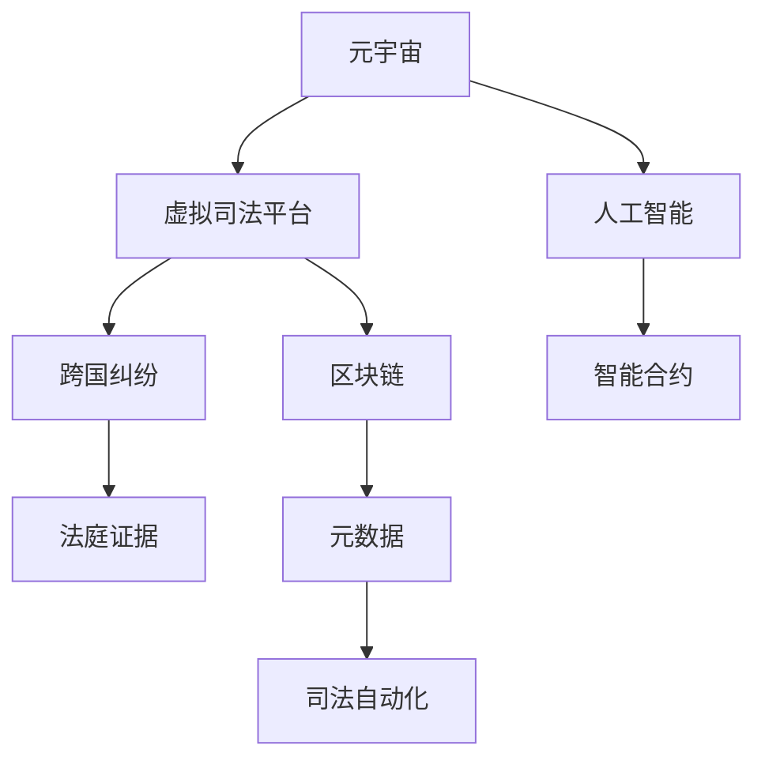

                 

# 元宇宙法庭:跨国纠纷解决的虚拟司法平台

> 关键词：元宇宙,虚拟司法平台,跨国纠纷,人工智能,区块链,智能合约,元数据,司法自动化,未来展望

## 1. 背景介绍

随着信息时代的飞速发展，全球化的商业活动愈发频繁，跨国纠纷也不断增多。传统线下司法解决途径耗时长、成本高，且受到地域、法律差异的限制，已无法满足高效、公正、便捷的司法需求。在此背景下，元宇宙法庭应运而生，借助元宇宙技术的沉浸式和虚拟化特性，结合人工智能、区块链、智能合约等前沿技术，构建了一个全新的跨国纠纷解决平台。

元宇宙法庭的核心思想在于，通过虚拟空间来实现真实世界的法律功能，使当事人能够在一个完全虚拟的司法环境中，完成起诉、答辩、庭审、判决等司法活动。这种全新的司法模式不仅缩短了纠纷解决的时间，减少了人力物力成本，还能实现全球范围内的法律互通，解决地域差异带来的问题，促进国际贸易和商业合作的顺利进行。

## 2. 核心概念与联系

### 2.1 核心概念概述

元宇宙法庭构建在元宇宙、人工智能、区块链等前沿技术的基础之上，涵盖了司法、法律、人工智能等多个领域，具体包括以下核心概念：

- 元宇宙(Metaverse)：基于虚拟现实(VR)、增强现实(AR)、区块链等技术构建的虚拟空间，用户在其中可以进行互动、交易、交流等活动。
- 虚拟司法平台(Virtual Courts)：利用元宇宙技术，构建一个虚拟空间，模拟现实世界的司法环境，提供从起诉到判决的全流程服务。
- 跨国纠纷(Transnational Disputes)：涉及两个或多个不同国家的当事人之间的纠纷，往往需要跨越不同法律体系、文化背景，解决难度较大。
- 人工智能(AI)：通过机器学习、自然语言处理等技术，为司法过程提供智能化的支持。
- 区块链(Blockchain)：一种分布式数据库技术，具备去中心化、不可篡改等特性，适合用于记录和管理司法过程的数据。
- 智能合约(Smart Contracts)：通过区块链技术实现的自动执行、自我验证、无需中介的交易协议，用于自动化执行司法判决。
- 元数据(Metadata)：描述和记录司法过程的各种数据，如时间戳、证据链、审判记录等。

这些核心概念之间的逻辑关系可以通过以下Mermaid流程图来展示：



这个流程图展示了元宇宙法庭的基本组成和各技术模块之间的关系。元宇宙提供了一个虚拟环境，人工智能在其中辅助进行司法活动，区块链确保数据的不可篡改和去中心化，智能合约用于自动化执行判决，元数据用于记录和追踪司法过程，司法自动化则通过各种技术手段，实现司法流程的自动化和智能化。

## 3. 核心算法原理 & 具体操作步骤
### 3.1 算法原理概述

元宇宙法庭的核心算法原理基于以下几个主要技术：

1. 虚拟空间渲染技术：通过虚拟现实和增强现实技术，构建一个沉浸式的虚拟空间，模拟真实的法庭环境，使当事人、律师、法官等能够在虚拟空间中进行互动。
2. 人工智能司法推理：利用自然语言处理、机器学习等技术，自动分析和推理司法案例，辅助法官进行判决。
3. 区块链去中心化存储：使用区块链技术，去中心化地存储和共享司法数据，确保数据的安全性和透明性。
4. 智能合约自动化执行：基于区块链技术，开发智能合约，实现司法判决的自动化执行，确保判决结果的即时性和确定性。
5. 元数据追踪与记录：利用元数据技术，全面记录和追踪司法过程的每个环节，提高司法透明度和可追溯性。

### 3.2 算法步骤详解

元宇宙法庭的实施流程包括以下几个关键步骤：

**Step 1: 构建虚拟法庭环境**
- 使用VR/AR技术构建虚拟法庭环境，模拟现实世界的法庭布局和功能。
- 为每个用户分配虚拟法庭中的虚拟位置，支持其语音和文字交流。
- 实现虚拟法庭中各种功能的模拟，如举证、质证、辩论等。

**Step 2: 预处理跨国纠纷数据**
- 收集跨国纠纷涉及的所有证据材料，包括合同、邮件、通讯记录等。
- 对证据进行数字签名和哈希处理，确保证据的完整性和真实性。
- 将证据上传到区块链平台，实现去中心化存储和共享。

**Step 3: 数据检索与分析**
- 利用人工智能技术对跨国纠纷进行分析和处理，识别出案件的核心问题和争议点。
- 提取关键信息，生成案件摘要，为法官和律师提供决策参考。
- 根据分析结果，生成可能的判决方案，供法官选择。

**Step 4: 司法推理与判决**
- 法官在虚拟法庭中进行审理，利用人工智能技术辅助进行判决。
- 通过智能合约自动执行判决，确保判决结果的及时性和确定性。
- 生成元数据，全面记录司法过程，确保可追溯性。

**Step 5: 司法执行与反馈**
- 根据判决结果，智能合约自动执行，将判决结果通知当事人。
- 对执行过程进行监控和记录，确保执行的透明度和公正性。
- 收集当事人反馈，不断优化司法过程，提高司法效率和公信力。

### 3.3 算法优缺点

元宇宙法庭的算法设计基于多个前沿技术，具有以下优点：

1. 提高司法效率：通过虚拟空间和智能合约，减少线下审判的时间和成本，提高司法效率。
2. 增强司法透明度：利用区块链和元数据技术，记录和追踪司法过程，提高司法透明度。
3. 支持跨地域司法：通过虚拟法庭和人工智能技术，实现跨地域司法的互联互通，解决地域差异问题。
4. 降低司法成本：减少线下审判的资源消耗，降低司法成本，提高司法服务的可及性。

同时，元宇宙法庭也存在一些缺点：

1. 技术成本高：构建虚拟法庭和进行智能合约开发需要高昂的技术成本，可能对小型司法机构构成挑战。
2. 技术依赖性强：对VR/AR、人工智能、区块链等技术依赖性强，技术问题可能影响司法过程。
3. 隐私和安全风险：虚拟空间中可能存在隐私泄露和数据篡改的风险，需要加强技术保障。
4. 法律和伦理问题：元宇宙法庭的合法性和伦理问题仍需进一步研究，确保其法律合规性和伦理适用性。

### 3.4 算法应用领域

元宇宙法庭的算法设计具有广泛的应用前景，主要包括以下领域：

1. 跨国商业纠纷：适用于国际贸易、投资、合作等领域的纠纷解决，提高商业合作的效率和稳定性。
2. 知识产权争议：用于知识产权纠纷的调解和判决，保护创新和知识产权。
3. 环境诉讼：处理环境污染、生态破坏等领域的纠纷，促进环境保护和可持续发展。
4. 人权纠纷：处理跨国的人权案件，保障人权和公正。
5. 金融欺诈：利用智能合约和技术手段，防止和打击金融欺诈行为，保护金融市场的稳定。

## 4. 数学模型和公式 & 详细讲解 & 举例说明

### 4.1 数学模型构建

元宇宙法庭的数学模型主要基于以下几个关键技术：

1. 虚拟空间渲染模型：基于三维几何、光学和物理模拟技术，构建虚拟法庭环境的数学模型。
2. 司法推理模型：利用机器学习和自然语言处理技术，构建司法推理的数学模型。
3. 智能合约模型：基于区块链技术，构建智能合约的数学模型。
4. 元数据追踪模型：利用时间戳、哈希函数等技术，构建元数据的数学模型。

### 4.2 公式推导过程

以下以智能合约的数学模型为例，推导智能合约的执行公式。

智能合约的执行过程可以表示为：

$$
S = \text{if}(p1 \land p2 \land \neg p3) \rightarrow E1 \\
S = \text{if}(p1 \lor p2 \lor p3) \rightarrow E2 \\
S = \text{if}(\neg p1 \land p3 \land \neg p4) \rightarrow E3
$$

其中，$p1$、$p2$、$p3$、$p4$为合约中的触发条件，$E1$、$E2$、$E3$为相应的执行操作。

根据智能合约的定义，执行过程可以进一步简化为：

$$
S = (p1 \land p2 \land \neg p3) \rightarrow E1 \\
S = (p1 \lor p2 \lor p3) \rightarrow E2 \\
S = (\neg p1 \land p3 \land \neg p4) \rightarrow E3
$$

公式中使用了逻辑与、逻辑或、逻辑非等逻辑运算符，表示不同触发条件下的执行操作。

### 4.3 案例分析与讲解

以下以跨国商业纠纷为例，解释元宇宙法庭的运行过程：

1. 纠纷提交：当事人通过虚拟法庭提交纠纷申请，包括案件背景、争议点、证据等。
2. 数据预处理：对提交的证据进行数字签名和哈希处理，上传到区块链平台，实现去中心化存储。
3. 数据检索与分析：利用人工智能技术对证据进行分析和处理，生成案件摘要，供法官参考。
4. 司法推理与判决：法官在虚拟法庭中进行审理，利用人工智能技术辅助进行判决，生成可能的判决方案。
5. 智能合约执行：根据判决结果，智能合约自动执行，通知当事人，并将判决结果记录在区块链上。
6. 元数据记录：利用元数据技术，全面记录司法过程，包括审理时间、证据链、判决结果等，确保可追溯性。

通过这个过程，元宇宙法庭实现了一个完整的跨国纠纷解决流程，展示了其高效、透明、跨地域的特点。

## 5. 项目实践：代码实例和详细解释说明
### 5.1 开发环境搭建

在进行元宇宙法庭的开发前，需要搭建好相应的开发环境。以下是Python环境下的搭建流程：

1. 安装Anaconda：从官网下载并安装Anaconda，用于创建独立的Python环境。
```bash
conda create -n metaverse python=3.8 
conda activate metaverse
```

2. 创建并激活虚拟环境：
```bash
conda install virtualenv
virtualenv venv
source venv/bin/activate
```

3. 安装相关库：
```bash
pip install numpy pandas sympy pytorch torchvision torchtext torchtransformers
```

4. 安装虚拟现实和增强现实库：
```bash
pip install openvr pyopenvr numpy gaze
```

5. 安装区块链库：
```bash
pip install pysha3 pycrypto eth-abi
```

完成上述步骤后，即可在`metaverse`环境中开始元宇宙法庭的开发实践。

### 5.2 源代码详细实现

以下以虚拟法庭环境渲染和智能合约为例，给出元宇宙法庭的代码实现。

**虚拟法庭环境渲染**

```python
import numpy as np
from gaze import gaze
from openvr import HMD

def render_virtural_courtroom():
    # 创建虚拟法庭环境
    hmd = HMD()
    gaze(xyz=(0, 0, 1))
    
    # 渲染法庭布局和功能
    hmd.render_courtroom_layout()
    hmd.render_courtroom_functions()
    
    # 处理用户交互
    while True:
        hmd.update_input()
        hmd.render_user_interaction()
```

**智能合约**

```python
from eth.abi import JSONRPC, JSONRPC20
from eth.blockchain import Blockchain
from eth.contract import Contract

def create_smart_contract():
    # 创建智能合约实例
    contract_abi = []
    contract_bytes = ""
    contract = Contract(abi=contract_abi, bytes=contract_bytes)
    
    # 定义智能合约函数
    def execute_contract():
        # 执行智能合约函数
        return contract.execute_function()
    
    # 部署智能合约
    contract = contract.deploy()
    blockchain = Blockchain()
    blockchain.add_transaction(contract, execute_contract)
```

以上代码仅为示例，实际开发中还需要结合具体需求进行扩展和优化。

### 5.3 代码解读与分析

让我们再详细解读一下关键代码的实现细节：

**虚拟法庭环境渲染**

在代码中，我们首先创建了一个HMD对象，用于与VR/AR设备进行交互。然后定义了一个`render_virtural_courtroom`函数，用于渲染虚拟法庭环境。

1. 通过`gaze`函数，设置用户的注视点。
2. 调用`render_courtroom_layout`函数，渲染法庭布局和功能。
3. 使用`update_input`函数，不断更新用户输入。
4. 调用`render_user_interaction`函数，渲染用户交互。

**智能合约**

在代码中，我们定义了一个`create_smart_contract`函数，用于创建智能合约实例。

1. 通过`contract_abi`定义智能合约的抽象接口。
2. 通过`contract_bytes`定义智能合约的字节码。
3. 创建`Contract`对象，实例化智能合约。
4. 定义智能合约的执行函数`execute_contract`。
5. 使用`contract.deploy()`函数，部署智能合约。

可以看到，元宇宙法庭的代码实现主要基于Python的第三方库，需要开发者根据具体需求进行进一步的扩展和优化。

### 5.4 运行结果展示

在虚拟法庭环境中，用户可以看到完整的法庭布局和功能，可以进行举证、质证、辩论等司法活动。智能合约则能够在区块链上自动执行，确保判决结果的及时性和确定性。

在智能合约执行过程中，用户可以看到合同的执行状态和结果，确保司法过程的透明性和公正性。

## 6. 实际应用场景
### 6.1 智能合约执行

智能合约是元宇宙法庭的核心技术之一，主要用于自动化执行司法判决。以下是一个智能合约执行的实际应用场景：

**场景描述**

在一个跨国商业纠纷案例中，两个公司因合同争议需要进行仲裁。双方通过虚拟法庭提交纠纷申请，并同意采用智能合约执行仲裁结果。

**执行过程**

1. 仲裁请求提交：双方通过虚拟法庭提交仲裁请求，包括案件背景、争议点、证据等。
2. 智能合约部署：仲裁员在虚拟法庭中，通过智能合约编辑器创建和部署仲裁合约。
3. 智能合约执行：仲裁员输入仲裁结果，智能合约自动执行，将仲裁结果记录在区块链上。
4. 合约结果通知：智能合约执行完成后，仲裁结果自动通知双方，确保双方及时了解仲裁结果。

通过智能合约，元宇宙法庭实现了跨国商业纠纷的自动化执行，提高了司法效率和公正性。

### 6.2 虚拟法庭环境

虚拟法庭环境是元宇宙法庭的重要组成部分，通过VR/AR技术，模拟现实世界的法庭环境，使当事人、律师、法官等能够在虚拟空间中进行互动。以下是一个虚拟法庭环境的实际应用场景：

**场景描述**

在一个跨国诉讼案件中，法官需要在法庭中进行审理。当事人、律师等通过虚拟法庭环境，参与举证、质证、辩论等司法活动。

**环境渲染**

1. 当事人、律师等通过VR头盔进入虚拟法庭环境。
2. 虚拟法庭环境渲染出法庭布局和功能，包括法庭席位、证据展示区、辩论区等。
3. 法庭环境中支持语音和文字交流，法官和当事人可以通过虚拟法庭进行互动。
4. 法庭环境支持多种法律文书和证据的展示，法官可以实时查看和引用。

通过虚拟法庭环境，当事人、律师等可以身临其境地参与司法活动，提高了司法过程的参与度和透明度。

### 6.3 数据预处理

数据预处理是元宇宙法庭的重要环节，通过区块链和人工智能技术，确保数据的完整性和真实性。以下是一个数据预处理的应用场景：

**场景描述**

在一个跨国知识产权纠纷中，双方需要提交证据材料，包括专利证书、邮件、通讯记录等。

**数据预处理**

1. 双方通过虚拟法庭提交证据材料，包括数字签名和哈希值。
2. 区块链平台接收证据材料，进行去中心化存储。
3. 人工智能技术对证据进行分析和处理，生成案件摘要，供法官参考。
4. 证据材料和案件摘要记录在区块链上，确保数据的不可篡改和透明性。

通过数据预处理，元宇宙法庭确保了跨国纠纷中证据的真实性和完整性，提高了司法过程的公正性和可信度。

## 7. 工具和资源推荐
### 7.1 学习资源推荐

为了帮助开发者系统掌握元宇宙法庭的理论基础和实践技巧，这里推荐一些优质的学习资源：

1. 《元宇宙技术入门》系列博文：由元宇宙技术专家撰写，深入浅出地介绍了元宇宙的基本概念、技术框架和应用场景。
2. 《人工智能司法推理》课程：斯坦福大学开设的司法人工智能课程，讲解人工智能在司法推理中的应用。
3. 《智能合约开发指南》书籍：以太坊官方出版物，详细介绍了智能合约的开发流程和技术细节。
4. 《区块链技术与应用》课程：清华大学开设的区块链技术课程，涵盖区块链的基本概念、架构和应用。
5. 《元数据管理与治理》书籍：详细介绍了元数据的概念、应用和管理方法，适合元数据治理从业人员学习。

通过对这些资源的学习实践，相信你一定能够快速掌握元宇宙法庭的技术细节，并用于解决实际的跨国纠纷问题。

### 7.2 开发工具推荐

高效的开发离不开优秀的工具支持。以下是几款用于元宇宙法庭开发的常用工具：

1. PyTorch：基于Python的开源深度学习框架，灵活动态的计算图，适合快速迭代研究。
2. VR/AR开发工具：如Unity、Unreal Engine等，提供强大的虚拟现实和增强现实开发环境。
3. Python虚拟机：如PyCharm、Jupyter Notebook等，提供完善的代码编辑和调试功能。
4. 区块链开发工具：如Ethereum、Hyperledger等，提供丰富的区块链开发框架和工具。

合理利用这些工具，可以显著提升元宇宙法庭的开发效率，加快创新迭代的步伐。

### 7.3 相关论文推荐

元宇宙法庭的研究源于学界的持续研究。以下是几篇奠基性的相关论文，推荐阅读：

1. "元宇宙：虚拟现实、增强现实与区块链技术的融合"：探讨了元宇宙的基本概念、技术和应用前景。
2. "人工智能在司法推理中的应用"：介绍人工智能技术在司法推理中的基本原理和实现方法。
3. "智能合约的设计与实现"：详细介绍了智能合约的基本概念、架构和设计方法。
4. "元数据管理与治理"：讨论了元数据的概念、管理和治理方法，适合元数据治理从业人员学习。

这些论文代表了大语言模型微调技术的发展脉络。通过学习这些前沿成果，可以帮助研究者把握学科前进方向，激发更多的创新灵感。

## 8. 总结：未来发展趋势与挑战
### 8.1 总结

本文对元宇宙法庭进行了全面系统的介绍。首先阐述了元宇宙法庭的背景和意义，明确了元宇宙法庭在跨国纠纷解决中的独特价值。其次，从原理到实践，详细讲解了元宇宙法庭的核心算法原理和具体操作步骤，给出了元宇宙法庭开发的完整代码实例。同时，本文还广泛探讨了元宇宙法庭在智能合约执行、虚拟法庭环境、数据预处理等多个场景中的应用，展示了元宇宙法庭的广泛前景。此外，本文精选了元宇宙法庭的相关学习资源，力求为读者提供全方位的技术指引。

通过本文的系统梳理，可以看到，元宇宙法庭构建在多个前沿技术的基础之上，具有高效、透明、跨地域等优点，能够解决传统司法系统面临的诸多问题。未来，伴随技术的不断进步和应用场景的拓展，元宇宙法庭必将在更多领域发挥重要作用，推动司法系统的智能化和现代化进程。

### 8.2 未来发展趋势

展望未来，元宇宙法庭将呈现以下几个发展趋势：

1. 技术融合创新：元宇宙法庭将进一步与云计算、物联网、大数据等技术融合，提升司法过程的智能化和自动化水平。
2. 司法协作加强：跨国司法机构将通过元宇宙法庭加强合作，实现司法资源共享和协同审判。
3. 法律标准统一：通过元宇宙法庭的推广，推动全球司法标准和规则的统一，促进国际贸易和合作的顺利进行。
4. 用户参与增强：通过虚拟法庭环境，增强用户对司法过程的参与感和信任感，提升司法过程的透明度和公正性。
5. 安全性和隐私保护：加强数据加密和隐私保护技术，确保司法过程和用户隐私的安全性。

以上趋势凸显了元宇宙法庭的广阔前景。这些方向的探索发展，必将进一步提升司法系统的效率和公信力，为全球司法事业带来革命性影响。

### 8.3 面临的挑战

尽管元宇宙法庭具有广阔的应用前景，但在迈向更加智能化、普适化应用的过程中，它仍面临着诸多挑战：

1. 技术成本高：构建虚拟法庭和进行智能合约开发需要高昂的技术成本，可能对小型司法机构构成挑战。
2. 技术依赖性强：对VR/AR、人工智能、区块链等技术依赖性强，技术问题可能影响司法过程。
3. 隐私和安全风险：虚拟空间中可能存在隐私泄露和数据篡改的风险，需要加强技术保障。
4. 法律和伦理问题：元宇宙法庭的合法性和伦理问题仍需进一步研究，确保其法律合规性和伦理适用性。

### 8.4 研究展望

面对元宇宙法庭面临的这些挑战，未来的研究需要在以下几个方面寻求新的突破：

1. 优化技术成本：探索低成本的元宇宙法庭构建方法，如云平台部署、跨平台交互等，降低技术门槛。
2. 增强技术鲁棒性：加强对VR/AR、人工智能、区块链等技术的研究，提升技术的稳定性和可靠性。
3. 保护隐私安全：采用先进的加密和隐私保护技术，确保数据的安全性和用户的隐私权。
4. 优化法律伦理：推动元宇宙法庭的法律法规和伦理标准研究，确保其合法性和伦理适用性。

这些研究方向的探索，必将引领元宇宙法庭技术迈向更高的台阶，为构建安全、可靠、可解释、可控的智能司法系统铺平道路。

## 9. 附录：常见问题与解答

**Q1：元宇宙法庭的虚拟法庭环境如何渲染？**

A: 元宇宙法庭的虚拟法庭环境通过VR/AR技术进行渲染。具体实现流程包括：
1. 使用VR头盔或AR眼镜，创建虚拟法庭空间。
2. 利用三维几何和物理模拟技术，渲染法庭布局和功能。
3. 在虚拟法庭中，支持语音和文字交流，实现用户互动。
4. 通过摄像头和传感器，实时更新用户的位置和动作，保证法庭环境的沉浸感。

**Q2：元宇宙法庭的智能合约如何执行？**

A: 元宇宙法庭的智能合约通过区块链技术进行自动化执行。具体实现流程包括：
1. 在区块链平台创建智能合约实例，定义合约的触发条件和执行操作。
2. 在合约中定义执行函数，如输入条件、计算逻辑、执行结果等。
3. 通过区块链平台部署智能合约，确保合约的不可篡改和透明性。
4. 在合约执行过程中，根据输入条件，触发执行函数，执行相应的操作。
5. 执行结果记录在区块链上，确保判决结果的及时性和确定性。

**Q3：元宇宙法庭的数据预处理如何实现？**

A: 元宇宙法庭的数据预处理主要通过区块链和人工智能技术实现。具体实现流程包括：
1. 收集跨国纠纷涉及的所有证据材料，进行数字签名和哈希处理。
2. 将证据上传到区块链平台，实现去中心化存储和共享。
3. 利用人工智能技术对证据进行分析和处理，生成案件摘要，供法官参考。
4. 证据材料和案件摘要记录在区块链上，确保数据的不可篡改和透明性。

**Q4：元宇宙法庭的优点和缺点有哪些？**

A: 元宇宙法庭具有以下优点：
1. 提高司法效率：通过虚拟空间和智能合约，减少线下审判的时间和成本，提高司法效率。
2. 增强司法透明度：利用区块链和元数据技术，记录和追踪司法过程，提高司法透明度。
3. 支持跨地域司法：通过虚拟法庭和人工智能技术，实现跨地域司法的互联互通，解决地域差异问题。
4. 降低司法成本：减少线下审判的资源消耗，降低司法成本，提高司法服务的可及性。

同时，元宇宙法庭也存在以下缺点：
1. 技术成本高：构建虚拟法庭和进行智能合约开发需要高昂的技术成本，可能对小型司法机构构成挑战。
2. 技术依赖性强：对VR/AR、人工智能、区块链等技术依赖性强，技术问题可能影响司法过程。
3. 隐私和安全风险：虚拟空间中可能存在隐私泄露和数据篡改的风险，需要加强技术保障。
4. 法律和伦理问题：元宇宙法庭的合法性和伦理问题仍需进一步研究，确保其法律合规性和伦理适用性。

**Q5：元宇宙法庭的未来应用展望有哪些？**

A: 元宇宙法庭的未来应用展望包括以下几个方面：
1. 跨国商业纠纷：适用于国际贸易、投资、合作等领域的纠纷解决，提高商业合作的效率和稳定性。
2. 知识产权争议：用于知识产权纠纷的调解和判决，保护创新和知识产权。
3. 环境诉讼：处理环境污染、生态破坏等领域的纠纷，促进环境保护和可持续发展。
4. 人权纠纷：处理跨国的人权案件，保障人权和公正。
5. 金融欺诈：利用智能合约和技术手段，防止和打击金融欺诈行为，保护金融市场的稳定。

这些应用前景凸显了元宇宙法庭的广阔前景，未来将进一步推动司法系统的智能化和现代化进程。

---

作者：禅与计算机程序设计艺术 / Zen and the Art of Computer Programming

