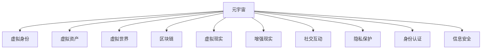

                 

# 元宇宙社交：重塑人际交往的数字平台

> 关键词：元宇宙,社交网络,数字身份,虚拟世界,沉浸式体验,区块链,数字资产,虚拟现实,增强现实,社交互动,隐私保护,身份认证,信息安全,用户界面设计,用户体验,虚拟社区,游戏化社交,社会行为研究,数字文化

## 1. 背景介绍

### 1.1 问题由来

随着科技的飞速发展，人类对数字世界的好奇心和探索欲望愈发强烈。从互联网到移动互联网，再到即将迎来的人工智能时代，每一次技术的革新都在重塑我们的生活方式。而今，一个全新的概念——元宇宙（Metaverse），正逐渐成为数字世界的新宠。

元宇宙是一个超越现实世界的虚拟空间，它融合了虚拟现实（VR）、增强现实（AR）、区块链等前沿技术，构建了一个可以沉浸互动的数字宇宙。在其中，用户可以创建虚拟身份、进行虚拟交往、交易虚拟资产、甚至开展虚拟生产。它不仅仅是一个技术趋势，更是一个全新的社交生态系统，将深刻改变人类的生活方式。

### 1.2 问题核心关键点

元宇宙社交的核心在于其高度沉浸的体验和自由度。相较于传统的社交网络，元宇宙社交平台不仅为用户提供了更为丰富的互动方式，还赋予了他们更多的自由度和创造空间。但在享受这些新体验的同时，元宇宙社交平台也面临诸多挑战，如隐私保护、身份认证、信息安全等问题。如何在这片新天地中构建一个安全、可信赖的社交环境，将成为元宇宙发展的关键。

### 1.3 问题研究意义

研究元宇宙社交平台，对于探索未来数字社会的运作方式，推动社会文化的融合与碰撞，具有重要的理论和实践意义：

1. **技术融合创新**：元宇宙社交将虚拟现实、区块链、人工智能等前沿技术深度融合，为数字社会构建提供了新的可能，有望成为未来技术创新的高地。
2. **社交形态重塑**：元宇宙社交平台将虚拟身份、互动方式、社区构建等诸多元素进行创新设计，有望开辟人类社交的新形态。
3. **经济模式变革**：通过虚拟资产、虚拟货币的流通和交易，元宇宙社交平台有望重塑数字经济模式，激发新的经济增长点。
4. **隐私保护挑战**：在享受自由度提升的同时，元宇宙社交平台也面临着隐私泄露、数据滥用等风险，如何保障用户隐私将成为研究重点。
5. **身份认证安全**：元宇宙社交平台需要构建新的身份认证体系，确保用户身份的真实性和安全性，防止欺诈和滥用。
6. **信息安全防护**：元宇宙社交平台涉及大量数据交互和交易，如何构建安全的网络环境，防止黑客攻击和数据篡改，将是重要课题。

## 2. 核心概念与联系

### 2.1 核心概念概述

为更好地理解元宇宙社交平台的构建，本节将介绍几个密切相关的核心概念：

- **元宇宙（Metaverse）**：一个由虚拟现实、增强现实、区块链等技术构建的数字世界，用户在其中可以进行虚拟互动、交易、生产等活动。
- **虚拟身份（Virtual Identity）**：用户在元宇宙中创造的虚拟人格，可以用于各种虚拟活动和互动。
- **虚拟资产（Virtual Assets）**：用户在元宇宙中创造或购买的虚拟物品，如土地、房屋、服装等，可以用于交易和展示。
- **虚拟世界（Virtual World）**：元宇宙中各种虚拟空间的总称，如城市、公园、学校等。
- **区块链（Blockchain）**：一种去中心化的分布式账本技术，用于记录和管理虚拟资产的交易记录。
- **虚拟现实（Virtual Reality, VR）**：通过虚拟设备模拟真实世界环境，实现沉浸式体验。
- **增强现实（Augmented Reality, AR）**：将数字信息叠加到真实世界，增强现实环境的互动性。
- **社交互动（Social Interaction）**：用户在元宇宙中进行的各种社交活动，如聊天、游戏、社交等。
- **隐私保护（Privacy Protection）**：在元宇宙社交平台中保护用户隐私，防止数据泄露和滥用。
- **身份认证（Identity Authentication）**：用户在元宇宙平台上的身份验证和认证机制，确保身份的真实性和安全性。
- **信息安全（Information Security）**：保护元宇宙社交平台上的数据传输和交易安全，防止黑客攻击和数据篡改。

这些核心概念之间的逻辑关系可以通过以下Mermaid流程图来展示：



这个流程图展示了一些关键概念之间的联系：

1. 元宇宙是构建其他概念的基础平台。
2. 虚拟身份、虚拟资产、虚拟世界等都是在元宇宙中构建和交互的主要元素。
3. 区块链、VR、AR等技术为元宇宙提供了实现可能。
4. 社交互动是元宇宙的重要功能，涉及用户之间的交互和互动。
5. 隐私保护、身份认证和信息安全是元宇宙社交平台构建的重要保障。

## 3. 核心算法原理 & 具体操作步骤

### 3.1 算法原理概述

元宇宙社交平台的构建基于多个先进技术的融合，包括但不限于虚拟现实、增强现实、区块链、人工智能等。其核心算法原理包括：

- **虚拟现实技术**：通过虚拟现实设备，如头戴式显示器（HMD）和手势识别设备，构建沉浸式的虚拟世界，让用户可以身临其境地参与社交活动。
- **增强现实技术**：将数字信息叠加到真实世界中，增强现实环境的互动性，让用户可以更自然地进行社交互动。
- **区块链技术**：构建去中心化的分布式账本系统，用于记录和管理虚拟资产的流通和交易。
- **人工智能技术**：用于构建智能化的社交互动系统，实现自然语言处理、情感识别、推荐算法等功能。

### 3.2 算法步骤详解

构建元宇宙社交平台的具体步骤如下：

**Step 1: 构建虚拟身份系统**
- 设计用户界面，允许用户在平台上创建虚拟身份。
- 提供个性化的虚拟形象定制选项，如发型、服饰、肤色等。
- 实现虚拟身份在不同虚拟世界之间的转移和交互。

**Step 2: 设计虚拟世界环境**
- 设计各种虚拟世界环境，如城市、公园、学校等。
- 提供虚拟物品和虚拟资产的创建和交易功能。
- 实现虚拟环境之间的连接和互通。

**Step 3: 构建虚拟交易系统**
- 设计虚拟资产的存储和管理方案。
- 实现虚拟资产的交易和流通机制。
- 确保交易的安全性和透明度。

**Step 4: 引入区块链技术**
- 构建去中心化的分布式账本系统，记录和管理虚拟资产的交易。
- 实现智能合约和自动化交易功能。
- 确保交易数据的不可篡改和可追溯性。

**Step 5: 融合虚拟现实和增强现实技术**
- 提供虚拟现实设备支持，让用户能够身临其境地参与社交活动。
- 利用增强现实技术，将数字信息叠加到真实环境中，增强互动性。
- 实现虚拟与现实世界的无缝连接。

**Step 6: 引入人工智能技术**
- 实现自然语言处理，理解用户输入，提供智能回复。
- 引入情感识别算法，理解用户情感，提升互动体验。
- 实现推荐算法，推荐相关内容和活动。

**Step 7: 构建隐私保护机制**
- 设计用户隐私保护策略，确保用户数据的安全。
- 实现数据加密和匿名化处理。
- 提供用户隐私控制选项，让用户可以管理自己的数据。

**Step 8: 构建身份认证体系**
- 设计用户身份验证和认证机制，确保用户身份的真实性和安全性。
- 实现多因素认证和身份验证功能。
- 提供用户身份管理选项，让用户可以管理自己的身份信息。

**Step 9: 构建信息安全体系**
- 实现数据加密和安全传输，防止黑客攻击和数据篡改。
- 设计安全协议和策略，确保平台安全。
- 定期进行安全审计和漏洞修复。

以上是构建元宇宙社交平台的一般流程。在实际应用中，还需要根据具体需求和场景进行优化设计，如改进用户界面、优化交易算法、加强隐私保护等。

### 3.3 算法优缺点

元宇宙社交平台的构建融合了多种前沿技术，具有以下优点：

- **高度沉浸体验**：通过虚拟现实和增强现实技术，用户可以身临其境地参与社交活动，获得更加真实和互动的体验。
- **高度自由度**：用户在虚拟世界中享有高度的自由度，可以自由创作、交易、互动。
- **去中心化安全**：区块链技术提供了去中心化的分布式账本系统，确保虚拟资产交易的安全性和透明度。
- **技术创新性**：融合了虚拟现实、增强现实、区块链、人工智能等前沿技术，推动了技术创新。

但同时也存在一些缺点：

- **技术复杂性**：元宇宙社交平台涉及多种技术融合，开发和维护复杂度较高。
- **高成本投入**：构建元宇宙社交平台需要大量的资金和资源投入，包括硬件设备、软件开发、基础设施等。
- **隐私和安全风险**：隐私保护和信息安全是元宇宙社交平台面临的重要挑战，需要构建完善的防护体系。

### 3.4 算法应用领域

元宇宙社交平台的构建已经在游戏、社交、教育、商业等多个领域得到了广泛应用，具体如下：

- **游戏**：如《堡垒之夜》、《我的世界》等，利用虚拟现实和增强现实技术，构建沉浸式的游戏环境，提供高度自由的游戏体验。
- **社交**：如《社交网络》、《Roblox》等，提供虚拟身份和互动功能，构建社交新生态。
- **教育**：如《VR教室》、《教育游戏》等，利用虚拟现实技术，提供沉浸式学习体验。
- **商业**：如《虚拟展会》、《虚拟商店》等，利用增强现实和虚拟现实技术，提供虚拟商业环境，增加用户互动。

## 4. 数学模型和公式 & 详细讲解 & 举例说明

### 4.1 数学模型构建

元宇宙社交平台的核心算法包括虚拟现实、增强现实、区块链、人工智能等多个方面。以下是一些核心数学模型的构建：

**虚拟现实技术**：
- **视角投影**：将三维空间中的物体投影到二维屏幕上，实现视觉呈现。数学公式为：
  $$
  x' = K(x - P) / d
  $$
  其中，$x'$ 为投影后的二维坐标，$K$ 为投影矩阵，$x$ 为三维空间坐标，$P$ 为摄像头位置，$d$ 为深度。
- **手部追踪**：通过传感器捕捉手部动作，实现虚拟互动。数学公式为：
  $$
  x' = x - P
  $$
  其中，$x'$ 为虚拟手部坐标，$x$ 为传感器捕获的手部坐标，$P$ 为摄像头位置。

**增强现实技术**：
- **图像识别**：通过深度学习算法，识别和定位现实环境中的物体。数学公式为：
  $$
  \hat{x} = \arg\min_{x} L(x, y)
  $$
  其中，$x$ 为模型参数，$y$ 为真实标签，$L$ 为损失函数，用于衡量预测结果和真实标签的差异。
- **物体定位**：通过SLAM（Simultaneous Localization and Mapping）算法，定位物体在现实环境中的位置。数学公式为：
  $$
  x' = S(x, y)
  $$
  其中，$x'$ 为物体定位结果，$x$ 为传感器数据，$S$ 为SLAM算法。

**区块链技术**：
- **共识算法**：如PoW（Proof of Work）、PoS（Proof of Stake）等，用于保证分布式账本的一致性和安全性。数学公式为：
  $$
  v = g(H(x))
  $$
  其中，$v$ 为验证结果，$g$ 为验证函数，$H$ 为哈希函数，$x$ 为交易数据。
- **智能合约**：通过代码实现，自动执行交易和合同条款。数学公式为：
  $$
  o = f(x, y)
  $$
  其中，$o$ 为智能合约执行结果，$f$ 为智能合约函数，$x$ 为输入数据，$y$ 为输出数据。

**人工智能技术**：
- **自然语言处理**：如BERT、GPT等模型，用于理解和生成自然语言。数学公式为：
  $$
  \hat{x} = \arg\min_{x} L(x, y)
  $$
  其中，$x$ 为模型参数，$y$ 为真实标签，$L$ 为损失函数。
- **情感识别**：通过深度学习算法，识别用户情感。数学公式为：
  $$
  s = f(x, y)
  $$
  其中，$s$ 为情感得分，$f$ 为情感识别函数，$x$ 为输入数据，$y$ 为输出数据。
- **推荐算法**：如协同过滤、内容推荐等，用于推荐相关内容和活动。数学公式为：
  $$
  r = w_1 \times c_1 + w_2 \times c_2 + \cdots + w_n \times c_n
  $$
  其中，$r$ 为推荐得分，$w$ 为权重，$c$ 为特征向量。

### 4.2 公式推导过程

以下是一些核心数学公式的推导过程：

**视角投影**：
设摄像头位置为$P$，物体在三维空间中的坐标为$x$，投影矩阵为$K$，则投影后的二维坐标为$x'$。根据透视投影公式：
  $$
  x' = K(x - P) / d
  $$
  其中，$d$ 为深度。

**手部追踪**：
设传感器捕获的手部坐标为$x$，摄像头位置为$P$，则虚拟手部坐标$x'$可以通过平移得到：
  $$
  x' = x - P
  $$

**图像识别**：
设输入图像为$x$，真实标签为$y$，模型参数为$x$，损失函数为$L$。通过最小化损失函数：
  $$
  \hat{x} = \arg\min_{x} L(x, y)
  $$
  可以得到最优模型参数$\hat{x}$。

**物体定位**：
设传感器数据为$x$，物体在现实环境中的位置为$x'$，SLAM算法为$S$。通过SLAM算法得到物体定位结果：
  $$
  x' = S(x, y)
  $$

**共识算法**：
设交易数据为$x$，验证函数为$g$，哈希函数为$H$。通过验证函数计算验证结果：
  $$
  v = g(H(x))
  $$

**智能合约**：
设输入数据为$x$，智能合约函数为$f$，输出数据为$y$。通过智能合约函数计算执行结果：
  $$
  o = f(x, y)
  $$

**自然语言处理**：
设输入数据为$x$，真实标签为$y$，模型参数为$x$，损失函数为$L$。通过最小化损失函数：
  $$
  \hat{x} = \arg\min_{x} L(x, y)
  $$

**情感识别**：
设输入数据为$x$，情感识别函数为$f$，输出数据为$y$。通过情感识别函数计算情感得分：
  $$
  s = f(x, y)
  $$

**推荐算法**：
设特征向量为$c$，权重向量为$w$，推荐算法为$f$。通过推荐算法计算推荐得分：
  $$
  r = w_1 \times c_1 + w_2 \times c_2 + \cdots + w_n \times c_n
  $$

### 4.3 案例分析与讲解

以《堡垒之夜》（Fortnite）为例，分析其元宇宙社交平台的核心技术实现：

**虚拟身份**：
用户可以在平台上创建自定义的虚拟角色，通过虚拟现实设备，如PlayStation VR和HTC Vive等，实现沉浸式的游戏体验。

**虚拟世界**：
游戏世界分为多个虚拟空间，如城市、草原、沙漠等，用户可以在其中自由探索和互动。

**虚拟资产**：
用户可以购买和交易各种虚拟物品，如皮肤、武器、车辆等。

**区块链技术**：
游戏中的虚拟物品通过区块链技术进行管理和交易，确保交易的安全性和透明度。

**虚拟现实和增强现实技术**：
通过虚拟现实技术，用户可以身临其境地参与游戏活动。通过增强现实技术，游戏中的物品可以叠加到现实环境中，增加互动性。

## 5. 项目实践：代码实例和详细解释说明

### 5.1 开发环境搭建

构建元宇宙社交平台需要多个技术栈的支持，包括虚拟现实、增强现实、区块链、人工智能等。以下是一些常用工具和环境的搭建步骤：

**虚拟现实开发环境**：
- 安装VR设备，如PlayStation VR、HTC Vive等。
- 安装VR开发工具，如Unity、Unreal Engine等。

**增强现实开发环境**：
- 安装AR设备，如AR眼镜、智能手机等。
- 安装AR开发工具，如ARKit、ARCore等。

**区块链开发环境**：
- 安装区块链开发框架，如Hyperledger Fabric、Ethereum等。
- 安装区块链钱包和交易工具，如MetaMask、MyEtherWallet等。

**人工智能开发环境**：
- 安装深度学习框架，如TensorFlow、PyTorch等。
- 安装自然语言处理工具，如NLTK、SpaCy等。

### 5.2 源代码详细实现

以下是一个简单的元宇宙社交平台的源代码实现示例，使用Python和Unity3D进行开发：

**虚拟身份系统**：
```python
# 创建虚拟身份
class VirtualIdentity:
    def __init__(self, name, avatar):
        self.name = name
        self.avatar = avatar

    def update_avatar(self, new_avatar):
        self.avatar = new_avatar
```

**虚拟世界环境**：
```python
# 设计虚拟世界环境
class VirtualWorld:
    def __init__(self, name, location):
        self.name = name
        self.location = location

    def add_item(self, item):
        self.items.append(item)

    def remove_item(self, item):
        self.items.remove(item)
```

**虚拟交易系统**：
```python
# 设计虚拟资产交易系统
class VirtualTransaction:
    def __init__(self, item, price):
        self.item = item
        self.price = price

    def sell(self, buyer):
        # 处理虚拟资产交易
        pass
```

**区块链技术**：
```python
# 设计区块链交易系统
class BlockchainTransaction:
    def __init__(self, sender, receiver, amount):
        self.sender = sender
        self.receiver = receiver
        self.amount = amount

    def verify(self):
        # 验证区块链交易
        pass
```

**人工智能技术**：
```python
# 设计自然语言处理模型
class NLPModel:
    def __init__(self):
        self.model = None

    def train(self, data):
        # 训练自然语言处理模型
        pass

    def predict(self, input):
        # 预测自然语言处理结果
        pass
```

**用户界面设计**：
```python
# 设计用户界面
class UI:
    def __init__(self, title, content):
        self.title = title
        self.content = content

    def render(self):
        # 渲染用户界面
        pass
```

### 5.3 代码解读与分析

让我们再详细解读一下关键代码的实现细节：

**VirtualIdentity类**：
- `__init__`方法：初始化虚拟身份的基本属性，如姓名、头像等。
- `update_avatar`方法：更新虚拟身份的头像。

**VirtualWorld类**：
- `__init__`方法：初始化虚拟世界的基本属性，如名称、位置等。
- `add_item`方法：向虚拟世界添加物品。
- `remove_item`方法：从虚拟世界移除物品。

**VirtualTransaction类**：
- `__init__`方法：初始化虚拟交易的基本属性，如物品、价格等。
- `sell`方法：处理虚拟资产的销售过程。

**BlockchainTransaction类**：
- `__init__`方法：初始化区块链交易的基本属性，如发送者、接收者、金额等。
- `verify`方法：验证区块链交易的有效性。

**NLPModel类**：
- `__init__`方法：初始化自然语言处理模型的实例。
- `train`方法：训练自然语言处理模型。
- `predict`方法：使用训练好的模型进行预测。

**UI类**：
- `__init__`方法：初始化用户界面的基本属性，如标题、内容等。
- `render`方法：渲染用户界面。

这些代码片段展示了元宇宙社交平台的核心模块设计，包括虚拟身份、虚拟世界、虚拟交易、区块链、自然语言处理等。在实际应用中，还需要结合具体的业务需求进行扩展和优化。

## 6. 实际应用场景

### 6.1 智能教育

元宇宙社交平台在智能教育领域有广泛应用，如虚拟课堂、虚拟实验室等。通过虚拟现实技术，学生可以在虚拟环境中进行实验和互动，提升学习效果。同时，元宇宙社交平台还可以提供个性化的学习推荐，帮助学生找到适合自己的学习路径。

### 6.2 虚拟旅游

元宇宙社交平台在虚拟旅游领域也有重要应用，如虚拟景点、虚拟导览等。用户可以在虚拟世界中自由探索，体验不同的旅游场景。同时，元宇宙社交平台还可以提供虚拟导游服务，提升旅游体验。

### 6.3 虚拟娱乐

元宇宙社交平台在虚拟娱乐领域应用广泛，如虚拟电影、虚拟游戏等。用户可以在虚拟环境中参与互动，体验不同的娱乐活动。同时，元宇宙社交平台还可以提供虚拟演唱会、虚拟展览等活动，丰富用户的娱乐体验。

### 6.4 未来应用展望

随着技术的不断进步，元宇宙社交平台将迎来更多创新应用，如虚拟商业、虚拟金融等。在虚拟商业领域，用户可以通过虚拟店铺进行互动和交易。在虚拟金融领域，用户可以通过虚拟货币进行投资和交易，构建新的金融生态。

## 7. 工具和资源推荐

### 7.1 学习资源推荐

为帮助开发者系统掌握元宇宙社交平台的构建技术，以下是一些优质的学习资源：

1. 《元宇宙技术手册》：全面介绍了元宇宙的基本概念、核心技术和应用场景。
2. 《虚拟现实开发实战》：介绍了虚拟现实技术的核心原理和开发方法，包括Unity、Unreal Engine等。
3. 《增强现实开发指南》：介绍了增强现实技术的核心原理和开发方法，包括ARKit、ARCore等。
4. 《区块链基础与实践》：介绍了区块链技术的基本原理和应用场景，包括Hyperledger Fabric、Ethereum等。
5. 《人工智能基础与实践》：介绍了人工智能技术的基本原理和应用场景，包括TensorFlow、PyTorch等。
6. 《自然语言处理实战》：介绍了自然语言处理技术的基本原理和应用场景，包括NLTK、SpaCy等。

### 7.2 开发工具推荐

高效的开发离不开优秀的工具支持。以下是几款用于元宇宙社交平台开发的常用工具：

1. Unity3D：一款强大的游戏引擎，支持虚拟现实和增强现实开发，适合构建复杂的虚拟环境。
2. Unreal Engine：另一款强大的游戏引擎，支持虚拟现实和增强现实开发，适合构建高度沉浸的虚拟世界。
3. MetaMask：一款流行的区块链钱包，支持以太坊和其他区块链平台，方便用户进行虚拟资产交易。
4. MyEtherWallet：另一款流行的区块链钱包，支持以太坊和其他区块链平台，方便用户进行虚拟资产交易。
5. TensorFlow：基于Python的开源深度学习框架，灵活动态的计算图，适合快速迭代研究。
6. PyTorch：基于Python的开源深度学习框架，适合复杂模型的训练和优化。

### 7.3 相关论文推荐

元宇宙社交平台的构建涉及多个前沿技术，以下是几篇奠基性的相关论文，推荐阅读：

1.《虚拟现实技术：现状与展望》：综述了虚拟现实技术的核心原理和应用场景。
2.《增强现实技术：现状与展望》：综述了增强现实技术的核心原理和应用场景。
3.《区块链技术：现状与展望》：综述了区块链技术的基本原理和应用场景。
4.《人工智能技术：现状与展望》：综述了人工智能技术的基本原理和应用场景。
5.《自然语言处理技术：现状与展望》：综述了自然语言处理技术的基本原理和应用场景。

## 8. 总结：未来发展趋势与挑战

### 8.1 总结

本文对元宇宙社交平台的构建进行了全面系统的介绍。首先阐述了元宇宙社交平台的基本概念和核心技术，明确了其在虚拟现实、增强现实、区块链、人工智能等技术融合下的独特价值。其次，从原理到实践，详细讲解了元宇宙社交平台的构建过程，包括虚拟身份、虚拟世界、虚拟交易、区块链、自然语言处理等核心模块的设计和实现。同时，本文还探讨了元宇宙社交平台在教育、旅游、娱乐等领域的应用前景，展示了其广阔的应用空间。最后，本文精选了元宇宙社交平台的各类学习资源，力求为开发者提供全方位的技术指引。

通过本文的系统梳理，可以看到，元宇宙社交平台作为数字社交的新形态，正在迅速崛起，并带来诸多创新应用。元宇宙社交平台将极大地拓展人类的互动方式，推动社交、教育、娱乐等多个领域的发展，成为未来数字社会的核心基础设施。

### 8.2 未来发展趋势

展望未来，元宇宙社交平台将呈现以下几个发展趋势：

1. **技术融合创新**：元宇宙社交平台将继续融合虚拟现实、增强现实、区块链、人工智能等前沿技术，推动技术的创新发展。
2. **应用场景拓展**：元宇宙社交平台将拓展到更多的应用场景，如虚拟商业、虚拟金融等，带来新的经济增长点。
3. **用户体验提升**：元宇宙社交平台将继续优化用户体验，提升沉浸感和互动性，增强用户的粘性。
4. **隐私保护加强**：元宇宙社交平台将加强隐私保护和数据安全，提升用户信任度。
5. **身份认证创新**：元宇宙社交平台将构建新的身份认证体系，确保用户身份的真实性和安全性。
6. **信息安全保障**：元宇宙社交平台将构建安全的网络环境，保障交易和数据的安全。

### 8.3 面临的挑战

尽管元宇宙社交平台具有巨大的发展潜力，但在实际应用中仍面临诸多挑战：

1. **技术复杂性**：元宇宙社交平台涉及多种技术的融合，开发和维护复杂度较高。
2. **高成本投入**：构建元宇宙社交平台需要大量的资金和资源投入，包括硬件设备、软件开发、基础设施等。
3. **隐私和安全风险**：隐私保护和信息安全是元宇宙社交平台面临的重要挑战，需要构建完善的防护体系。
4. **用户教育**：元宇宙社交平台需要用户进行技术学习和适应，需要提供用户教育资源和支持。
5. **法律合规**：元宇宙社交平台需要遵守法律法规，确保用户的隐私和数据安全。

### 8.4 研究展望

面对元宇宙社交平台所面临的种种挑战，未来的研究需要在以下几个方面寻求新的突破：

1. **技术融合创新**：探索更加高效的技术融合方式，提高开发效率和用户体验。
2. **隐私保护加强**：研究新的隐私保护技术，确保用户数据的安全和隐私。
3. **身份认证创新**：研究新的身份认证方法，确保用户身份的真实性和安全性。
4. **信息安全保障**：研究新的信息安全技术，确保交易和数据的安全。
5. **用户教育提升**：提供更多的用户教育资源，帮助用户更好地适应和利用元宇宙社交平台。
6. **法律合规保障**：研究新的法律法规，确保元宇宙社交平台的合法合规运营。

这些研究方向的探索，必将引领元宇宙社交平台技术的不断进步，推动数字社会的深度发展。面向未来，元宇宙社交平台需要从技术、隐私、安全、教育等多个维度协同发力，才能真正实现其广泛应用和深远影响。

## 9. 附录：常见问题与解答

**Q1：元宇宙社交平台的开发难度如何？**

A: 元宇宙社交平台的开发难度较大，需要跨多个技术栈进行综合设计。虚拟现实、增强现实、区块链、人工智能等技术需要深度融合，开发和维护复杂度较高。但随着技术的不断成熟和标准化，开发难度也将逐渐降低。

**Q2：元宇宙社交平台如何保障用户隐私？**

A: 元宇宙社交平台需要构建完善的隐私保护体系，包括数据加密、匿名化处理、多因素认证等。用户可以管理自己的隐私选项，决定哪些数据可以共享和公开。

**Q3：元宇宙社交平台如何确保身份的真实性？**

A: 元宇宙社交平台可以设计多因素认证机制，如密码、短信验证码、生物识别等，确保用户身份的真实性和安全性。同时，可以通过区块链技术记录和验证用户身份信息。

**Q4：元宇宙社交平台如何确保信息安全？**

A: 元宇宙社交平台需要构建安全的网络环境，采用数据加密、安全传输等技术，防止黑客攻击和数据篡改。同时，需要定期进行安全审计和漏洞修复。

**Q5：元宇宙社交平台如何提升用户体验？**

A: 元宇宙社交平台可以通过优化虚拟环境、增强互动性、提升渲染效果等方式，提升用户体验。同时，可以通过用户反馈和数据分析，不断优化和改进平台功能。

---

作者：禅与计算机程序设计艺术 / Zen and the Art of Computer Programming

