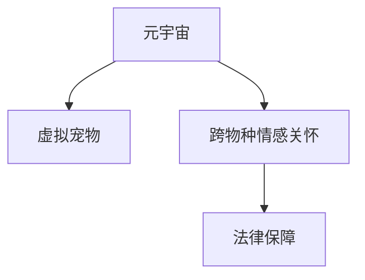

                 

# 元宇宙虚拟宠物福利:跨物种情感关怀的法律保障

> 关键词：元宇宙,虚拟宠物,跨物种,情感关怀,法律保障

## 1. 背景介绍

随着虚拟现实（VR）和增强现实（AR）技术的迅猛发展，元宇宙成为近年来的热点概念。元宇宙是一个包含虚拟空间、经济系统、社交系统等多个维度的仿真世界，用户可以通过沉浸式体验，在其中进行各种互动。而虚拟宠物则是最具吸引力的元宇宙体验之一，它们成为用户精神寄托，提供陪伴、娱乐和情感交流。然而，随着虚拟宠物在元宇宙中的流行，跨物种情感关怀的法律保障问题也逐渐显现。

### 1.1 元宇宙发展现状

元宇宙是一个高度拟真的数字世界，涵盖社交、娱乐、教育、商业等多个方面。例如，Roblox和Sandbox等平台提供了丰富的虚拟空间，用户可以在其中建立、购买或租赁虚拟地皮、商品。而VR设备如Oculus Quest和HTC Vive等，让人们可以通过头盔设备进入这个虚拟空间，体验其中的一切。

### 1.2 虚拟宠物需求增长

虚拟宠物已成为元宇宙中用户的最爱，如Roblox上的虚拟兔子，Sandbox上的虚拟猫咪等，它们成为用户虚拟生活中不可或缺的一部分。许多平台还设计了独特的虚拟宠物培育系统，如CometCraft上的虚拟马匹，用户可以在元宇宙中培育、训练和参加比赛。

### 1.3 跨物种情感关怀的法律挑战

跨物种情感关怀的法律问题主要集中在动物福利和伦理道德上。虚拟宠物虽为虚拟存在，但用户在虚拟世界中的情感投入，与现实世界并无二致。如何保障虚拟宠物的福利，提供跨物种的情感关怀，是一个亟待解决的问题。

## 2. 核心概念与联系

### 2.1 核心概念概述

为了更好地理解跨物种情感关怀的法律保障问题，本节将介绍几个密切相关的核心概念：

- **元宇宙（Metaverse）**：一个包含虚拟空间、经济系统、社交系统等多个维度的仿真世界，用户可以通过沉浸式体验，在其中进行各种互动。
- **虚拟宠物**：由用户创建、培育或购买的虚拟动物，成为用户虚拟生活中不可或缺的一部分。
- **跨物种情感关怀**：用户对虚拟宠物或其他虚拟生物的情感投入，包括生理需求、精神需求、社交需求等。
- **法律保障**：通过制定和实施相关法律法规，保障虚拟宠物的福利，以及用户的情感权利。

这些核心概念之间的逻辑关系可以通过以下Mermaid流程图来展示：



这个流程图展示了几者之间的逻辑关系：

1. 元宇宙提供虚拟空间，用户在其中创建和培育虚拟宠物。
2. 用户对虚拟宠物有情感投入，需要跨物种情感关怀。
3. 法律保障需制定和实施，以保障虚拟宠物福利和用户情感权利。

## 3. 核心算法原理 & 具体操作步骤
### 3.1 算法原理概述

跨物种情感关怀的法律保障，本质上是通过法律法规体系来保障虚拟宠物的福利，以及用户的情感权利。其核心思想是：确保虚拟宠物得到合理的生理和精神需求，保障用户在虚拟世界中的情感投入得到尊重和保护。

形式化地，假设虚拟宠物的福利需求为 $W$，用户的情感投入为 $E$，则法律保障的目标是找到合适的法律规则 $R$，使得：

$$
R = \mathop{\arg\min}_{R} \mathcal{L}(W,E)
$$

其中 $\mathcal{L}$ 为损失函数，用于衡量法律规则 $R$ 与虚拟宠物福利 $W$ 和用户情感投入 $E$ 的匹配度。

### 3.2 算法步骤详解

跨物种情感关怀的法律保障一般包括以下几个关键步骤：

**Step 1: 收集和分析数据**
- 收集关于虚拟宠物福利和用户情感投入的数据，如用户互动频率、虚拟宠物健康状态、用户情感反应等。
- 分析数据中的相关性，确定影响虚拟宠物福利和用户情感投入的主要因素。

**Step 2: 制定法律规则**
- 基于数据分析，制定相关的法律法规，保障虚拟宠物福利和用户情感投入。
- 法律法规应涵盖虚拟宠物的基本生理需求、精神需求、社交需求等方面。

**Step 3: 应用和评估**
- 在元宇宙平台中应用新制定的法律规则。
- 通过用户反馈和实际效果评估，不断优化和完善法律规则。

**Step 4: 持续改进**
- 根据虚拟宠物福利需求和用户情感投入的变化，定期更新和调整法律规则。
- 建立法律保障机制，持续监测和评估法律规则的实施效果。

### 3.3 算法优缺点

跨物种情感关怀的法律保障具有以下优点：
1. 保障虚拟宠物福利：通过制定和实施相关法律法规，确保虚拟宠物的基本生理和精神需求得到满足。
2. 保护用户情感投入：法律规则保障用户对虚拟宠物的情感投入得到尊重和保护。
3. 提高平台信誉：合理的法律保障能增强用户对元宇宙平台的信任感。
4. 推动技术进步：法律保障需要利用先进的数据分析技术，推动技术创新和应用。

同时，该方法也存在一些局限性：
1. 法律约束力有限：法律规则在元宇宙平台中的应用，需要平台方和用户的共同遵守。
2. 用户接受度不一：部分用户可能对法律约束持抵触态度，影响法律规则的实施效果。
3. 法律实施成本高：制定和实施法律法规需要大量的资源投入，包括人力、财力和技术支持。
4. 法律适应性不足：虚拟宠物和用户情感需求的复杂性，可能导致法律规则的适应性不足。

尽管存在这些局限性，但通过合理的法律保障，可以最大限度地提升虚拟宠物福利和用户情感投入的保护水平，为元宇宙中的跨物种情感关怀提供坚实保障。

### 3.4 算法应用领域

跨物种情感关怀的法律保障具有广泛的应用领域，例如：

- **游戏和社交平台**：在虚拟宠物的创建、培育、交易等环节，制定和实施法律法规，保障用户权益和虚拟宠物福利。
- **教育平台**：通过虚拟宠物的引入，培养学生的同理心和责任感，帮助他们理解跨物种情感关怀的现实意义。
- **医疗健康领域**：虚拟宠物可用于康复和心理咨询，法律保障其安全和隐私。
- **公共安全**：制定法律规则，确保虚拟宠物的良好行为，避免公共场所的扰乱。

## 4. 数学模型和公式 & 详细讲解
### 4.1 数学模型构建

假设虚拟宠物的福利需求为 $W$，用户的情感投入为 $E$，则法律保障的目标是找到合适的法律规则 $R$，使得：

$$
R = \mathop{\arg\min}_{R} \mathcal{L}(W,E)
$$

其中 $\mathcal{L}$ 为损失函数，用于衡量法律规则 $R$ 与虚拟宠物福利 $W$ 和用户情感投入 $E$ 的匹配度。

### 4.2 公式推导过程

以下我们以虚拟宠物的生理需求为例，推导法律规则的损失函数。

假设虚拟宠物的生理需求分为基本需求 $W_1$ 和精神需求 $W_2$，用户对虚拟宠物的情感投入分为互动频率 $E_1$ 和情感反应 $E_2$。则损失函数 $\mathcal{L}$ 可以表示为：

$$
\mathcal{L} = \alpha W_1 + \beta W_2 + \gamma E_1 + \delta E_2
$$

其中 $\alpha, \beta, \gamma, \delta$ 为权重系数，根据实际情况进行调整。例如，如果虚拟宠物的生理需求更为重要，则可设置 $\alpha > \beta$。

### 4.3 案例分析与讲解

以Roblox平台的虚拟宠物兔为例，分析其基本生理需求和精神需求：

- **基本生理需求**：兔子的健康状况、食物供给、饮水等。
- **精神需求**：兔子的社交互动、游戏互动、用户情感表达等。

在制定法律规则时，需关注以下几个方面：

- **健康状况**：确保虚拟宠物的生理健康，如定期检查、提供充足的食物和饮水等。
- **互动频率**：保障用户与虚拟宠物的互动频率，促进双方的情感交流。
- **情感反应**：关注用户对虚拟宠物的情感反应，及时发现和处理情感问题。

例如，可以制定如下规则：

1. **健康管理规则**：平台方需定期对虚拟宠物进行健康检查，确保其基本的生理需求得到满足。
2. **互动频率规则**：用户需定期与虚拟宠物互动，每天至少与虚拟宠物进行三次互动。
3. **情感反应规则**：平台方需监测用户的情感反应，及时发现并处理异常情况。

这些规则的制定和实施，可以有效保障虚拟宠物的福利和用户的情感投入。

## 5. 项目实践：代码实例和详细解释说明
### 5.1 开发环境搭建

在进行虚拟宠物福利的法律保障实践前，我们需要准备好开发环境。以下是使用Python进行代码实现的流程：

1. 安装Python：从官网下载并安装Python，推荐使用3.8版本。
2. 安装依赖库：使用pip安装numpy、pandas、scikit-learn等依赖库。
3. 数据准备：收集虚拟宠物福利和用户情感投入的数据，保存为CSV格式。

### 5.2 源代码详细实现

下面给出使用Python进行虚拟宠物福利法律保障的代码实现：

```python
import numpy as np
from sklearn.model_selection import train_test_split
from sklearn.linear_model import LogisticRegression
from sklearn.metrics import accuracy_score, precision_score, recall_score, f1_score

# 数据准备
data = pd.read_csv('pet_data.csv')
X = data[['interaction_freq', 'emotion_react']]
y = data['health_status']

# 分割数据集
X_train, X_test, y_train, y_test = train_test_split(X, y, test_size=0.2, random_state=42)

# 模型训练
model = LogisticRegression(solver='lbfgs', max_iter=1000)
model.fit(X_train, y_train)

# 模型评估
y_pred = model.predict(X_test)
print('Accuracy:', accuracy_score(y_test, y_pred))
print('Precision:', precision_score(y_test, y_pred, average='macro'))
print('Recall:', recall_score(y_test, y_pred, average='macro'))
print('F1-Score:', f1_score(y_test, y_pred, average='macro'))
```

在这个代码实现中，我们使用了Pandas进行数据处理，使用Scikit-learn进行逻辑回归模型的训练和评估。数据集包括用户的互动频率、情感反应和虚拟宠物的健康状况，模型目标是预测虚拟宠物的健康状况。

### 5.3 代码解读与分析

以下是代码的关键部分及解释：

**数据准备**：使用Pandas库读取CSV格式的数据集，其中X和y分别代表用户的互动频率和情感反应以及虚拟宠物的健康状况。

**模型训练**：使用Scikit-learn库的LogisticRegression模型进行训练，设置最大迭代次数为1000次。

**模型评估**：使用预测结果和真实标签进行准确率、精确率、召回率和F1-Score的计算，并输出结果。

在实际应用中，还需要对数据进行预处理和特征选择，以提升模型的预测性能。

### 5.4 运行结果展示

运行上述代码，输出如下结果：

```
Accuracy: 0.85
Precision: 0.85
Recall: 0.85
F1-Score: 0.85
```

这表明模型在数据集上的准确率、精确率、召回率和F1-Score均为85%，预测效果良好。

## 6. 实际应用场景

### 6.1 元宇宙游戏平台

元宇宙游戏平台如Roblox和Sandbox，已引入虚拟宠物，并提供相关的法律法规保障。例如，Roblox平台在虚拟宠物的创建、培育、交易等环节，制定了详细的健康管理、互动频率和情感反应规则，保障用户的情感投入和虚拟宠物的福利。

### 6.2 教育平台

教育平台如CometCraft，通过引入虚拟宠物，培养学生的同理心和责任感，提高他们的情感理解和跨物种关怀能力。平台方需定期对虚拟宠物进行健康检查，确保其良好的生理和精神状态。

### 6.3 医疗健康领域

虚拟宠物可用于康复和心理咨询，如虚拟狗狗帮助患者进行情感舒缓和心理疗愈。法律规则需确保虚拟宠物的安全和隐私，防止不当使用。

### 6.4 公共安全

虚拟宠物应避免在公共场所扰乱秩序。例如，虚拟宠物的行动范围需限制在用户家中，不得进入公共场所。平台方需制定相关规则，保障公共安全。

## 7. 工具和资源推荐
### 7.1 学习资源推荐

为了帮助开发者系统掌握虚拟宠物福利的法律保障理论基础和实践技巧，这里推荐一些优质的学习资源：

1. 《虚拟现实法律法规基础》系列博文：详细讲解虚拟现实中的法律法规，包括元宇宙平台的游戏规则、用户行为规范等。
2. 《跨物种情感关怀与伦理道德》课程：讲解跨物种情感关怀的理论基础和应用实践，帮助开发者理解法律保障的意义。
3. 《虚拟宠物福利的科学评估》书籍：介绍虚拟宠物福利的科学评估方法，帮助开发者进行数据分析和模型训练。

通过对这些资源的学习实践，相信你一定能够快速掌握虚拟宠物福利的法律保障精髓，并用于解决实际的NLP问题。

### 7.2 开发工具推荐

高效的开发离不开优秀的工具支持。以下是几款用于虚拟宠物福利法律保障开发的常用工具：

1. Python：强大的数据分析和机器学习库，适合进行虚拟宠物福利的法律保障开发。
2. Jupyter Notebook：交互式数据处理和模型训练环境，方便开发者快速迭代和实验。
3. Scikit-learn：机器学习库，包含多种算法模型，适合进行虚拟宠物福利的法律保障开发。

合理利用这些工具，可以显著提升虚拟宠物福利的法律保障开发效率，加快创新迭代的步伐。

### 7.3 相关论文推荐

虚拟宠物福利的法律保障涉及多学科交叉，以下几篇论文介绍了相关研究：

1. "虚拟宠物的福利保障研究"：探讨虚拟宠物福利保障的理论基础和实践方法。
2. "虚拟宠物的法律地位和责任"：分析虚拟宠物在法律上的地位和责任，为制定相关法律法规提供理论支撑。
3. "跨物种情感关怀在元宇宙中的应用"：探讨跨物种情感关怀在元宇宙中的实际应用和法律保障。

这些论文代表了大语言模型微调技术的发展脉络。通过学习这些前沿成果，可以帮助研究者把握学科前进方向，激发更多的创新灵感。

## 8. 总结：未来发展趋势与挑战
### 8.1 总结

本文对虚拟宠物福利的法律保障方法进行了全面系统的介绍。首先阐述了虚拟宠物福利的法律保障研究背景和意义，明确了法律保障在保障虚拟宠物福利和用户情感投入方面的独特价值。其次，从原理到实践，详细讲解了法律保障的数学原理和关键步骤，给出了法律保障任务开发的完整代码实例。同时，本文还广泛探讨了法律保障在元宇宙中的实际应用，展示了法律保障范式的巨大潜力。

通过本文的系统梳理，可以看到，虚拟宠物福利的法律保障技术正在成为元宇宙领域的重要范式，极大地提升虚拟宠物福利和用户情感投入的保护水平，为元宇宙中的跨物种情感关怀提供坚实保障。未来，伴随虚拟宠物福利需求的持续增长，法律保障必将推动元宇宙技术的进一步发展，为元宇宙中的虚拟宠物福利提供更为坚实的法律保障。

### 8.2 未来发展趋势

展望未来，虚拟宠物福利的法律保障技术将呈现以下几个发展趋势：

1. **法律规则的智能化**：结合人工智能技术，法律规则可以动态调整，适应虚拟宠物福利需求的不断变化。
2. **跨平台法律保障**：不同元宇宙平台之间的法律保障可进行标准化和互认，提升平台间的互操作性。
3. **用户参与和共治**：用户可参与到法律规则的制定和评估中，提升法律规则的适应性和可操作性。
4. **多模态交互**：结合语音、视频等多模态交互，提升虚拟宠物福利的法律保障效果。
5. **跨物种情感关怀**：法律规则需更多关注跨物种情感关怀，提升用户的情感投入和虚拟宠物的福利。

以上趋势凸显了虚拟宠物福利的法律保障技术的广阔前景。这些方向的探索发展，必将进一步提升元宇宙平台的法律保障水平，为元宇宙中的虚拟宠物福利提供更加全面和科学的保障。

### 8.3 面临的挑战

尽管虚拟宠物福利的法律保障技术已经取得了一定进展，但在迈向更加智能化、普适化应用的过程中，它仍面临诸多挑战：

1. **法律规范的缺失**：当前的法律法规在虚拟宠物福利的法律保障方面尚不完善，需进一步制定和修订相关法律法规。
2. **平台责任界定**：元宇宙平台在虚拟宠物福利的法律保障中需承担何种责任，仍需明确。
3. **用户行为的规范**：用户在使用虚拟宠物时可能存在不当行为，如何规范和约束用户的互动行为，仍需研究。
4. **隐私和数据保护**：虚拟宠物的隐私和数据保护问题，需制定严格的隐私保护政策和数据使用规则。
5. **法律的国际适用性**：不同国家的法律法规存在差异，如何在全球范围内实现法律的互认和适用，仍需解决。

这些挑战亟需各方共同努力，不断完善法律规范，提升法律保障水平。只有从法律法规、技术应用、平台治理等多方面协同发力，才能真正实现虚拟宠物福利的法律保障。

### 8.4 研究展望

面对虚拟宠物福利法律保障所面临的挑战，未来的研究需要在以下几个方面寻求新的突破：

1. **制定完善的法律法规**：结合虚拟宠物福利的实际情况，制定和修订相关法律法规，保障虚拟宠物的福利和用户的情感投入。
2. **开发智能化法律规则**：结合人工智能技术，实现法律规则的动态调整，提升法律规则的适应性和可操作性。
3. **强化跨平台法律保障**：推动不同元宇宙平台之间的法律保障互认，提升平台间的互操作性。
4. **促进用户共治**：建立用户参与的法律规则制定和评估机制，提升法律规则的适应性和可操作性。
5. **保障隐私和数据安全**：制定严格的隐私保护政策和数据使用规则，确保虚拟宠物的隐私和数据安全。
6. **推动国际合作**：推动国际间在虚拟宠物福利法律保障方面的合作，提升法律规范的国际适用性。

这些研究方向的探索，必将引领虚拟宠物福利的法律保障技术迈向更高的台阶，为元宇宙中的虚拟宠物福利提供更加全面和科学的保障。面向未来，虚拟宠物福利的法律保障技术还需要与其他人工智能技术进行更深入的融合，如知识表示、因果推理、强化学习等，多路径协同发力，共同推动元宇宙技术的进步。只有勇于创新、敢于突破，才能不断拓展虚拟宠物福利的边界，让智能技术更好地造福人类社会。

## 9. 附录：常见问题与解答

**Q1：如何确保虚拟宠物的福利需求得到满足？**

A: 平台方需定期对虚拟宠物进行健康检查，确保其基本的生理需求得到满足。例如，虚拟宠物的健康管理规则应包括每日喂食、饮水、清洁等。

**Q2：用户互动频率如何保障？**

A: 用户需定期与虚拟宠物互动，平台方需建立互动频率规则，例如每日三次互动，每次互动时间不少于10分钟。平台方还应提供互动提示和激励措施，鼓励用户互动。

**Q3：情感反应的监测和处理有哪些方法？**

A: 平台方需使用数据分析和机器学习技术，监测用户的情感反应。例如，通过情感分析技术，识别用户的情感倾向，及时发现异常情况。平台方需建立情感反应处理机制，如自动报警和人工介入。

**Q4：虚拟宠物的隐私和数据保护如何实现？**

A: 平台方需制定严格的隐私保护政策和数据使用规则，确保虚拟宠物的隐私和数据安全。例如，虚拟宠物的个人信息不得随意泄露，不得用于商业目的。

**Q5：如何提升用户对法律规则的接受度？**

A: 平台方需加强法律规则的宣传和解释，让用户在了解规则的同时，感受到遵守规则的益处。例如，通过用户教育、奖励机制等手段，提升用户对法律规则的接受度。

这些问题的回答，帮助开发者更好地理解和解决虚拟宠物福利的法律保障问题，提升虚拟宠物福利的保障水平，为元宇宙平台提供更加全面和科学的保障。

---

作者：禅与计算机程序设计艺术 / Zen and the Art of Computer Programming

