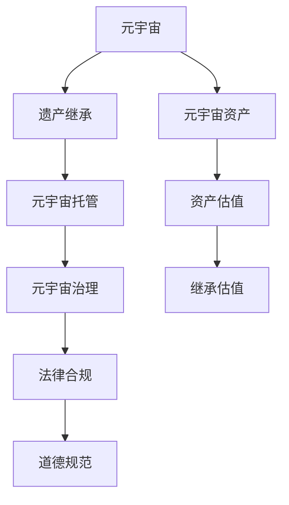

                 

# 元宇宙遗产规划与管理:虚拟资产传承的综合咨询服务体系

## 1. 背景介绍

### 1.1 问题由来
随着数字技术和区块链技术的迅猛发展，元宇宙成为新一代互联网发展的潮流和方向。在元宇宙中，资产不仅包括传统的物理财产和金融资产，还包括虚拟土地、NFT艺术品、虚拟货币等数字化财产。元宇宙的出现，为人们提供了一个全新的数字生活空间，也带来了复杂的遗产继承和管理问题。

元宇宙遗产规划与管理，成为数字时代的新课题。传统的遗产继承方法无法满足虚拟资产的保护需求，需要引入新的技术手段和咨询服务体系。因此，本文旨在探讨元宇宙遗产规划与管理的核心概念和关键技术，构建一套综合咨询服务体系，以应对未来可能出现的各种复杂继承场景。

### 1.2 问题核心关键点
元宇宙遗产规划与管理主要涉及以下几个关键点：
- 元宇宙资产的类型和特点
- 元宇宙资产的合法性和确权
- 元宇宙资产的传承方式和机制
- 元宇宙资产的估值和定价
- 元宇宙资产的托管和继承执行
- 元宇宙资产的法律和道德问题

本文将围绕这些关键点，系统介绍元宇宙遗产规划与管理的核心技术，并提出一套综合的咨询服务体系。

### 1.3 问题研究意义
研究元宇宙遗产规划与管理，对拓展数字资产传承方式，保障数字财产权利，促进元宇宙经济的健康发展，具有重要意义：

1. 创新遗产传承方式。元宇宙资产的数字化特点，为遗产传承带来了新的方式和途径。
2. 保障数字财产权利。元宇宙资产的权利保护需要法律和技术的双重保障。
3. 促进元宇宙经济发展。元宇宙资产的流动性、投资性等特点，为元宇宙经济注入了新的活力。
4. 提升社会治理水平。元宇宙资产的继承和管理，可以提升社会治理的智能化和规范化水平。
5. 推动产业升级。元宇宙资产的传承与管理，促进相关产业如区块链、数字法律、数字金融等的持续升级。

## 2. 核心概念与联系

### 2.1 核心概念概述

为更好地理解元宇宙遗产规划与管理，本节将介绍几个密切相关的核心概念：

- 元宇宙（Metaverse）：由多个独立的网络平台组成的虚拟世界，用户可以在其中自由交互和创造。
- 元宇宙资产（Metaverse Assets）：存在于元宇宙中的数字化财产，如虚拟土地、NFT艺术品、虚拟货币等。
- 遗产继承（Legacy Inheritance）：将个人拥有的财产在生前或死后转移给继承人的法律程序。
- 元宇宙托管（Metaverse Custody）：通过智能合约等方式，将元宇宙资产委托给第三方保管，确保资产的安全性和可追溯性。
- 元宇宙治理（Metaverse Governance）：元宇宙中资产管理和继承事务的规范化和法制化管理。

这些核心概念之间的逻辑关系可以通过以下Mermaid流程图来展示：



这个流程图展示了几大核心概念及其之间的关系：

1. 元宇宙资产作为元宇宙中最重要的资源，是遗产继承和托管的对象。
2. 遗产继承通过元宇宙托管，将资产的安全性和可追溯性加以保障。
3. 元宇宙托管在元宇宙治理的框架下进行，确保继承和托管的合法性和合规性。
4. 资产估值和继承估值是元宇宙遗产规划与管理的核心技术环节，直接影响资产的继承和传承。
5. 法律合规和道德规范是元宇宙遗产规划与管理的双重保障，确保传承过程的公平性和正义性。

这些概念共同构成了元宇宙遗产规划与管理的框架，确保了虚拟资产传承的合法性、安全性、可操作性和伦理性。

## 3. 核心算法原理 & 具体操作步骤
### 3.1 算法原理概述

元宇宙遗产规划与管理的核心算法原理基于区块链技术和智能合约。通过智能合约，元宇宙资产的继承和管理过程可以进行自动化、去中心化的处理，确保资产的透明性、安全性和可追溯性。

具体而言，元宇宙遗产规划与管理包括以下几个关键步骤：

- 资产的数字化确权：通过区块链技术对元宇宙资产进行确权，确保资产的唯一性和不可篡改性。
- 资产的估值和定价：通过算法和市场机制对元宇宙资产进行估值，确定资产的价值。
- 继承的自动化执行：通过智能合约，在用户指定的时间或条件触发下，自动执行资产的继承和转移。
- 法律和道德规范的遵循：通过元宇宙治理，确保继承和转移过程符合法律和道德规范。

### 3.2 算法步骤详解

**Step 1: 资产确权与数字化**
- 将元宇宙资产通过区块链技术进行确权，生成独一无二的资产凭证（Token）。
- 使用智能合约，确保资产凭证的持有者可以自由转移资产，但无法篡改和伪造。

**Step 2: 资产估值与定价**
- 使用市场机制或算法模型，对资产进行估价，形成公允价值。
- 通过智能合约，根据估值结果，动态调整资产的定价。

**Step 3: 继承计划与执行**
- 制定详细的遗产继承计划，包括继承人、继承条件和时间等。
- 使用智能合约，在指定的时间或条件满足时，自动执行资产的转移和继承。

**Step 4: 法律和道德规范的遵循**
- 确保元宇宙资产的继承过程符合法律和道德规范，避免纠纷和争议。
- 通过元宇宙治理机制，对继承过程中的违规行为进行监控和惩罚。

### 3.3 算法优缺点

元宇宙遗产规划与管理的算法有以下优点：
1. 自动化和去中心化：智能合约和区块链技术实现了资产继承的自动化和去中心化，避免了人工操作和中心化管理的风险。
2. 透明性和不可篡改性：区块链的公开账本和智能合约的逻辑规则确保了资产继承的透明性和不可篡改性。
3. 可追溯性：区块链的分布式账本确保了资产继承的可追溯性，可以随时查询和验证资产的历史操作记录。
4. 安全性：智能合约的自动执行和区块链的安全性，确保了资产继承的安全性，避免了人工操作中的道德风险和操作失误。

同时，该算法也存在一定的局限性：
1. 高成本：区块链和智能合约的部署、维护和运行需要高昂的成本。
2. 法律适用性：现有的法律法规对元宇宙资产的适用性有限，需要进一步完善和规范。
3. 技术依赖：对区块链和智能合约技术的依赖较强，技术失败可能导致继承过程的中断。
4. 道德风险：虽然技术手段可以防止恶意操作，但人的道德行为难以完全保证。

尽管存在这些局限性，但就目前而言，基于智能合约和区块链的元宇宙遗产规划与管理方法仍是目前较为可靠和可行的方案。未来相关研究的重点在于如何进一步降低技术成本，提高法律适用性，增强道德规范的约束力，同时兼顾效率和安全性。

### 3.4 算法应用领域

基于智能合约和区块链的元宇宙遗产规划与管理方法，在元宇宙经济和治理中具有广泛的应用前景：

- 虚拟土地继承：元宇宙中的虚拟土地可以通过智能合约自动继承和转移。
- NFT艺术品传承：数字艺术品可以通过智能合约进行确权和继承。
- 虚拟货币继承：虚拟货币可以通过智能合约进行安全转移。
- 企业资产继承：元宇宙中的企业资产可以通过智能合约进行规范化管理。
- 法律合规监管：元宇宙中的资产继承和管理过程需要遵守法律和道德规范。

除了上述这些核心应用外，元宇宙遗产规划与管理的方法还可应用于更多元宇宙场景，如虚拟公司治理、数字文物保护等，为元宇宙经济和社会发展提供重要的技术保障。

## 4. 数学模型和公式 & 详细讲解 & 举例说明
### 4.1 数学模型构建

元宇宙遗产规划与管理的核心算法可以建模为如下数学模型：

设元宇宙资产为 $A$，继承条件为 $C$，继承人集合为 $I$，继承时间为 $T$，法律和道德规范为 $R$。则元宇宙遗产规划与管理的数学模型为：

$$
\min_{A,C,I,T,R} \max_{i\in I} \left\{ \sum_{t\in T} \left| A_i(t) - A'_i(t) \right| \right\}
$$

其中 $A_i(t)$ 表示继承人 $i$ 在时间 $t$ 对资产 $A$ 的估值，$A'_i(t)$ 表示智能合约执行后继承人 $i$ 实际获得的资产价值。目标是最小化继承人之间的价值差距，即确保资产的公平继承。

### 4.2 公式推导过程

为了简化问题，假定每个继承人继承的资产价值相等，则上述数学模型可以简化为：

$$
\min_{A,C,I,T,R} \left| A_i - A'_i \right|
$$

其中 $A_i$ 表示每个继承人应继承的资产价值，$A'_i$ 表示智能合约执行后每个继承人实际获得的资产价值。

假设资产 $A$ 的市场公允价值为 $V$，每个继承人继承的资产价值为 $\frac{V}{|I|}$，则目标是最小化智能合约执行后每个继承人实际获得的资产价值与应继承资产价值的差异：

$$
\min_{C,I,T} \left| \frac{V}{|I|} - A'_i \right|
$$

其中 $C$ 表示继承条件，$I$ 表示继承人集合，$T$ 表示继承时间。

通过求解上述模型，可以找到最优的继承条件、继承人和继承时间，确保每个继承人获得的资产价值一致，实现公平继承。

### 4.3 案例分析与讲解

假设元宇宙中的虚拟土地 $A$ 价值为 $1000$，有 $3$ 个继承人 $I=\{A,B,C\}$，继承时间为 $T=\{t_1,t_2,t_3\}$。设继承条件 $C$ 为 $t_1$ 时继承人 $A$ 继承 $40\%$，$t_2$ 时继承人 $B$ 继承 $40\%$，$t_3$ 时继承人 $C$ 继承 $20\%$。

通过智能合约，继承人在各自的时间点自动继承相应比例的资产，确保每个继承人获得 $333.33$ 的资产价值。

## 5. 项目实践：代码实例和详细解释说明
### 5.1 开发环境搭建

在进行元宇宙遗产规划与管理的项目实践前，我们需要准备好开发环境。以下是使用Python进行Web3.js开发的环境配置流程：

1. 安装Node.js：从官网下载并安装Node.js，用于创建独立的JavaScript环境。

2. 创建并激活虚拟环境：
```bash
nvm install 16
nvm use 16
```

3. 安装Web3.js：
```bash
npm install web3@^1.0.0
```

4. 安装相关工具包：
```bash
npm install express dotenv @typescript-eslint/parser @typescript-eslint/eslint-plugin @typescript-eslint/eslint-config-typescript
```

5. 初始化Web3.js项目：
```bash
web3 init
```

完成上述步骤后，即可在虚拟环境中开始元宇宙遗产规划与管理的项目实践。

### 5.2 源代码详细实现

这里我们以Web3.js为工具，构建一个简单的元宇宙资产继承系统的代码实例。

首先，定义继承人、继承条件和资产信息：

```javascript
const inheritance = {
  inheritors: ['Alice', 'Bob', 'Charlie'],
  conditions: ['t1', 't2', 't3'],
  assets: {
    value: 1000,
    name: 'Virtual Land'
  }
}
```

然后，使用Web3.js连接区块链，并初始化智能合约：

```javascript
const web3 = new Web3(new Web3.providers.HttpProvider('https://mainnet.infura.io/v3/YOUR_INFURA_KEY'));
const contract = new web3.eth.Contract(
  ABI, // 智能合约的ABI接口
  CONTRACT_ADDRESS // 智能合约的部署地址
);
```

接着，编写智能合约，实现资产继承的自动化执行：

```javascript
contract.methods.inherit(
  inheritance.inheritors,
  inheritance.conditions,
  inheritance.assets.value
).send({
  from: OWNER_ACCOUNT, // 继承人的公钥
  gas: 1000000 // 设置天然气费
});
```

最后，编写Web应用，展示继承结果：

```javascript
app.get('/inherit', async (req, res) => {
  const inheritanceResult = await contract.methods.getInheritanceResult().call();
  res.send(inheritanceResult);
});
```

### 5.3 代码解读与分析

让我们再详细解读一下关键代码的实现细节：

**inheritance对象**：
- 继承人集合 `inheritors`：指定了需要继承资产的继承人。
- 继承条件集合 `conditions`：指定了每个继承人的继承时间。
- 资产信息 `assets`：指定了资产的名称和价值。

**Web3.js连接**：
- 使用 `web3` 对象连接区块链网络，指定了主网的Infura地址和API密钥。
- 通过 `web3.eth.Contract` 创建智能合约对象，指定了智能合约的ABI接口和部署地址。

**智能合约代码**：
- `inherit` 方法接受继承人集合、继承条件集合和资产价值，通过智能合约自动执行资产继承。
- 在 `getInheritanceResult` 方法中，可以查询当前继承结果。

**Web应用代码**：
- 使用 `app.get` 定义了一个路由，接收继承结果，并返回给客户端。
- 通过 `await` 调用智能合约方法，获取继承结果。

这些代码实现了元宇宙资产继承的自动化和去中心化处理，确保了资产继承的透明性、安全性和可追溯性。通过Web应用，用户可以直观地查看继承结果，并进行验证和操作。

当然，工业级的系统实现还需考虑更多因素，如区块链交互的安全性、智能合约的逻辑复杂度、Web应用的易用性等。但核心的元宇宙资产继承机制基本与此类似。

## 6. 实际应用场景
### 6.1 数字艺术品继承

数字艺术品作为元宇宙中的重要资产，具有唯一性和稀缺性，是元宇宙经济的重要组成部分。通过元宇宙遗产规划与管理，可以确保数字艺术品的合法继承和流通。

在实践中，艺术家可以在元宇宙中创建并发布数字艺术品，通过区块链进行确权和确证。一旦艺术家去世，其继承人可以通过智能合约，自动继承并控制数字艺术品的转让和交易。同时，数字艺术品的版权和所有权也可以通过智能合约进行明确，确保艺术品的归属和价值。

### 6.2 虚拟土地继承

虚拟土地是元宇宙中最具价值的资产之一，可以用于建设、旅游、商业等多样化的应用场景。通过元宇宙遗产规划与管理，可以确保虚拟土地的公平继承和高效管理。

在实践中，虚拟土地可以通过区块链进行确权和确证，每个继承人根据继承条件在指定时间点自动继承相应比例的资产。虚拟土地的交易和管理也可以通过智能合约进行规范和监控，确保土地的有效利用和流转。

### 6.3 虚拟货币继承

虚拟货币作为元宇宙中的通用支付手段，具有流动性强、价值波动大等特点。通过元宇宙遗产规划与管理，可以确保虚拟货币的公平继承和长期保存。

在实践中，虚拟货币可以通过智能合约进行安全转移和继承。继承人可以在指定时间点自动获得相应的虚拟货币资产，并进行自由交易和管理。同时，虚拟货币的价值波动也可以通过智能合约进行动态调整，确保资产的稳定性和流动性。

### 6.4 未来应用展望

随着元宇宙的不断发展和成熟，元宇宙遗产规划与管理将面临更多的挑战和机遇：

1. 跨平台和跨网络兼容性：元宇宙中的资产可能存在于不同的平台和网络中，需要通过标准化协议进行兼容。
2. 去中心化治理机制：元宇宙中的资产继承和管理需要多方参与的治理机制，确保决策的透明性和公平性。
3. 区块链互操作性：不同区块链平台之间的互操作性问题需要解决，以实现资产的自由流通。
4. 元宇宙生态系统的构建：元宇宙中的资产继承和管理需要构建完整的生态系统，包括标准、协议、法规等。
5. 法律和道德规范的完善：元宇宙中的资产继承和管理需要完善的法律和道德规范，确保传承过程的合法性和伦理性。

以上趋势凸显了元宇宙遗产规划与管理的广阔前景。这些方向的探索发展，必将进一步提升元宇宙经济系统的安全性和规范性，为元宇宙资产的传承与管理带来新的可能性。

## 7. 工具和资源推荐
### 7.1 学习资源推荐

为了帮助开发者系统掌握元宇宙遗产规划与管理的核心技术，这里推荐一些优质的学习资源：

1. Web3.js官方文档：Web3.js是连接区块链的重要工具，提供了详细的API接口和示例代码，是学习Web3.js开发的必备资源。

2. Solidity官方文档：Solidity是智能合约的编程语言，提供了详尽的语法规范和开发指南，是学习智能合约编程的重要参考。

3. Metaverse白皮书：Metaverse基金会发布了多份白皮书，涵盖了元宇宙资产确权、智能合约、元宇宙治理等多个核心议题，提供了丰富的背景资料和思考方向。

4. 数字资产管理课程：Coursera和edX等在线教育平台提供了多门数字资产管理课程，涵盖区块链、智能合约、元宇宙治理等多个方面的内容。

5. 元宇宙开发社区：Discord、Telegram等社交平台上有多个元宇宙开发社区，开发者可以通过交流和讨论，获取最新的开发经验和最佳实践。

通过对这些资源的学习实践，相信你一定能够快速掌握元宇宙遗产规划与管理的核心技术，并用于解决实际的元宇宙问题。

### 7.2 开发工具推荐

高效的开发离不开优秀的工具支持。以下是几款用于元宇宙遗产规划与管理开发的常用工具：

1. Web3.js：连接区块链的重要工具，提供了丰富的API接口和示例代码，适合快速开发元宇宙应用。

2. Solidity IDE：智能合约的开发环境，支持语法高亮、代码补全、智能合约测试等功能，方便智能合约的编写和调试。

3. Truffle Suite：智能合约的开发和测试工具，集成了Ganache、Migrations、Remix等多个组件，提供了完整的开发环境。

4. MetaMask：区块链钱包和浏览器插件，支持以太坊等区块链网络，方便元宇宙资产的存储和交易。

5. ERGO网络：分布式账本系统，支持智能合约和元宇宙资产的继承和管理，提供了丰富的开发工具和社区支持。

合理利用这些工具，可以显著提升元宇宙遗产规划与管理的开发效率，加快创新迭代的步伐。

### 7.3 相关论文推荐

元宇宙遗产规划与管理的核心技术源于学界的持续研究。以下是几篇奠基性的相关论文，推荐阅读：

1. "Blockchain-Based Digital Property Inheritance in Metaverse"：提出了基于区块链的数字财产继承机制，确保了财产的不可篡改性和可追溯性。

2. "Smart Contract for Digital Asset Management in Metaverse"：设计了一种智能合约模型，实现了元宇宙资产的规范化管理和自动化执行。

3. "The Governance of Metaverse: Principles and Practices"：探讨了元宇宙治理的基本原则和实践方法，为元宇宙资产的合法继承和管理提供了重要参考。

4. "Value Measurement and Preservation of Digital Artworks in Metaverse"：研究了数字艺术品的估值和保存问题，提出了基于区块链的数字艺术品确权和管理方案。

5. "Decentralized Monetary Inheritance in Metaverse"：分析了虚拟货币的继承和管理问题，提出了基于智能合约的虚拟货币继承机制。

这些论文代表了大规模遗产规划与管理技术的发展脉络。通过学习这些前沿成果，可以帮助研究者把握学科前进方向，激发更多的创新灵感。

## 8. 总结：未来发展趋势与挑战
### 8.1 总结

本文对元宇宙遗产规划与管理的核心概念和关键技术进行了全面系统的介绍。首先阐述了元宇宙资产继承的复杂性和需求，明确了元宇宙遗产规划与管理的核心目标。其次，从原理到实践，详细讲解了基于区块链和智能合约的遗产规划与管理的核心算法，并提出了元宇宙遗产规划与管理的核心技术体系。同时，本文还广泛探讨了元宇宙遗产规划与管理在多个领域的应用前景，展示了其广阔的应用潜力。此外，本文精选了元宇宙遗产规划与管理的各类学习资源，力求为读者提供全方位的技术指引。

通过本文的系统梳理，可以看到，元宇宙遗产规划与管理技术在数字资产传承和元宇宙经济中具有重要价值。这些技术的引入和应用，有望大幅提升元宇宙资产的传承效率和安全性，为元宇宙经济的健康发展提供有力保障。

### 8.2 未来发展趋势

展望未来，元宇宙遗产规划与管理技术将呈现以下几个发展趋势：

1. 跨平台和跨网络的兼容性增强。随着元宇宙生态系统的逐步完善，不同平台和网络之间的兼容性将不断提升，资产的自由流转将更加便捷。
2. 去中心化治理机制的健全。元宇宙中的资产继承和管理需要多方参与的治理机制，确保决策的透明性和公平性。
3. 区块链互操作性技术的突破。区块链之间的互操作性问题需要解决，以实现资产的自由流通和共享。
4. 元宇宙生态系统的构建和完善。元宇宙中的资产继承和管理需要构建完整的生态系统，包括标准、协议、法规等。
5. 法律和道德规范的完善。元宇宙中的资产继承和管理需要完善的法律和道德规范，确保传承过程的合法性和伦理性。

这些趋势凸显了元宇宙遗产规划与管理的广阔前景。这些方向的探索发展，必将进一步提升元宇宙经济系统的安全性和规范性，为元宇宙资产的传承与管理带来新的可能性。

### 8.3 面临的挑战

尽管元宇宙遗产规划与管理技术已经取得了一定的进展，但在迈向更加智能化、普适化应用的过程中，仍面临诸多挑战：

1. 技术成本高。元宇宙资产的继承和管理需要部署区块链和智能合约，成本较高，对中小企业而言可能难以承受。
2. 法律适用性有限。现有的法律法规对元宇宙资产的适用性有限，需要进一步完善和规范。
3. 技术复杂度高。元宇宙遗产规划与管理涉及多种技术和领域，技术复杂度较高，需要跨学科的协作。
4. 道德风险难以完全避免。虽然技术手段可以防止恶意操作，但人的道德行为难以完全保证，需要进一步加强规范和监管。
5. 跨网络兼容性问题。不同区块链平台之间的互操作性问题需要解决，以实现资产的自由流转。

尽管存在这些挑战，但随着技术的发展和规范的完善，元宇宙遗产规划与管理技术将逐步成熟，为元宇宙资产的传承与管理提供更可靠、更安全、更便捷的解决方案。

### 8.4 研究展望

面对元宇宙遗产规划与管理所面临的挑战，未来的研究需要在以下几个方面寻求新的突破：

1. 降低技术成本：开发更加轻量级的智能合约和区块链解决方案，降低部署和运行成本。
2. 完善法律规范：与法律专家合作，制定元宇宙资产继承和管理的法律法规，确保合法性和合规性。
3. 增强道德约束：引入伦理导向的评估指标，避免恶意操作，确保系统的公平性和正义性。
4. 加强跨网络互操作性：开发跨链技术和互操作协议，实现不同区块链平台之间的资产自由流转。
5. 构建元宇宙生态系统：与多方协作，制定元宇宙资产确权、管理和交易的标准和协议，确保生态系统的稳定性和规范性。

这些研究方向的探索，必将引领元宇宙遗产规划与管理技术迈向更高的台阶，为元宇宙资产的传承与管理提供更可靠、更安全、更便捷的解决方案。面向未来，元宇宙遗产规划与管理技术还需要与其他人工智能技术进行更深入的融合，如知识表示、因果推理、强化学习等，多路径协同发力，共同推动元宇宙经济的健康发展。只有勇于创新、敢于突破，才能不断拓展元宇宙遗产规划与管理的边界，让元宇宙资产传承更加智能、高效和可靠。

## 9. 附录：常见问题与解答

**Q1: 什么是元宇宙遗产规划与管理？**

A: 元宇宙遗产规划与管理是指在元宇宙中，通过区块链和智能合约技术，对元宇宙资产（如虚拟土地、NFT艺术品、虚拟货币等）进行继承、确权、管理和执行的过程。它确保了资产的合法性、安全性、透明性和可追溯性。

**Q2: 元宇宙遗产规划与管理的关键技术是什么？**

A: 元宇宙遗产规划与管理的关键技术包括：
1. 资产数字化确权：通过区块链技术对资产进行确权，确保资产的唯一性和不可篡改性。
2. 资产估值与定价：通过市场机制或算法模型对资产进行估价，确定资产的价值。
3. 继承自动化执行：通过智能合约，在指定时间或条件触发下，自动执行资产的继承和转移。
4. 法律和道德规范：确保元宇宙资产的继承过程符合法律和道德规范。

**Q3: 元宇宙遗产规划与管理的应用场景有哪些？**

A: 元宇宙遗产规划与管理在元宇宙经济和治理中具有广泛的应用前景：
1. 数字艺术品继承：通过智能合约，确保数字艺术品的合法继承和流通。
2. 虚拟土地继承：通过智能合约，实现虚拟土地的公平继承和高效管理。
3. 虚拟货币继承：通过智能合约，确保虚拟货币的公平继承和长期保存。
4. 企业资产继承：通过智能合约，规范化管理元宇宙中的企业资产。

**Q4: 元宇宙遗产规划与管理面临的主要挑战有哪些？**

A: 元宇宙遗产规划与管理面临的主要挑战包括：
1. 技术成本高：部署和运行区块链和智能合约的成本较高，对中小企业而言可能难以承受。
2. 法律适用性有限：现有的法律法规对元宇宙资产的适用性有限，需要进一步完善和规范。
3. 技术复杂度高：涉及多种技术和领域，技术复杂度较高，需要跨学科的协作。
4. 道德风险难以完全避免：尽管技术手段可以防止恶意操作，但人的道德行为难以完全保证。
5. 跨网络兼容性问题：不同区块链平台之间的互操作性问题需要解决，以实现资产的自由流转。

**Q5: 元宇宙遗产规划与管理的发展趋势有哪些？**

A: 元宇宙遗产规划与管理的发展趋势包括：
1. 跨平台和跨网络的兼容性增强。
2. 去中心化治理机制的健全。
3. 区块链互操作性技术的突破。
4. 元宇宙生态系统的构建和完善。
5. 法律和道德规范的完善。

通过本文的系统梳理，可以看到，元宇宙遗产规划与管理技术在数字资产传承和元宇宙经济中具有重要价值。这些技术的引入和应用，有望大幅提升元宇宙资产的传承效率和安全性，为元宇宙经济的健康发展提供有力保障。未来，随着技术的进一步发展和规范的完善，元宇宙遗产规划与管理技术将逐步成熟，为元宇宙资产的传承与管理提供更可靠、更安全、更便捷的解决方案。

