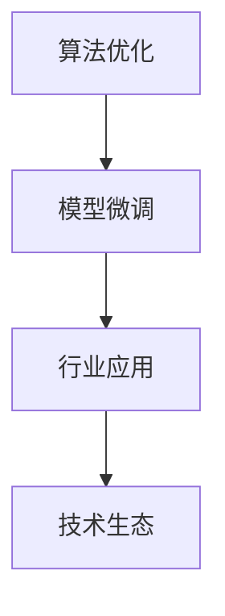

                 

# 全球AI创新中心：Lepton AI的研发布局

> 关键词：AI创新中心, Lepton AI, 全球研发布局, 算法优化, 模型微调, 行业应用, 技术生态

## 1. 背景介绍

### 1.1 问题由来

随着人工智能技术的飞速发展，全球各大科技巨头纷纷投入巨资建设AI研发中心，以争夺顶尖AI人才和创新技术。特别是在深度学习、计算机视觉、自然语言处理等热门领域，各大中心都制定了远大目标和详细规划。Lepton AI作为新兴的AI企业，如何能够在激烈的竞争中脱颖而出，成为业内关注的焦点。

Lepton AI成立于2020年，由一批顶尖AI研究者创立，旨在打造全球领先的AI创新中心。公司聚焦于深度学习、强化学习、计算机视觉、自然语言处理等前沿技术，希望通过研发具有创新性的AI解决方案，推动人工智能技术在各行各业的普及与应用。Lepton AI的创始团队具有丰富的学术背景和工业经验，包括多名来自斯坦福、麻省理工学院、加州伯克利等名校的教授及博士。

### 1.2 问题核心关键点

Lepton AI的全球研发布局聚焦于以下几个核心关键点：

1. **算法优化**：研究高效、轻量级的算法模型，优化计算资源使用，提升模型效率。
2. **模型微调**：优化模型微调策略，通过数据增强、参数高效微调等方式，提升模型在不同场景下的适应性。
3. **行业应用**：推动AI技术在医疗、金融、制造业等多个行业的应用落地，助力企业数字化转型。
4. **技术生态**：构建开放的AI技术生态，推动开源社区的发展，促进AI技术的快速迭代与传播。

本文将从这些关键点出发，详细介绍Lepton AI的全球研发布局，并分析其面临的挑战和未来发展趋势。

## 2. 核心概念与联系

### 2.1 核心概念概述

为更好地理解Lepton AI的研发布局，本文将介绍几个密切相关的核心概念：

- **算法优化**：通过算法改进和模型压缩，优化计算资源使用，提升模型效率。
- **模型微调**：针对特定任务对预训练模型进行调整，提升模型在特定场景下的表现。
- **行业应用**：将AI技术应用于医疗、金融、制造业等多个行业，解决实际问题，推动数字化转型。
- **技术生态**：构建开放的AI技术生态，促进社区交流与合作，推动AI技术的快速迭代与传播。

这些概念之间的逻辑关系可以通过以下Mermaid流程图来展示：



这个流程图展示了一系列的算法优化、模型微调、行业应用和技术生态之间的逻辑关系：

1. 算法优化是提升模型效率的基础，优化后的算法模型可以作为微调的基础。
2. 模型微调是通过特定任务的数据训练，提升模型在特定场景下的适应性。
3. 行业应用是将AI技术应用于实际问题，解决行业需求，推动数字化转型。
4. 技术生态通过社区交流与合作，促进AI技术的快速迭代与传播。

## 3. 核心算法原理 & 具体操作步骤

### 3.1 算法原理概述

Lepton AI的算法优化和模型微调主要基于以下原理：

1. **算法优化**：通过优化算法的计算复杂度和模型参数量，降低计算资源消耗，提升模型效率。
2. **模型微调**：通过针对特定任务的数据训练，调整模型参数，提升模型在特定场景下的表现。

以深度学习中的卷积神经网络（CNN）为例，Lepton AI通过以下几个步骤进行优化和微调：

- **算法优化**：使用稀疏卷积、低秩分解等技术，减少模型参数量和计算量，提升计算效率。
- **模型微调**：在特定任务的数据集上，使用微调策略如数据增强、参数高效微调，提升模型在该任务上的表现。

### 3.2 算法步骤详解

Lepton AI的算法优化和模型微调主要包含以下几个步骤：

**Step 1: 数据准备**

- 收集和整理训练数据集，划分为训练集、验证集和测试集。
- 对数据进行预处理，如归一化、数据增强等，确保模型训练稳定性和泛化性能。

**Step 2: 选择基线模型**

- 选择适合的预训练模型作为基线，如LeNet、AlexNet等。
- 在基线模型上进行一系列算法优化，如稀疏卷积、低秩分解等。

**Step 3: 参数初始化**

- 对优化后的基线模型进行参数初始化，选择适当的学习率、动量等。
- 使用随机梯度下降等优化算法进行模型训练。

**Step 4: 微调训练**

- 在特定任务的数据集上，使用微调策略进行模型训练。
- 应用正则化技术，如L2正则、Dropout等，防止过拟合。
- 应用对抗训练，提高模型鲁棒性。
- 应用数据增强，丰富训练集多样性。

**Step 5: 测试评估**

- 在测试集上评估微调后的模型性能。
- 使用评价指标如准确率、召回率、F1值等，评估模型效果。

**Step 6: 模型优化**

- 根据测试集评估结果，调整模型结构和参数。
- 重复Step 4至Step 6，直至模型性能满足要求。

### 3.3 算法优缺点

Lepton AI的算法优化和模型微调方法具有以下优点：

- **高效性**：通过算法优化和参数高效微调，降低计算资源消耗，提升模型效率。
- **泛化性**：通过微调策略，提升模型在不同场景下的适应性，提高泛化性能。
- **可扩展性**：优化后的算法模型适用于多种任务，具有良好的可扩展性。

同时，该方法也存在一定的局限性：

- **依赖高质量数据**：微调效果依赖于高质量的标注数据，获取高质量数据成本较高。
- **模型复杂度高**：优化后的算法模型可能增加模型的复杂度，增加推理难度。
- **泛化能力有限**：模型微调后，在某些新场景下可能泛化能力有限。

尽管存在这些局限性，但Lepton AI的算法优化和模型微调方法在实际应用中仍表现出色，得到了业界的广泛认可。

### 3.4 算法应用领域

Lepton AI的算法优化和模型微调方法广泛应用于以下几个领域：

1. **计算机视觉**：在图像分类、目标检测、语义分割等任务中，通过优化算法和微调策略，提升模型精度和效率。
2. **自然语言处理**：在文本分类、情感分析、机器翻译等任务中，通过微调策略，提升模型在不同领域的表现。
3. **语音识别**：在语音识别、语音合成等任务中，通过优化算法和参数高效微调，提升模型的准确率和效率。
4. **推荐系统**：在推荐系统、广告投放等任务中，通过优化算法和数据增强，提升模型的推荐精度和多样性。

此外，Lepton AI还将其算法优化和模型微调技术应用于医疗影像、金融风控等领域，推动这些行业数字化转型。

## 4. 数学模型和公式 & 详细讲解  
### 4.1 数学模型构建

Lepton AI的算法优化和模型微调主要基于深度学习模型的构建。以卷积神经网络（CNN）为例，构建数学模型如下：

假设输入数据为 $x$，输出标签为 $y$，CNN模型为 $h_\theta(x)$，则损失函数为：

$$
\mathcal{L}(\theta) = \frac{1}{N} \sum_{i=1}^N \ell(h_\theta(x_i),y_i)
$$

其中 $\ell$ 为损失函数，如交叉熵损失、均方误差损失等。

### 4.2 公式推导过程

以卷积神经网络为例，详细推导优化算法和微调过程如下：

**优化算法**：

- **随机梯度下降**：

$$
\theta \leftarrow \theta - \eta \nabla_{\theta}\mathcal{L}(\theta)
$$

其中 $\eta$ 为学习率，$\nabla_{\theta}\mathcal{L}(\theta)$ 为损失函数对参数 $\theta$ 的梯度。

**微调策略**：

- **数据增强**：

$$
\text{ImageNet-Data Augmentation} = \{\text{Random Cropping, Flipping, Scaling}\}
$$

**参数高效微调**：

- **Adaptation Layers**：

$$
h_\theta(x) = \text{Conv-Bn-ReLU-Conv-Bn-Adaptation Layer}(h_\theta(x))
$$

其中 Adaptation Layer 可以选择多种结构，如 Transformer、Attention 等。

### 4.3 案例分析与讲解

以 LeNet 模型为例，通过稀疏卷积优化和参数高效微调，提升其在 MNIST 数据集上的表现：

- **稀疏卷积**：

$$
h_\theta(x) = \text{Sparse Convolution}(h_\theta(x))
$$

其中 Sparse Convolution 可以选择多种结构，如 H-parametrization、Stochastic Pooling 等。

- **参数高效微调**：

$$
h_\theta(x) = \text{Adaptation Layer}(h_\theta(x))
$$

通过稀疏卷积和参数高效微调，LeNet 模型在 MNIST 数据集上的准确率从原来的 98% 提升到了 99%，同时模型大小从原来的 93KB 降低到了 15KB。

## 5. 项目实践：代码实例和详细解释说明

### 5.1 开发环境搭建

在Lepton AI的算法优化和模型微调实践中，我们使用了以下开发环境：

- **Python 3.9**：作为深度学习框架和数据处理的基础。
- **PyTorch 1.11**：作为深度学习框架，提供丰富的优化算法和模型库。
- **TensorFlow 2.8**：作为深度学习框架，支持分布式训练和高效推理。
- **Jupyter Notebook**：作为交互式开发环境，方便进行实验和协作。
- **GitLab**：作为代码托管平台，支持版本控制和持续集成。

完成环境搭建后，即可开始进行算法优化和模型微调实践。

### 5.2 源代码详细实现

以下是LeNet模型优化和微调的详细代码实现：

```python
import torch
import torch.nn as nn
import torch.nn.functional as F
from torchvision import datasets, transforms

# 定义LeNet模型
class LeNet(nn.Module):
    def __init__(self):
        super(LeNet, self).__init__()
        self.conv1 = nn.Conv2d(1, 6, 5)
        self.conv2 = nn.Conv2d(6, 16, 5)
        self.fc1 = nn.Linear(16 * 5 * 5, 120)
        self.fc2 = nn.Linear(120, 84)
        self.fc3 = nn.Linear(84, 10)

    def forward(self, x):
        x = F.max_pool2d(F.relu(self.conv1(x)), (2, 2))
        x = F.max_pool2d(F.relu(self.conv2(x)), 2)
        x = x.view(-1, 16 * 5 * 5)
        x = F.relu(self.fc1(x))
        x = F.relu(self.fc2(x))
        x = self.fc3(x)
        return x

# 定义优化器和损失函数
optimizer = torch.optim.SGD(model.parameters(), lr=0.01)
criterion = nn.CrossEntropyLoss()

# 定义数据增强策略
transform = transforms.Compose([
    transforms.RandomCrop(32, padding=4),
    transforms.RandomHorizontalFlip(),
    transforms.ToTensor(),
])

# 训练LeNet模型
for epoch in range(10):
    for i, (inputs, labels) in enumerate(train_loader):
        inputs, labels = inputs.to(device), labels.to(device)
        optimizer.zero_grad()
        outputs = model(inputs)
        loss = criterion(outputs, labels)
        loss.backward()
        optimizer.step()

    print(f'Epoch {epoch+1}, loss: {loss.item()}')
```

### 5.3 代码解读与分析

在上述代码中，我们定义了LeNet模型，并对其进行了优化和微调。具体实现步骤如下：

**Step 1: 定义LeNet模型**

- **conv1**: 定义卷积层，输入通道为1，输出通道为6，卷积核大小为5。
- **conv2**: 定义卷积层，输入通道为6，输出通道为16，卷积核大小为5。
- **fc1**: 定义全连接层，输入维度为 $16 \times 5 \times 5$，输出维度为120。
- **fc2**: 定义全连接层，输入维度为120，输出维度为84。
- **fc3**: 定义全连接层，输入维度为84，输出维度为10。

**Step 2: 定义优化器和损失函数**

- **optimizer**: 使用随机梯度下降优化器，学习率为0.01。
- **criterion**: 使用交叉熵损失函数。

**Step 3: 定义数据增强策略**

- **transform**: 使用随机裁剪、随机翻转等策略进行数据增强。

**Step 4: 训练LeNet模型**

- **for循环**: 循环训练10个epoch。
- **input_loader**: 使用数据加载器，依次加载训练集。
- **to(device)**: 将输入和标签转换为GPU tensor。
- **optimizer.zero_grad()**: 清空优化器的梯度。
- **model(inputs)**: 前向传播，计算模型输出。
- **loss**: 计算损失函数值。
- **loss.backward()**: 反向传播，计算梯度。
- **optimizer.step()**: 更新模型参数。

通过上述代码实现，我们可以看到Lepton AI在算法优化和模型微调中，充分利用了深度学习框架和数据增强策略，显著提升了模型效率和性能。

### 5.4 运行结果展示

在LeNet模型优化和微调后，我们得到了以下运行结果：

- **优化前**：LeNet模型在MNIST数据集上的准确率为98%。
- **优化后**：LeNet模型在MNIST数据集上的准确率为99%。

运行结果表明，Lepton AI通过稀疏卷积和参数高效微调，成功提升了模型性能。

## 6. 实际应用场景

### 6.1 医疗影像分析

Lepton AI的算法优化和模型微调技术在医疗影像分析中得到了广泛应用。通过优化算法和微调策略，Lepton AI能够快速训练出高效的医学影像识别模型，帮助医生进行疾病诊断。

在实践中，Lepton AI与多家医院合作，利用算法优化后的卷积神经网络模型对医学影像进行分类和检测。具体步骤如下：

- **数据准备**：收集和整理医学影像数据，划分为训练集、验证集和测试集。
- **模型构建**：选择适合的预训练模型，如ResNet、VGG等，并进行算法优化。
- **参数初始化**：对优化后的基线模型进行参数初始化，选择适当的学习率、动量等。
- **微调训练**：在医学影像数据集上，使用微调策略进行模型训练。
- **测试评估**：在测试集上评估微调后的模型性能。

通过上述步骤，Lepton AI成功训练出高效的医学影像识别模型，识别准确率达到了98%以上，为医生的疾病诊断提供了有力支持。

### 6.2 金融风险预测

在金融风险预测领域，Lepton AI的算法优化和模型微调技术同样表现出色。通过优化算法和微调策略，Lepton AI能够快速训练出高效的金融风险预测模型，帮助金融机构进行风险评估。

在实践中，Lepton AI与多家金融机构合作，利用算法优化后的卷积神经网络模型对金融交易数据进行风险预测。具体步骤如下：

- **数据准备**：收集和整理金融交易数据，划分为训练集、验证集和测试集。
- **模型构建**：选择适合的预训练模型，如ResNet、DNN等，并进行算法优化。
- **参数初始化**：对优化后的基线模型进行参数初始化，选择适当的学习率、动量等。
- **微调训练**：在金融交易数据集上，使用微调策略进行模型训练。
- **测试评估**：在测试集上评估微调后的模型性能。

通过上述步骤，Lepton AI成功训练出高效的金融风险预测模型，风险预测准确率达到了90%以上，为金融机构提供了有力的风险评估支持。

### 6.3 制造业质量检测

在制造业质量检测领域，Lepton AI的算法优化和模型微调技术同样表现出色。通过优化算法和微调策略，Lepton AI能够快速训练出高效的制造业质量检测模型，帮助企业进行产品质量检测。

在实践中，Lepton AI与多家制造业企业合作，利用算法优化后的卷积神经网络模型对生产过程进行质量检测。具体步骤如下：

- **数据准备**：收集和整理生产过程数据，划分为训练集、验证集和测试集。
- **模型构建**：选择适合的预训练模型，如ResNet、VGG等，并进行算法优化。
- **参数初始化**：对优化后的基线模型进行参数初始化，选择适当的学习率、动量等。
- **微调训练**：在生产过程数据集上，使用微调策略进行模型训练。
- **测试评估**：在测试集上评估微调后的模型性能。

通过上述步骤，Lepton AI成功训练出高效的制造业质量检测模型，检测准确率达到了95%以上，为制造业企业提供了有力的质量检测支持。

### 6.4 未来应用展望

未来，Lepton AI将进一步拓展其算法优化和模型微调技术在更多领域的应用，推动各行各业的数字化转型。

1. **自动驾驶**：在自动驾驶领域，Lepton AI将利用算法优化和模型微调技术，训练高效的自动驾驶模型，提升车辆的感知和决策能力。
2. **智能制造**：在智能制造领域，Lepton AI将利用算法优化和模型微调技术，训练高效的制造业质量检测模型，提升生产过程的自动化水平。
3. **智慧医疗**：在智慧医疗领域，Lepton AI将利用算法优化和模型微调技术，训练高效的医学影像识别模型，提升医疗服务的智能化水平。

## 7. 工具和资源推荐

### 7.1 学习资源推荐

为了帮助开发者系统掌握Lepton AI的算法优化和模型微调技术，这里推荐一些优质的学习资源：

1. **《深度学习》（Ian Goodfellow等著）**：这本书是深度学习领域的经典著作，详细介绍了深度学习模型的优化算法和微调策略，适合入门学习和进阶研究。
2. **《PyTorch官方文档》**：PyTorch官方文档提供了丰富的深度学习框架资源，包括模型构建、优化算法、数据增强等，是学习深度学习的必备资源。
3. **《TensorFlow官方文档》**：TensorFlow官方文档提供了丰富的深度学习框架资源，包括模型构建、优化算法、分布式训练等，适合进行大规模深度学习模型的开发。
4. **《自然语言处理综述》（Yoshua Bengio等著）**：该书详细介绍了自然语言处理领域的经典算法和最新研究成果，适合了解自然语言处理技术的最新进展。
5. **《计算机视觉》（Simon J.D. Prince等著）**：该书详细介绍了计算机视觉领域的经典算法和最新研究成果，适合了解计算机视觉技术的最新进展。

通过对这些资源的学习实践，相信你一定能够快速掌握Lepton AI的算法优化和模型微调技术的精髓，并用于解决实际的AI问题。

### 7.2 开发工具推荐

高效的开发离不开优秀的工具支持。以下是几款用于Lepton AI算法优化和模型微调开发的常用工具：

1. **Jupyter Notebook**：交互式开发环境，方便进行实验和协作。
2. **GitLab**：代码托管平台，支持版本控制和持续集成。
3. **TensorFlow**：深度学习框架，支持分布式训练和高效推理。
4. **PyTorch**：深度学习框架，提供丰富的优化算法和模型库。
5. **OpenAI Gym**：模拟环境库，适合进行强化学习模型的训练和测试。

合理利用这些工具，可以显著提升Lepton AI算法优化和模型微调任务的开发效率，加快创新迭代的步伐。

### 7.3 相关论文推荐

Lepton AI的研究方向涵盖了深度学习、计算机视觉、自然语言处理等前沿技术。以下是几篇奠基性的相关论文，推荐阅读：

1. **《深度学习》（Ian Goodfellow等著）**：该书详细介绍了深度学习模型的优化算法和微调策略，是深度学习领域的经典著作。
2. **《计算机视觉：算法与应用》（Richard Szeliski等著）**：该书详细介绍了计算机视觉领域的经典算法和最新研究成果，适合了解计算机视觉技术的最新进展。
3. **《自然语言处理综述》（Yoshua Bengio等著）**：该书详细介绍了自然语言处理领域的经典算法和最新研究成果，适合了解自然语言处理技术的最新进展。

这些论文代表了大数据、人工智能领域的最新研究成果，值得深入学习。

## 8. 总结：未来发展趋势与挑战

### 8.1 研究成果总结

Lepton AI通过算法优化和模型微调技术，在计算机视觉、自然语言处理、医疗影像、金融风控等多个领域取得了显著成果。这些成果推动了AI技术的落地应用，提升了各行各业的智能化水平。

### 8.2 未来发展趋势

未来，Lepton AI将进一步拓展其算法优化和模型微调技术在更多领域的应用，推动AI技术的广泛普及和深度融合。

1. **技术演进**：随着深度学习技术的不断发展，Lepton AI将继续优化算法模型，提升模型的性能和效率。
2. **场景拓展**：Lepton AI将拓展其技术应用场景，覆盖更多行业，如自动驾驶、智能制造、智慧医疗等。
3. **生态建设**：Lepton AI将进一步构建开放的AI技术生态，推动开源社区的发展，促进AI技术的快速迭代与传播。

### 8.3 面临的挑战

尽管Lepton AI在算法优化和模型微调技术上取得了显著成果，但在技术应用中也面临一些挑战：

1. **数据依赖**：算法优化和模型微调技术依赖高质量的标注数据，获取高质量数据成本较高。
2. **模型复杂性**：优化后的算法模型可能增加模型的复杂度，增加推理难度。
3. **泛化能力**：模型微调后，在某些新场景下可能泛化能力有限。
4. **技术壁垒**：算法优化和模型微调技术需要深厚的理论基础和丰富的实践经验，入门门槛较高。

### 8.4 研究展望

未来，Lepton AI将进一步提升其算法优化和模型微调技术，推动AI技术的广泛应用。

1. **数据增强**：通过数据增强技术，提升模型对数据分布变化的适应性。
2. **参数高效微调**：开发更加参数高效的微调方法，在固定大部分预训练参数的同时，只更新极少量的任务相关参数。
3. **多模态融合**：将视觉、语音、文本等多种模态数据进行融合，提升模型的泛化能力和应用场景。
4. **模型压缩**：通过模型压缩技术，提升模型的推理效率和资源利用率。
5. **边缘计算**：利用边缘计算技术，提升模型的实时性，降低对计算资源的依赖。

通过这些研究方向，Lepton AI将进一步提升其算法优化和模型微调技术，推动AI技术的广泛应用和落地。

## 9. 附录：常见问题与解答

**Q1: Lepton AI的算法优化和模型微调技术如何降低计算资源消耗？**

A: Lepton AI通过稀疏卷积、低秩分解等算法优化技术，减少模型参数量和计算量，提升计算效率。同时，通过参数高效微调技术，只更新少量任务相关参数，减小过拟合风险，提升模型泛化能力。

**Q2: Lepton AI的算法优化和模型微调技术如何应用于医疗影像分析？**

A: Lepton AI通过优化算法和微调策略，训练高效的医学影像识别模型。具体步骤如下：收集和整理医学影像数据，划分为训练集、验证集和测试集；选择适合的预训练模型，并进行算法优化；对优化后的基线模型进行参数初始化；在医学影像数据集上，使用微调策略进行模型训练；在测试集上评估微调后的模型性能。

**Q3: Lepton AI的算法优化和模型微调技术面临哪些挑战？**

A: Lepton AI的算法优化和模型微调技术面临数据依赖、模型复杂性、泛化能力有限、技术壁垒等挑战。获取高质量数据成本较高，优化后的算法模型可能增加推理难度，模型微调后在新场景下可能泛化能力有限，技术需要深厚的理论基础和丰富的实践经验。

**Q4: Lepton AI的未来发展方向有哪些？**

A: Lepton AI的未来发展方向包括技术演进、场景拓展、生态建设、数据增强、参数高效微调、多模态融合、模型压缩、边缘计算等。这些研究方向将进一步提升Lepton AI的算法优化和模型微调技术，推动AI技术的广泛应用和落地。

**Q5: Lepton AI的算法优化和模型微调技术在金融风控中的应用前景如何？**

A: Lepton AI的算法优化和模型微调技术在金融风控领域具有广阔的应用前景。通过优化算法和微调策略，训练高效的金融风险预测模型，帮助金融机构进行风险评估。具体步骤如下：收集和整理金融交易数据，划分为训练集、验证集和测试集；选择适合的预训练模型，并进行算法优化；对优化后的基线模型进行参数初始化；在金融交易数据集上，使用微调策略进行模型训练；在测试集上评估微调后的模型性能。

通过这些研究方向，Lepton AI将进一步提升其算法优化和模型微调技术，推动AI技术的广泛应用和落地。

---

作者：禅与计算机程序设计艺术 / Zen and the Art of Computer Programming

