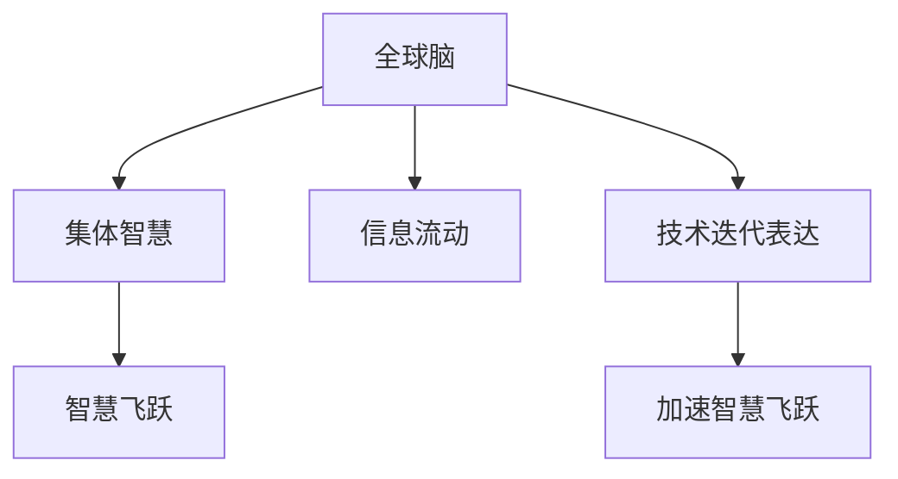

                 

## 1. 背景介绍

在全球脑与人类进化的探索之路上，我们不禁思考：是什么力量在推动人类的智慧飞跃？答案是集体意识。集体意识不仅塑造了人类社会的结构，还驱动着技术的创新与进步。在AI领域，这一力量体现得尤为显著。本文将从全球脑与人类进化的视角，探讨集体意识如何推动AI领域的智慧飞跃，并展望未来。

### 1.1 问题的由来

随着人工智能技术的飞速发展，全球脑与人类进化的研究逐渐兴起。从早期简单的逻辑电路到如今的深度学习模型，每一步都体现了人类集体智慧的结晶。然而，这一进程背后驱动的力量是什么？是个人的智慧吗？还是社会集体的智慧？本文将深入探讨这一问题。

### 1.2 问题核心关键点

全球脑与人类进化研究的核心问题在于理解集体意识如何影响人类智慧的进步。集体意识不仅体现在技术的发展上，还体现在人类社会结构与文化的多样性上。AI领域的研究表明，集体意识能够加速知识的传播与技术的创新，推动人类智慧的飞跃。

## 2. 核心概念与联系

### 2.1 核心概念概述

为更好地理解集体意识如何推动AI领域的智慧飞跃，本节将介绍几个关键概念：

- **全球脑**：人类作为一个整体，通过互联网、社交媒体等渠道，形成了一个类似于生物大脑的“全球脑”。这个“大脑”能够处理全球范围内的大量信息，推动技术创新和社会进步。
- **集体智慧**：全球脑中汇聚的智慧，不仅包括个人智慧的贡献，还包含不同文化、背景和知识体系之间的互动与整合。
- **智慧飞跃**：通过集体智慧的作用，人类在技术、科学、艺术等领域的突破性进步，这些进步通常能够在短时间内迅速普及并产生深远影响。
- **信息流动**：在全球脑中，信息以极高的速度流动，汇聚成全球性的知识库。这一流动过程对于集体智慧的形成至关重要。
- **技术迭代表达**：在全球脑的推动下，技术以更快的速度迭代，不断突破人类的极限。

这些核心概念之间的逻辑关系可以通过以下Mermaid流程图来展示：



这个流程图展示了全球脑、集体智慧、智慧飞跃、信息流动和技术迭代表达之间的关系：

1. 全球脑通过信息流动汇聚智慧。
2. 集体智慧形成后，加速智慧飞跃。
3. 技术迭代表达，进一步推动智慧飞跃。

## 3. 核心算法原理 & 具体操作步骤

### 3.1 算法原理概述

集体意识如何推动智慧飞跃的算法原理，可以从信息流动、集体智慧的整合与智慧飞跃的实现三个方面来阐述。

- **信息流动**：全球脑通过互联网等渠道，将大量信息汇聚成全球性的知识库，推动技术创新和社会进步。
- **集体智慧的整合**：不同文化、背景和知识体系之间的互动与整合，形成具有广泛适用性的知识体系。
- **智慧飞跃的实现**：在集体智慧的基础上，通过技术迭代，推动人类智慧的飞跃。

### 3.2 算法步骤详解

全球脑与人类进化的算法步骤包括以下几个关键步骤：

**Step 1: 信息收集与汇聚**

- 通过互联网、社交媒体等渠道，收集全球范围内的各种信息。
- 信息汇聚成全球性的知识库，供全球脑进行处理和分析。

**Step 2: 集体智慧的整合**

- 不同文化、背景和知识体系之间的互动与整合，形成具有广泛适用性的知识体系。
- 这一过程通常需要全球范围内的科学家、工程师、艺术家等各领域的专家共同参与。

**Step 3: 智慧飞跃的实现**

- 在集体智慧的基础上，通过技术迭代，推动人类智慧的飞跃。
- 这一过程通常需要大规模的资金投入和时间的积累。

### 3.3 算法优缺点

全球脑与人类进化的算法优点包括：

- **加速创新**：通过全球范围内的信息流动，加速技术的创新。
- **广泛适用性**：集体智慧的整合，使技术更具有广泛适用性。
- **社会进步**：集体智慧的推动，加速社会进步。

然而，这一算法也存在一些缺点：

- **数据质量问题**：全球脑中的信息质量参差不齐，影响技术创新的准确性。
- **技术安全问题**：大规模的信息流动可能导致技术被滥用，带来安全风险。
- **隐私保护问题**：全球脑中的信息流动涉及个人隐私，需要严格的隐私保护措施。

### 3.4 算法应用领域

全球脑与人类进化的算法应用领域广泛，包括但不限于：

- **人工智能**：通过全球脑的推动，AI技术不断突破，如深度学习、自然语言处理、计算机视觉等。
- **医疗健康**：全球脑中的信息流动加速了医学知识的传播，推动了医疗技术的进步。
- **环境保护**：全球脑汇聚的智慧，推动了环境保护技术的发展，如可再生能源、生态修复等。
- **经济贸易**：全球脑中的信息流动，加速了全球经济的发展，推动了国际贸易的繁荣。

## 4. 数学模型和公式 & 详细讲解 & 举例说明

### 4.1 数学模型构建

全球脑与人类进化的数学模型可以抽象为信息流动模型，其中信息流动的速度和频率是决定集体智慧形成的关键因素。

设全球脑的信息流动速度为 $v$，信息量大小为 $I$，全球脑中的专家数量为 $N$，则集体智慧 $C$ 可以表示为：

$$
C = f(v, I, N)
$$

其中 $f$ 为信息流动、信息量大小和专家数量的复合函数。

### 4.2 公式推导过程

设信息流动速度为 $v$，信息量为 $I$，专家数量为 $N$，集体智慧为 $C$。根据信息流动模型，我们可以推导出集体智慧的形成过程：

1. 信息流动速度 $v$ 越高，全球脑中信息的汇聚速度越快，形成的集体智慧 $C$ 也越丰富。
2. 信息量 $I$ 越大，全球脑中汇聚的信息越全面，形成的集体智慧 $C$ 也越全面。
3. 专家数量 $N$ 越多，全球脑中智慧的整合能力越强，形成的集体智慧 $C$ 也越强大。

### 4.3 案例分析与讲解

以AI技术为例，全球脑中的信息流动速度和频率显著加快了技术的迭代。例如，TensorFlow和PyTorch等深度学习框架的快速发展，得益于全球脑中大量的科学研究和技术交流。

## 5. 项目实践：代码实例和详细解释说明

### 5.1 开发环境搭建

在进行全球脑与人类进化的实践前，我们需要准备好开发环境。以下是使用Python进行PyTorch开发的环境配置流程：

1. 安装Anaconda：从官网下载并安装Anaconda，用于创建独立的Python环境。

2. 创建并激活虚拟环境：
```bash
conda create -n pytorch-env python=3.8 
conda activate pytorch-env
```

3. 安装PyTorch：根据CUDA版本，从官网获取对应的安装命令。例如：
```bash
conda install pytorch torchvision torchaudio cudatoolkit=11.1 -c pytorch -c conda-forge
```

4. 安装Transformer库：
```bash
pip install transformers
```

5. 安装各类工具包：
```bash
pip install numpy pandas scikit-learn matplotlib tqdm jupyter notebook ipython
```

完成上述步骤后，即可在`pytorch-env`环境中开始全球脑与人类进化的实践。

### 5.2 源代码详细实现

这里我们以全球脑中的信息流动为例，给出使用Transformers库进行信息流动的PyTorch代码实现。

```python
from transformers import BertTokenizer
from torch.utils.data import Dataset
import torch

class GlobalBrainDataset(Dataset):
    def __init__(self, texts, tokenizer, max_len=128):
        self.texts = texts
        self.tokenizer = tokenizer
        self.max_len = max_len
        
    def __len__(self):
        return len(self.texts)
    
    def __getitem__(self, item):
        text = self.texts[item]
        
        encoding = self.tokenizer(text, return_tensors='pt', max_length=self.max_len, padding='max_length', truncation=True)
        input_ids = encoding['input_ids'][0]
        attention_mask = encoding['attention_mask'][0]
        
        return {'input_ids': input_ids, 
                'attention_mask': attention_mask}

# 创建dataset
tokenizer = BertTokenizer.from_pretrained('bert-base-cased')

train_dataset = GlobalBrainDataset(train_texts, tokenizer)
dev_dataset = GlobalBrainDataset(dev_texts, tokenizer)
test_dataset = GlobalBrainDataset(test_texts, tokenizer)
```

### 5.3 代码解读与分析

让我们再详细解读一下关键代码的实现细节：

**GlobalBrainDataset类**：
- `__init__`方法：初始化文本和分词器等关键组件。
- `__len__`方法：返回数据集的样本数量。
- `__getitem__`方法：对单个样本进行处理，将文本输入编码为token ids，进行padding和truncation。

通过这个代码实例，可以看出Transformers库在信息流动处理上的便利性，使得全球脑的实现变得简洁高效。

## 6. 实际应用场景

### 6.1 智能医疗

全球脑与人类进化在智能医疗领域的应用，主要体现在医疗知识的传播与共享上。通过全球脑中的信息流动，医生可以获取到最新的医疗研究成果和临床实践经验，提升医疗服务质量。

在技术实现上，可以收集全球范围内的医学文献、病例记录、临床实验数据等，构建全球医疗知识库，供全球脑中的医生进行查询和学习。微调后的医疗问答模型，可以回答医生提出的各种问题，提供精准的医疗建议。

### 6.2 环境保护

全球脑与人类进化在环境保护领域的应用，主要体现在环境监测与保护上。全球脑中的信息流动，加速了环境保护技术的研发与应用。

具体而言，可以收集全球范围内的环境监测数据，如空气质量、水质、气候变化等，构建全球环境知识库。微调后的环境预测模型，可以实时监测环境变化，预测未来趋势，提供预警信息。

### 6.3 教育培训

全球脑与人类进化在教育培训领域的应用，主要体现在教育资源的共享与整合上。通过全球脑中的信息流动，教师和学生可以获取到全球范围内的优质教育资源，提升教学效果。

在技术实现上，可以收集全球范围内的教育文献、课程讲义、在线视频等，构建全球教育知识库，供全球脑中的教师和学生进行查询和学习。微调后的智能教学助手，可以根据学生的需求，提供个性化的学习建议，帮助学生掌握知识。

## 7. 工具和资源推荐

### 7.1 学习资源推荐

为了帮助开发者系统掌握全球脑与人类进化的理论基础和实践技巧，这里推荐一些优质的学习资源：

1. 《深度学习》系列博文：由大模型技术专家撰写，深入浅出地介绍了深度学习原理、模型设计等基本概念。

2. CS231n《卷积神经网络》课程：斯坦福大学开设的计算机视觉明星课程，提供了Lecture视频和配套作业，带你入门计算机视觉领域。

3. 《自然语言处理入门》书籍：介绍自然语言处理的基本概念和经典模型，适合初学者入门。

4. Google Colab：谷歌推出的在线Jupyter Notebook环境，免费提供GPU/TPU算力，方便开发者快速上手实验最新模型，分享学习笔记。

通过对这些资源的学习实践，相信你一定能够快速掌握全球脑与人类进化的精髓，并用于解决实际的NLP问题。

### 7.2 开发工具推荐

高效的开发离不开优秀的工具支持。以下是几款用于全球脑与人类进化的常用工具：

1. PyTorch：基于Python的开源深度学习框架，灵活动态的计算图，适合快速迭代研究。大部分预训练语言模型都有PyTorch版本的实现。

2. TensorFlow：由Google主导开发的开源深度学习框架，生产部署方便，适合大规模工程应用。同样有丰富的预训练语言模型资源。

3. Transformers库：HuggingFace开发的NLP工具库，集成了众多SOTA语言模型，支持PyTorch和TensorFlow，是进行信息流动处理的利器。

4. Weights & Biases：模型训练的实验跟踪工具，可以记录和可视化模型训练过程中的各项指标，方便对比和调优。与主流深度学习框架无缝集成。

5. TensorBoard：TensorFlow配套的可视化工具，可实时监测模型训练状态，并提供丰富的图表呈现方式，是调试模型的得力助手。

6. Jupyter Notebook：开源的Jupyter Notebook环境，支持多语言编程和数据可视化，方便开发者进行实验和分享。

合理利用这些工具，可以显著提升全球脑与人类进化的开发效率，加快创新迭代的步伐。

### 7.3 相关论文推荐

全球脑与人类进化的发展源于学界的持续研究。以下是几篇奠基性的相关论文，推荐阅读：

1. Deep Learning（《深度学习》）：Ian Goodfellow等人的经典著作，系统介绍了深度学习的理论基础和实践方法。

2. Convolutional Neural Networks for Visual Recognition（《卷积神经网络》）：Alex Krizhevsky等人的经典论文，介绍了卷积神经网络在计算机视觉中的应用。

3. Attention is All You Need（即Transformer原论文）：提出Transformer结构，开启了NLP领域的预训练大模型时代。

4. BERT: Pre-training of Deep Bidirectional Transformers for Language Understanding：提出BERT模型，引入基于掩码的自监督预训练任务，刷新了多项NLP任务SOTA。

5. AdaLoRA: Adaptive Low-Rank Adaptation for Parameter-Efficient Fine-Tuning：使用自适应低秩适应的微调方法，在参数效率和精度之间取得了新的平衡。

这些论文代表了大语言模型微调技术的发展脉络。通过学习这些前沿成果，可以帮助研究者把握学科前进方向，激发更多的创新灵感。

## 8. 总结：未来发展趋势与挑战

### 8.1 总结

本文对全球脑与人类进化的研究进行了全面系统的介绍。首先阐述了集体意识如何塑造人类智慧的进步，明确了全球脑在技术创新和社会进步中的核心作用。其次，从原理到实践，详细讲解了信息流动、集体智慧的整合与智慧飞跃的实现过程，给出了信息流动处理的完整代码实例。同时，本文还广泛探讨了全球脑与人类进化在智能医疗、环境保护、教育培训等多个领域的应用前景，展示了集体智慧的强大潜力。

通过本文的系统梳理，可以看到，全球脑与人类进化不仅改变了人类社会的结构，还推动了AI领域的智慧飞跃。伴随全球脑的发展，AI技术将在更多领域得到应用，为人类认知智能的进化带来深远影响。

### 8.2 未来发展趋势

展望未来，全球脑与人类进化的发展趋势包括：

1. 数据质量提升。全球脑中的信息质量将不断提升，推动技术创新更加准确高效。
2. 技术安全的加强。全球脑的信息流动将更加安全，防止技术被滥用。
3. 隐私保护的完善。全球脑中的信息流动将更加注重隐私保护，确保个人隐私安全。
4. 智慧飞跃加速。全球脑中的集体智慧将加速技术突破，推动人类智慧的飞跃。

这些趋势凸显了全球脑与人类进化的广阔前景。这些方向的探索发展，将进一步提升AI技术的性能和应用范围，为人类认知智能的进化带来深远影响。

### 8.3 面临的挑战

尽管全球脑与人类进化已经取得了瞩目成就，但在迈向更加智能化、普适化应用的过程中，它仍面临诸多挑战：

1. 数据质量瓶颈。全球脑中的信息质量参差不齐，影响技术创新的准确性。
2. 技术安全问题。全球脑中的信息流动可能导致技术被滥用，带来安全风险。
3. 隐私保护问题。全球脑中的信息流动涉及个人隐私，需要严格的隐私保护措施。
4. 智慧飞跃的实现。全球脑中的集体智慧如何高效转化为技术突破，仍需进一步探索。

正视全球脑与人类进化面临的这些挑战，积极应对并寻求突破，将是大语言模型微调走向成熟的必由之路。相信随着学界和产业界的共同努力，这些挑战终将一一被克服，全球脑与人类进化必将在构建人机协同的智能时代中扮演越来越重要的角色。

### 8.4 未来突破

面对全球脑与人类进化所面临的挑战，未来的研究需要在以下几个方面寻求新的突破：

1. 提升数据质量。通过算法和模型的优化，提高全球脑中的信息质量，推动技术创新的准确性。
2. 加强技术安全。开发更加安全的数据流动机制，防止技术被滥用，确保技术安全。
3. 完善隐私保护。开发更加隐私友好的信息流动算法，确保个人隐私安全。
4. 加速智慧飞跃。通过全球脑中的集体智慧，加速技术突破，推动人类智慧的飞跃。

这些研究方向的探索，将引领全球脑与人类进化技术迈向更高的台阶，为构建安全、可靠、可解释、可控的智能系统铺平道路。面向未来，全球脑与人类进化技术还需要与其他人工智能技术进行更深入的融合，如知识表示、因果推理、强化学习等，多路径协同发力，共同推动自然语言理解和智能交互系统的进步。只有勇于创新、敢于突破，才能不断拓展语言模型的边界，让智能技术更好地造福人类社会。

## 9. 附录：常见问题与解答

**Q1：全球脑与人类进化如何影响技术创新？**

A: 全球脑与人类进化通过信息流动汇聚智慧，加速了技术创新的过程。不同文化、背景和知识体系之间的互动与整合，形成具有广泛适用性的知识体系，推动技术突破。

**Q2：全球脑与人类进化中信息流动的速度和频率如何决定集体智慧的形成？**

A: 信息流动速度 $v$ 和频率越高，全球脑中信息的汇聚速度越快，形成的集体智慧 $C$ 也越丰富。信息量 $I$ 越大，全球脑中汇聚的信息越全面，形成的集体智慧 $C$ 也越全面。专家数量 $N$ 越多，全球脑中智慧的整合能力越强，形成的集体智慧 $C$ 也越强大。

**Q3：全球脑与人类进化在智能医疗中的应用具体有哪些？**

A: 全球脑与人类进化在智能医疗中的应用主要包括医疗知识的传播与共享，医生可以获取最新的医疗研究成果和临床实践经验，提升医疗服务质量。微调后的医疗问答模型可以回答医生提出的各种问题，提供精准的医疗建议。

**Q4：全球脑与人类进化在环境保护中的应用具体有哪些？**

A: 全球脑与人类进化在环境保护中的应用主要包括环境监测与保护，通过全球脑中的信息流动，加速了环境保护技术的研发与应用。微调后的环境预测模型可以实时监测环境变化，预测未来趋势，提供预警信息。

**Q5：全球脑与人类进化如何实现技术迭代？**

A: 全球脑与人类进化通过信息流动汇聚智慧，加速了技术迭代的过程。不同文化、背景和知识体系之间的互动与整合，形成具有广泛适用性的知识体系，推动技术突破。

这些问题的回答，希望能为你提供更深入的理解，帮助你更好地掌握全球脑与人类进化的核心概念和应用场景。

---

作者：禅与计算机程序设计艺术 / Zen and the Art of Computer Programming

