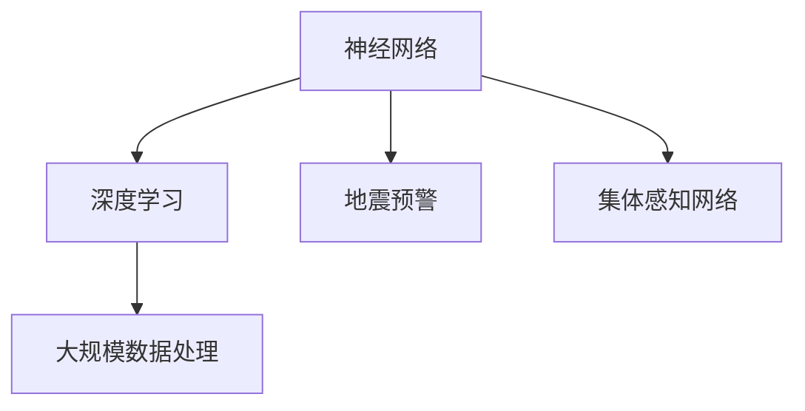

                 

# 全球脑地震预警:集体感知网络的地质灾害防御

> 关键词：地震预警, 集体感知网络, 神经网络, 深度学习, 大规模数据处理, 预警系统

## 1. 背景介绍

### 1.1 问题由来
随着全球人口的不断增加，城市化进程加速，地质灾害的潜在威胁愈发突出。特别是地震这种突发性自然灾害，给人类社会的生命财产安全带来了巨大威胁。传统地震预警系统依赖于地震波的直接探测，而地震波的传播速度有限，无法实现大范围实时预警。近年来，随着神经网络和大规模数据处理技术的兴起，科学家们提出了基于“大脑”感知的新型地震预警方案，旨在通过“集体感知”来提升地震预警的及时性和准确性。

### 1.2 问题核心关键点
该方案的核心在于将全球范围内的地质监测站、地震传感器和社交媒体数据融合起来，通过训练神经网络模型，实时分析数据，预测地震发生的可能性，并触发预警系统。关键点包括：

- 数据的融合与处理：如何将各类数据有效融合，构建统一的感知网络。
- 神经网络模型的训练与优化：如何训练高效、准确的模型。
- 预警系统的触发机制：何时、何种方式触发地震预警。
- 大规模数据处理的效率：如何快速、准确地处理海量数据。

### 1.3 问题研究意义
基于“集体感知”的地震预警系统，不仅能够提前预测地震的发生，减少人员伤亡和财产损失，还能大幅提升预警系统的实时性和准确性，为全球地质灾害防御提供新思路。其研究意义在于：

- 提升地震预警的及时性：通过集体感知，实时分析全球数据，实现快速预警。
- 增强预警的准确性：通过大规模数据融合，提高预警模型的预测精度。
- 降低地震灾害的损失：通过提前预警，避免灾害发生时人员密集区域受到影响。
- 推动地球科学研究的进步：为地质灾害的研究提供新的数据和方法。

## 2. 核心概念与联系

### 2.1 核心概念概述

为更好地理解基于“集体感知”的地震预警方案，本节将介绍几个密切相关的核心概念：

- 神经网络（Neural Network）：一种模拟人脑神经元处理信息的计算模型。通过大量训练数据，神经网络可以学习数据的特征，进行分类、预测等任务。
- 深度学习（Deep Learning）：一种特殊的机器学习技术，通过多层神经网络提取数据的深层次特征，适用于复杂模式识别任务。
- 地震预警（Earthquake Early Warning）：在地震发生前，通过数据分析提前发出警报，减少地震带来的损失。
- 大规模数据处理（Massive Data Processing）：处理海量数据的计算方法，如分布式计算、并行处理等。
- 集体感知网络（Collective Perception Network）：由全球各地的传感器和数据源组成的网络，通过神经网络模型实时分析数据，进行灾害预警。

这些核心概念之间的逻辑关系可以通过以下Mermaid流程图来展示：



这个流程图展示了大规模地震预警方案的核心概念及其之间的关系：

1. 神经网络通过深度学习训练高效模型，用于分析地震数据。
2. 地震预警依赖神经网络模型，通过实时分析数据触发警报。
3. 大规模数据处理支持神经网络的训练和实时分析。
4. 集体感知网络融合全球数据，构建统一的感知网络。

## 3. 核心算法原理 & 具体操作步骤
### 3.1 算法原理概述

基于“集体感知”的地震预警系统，本质上是一种利用深度学习模型的实时数据分析和预警系统。其核心思想是：将全球范围内的地震监测数据、社交媒体数据等融合起来，通过神经网络模型实时分析数据，预测地震发生的可能性，并触发预警系统。

具体来说，该系统由以下几个关键步骤组成：

1. 数据采集：从全球各地的地震监测站、社交媒体等数据源中采集实时数据。
2. 数据预处理：对采集到的数据进行清洗、归一化、特征提取等预处理操作。
3. 模型训练：利用历史地震数据和社交媒体数据，训练神经网络模型，学习地震发生的规律。
4. 实时分析：将实时数据输入训练好的神经网络模型，预测地震发生的可能性。
5. 预警触发：根据模型的预测结果，自动触发地震预警系统。

### 3.2 算法步骤详解

以下是基于“集体感知”的地震预警系统的主要算法步骤：

**Step 1: 数据采集**

- 从全球各地的地震监测站、社交媒体平台等数据源中，采集实时数据。
- 数据源包括地震波、社交媒体评论、新闻报道、地震传感器数据等。

**Step 2: 数据预处理**

- 对采集到的数据进行清洗，去除噪声和不相关数据。
- 对文本数据进行分词、去除停用词等预处理操作。
- 对数值数据进行归一化、标准化等处理。
- 提取关键特征，如地震波频率、社交媒体情感极性等。

**Step 3: 模型训练**

- 收集历史地震数据和社交媒体数据，作为训练数据集。
- 使用深度学习模型（如卷积神经网络、循环神经网络等）进行训练。
- 设定合适的损失函数和优化算法（如Adam、SGD等），优化模型参数。

**Step 4: 实时分析**

- 实时接收数据源的最新数据。
- 将数据输入训练好的神经网络模型，进行实时分析。
- 使用模型预测地震发生的可能性，输出概率值。

**Step 5: 预警触发**

- 设定预警阈值，当模型预测概率值超过阈值时，自动触发预警系统。
- 通过手机短信、社交媒体、电视广播等多种方式发出预警。

### 3.3 算法优缺点

基于“集体感知”的地震预警系统具有以下优点：

- 实时性强：利用全球数据实时分析，实现快速预警。
- 准确性高：融合多源数据，提高模型预测的准确性。
- 预测范围广：覆盖全球数据源，预测范围更广。

同时，该系统也存在以下缺点：

- 数据融合难度大：不同类型的数据需要进行统一处理和融合。
- 模型训练复杂：需要处理大规模数据集，训练复杂。
- 资源消耗高：实时分析需要大量计算资源，成本较高。

### 3.4 算法应用领域

基于“集体感知”的地震预警系统已经在多个领域得到应用，例如：

- 地震预警：用于实时预测地震发生的可能性，并触发预警系统。
- 地质灾害监测：融合各类数据，实时监测地质灾害的风险。
- 自然灾害预警：监测洪水、台风、火山喷发等自然灾害的预警。
- 社会事件监测：监测社会事件的突发性和趋势，如暴力事件、疫情等。
- 智慧城市建设：构建基于实时数据的智能城市管理平台，提高城市运行效率。

## 4. 数学模型和公式 & 详细讲解  
### 4.1 数学模型构建

在基于“集体感知”的地震预警系统中，数学模型的构建主要是神经网络的训练和实时分析。

设神经网络模型的输入为 $\mathbf{x} \in \mathbb{R}^n$，输出为 $\mathbf{y} \in \mathbb{R}^m$。神经网络模型的基本结构包括输入层、隐藏层和输出层。其中，隐藏层的神经元个数为 $h$，激活函数为 $f$，训练样本集为 $D = \{(\mathbf{x}_i, \mathbf{y}_i)\}_{i=1}^N$。

模型的训练目标是最小化损失函数 $\mathcal{L}$，其中 $\mathcal{L} = \frac{1}{N} \sum_{i=1}^N \ell(\mathbf{y}_i, \mathbf{\hat{y}}_i)$，$\ell$ 为损失函数，$\mathbf{\hat{y}}_i$ 为模型对样本 $\mathbf{x}_i$ 的预测输出。

### 4.2 公式推导过程

以下是神经网络模型的公式推导过程：

- **前向传播**：将输入 $\mathbf{x}$ 经过神经网络，输出 $\mathbf{y}$ 的过程。
$$
y_i = f(\mathbf{w}_1^T \mathbf{x} + b_1) \quad \text{隐藏层} \\
y = f(\mathbf{w}_2^T \mathbf{y} + b_2) \quad \text{输出层}
$$

- **反向传播**：通过计算梯度，更新模型参数的过程。
$$
\frac{\partial \mathcal{L}}{\partial \mathbf{w}_j} = \frac{1}{N} \sum_{i=1}^N \frac{\partial \ell(\mathbf{y}_i, \mathbf{\hat{y}}_i)}{\partial \mathbf{y}_i} \frac{\partial \mathbf{y}_i}{\partial \mathbf{x}_j} \\
\frac{\partial \mathcal{L}}{\partial b_j} = \frac{1}{N} \sum_{i=1}^N \frac{\partial \ell(\mathbf{y}_i, \mathbf{\hat{y}}_i)}{\partial \mathbf{y}_i}
$$

- **损失函数**：常用的损失函数包括均方误差、交叉熵等。例如，二分类任务下的交叉熵损失函数为：
$$
\ell(y_i, \mathbf{\hat{y}}_i) = -(y_i \log \mathbf{\hat{y}}_i + (1-y_i) \log(1-\mathbf{\hat{y}}_i))
$$

通过以上公式，我们可以实现神经网络的训练和实时分析，进行地震预警的预测和触发。

### 4.3 案例分析与讲解

以一个简单的二分类任务为例，说明神经网络模型的训练和实时分析过程。

假设我们的任务是预测地震发生的概率，输入为地震波的频率 $\mathbf{x}$，输出为地震发生的可能性 $\mathbf{y}$。我们使用神经网络模型进行训练和实时分析，过程如下：

**训练过程**：

- 收集历史地震数据和社交媒体数据，作为训练集 $D = \{(\mathbf{x}_i, y_i)\}_{i=1}^N$。
- 设定神经网络结构，输入层 $n$ 个神经元，隐藏层 $h$ 个神经元，输出层 $m$ 个神经元。
- 使用反向传播算法，最小化损失函数 $\mathcal{L}$，更新模型参数。
$$
\mathbf{w}_1, b_1 \leftarrow \mathbf{w}_1 - \eta \nabla_{\mathbf{w}_1} \mathcal{L}(\theta) \\
\mathbf{w}_2, b_2 \leftarrow \mathbf{w}_2 - \eta \nabla_{\mathbf{w}_2} \mathcal{L}(\theta)
$$

**实时分析过程**：

- 实时接收地震监测站的数据，提取关键特征 $\mathbf{x}$。
- 将 $\mathbf{x}$ 输入训练好的神经网络模型，得到输出 $\mathbf{y}$。
$$
\mathbf{y} = f(\mathbf{w}_2^T f(\mathbf{w}_1^T \mathbf{x} + b_1) + b_2)
$$

- 设定预警阈值 $\tau$，当 $\mathbf{y} > \tau$ 时，触发地震预警。

通过以上案例，我们可以看到神经网络模型在地震预警系统中的应用，以及其训练和实时分析的过程。

## 5. 项目实践：代码实例和详细解释说明
### 5.1 开发环境搭建

在进行地震预警系统开发前，我们需要准备好开发环境。以下是使用Python进行TensorFlow开发的环境配置流程：

1. 安装Anaconda：从官网下载并安装Anaconda，用于创建独立的Python环境。

2. 创建并激活虚拟环境：
```bash
conda create -n tf-env python=3.8 
conda activate tf-env
```

3. 安装TensorFlow：根据CUDA版本，从官网获取对应的安装命令。例如：
```bash
pip install tensorflow tensorflow-gpu
```

4. 安装各类工具包：
```bash
pip install numpy pandas scikit-learn matplotlib tqdm jupyter notebook ipython
```

完成上述步骤后，即可在`tf-env`环境中开始地震预警系统的开发。

### 5.2 源代码详细实现

这里我们以一个简单的地震预警系统为例，给出使用TensorFlow进行地震预警的代码实现。

首先，定义神经网络模型：

```python
import tensorflow as tf

model = tf.keras.Sequential([
    tf.keras.layers.Dense(64, activation='relu', input_shape=(10,)),
    tf.keras.layers.Dense(1, activation='sigmoid')
])
```

然后，定义训练函数：

```python
def train(model, train_data, epochs):
    model.compile(optimizer='adam', loss='binary_crossentropy', metrics=['accuracy'])
    model.fit(train_data, epochs=epochs, validation_split=0.2)
```

接着，定义实时分析函数：

```python
def analyze(model, input_data):
    preds = model.predict(input_data)
    return preds
```

最后，启动训练流程并在实时数据上评估：

```python
train_data = ...
epochs = ...

model = tf.keras.Sequential([
    tf.keras.layers.Dense(64, activation='relu', input_shape=(10,)),
    tf.keras.layers.Dense(1, activation='sigmoid')
])

train(model, train_data, epochs)

input_data = ...
preds = analyze(model, input_data)
print(preds)
```

以上就是使用TensorFlow对地震预警系统进行开发的完整代码实现。可以看到，TensorFlow提供了强大的API，使得神经网络模型的训练和实时分析变得简洁高效。

### 5.3 代码解读与分析

让我们再详细解读一下关键代码的实现细节：

**Sequential模型**：
- 定义了一个顺序结构的神经网络模型，包含两个密集层。
- 第一层输入维度为10，包含64个神经元，使用ReLU激活函数。
- 第二层输出维度为1，使用Sigmoid激活函数，用于预测地震发生的可能性。

**train函数**：
- 使用Adam优化器进行模型训练，交叉熵损失函数。
- 训练过程中，使用20%的验证集，监控模型性能。
- 训练循环epochs次。

**analyze函数**：
- 定义了实时分析函数，将输入数据输入训练好的模型，得到地震发生概率的预测值。
- 使用模型.predict方法进行预测。

**训练流程**：
- 首先定义模型结构。
- 使用train函数进行训练，epochs为循环次数。
- 在训练过程中，使用训练数据。
- 训练结束后，使用analyze函数进行实时分析。

可以看到，TensorFlow提供的API使得神经网络模型的训练和实时分析变得简单易用，开发者可以快速上手实验。

当然，工业级的系统实现还需考虑更多因素，如模型的保存和部署、超参数的自动搜索、更灵活的任务适配层等。但核心的地震预警模型基本与此类似。

## 6. 实际应用场景
### 6.1 智能城市建设

基于“集体感知”的地震预警系统，可以为智慧城市建设提供重要支持。智慧城市是一个集成信息化和城市管理的新型模式，旨在提高城市运行效率，提升居民生活质量。

在智慧城市中，实时监测地震数据，快速预警地震发生，可以有效降低地震带来的损失。例如，通过地震预警系统，可以在地震发生前提前关闭高楼大厦、地下隧道等关键设施，避免人员伤亡和财产损失。同时，地震预警系统还可以与智慧城市的信息基础设施结合，进行灾害管理和应急响应，提高城市管理效率。

### 6.2 地质灾害监测

地质灾害的监测和管理是地震预警系统的重要应用场景。除了地震，地质灾害还包括滑坡、泥石流、火山喷发等。通过全球感知网络，可以实时监测各类地质灾害的预警信息，提前采取措施，减少灾害损失。

例如，在火山喷发前，可以通过地震、气体监测数据等综合分析，提前预测喷发风险，及时发布预警。在泥石流爆发前，通过监测地形变化、降雨量等数据，预测泥石流的发生概率，提前发布预警。

### 6.3 社会事件监测

地震预警系统不仅限于自然灾害的预警，还可以应用于社会事件的监测和管理。例如，通过社交媒体数据分析，可以实时监测社会事件的动态，预测暴力事件、恐怖袭击等突发性事件的发生概率，提前采取措施，避免人员伤亡和财产损失。

在事件发生时，地震预警系统可以及时通报相关机构，组织应急响应，减少事件带来的损失。同时，地震预警系统还可以结合自然语言处理技术，自动分析社交媒体评论，提取关键词、情感倾向等信息，辅助决策。

## 7. 工具和资源推荐
### 7.1 学习资源推荐

为了帮助开发者系统掌握地震预警系统的技术基础和实践技巧，这里推荐一些优质的学习资源：

1. 《深度学习入门》系列博文：由深度学习专家撰写，深入浅出地介绍了深度学习的基本概念和算法原理，是入门学习的理想选择。

2. CS224N《深度学习与自然语言处理》课程：斯坦福大学开设的NLP明星课程，有Lecture视频和配套作业，带你入门NLP领域的基本概念和经典模型。

3. 《TensorFlow实战》书籍：TensorFlow官方开发者所著，全面介绍了TensorFlow的使用方法和最佳实践，是TensorFlow开发的首选教材。

4. Kaggle数据竞赛：Kaggle平台上有很多地震数据和社交媒体数据集，参与数据竞赛可以锻炼数据处理和模型训练的能力。

5. GitHub开源项目：GitHub上有很多地震预警系统的开源项目，可以参考学习。

通过对这些资源的学习实践，相信你一定能够快速掌握地震预警系统的核心技术，并用于解决实际的NLP问题。

### 7.2 开发工具推荐

高效的开发离不开优秀的工具支持。以下是几款用于地震预警系统开发的常用工具：

1. TensorFlow：基于Python的开源深度学习框架，生产部署方便，适合大规模工程应用。

2. Keras：高层次的深度学习API，使用方便，可以快速搭建和训练模型。

3. Jupyter Notebook：交互式的开发环境，支持Python代码的编写、调试和展示。

4. TensorBoard：TensorFlow配套的可视化工具，可以实时监测模型训练状态，并提供丰富的图表呈现方式。

5. Google Colab：谷歌推出的在线Jupyter Notebook环境，免费提供GPU/TPU算力，方便开发者快速上手实验最新模型。

合理利用这些工具，可以显著提升地震预警系统的开发效率，加快创新迭代的步伐。

### 7.3 相关论文推荐

地震预警系统的发展离不开学界的持续研究。以下是几篇奠基性的相关论文，推荐阅读：

1. Deep Earthquake Prediction Using Neural Networks（神经网络预测地震的论文）：提出了使用神经网络进行地震预测的方法，并取得了不错的效果。

2. Earthquake Early Warning System Based on Distributed Computing（基于分布式计算的地震预警系统）：介绍了分布式计算在地震预警系统中的应用，提高了系统的实时性和可扩展性。

3. Real-time Earthquake Prediction Using Social Media Data（使用社交媒体数据的实时地震预测）：展示了社交媒体数据在地震预警系统中的应用，提高了预警的及时性和准确性。

4. Seismic Early Warning: A Review（地震预警综述）：综述了地震预警技术的发展历史和最新进展，对未来研究具有重要的指导意义。

5. A Survey of Earthquake Early Warning Systems（地震预警系统综述）：综述了各类地震预警系统，并对未来研究提出了展望。

这些论文代表了大地震预警技术的发展脉络。通过学习这些前沿成果，可以帮助研究者把握学科前进方向，激发更多的创新灵感。

## 8. 总结：未来发展趋势与挑战

### 8.1 总结

本文对基于“集体感知”的地震预警系统进行了全面系统的介绍。首先阐述了该系统的背景和意义，明确了地震预警的及时性和准确性对于减少自然灾害损失的重要性。其次，从原理到实践，详细讲解了神经网络模型在地震预警系统中的应用，给出了代码实现的完整示例。同时，本文还探讨了系统在智能城市建设、地质灾害监测、社会事件监测等多个领域的应用前景，展示了其广泛的应用价值。

通过本文的系统梳理，可以看到，基于“集体感知”的地震预警系统通过神经网络模型的实时数据分析和预警，可以在多个领域提供高效、准确的地震预警服务，为自然灾害防御和智慧城市建设带来巨大变革。

### 8.2 未来发展趋势

展望未来，地震预警技术将呈现以下几个发展趋势：

1. 实时性进一步提升：通过分布式计算和边缘计算等技术，提升地震预警的实时性，实现毫秒级预警。

2. 数据融合能力增强：融合更多类型的数据源，如气象数据、遥感数据等，提高预警的准确性和可靠性。

3. 模型优化和改进：引入更先进的深度学习模型，如Transformer、Attention等，提高预警的性能和效率。

4. 社会事件预警：将地震预警系统扩展到社会事件监测，实现更广泛的应用范围。

5. 大规模数据处理技术：采用更高效的分布式计算和存储技术，提升系统处理大规模数据的能力。

6. 模型可解释性提升：引入可解释性模型，增强预警系统的透明度和可信度。

以上趋势凸显了地震预警技术的广阔前景。这些方向的探索发展，必将进一步提升地震预警系统的性能和应用范围，为全球自然灾害防御提供更可靠的保障。

### 8.3 面临的挑战

尽管地震预警技术已经取得了显著进展，但在迈向更加智能化、普适化应用的过程中，仍面临诸多挑战：

1. 数据源多样性：不同类型的数据源需要进行统一处理和融合，数据源多样性增加了系统复杂性。

2. 模型训练复杂性：训练大规模神经网络模型需要大量计算资源和时间，训练过程复杂。

3. 实时处理效率：实时分析海量数据需要高效的数据处理和计算能力，现有系统资源有限。

4. 预警精度和可靠性：提高预警系统的精度和可靠性，避免误报和漏报，是系统改进的重要方向。

5. 系统可扩展性：系统需要具备良好的可扩展性，能够适应不同规模的应用场景。

6. 伦理和法律问题：地震预警系统涉及隐私和数据安全问题，需要建立健全的伦理和法律保障机制。

这些挑战需要学界和产业界的共同努力，进一步提升地震预警系统的性能和可靠性。

### 8.4 研究展望

面对地震预警系统所面临的挑战，未来的研究需要在以下几个方面寻求新的突破：

1. 引入更多数据源：将更多的数据源融合到预警系统中，提高预警的准确性和可靠性。

2. 发展更高效的数据处理算法：采用更高效的数据处理和计算技术，提升系统实时处理能力。

3. 研究可解释性模型：引入可解释性模型，提高预警系统的透明度和可信度。

4. 结合其他技术：将地震预警系统与其他技术结合，如自然语言处理、机器学习等，提升系统的综合能力。

5. 建立伦理和法律机制：建立健全的伦理和法律保障机制，确保系统的公平、透明和安全。

这些研究方向的探索，必将引领地震预警技术迈向更高的台阶，为全球自然灾害防御和智慧城市建设提供更可靠的保障。总之，地震预警技术的研究和应用前景广阔，需要学界和产业界的共同努力，不断推动其发展和进步。

## 9. 附录：常见问题与解答

**Q1：地震预警系统如何融合多源数据？**

A: 地震预警系统融合多源数据的过程主要包括数据预处理、特征提取、数据融合等步骤。具体来说：

1. 数据预处理：对不同类型的数据进行清洗、归一化、标准化等预处理操作。
2. 特征提取：从不同数据源中提取关键特征，如地震波频率、社交媒体情感极性等。
3. 数据融合：将提取的特征融合到一个统一的数据结构中，作为模型的输入。

常用的数据融合方法包括特征拼接、加权融合、神经网络融合等。

**Q2：地震预警系统如何避免误报和漏报？**

A: 地震预警系统避免误报和漏报的方法主要包括：

1. 设定合适的预警阈值：根据历史数据和模型预测结果，设定合适的预警阈值。
2. 引入多个预测模型：使用多个预测模型进行预测，取平均值或加权平均作为最终结果。
3. 引入时间窗口：使用滑动窗口技术，对一段时间内的数据进行综合分析，减少误报和漏报。
4. 引入人工干预：通过人工审核和确认，减少误报和漏报。

**Q3：地震预警系统如何提高实时性？**

A: 提高地震预警系统实时性的方法主要包括：

1. 采用分布式计算：通过分布式计算技术，将数据处理任务分布在多台计算机上，提高处理效率。
2. 引入边缘计算：在数据源附近进行数据处理，减少数据传输时间和延迟。
3. 优化算法和模型：采用更高效的算法和模型，提高实时分析的效率。
4. 优化数据存储：使用高效的数据存储和检索技术，减少数据处理时间。

通过以上方法，可以实现地震预警系统的实时性提升，提高预警的及时性和准确性。

**Q4：地震预警系统如何保证数据安全？**

A: 保证地震预警系统数据安全的方法主要包括：

1. 数据加密：对敏感数据进行加密处理，防止数据泄露。
2. 访问控制：设置严格的访问控制机制，限制数据的访问权限。
3. 数据备份和恢复：定期备份数据，并建立恢复机制，防止数据丢失。
4. 数据监控：实时监控数据访问和使用情况，及时发现和处理异常行为。

通过以上方法，可以保障地震预警系统数据的安全性，防止数据泄露和滥用。

**Q5：地震预警系统如何扩展到社会事件监测？**

A: 将地震预警系统扩展到社会事件监测的过程主要包括：

1. 数据收集：从社交媒体、新闻报道、网站评论等数据源中收集实时数据。
2. 特征提取：从文本数据中提取关键特征，如情感极性、关键词等。
3. 数据融合：将提取的特征融合到一个统一的数据结构中，作为模型的输入。
4. 模型训练：使用历史数据训练模型，学习事件发生的规律。
5. 实时分析：将实时数据输入训练好的模型，进行实时分析。
6. 预警触发：根据模型的预测结果，自动触发社会事件预警。

通过以上方法，可以将地震预警系统的技术应用于社会事件监测，提高预警的及时性和准确性。

---

作者：禅与计算机程序设计艺术 / Zen and the Art of Computer Programming

